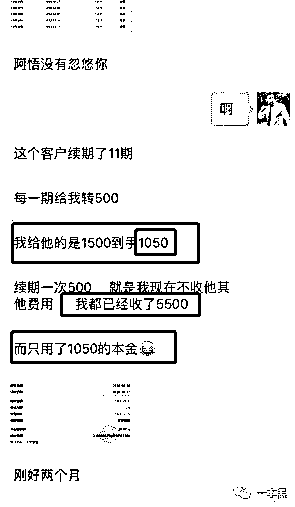
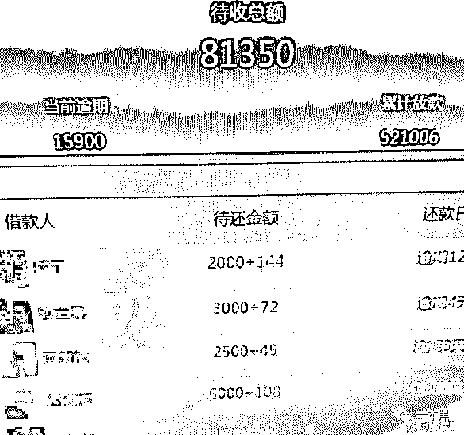
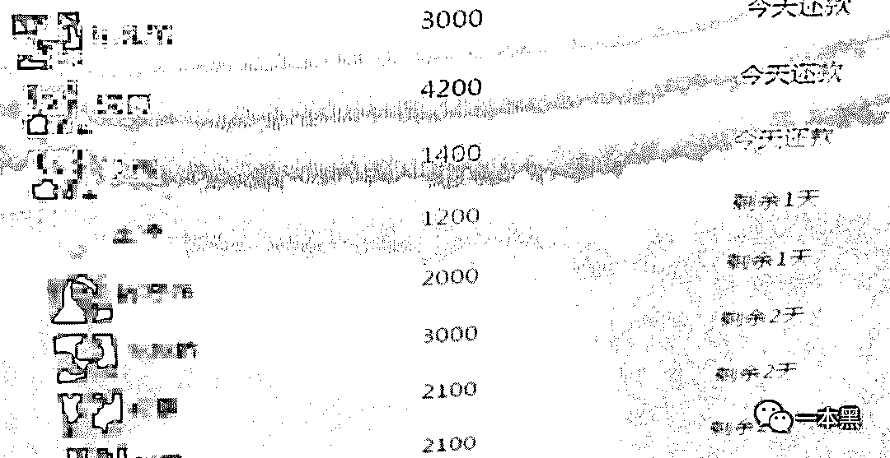
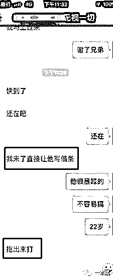
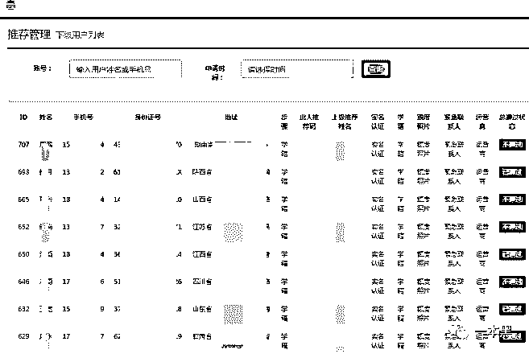
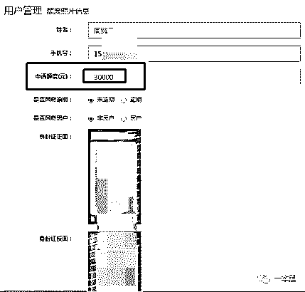
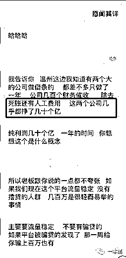
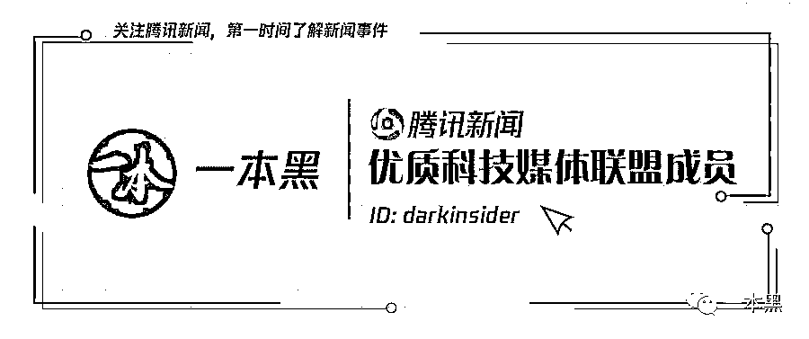

# 做借条、搞放贷，一年收入十几亿，不还钱就把你运到缅甸赌场

> 原文：[`mp.weixin.qq.com/s?__biz=MzU4ODAwNzUwMQ==&mid=2247484677&idx=1&sn=70d85fefdd0894cf624e0b52a39361b1&chksm=fde21427ca959d314759a8abe4083af1592e3f4ae67b34f6557ab7c771e24773d6bcbe55802e&scene=27#wechat_redirect`](http://mp.weixin.qq.com/s?__biz=MzU4ODAwNzUwMQ==&mid=2247484677&idx=1&sn=70d85fefdd0894cf624e0b52a39361b1&chksm=fde21427ca959d314759a8abe4083af1592e3f4ae67b34f6557ab7c771e24773d6bcbe55802e&scene=27#wechat_redirect)

  

几个月前，我在知乎看到一个题为**“为什么会有女大学生选择裸贷”**的话题，其中一位匿名答主的回答引起了我的注意。

他的回答并不是讨论那个曾经 10G 的网贷照片和视频，也没有过多的谴责金钱给他们带来的诱惑。

而是以一名网贷从业者的身份剖析了行业黑暗，后来我联系上他，在断断续续将近一个月的采访中，他不仅告诉我网贷行业的种种套路，也给我讲述了一系列触目惊心的案子。

比如说有人因为还不上高额贷款被非法拘禁、甚至还被运到缅甸赌场，赌场给受害人家里要钱，规定时间不还直接卸掉一条腿，再不还就拉到路边分尸。

还有一些倒霉的女性借款人，甚至会被运到老挝等地卖淫还款。

这些都是真实发生的事情，我不知道讲述者的名字，这里暂且叫他老吴吧，老吴告诉我之所以想揭露民间借贷行业是因为良心过不去。

他的原话是：**“经常做噩梦，经常担心自己会把学生逼死，全国几千上万个学生贷的老板，真的很恐怖。”**

老吴最后给我说，18 年年后他退出贷款行业，所有没还钱的客户都没让他们还，从业赚的 200 万都用来回报社会了。

他只希望能有更多的人看到套路贷的黑暗和丧心病狂，告诫学生以及众人，远离校园贷，远离民间借贷。

**以下内容节选自套路贷从业者口述事实**

我当时每个**月赚四五十万**，还是在公司只有**三个人**的情况下。

主要做的是校园贷，具体名字这里就不说了，说好听点叫校园贷，但本质其实就是套路贷款和裸贷。

高利贷之所以叫高利贷就是因为它高额的利息，这里要说的套路贷**周利息是 30%**，**先息后本**。

别看这 30%和坊间所说的三分利差别不大，他周利息的玩法加上先本后息简直就是吃肉不吐骨头，能把你玩死。

打个比方，假如你找我**借 1000**，我给你的钱**到手只有 700**，一个星期后你还是得**还我 1000**。

借 2000 的话我就只给你 1400，但一周后你得还我 2000，这就叫先息后本，以此类推。

但是问题来了，假如一周后你还不上钱怎么办，没关系，你给我利息，我让你延续一周后还，也就是说你借 1000 到期还不上你交 200 的延期费，下个周再还就是了。

可如果再过一星期你还是还不上钱呢，没事，大家都是朋友，你交个延期费我再给你延续一周。

        

也就是说，假如你借了一万块，一直延期还不上全款的话，每个月光是利息就有一万二，这个利息得一直到你能一口气掏出全款为止。

当时我有一个客户借了 4000，按照 30%的先息后本他**只拿到了 2800**，但这哥们就是一直还不上钱，延期延了快一年，加上每次拖两天的逾期费，**最后总共还了我接近两万**。

  （图片由口述者提供）

可能很多人会说，这么高的利息和玩法明显是套路嘛，对啊，不然人家怎么能叫套路贷呢！

其实这种利息的贷款对正常人来说他们一般不会主动来借，而更多的是被骗来的，当然不是放贷人骗，而是中介。

搞这种民间借贷的会给中介很高的费用，一般给十五个点。

就是客户借 1000 块，到手其实只有 700，我们会给中介 150，我自己再拿 150。

我们一般首期只赚 150，主要赚的还是后期的续期费，所以中介会以各种理由骗学生来借钱，**这个星期借 2000，下个星期还不上，我们就会给他再放一笔 1000 到手 700，到手的 700 就给我们做利息。**

**也就是这个星期不还钱，但他多了 1000 块钱的条子，一直这样循环下去，只要还不上，每个星期都给他打个条子当做利息。**

**       **

除了这种被中介套路骗过来借钱的学生，当然还有自愿来借的。

很多人会骂这些学生脑子是不是坏了，这点分析能力都没有吗？其实并不是他们不懂得分析，而是他们被物质迷惑的时候根本就没想到去分析。

经过我手的学生客户算起来有四位数了，百分之九十以上都是主动找我借钱，我也没有骗他们利息低或像中介那样去套路，他们也都不是第一次借了，然而却借得乐此不疲，大多数人钱到手后还很亲切地叫我一声哥。

借钱的人男女各占一半，至于他们为什么借就不用多想了，男生借钱基本上是为了开房泡妞谈恋爱，也有玩赌的，感觉能翻盘想刚一把狗庄。女生的话基本是为了满足虚荣心。

对了，有一种没借过贷款平台钱的客户，我们叫白户，这种白户我们能从他身上套出来几万块钱。

就算他只借一两千，我们也有办法让他在我这里打三四万的借条，当然，这三四万也只有最开始的一两千属于自己，剩下的都是用来还利息的。

        

（这个是之前去要债，没有借条，就把人抓住，关起来逼他写借条，欠一万，逼着打了五万的借条）

所以，一个没有什么经济能力的学生只要碰上这种借条平台，他是不可能靠自己走出来的，只要借一千，一个月之内绝对会欠上万，每个月的利息都超过本金，要想结束就得一次性还款，哪个学生能承受得住。

**不还钱？先砍掉一条腿**

总的来说，这种平台每个月的收益情况是本金可以翻 2.8 倍，平台有审核资料的审核员，每个审核员每天能接到三四十个学生来借钱，最后审核下款的只有七八个，审核员越多，客户也就越多。

         

这是老吴做贷款业务之前用来审核放款的后台，里面记录着上千个学生的个人信息，包括手机号、身份证照片、学生证、父母手机等。

里面展示了每个学生的详细信息以及申请贷款的额度，从里面可以看出，每个学生申请的额度悬殊很大，从最少 1000 块到最多五万块不等。

        

入行期间，我平均一个月能下款 200 多人，死单百分之十五，就是百分之十五的人不还钱。 

对于这种死单来说，一开始逾期的话我们会先打电话给他的父母，因为借钱的时候要拉他半年的通话记录，不还钱就一个个打电话，家人不管的话就搞电话或者短信轰炸，用软件一般一天打一万个轰炸电话。

至于电话轰炸结束后还是不还钱的，我们就会找当地的催收上门要钱，学校找不到人就去他家里，当时有个学生直接就割腕了，还有个喝农药的，这事儿还上过新闻。

但是即便是事情闹得这么大，对平台是没有任何影响，因为是民间借贷，不涉及刑事责任，所以家属起诉也没用。

只要我们没有碰那个客户，没有打他，按照法律他得还钱。

之前有个学生报警，说我们是高利贷，警察说，你自己借的钱，签的合同，这事儿不归我们管。

其实这可能就是当时民间借贷得不到打压的原因吧。

        

有很多放款的老板，喜欢放款给长得好看的女学生，要多少放多少，其实这种公司一般都做得比较大，并且他们和很多黑产有合作。

假如一个女生借了一万，到期还不上，这些放贷的老板就会让她去做外围，外围就是高端的鸡，基本上都是学生。

如果这个学生不愿意那就到他家里去要钱，做外围的话，那些外围老板会直接帮她还钱，给她们开出的条件也很好，每个月最少能赚八万。

可能很多人还在关心当年的裸贷事件，其实裸贷这东西，现在基本上没有老板敢放了。

借裸贷的学生，大部分都是为了还其他贷款的利息，因为她们除了裸贷没办法借到钱，走投无路，又不能拆东墙补西墙，只能选择裸贷。

我当时放过三次裸贷，有一个客户没还钱，说白了敢借裸贷的，基本上已经做好不还钱的准备了，后来我也没有群发她的照片，觉得太辣眼睛也就删掉了。

其实网贷圈子大多都是 20 多岁的年轻人，全国放款的老板大部分我们都互相认识，有些人做放款干得那叫一个绝。

有些公司放款的额度比较大，一个客户可能放十万二十万的，这种客户不还钱的话，他们先是找人去家里，**二话不说，都不给你说话的机会，上去就捅两刀。**

我之前有一个合作的老板，他有几个客户不还钱，直接把人就运到缅甸的赌场，每个人都被脱掉衣服和鞋子，只剩一条内裤，几个人被手铐拷在一起。

让他们挤在一间很小很暗的屋子里，里面连床都没有，每天有人轮流守着。

被运到这里的人想睡觉基本是不可能的，两三天就只让你眯眼几个小时，如果你太困想躺下，那些人就是用竹条或者皮带使劲抽打。

期间就对着他们录视频然后发给家人逼他们拿钱赎人。

更恶心暴力的画面就不描述了，总之就是用各种方法逼他们的家人还钱。

当然也有那种“宁死不屈”，家人也不管的，对于这种情况他们要么就先砍条胳膊卸条腿什么的，要是还是不给钱，直接拖到小路边就杀了。

有一次我去他公司，还亲自目睹他非法拘禁一个大一学生，我当时还让那孩子找机会跑，可那孩子感觉都吓傻了，一个劲的发抖。

其实，没有接触过这种套路贷的人会说有这么可怕吗？那是因为你不了解，你还没有踏入这个圈子，等你真的走进这个圈子，你会发现，这里面有你想象不到的黑暗和恐怖。

              

上述节选了部分采访老吴的内容，其实还有一些更加残暴的事件这里并不合适讲出来，因为可能会涉及到老吴身份的问题，所以也就到此打住。

但并不影响各位了解套路贷的种种黑暗。

我并不会过多在意老吴曾经的身份如何，我想知道的是行业真相。

也许只有真相，才能给予警示吧！

**借贷圈子的黑暗不止于此，仅以此文带你窥探。**

**也仅以此文，带你远离。**

还原事实｜专扒黑产

微信 ID：darkinsider

知乎 一本黑

头条 一本黑

投稿、爆料、招聘、转载

请联系微信:yibenheiTG

本文在腾讯新闻独家首发，未经授权，请勿转载，违者将被追究法律责任。