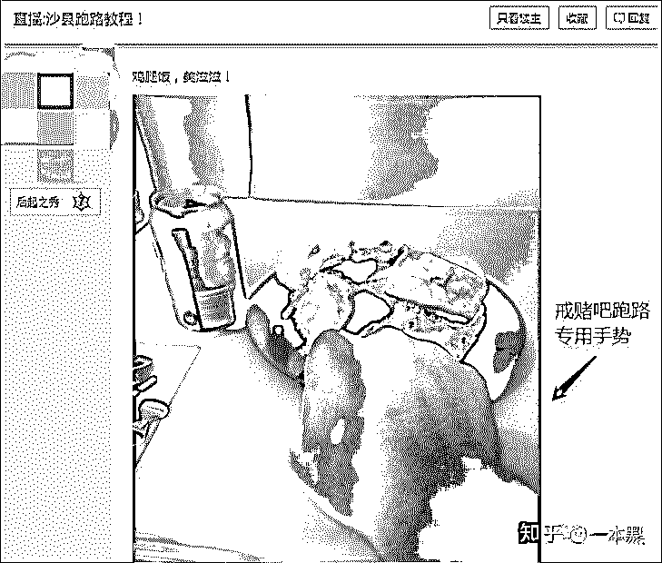
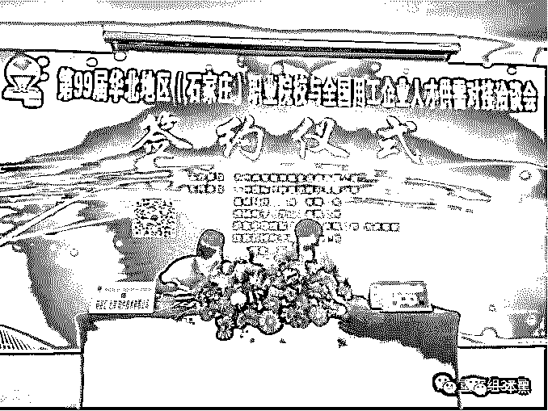
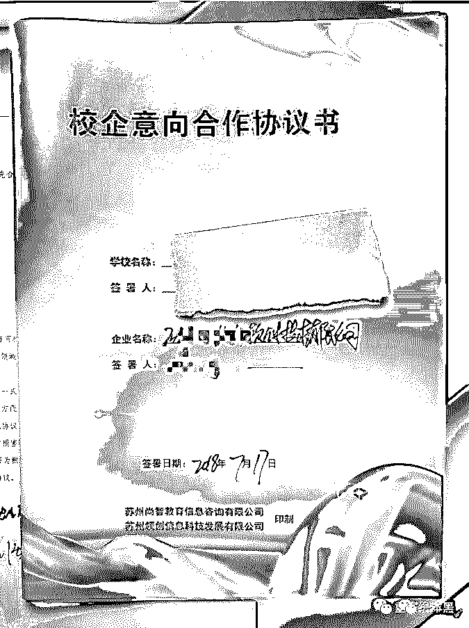

# 撸口子“白捡”14 万，赌输就跑路，一场只能靠不停借钱才能续命的荒诞闹剧

> 原文：[`mp.weixin.qq.com/s?__biz=MzU4ODAwNzUwMQ==&mid=2247484648&idx=1&sn=41a4aa78fbb92ef16408b93559c88ff1&chksm=fde215caca959cdcfb5ffe9034cb30bcc177099f33f6f26aa08d0aa060d391be98f84a416acc&scene=27#wechat_redirect`](http://mp.weixin.qq.com/s?__biz=MzU4ODAwNzUwMQ==&mid=2247484648&idx=1&sn=41a4aa78fbb92ef16408b93559c88ff1&chksm=fde215caca959cdcfb5ffe9034cb30bcc177099f33f6f26aa08d0aa060d391be98f84a416acc&scene=27#wechat_redirect)

“追债的人就堵在校门口，我翻墙拼命跑，不知跑了多久，大致觉得安全了，才发现鞋跑丢了一只，额头也磕破了，快入冬的温度，路人都是围巾手套，我花 10 块钱买了双人字拖，站在寒风中，一边跺着脚，一边拿着手机继续撸口子，打算再赌一次，把本赢回来。”

小凯大概回想了一下当时的欠款金额，9 个平台，加起来差不多 14 万，这对于一个大二在校生来说，无疑是一笔巨额债务。

“本来没想告诉家里，觉得自己有能力赢回来，谁知有个借贷平台的中介，给我妈打了催债的恐吓电话，扬言一周内再不还钱，就要剁我一只手，我妈吓坏了，凑钱把欠款全还清了，我才结束跑路。”

回忆当初持续两周之久的跑路经历，小凯说，赌徒的跑路，就是一场荒诞的闹剧。

**「赌徒跑路：一路向南的疯狂」**

接触赌博的原因千千万，但过程却惊人的相似，都是偶尔小赢和频繁大输的无限循环。

在赌博圈里，现金贷被称为口子，撸口子就是借钱的意思。

对于家境一般的赌徒来说，撸口子是家常便饭，因为借现金贷最方便，线上申请，下款快，万一碰上个风控差的，简直美滋滋。

借出的钱马上拿去赌，输完了换个平台继续借，慢慢的，就形成了拆东墙补西墙的局面，大多数赌徒都是靠以贷养贷来续命，但十赌九输，能还上钱的寥寥无几。

一旦逾期未能还款，借贷平台的催收大戏就开场了。

最常见的手段就是轰炸通讯录，用"呼死你”让手机通讯瘫痪，发送污言秽语的短信、邮件给亲戚朋友，上门喷漆、堵锁眼等手段也是屡见不鲜。

当赌徒们预感到夺命催债即将来临的时候，为了争取尽可能多的时间获取资金，翻盘扭转局势，跑路就成了上上策。

大多数赌徒的跑路，都是场一路向南的疯狂。

为何一路向南呢？北方，四季分明，春夏秋冬装缺一不可；南方就不一样了，一件短袖就能熬过 300 天。

对于处在躲债路上的赌徒们来说，追求“高性价比”的生活，就显得尤为重要，而疯狂也随之而来。

人是铁饭是钢，吃的地位自然不容小觑。在极度缺钱的情况下，足量、价低、易逃单的饭馆，就成了赌徒们吃“霸王餐”的最佳选择，还顺带衍生出了跑路专用手势。

经圈子里多位跑路前辈的多次亲身验证，遍及全国各地的沙县小吃，以量多价廉、饭后买单的经营模式，获得圈里人的一致认可。

若逃单成功，这就会是赌徒们互相交流的谈资之一，言语间都带着自豪的味道；若逃单失败，赌徒也会反思整个过程，争取下一次的成功。

慢慢的，防备这些赌徒有计划、有预谋的逃单，成为了一场众多沙县小吃老板参与其中的大型烧脑游戏。

后来，沙县小吃重整了行业规矩，改成了先买单后用餐。

但值得一提的是，跑路和携款出逃可不一样，不是所有跑路的赌徒，手里都有余钱，能进入餐馆、小旅馆，还有一大部分的赌徒，欠款金额大、又消耗完了亲情友情，根本没钱进饭馆。

他们会辗转在各个连锁快餐厅里，寻找客人未吃完遗留在桌上的食物，一来二去，能品尝到的种类倒也不少。

至于休息，天为被、地为床，公园里，广场上，处处皆可。

在充满考验的跑路过程中，可以馒头没咸菜，可以桥下没铺盖，但想撸口子的欲望，却一刻都未停歇。

应用商店里的借贷软件，逐个尝试，碰到新上架、风控又差的借贷平台，借出个几万，简直就像入洞房一样兴奋，金额入账的声音盖过了肚子的“咕咕”声。

要是借不出这么多，几百几千也乐呵呵，毕竟都是翻本的潜在机会。

到这儿，借、赌、输的圈儿，算是合上了。

记得曾看过一个小测试，从吃饭顺序能看出一个人是否乐观。

如果吃饭的顺序是从不爱吃到爱吃，说明乐观属性强，因为接下来的每一口，都会越来越享受；如果相反或者不一定，说明或多或少的掺杂着悲观属性。

如果以上结论可作参考，那赌徒、无疑算得上是数量最为庞大的乐观群体了。

他们坚信过往的失败已经用完了所有的坏运气，只要再多试一次，就能咸鱼翻身。

可惜，只要赌，就逃不掉久赌必输的魔咒。

何为久赌必输？武林外传是这么说的。

“人总说，小赌怡情，大赌伤身，我倒觉得，赌就是赌，没有大小，因为，赢了的还想赢，输了的就想翻盘，一旦赌得性起，就什么都顾不上了，只要上了赌桌，不管赌术高低，身家大小，不玩到倾家荡产谁也别想收手，所以！叫久赌——必输啊。”

那个年代的人，大概想不到会有“倾家荡产不算事儿，网贷平台来相救”的一天吧。

不过，这些频繁借贷的赌徒们，最后几乎都会变成“网黑”，无法再通过网贷平台借钱。

现金贷，是个嗜血的怪兽。

**「被封的戒赌吧」**

人本是群居生物，会因需求而抱团在一起，赌徒们也一样，基于相似的经历和处境，他们创建了一个空间，叫戒赌吧，宣扬“赌博埋葬过去，奋斗成就未来，一起戒赌吧”。

梦想很丰满，但现实却骨感的不像话。

首次接触戒赌吧的人，第一感受恐怕不是励志，而是荒诞搞笑。

吧里的人互称老哥老姐；欠债的入门单位是万，叫做“个”；共识是“凭本事借的钱，怎么能还？风控不好怪我咯？”；人人都想努力一把，将清债叫做“上岸”；可惜，结果大多是继续输，这是被“洗白”。

戒赌吧最大的特色，是直播，也因此流传出很多段子和朗朗上口的戏语。

洗白的老哥们，最爱去“官方指定用餐点”-沙县小吃享受一顿，并在吧里直播跑路情况，吧里一度还出现了众多的跑路教程。

除了直播跑路，还有直播“修车”，也就是约或嫖，有戏语称“当初修车不直播，如今出事找老哥”。

吧里的“瘫痪”直播，也颇有意思。洗白后的老哥们两手空空，无所事事，便在贴吧里交流瘫痪心得，当然，不同地方不同瘫痪，这也有教程。

戒赌吧，是个刀光剑影的江湖。

那些在帖子里宣称能带赌徒上岸的人，基本都是骗子；为边境赌场发帖的签单经纪，只考虑自己的抽成，根本不在乎赌徒还不上本金利息后的死活。

这里不仅有专业放口子，想进一步拓展业务的人；还有看了媒体报道觉得新鲜，专门来找乐子的人；更多的是沉沦在输赢中，想脱身却下不了决心，一再为自己的复赌寻找借口的人。

哪里的赌博是赢多输少的？幻想里，尤其是刚拿到赌资的时候，信心最盛。

“谁家小孩天天哭，谁家老哥天天输。”

在吧里，跟家人坦白，家里帮忙把坑填平后，反而变本加厉继续赌的人，不计其数。

就像天天嚷着要减肥的人体重大多都不超过 100 斤，真正想戒赌的人根本不会来这里，赌和毒一样，最难戒的是心瘾。

一个不想醒的人，谁也无法叫醒。

今年 6 月，有着超过千万吧友的戒赌吧，被封了。

作为赌徒，除了贷款中介，怎么会有朋友？他们只能把情感寄放在戒赌吧里。

但封吧后，那些曾聚集在吧里，将各自的悲苦聚合成一场狂欢的老哥老姐们，一夜之间，便脱离开曾经的感情网，成了孤立的个体，曾经的荒诞搞笑，曾经的互相帮扶，都已不在。

因互联网而维系的情感链接，有时候真的很脆弱。

纵然悲哀，但每个群体，都需要自己的精神食粮。

**「博彩公司的“校招”」**

一入赌博深似海，从此借钱难上天。

基本丧失了通过网贷平台借钱资格的赌徒们，大多都被心中“下一把准赢”的仙气吊着，想尽办法到处筹钱，这种心思，被网络博彩公司盯上了。

作为亚洲网络博彩合法的国家，菲律宾的博彩业异常发达，但尽管如此，这依然是一片灰色地带。

在菲律宾，大部分博彩公司的老板是华人，考虑到语言沟通等问题，员工也基本都是华人，加上行业的暴利营收，博彩公司的薪资水平，与当地相比，偏高的不是一点半点。

一个缺钱，一个缺人，“双赢”，这种局面下，招聘成了重中之重。

这些博彩公司与劳务中介合作，招聘披着海外推广、游戏客服等外衣，除了社交平台外，也遍布国内的正规招聘网站。

(图片来源于网络）

福利待遇等都有保障，下班还能游览当地风景，怎么想都是赚，很多人跃跃欲试。

但广告和现实之间，隔着买家秀。

招聘广告中轻描淡写、甚至只字不提的岗位职责，其实就是骗人下注；

护照上交，工作时间内手机需交由公司保管，员工间不允许通过微信等社交软件私加好友，除厕所外，大楼和办公室的每个角落都遍布摄像头，公司还会安排人员进行频繁的突袭检查；

每天至少 12 小时的工作时长，上厕所、吸烟等与工作无关的事情，都有严格的时间限制，超时就会被扣工资；

提供的餐饮和住宿，也相当简陋。色香味不全的菜品，勉强吃得饱，狭小无窗的宿舍，摆满了高低床，彼此间也没有太多交流；

若是做了违反公司规定的事情，除了挨打，还会被关进暗无天日的小黑屋，根据情节严重程度，1-7 天不等；

受不了想离开也可以，前提是要交一笔数额不小的违约金，交够了，公司立刻会安排车辆，将离职员工送往机场，过了安检才会离开；

如果是在无牌照的黑博彩公司上班，就算自己能忍受这一切，但因为无法获得工作签证，随时会面临被警方清查后遣返回国，并接受参与赌博违法犯罪的法律制裁。

更可怕的是，网络博彩公司的招聘目标，已经瞄准了即将毕业的大学生。

据新京报之前的调查，一些劳务中介，打着科技公司的招牌，堂而皇之的与部分大中专院校合作，欲送万名应届生出境从事博彩相关工作。

(图片来源于新京报）

据调查，多所院校已确认与某劳务中介合作，并已签订校企意向合作协议书。

(图片来源于新京报）

“强强联手”，博彩公司的校招就能名正言顺的开展，千万个家庭费心栽培的子女，在即将迈入社会、开启人生新阶段的时候，却被蒙在鼓里，成了劳务中介和博彩公司谋取利益的棋子。

不管是童年还是成年，人生总是如此艰难。

赌博的根本，在于求而不得，舍而不能。 

赌海水深，早点上岸，才能踏踏实实品味沙县小吃，千万别惦记着催收平台的低还款率，认为扛过去就万事大吉了。

要知道，道高一尺魔高一丈。

借贷平台的催收员中，温柔小姐姐的比例在逐渐上升，你也许抗得过声线粗犷的抠脚大汉，却可能败在小姐姐的一声“小哥哥还钱好不好嘛”的娇柔声里。

强赌灰飞烟灭。

还原事实｜专扒黑产

微信 ID：darkinsider

知乎 一本黑

头条 一本黑

投稿、爆料、招聘、转载

请联系微信:yibenheiTG