# 凶残！5 分钟骗 2000 块，现在干黑产的都这么猖狂了吗？

> 原文：[`mp.weixin.qq.com/s?__biz=MzU4ODAwNzUwMQ==&mid=2247484628&idx=1&sn=f6f1aa0ac0e3287868fd8eaa1e89a9d2&chksm=fde215f6ca959ce0f02fa65eb784d18ea6a5fcad0dcb77e9411da335993b2743679b8a5ad670&scene=27#wechat_redirect`](http://mp.weixin.qq.com/s?__biz=MzU4ODAwNzUwMQ==&mid=2247484628&idx=1&sn=f6f1aa0ac0e3287868fd8eaa1e89a9d2&chksm=fde215f6ca959ce0f02fa65eb784d18ea6a5fcad0dcb77e9411da335993b2743679b8a5ad670&scene=27#wechat_redirect)

贪小便宜是人类的共性，这一点自古以来就被无数次论证，也不能怪大多数吃亏人不理智不清醒，确实是这个世界套路太多。

看一本黑的各位理应知道一句话：“最赚钱的道，都写在了宪法里”。确实如此，但依然还是有人在这条路上前赴后继，你追我赶。

假货横行，套路当道，比起以前的坑蒙拐骗，如今的骗局不可另当别论，即便是再高级的科技犯罪，时下里其实都是**土鸡瓦狗，不值一提。**

在广东话中，目标可以被称为“鱼”，一般是指容易上当受骗的人。这里的鱼大多指代王八、甲鱼（学名叫鳖），因为他们外貌看起来笨笨的，所以用来形容被骗的受害者。

而鱼通常生活在水里，有一种鱼外壳柔软，从水里拿出来一按就出水，在广东话里，“水”可作为“钱财”来理解。

**但鱼水之欢，远不及土鸡瓦狗。**

网上黑灰产项目很多，要么薅薅羊毛，要么坑蒙拐骗，前提是得有机器和网线。当然这些都不在话下。

坐在电脑前他们就是“土狗”，穿针抛食，引鱼上钩，太多人做着这种“杀鱼”的生意。

不知道各位还记不记得我去年写过的二手交易平台上的两个套路——买家套路和卖家套路。有兴趣的可以去回顾回顾——(直通车——[“我在闲鱼被人用假链接骗了，对方月入二十几万，还说是辛苦钱！”](http://mp.weixin.qq.com/s?__biz=MzU4ODAwNzUwMQ==&mid=2247483985&idx=1&sn=f89e4e2db22a59a2aab4664225b9d708&chksm=fde21373ca959a65b3c2de1de760126e2d696e42d8c93d7a2c6acf0528fc1ccf6d6e9ef76567&scene=21#wechat_redirect)）

在当前的二手交易市场下，闲鱼和转转算是打得比较火热的两家，不管是建立壁垒还是“撒尿圈地”，都小有“楚汉争霸”之态。

但拼多多的崛起着实给了两家当头一棒，都是省钱的交易，拼多多就像路边摊，不仅接地气，还花不了几个钱，你说气不气。

可即便是这样，二手交易平台里照样有黑产的奶油蛋糕，毕竟鱼群太多，空勾甩杆都能钓上几条大鱼。

也就不难解释为什么会有那么多的骗人套路。

**二手平台****不安全？买个手机都能被骗**

本文着重讲解存在于二手交易平台【转转】里的诈骗套路，看这些土鸡瓦狗到底是如何做到在五分钟就能骗 2000 块的。

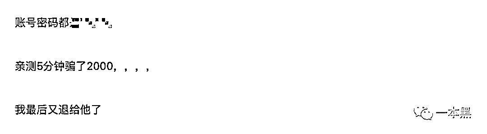

首先，不管是闲鱼还是转转，这些搞诈骗的只会通过卖手机的方式去钓鱼，一般都是品牌二手机，8 成新以上，以苹果手机和主流安卓机居多。

因为转转可以用第三方微信直接登录，所以他们先用大量微信号登录转转，然后在账号里发布出售的商品，发布手机的图片、简介直接从平台上别人发布的真实商品复制过来，去掉水印就好了。

发布成功就等于鱼竿上了食，接着坐等买家上钩咨询。

因为转转上是很严格的，没办法在聊天中或图片上留微信等相关字眼，只要一留就会有风险提示。

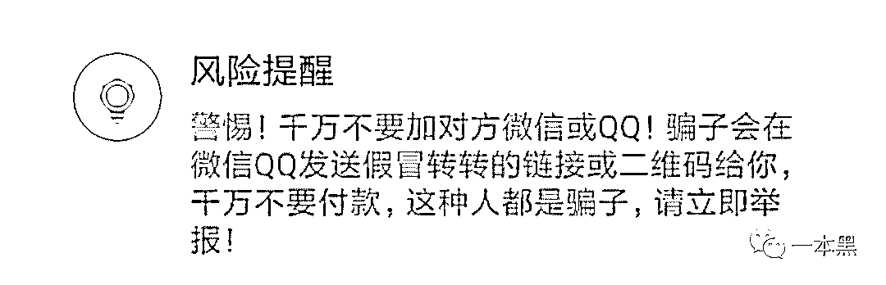

所以他们一般在转转上不会有太多沟通，只会简单说几句，比如说“这个手机我是替朋友发布的，具体我也不清楚，这是他微信 xxxxxxxx，你问他吧”。

其实这一步主要是为了把鱼引到自己的网里，之所以这样做是为了规避转转官方的实名控制。

引流到微信上以后，开始谈价格，如果价格谈好了，对方会给买家一个链接。

一般都会以某种理由给买家降价，因为好有借口去把之前转转上发布的商品下架，转而对方就会在微信上给买家发送一个链接，这个链接点开以后和之前转转上的商品一模一样，可直接用微信登录付款。

一般不知道这个骗局的人都会上当，因为这个链接是个假链接，它并不是转转官方的商品链接，而是骗子事先制作好的。

到这一步，一旦买家付款，钱就会直接到达对方的点卡账户，只要钱一到账，那这个骗局基本上就完成了，你就只能等着被对方删除。

**买号诈骗，收入能赶上马云？**

其实这样看来，整个骗局并不复杂，但是在骗子眼中，他们还得做很多前期准备和铺垫，才能天衣无缝的完成一单又一单的骗局。

前面提到他们会购买大量且高级的微信号，所谓高级的意思就是注册有一定时间的老号，这样发布出来的商品更能让人信服。

微信号还可以买卖？不知道了吧。

首先，转转是需要微信登录的，所以转转号就是微信号，通过大卡商买来的微信号，国内外的都有，都是实名的。这些号的实名则通过卡商购买的身份证号，银行卡完成。

一般一个实名的微信号和转转号可以卖到 50-100 不等，有一群专门做号的人，工作内容就是养号，这些号一般批量出售给灰黑产从业者，用于薅羊毛、发布消息等用处。

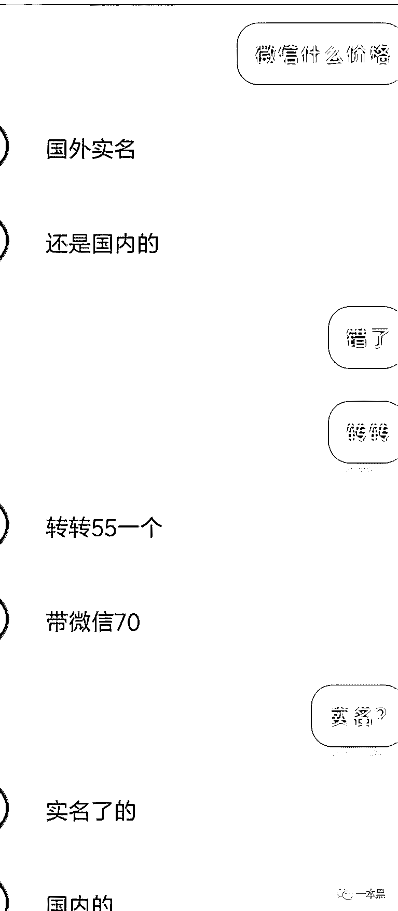

曾经一个爆料人给我说，这些搞二手平台诈骗的，一个号做得好一天能有个上万的收入，他们会事先购置几十上百个号进行管理。

一开始我觉得几十上百个号少了点吧，结果他说：“上千的话，收入赶上马云了”

**现在干黑产的都这么狂妄了吗？**

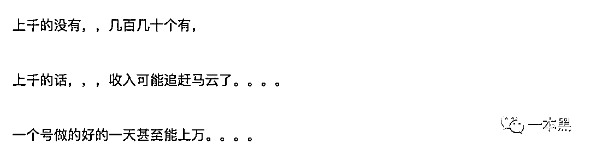

可能有人会问了，操作几十上百个号发布商品岂不是很麻烦，对于这一点骗子们当然不会傻乎乎的一个个操作，现在什么年代了，做事都讲究效率，黑产也有自动化工具啊。

所以，他们有一种软件可以批量发布商品，并且还会对商品进行刷新、点赞、评论等。

老师傅曾说过：“在软件里制作好数据后，利用模拟器，用脚本工具实现自动上传；人工怎么操作，脚本就怎么操作。”

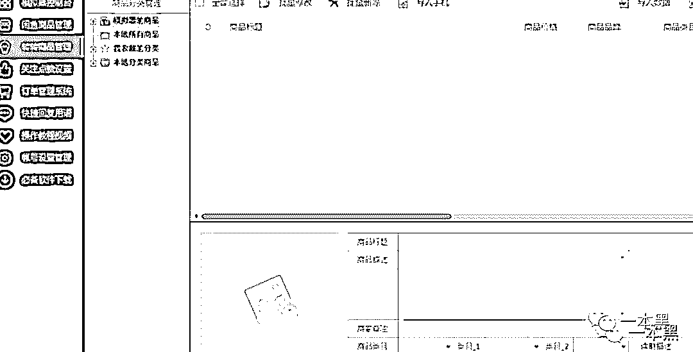

这还不算完，为了能钓到天南海北的鱼，他们还能对发布商品的账号进行 IP 更改，这样就能让各地区的“鱼”都能看到，也增加了鱼上钩的可能。

其实改 IP 最主要的目的是为了骗子自身的安全。

**假****链接轻松做，诈骗收入轻松洗**

上面提到把买家引流到微信上后会通过改价的理由把原有商品下架，再给买家发送一个链接。

这一步可是骗子最关键的一步，成败就在此。

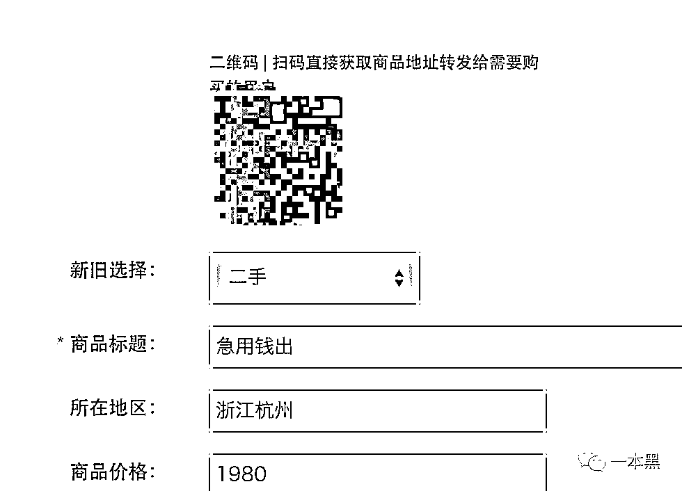

（骗子直接在后台扫描这个二维码发给买家）

而这个来路不明的链接究竟是如何制作的呢？经过老师傅一根烟的功夫，我们发现了猫腻。

原来这种假链接可以在后台轻松制作完成，包括商品标题、地区、价格、浏览量、图片等都可以任意修改，一键完成。

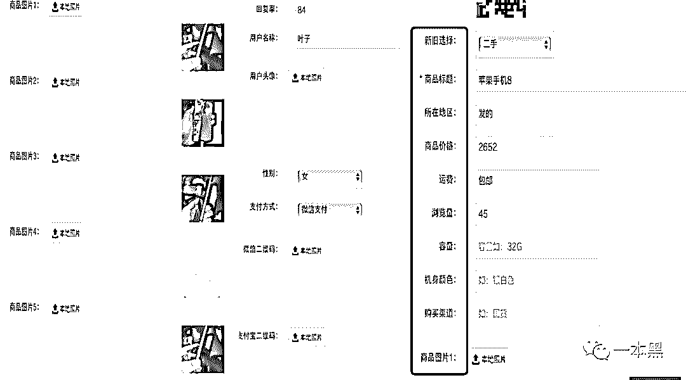

但最关键的不在这，而在于支付通道。

在以往的骗局中，骗子制作的假链接得通过扫描二维码的方式付款，可现如今早已升级。可以设置支付的地址。

这里的支付地址可以是点卡的支付地址，这个地址怎么来的呢？

打个比方，我在某点卡充值平台采用微信扫码的方式充值，扫描以后取消付款，然后就可以复制该支付地址。

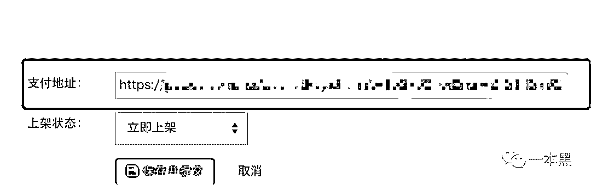

只要把该支付地址填写到商品制作的模板中，当对方支付的时候，所支付的钱就会变为购买的点卡充值到对方账户。

简直神不知鬼不觉，买家被骗后完全不知道自己钱款的去向，等找到转转客户询问时才发现，自己点开的链接居然是个“李鬼”。

买家被骗的钱变成点卡充值到对方账户，这时候又一新角色出现——**银子商。**

所谓的银子商就是专门从事虚拟货币与人民币兑换结算的一群人。比如一个赌博网站，“银子商”从赢家手中以一定折扣收购虚拟游戏币，然后银子商再以赠送的方式把游戏币卖给买家，以低买高卖的方式从中获利。

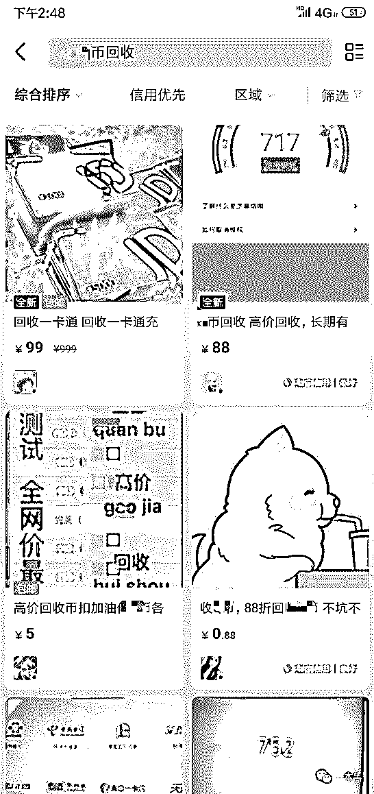

（平台上随便一搜就是大把的银子商）

买入和卖出之间，银子商赚取源源不断的差价。

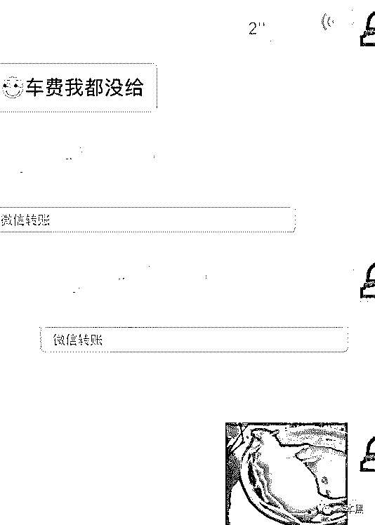

（某银子商交易截图）

在这个骗局中，银子一般会以 7 到 9 折的价格来收购这些点卡，骗子从而把点卡变现，成功洗白，银子商再把点卡在卖出，从中赚取差价，二者实现双赢。

至此，整个基于二手平台转转中的骗局套路已清晰可见。

骗子通过卡商大量购入转转账号，然后用软件助手批量发布商品吸引预购人群上钩，利用话术把买家引流到微信上，再把提前制作好的假链接发给买家。

买家支付的钱款会以购买点卡的方式进入骗子的账户，骗子为了洗白找到银子商，银子商通过一定折扣价回收再卖出，骗子也就完成了从钓鱼到洗钱的整个闭环。

整个骗局链条中涉及**贩卖账号的卡商、假链接开发者、回收点卡的银子商**。环环相扣，黑产与黑产之间默契配合，互利共赢。

在广东话中，目标可以被称为“鱼”，一般是指容易上当受骗的人。这里的鱼大多指代王八、甲鱼（学名叫鳖），因为他们外貌看起来笨笨的，所以用来形容被骗的受害者。

鱼通常生活在水里，有一种鱼外壳柔软，从水里拿出来一按就出水，在广东话里，“水”可作为“钱财”来理解。

但鱼水之欢，远不及土鸡瓦狗。

****而土鸡瓦狗。****

****也早晚有被宰割的时候。****

*****本文与【科技每日推送】联合发布*****

***一个有趣、有温度的科技媒体***

**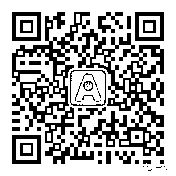**

**投稿、爆料、招聘、转载**

**请联系微信:yibenheiTG**