# 中国也有暗网，据说只在公厕才能连接

> 原文：[`mp.weixin.qq.com/s?__biz=MzU4ODAwNzUwMQ==&mid=2247484596&idx=1&sn=4bb123d363f549ee5317960e8654a450&chksm=fde21596ca959c80c400a0d55e896015a58d5b667acaf40cd2c256ab636463a2d2913e78604b&scene=27#wechat_redirect`](http://mp.weixin.qq.com/s?__biz=MzU4ODAwNzUwMQ==&mid=2247484596&idx=1&sn=4bb123d363f549ee5317960e8654a450&chksm=fde21596ca959c80c400a0d55e896015a58d5b667acaf40cd2c256ab636463a2d2913e78604b&scene=27#wechat_redirect)

本文由【跳海大院】授权转载（ID:meerjump)

暗网早就不是什么新鲜词了，但关于暗网的传说从未消失。

某搜索引擎说那儿交易着世界上所有的罪恶。毒品枪支不过是市场里的大白菜和胡萝卜，人口贩卖以及买凶杀人才是最抢手的尖货......

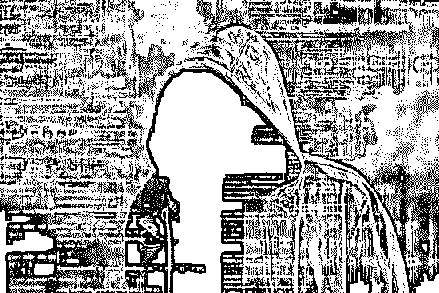

那儿还聚集着几何级数量的窥阴癖、恋童癖、兽交癖、施虐癖，什么什么癖...他们每天在各自的社区里，激情四射地讨论着各种变态行径......更惊悚的是，由于匿名性，暗网就像是一个法外天堂。

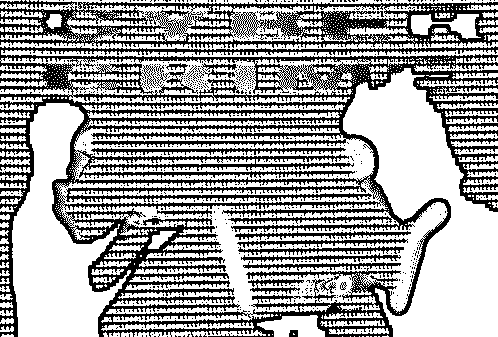

根据网络传言，上暗网的人必然也多半是头套丝袜的恐怖份子

真实的暗网，其实或许并不像“明网”里渲染的这般黑暗。但正如院长所说，**大家的 high 点是在于，认识到了原来世界上还有一个这样的“罪恶避风港”**。

**Fine**

不过，在现实世界里，好像也真的存在着类似暗网一样的东西呢。

**公厕门板就是现实版暗网**

暗网，“爬虫”进不去的特殊链接网站，自由的互联网乌托邦，罪犯的天堂。匿名、隐秘、分散、见不得人的交易......当把这些特征拆分出来，**你不觉得，打开一道内含不可言说的小广告的公厕门板，就像是浏览了一次至暗面的暗网么？**

二者的区别在于：上暗网需要网络技术能力；上公厕，你可能需交 5 角钱人民币。

**更何况，暗网搞的是动态链接；你上公厕，同样是一场点对点的私密动态活动呀**。点开前者，里面的某些内容或许会让岁月静好的你生理性不适好几天（毕竟现在暗网里大部分的内容都是恋童相关）；而拉开一次公厕的大门，或许你将对传说中的“社会”以及“社会人”浮想联翩上好几个月 ▽

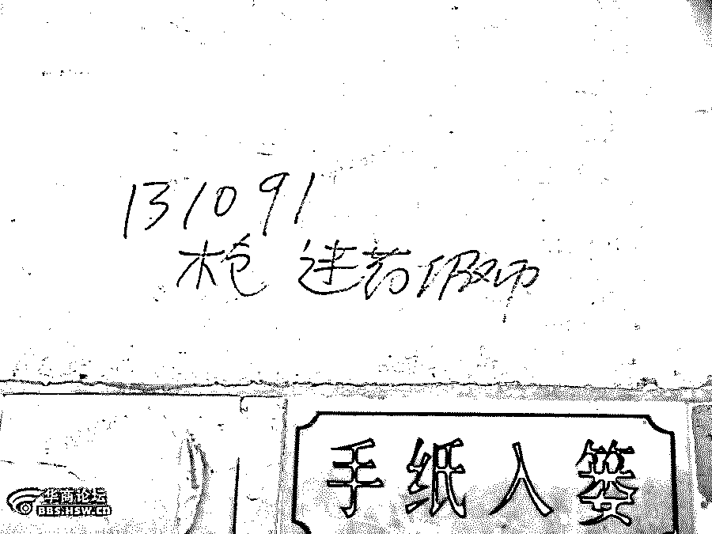

毒品枪支黑钱黄色产业......这扇门显然是一道诡异的门，似乎一不小心，你迈进的就不是厕所，而是荆棘与玫瑰并生的法外之地。

拿上周在太古仓的事来说，上厕所刚蹲下，我就见着了这个 ▽

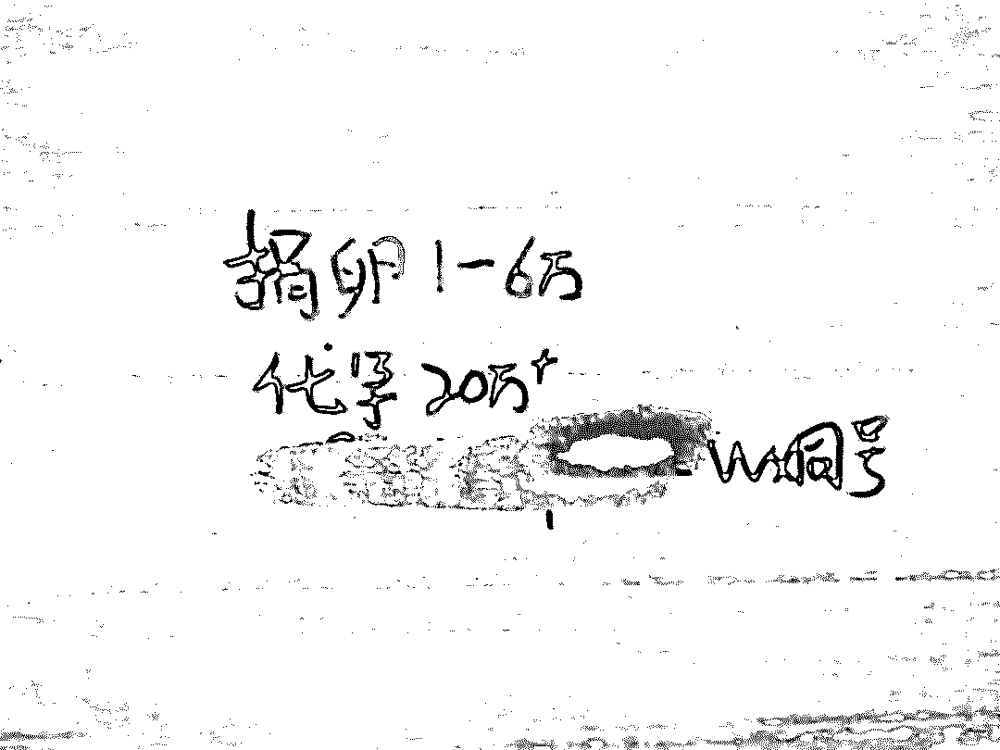

**伦理冲突、巨额利益、灰色地带**......一条用马克笔快速挥就的小广告，简洁又刺激。狗脚迹也镇不住的巨大信息量，让脑洞本就异于常人的院办，分分钟就脑补出数十个血肉丰满的狗血故事。

当完成这一场颅内自嗨正欲推门离开，人生二十多年来见过的这么多的公厕清奇小广告像蒙太奇般自脑内闪过，**我才开始意识到，自己究竟见识过了怎样一个奇妙的魔幻世界**。

**公厕门板后面是一整个魔幻中国**

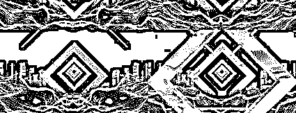

暗网随暗，里面无所不包丰富多彩。公厕门板虽小，后面却是一整个魔幻现实世界，看多几眼分分钟致幻。

万恶的源泉 money 在哪里都不会缺席。**懂科技的潮人在 “丝绸之路” 里玩比特币的时候，土鳖就通过公厕干一番资金融通的大事业 ▽**

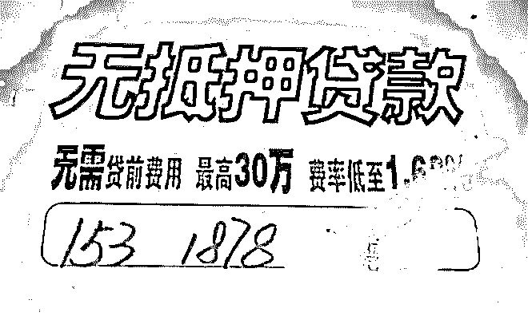

而且更重要的是，在现实版暗网里，你既不用为高度不稳定的币值时时操心，也不用虽手握千万的虚拟财产却陷在提现的困境中。

暗网里有以比特币为代表的虚拟资产，现实版暗网告诉你，我们这也有...虚假资产。短短两个字，言简意赅，却道尽一切。

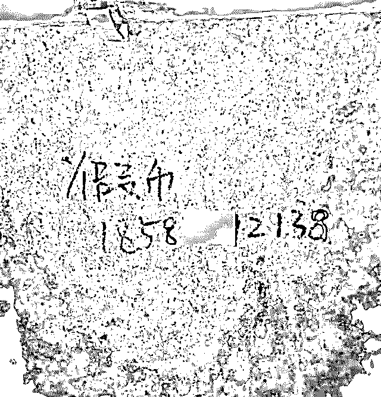

同样是寥寥数语，简洁凝练、主题鲜明却让人感到激情澎湃。**从某个程度上，这或许反映出的是从业者不懈努力的传播实践** ▽

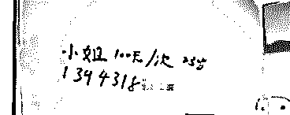

这一行的竞争或许也很激烈。**在****互联网思维的指导下，从业者们也懂得了，不管卖什么，先编一个能打动人心的好故事**。“卖身救父”的桥段或许显得老套，但没准就吃准了某些男子“拯救世界的英雄梦”心理  ▽

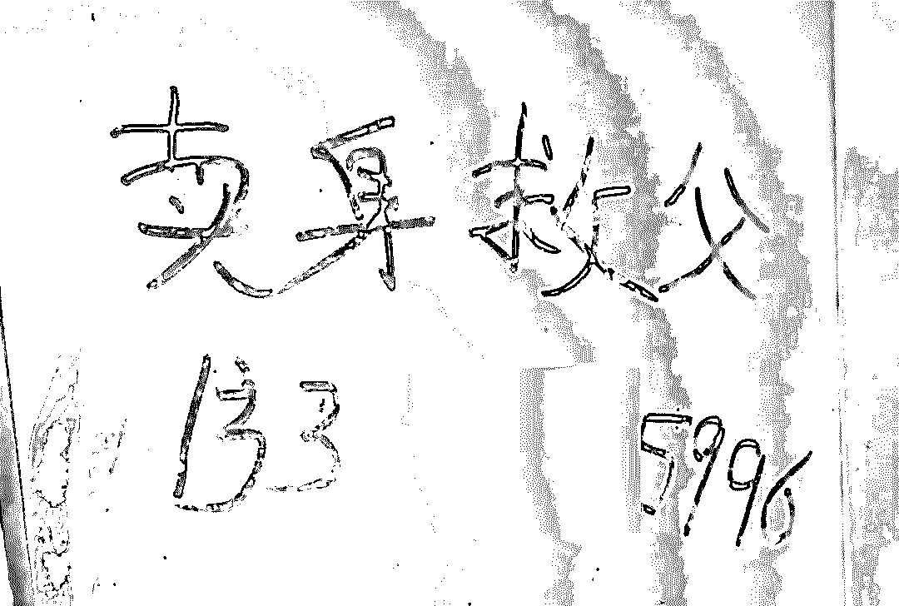

英雄想拯救世界，得先从拯救无助少女...和她爹开始

至此相信你也发现了，有时候透过公厕门板，你就能搞一搞社会学研究。比如这个，相信女权主义者看完后，会立马上微博骂人 ▽

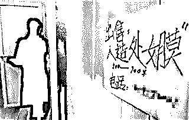

又比如这个，或许可以提醒我们关注一下性少数群体的真实生存状态，并反思一下某些社会伦理道德有时候究竟有多荒唐可笑 ▽

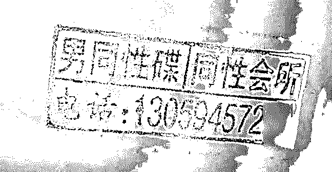

至此，想来你觉得公厕门板根本不能和暗网相提并论，因为太 low 了。但事实并不是这样，公厕暗网，也会有高科技实用产品出现哦 ▽

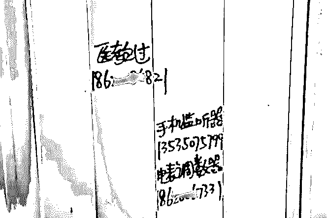

只是我不是很懂，为何常用在捉奸上的监听器，常与“医教过”同时出现

公厕门板的致幻点还包括，里面不乏让人匪夷所思的猎奇事件，分分钟就打开你认知的新大门。比如这项叫做“入龙珠”的人体改造行为 ▽

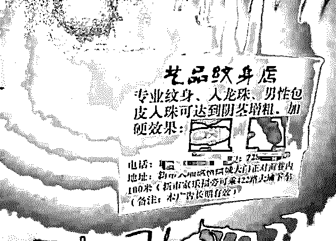

那个效果图当真不是把钟乳石的照片缩小了么？

网络世界里，广告总是以弹幕的形式出现在正剧的边边角角上；这一套东西，同样被实践在了公测暗网中 ▽

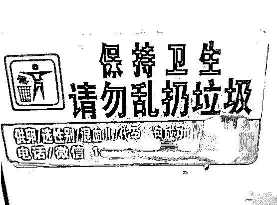

也或许此举出于公测暗网从业者的公德心

互联网让地球变成一个村；现实版暗网，助力代写服务，走出国门，跨过赤道，漂洋过海至澳大利亚 ▽

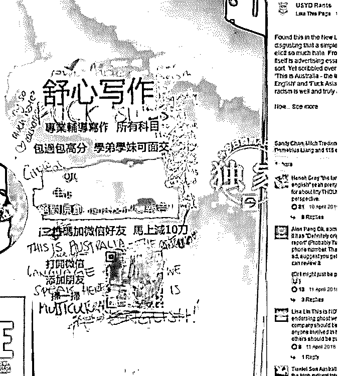

但不懂得欣赏中国民间风俗的歪果仁，竟然在上面写上了 FUCK 这种粗俗的字眼，哎

其实，现实版暗网的出现比暗网不止早了几个 n 年——**在没有马桶只有痰盂缸的年代，“神医治梅毒”的公厕小广告就已成为将困扰我整个童年的迷**。那时候神雕侠侣在热播，我坚信该病和情花毒一样，是误食某高端品种的梅花而致，需江湖神人方可医治，然后很想见识一下江湖神人......

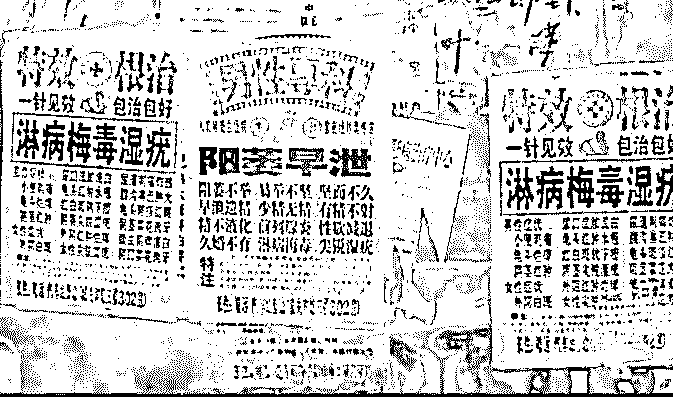

很明显，我童年看到的梅毒小广告，文案写得比这个高雅

不管厕所门板的江湖究竟存在了多久。有的卖家，在黑市这潭深水里（或许）一辈子只想搏一次 ▽

但即便写了“不诚勿扰”，这条广告的背后或许是一个短时间内亟须大量钱财的可怜人和 ta 的悲惨人生故事，却也有可能是一个倒卖人体器官的犯罪团伙。**谁知道呢？厕所门板就和暗网一样，信息不对称在这里被展现得淋漓又尽致**。

**好奇害死拉屎人**

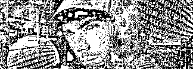

在暗网的背后，藏匿着不少只收钱不发货的卖家，他们常常是搞完“最后的诈骗”，便从此消失在茫茫服务器间。这位 9THWonder 显然是他们当中的异类，他竟然受不了自己良心的谴责  ▽

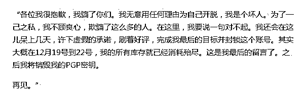

院办很好奇他打出来 的“最后的目标”到底是什么？是进到最后一批货然后顺利将发出去么？论如何，他用行为直白地告诉了我们：**暗网里的交易就像一场与未知命运的赌博，没有第三方担保，玩的就是信义这两个大字与心跳**。买药可能买到感冒药，买枪或许买到玩具枪......

现实版暗网自然也一个样。**总之哪里有骗子，哪里，就有让群众看了都着急的受害者**。

知名民生节目《1818 黄金眼》在今年消费者权益日的前四天，就向我们讲述了一则人间消费惨案▽

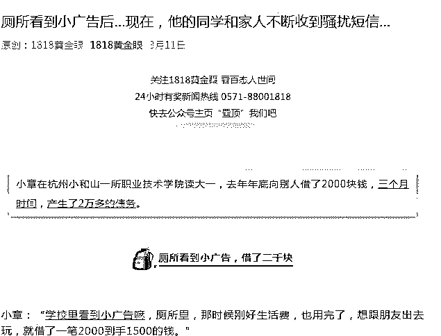

这则故事在当时的结局是 ▽

小章的父亲：“言论都是我要搞死你儿子，你这个老赖狗，我要搞死你全家。” 

小章：“现在学校让我处理完这件事再回去上学。”

有求财的也就有求色的。有的小伙子，上个厕所也不老实。非要 300 块钱找美女，结果美女没见着，净赔三千三 ▽

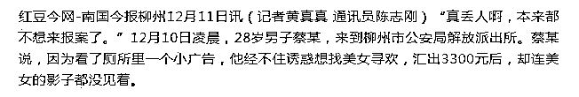

痛失三千三的小伙还是选择报了案，希望他今后记住这句俗话：色字头上一把刀

而有的小伙子，虽记住了这句话，却是上厕所也不忘带着一颗旺盛的好奇心。他从众多小广告中甄选出卖 100 块一包的冰毒的“良心卖家”，然后在最后，主动把人卖家给“卖”了 ▽

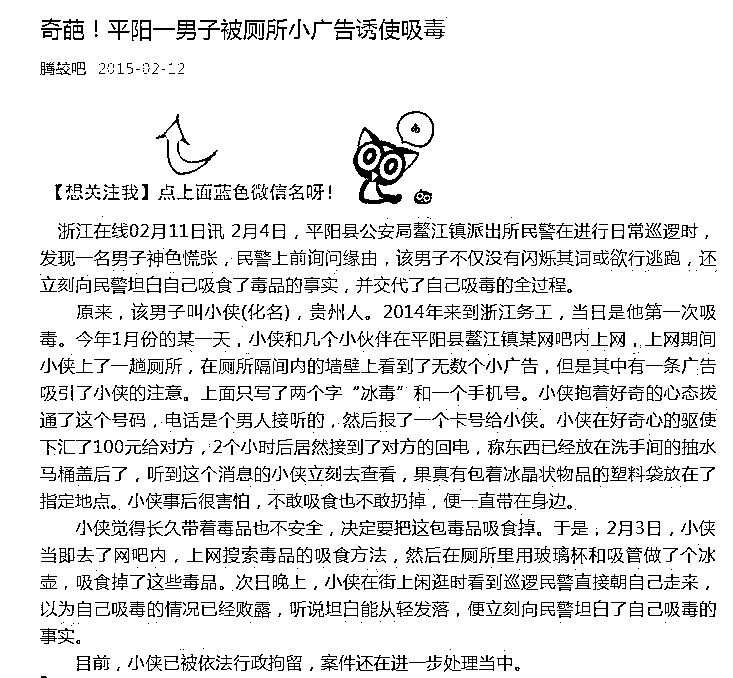

您说我该说什么呢？

那位冰毒贩卖者不知最后找没找到。但我知道，公厕小广告这一行，倒起霉来，首当其冲的永远是“兼职”贴小广告的某先生或某女士。Ta 们不仅平时常被人指责不懂设计 ▽

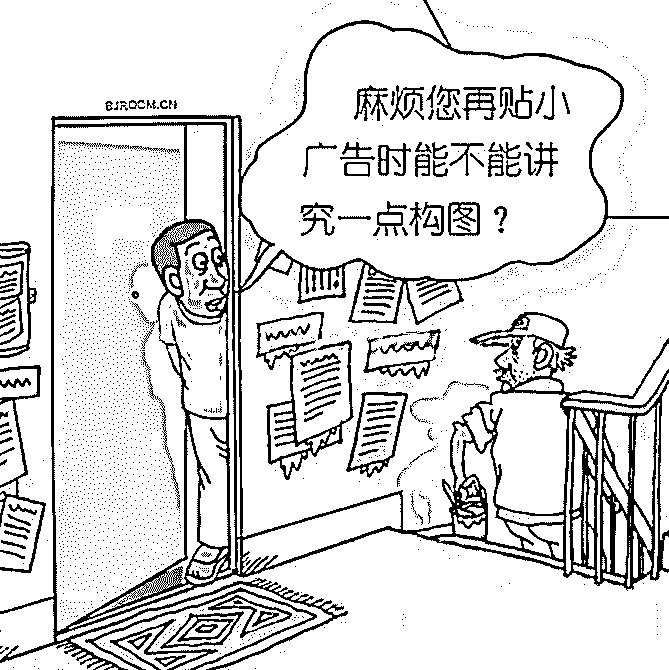

一旦被抓包，还会像这样，被拉到现场指认自己的错误 ▽

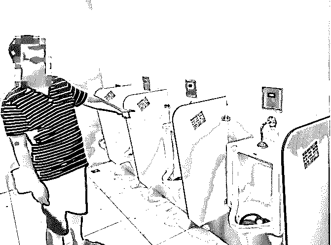

总得来说，贴小广告这种行为就是不对

但抛开受害者暂且不谈。有时候细细想想，从某个层面上看，选择公厕门板作为宣传推广自己业务的渠道，真的是很有眼光的一种举动。

 **公厕门板是中国人的焦虑风向标**

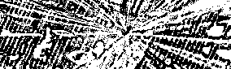

公厕门板不仅是现实版暗网。在现实世界里来说，它或许是最牛逼的广告位。

封闭的环境降低了风险，来往不息的人群带来了足够的流量。更重要的是，暗网里卖东西的客户指向很清晰；而公厕门板的世界里，**不需要什么花里忽哨的大数据云计算，天然能直达垂直客户群体**。

这不仅是在男厕贴女公关，在女厕贴代孕取卵这么简单。举一个栗子，相信你一眼就看出，这快厕所门板出自医院 ▽

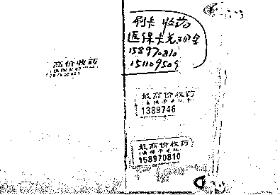

这块的出身则更清晰，妇产科女厕** ▽**

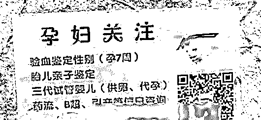

这一块出自大学 ▽

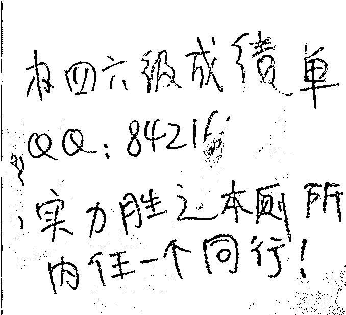

最后一句话似乎是告诉我们：竞争真的无处不在，行行都有压力

而这一块，百分之八十出自饭店、旅馆或者桑拿按摩间 ▽

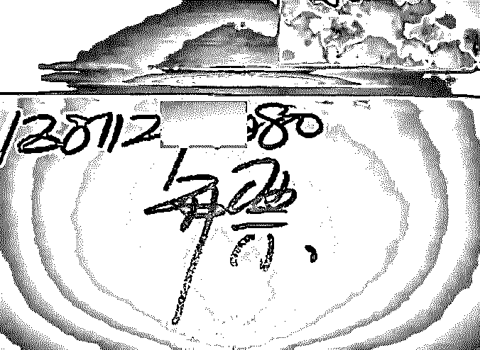

而从受众层面讲，身处公厕，既无《知音》《故事会》的真情故事相伴，又无洗发水沐浴露的说明书以供钻研，**此时对门板上的小广告的有效阅读时间将变得长之又长**......

至此，我已不禁为在公厕贴小广告者的机智啧啧称奇了。

听说，不少商业大佬已经开始在打这块风水宝地的主意。

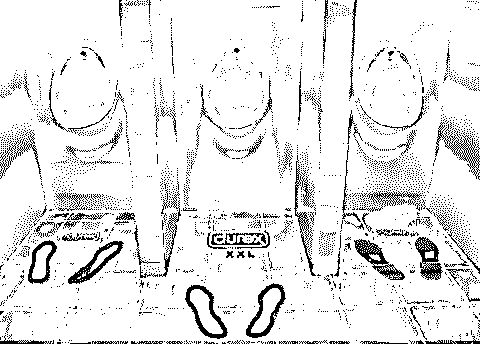

野蛮生长了这么多年，公厕门板这就要被资本收编了么？**院办不禁怀疑，要是以后拉个屎都得对着个面膜广告或者火锅广告拉，我拉屎的乐趣还有吗**？

而换一个角度讲，公厕门板土归土，猎奇归猎奇，却也着实算是我们这些天天活在自己小世界里的都市动物们看社会的一扇窗口了。

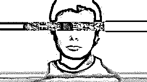

比如代孕小广告，我赌 5 块，你肯定有没想过，它的背后是我国育龄人群的不孕不育比率由 12.5% 攀升到了 15% 的现状。

说白了，广告基本都是受众导向，穿透过公厕门板小广告的魔幻手法，我们看到的原是一个个国人焦虑风向标罢了：怀不上孩子，赚不到钱，找不到对象，打不到炮......

魔幻的暗网，背后原来是我们魔幻的现实生活。

还原事实｜专扒黑产

微信 ID：darkinsider

知乎 一本黑

头条 一本黑

投稿、爆料、招聘、转载

请联系微信:yibenheiTG