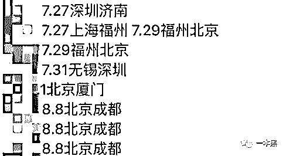

# 蹲守酒店、包车尾随、深夜电话骚扰，揭秘追星产业链的病态行为

> 原文：[`mp.weixin.qq.com/s?__biz=MzU4ODAwNzUwMQ==&mid=2247484589&idx=1&sn=4933ea9fc24196b6cd1a410d943bb4f3&chksm=fde2158fca959c9947117914c05cc98180515a3d5b9caec5935c58a8666fa382b603dd1fe5de&scene=27#wechat_redirect`](http://mp.weixin.qq.com/s?__biz=MzU4ODAwNzUwMQ==&mid=2247484589&idx=1&sn=4933ea9fc24196b6cd1a410d943bb4f3&chksm=fde2158fca959c9947117914c05cc98180515a3d5b9caec5935c58a8666fa382b603dd1fe5de&scene=27#wechat_redirect)

与其天天“爱的供养”，不如换一个方式，和偶像一起成长。

早段时间，我有个朋友跟我吐槽说，有一次他在上海出差的时候，巧好碰上国内某一小鲜肉也是那趟飞机。

结果，20 多名粉丝购买机票全程跟随，有些粉丝没验登机牌直接冲了进去，上飞机后又试图闯进头等舱，而整个飞机上的工作人员全程都在试图阻拦他们，现场秩序大乱，导致航班延误两个小时。

          

粉丝的这种行为导致航班延误的事件已经不是第一次了。

近些年来，随着娱乐行业的兴起，粉丝们对偶像的追捧一再升温，有些不理智的粉丝在机场对自家爱豆（偶像）展开疯狂“围追堵截”，这也正是导致航班频繁延误的原因。

这种追星行为不仅成为明星们的烦恼，更是令机场、航空公司和其它无辜旅客感到头疼。

粉丝无脑行为频繁给公共场合带来困扰，究竟谁是罪魁祸首？

**航班信息仅售 8 元，明星情史也能买**

早在此之前，明星航班信息泄露事件就引发过热议争论。其中，杨幂曾发微博斥责黄牛，“有时候真的特别想知道你们卖证件信息航班信息高铁信息能挣多少钱”，质疑这算不算是泄露个人隐私。

其实，这并不是第一起明星信息航班信息泄露的事件。在杨幂发博前，Tfboys 发视频称，自己被私生饭侵犯隐私，蹲守酒店、跟机拍摄、包车尾随、安装追踪器，午夜电话骚扰……各种骚扰招式防不胜防。

        

        

有人尾随你，潜入你住的地方，Gps 定位你，各种电话骚扰...你什么时候拉屎，感觉她们都一清二楚。这个操作，令人不寒而栗。

        

           

何为私生饭？私生饭是艺人明星粉丝里行为极端、作风疯狂的一种粉。他们为满足自己的私欲，喜欢跟踪、偷窥、偷拍明星的日常以及未公开的行程和工作，骚扰自己喜欢的明星，影响他们以及艺人家人的私生活。

也就是说，他们喜欢哪个明星，他们就要充当他生活中的“幽灵”。为了让明星记住他们，还可以动手扇耳光、自残寄血书、偷内裤等等令人窒息的操作...

妈的，真是变态。

有意思的是，在这个饭圈中，如果有人能提供有价值的资源，或者单独有钱，给爱豆花钱较多的，都会被尊称为老大。“有钱的还常买与爱豆一趟航班飞机的头等舱。”

正是因为私生饭无比渴望获取明星更多的资讯，与他们近距离接触，不惜花大量时间和金钱。所以，才会滋生出专门出售明星个人隐私的黑色产业链条。

不过，无论是为了在饭圈争取地位，还是只是单纯喜欢收集明星的隐私，能获取这些信息渠道的只有黄牛。

在出售明星信息的黄牛手中，只需几十块，你便可拿到明星的证件号码、手机号码、家庭住址等个人隐私信息，而航班、高铁等出行信息更是不在话下。

        

              

也就是说，只要钱到位，就没有黄牛挖不出来的事。

而明星隐私的泄露的渠道，究竟是从哪里传来，是真是假，我们都不得而知。

有一个特别喜欢王俊凯的表妹，她告诉我，接机这件事，她也参与过好几次。因为机场是最好和偶像互动的地方，不仅离爱豆近，而且成本低，还可以亲手送上礼物，幸运的话，还能与爱豆“亲密接触”。

表妹称，接机这件事，她往往都是根据粉丝后援会提供的“官方消息”去的。通常，被称为“站姐”的粉丝后援会负责人，会跟明星的经济团队、工作室一直保持沟通，因此他们会主动告知航班信息，方便粉丝接机。

而有趣的是，黄牛和粉丝之间也有合作关系。表妹说，有些私生饭跟黄牛关系比较密切，甚至成为黄牛的帮手，利用在粉丝圈内的影响力，帮助黄牛赚取普通粉丝金钱并且从中获利。

              

在线上，要想找到获取明星信息的渠道，贴吧、微博和微信便是出售明星个人信息和航班出行的商家聚集地。

贴吧里，有的黄牛直接贴出广告，称可以查询爱豆航班信息，手机微信 QQ 号和地址在业务范围内，100 元可打包购买 200 多个明星证件号，包括身份证和护照号码。而如果单买的话，单个信息价格在 30-80 元之间，且量大从优。

通过表妹朋友的介绍，我加了一位从事这个行业一年多的黄牛，就叫他“胖子”吧。

**叫卖明星隐私信息日赚千元**

胖子告诉我，以李易峰为例，每个单买 50 元，两个打包价 80 元，如果你肯再加 20 元，他们还可以教你查询航班的方法。

       

胖子为了证实他说话的话，他立马发来了一张李易峰近日的航班信息，查询过程不到一分钟。这样的航班信息，8 元即可买到。

胖子的描述，让我有一种走过路过不要错过，8 元买不了吃亏买不了上当的那种感觉。

胖子称，自己手上有差不多 500 名明星的个人信息，且每个人了解的情况都不一样，因为这也是根据明星热度决定的，比较火的他们也弄的多一些。

其中，Tfboys、蔡徐坤的信息比较多，“手机号，住址，证件号，qq 号，微信号，50 元一个，打包的话 200 元，再送查询方法。”

              

并且，连王俊凯的情感消息，他们也能出售。胖子坦言，这毕竟是他们也出动很多人力的成果，他们不仅跑去王俊凯学校打听，咨询了他很多同学，还跑去他家附近打听。

我打趣着胖子，问他哪来的这么多信息。或许是聊的很尽兴，他告诉我，他们这个团伙，自然而然是有点本事的，不仅航空公司中安插“内鬼”，就连明星身边，他们也有人。

一旦在有了明星的相关证件下，便可在航空公司或一些第三方航空软件上查询，然后即可轻松找到航班信息。包括航班起始地点、飞行日期、航班号和座位号，以及登机情况等。

这些航班信息，本应该只能由当事人查询，却被人拿来恶意牟利。

在入行黄牛的这一年，胖子早已“出师”，手下有好几个徒弟，她们当中大部分是全职妈妈，也有几个是学生党。她们每天只需要抱着手机，就能轻松日赚百元，生意好的时候，日赚千元都是小意思。

**追星可以，但别成了“乌合之众”**

这些年，私生饭越来越疯狂。从最开始的酒店门口蹲守、开车尾随艺人车辆，导致交通事故发生、到今天直接上别人家堵人。

有很多私生饭表示，我这还不是因为爱他么。

虽说明星跟普通人的生活相差有点远，他们的生活几乎都存在聚光灯下。但他们难道就不配有私密时间么？

私生饭，打着以爱的名义进行骚扰。试问，你在工作的时候如果被人打扰，你在休息的时候，无时无刻都有人监视着你，而这些理由就只是因为我爱你。

说起来还特别理直气壮？你喜欢一个人就要去打扰他的正常生活吗？甚至还堵在人家家门口，为的就是看他一眼？

这无疑就是一群自私到极点的人，用爱的借口，去做损人利己的事而已。

说的好听，这叫骚扰，说不好听，这就是一群变态。

自杨丽娟的事件后，公众开始对私生饭有了定义。杨丽娟在回应媒体的时候，她说她从 16 岁开始痴迷刘德华，为了能常常看他，她选择辍学。她的父母劝阻无效后，被逼卖房卖肾以筹资供她多次赴港及赴京寻见刘德华。最终，忍受不了压力的父亲被逼跳海身亡。

              

在这个事件中，她埋怨刘德华，痛哭失声连呼后悔。

她坦露：“因为父亲的事，这些年我挺懊悔的，不过我还是想和他（刘德华）见一面。”

           

她不知，她给喜欢的人带来了多大的困扰，她也没想到，她倾家荡产的“付出”，会落得家破人亡。

而如今，追星的路上远远不止一个杨丽娟。

像私生饭这种脑残粉一向不是孤立存在的，他们能聚合到一起的一个重要原因就是抱团寻找归属感，形成身份认同。

他们形成的是一个情感共同体，在这个群体里，他们的认知和观念会被高度的同质化，或者说是，被洗脑。

曾经在知乎上看到有人说自己混过一段时间的饭圈，他说圈内洗脑能力贼强，唯一高度契合的观点就是“我家爱豆无可比拟，天下第一帅，简直找不出任何缺点”。

当然，面对外界的抨击他们会说：“外人没资格骂我们脑残，是因为他们不懂。”大有一种“世人笑我太疯癫，我笑别人看不穿的”迷之自信。

听一个追星七八年的朋友说：**“我特别不理解一个不追星的人过的是一个什么样的生活。”**

说实话，他说的这句话。

我也挺不理解的。

还原事实｜专扒黑产

微信 ID：darkinsider

知乎 一本黑

头条 一本黑

投稿、爆料、招聘、转载

请联系微信:yibenheiTG