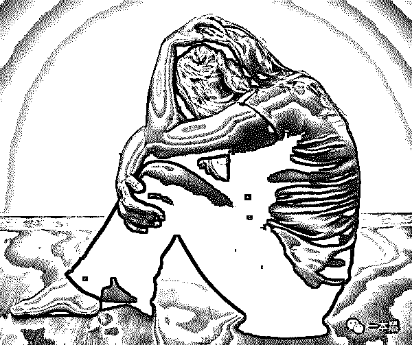

# 她在最穷的时候选择“裸贷”，在抑郁的时候选择自杀

> 原文：[`mp.weixin.qq.com/s?__biz=MzU4ODAwNzUwMQ==&mid=2247484458&idx=1&sn=3340a73233c84eaddd73ee703168350a&chksm=fde21508ca959c1e93e4c36a804289e0798e947f3791c0fcf1a502416e5c572b3296473a18f5&scene=27#wechat_redirect`](http://mp.weixin.qq.com/s?__biz=MzU4ODAwNzUwMQ==&mid=2247484458&idx=1&sn=3340a73233c84eaddd73ee703168350a&chksm=fde21508ca959c1e93e4c36a804289e0798e947f3791c0fcf1a502416e5c572b3296473a18f5&scene=27#wechat_redirect)

一本黑在跟进“裸贷”的时候发现，许多还不起债的姑娘，会选择自杀这般极端手段来解决。

法国哲学家伯格森曾说过：“虚荣心是很难说的一种罪行，一切恶性都围绕虚荣心而生，都不过是满足虚荣心的人的手段。”

本应在窈窕淑女，君子好逑的年纪，却走上了裸贷这般万劫不复的道路。

两年前的杨子，也深陷在这般沼泽当中。裸贷不仅让她背负上巨额欠债，更是让她患上抑郁症。熬过那段最黑暗的日子，慢慢走入新生活的杨子向我娓娓道来。

**01**

我是单亲家庭，爸爸在我高一的时候心梗去世了。那个时候，爸爸做手术花了很多钱，他死后，还留下了一屁股的债。妈妈未曾改嫁，是她一个人把我拉扯大的。

考上大学那一年，她是东拼西凑才将我从我们那个县城送了出来。

在上大学之前，我从未接触过化妆。我原本以为，我会好好读完书，再找一份稳定的工作，把我妈接过来报答她的。

大学里，攀比的心理无处不在。好看的女孩子，总是会有很多追求者。我有一个室友李 XX，她家里条件很好。她本人是属于那种不大好看的，皮肤也是偏黑的那种。但不是特别黑，可是在化了妆之后，整个人跟变了一样，皮肤又白眼睛又大。而且她总是有用不完的化妆品，包包，和最新款时尚的手机。

是的，我很羡慕她。羡慕到内心生出校园贷的邪恶种子，而这颗种子正在慢慢发芽生长。

杨子在说这段话的时候，我有注意到她一直在摸着水杯不停的转动，眼神有些空洞，若有所思。

**02**

学校里其实有很多贴着贷款之类的信息条，我是在学校门口的报刊亭那看见的。

我按照上面留下的电话给他们拨打了过去，是一个男人接的，他问了我一些基本情况后，告诉我拿着身份证去一个地方找个人就可以了。

当时的我很开心，我从来不知道，借钱如此简单。只要带着身份证，就可以借钱了。

我按照地址，找到那个电话里所说的地方。

一个剃着平头，穿着黑色短袖的男子靠在楼下铁门抽烟，而他的样子就像电影里那些刚从监狱里走出来的人一样。

他看到我之后问我是不是杨 XX，我紧张的点了点头。

他说唤他豪哥便可，说完他就丢下手中的还未燃烧完的烟头用脚撵了两下，用手往前指了指大概的方向，接着带我走进一个小楼房里。

途中他告诉我，根据我的家庭情况，最多只能借给我 1 万块钱，按照 30%的利息归还。

当时我并没有想过，这个钱，我能不能还得起，自始至终我想的都是拿到这笔钱改如何去消费它。

就这么一路跟着他，来到一个一室一厅的房子，还未进门，我便闻到了一股很浓烈的烟味和槟榔味。

走进屋，我发现屋里还坐着两个人，一男一女，桌上乱糟糟的，有啤酒瓶、有吃剩的方便面，还有几张类似合同的东西。

我和豪哥的到来，似乎并没有影响到他们。

豪哥进屋就往桌子那边走，走到桌子那的时候，我发现墙角有一个摄像头。很快，他拿了一个相机过来，告诉我，拿着相机去里面的房间，把衣服脱光了，拿着身份证拍几张照片和视频就可以了。

我当时有点退缩，可他向我保证，这些照片是不会流传出去的，并且在我还钱之后会当着我面的进行删除。

杨子突然冷笑了一声说道，我当时是真的很蠢，怎么会相信一个放贷款人的话呢。

听完豪哥说的话，我开始有些害怕，从未经历过这些事的我，那一下非常忐忑，心砰砰直跳，尽管他一直给我打包票。

可能看到我有些打退堂鼓，他开始凶起来，还一直催我，问我究竟是不是来借钱的，要借就借，不是每个贷款的都像他们这么轻松，只要拍拍照就可以拿到钱。

说罢，便示意另外一个男的拿钱出来，当一叠红艳艳的百元大钞在我面前晃动时，我所有一切的不安和忐忑都屈服在金钱的诱惑下。

说完这段话，杨子将水杯里的水一口气喝完，又给自己倒了第二杯。

按照他们的要求，我紧张的走到那个房间，房间是封闭的，除了一个凳子，什么都没有。我关上门，将衣服和裤子脱下扔在凳子上，拍了视频和照片，弄完穿好衣服打开门发现小平就站在门口，他直接从我手中拿了相机给坐在那的女人，女人拿着相机翻看了一会，然后抬头看了我一眼，转头向豪哥点了点头。

他随后把钱交给我，但只有 7000 块，说剩下的 3000 块是利息，按照规定时间还即可。

拿到钱欣喜若狂的我，哪还在意这些。

可我没想到这是我噩梦的开始。

**03**

7000 块钱很快就被我花光，快到规定的时候还款，可我根本没有钱来还债。豪哥给我打了好多个电话我也不敢接，后面，我收到他给我发的短信，他说，如果我敢玩失踪，他就把我的裸照和视频发给我妈，还贴到学校里面去。

杨子忽然握紧水杯，声音听起来有些抖。

我被他吓的不轻，不停求他再给我一点期限。可他们哪里会有人性。只有冷冷的一句，后天在不还钱，你就等着瞧吧。说罢，还附上我的一张裸照。

之后，每隔一小时，我就会收到这样的消息。看着威胁信息和自己的裸照，当时我整个人都要被逼疯了。

我不敢告诉我妈，我很难想象她知道后会怎样。我准备向李 XX 借钱，希望她能帮帮我。可是，她却拒绝了我。

她说自己也没有那么多钱，我觉得她是看不起我，看不起我穷。于是，我想到了偷。

我别无选择。

“那最后呢，你偷到了吗？”看她突然停下来，我紧接着问。

没有，被她发现了，她告诉老师，我受到了处分。

没有钱，无时无刻都能看到威胁短信和自己那张羞耻的裸照，没有办法，我真的很崩溃....我不敢告诉我妈，我觉得很羞愧，我没有脸再面对她。

我每天都活在这样无尽的痛苦里，我甚至想去死，这样便可一了百了。就这样，我用刮眉刀在手上留下了许多条印子。

后面还是被我妈发现了，借贷那些人将信息发给了她，因为未按规定时间还钱，到最后连本带利要还 5 万多。

我妈打电话来质问我时，我一直哭。最后是把家里的房子卖了，才还上了钱。我不知道，我妈那个时候身体已经很差了。

杨子突然有些哽咽。她微微的调整坐姿，揉了揉眼，可我还是看到她的眼眶有些红。我打开包，拿出纸巾递给她，她挥手说不用，想了一下，却还是接过去捏在手中。

因为这件事，我患上抑郁症，妈妈帮我申请休学，将我带了回去。

回到家，我妈把我打了一顿，她的恨铁不成钢，她的伤心，一切都包含在藤鞭里，我被抽的伤痕累累。

我愧疚，我想死，我没有脸去面对我妈。

当初，我很喜欢绘画。可渐渐的我对任何事情都失去了兴趣，曾经很想去做的事情，现在都不愿再去做了。

有时候，失眠整夜都睡不着，想去药房买安眠药，可是药房说是处方药，没有卖给我。

我也曾无数次做梦，梦见自己从顶楼一跃而下，然后就什么痛苦也没有了。每当这时，我就会从梦境中醒来，身边却是无边无际的黑暗。

我感受到身体里仿佛有一个巨大的黑洞，黑洞一直吞噬着我。有时候我折磨自己的身体，只希望让自己的精神好受一些。

妈妈一直都不知道我的病有这么严重。我记得，某一天，我发了一条微博，我说活着好累，我要去死。然后有人私信我说，要不要一起，还分享了自杀攻略给我，并拉我入了一个自杀群。

我发现，自杀群里很奇怪，不停的有人教唆和怂恿，宣扬死亡是多么的崇高，还有各种的自杀攻略，进了这个群，好像是，你不敢死，是一种耻辱。

而且我个人感觉，其实不是每个人都真正的那么想死吧，但是在他们的怂恿和教唆下，他们却选择走上了这条路。

**04**

她说完这番话，我便想起了微博上有一个很出名的抑郁症自杀患者“走饭”，我问她知不知道。

我知道，记得有一次，有一个人给我私信，问我知不知道走饭。他说我给他的感觉很像曾经的走饭，并尝试着安慰我。我没有回复他。

我有去看过走饭的微博，她的最后一条微博留言里，有许多也想不开的人，我也看到了很多不理解还有骂我们傻的人。

我想说的是，那些说别人自杀很傻的人，是因为你们从未有过那种生不如死的绝望。

在经历过人生最不辛的一些事后，生，看起来像生离死别四个字里最欢喜的字。然而，大概没有人知道，对于我们而言，这个生，是痛不欲生的生，生不如死的生。

杨子风轻云淡的说出这句让我很诧异的话，的确，这不是每个人能有的体会。

**05**

突然，杨子的手机响起来打断了她的说话。

她从包里拿起手机，看了一眼屏幕上的来电显示， 她站起来，指了指手机，眼神跟我示意着，抱歉，我要去接个电话。

我看着杨子走到门口，她不停的走来走去，视线偶尔会往我这瞄一下，嘴角挂着无可奈何的笑意。我微笑着点头示意告诉她，没有关系。

过了一会她进来了，苦笑着说：“不好意思，刚是我妈。”

“阿姨还好吗？”

“嗯，她去年年底刚切了子宫，手术前后一直都是我陪着她。康复的还不错。”

后续

没有写杨子是怎么过来的，是因为杨子说没有必要说下去了。有一些回忆，她不想再去想起。

对于当下，她说，我记得白夜行里有一段话，描述我现在的世界再贴切不过了。

“我的天空里没有太阳，总是黑夜，但并不暗。 因为有东西代替了太阳。 虽然没有太阳那么明亮， 但对我来说已经足够。凭借着这份光，我便能把黑夜当成白天。我从来就没有太阳，所以不怕失去。 ”

可能对于扬子来说，某种程度上是极端了些，但这并不是可以一概而论的道德审判，不管是面对贫穷也好，无奈也罢，基于某种环境下的选择。

是任何人都不可能感同身受的。

『END』

**号外**：第四届中国互联网安全领袖峰会，将于 2018/08/27-2018/08/28 日在北京召开，本届峰会主题为：安全强驱动，数字新生态。

出席本次会议的有：腾讯玄武实验负责人“TK 教主”于旸，腾讯公司副总裁丁珂、知道创宇 CEO 赵伟、极棒创始人王琦、汽车黑客鼻祖 Charlie Miller 以及 Security Research Labs 安全研究实验室首席科学家 Karsten Nohl 等等。

本次会议上，TSec 腾讯安全议题首发，聚集当前热议的云安全、移动安全、物联网安全以及人工智能等多领域的安全技术。并且，还有最具亮点的 P16 基础设施圆桌论坛大会。在圆桌论坛大会上，CSS 将邀请上市公司企业领袖共同加盟打造最大规模的领袖交流平台。

在此，老师傅搞了**20**张票送给大家，想要参加峰会的小伙伴们，快快通过后台消息，发送你的**姓名**和**手机号码**，我们会随机抽取 20 位，北京坐标优先，先到先得，送完即止。

还原事实｜专扒黑产

微信 ID：darkinsider

知乎 一本黑

头条 一本黑

投稿、爆料、招聘、转载

请点击菜单**【联系我们】**