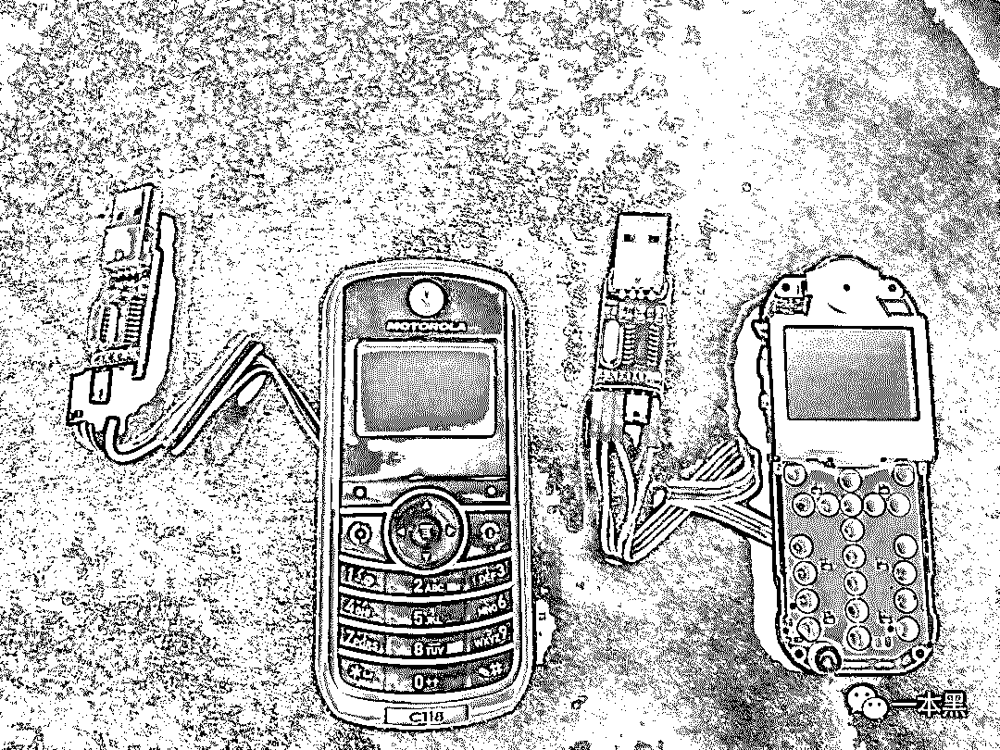
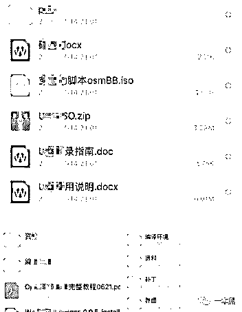
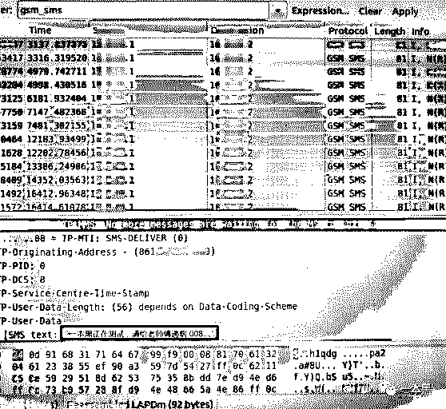
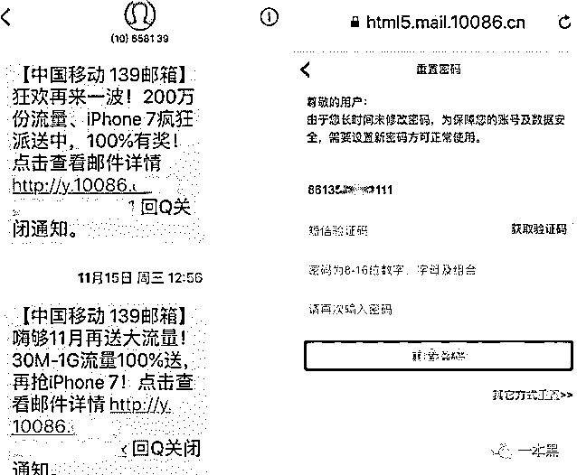
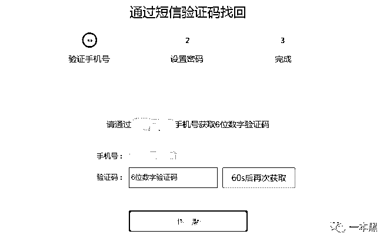
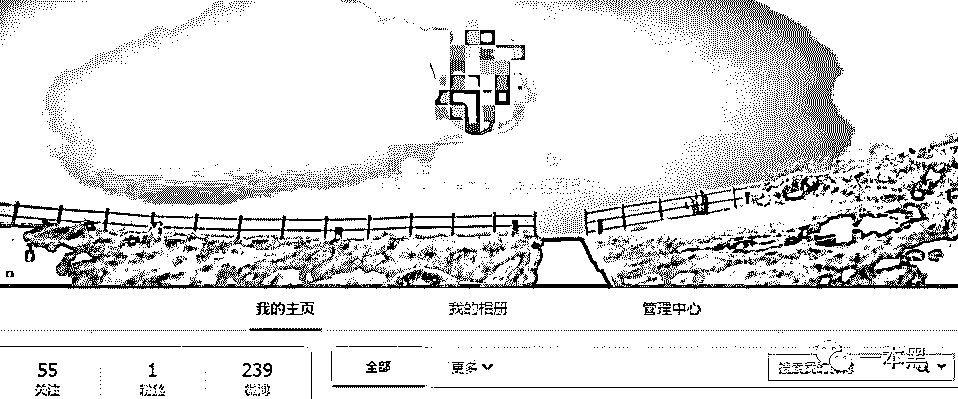

# 存款一夜之间不翼而飞，真实还原骗子洗劫过程

> 原文：[`mp.weixin.qq.com/s?__biz=MzU4ODAwNzUwMQ==&mid=2247484432&idx=1&sn=c333367a8d525fdebc0180456bbdcb37&chksm=fde21532ca959c24fd38de4deed87e890b2df698c3d6ab391c178b88b3be023d6002465ff1da&scene=27#wechat_redirect`](http://mp.weixin.qq.com/s?__biz=MzU4ODAwNzUwMQ==&mid=2247484432&idx=1&sn=c333367a8d525fdebc0180456bbdcb37&chksm=fde21532ca959c24fd38de4deed87e890b2df698c3d6ab391c178b88b3be023d6002465ff1da&scene=27#wechat_redirect)

不知道各位有没有想过一个问题。

假如有一天，你的支付宝、微信、以及银行卡里的钱在一夜之间不翼而飞，这种瞬间的一无所有不知道你们会有什么感觉。

可能会有人开玩笑说，银行卡里的钱不翼而飞？能让我花呗里的欠款不翼而飞吗？

......

我之前写过几款关于手机监控木马的文章，只要在对方手机上安装这款木马（安装后木马自动隐藏）并进行相关设置，就可以实时地获取到对方手机上的各种信息，以达到窥探别人隐私的目的。

这种软件的使用者一般是夫妻或者男女朋友居多，他们使用的目的只有一个，就是防止或者验证对方是否出轨。

这无非是居于感情的层面。

然而，最近报道的一件“窥探”他人隐私的新闻就不仅仅是居于感情层面了，而是在不接触对方手机的情况下，获取到对方的短信内容，最终利用短信验证码实现了支付宝银行卡的盗刷。

事件的具体内容我就不多提了，这里进行简单的阐述就是：当事人**半夜**起床发现手机收到多条验证码，京东支付被开了金条和白条，而且被转走 10000 多元，支付宝也有一定的消费......

......（想要了解详情的可进行搜索）

那到底是如何被盗刷的呢？有人说骗子是通过**“GSM 劫持+短信嗅探技术”**，这一技术可以实时获取用户的手机短信内容，然后根据这些内容进行盗刷或者网络诈骗。

看到此新闻后，我立马给老师傅发了一条信息，大意是看能不能还原一下盗刷者是如果实现的。

可能是因为周末的原因，老师傅半天没回复，我只好发了个红包过去，没想到老师傅居然秒领红包，然后发了句：“刚看到，刚看到。”

老师傅说这都好几年前的东西了，怎么现在又突然火了。

**真实还原，无接触窥探你手机短信**

回信的老师傅可能还没起床，只是先叫我去圈内找找资源，看能不能搞到这种设备。

想着圈内这么多高手，要搞一套这种设备应该不难。二话没说，我又是卖萌又是发红包的挨个问了一遍，结果一无所获。

正要给老师傅汇报情况的时候，圈内朋友给我推了一条广告，广告内容正是关于嗅探技术设备的，看来这哥们正靠着自己的小技术发财呢！

简单交涉几句后我就下单购买了一款对方刚改装的嗅探设备，巧的是同城，所以快递在下午接近傍晚的时候就到了。



除了邮寄过来的设备之外，对方还在线上给我发了教学、编译环境、补丁等文件。



发完还不忘补充一句：“不能用于非法用途噢。”紧跟着一个猥琐的笑容。

真是骚人说骚话。

第二天，一见面我就把设备交给老师傅，老师傅不紧不慢地打开电脑，在等电脑开机的十几秒里，老师傅吃完了手中的面包。

直到看到老师傅点烟的那一刻我就觉得，稳了。

在老师傅搭建环境的过程中，他向我解释了这种嗅探技术的“前世今生”。

“以前的手机基本都是 2G 移动通信，所以那时候会有一些人购买设备搭建‘伪基站’，然后再冒充运营商给用户发送一些垃圾广告、或者说是诈骗短信。基站范围内的手机用户就可以收到这些短信。”我想大多数人应该都接收过这类垃圾短信。

（至于什么是伪基站，篇幅有限这里不多提，感兴趣自行搜索）

接着老师傅又说：“拿我们日常生活来说，想要手机能够正常使用，一定是要有信号的，而这个信号从哪里来呢，其实就是靠各地的基站来提供；比如你要给一个人发短信，你的手机必须要和基站建立连接，才能达到通信的效果。”

通俗一点来说就是，你发出去的短信会先到达基站，然后基站再把这条短信发送给指定的手机号码。

有一个现象各位一定见过，但凡举办什么重大的活动或者在人流量比较大的地方，你们会发现有一辆印着**“应急通信”**的车，这就相当于一个可以移动的基站，目的是保证手机的正常使用。



其实，前面提到的这种嗅探技术早在几年前就出现过，他可以探到这个基站区域内所有用户收到的短信，并且用户是无感知的。

基站一般是有一定范围的，他只能服务这个范围内的手机用户，另外，这种嗅探技术理论上来说只能探到 30-300 米的距离。

说了这么多，老师傅的环境也搭建完毕了，设备连接也正常，软件上显示此时正在嗅探附近手机用户的短信内容。

为了能尽快看到是否真的能嗅探到别人的短信内容，我发动了身边的所有人相互发短信，短信内容统一为：**“一本黑正在测试，请给老师傅递烟 001......”**

按这顺序，一样的短信相互发了 15 条，只是每一条的最后用序号来标记。

短信发出去没多久，老师傅这边就收到了反馈，果真在上面嗅探到了带有**“一本黑正在测试，请给老师傅递烟......”**的短信。



我表示非常的惊讶，原来真的可以做到，老师傅则一幅见怪不怪的样子说：“这没什么的，意料之中。”

**一条短信可能让你承受巨大损失**

惊讶之余，我又问老师傅，拿到这些短信又如何，怎么实现事件中的盗刷？

老师傅点了一根烟，就像事后必须来一根的那种。（验证效果的这件事以后，想什么呢）

老师傅先是问了我一个问题，现在手机短信里最有可能暴露个人信息的是什么你知道吗？

我带着疑惑的表情回答：“手机号吗？”

老师傅接着又说：“短信都能嗅探得到，他机主的手机号不就有了吗？”

是的，只要能拿到机主的某些看似不起眼的短信，就可以获得对方的手机号码。

根据我们的老朋友终结诈骗的报道，当骗子劫持到运营商发过来的短信后，复制其中的链接到浏览器，点击进去，就可以看到手机号了。



其实，只要拿到手机号就等于拿到了机主的其他信息，包括身份证号码、银行卡、验证码更是不在话下。

有人就要问了，仅通过手机号如果得到身份证号码等其他信息呢？

问这种问题的读者可能不是很熟悉一本黑，我们以前的文章提到过一种叫做社工的技术手段，这种技术手段是每一个黑客的必备技能。

通过社工是一种方式，还有另一种方式是通过内鬼查询，不管是哪一种方式，骗子只要想得到你的个人信息，**跑不掉的。**

另外，在之前的文章中提到过一次我曾经用接码平台的号码在新浪进行注册，结果平台反馈说号码已经被注册可以直接登录。（至于什么是接码平台，大家自行搜索吧~）

重点是这里是可以用验证码的方式登录的。

那这种情况放在这里的话那就是一样的效果了，拿到对方的手机号后，然后在各大平台进行尝试登录，只要可以用短信验证码的方式登录。

再通过嗅探的方式“窥探”到对方的验证码，那接下来的事还用说吗！



下图是之前做的实验，通过验证码的方式成功登录上别人的微博。

到这里就不难解释，前文提到的当事人是如何被一步步被盗刷的。

嗅探技术带来的危害是巨大的，一个不小心你就有可能成为骗子的目标。

由此带来的轻则个人信息泄露，重则遭遇盗刷甚至是电信诈骗。

**题外**

这里补充一个好玩的事情。

为了搞测试我不是找人搞了一套设备吗？

那人说设备是自己改装的，他说因为一个基站只能发出 6 个信号道，一部手机只能嗅探到一个信号道，但是他把操作系统修改以后，就可以支持多开。

话语中频繁表示出自己很牛逼的感觉。

还说什么自己改了电路，基站的下行短信和用户的上行短信都可以抓到，如果不改的话是只能抓下行。（上行就是用户发出去的短信）

这里大家不用理解是什么意思，我们一致认为对方很牛逼就行了。

当问及哪里来的原件时，我以为他会说在网上购买的，结果他居然说在华强北买的。



华强北不愧是......

看着他这么装逼的样子，说的都是些行外话，老师傅看不下去了，决定搞一搞他。

因为之前我们是通过二手平台做的交易，所以有链接的往来，老师傅利用这一点做了一个木马链接给他发了过去。

其实这个链接的作用是打开对方电脑的摄像头，可没想到我们看到的却是这样的画面。

（被纸片遮挡的摄像头）

看这样子对方的摄像头应该是被纸片封住的，不然不可能看不到东西。

这一点是很值得大家学习的，赶紧用小本本记下来。

老师傅不甘心啊（其实是闲得没事做），又搞了一个可以监控对方电脑屏幕的木马链接给发了过去。

可对方一直没点，我们以为是对方可能有所察觉，心想算了吧。

正打算关电脑的时候老师傅这边突然有了反应，对方中招了，在老师傅的电脑上我们看到了对方正在跑程序。



看得出对方使用的还是 linux 系统，桌面上也没有什么其他的信息，应该是专门搞的一台电脑做嗅探。

没什么更好玩的东西，也没能看到对方长什么样，确实有点遗憾。

**如何防范**

对于这种短信嗅探技术来说，并没有百分之百的解决方案，但是一些好习惯我想可以一定程度上起到作用。

当你发现自己的手机信号突然从 4G 降到 2G，这时候你就要注意了，你的附近有可能正在有人用设备对手机信号进行降频攻击，这时候你可以马上启动飞行模式。

注意到前文事件发生的时间了吗，时间是在晚上，也就是说骗子拿准了受害者晚上睡觉后不宜发现这个点，以此发起攻击。

所以，晚上睡觉的时候可以把手机调成飞行模式，因为在飞行模式状态下手机信号是无法被劫持的。

其他关于信息保护的建议就不多说了，如果你经常看一本黑的文章，你应该知道如何更好的保护好个人隐私。

最后说一句，遇到这种事一定不要担心、不要焦虑。

因为。

**你的银行卡里也没多少钱......**

还原事实｜专扒黑产

微信 ID：darkinsider

知乎 一本黑

头条 一本黑

投稿、爆料、招聘、转载

请点击菜单**【联系我们】**