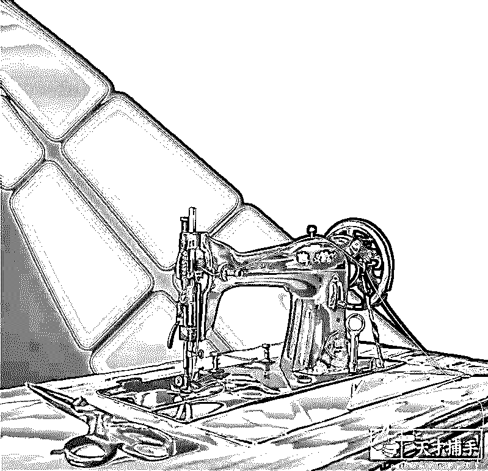
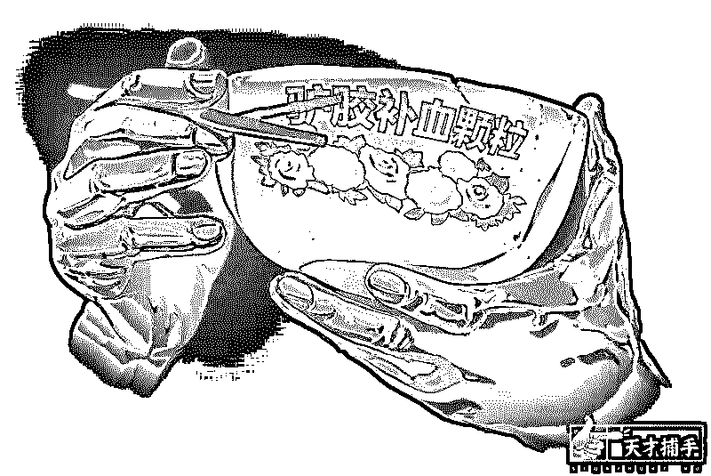
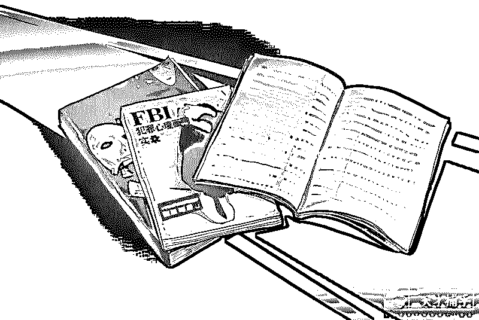
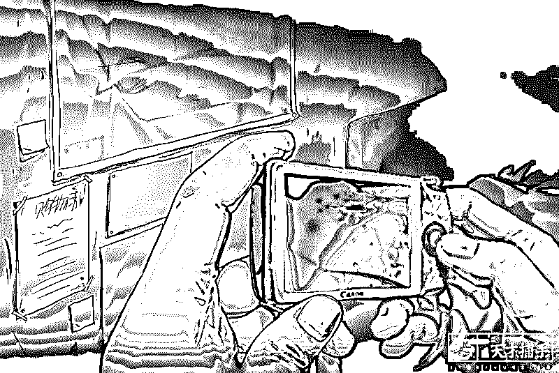
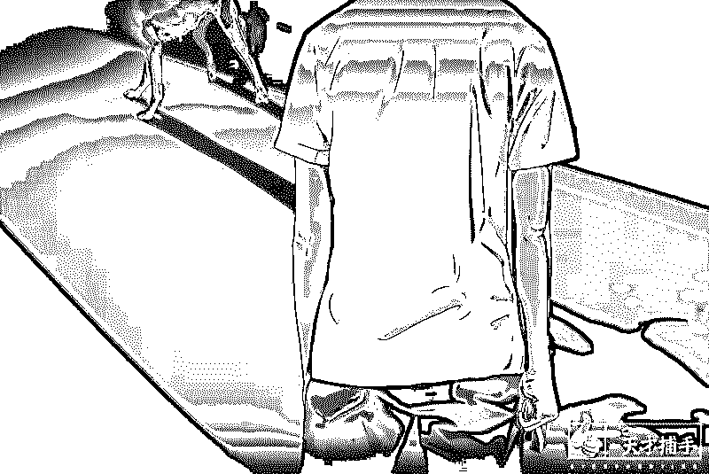
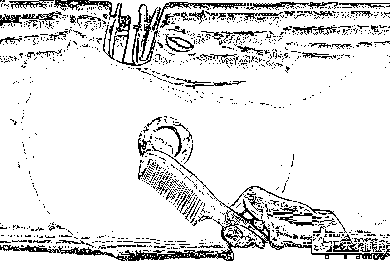
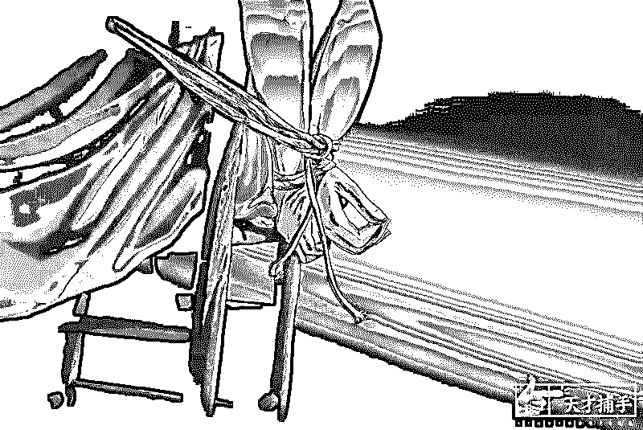
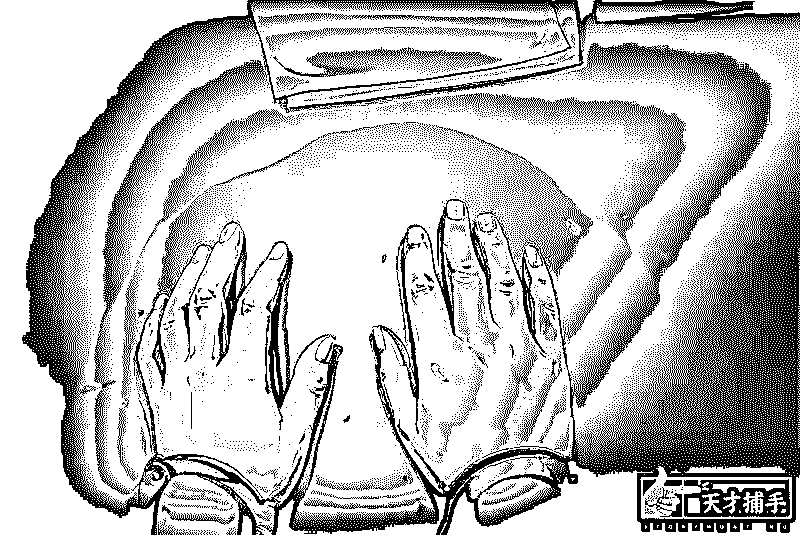

# 不完美犯罪：我是优雅杀手，专挑没用的人下手

> 原文：[`mp.weixin.qq.com/s?__biz=MzU4ODAwNzUwMQ==&mid=2247484415&idx=1&sn=41edf4295fcc6b65fef5f3b399714de3&chksm=fde212ddca959bcbe1c41b03d247328972483ae5bf0a24e09180bf2a9b8268c796047c4e95ce&scene=27#wechat_redirect`](http://mp.weixin.qq.com/s?__biz=MzU4ODAwNzUwMQ==&mid=2247484415&idx=1&sn=41edf4295fcc6b65fef5f3b399714de3&chksm=fde212ddca959bcbe1c41b03d247328972483ae5bf0a24e09180bf2a9b8268c796047c4e95ce&scene=27#wechat_redirect)

近来，我们时常讨论内容的高维度价值。

为此在原有内容的基础上，增加了故事类的内容，以求通过展现别人的真实经历来让读者获得启发。

黑客在虚拟世界里拥有自己的上帝视角，那些不可见的角落由此一览无遗。就和我们一开始用的介绍一样，“安全圈的一双眼睛”。黑客的眼睛可以在虚拟世界里拨云见日。

因此我们在努力去做一个互联网黑幕的编年史，让隐晦变成一种真实。

天才捕手计划是一个从它建立开始，我就关注了的公号，专做非虚构的故事。在我看来他们更像是站在人性背后的眼睛，还原现实世界里的骨感。

从某种意义上看，这是两个不同的维度，目的都是展现一些稀缺的真实。

考虑到一本黑的读者男性居多，我们选择了一个反社会人格杀手的故事，这种人喜欢与体制对抗，做事不为利益只为自己痛快，观念非常偏激。

在我看来，对比是有助于选择决策的方式，要寻求理性就先要了解何为偏激。

希望各位可以在这也能看到那些人性背后东西。

* * *

**事件名称：不完美犯罪事件**

**亲历者：刘焱**

**事件时间：2016 年 6 月**

**记录时间：2018 年 7 月**

**不完美犯罪事件**

刘焱/文

2016 年 6 月 13 号，卢涛下完工，身穿 T 恤，卷着裤管，双手端着一套皱巴巴的西裤衬衣，走进工地旁的裁缝店熨烫。

裁缝店很小，只有台老式缝纫机，立式衣架上挂满廉价花格子衣裳，标价 10 元到 15 元，还有各种二手迷彩服和胶鞋售卖。

老板接过衣服，“五块钱，坏了不包赔。”

卢涛说：“钱不是问题，你熨好一点，我要出席个重要的会议。”其实他刚刚下定决心，要去体验西方人的生活。

穿上西裤，扣上衬衫纽扣，卢涛觉得自己很有气质。

他走出工地，看着下完工后无所事事的工友们，心想这些人真可悲。

平时卢涛在工地旁的小店吃饭，10 块钱能打好几个菜，不够可以加。现在他挑中了一家西餐厅，钱包里准备了 300 多块钱，应该够上档次了。

西餐厅电梯里有人吸烟，卢涛心生不满，他觉得在这种高档的地方，不该有没素质的人。卢涛想制止这种行为，最后忍住了，“那人手包鼓鼓的，看起来很有气场。”

高档餐厅果然没有让他失望，雅致的装饰，有礼貌的服务生，客厅中央还有钢琴师正在演奏。钢琴曲很好听，但卢涛听不懂，他怯生生地问服务生是什么曲子。服务生告诉他是《Songs From A Secret Garden》，他点了点头：“我知道，是外国歌曲。”

接过菜单，最低的套餐要 500 多，卢涛骑虎难下，咬牙点了个 600 元的双人套餐。等服务生离开后，他给相好的工友打去电话，让人送钱过来。

工友穿了身迷彩服，径直走进餐厅，还没落座，就说服务生看自己眼神很怪，接着大声质问卢涛为啥跑到这地方。卢涛让他小声点，说这是上流场所。

牛肉、意面、很涩的红酒。对卢涛来说，这餐饭并不值得，他一天的工资不到 200 块，还不是每天都有得做。

“这是一扇窗，我想爬进去，和里面的人一样斯文。”用餐时，卢涛说出的这句话，工友至今无法理解，他看卢涛连刀叉都不大会用。

在工地上，往往依照手艺高低来评判个人。工友对卢涛的评价是这样的：手艺一般，干活算是最差劲的那个。“这人多读几本书，走火入魔了，拽什么‘刑法犯罪构成理论’，大家听了都翻白眼。”

接完白眼，卢涛又捧起那台二手便携播放器，看《重案六组》的碟片。

他看完后总要“研究”一番，反反复复观摩作案手段以及破案思路，让自己分别站在罪犯与警察的角度进行推演。

有时工友们拿他打趣，问卢涛怎么不去当警察？

卢涛说：“警察没几个厉害的，我适合当刑侦专家。”

2016 年 6 月 11 号，卢涛去熨衣服的两天前，他所在工地的附近发生一起命案，传言是丈夫将妻子割喉，并把尸体开膛，从乳房中间下刀，延伸至肚脐。

凶手作案手段残忍，工人们都在讨论这场杀妻案。

卢涛记得自己当时参与了这场讨论，他蹲在一边，手捧驴胶补血颗粒碗，用筷子指着工友们发表高论，“有需求就会有市场，从犯罪心理学角度来说……”

没等卢涛说完话，其他人迅速散开，说卢涛又不知道自己是谁了。

卢涛很失意，大声说，“你们是不知道我的本事，我是受过西方思想、罗马法的影响的，还研究过著名的辛普森案，不信你们看我的笔记。”

没有人理他，工友们正讨论晚上是“炸金花”还是“斗牛”。

案发后第 19 天，公安机关宣布“6·11”案告破，嫌疑人就是死者的丈夫。

9 月 7 号，相邻的一个区又发生一起命案，死者同样为一名女性，颈部被绳索缠绕，口唇青紫，右胸被锐器插入，没有提取到指纹。

卢涛在现场不远处看热闹，手里拿了本《中华人民共和国最高人民检察院公报》，工友问他：“要不要过去破个案？”

卢涛给出了自己的判断：“不用想，又是熟人作案，刑事案件中熟人作案多达百分之七十多。”

卢涛话还没说完，突然有人跑到警戒线外对着民警大声喊，“这个案子完全可以和‘6.11 案’并案侦查。”

此人是“6.11 案”嫌疑人的辩护律师，该案是他第一次独立辩护，他认为自己的委托人是清白的，所以行为有些鲁莽。

看到这一幕，卢涛跟工友说要去图书馆还书，迅速离开了人群。

民工装束的男子，手里揣着本专业性较强的杂志。有位便衣老民警将这一切看在眼里，他非常好奇，跟上了卢涛匆匆离开的脚步。

跟踪的路上，卢涛神色慌张，不停回头看，老民警认为其中一定有蹊跷。

到了图书馆，老民警查看卢涛的借阅记录，都是些犯罪类的书籍，其中有化学工业出版社的两本《FBI 犯罪心理画像实录》和《侧写师：用犯罪心理学破解微表情密码》，以及上海译文出版社的《香水》。

《香水》是一本德国小说，书中的男主人公痴迷于女性身上的气味，杀害了 25 个少女。

老民警觉得有必要进行一次问询，他走到法律类书籍区对卢涛说，“我是警察，请出示一下身份证。”

卢涛迟疑地看着老民警，马上又恢复警觉，“我犯什么事了吗？”

老民警回答说只是例行检查，他一眼瞟见卢涛的笔记本，看到一段话：犯罪分子眼神往两边散，注意眼神要坚定。

这是关于如何隐藏微表情的内容。

“那请出示你的证件，凭什么在图书馆内捣乱，这是读书的地方，你这是对知识的藐视！”尽管卢涛的言辞激烈，却刻意压低了声音。他看过不少警匪片，知道警察执法之前，要出示证件。

这一点让老民警出乎意料，却更坚定了自己的怀疑，便说证件很快会让同事送过来。

“我赶时间，就不陪你折腾了。”卢涛抱起一摞书转身去管理员处扫码，不再说话，径直往外走。

老民警跟出去将卢涛扑倒在地，喊来附近的三个保安将其制服。

15 分钟后，老民警的同事赶来，将卢涛带上警车。

车子发动的时候，卢涛望着眼前的民警，语调平静：“你们帮我把地上的书还一下。”

在派出所进行问询时，卢涛一口咬定提供的姓名和身份证号是真的，照片跟本人不像是因为他有些显老。

老民警打开卢涛的手机，从通话记录里拨出号码，打给卢涛的工友，说捡到一部手机，让对方提供卢涛的姓名和地址。

卢涛的工友非常配合地说出了警方想知道的信息。

警方通过查询发现，卢涛没有前科，不是网上在逃人员。找来被害人家属进行辨认，他们完全不认识卢涛这个人。

卢涛提出抗议，无缘无故扣押他，属于警方滥用职权。

老民警提出去他的住处搜一下，卢涛紧绷脖颈，望着天花板说了句，“那就去吧！”

那是一个单间，里面只有床和折叠桌，地上散落着胶桶和切割机等工具。

真正吸引人注意的，是卢涛贴在墙上的市行政图、交通图，以及他自己画的草图。

卢涛用红笔在图上做了些记号，点、线、圈基本上覆盖了地图的三分之一，旁边歪歪斜斜地写了“混乱区域”，“最佳路线”。几张便利贴分别贴在地图的四个方位，写着“虚伪虚荣者死”，“目中无人者死”，“强酸溶解？”“购物清单”之类的字句。

在枕头底下，民警搜到一台老式佳能数码相机，里面保存着两位死者的裸照，血还没有凝固。

公安机关以涉嫌故意杀人的罪名对卢涛进行刑事拘留。审讯时，卢涛对老民警说，“算什么本事，你不过是瞎猫碰见死耗子，看你怎么定罪？”

卢涛认为侦查员没有出示搜查令，案发现场无任何属于他的痕迹，再加上零口供，不一定能定他的罪。

一个月后，我去派出所办事，碰到卢涛的大哥在那里说要请律师，民警用手指了指我。

我过去了解了下情况，卢涛大哥说，“只要你能见到我四弟，给他辩护就行了。”

我从卢涛大哥口中得知，卢涛是家里最小的孩子，很聪明，但家境窘迫，只能供他读到初一，现如今 35 岁，在老家还有几间房。

“他对朋友很好，受欺负能忍，但和亲人好像有仇，年三十都能掀桌子。”卢涛大哥感慨道：“可能我们都是他说的那种没用的人，他看着就来气。”

“这么说，卢涛怎么会去杀两个跟他毫不相干的人？”我对这个说法存疑。

卢涛大哥的回答更让我匪夷所思：“他不喜欢这两个女人吧。”

签委托协议时，我顺口说了句，这是个大案子，你要不要考虑一下我们主任？不过收费可能会更贵。

卢涛大哥双手交叉在胸口，似笑非笑，“不大，不大，杀一两个人不算大案，你不要诓我。”

这是我第一次接连环杀人犯的案子，为了了解当事人，特意去问了卢涛身边的人。

他们说卢涛比较讲究，不占人便宜，做事讲规矩，过马路一定要等红绿灯，如果不是老爱说那些莫名其妙的理论，相处起来还蛮舒服。

而我在第一天会见卢涛时，就遭到了他的挑衅。

他扫视我几眼说，“凭什么你是律师，我是犯人？”

我压住怒火，说自己是他的律师，两人算是在一条战壕里，不该分你我。

“嗯，有点法律素养，我也上过大学，在 XX 大学听过 XX 教授的课。”他俨然前辈般点评，“法律系的女生很有气质，她们才是我未来老婆的人选。”

卢涛还说自己喜欢坐在第一排，这样能更快接受知识，“我被教授夸过两次，他说法学院有位经济法教授是当兵出身，也是通过自考改变的命运。”教授的这句话让他备受鼓舞。

“伊顿公学知道吗？我下课从教室走出来，就像个绅士。要是让我做法官，肯定很有魅力，案子也办得漂亮。”

“那位教授是我的犯罪心理学老师，课讲得不错，这样说来，我该叫你一声师兄。”其实卢涛去听课那会儿，我早毕业了，为了不被他排斥，我才故意这么说。

这样的话让卢涛很受用，他用食指敲了敲桌子，“咱师兄弟同仇敌忾，杀出一条血路。”

我对卢涛说：“你可以自考，然后司法考试，接着考研究生再读博，以后说不定就跟教授一样了。”

“别的我都可以，就英语不行，我在农村上初中，英语都是老师用汉语标出来教我们，那 26 个字母我都读不准，要唱字母歌才能唱得全。”

卢涛还提议道：“我们要进行教育改革，英语改成选修，不要必修，你就说你们律师有什么时候说英语吗？”

“我们也要读英文文献，还有人是学国际法的，英语肯定有用。”我对卢涛解释。

可能是觉得被“师弟”反驳没面子，卢涛质问我：“能用到的时候有多少！”他很激动，翻动的下嘴唇往前凸了不少。

“确实不多”我不想跟卢涛争论，就问人是不是他杀的。

他半眯着眼，摆了摆手，“这个问题你问得有些多余，人可以说是我杀的，也不能说是我杀的，他们的证据不具备客观性、关联性、合法性”。

“你为什么要杀她们？”我想了解缘由，告诉卢涛，就算他不承认杀人，也没人能为他做无罪辩护。

卢涛没有直接回答我，反而说起自己 11 岁时，喜欢一个女孩，结果女孩妈妈跑来辱骂他，说瞧他家的穷酸样，女儿嫁给一条老狗也不嫁给他。

“当天晚上我四处闲逛，看见两条狗黏在一起，踢都踢不开，我跑到家里，拿把菜刀，在它们背上乱砍，听着嗷嗷叫，好解气。”

初中辍学那天，卢涛的一位老师告诉他，即便在外头混，也要记住，凡事要用脑子，“劳心者治人，劳力者治于人”。

卢涛听进去了。他平时爱买些闲书，来显示自己是脑力劳动者。

十几年后，他觉得自己虽然不富裕，但精神层面已经超过不少人。他开始和别人谈论素质，说真正的贵族，言行就应该是高贵的，还要能推己及人。

在公德方面，卢涛做得很好，他不随地吐痰扔垃圾，所有“上层社会”的人该有的素养他都有。他渐渐看不起一些人，对那种“卑劣的行径”咬牙切齿。

有次在电影院里，一个女人不停和旁人讲话，卢涛站起来制止，女人问关他屁事。

卢涛不再作声，等影片结束，他走过去理论。

“你也不撒泡尿照照自己，一看就是做粗工的，还在这里好为人师，小学毕业了没？”女人毫不留情地辱骂他。

“我告诉你，人不可貌相，我还就是一名教师。”卢涛气不打一处来，他说想杀了那个女的，“这种女人活在世界上，除了给男人用，再无其他用处。”

女人的同伴顶了一句，“现在的老师过得也就那样，还不如一个粗工。”

这句话下来，卢涛气消了，他说这女人讲话虽然难听，却救了她们自己一命。

没多久，工地发生了盗窃案，警察过来做笔录。

卢涛跑过去，说自己在大学旁听过法律，多少懂一点刑侦知识，如果有需要，能帮得上忙。

警察没有理他，开着车子走了。

卢涛觉得没面子，在后面大喊一句，“看不起我！”

从那以后，卢涛埋头钻研刑侦和法律，在地摊上买一些罪案书籍，“都是些低端的杀人噱头，怎么能够满足我的专业需求，再看下去简直侮辱智商”。

他开始去市图书馆借阅法律刑侦类书籍，经过几个月，他自觉专业能力有了质的提升，萌生出想专职帮工人们维权的想法。

有次卢涛的工友被人打伤，派出所认为事情不大，从中调解。卢涛出面代表工友索赔，首先提出申请“财产保全”，他说这是当事人的权利。

派出所民警没有理会他，轻蔑地表示，“我们很忙的，你多读几本书再来指手画脚。”

卢涛不敢发作，有种情绪如鲠在喉。“派出所里出来，我工友不说话，一句谢谢也没有。我不想一辈子被人轻视，不做几件完美的大案，证明自己比警察聪明，这口气怎么咽的下。”

卢涛为此翻看了《中国刑事审判指导案例》，重点研究了第二卷的“犯罪和刑事责任”以及第六卷的“刑罚”、第七卷的“量刑”、第八卷的“累犯”，还有第十二卷的“时效”，尽管对其一知半解，却也在笔记本上抄了不少句子。

他还从地摊上找到过“香港雨夜屠夫”案的相关信息。

最后，卢涛总结出他**所谓的**“完美犯罪”的经验**（实际并无价值）**，给自己定下几条规矩：

1.连环作案的话，要避免使用同一手法。

2.要有极强的反侦察意识，不能有任何目击证人。

3.作案最佳时机在雨夜，没有人出门，雨水容易冲走现场痕迹，但要注意鞋印。

4.刑侦专家说刑案的 70%都出自熟人之手，如果将陌生人作为目标，戴手套，不留指纹，躲开监控，警方将难以破案。

卢涛后来告诉我，他写完将笔一甩，觉得一般人没自己这个水平，应该在本子上加个评语“nice”。

但这个单词他只会念，不会拼，最后只好写道：“万事俱备，伺机而动”。

第一个受害者原本不在卢涛的计划之内。

6 月 10 号晚上，卢涛在公园散步，撞见个女人对着电话大声辱骂丈夫没用。卢涛非常反感这种行为，他觉得这个女人没有素质，不守妇道。

卢涛尾随其后，一直跟到女人的住处，她依然不依不饶地指责丈夫。

卢涛返回家，关上门，呼吸急促，“有了这个念头，多少有点紧张，有点兴奋。”

他坐在地上，把地图、纸条笔记本上的内容快速过一遍，想好该准备的作案工具。

大约十分钟不到，他站起来，走到镜子面前，将梳子沾上水，给自己梳了个中分，打开手机，点开一首凯丽金的萨克斯曲子《回家》，试着走了一下自己胡乱编的舞步，没有节拍，一前一后。

“很优雅，我非常满意，音乐是锦上添花的东西。”卢涛说。

音乐结束，他找出事先买好的鞋套、橡胶手套、避孕套，推开房门。

他再次回到女人住处，躲在屋后的铁树下，等待女人的丈夫离开。

当女人的丈夫出门后，卢涛穿上鞋套潜入房间，一脚将女人踢倒在地，“我教你来世怎么做人，你作为妻子，动辄打骂丈夫，像什么话，嫌你老公没用，那你看看我有没有用！”

女人当场痛得没了声息，不停颤抖。

卢涛俯视地上的女人，他在想要不要就此罢手。

念头一闪而过，卢涛想起一句话，“不可沽名学霸王”。他抓起桌上的水果刀，划过女人的脖子，“不痛了，很快就不痛了。”

听卢涛说到这里，我下意识地摸了摸自己脖子。

卢涛说他脱下裤子时，女人的血还在流。几分钟后，他拿掉避孕套，用厨房里的保鲜袋装好。

“我想探个究竟，她们的高傲是从哪里长出来的。”卢涛划开女人的身体，刀子没有他想象中的利索，血往两边流，一层一层地割开肌肉、脂肪、内脏表面膜，等看到内脏的时候，肚子已经划得不像样子，器官也被割坏掉。

卢涛本想整块取出器官观察后再放回去，但胃液上涌，他冲进厕所吐了。

听到这里，我告诉卢涛：“你不做这些鬼事，说不定还能留条命。”当时死刑核准权收归最高人民法院，只要情节不是特别恶劣，认罪态度积极，在量刑上一般会多考虑些。

但看着眼前的卢涛，我预感到自己的职业生涯又要背上一条性命。

事后卢涛反复冲洗马桶，他知道不能留下痕迹，“很多人就败在细节上，不过警察好像也没注意到这点。”卢涛表示很失望，觉得自己的档次被拉低了。

我曾遇到比卢涛作案手段还要凶残的嫌疑人，但在证据确凿的情况下，他们都会哭泣祈求。反观卢涛没有一丝悔改的态度，我觉得有点恶心，刚好看守所工作人员过来提醒时间差不多到了。

走出看守所，我接到一个电话，“6.11 案”的律师说要请客吃饭。

我赶到包厢，发现有两个人，其中一个神情呆滞，应该是受害人的丈夫。

我往后退了几步，生怕他因为我是凶手的律师，就用椅子砸我。

没想到他开口对我说，“多亏你的当事人，要不是他后来做的事，我就死在里面了，我不想死。”

临走前，这个男人向我点头示意。

卢涛跟我说起他杀的第二个女人。

警方宣布“6.11 案”告破后，卢涛觉得好笑，他说世上没有所谓的“神探”，如果谁被捧为神探，那冤案就快来了，“现在唯一相信那个倒霉蛋无辜的大概只有我了。”

吃完西餐，卢涛感觉很好，他决定咬牙大出血，去体验五星级酒店。

出租车到了酒店，服务生打开车门，问卢涛：“先生，后备箱有没有行李？”

卢涛觉得“先生”这个词很好听，他认为这一切都得益于自己的“高智商”，不然他现在应该是一个逃犯，怎么能堂而皇之地享受别人的尊重。

在酒店走廊，卢涛看到有个女人挽住老头，在索要工作机会，老头欣然同意。

卢涛想动手了，但他需要让第二起案件看上去与第一起无关，只好暂时潜伏。

下午，卢涛到酒店咖啡厅，点了杯卡布奇诺，很苦，他往里面加了很多包白糖。

卢涛问我喜不喜欢咖啡，我说太苦了。

“咖啡虽然苦，却是一款带有西方纯正血统的饮品，上流社会喝咖啡，这是格调，是那些光膀子喝啤酒的人所体会不到的。”

卢涛喝咖啡时，女人又出现了，她正在大声地打电话。

在偷听来的谈话内容中，卢涛得知女人帮朋友租了间平房，明天会提前过去收拾，具体地址也在电话里讲了。

“这种女人，自私又虚伪，自己在五星级酒店出卖身体谋求职位，朋友过来了，就安排那么个破烂地方，不给点教训，孰不可忍。”

卢涛还教我，“以后遇到这种看起来光鲜亮丽的女人，一定要看她讲不讲仁义。”

第二天，卢涛来到平房附近，在女人开门时，他冲进去，说自己是一名教师，来给女人上课。

女人骂了句神经，掏出手机要报警。

卢涛戴上手套，用手肘夹住女人的脖子，从背包里掏出绳索将她捆绑在椅子上。

他说，“请你相信我，我是位教师，只是想告诉你，你要守妇道，不能用身体去获得利益，还有对朋友要讲义气，以后好好和你老公过日子。如果可以，我们交个朋友，我一定对你很好。”

女人大呼救命，骂他臭不要脸的下三滥。

卢涛很愤怒，掏出水果刀，直插女人胸口，他对女人说了最后一句话，“忘了告诉你，我还是一名人民法官，现在我判处你死刑，立即执行！”说完，他解开绳索，勒住女人的颈部。

“为什么第二天敢去现场？”我在后期的会见中问卢涛。

卢涛告诉我：“像欣赏自己的一件完美的作品。”

谈到这里，我觉得和卢涛没法聊下去，他太过自负，在现代刑侦手段中，一般案件都能找到侦破点。当时看守所的会见室很热，空调也没开，我无聊到边听他讲话边转笔。

卢涛哈出一口气，“如果有烟的话，我能吐出一个又一个的圈。”说完他闭上眼睛。

“为什么你一旦看人不顺眼，就想着要弄死对方。”我没空陪他演戏，想做最后一次努力，让他积极认罪。

“她们达不到我的层次，只能等着被淘汰掉，换一批新的，整个素质就提升了。”他紧皱眉头，表情很失望，丝毫没有意识到，没有任何人有权利去淘汰别人。

我告诉卢涛，我选择做罪轻辩护，希望能争取个死缓，需要他配合。

“你就这么没出息？你就不想和我一起打配合，创造无罪释放的历史吗？”卢涛始终认为警方没有拿准他的七寸，他觉得任何人都想出人头地，扬名立万，包括我。

我说自己没有什么惊天动地的目标，只希望经手的每个案件，都能避免成为冤案就好。

我起身准备离开，卢涛的眼神里满是企求，在我整理资料时，他伸出被拷住的双手想要帮忙，却被铁窗拦住。最终他什么都没有说，也不肯往回走。

开庭时，卢涛坚称自己无罪，说相机是自己捡的，因为喜欢看侦探小说，才根据相机内的信息，尽力贴近凶手的内心，做一次常规演练。

一般犯人，不论是贪官还是黑老大，在法庭上，基本上都会声泪俱下，痛斥自己的愚蠢行为，希望法庭给自己一个改过自新的机会。

卢涛不同，他始终仰起头说话，时而面露喜色，对自己的论点非常满意。

“有些话，我的律师不敢讲，他为了爱惜羽毛而摈弃法制。公诉方说我杀人了，我与被害人素不相识，我的杀人动机是什么？警察搜查我的房间，你们法院什么时候出具的搜查令？还有警方经常恐吓我，问我为什么要杀人？不该你们查明真相吗？”

抛出一连串的问题后，卢涛又进行质证：“你们说我强奸了被害人，却没有提取到任何精斑，那我说自己是处男，你们要不要检查一下？”

家属也在旁听席上，看到他这个样子，异常愤怒，将鞋子水杯直接往被告席上丢。审判长对他们进行的严重警告，说再有此事发生，将带离法庭。

卢涛拍了拍身上的黄色马甲，不紧不慢地说，“到目前为止，没有任何证据显示人是我杀的，但就已经确立的事实来看，该审判的是那两位死者，而不是我。”

接着他又补充了一句，“有人养没人教才会不守妇道。看来是真的。”

卢涛显然对我的表现不满意，宣布解除委托关系，说自己要舌战群儒，发起自我辩护。

我转而到了旁听席，因为出神，对卢涛后来在庭上说的话一句也没听进去。我看着被告席上的他渐渐被拉长，越来越模糊，直到审判长宣布择日宣判时，我才清醒过来。

判决下来的那天，我对卢涛的大哥说：抱歉，是死刑。

卢涛的大哥面无表情，凑过来小声对我说：“你是我请的律师，过去帮我问一下，看我弟打算把财产留给谁。不要说是我想要，吹吹风，说他的这些事，其他人都不管，都是我在帮他到处张罗。”

过了半个月，看守所里的管教给我打来电话，说卢涛要见律师。

我去见卢涛时，他已经没了之前的底气。他说监狱里的人，基本上不看书，没人真正关注法制以及国计民生，只关心自己的刑期，讨好管教，没一个有水平的人。

我不知道说什么，随口说了句：“你在图书馆那三本书挺不错的。”

他叹了口气，“那个我其实看不下去，外国的书读起来很拗口。”

沉默一会，卢涛说自己只认真看过某老牌文摘杂志上的一篇文章。有个很想当兵的小男孩，南京城破后，他捡起逃兵扔在地上的军装，扛起枪和日军周旋，很快被击中胸口。

“他有了自己的军装，也就有了自己的身份和地位，成了英雄。”卢涛说这一直激励着他。

我问他还有什么心愿，或者财产要交代的。

“西餐厅的那首歌好听，家里的几间房给大哥，他是个厚道人，遗书你带给他。”

我打开手机，放了一段《Songs From A Secret Garden》。

听完后，他说，嗯，只能这样了。

在被捕前，卢涛曾有个愿景，跟工友们说了不下几十遍：等工地的楼盘开售了，他希望买套电梯房，在最顶楼看这个城市，然后喝杯红酒。

“你知道吧，有个大学教授都说过我会大有出息。”他说。

▲

卢涛被关押期间，刘焱和他见了 8 次，其中一次会面快结束时，刘焱对卢涛说：“你这种人，要是在外面，我都害怕。”

刘焱为卢涛翻阅卷宗，查找证据漏洞。是坚守自己对法律的态度，而非任何同情。

与其说这是两起命案，倒不如说是一场沾惹人命的闹剧。卢涛在台上固执地扮演小丑，采用蹩脚的手段残杀生命，被捕前仍在沾沾自喜。

而在现代刑侦手段下，警方甚至能从捆绑尸体的绳索磨损程度推测出抛尸地点，卢涛所有杀人的痕迹都无处遁形。

逮捕卢涛的老民警在看过他的犯罪笔记之后，立刻说了一句：“这个人脑子烧了。”

在一些国家，连环杀手可能成为流行文化符号，杀手在监狱里会收到女粉丝的情书，残忍的暴行被“浪漫化”，是一种病态的痴迷，和对行凶者不着边际的幻想。 

当像卢涛这样的施暴者被还原，你发现他不酷、不可怜，也不聪明。

挖掘施暴者的经历，是为了规避暴行产生的诱因，而不是为暴行提供合理性。 

如果我们不能认清这点，和“欣赏自己完美作品”的卢涛相比，可能没有区别。

别轻易忘了，你所谈论的是个杀人凶手。

（文中部分人物系化名）

**插图：@东五环超人 baba  **

看完故事，我和陈拙聊了聊，问了他几个问题：

1.卢涛这个案件为什么不难破，最后给他定罪的证据有哪些？

答：从现在的角度回头看，当时这起案件就是个普通的杀人案件，现场肯定会遗留生物特征，作案手段也比较常规。

2.被杀女人的丈夫为什么担心自己会死？一方面说现代刑侦手段有多牛逼，一反面第一次宣布凶手是死者丈夫，不矛盾吗？答:技术再牛逼，也是一些人在用，就如中国天眼多牛逼，可是那么多失踪儿童都找不到。

有什么我没问到的，你们就去天才捕手找陈拙吧

「天才捕手」专门在民间寻找有有故事的人，挖掘他们带劲儿的人生经历。

陈拙会把这些口述的故事整理成文，每周四在「天才捕手计划」的公号发布出来。