# 黑客起底网络赌博内幕

> 原文：[`mp.weixin.qq.com/s?__biz=MzU4ODAwNzUwMQ==&mid=2247484400&idx=1&sn=9457bd40ed13272adb30a36fc35cda81&chksm=fde212d2ca959bc46faa6ad7ae03a9cf99ee891714a2cc9b32370a26a9b8b681a3a59142a0a7&scene=27#wechat_redirect`](http://mp.weixin.qq.com/s?__biz=MzU4ODAwNzUwMQ==&mid=2247484400&idx=1&sn=9457bd40ed13272adb30a36fc35cda81&chksm=fde212d2ca959bc46faa6ad7ae03a9cf99ee891714a2cc9b32370a26a9b8b681a3a59142a0a7&scene=27#wechat_redirect)

“ 赌钱始终没有好下场 ”

—— 《 赌神之神 》

> 世界杯终于结束了，不知道大家有没有感觉到，身边看球的人还是那一小撮狂热分子，但赌球的人却越来越多，“ 球么不看，博么猛赌 ” 已经变成了世界杯期间很多年轻人的常态，互联网的便利，让赌博是在太轻松了，下注就像饿了么叫个外卖一样容易！差评君觉得有必要跟大家讲讲这个产业，正好世界杯也过去了，咱们不蹭热点，安静讲讲赌博这让人欲罢不能的事儿。

赌博是人类的天性这句话不知道是谁说的。

但是我知道说这句话的人肯定亏了大钱~

不过仔细想想，这句话又挺有道理的。

人类进化从某些方面来说是一个奖励冒险的过程，在我们还是穴居人的时候就能看出来。

出门打猎，有可能被各种不知名的危险杀死，也有可能带着食物回来；但是你守在山洞里面，就只有死路一条。

咱们的大脑喜欢被奖励，“ 赢 ” 的时候分泌肽和多巴胺，冒风险的时候分泌肾上腺素，这些都是会让你爽翻上瘾的东西。

天性如此，无法抗拒。

所以你们可以理解为啥每四年会突然出现这么多 “ 球迷 ” 了吧？

多巴胺

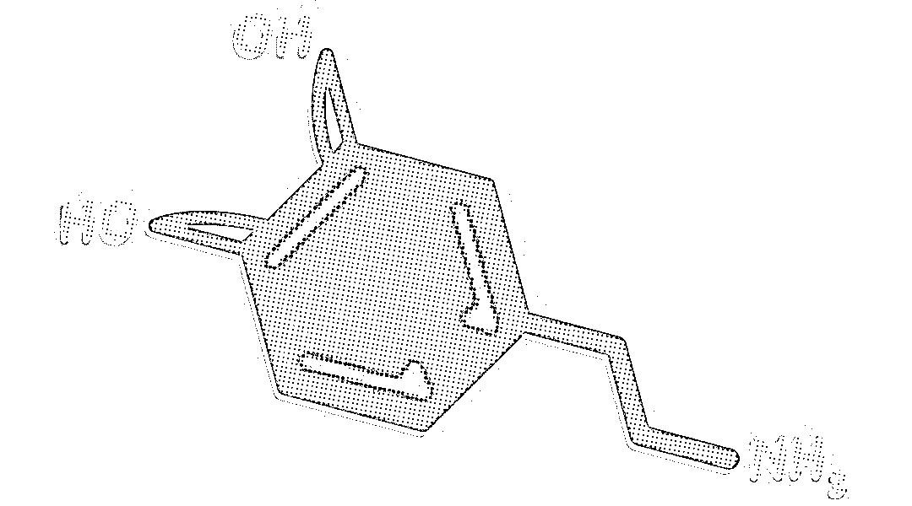

** 服务陷阱 **

体育本身就是个很刺激的事儿，光是看看激烈的比赛就足矣让你多巴胺上升，面红耳赤极度兴奋的大喊加油了。

如果再加上 “ 赌 ” 这么刺激的东西，那多半会让人欲罢不能了。

但现在的普法宣传做的已经很不错了，大家都知道赌博不好，赌博十赌九输，不要碰赌博，很多人碰到赌博第一反应是在多巴胺的作用下心痒痒，但不会真的去碰。

这时候网络赌博的公司的对策只有一个：**你既然喜欢爽，我就让你爽上天！**

只要你注册了，就先给你彩金试玩，不要你钱，你先玩着，如果赢了，自然就爽了想自己充钱试试，如果你输了不想玩了，他们也什么都没亏~

为了刺激消费，他们会变着法的给你 “ 送钱 ”，而且服务超级周到。

各种充值就送+高反水

其实他们的送钱完全没有成本，羊毛出在羊身上，薅的就是你。

上面这种直接送钱的，比较土，没什么互联网服务意识，下面说的，才见真功夫，感觉也就海底捞能比得上这种服务了。

差评君在此期间为了了解赌博网站，在某赌博网站充值了 200 块钱，随后接到了电话：

> “ X 先生您好，您刚刚注册了我们娱乐网站并进行了充值 200 元，现在跟您确认一下数额是否正确有遗漏。 ”
> 
> “ 对的，没问题。 ”
> 
> “ 您是第一次注册并使用我们网站，下面需要对您进行玩法讲解和引导吗？ ”
> 
> “ 可以的。 ”

随后，关于这个网站上的各种游戏各种玩法，只要差评君有问，客服必答，而且非常详实，没有丝毫敷衍，如果移动联通电信三家运营商的客服有这个标准，根本不可能有人去工信部投诉。

差评君赌输了之后就把这事儿忘了，结果一个星期之后，又接到了客服的电话：

> “ X 先生您好，您在我们平台还有余额未使用，是遇到了什么困难么？身体不舒服？工作太忙？网站被和谐登录不上去？

这个客服甚至表示为了我这个户头只剩几十块的客户，可以免费提供 VPN 逃避监管登录网站进行博彩。

在差评君表示只是工作有些忙而已之后，客服百般叮嘱差评君要注意身体，适度工作，少熬夜，甚至跟差评君讲最近下雨很多注意身体别着凉，最后还让差评君加她微信，有什么事情找她就好，声音甜的差评君差点就答应加微信了。

然后差评君就想着赶紧把上面的钱都花掉算了，免得以后还会打电话烦。

结果，两天之后，差评君竟然又接到了电话：

> “ X 先生您好，我们发现您在我们平台消费所有充值之后再也没有登录过，请问是遇到什么难出么？ ”
> 
> “ ........ ”
> 
> “ ..... ”

在随后的的对话中，客服表示会给我充值返彩金当做 “ 老客户返利 ”，**甚至差评君说自己没钱了****之后，客服表示可以提供金融服务，作为中介帮助借贷。。。**

差评君听了差点笑出声来，**现在网上流行的 “ 被安排得明明白白 ”，说的大概就是这样了吧。**

“ 没有理由拒绝我们 ”

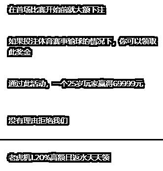

除了上面这种，还有打美色服务的，视频发牌，屏幕那头是个穿的很少的妹子，总之，总有一种服务你会喜欢。

所谓 “ 性感荷官，在线发牌 ”

这些全方位的服务，就像一个陷阱，让你碰上了就欲罢不能，**即使哪天你想不赌，都有人打电话催你工作别太忙，多来赌博散散心。**

** 绞尽脑汁的宣传 **

“ Show Business = Shit Business ” 

—— 《 摇尾狗 》

酒香不怕巷子深这种事儿，早在电视购物年代就已经不存在了，更别说现在信息这么爆炸的互联网时代。

你不打打广告，谁知道你谁？

赌场也是这么想的，世界巨头级的博彩网站，是直接投世界级比赛的广告，赞助球队的。

这里要说一嘴，**球场周围的广告牌是定向投放的，也就是说，现场球迷、美洲球迷、亚洲球迷看同一场比赛，看到的广告牌可能不同。**（这届世界杯没用这个技术）

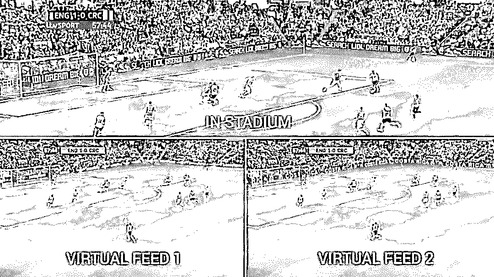

**“ 广告都做到赛场上了，这平台肯定安全啊！ ”**

不过这事儿在国内不成立，要是敢在直播里面加赌博广告，信号直接就被掐了。。。

但中国人嗜赌，中国这块蛋糕又不可能不做，该怎么办打广告让中国人知道呢？

这时候差评君就要祭出老师傅了，老师傅是差评合作媒体 “ 一本黑 ” 的员工，是一名淡泊名利的电脑基础知识爱好者。

差评君跟老师傅说了一个世界杯期间很火的博彩 App，老师傅回去捣鼓了一夜，给差评君提供了一些有趣的信息。

老师傅拿着数据库，跟我们讲，**这个博彩平台，在国内运营了至少十年了，因为数据库里面还有十年前的数据。**

这个博彩平台十年来靠宣传获取用户的套路，**简直一近代中国互联网编年史。**

近十年来互联网每个阶段最好用的宣传套路，都被他们玩个遍。。。

首先是挂 “ 黑链 ”，这在十年前的互联网上，这个方法极为有效。

博彩网站为了自己的网站可以轻而易举的被用户在搜做引擎上面搜索到，会入侵一些知名网站，并且在知名网站挂上自己的博彩网站链接，这样索索引擎就会认为博彩网站跟这些知名网站有不错的关系，会把博彩网站在搜索的排名中上升。

老师傅在数据库中发现的搜索引擎处理结果

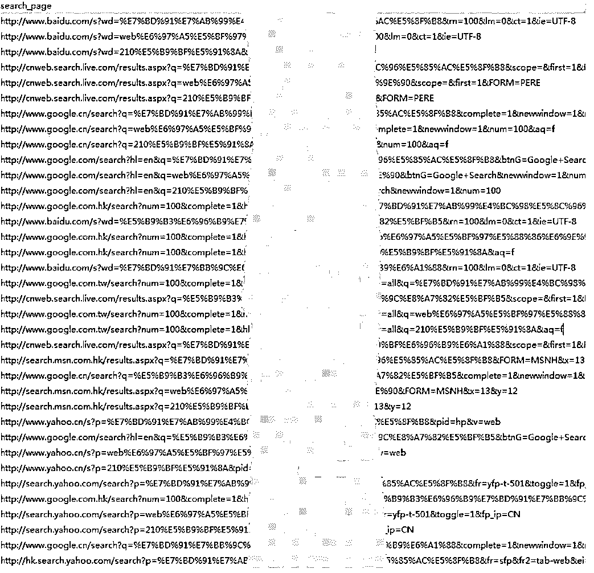

老师傅告诉差评君，这个博彩网站在高峰期间，挂过 2W 多个黑链，**其中不乏 “ 新浪 ”，“ 太平洋 ”，“ CSDN ” 等国内非常知名的门户网站**，数据显示这个在方式 2008 年左右非常有效。

再到后来，黑链不那么有效果了，他们就换成了关键词劫持和流量劫持。

比如你百度搜索个 “ 差评 ”，出来一堆网页，本来网页点开是进入差评官网的，但页面却会神奇的跳转到他们的博彩网站。

而且他们是按照地域来劫持的，从数据库中来看，用户主要都是黑龙江、陕西、上海、广东、福建的，说明这些博彩网站可能跟当地运营商的内鬼有过一些 PY 交易，做过运营商流量劫持。

**再后来，微博火了，这帮人玩起了微博营销号！**

他们专门注册大 V 高仿号，平时发发搞笑图小黄图之类的， 然后在微博下方评论中对赌博做宣传。

因为仅从数据库中看数据，老师傅只能做个大概的猜测，老师傅还发现他们用爬虫机器人爬取了大量微博用户信息，可能是用来给这些用户挨个发赌博广告私信用的。

数据库中发现的微博用户数据

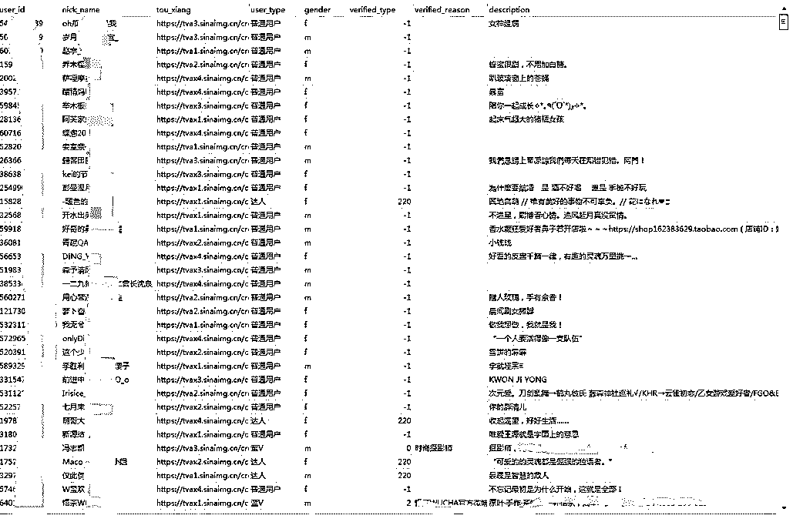

到了现在，垃圾短信横行的年代，他们也改成了发垃圾短信，可垃圾短信不能乱发对不？总要有个参照。

随后，老师傅发现了他们发垃圾短信的对象列表。

请点开大图看右侧红框

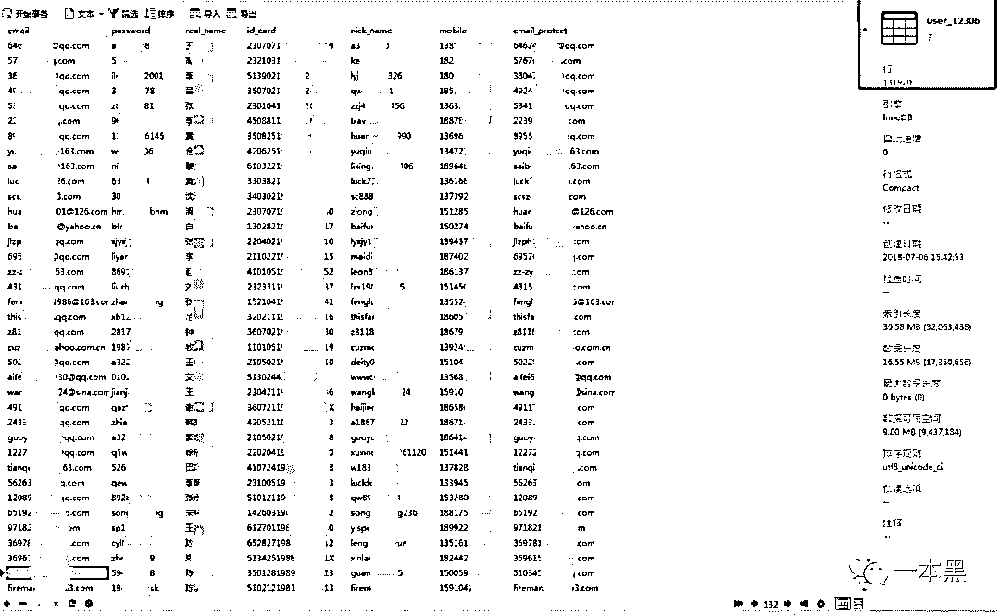

**这竟然是一个 12306 网站的泄露数据，里面用户邮箱、真实姓名、手机号、身份证号等一应俱全。**

而且似乎，发垃圾短信宣传的目标不只有 12306 这一个泄露的库，还有其他渠道。

现在你知道，为什么你的手机经常受到 “ 尊敬的 XXX 先生您好，欢迎你来 XXX 平台进行博彩 ” 等这样即知道你手机号又知道你姓名的垃圾短信了吧？

同时，为了保持平台的活跃性，足够吸人眼球，他们还会高一些千奇百怪的玩法~

**你见过赌【权力的游戏】第八季谁坐上铁王座的么？**

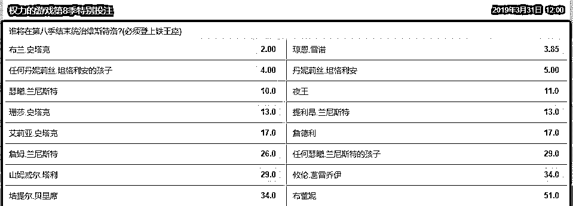

**你见过赌创造 101 最终 11 人名单的么？**

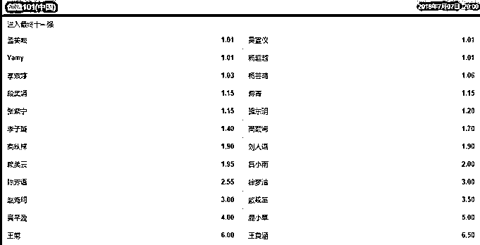

**就连纳斯达克的收盘点数都能赌。。。**

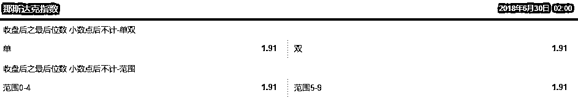

** 充值渠道 **

“ 只要有钱，别说枪了，装甲车我都给你整来！ ”

—— 《 黄金大劫案 》 

想要人们能在网上赌，那就必须要让人们能轻松的充值赌资。

可赌博在中国不合法，没有充值渠道，怎么办呢？

这个时候，钱的万能性就体现出来了，只要肯花钱，什么都能搞定！

网络博彩的充值渠道，非常齐全

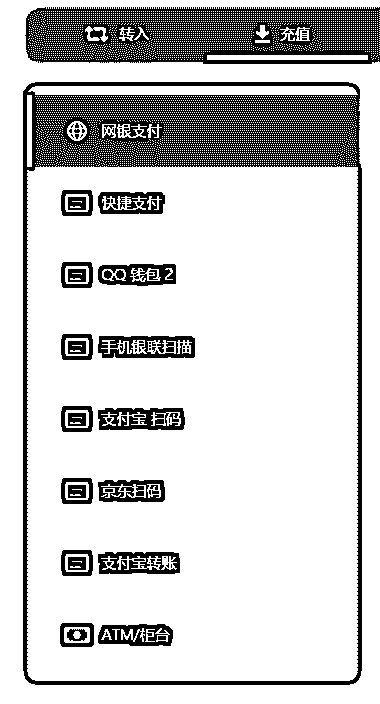

微信和支付宝是现在博彩 APP 的主要充值渠道，其中微信的比例是大于支付宝的。

因为对于基于 APP 或是移动 WEB 的博彩平台，他们主要的推广方式还是基于移动端的社交工具，这种平台一般都是以游戏（捕鱼、地主、牛牛）或是彩票类（竞猜、北京赛车、pk10、时时彩）等。

但在 2017 年上半年，微信支付宝被爆出第三方支付接口被黑产滥用之后，黑产很难拿到支付接口了，只要量一大了，就会出问题，因为很多人输了钱就会恶意投诉，一查一个准，然后账户就被冻结了。

所以，博彩平台会找到第四方支付平台，这第四方支付平台集合了非常多的第三方支付平台的为支付渠道（微信、支付宝、京东钱包等等）。

博彩平台会注册成百上千的商户，通过第四方进行收款，通过脚本不停地切换支付接口的商户，防止单个商户号被查，即使被查了也可以马上切换成新的可用商户号。

而且以个人为名义（当然，都是冒用身份信息）的商户号还可以随意命名，比如下面这个就是老师傅给差评君演示的商户号付款，“ 创联大咖 ” 这个收款方的名字可以随便更换。

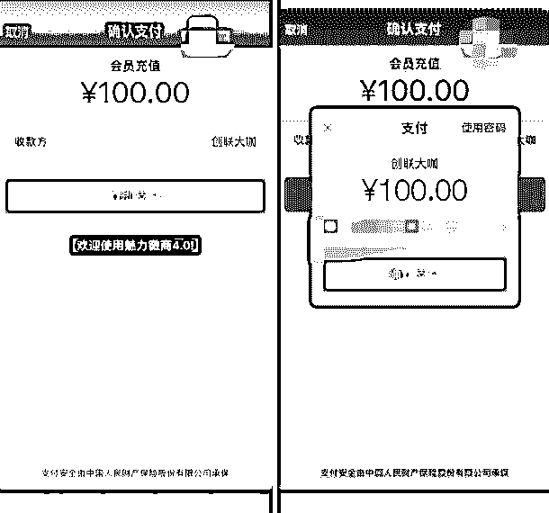

通过这种方式，平台根本是管理不过来的，而且何况支付接口抽成有钱赚，也就懒得管了，不出大事儿就行。

流水更大型一点的博彩公司，在旺季一个晚上流水就能上亿，他们这个体量就会找到一些有支付牌照的公司合作。

至于抽成么，据对黑产颇为了解的老师傅说，高一点的 2.8% 甚至 3%，低一点的关系好老客户 1.3~1.8% 都有可能。

** 也就是说，负责支付这一环的公司，一晚上至少就能赚 130 万，而且几乎是躺赚。**

**这么丰厚的利润，不知道有多少人抢着干。**

所以互联网赌博充值这事儿，反倒变成了拿钱办事儿的轻松事儿。

 想赢？做梦！

“ 名校数学博士们精算出来的赔率，怎么可能轻易让大学都未必读完的赌徒赢？ ”

—— 差评君

博彩公司对于赔率都是精准计算的，尤其是世界级的大型博彩公司，计算赔率和返奖率的都是精算师，甚至有专门提供做赔率计算和返奖率的公司，力争把自己的优势最大化。

也就是说，只要维护好声誉，让越来越多的人染上赌瘾，让越来越多的人来赌球，安心抽赌徒赌资的抽成，就可以稳赚！

先用一个简单例子来说明什么是返奖率——

“ 顶呱刮 ”  是中国体育彩票在 2008 年上线的玩法 ，返奖率是 65%，说人话就是，当你花足够多的钱去买这种刮刮卡，大概率下能中到的金额约占投入本金的 65%。

如果你有本事把这种刮刮卡的彩票全买回家，让别人一张也买不到，不管最终你花了多少钱，其中的 35%就成功捐献给了体彩。

这种即开即中的彩票是很容易控制赔率的，因为所有的中奖金额在你购买之前就已经打印在了彩票上，庄家只需要在生产前设置好返奖率就可以了。

至于赌球这种玩法就复杂一些，由于比赛双方实力差距有大有小，赌博不仅有猜输赢**（独赢盘）**猜比分**（波胆）**还有让球**（简单而言就是约定较强的一队需要净胜多少球以上才算赢）**大小球甚至是预测某个球员能进多少球，如此复杂的游戏赔率的设置不是赌博公司随意设置的，开盘前，赌博平台会有专门的精算师结合各种因素，通过设置赔率来保证赔率稳定 。

比如前几天的德韩之战， 因为赛前大部分人都认为德国会赢，压注德国的资金就会比韩国要多得多，所以德国的赔率就比韩国要低很多 。

100 块钱压韩国能赢 1000 的话，压德国的话可能只能拿到几块几十，赛前初始赔率的设置， 就是博彩公司保证盈利的第一大法宝。

有了赔率这一法宝，还是不够的，万一预测失误，大量资金去买韩国队了怎么办？

别急，赌球平台的赔率可不是一成不变的，这就像跷跷板一样，当其中一边涌入大量资金打破了精算师预测的平衡，赌球平台就会相应调低这一边的赔率，提高另一边的赔率，吸引大家去反向操作，保证平台的返奖率维持在一个范围内，避免平台入不敷出。

有人可能想说，在滚球投注中**（比赛开场后依然可以下注）**，如果在进球的一瞬间趁赔率还没来得及变化就大量买入平台是不是也存在亏钱的可能？

这就要说到第三大法宝： “ 危险球 ” 。

“ 危险球 ” 功能是大多数博彩平台都具备的功能，杜绝了玩家危险时机下注的可能，某些平台甚至是一只默认开启，下注后的一段时间内**（一般 5 分钟）**如果发生比分变化就会认定为下注失效并退还资金。

玩过滚球的朋友可能遇到过一种情况，就是电视直播还没进球呢，赌球平台的盘口就暂时关闭了，随后就看到电视上进球了。

这是因为电视直播存在一定的误差，而和你不同的是**赌球平台获得消息的方式可不是电视直播，而是卫星直播或者是雇人去球场人工发送赛况，保证博彩平台第一时间拿到重要消息**，甚至还出现了专门为博彩平台提供这种服务的公司，即便是你在比赛现场，留给你操作的时机可能也只有 3、4 秒钟而已。

**所以，在博彩公司面前，你注定是输家。**

关于互联网博彩，大概就是这么多了，差评君深知自己是没有办法劝一个执迷于 “ 自己能赢 ” 的赌徒回头是岸的。

同时，差评君也深知这样一篇文章不会对互联网博彩公司造成什么太大的损伤，他们会一直万古长青下去，直到永远。

但差评君还是有一丝希望，那些涉世未深，还没有被赌博毒害到的年轻人，可以看到这篇文章，离赌博远一点。

因为根据老师傅拿到的数据库数据显示，参与互联网赌博的有很多 90 一代甚至 95 一代！

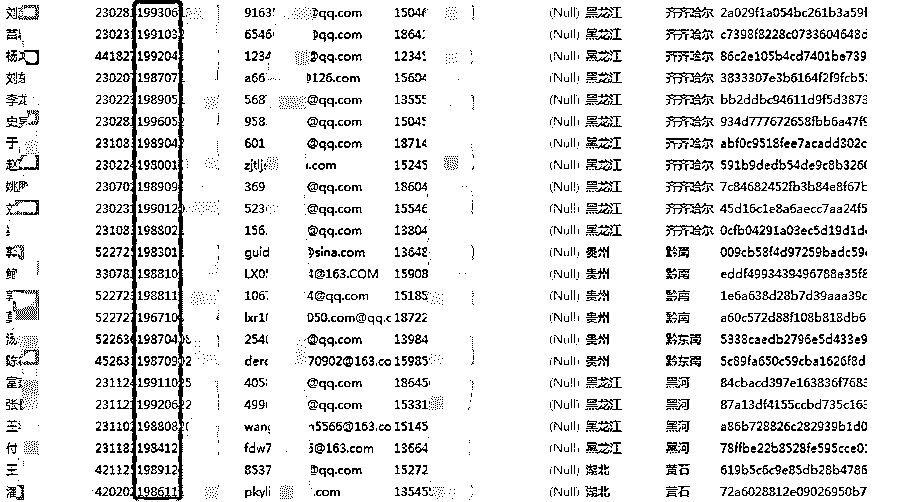

呜呼哀哉！

* * *

“ Debug Time ” 是差评一档新的特别策划栏目，处于磨合阶段，不定期更新

希望大家能喜欢~    

本文特别鸣谢公众号 “ 一本黑 ” 的老师傅提供计算机基础知识支持

