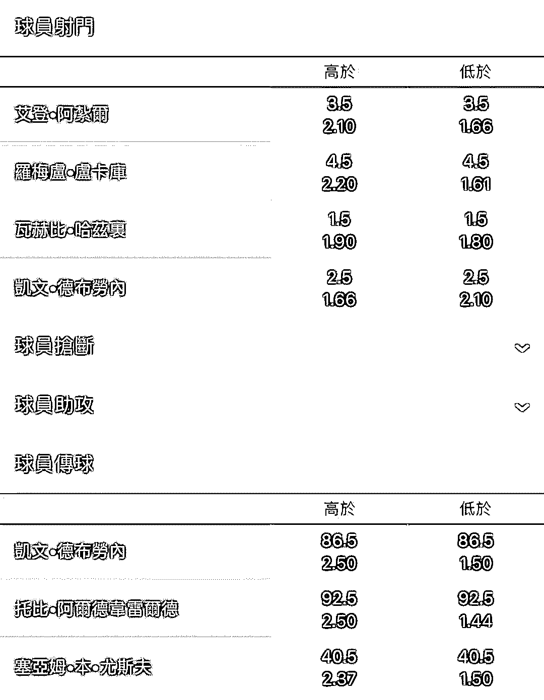

# 赌狗思维！世界杯真的是被博彩公司操纵的吗？

> 原文：[`mp.weixin.qq.com/s?__biz=MzU4ODAwNzUwMQ==&mid=2247484348&idx=1&sn=aebc5e8e25a505f14a5946c1a9adf181&chksm=fde2129eca959b88307dace3aa67649a441082935e3bbe0b2b8612d2ee6195c2a7a4d566d992&scene=27#wechat_redirect`](http://mp.weixin.qq.com/s?__biz=MzU4ODAwNzUwMQ==&mid=2247484348&idx=1&sn=aebc5e8e25a505f14a5946c1a9adf181&chksm=fde2129eca959b88307dace3aa67649a441082935e3bbe0b2b8612d2ee6195c2a7a4d566d992&scene=27#wechat_redirect)

最近几天，世界杯火热，网上朋友圈到处都是聊世界杯的，也有很多买足彩或者赌球的，当然也常常能看到许多让人啼笑皆非的弱智言论，最典型的一篇就是《高晓松揭露世界杯赌球内幕》。

文章里乱七八糟各种驴唇不对马嘴的谣言，加上不靠谱的推理，用着地摊文学的口吻，把世界杯说成是博彩公司操纵，收割全世界的骗局。

一篇充斥着阴谋论，离谱的不能再离谱的营销文，竟然让无数人信以为真，信誓旦旦的当成事实，实在是让人看不下去了。

下面，咱们摆事实，讲道理，一锤一锤戳破这些耸人听闻的智障谣言，锤爆赌狗的狗头。

**博彩公司是如何盈利的**

许多人都有这样的疑问，拿德国 vs 墨西哥举例子。不少球迷问我：“手哥手哥，德国对墨西哥，大家都知道德国强，都下注德国，那博彩公司不就破产了吗？所以德国肯定赢不了，就要配合博彩公司踢假球。”

这种推理看上去好像是有点道理，非常能够蛊惑人心，但是实际上错在哪了呢？错在他根本不了解博弈游戏的规则。

一个硬币抛起来，要么是正面，要么是背面，长期抛下去，正面背面概率一定是 50％，所以博弈，本质上讲，是一个零和游戏，有人赚钱，就一定有人亏钱。赌球也是一样的道理。

德国队既然强，那么博彩公司就会把德国的赔率降的很低，比如：

胜：1 赔 1.5

平：1 赔 4.4

负：1 赔 7 

如果没有接触过博彩的人，第一反应肯定是会猜德国赢。但是别忘了，赌球不是无成本的口头竞猜，赌球是有成本，有赔率的。

需要拿出真金白银去为你猜测的结果负责。这就非常影响人的判断了。

买 100 元德国赢，只能赚 50 元，但是发生意外了，就一毛都没有了。买 100 元平局中了可以变 440 元，买德国输，100 元就能变 700 元。这个诱惑远远高于直接买德国赢。

赌球关键就是在一个“赌”字，赌徒自然愿意以小搏大。所以，花大钱下德国的人多，花小钱下墨西哥赢球的人更多。

博彩公司会通过当前下注的情况不断调节赔率，引诱赌徒不断的向弱队下注。

博彩公司的盈利方式是抽水，总计收到了 100 万赌资，只返还 95 万，返还率是 95%，他只需要开这个赌局就能净赚 5 万，是完全的旱涝保收，所以博彩公司根本就不在意一场比赛的结果，无论是德国赢，平，还是败。博彩公司都赚钱的！重要的事情再说一遍：**无论什么结果，博彩公司都赚钱！**

如果你还不明白，我们再举一个最极端也最简单的例子，奥运会博彩公司也开盘，中国乒乓球团体赛会不会夺冠？团体赛不同于个人赛，爆冷概率约等于 0，傻子都知道冠军一定是中国队，为什么博彩公司没被押注押破产呢？

因为中国兵乓球队夺冠的赔率非常之低，只有 1 赔 1.01，也就是你下 100 元才赢 1 元。

下 100 元，你嫌麻烦，下 100 万，你又没有那个胆量，所以，下中国乒乓球夺冠，根本就不赚钱。

也没有那么多人无聊去下中国夺冠，更不存在“全世界都下中国队冠军，博彩公司就破产了”这回事。明白了吗？

网上谣传博彩公司只开足球，不开篮球，因为篮球不好控制。**谣言，大大的谣言**，事实上博彩公司什么运动都开。

连英国王室生男生女，叫什么名字都有盘口。

**什么是盘口？为什么比赛结果总是围着盘口？**

亚洲人（港澳为主）赌性更重，不愿意为了 1 赔 1.2 这种概率下赌注，喜欢拿赌球当百家乐玩，所以发明出了“让球制”，又叫亚洲盘口。

简单举例，巴西 vs 哥斯达黎加，巴西算超强队，哥斯达黎加稍弱，巴西获胜是大概率事件，押巴西获胜赔率极低，也就是 1 赔 1.2 上下，属于“鸡肋”，食之无味，弃之可惜。

那么就有了“让球制”，巴西赢球不算赢，必须赢 2 个才算赢，“巴西让 2 球”就叫盘口，巴西 1-0，2-0 哥斯达黎加，算赢球输盘，巴西 3-0 赢球赢盘。强队赢球的难度大了，相对应，赔率也高了，可以达到 1 赔 1。

最终巴西赢球赢盘概率 40%，赢球输盘概率 40%，输球输盘概率 20%。

这就是赌狗口中“两只球队为什么总是配合盘口踢”的原因，因为“赢球输盘”这本身就是一件超大概率的事件，总是会接近 30%-40%，“赢球输盘”是再正常不过的一件事情了，但是在赌狗的眼中，这就叫“踢假球”，“被操控了”。

根本原因就是他押错了，每场比赛都有赌狗赢，有赌狗输，赢了的觉得自己牛逼，输了的就抱怨这场是假球，所以在赌狗的眼中“**场场都是假球**”。

香港知名烂赌狗，因赌博多次破产，靠拍三级片烂片还债，一日赌狗，终身赌狗，典型的活了半辈子没活明白的主。也说明了在赌博这件事上，名人和普通人没有区别。 

这个盘口“让 2 球”是怎么来的呢？博彩公司里都有一堆精算师，在赛前就通过大数据把比赛分析的相当透彻，这些数据都是通过球队的表现分析出来的，是先有球队，后有的盘口，而不是先后盘口，球队再照着盘口踢。

盘口只是一个平均值而已，盘口让 2 球，踢 3-0 赢盘正常，踢 1-0 输盘也正常，都是在合理范围之内。

**盘口是球队实力的平均值和球迷预期结合的产物。**盘口也是在随着下注量随时变化的，球员已经上场，盘口可能都变了，球员本身都不知道盘口是多少。

说两只球队按照盘口踢是相当弱智的言论，就好比说，鸡一叫，天就亮了，所以是鸡把天给叫亮的。

实际比赛中，也可以印证这一点，无数的最后时刻，都有球员射中门柱横梁，进球与否全在电光火石之间，根本就不可能是你想控制比分就能控制的。

大数据精算不仅仅有比分的盘口，连球员一场比赛射门几次，传球几次，都可以预测出来。比如比利时的德布劳内，一场比赛下来，传球数就在 86.5 左右，也非常精准。难道球员在场上传球还要照着盘口，查着数传？可能吗？

**博彩公司赞助了全欧洲的球队，是欧洲各大俱乐部幕后的金主，哄抬球员身价。所以球员必须配合博彩公司踢假球，这是潜规则****。**（谣言）

这个就是完完全全忽悠不看球的普通网友的，假到不能再假。首先，说几个欧洲最知名的足球俱乐部。

西甲的皇家马德里和巴塞罗那，这两家俱乐部是典型“会员制俱乐部”。不同于股份制俱乐部，俱乐部就是一个正规的“有限责任公司”，运营俱乐部需要盈利，为股东负责，所以能省则省，能抠则抠。

会员制俱乐部性质是“球队花钱，会员埋单”，没有盈利需求，所以皇马可以任性的在全世界买买买，背后有会员兜底，会员们开心就好，皇家马德里是西班牙的一个招牌，为西班牙带来的利益和好处也不需要用钱来衡量。

政府和银行近乎无限的为皇马兜底，根本就不存在经济压力，皇马胸前的确挂过博彩公司 bwin 的广告，但是队服胸前广告，这本来就是你给钱就可以买的，博彩在欧洲又是合法生意，何来“幕后金主”一说？

说白了，皇马就是“西班牙的国企”，这种俱乐部需要靠博彩公司养活？用脑子想想，简直是扯犊子。

英超是全欧洲发展最好，盈利能力最强的联赛，赚钱方式是向世界各国卖电视转播权，也是全世界价值最高的体育联赛。

英超确实有不少博彩公司赞助商，但仅仅是赞助胸前广告而已，而且也都是赞助中小俱乐部，英超传统豪门的老板都是不差钱儿的主儿。

随便举几个例子：

切尔西俱乐部：老板阿布拉莫维奇。俄罗斯真正的社会人儿，俄罗斯的首富，世界富豪排名第十五，主业是经营石油和金属，买俱乐部就是为了圆自己的少年时期的一个足球梦。

你说这种身价的老板会给博彩公司打工？操控自己球员打假球？你信吗？

曼城的股东是阿拉伯投资公司阿布扎比集团，老板是阿联酋的王子曼苏尔，他是开国酋长的直系后代，这种基本无欲无求想买什么买什么的老板，要勾结博彩公司赚赌狗的钱？这种事儿被曝光了，他回中东，丢得起这个人吗？ 

至于最著名的曼联，都懒得解释了，曼联是一家在美国 NYSE 上市的上市公司，财务都是公开的，赚多赚少，也揣不到个人腰包，你去给这种俱乐部送黑钱？你送给谁？你连门都找不到。

还有新晋豪门人傻钱多花 2.2 亿欧元买内马尔的巴黎圣日耳曼，大股东是卡尔塔主权基金，大老板叫哈马德·阿勒萨尼，职业：卡塔尔国王。

内马尔给卡塔尔国王打工，然后还受博彩公司威胁？联合起来骗千里之外中国赌狗的钱？这个剧情，只有中国赌狗能够想象出来。

意甲倒是出过假球丑闻，可以自行百度“电话门”，主要是以尤文图斯为主的总经理挑选裁判，试图通过裁判干扰比赛。

被曝光后结果怎样？意大利足协从上到下，几乎全被撸了，尤文图斯直接降级，总经理被判刑 5 年。

整个意大利足坛相当于来了一次“地震”，仅仅是贿赂裁判，就已经是这个后果了，那么想要大规模长期控制球员，然后还不露馅？难度要多大？最重要的是意甲丑闻前前后后和博彩公司也没有半毛线关系。

所以说什么博彩公司是俱乐部背后金主，是彻头彻尾的谣言。还有文章绘声绘色的讲，博彩公司自己开设广告公司，高价买俱乐部的胸前广告，再低价卖给客户，说的跟真的似的。你问他这广告公司叫啥名？公司在哪？怎么联系？没一个人知道，因为根本都是编的。

**用反证法证明球员操纵论的不可行。**

我们假设按照赌狗的理论，球员是可以被操控的，那么一场比赛至少 22 人，博彩公司需要操控多少球员？操控 1 个 2 个肯定是不稳的，赌狗说了，像巴西这种球队是有绝对实力的，想进几个进几个，那买 2-3 个后卫也没用啊？

万一前锋咣咣进球呢？球员本身是不会碰钱的，那是不是还要通过经纪人去贿赂这些球员？大牌球员不好买通，那就买小牌球员，但小牌球员又不一定能上场？你还得买通教练，安排他必须上场。

这个“买通”是一次性的？还是一场一买？是包月制的？还是包年制的？是现金支付，还是开发票的？是先付款？还是后付款？是无论成不成都付款？还是把事儿办成了才付款？欧洲那么多博彩公司？每个公司开的盘口还不一定一样，到底是哪家博彩公司安排这事？中国足彩参与了吗？还是坐了顺风车？

仔细想一想，这里面有无数的细节，每一个环节出了问题，都可能改变比赛走势。这经得起推敲吗？

有一个非常朴素的规律：**一件坏事，参与的人越多，就越容易露馅**。世界杯强队的球员，基本都背着上千万的合同，还有 N 多正规的赞助商，耐克阿迪，宝马奔驰，蒙牛牛奶，长城汽车……球员正规赞助不够花吗？

要拿博彩公司“骗”来的钱？操纵一场比赛的成本是多少？工作量是多大？流程是什么样的？要经过多少人的手？没人能说得清，但是赌狗选择性眼瞎了，在他们眼里，“操纵”就是两个字，用键盘输入“caozong”就自动完成了。然后球员就自动把比赛踢成 2:0 或者 3:0，好像有剧本一样。你说说，赌狗的思维，得线性到什么程度？

**为什么假球论流传这么广泛呢。**

几张种情况：

一、信息不对等。伪球迷对球队的认识基本都是印象流，平时不看联赛，只是偶而看大赛。知道的球星基本就三个：C 罗、梅西、内马尔。对于强队的印象一直停留在巴西，阿根廷，德国等传统强队。

比如今年阿根廷 vs 克罗地亚这场，不少伪球迷都认为阿根廷实力碾压克罗地亚，但是经常看球的真球迷都知道，阿根廷是南美预选赛最后一轮才勉强晋级的，差点被淘汰，问题一大堆，而克罗地亚的中轴线拉基蒂奇，莫德里奇，曼祖基奇分别是巴萨，皇马，尤文的中流砥柱，克罗地亚根本就不是弱队，赢阿根廷都不算冷门。

梅西是一代球王，梅西所在的阿根廷怎么可能输呢？所以阿根廷踢假球。 

二、赌狗人性沦丧。仔细观察，赌球的人都有一个特征，就是为自己的失败找借口，如果赢球了就是：“我牛逼，我懂球，我看透庄家了”，如果输球了，从来不赖自己，就喜欢抱怨，“不是我蒙错了，是庄家操纵比赛坑我”，一场比赛，无论怎么押，都有人赢钱，有人输钱，但是赌狗接受不了这个事实，做不到愿赌服输，也不愿意承认输球的原因是“赌”。

久赌必输这么简单的一个道理，赌狗是不愿意承认的，反而用“假球论”安慰自己，骗家人，骗朋友，最后把自己也给骗了。

三、阴谋论有市场。低学历，低智商，低收入的三低人士，更喜欢相信阴谋论，知识素养低，逻辑能力差，小时候读《世界十大未解之迷》，成年了喜欢看《货币战争》，把野史当正史，把小说当事实，配合上传统“宁可信其有，不可信其无”的心态，再加上阴谋论非常猎奇，有趣味性，是酒桌上吹牛逼的好素材。

所以阴谋论无论在哪都非常流行。“人类登月是骗局”，“美国人操纵 911”，“共济会控制全世界”……这些阴谋论和“博彩公司控制世界杯”完全一模一样的调调，如出一辙。特征就是文章信誓旦旦，言之凿凿，证据一样没有，信息来源模糊不清。营销号为了转播量，阅读量，不顾事实，胡乱加工杜撰。

**那到底有没有假球？**

答案是：肯定有。但是假球一般在哪呢？欧洲的非主流子的乙级丙级联赛，一些你连听都没有听过的东南亚联赛，南美洲联赛。踢假球的原因是什么？一个字：穷。

这些联赛天高皇帝远，又没有什么像样的赞助商，信息不透明，一般俱乐部也许会配合本地的黑庄踢假球，可是这种事情和博彩公司一样一毛线关系也没有，一来这些联赛属于非主流子，除了本国人，其他人根本不看也不赌，本身就没什么大资金流入。

二来，利润实在太小，博彩公司干脆都不为这些联赛开设竞猜业务。即便是有竞猜业务，如果有一笔异常的资金突然流入，紧张的是博彩公司，甚至会主动报警。

**实际上，博彩公司才是最怕假球的。**早些年，英国威廉希尔公司为中国联赛开设盘口，后来发现实在是太难预测了，经常会踢出离谱的比赛，预测准确率远远低于欧洲主流联赛，中超把年薪百万英镑的精算师都给搞哭了，人家干脆甩手不玩了。

**腐败和黑幕也是有的**，02 年的韩日世界杯，韩国人贿赂裁判，已经被国际足联收拾了。这更从侧面印证了即便是假球，手段也只是贿赂裁判，影响比赛走势，和“球队按着盘口踢”相去甚远。

前国际足联主席布拉特腐败，被美国 FBI 查了个底儿朝天，差点蹲监狱。腐败都不能容忍，假球就成了潜规则？合乎逻辑吗？

像世界杯这种四年一次的杯赛，各国元首都在台上坐着看球，很多球员一辈子可能只能参加一次，想要大规模通过贿赂球员造假，概率几乎为 0。

我知道肯定有很多人不服，还拿着高晓松 balabala，翻过来覆过去一句话：“高晓松不比你懂？高晓松都说了，世界杯就是假球。”

高晓松有知识这没问题，足球他肯定也是懂的，但你知道啥叫揣着明白装糊涂吗？你们拿高晓松当老师，高晓松拿你们当个收视率数字而已，你们不过是高晓松眼里的阅读量。

高晓松老师是娱乐明星，不是知识分子。他的节目本身就是贩卖这些地摊文学，又不是科普节目。

他越添油加醋，胡说八道，看的人就越多，就这么个道理，跟过去说书的差不多。

高晓松自己都说了，他说的东西只是自己意淫的，这些话在酒桌上吹牛逼说一说差不多得了，言之凿凿当成真理的人得傻到什么程度？

在赌狗的眼中，飞行千里去看世界杯的热情球迷都是傻子，只有赌狗自己窝在沙发里，一边分析盘口一边和“狗庄”斗智斗勇才是“聪明”人。赌狗的思维和行为，既可笑又可怜。

有一个著名的**赌狗悖论**（我提出来的）：既然赌狗知道比赛是假球，为什么赌狗还乐此不疲的给庄家送钱呢？赌狗是在做慈善吗？结论就是：赌狗永远无法自圆其说，也无法认清自己，赌狗的话，没有一丝可信度。

说那些身价千万的球员在世界杯上被博彩公司控制着踢假球，既是对足球这项运动的侮辱，也是对无数球迷的侮辱，更是对自己智商的侮辱。

最后，我估摸着肯定有傻 B 说：“你是不是收博彩公司钱，来给他们洗白的？”你永远也叫不醒一只装睡的赌狗。记住：久赌必输，赌博就约等于输。一位长者说过：“天上不会掉馅饼，努力奋斗才能梦想成真。”

祝大家能够远离赌狗，愉快看球。

还原事实｜专扒黑产

微信 ID：darkinsider

知乎 一本黑

头条 一本黑

投稿、爆料、招聘、转载

请点击菜单**【联系我们】**