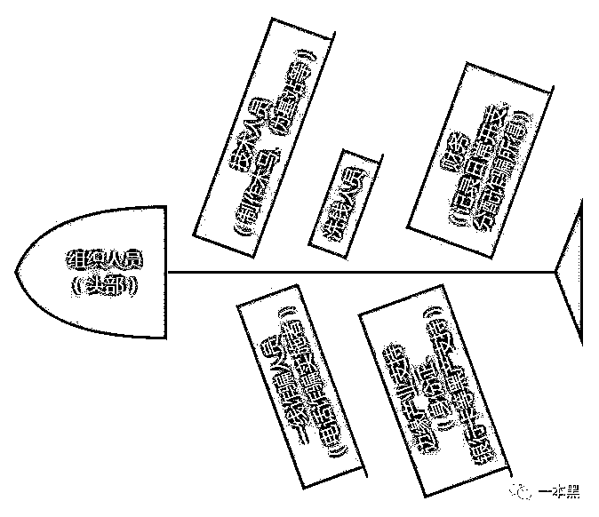
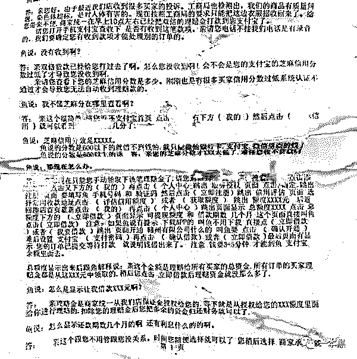
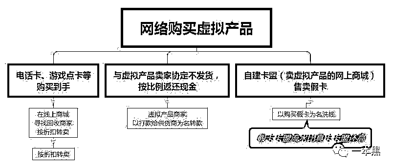
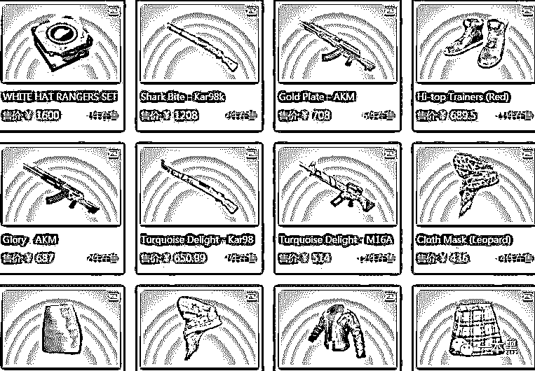
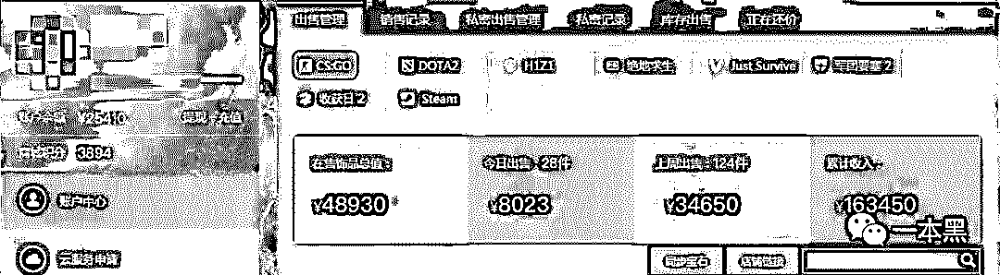
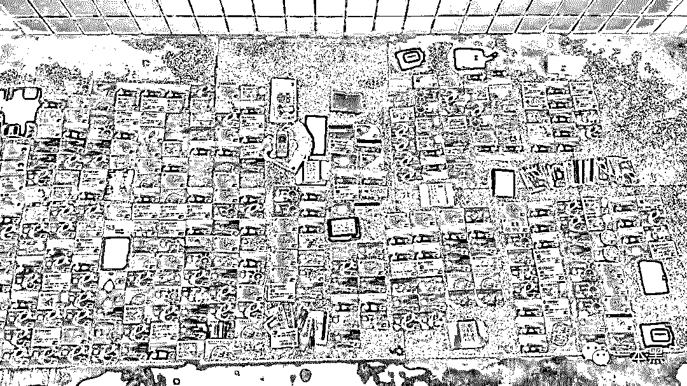

# 仅凭几根网线，山里娃月入过百万，还靠电竞签约选手洗钱

> 原文：[`mp.weixin.qq.com/s?__biz=MzU4ODAwNzUwMQ==&mid=2247484281&idx=1&sn=580a526ef31b87cc1f540d43ee2a5fdb&chksm=fde2125bca959b4d25b81e9276f1ac707b9e639ad207c20fe6bff21e1088de52118fb2b3d7bb&scene=27#wechat_redirect`](http://mp.weixin.qq.com/s?__biz=MzU4ODAwNzUwMQ==&mid=2247484281&idx=1&sn=580a526ef31b87cc1f540d43ee2a5fdb&chksm=fde2125bca959b4d25b81e9276f1ac707b9e639ad207c20fe6bff21e1088de52118fb2b3d7bb&scene=27#wechat_redirect)

由于环境的闭塞和落后，多年受困于贫穷，心有不甘的小河麻木地垂着头，然而等待他的将是长达 5 年的牢狱之苦。在这之前，他的工作是一名工厂的流水线工人。

辞掉工厂的工作，小何回到福建某城找到了堂哥，一番了解后才知道原来几根网线和电话就可以轻松赚到钱。

虽然偶尔觉得这是在违法骗人，但在高收益面前，一切的愧疚和不安都能化为乌有。

堂哥的诈骗团队分散在全国不同的地区，但分工却非常明确。小何在里面负责话术的部分，目的就是引导“鱼”（受骗者）上钩，让他们心甘情愿的将自己的积蓄打进指定账户。

“鱼们”好像很可怜，但这并不关小何的事，在他的心里，人不为己，天诛地灭。

**黑产世界的雇佣兵，一线诈骗话务员**

在几个月的时间里，小河逐渐熟悉整个诈骗流程，看似不起眼的团队，其实每个人各司其职，互相配合，即便远隔千里，只要是他们想拿到的信息，都大有“千军万马来相助”之势。



在浙江某城，有同伴主要负责给他们提供“鱼”（指受骗人员）的相关信息，这些信息是他们通过自制的木马从各大电商商家电脑里盗取的，再者就是安插在例如医院、运营商、快递公司的内鬼提供。

收集来的个人信息传送到堂哥手里，再由小何这样的“话务员们”一个一个拨打电话进行点对点的欺骗。

在拨打电话之前，他们都经过了话术培训，培训内容包含语气、聊天内容、各种借贷平台的借贷方式。

除了利用淘宝购物退款来进行诈骗外，小何和他的“同事们”偶尔还会唱双簧。

“同事 A”给“鱼”拨打第一个电话，告知“鱼”卷进了洗钱大案；之后再由小何接手，拨打第二个电话，小何这次扮演的角色是“侦查员”，以恐吓等方式让“鱼”慌乱；最后由“同事 B” 收网，扮演“检察官”，引导“鱼”将账户余额转进指定的赃款账户。

一些心思缜密的诈骗团伙甚至会雇佣当地人以方言进行诈骗，加强诈骗电话可信度。

他们假装是目标家人的朋友或警方，通知目标其家庭成员遭遇车祸或卷进犯罪事件，需要立刻打款解决。

由于诈骗这条路来钱快，越来越多的村里人也就顺势参与了进来，诈骗村由此得名。

对于外人来说，他们是普通老百姓，但对于政府来说他们却是犯了法的老百姓。

于村民而言，只有诈骗这条道路才能让他们摆脱贫穷，你要去铲除这股恶势力就必定会引起群众事件，那是他们的饭碗和谋生路，尽管这条道路掺杂着对人性的审判，但在金钱和利益面前，全然不是他们会思考的。

除此之外，某些诈骗团伙还会把当前的一些诈骗套路复制到国外，也就形成了所谓的诈骗国际化。

在一些欠发达的国家和地区，这些套路同样适用。他们会招一些本地人作为自己的话务员，这样更容易让“鱼”上钩。

于他们而言，国外的“鱼群”是另一片值得开拓的地方。

**还能用签约游戏选手的方式洗钱？**

在这之后，他们会想法设法的对诈骗所得脏款进行洗白，即把非法所得合法化的行为，俗称洗钱。

洗钱的方式多种多样，对于小何所在的团队来说，他们有一种方式是通过**电竞**进行洗钱。

首先，诈骗所得的赃款汇入他们的账号后，他们会先把这个账号内的钱转入账号 B，然后再把账号 B 内的钱分多笔转入账号 C 和账号 D。

接着再把 C 和 D 的钱全部购买网络游戏点券，并把这些点券充入尽可能多的游戏账号，经过卖账号的形式，把点券转换成现金，这些现金会汇入另一个账号 E。



再然后把账号 E 内的钱转入更多的账号中，经过这一轮下来，这些钱就已经被“洗干净”了，取款人就可以明目张胆地进行取款了。

除此之外，他们还会**通过在某些电竞平台进行买卖道具的方式洗钱。**



先是通过充值把赃款转入平台的账号内，购买游戏中的道具。然后把购买到的道具低价卖给准备充值的玩家，以此实现洗钱的目的。

为了增加道具的追踪难度，他们会有专人负责盗取正常玩家的账号，并且会注册大量的新账号，用于自己“倒手”交易，一个账号在这边正常购买并出售，另一个账号则马上买入。

由于他们手中拥有大量的账号，往往一个道具会经历几十次的“倒手”交易，这样一来也就达到了洗钱的目的。

根据小何提供的线索，老师傅顺藤摸瓜的找到其中一个用于“洗钱”的电竞平台账号，由于该账号存在“弱密码”，老师傅轻松拿到开启这扇“洗钱”工厂大门的“钥匙”。

在账号显示的账户余额和累积收入中，可以看出该账号为他们的洗钱立下的“汗马功劳”。



当然，这只是他们众多洗钱账号中的一个。

另外，据小何所说，除了这种买卖道具的形式，他们还有一种更为高大上的洗钱方式，那就是“买人”。

他们会有专门的人负责签当下一些比较有名气的选手，然后让他们去直播打游戏，成绩好坏无所谓，但有一点就是他们一定会签那些比较贵的选手。等签约到期以后直接转给其他的俱乐部。

这种用来路不正的钱签约选手，然后让选手去直播平台赚钱套现，一圈下来，黑钱自然就会变为合法收入了。

其实，不管是买卖道具还是签约选手，这些洗钱的方式无疑是在破坏游戏生态。

买买道具破坏的是电竞平台以及游戏公司的正常收入，签约则是把选手当做一颗棋子来用。

于诈骗团队而言，只要把钱尽可能的洗干净，没什么是不能干的。

小何这样看起来底层的“话务”，每月分成也可以轻松达到数十甚至数百万，更不用提堂哥这样的组织者。

如今，令小何感到后悔的不仅仅是长达 5 年的高墙之苦，更让他觉得后悔的是，自己走上了一条遥遥无期的不归路。

**高明的反追踪手段，电诈其实不低端**

对于警方来说，难以破案的电信诈骗难点在于他们对证据的销毁。

“堂哥们”购买的大量电话卡和诺基亚功能机是整个诈骗环节的又一帮凶。

电话卡来自运营商内鬼或者通过黑市购买的身份证办理，同号段的号码不会购买太多，以免被运营商发现后集体销号。

使用功能机是为了防止被定位追踪，且价格便宜。每张电话卡诈骗成功一个人后就会被丢弃销毁，一并丢弃的还有拨打电话的功能机。

（黑市的身份证来自卡商大批量去偏远地区收购，或社会闲散人员转卖，以及少部分遗失、盗窃所得。）



线下交易得来的 U 盘在里面的数据被使用完毕后便立刻丢弃销毁，避免留下证据。

一般情况下，电诈团伙只会与亲近的朋友或亲属一起“工作”，外人难以接近，这也是一些地区出现“电诈村”的原因。

这些诈骗村甚至会开发属于自己的独特诈骗手法，比如曾经一度流行的“猜猜我是谁”诈骗，就是由福建某村“引进”电诈手段和“话术脚本”后自己“钻研”而来。

还有冒充黑社会进行诈骗的，这些人同样以亲缘、地缘为纽带拉帮结伙，然后四处拨打电话进行诈骗。

这些诈骗团队在诈骗的时候动不动就说要对受害人挑经断骨、卸条胳膊断条腿，甚至以伤害亲人进行威胁恐吓，这种方式往往能吓住受害者，他们也不得已花钱消灾。

诈骗的套路多种多样，曾经的双峰县，本来是一个湘中小县，却因为一幅幅反 PS 淫秽照片诈骗的标语而在网上走红，曾经有媒体报道，在这个只有七万人的县城，就有两万人在诈骗。

这类骗子一般会先在网上收集各级政府官员的照片、身份、地址等信息，然后选一些酒店偷拍的素材进行简单的 PS，合成政府官员的裸体床照后，以大撒网的方式向全国各地官员寄出，1000 封信只需要 1200 元的邮费，只要有一人成功，就是上万的收益。

说白了就是碰运气，只要碰到一个，这点成本根本微不足道。

多数电诈团伙躲在小山村或深山里，使用 VoIP（关于 Voip 大家可自行查询，这里不做解释） 拨打电话，这样除了可以修改来电显示外，还可以有效防止被定位追踪。

这一整套流程对小何来说已经非常熟悉，但即便是这样，小何最终还是走入了高墙。

由于环境的闭塞和落后，多年受困于贫穷，心有不甘的小河麻木地垂着头，然而等待他的将是长达 5 年的牢狱之苦。

在这之前，他的工作是一名工厂的流水线工人。

还原事实｜专扒黑产

微信 ID：darkinsider

知乎 一本黑

头条 一本黑

投稿、爆料、招聘、转载、

请点击菜单**【联系我们】**

我们的隐私安全课程《裸奔于互联网的我们，有哪些保护隐私的办法？》将在 6 月 4 号正式开播，[准备了两个月，该拿出来了](http://mp.weixin.qq.com/s?__biz=MzU4ODAwNzUwMQ==&mid=2247484271&idx=1&sn=0118aaaf87a741869762e1e12d8fec6c&chksm=fde2124dca959b5bcf3a2ac6d5e426f9b750156af8b47db8bc3e3674bba35a9d5f511c180746&scene=21#wechat_redirect)。对网络隐私安全感兴趣的朋友不要错过。