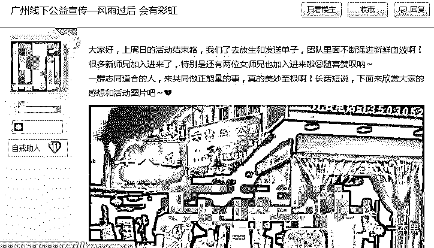

# 戒赌戒色？偏离原意的贴吧文化正逐渐扭曲

> 原文：[`mp.weixin.qq.com/s?__biz=MzU4ODAwNzUwMQ==&mid=2247484222&idx=1&sn=d760af72c05fcfa8308f516080a99c71&chksm=fde2121cca959b0a696e6aeece00f338fbb0cb62d4f90c0a2ae8e97e7f2bbae8e18e9fc2750b&scene=27#wechat_redirect`](http://mp.weixin.qq.com/s?__biz=MzU4ODAwNzUwMQ==&mid=2247484222&idx=1&sn=d760af72c05fcfa8308f516080a99c71&chksm=fde2121cca959b0a696e6aeece00f338fbb0cb62d4f90c0a2ae8e97e7f2bbae8e18e9fc2750b&scene=27#wechat_redirect)

导读

如果说戒赌吧是在狂欢中沉沦，那戒色吧就是在沉沦中压抑。

当生活出现挫折，你会选择正视，还是如鸵鸟一般的逃离？

**作者|小白**

**责编|振宇**

第一次见到刚哥是在一条小巷里，四十来岁，带着眼镜，斯文，说话也有礼貌，手里拿着我的钱包，看起来一点儿也不刚。

彼时的我怎么也想不到，眼前这个文质彬彬捡到我钱包准备归还的中年人是一个深陷赌圈多年的赌徒。在几次接触得知刚哥的“爱好”后，我们提出了采访的想法，刚哥没有犹豫就答应了。

# 

****刚哥的自述****

“我就是被茶馆害了前半辈子，后来欠高利贷太多跑路了。跑路的过程中无意间上了贴吧，就被带着玩了 PK10 、时时彩这些。”

刚哥口中的茶馆其实就是赌馆，一般由三五个人合伙，租下一个套间摆上几张桌子就开业了，靠着人带人旺场，拉人头的能按人头分得一些费用。茶馆老板每桌抽成，顺带放放高利贷。



赌博之前刚哥是铁道部的一名正式职工，在那个年代的三线小城工资水平算中上，买了房子和车子，老婆淳朴儿子内向爱学习，生活无忧。如果一直这么过下去必定是个幸福的结局，却因为这一步之差产生了巨大的变化。

现在的刚哥最爱提的除了赌博就是戒赌吧，鉴于戒赌吧在网友口中的微妙评价，我特地问了刚哥去戒赌吧是否真的为了戒赌，而刚哥的回答耐人寻味。

“哪有什么戒赌，现在我众叛亲离，儿子不认父母不理的，去戒赌吧图的就是一个环境。里面的人让我觉得自己在世上不是孤立的。说实话，能去戒赌吧的也都不图真的戒赌，至少我待到现在，除了吹牛逼的很少见到真赌徒回头。

而且那个地方鱼龙混杂，什么人都有。以为自己能戒赌的赌徒、放口子的、教人撸口子的、骗人跟单的、找人签单的、还有看热闹的，唯一没有的就是真的下定决心要戒赌的。”

“以为自己能戒赌？怎么说？”看着刚哥满不在乎的开口，我忍不住细问了问，想知道在真赌徒刚哥的口中，戒赌吧到底是个什么样的存在。接下来的聊天里，刚哥让我了解了一个不同于网络传言的戒赌吧。

“真正赌过的人才知道，戒不掉，这是心瘾。**赢了想要更多，输了又想翻本，心态是这样，最终的结果就是输，每个赌徒都知道这个道理，但是挡不住侥幸的心。**再者说一夜间几万几十万的出入，经历过这样的刺激，都做不了辛苦一个月才几千块的事，心飘了，就沉不下来。

你去看看戒赌吧，里面有多少跟家里坦白过，家里帮忙填平之后又输几个几十个的。这个东西就跟吸毒一样，是心瘾，戒不掉的。有毅力戒掉的人当初根本就不会沉迷，真正想戒的也不会来吧里，必须要脱离这个环境。”

说话的刚哥显得无比清醒，行为却又无比堕落，就在前一天他才刚撸了一笔小贷，充进某个线上赌场。





“去吧里说要戒赌其实就是求个心理安慰，最终目的也还就是找一群跟自己一样的人，感觉热闹些，增加些底气。你再看吧里，经常有一些带上岸的帖子，100%是骗子。

他们可能直接告诉你带上岸，可能发个帖子说自己以前欠了几十个，后来多亏遇到师傅带上岸，总之就是留微信。

一定会有人抱着侥幸加好友，之后就被套路去跟单买足球，说白了也就是网赌。**他们发单告诉你怎么下，其实根本不会管你输赢，你下了他们的佣金就拿到了。**”



“除了这个，还有放口子（借贷平台）的。现在比较少了，因为戒赌吧的老哥是不会还钱的，机灵一点的业务员放给你钱之后会教你怎么去撸其它家的贷款，用别人的钱填自己的坑，反正他们自己不赔赚了就行。”

在刚哥的眼里，这些行为都不算什么。**赌徒身上是留不住钱的，与其流进别人家，不如薅来自己口袋，每一双盯住赌徒的眼睛心里的想法都是这样，也没什么罪恶感。**

**而一身邋遢血的赌徒们也不介意被薅，他们已经在自我放弃的边缘，一边骂着“狗庄不是人”，一边奋力刮油给庄家。**

“其实最狠的是那些签单的经纪。你知道签单不？缅甸老挝那些地方，靠近边境的赌场都有这样的经纪人。他们找人发帖，告诉你不需要抵押可以放款给你免费玩，包路费，只需要赢的时候给抽成、最后还清本金利息就好。

实际上哪有那么好的事，你的路费就在放给你的款里扣，在赌场输了就扣人，让往家里打电话要钱，要不到就挨打。实在不行就拉朋友来签单，拉一个给你多少抽成平前面的单。

要是连这个都做不到，说句不好听的，弄死你都不是没可能，之前经常有边境赌场死人的新闻。

不要觉得这样签单拉不到人，红了眼的赌狗什么都会信，这对他们来说是最后一丝侥幸的救命稻草，明知道有问题也会去试一试的。”

和刚哥聊天的全过程，他都显得清醒冷静。**一边清醒，一边沉睡，这大概是赌徒们共有的特质**，大概是戒赌吧吧友们的共同特质。

在网上，戒赌吧给人的第一印象是荒诞搞笑。里面的吧友互称老哥老姐，为了不让数字听上去太惊悚，通常用“个”来代表“万”，发帖说欠了几个意思就是欠了几万，这是他们欠债的入门单位。



如果输了钱，就怒起发帖骂狗庄（戒赌吧对庄家的称呼）。借到朋友的钱或者撸到现金贷就戏称“领工资”，因为在戒赌吧，大家的共识是“凭本事借的钱，为什么要还”。

然后再用借到的钱去博一把争取“上岸”（清债），只是结果往往事与愿违，搏一把的结果大多是继续被洗白（输钱）然后再上贴吧骂狗庄的循环。

直播也是戒赌吧的一大特色。老哥们最爱的事情是洗白后去戒赌吧官方指定饭店沙县大饭店吃一顿，在吧里直播跑路，甚至一度有跑路教程出现。



早些时候还有老哥直播“修车”（约或嫖），留下过“当初修车不直播，如今出事找老哥”的戏语。除了这些，就是直播“瘫痪”了。

瘫痪也是戒赌吧的一大特色，被洗白之后的老哥老姐们口袋空空，只能待在家或者某个不知名的网吧，什么也不做，没钱赌也不愿意找工资低的工作，于是只能打打游戏或者上贴吧看看。跟跑路一样，在不同地方怎么瘫痪也有教程。



就是这样一个看似没有希望的贴吧，意外地保持着大多数社区都难以达到的和谐氛围，不像 1024 的“好人一生平安”那么虚无，他们是实打实的“互助”。

贴吧里经常出现“瘫痪在家，求给个饭钱接济”的帖子，这样的帖子一般都有回应，总有老哥给楼主打十几二十块的饭钱。在他们看来，今天帮助落难的兄弟，他日自己需要的时候也会收到相应的回报，多少有些同病相怜的意味。

哪怕生活再艰难，回到吧里的老哥也都是善于自嘲随性乐观的样子，这大概是吧友们对戒赌吧留恋的原因。也正是这样的反差，给了其它网友寻找欢乐的空间，有事没事都爱跑来戒赌吧找找有没有新乐子。

网络总能带给人无尽的欢愉，任何事件都能变成网友的狂欢，这也许是一件好事，却也无限悲凉。现今互联网是一个娱乐至上的领地，是连原本悲哀的东西也能变成盛宴的地方。

**一次次的狂欢换回来的是越发扩散的麻木，所有的事情都披上了一层娱乐的皮，将原本腐烂溃败的都深深包裹起来，虽看不见却遮挡不住愈加蔓延的腐败气味。**

# 

****戒色吧，邪教式成长的贴吧****

在戒赌吧给网友带来的狂欢的时候，另一个气氛似乎完全不一样的贴吧也在毫不落后地壮大——戒色。这个贴吧里，弥漫的是认真和沉重。

**如果说戒赌吧是在狂欢中沉沦，那戒色吧就是在沉沦中压抑。**

与戒赌吧不同的是戒色吧除了严肃认真的气氛外，还有着浓重的宗教意味。

大多数网友应该都对早期的佛教戒色网站有些印象，正是这种当初沦为网友笑柄的网站内容，成为了后来戒色吧主导思想的来源，早先的小圈子讨论突然有一天变成了传教式的宣传。

在戒色吧，众多吧友将自慰看作恶魔般的存在。脸色差、生病、爱情或学习工作不顺等一切的挫折都归咎于手淫；相反，当遇到好的事情，诸如工作顺利、结婚或生子（仿佛有哪里不对？）都归功于戒色。

贴吧里弥漫着紧张的气息，戒色打卡、戒色失败的忏悔、疾病与自慰的关系......诸如此类的帖子数不胜数，自慰在这里变成了一种无比罪恶的行为，稍微一“破戒”就认为自己罪大恶极，仿佛犯了不可饶恕的大错。



**偏执执行的过程中，他们都忘了正常的生理需求并非十恶不赦，而是被洗脑式地接受了“手淫是淫邪，必须完全杜绝”的理念。**

除此之外各种宗教理论、中医养生理论也随处可见，以及戒色前后对比的照片帖。回复者会以各种漏洞百出的论点告诉你为什么要戒色，不戒色会带来什么因果，戒色的作用在他们口中比健康饮食和科学锻炼强百倍。

每每有戒色前后的照片对比帖出现，下面清一色的回帖都告诉你“精神了”，可除了增加滤镜外小白并没有感受出差别。

说宗教意味浓重，除了贴吧里众多与宗教有关的话题外，还因为吧友们对某一任吧主的异常崇拜，这位吧主甚至出版了名为与“戒色”相关的书籍，一百多季的更新，难以相信是个人所为。



戒色吧的壮大也与这位吧主的组织有关，贴吧在他的带领下变成了有序的团体。街头发传单、厕所和电线杆上帖宣传小广告、去其它社交社区宣传等等，甚至会组织放生活动（忍不住吐槽，这个行为实在与戒色没有太大关系，十分宗教）。

而在知乎，我们找到了关于这位吧主的扒皮帖，真假自行搜索判断。



在电影《迷雾》中有一个神婆的角色，迷雾来临前所有人都知道这是一个迷信宗教到神经质的人，都明白她是错需要远离，甚至投以鄙夷的眼光。

而当迷雾到来，镇民陷入绝境，一切的巧合都让慌乱的镇民选择相信神婆的力量。神婆占据了领导地位，凭着自己的意志为所欲为，而真正帮助镇民、与镇民一起抵抗怪物的男主一行人逐渐被孤立甚至被驱逐。

戒色吧的吧友也与镇民一样，在现实生活中遭遇不顺和失败，因为现状难以改变，急需一个出口，给自己的挫败找一个“可接受”的缘由。

戒色吧的出现无疑是慌乱之下的曙光，他们选择相信这些失败都是手淫造成的，鸵鸟式地逃离事情的本质。

**只是越逃离，越不正视挫折的本质来源，越不能使用正确的方式改变，结果可能会更坏。**

**当生活出现问题的时候，我们都需要信仰支撑。宗教也好、偶像也罢、甚至戒色都行，但如果这个信仰使你沉迷，世界就会变成扭曲的样子。**

戒色吧俨然成为了一个行动严谨的组织，对戒色的优点深信不疑，不仅有宣发人员，还有前辈指导，但现在的戒色吧难免让人感觉矫枉过正。

同时令人担忧的还有他们的宣传对象，这些“戒色”宣传往往向校园倾斜，价值观还没完全成型的孩子突然被注入这些偏执的想法，带来的后果也难以言喻。

一切与情色相关的内容在他们眼里都变成了洪水猛兽，甚至连基本的正常的生理需求也算在内，而更严重的信徒往往因为不能彻底“戒断”开始产生自卑心理甚至自残。

# 

**写在最后**

我们没有办法判定这两个贴吧的成员在吧里到底是获益更多还是被伤害更多，也没有办法以自己的价值观去强行“扭正”他们的想法，因为在我们觉得他们偏激的同时，他们也在控诉我们的意识错误。

戒赌吧和戒色吧，两个看似完全不同形态的贴吧却有完全相同的地方——它们收容的多是面对生活束手无策的人。

这两个贴吧给了他们避世和拒绝面对现实的借口，也使得他们找到“同类”，给自己的逃避一个更合理的解释。在贴吧的狂欢中，他们似乎找到了生活的重心......

**这种类型的贴吧、社区越多，我们越能明白世界上脆弱而又慌乱的人群有多庞大。只愿人人坚定有信念，舍弃偏执不执拗。**

**人生路长，各自珍重。**

**还原事实｜专扒黑产**

**微信 ID：darkinsider**

**知乎 一本黑**

**头条 一本黑**

**投稿、爆料请点击菜单【爆料入口】**

**招聘、转载请点击菜单【联系我们】**