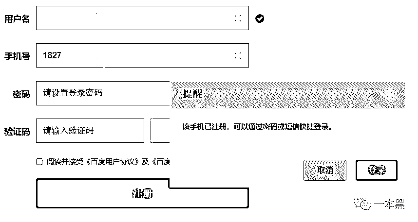
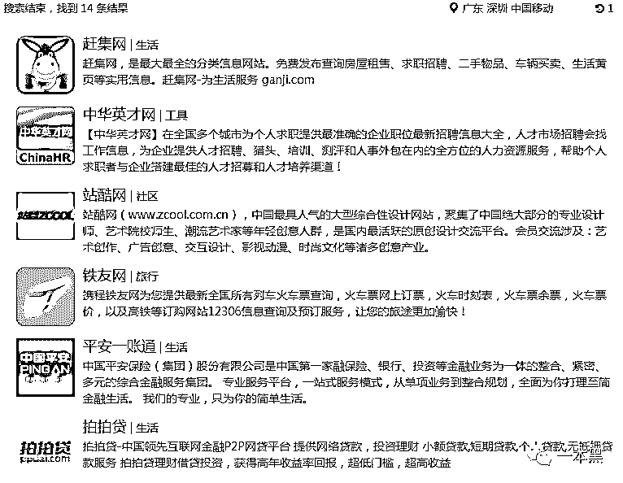
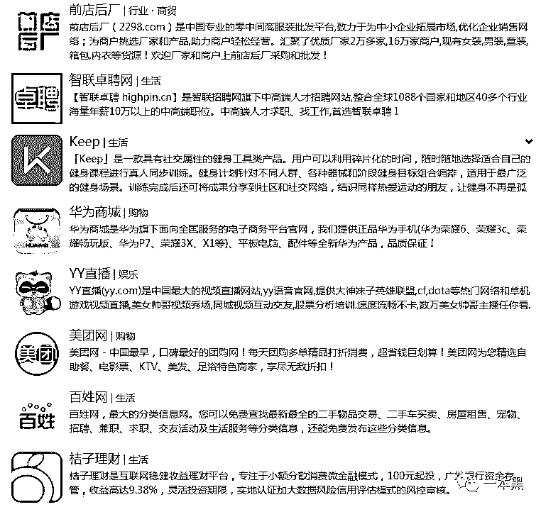
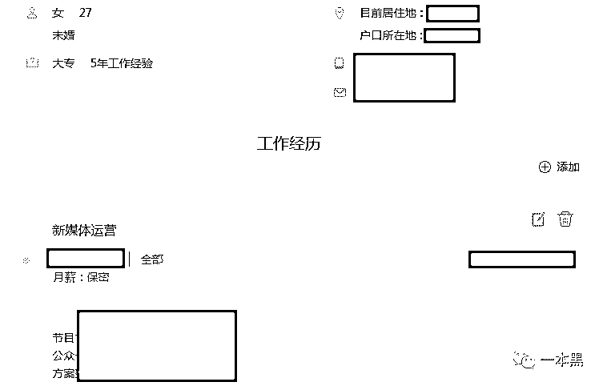
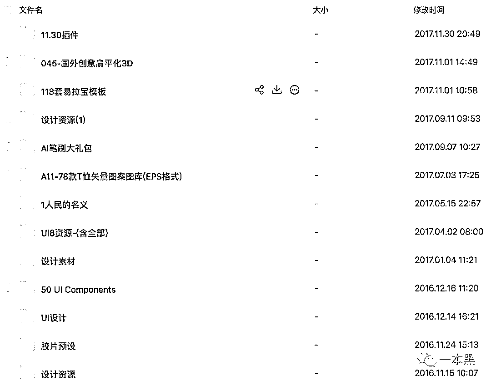
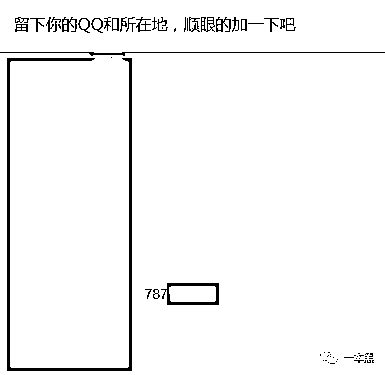
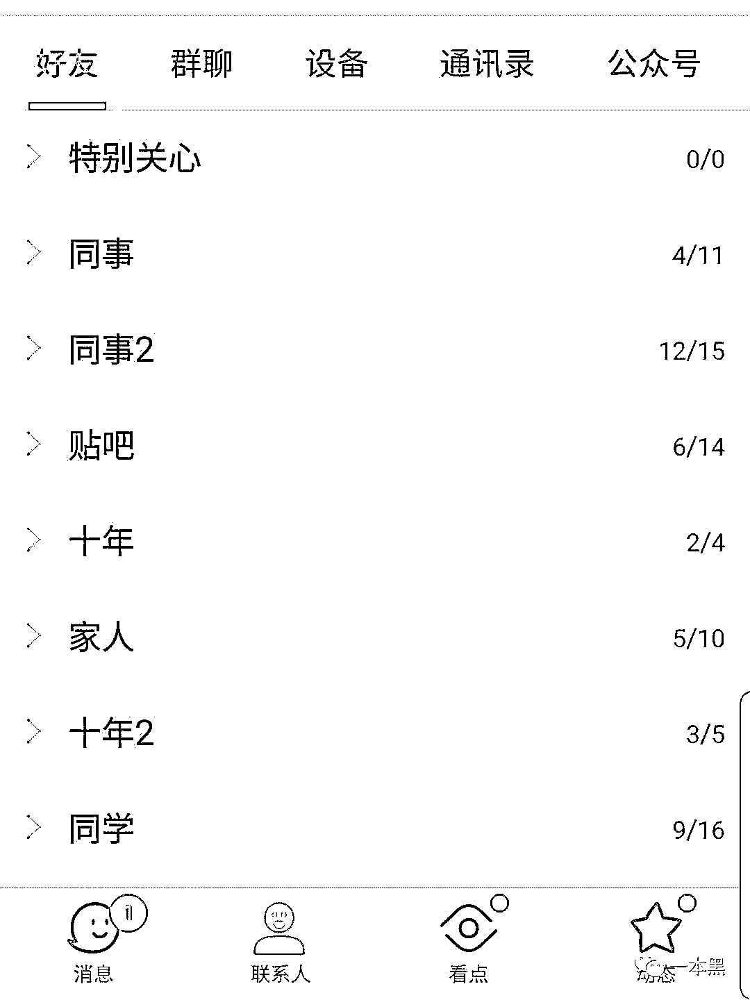
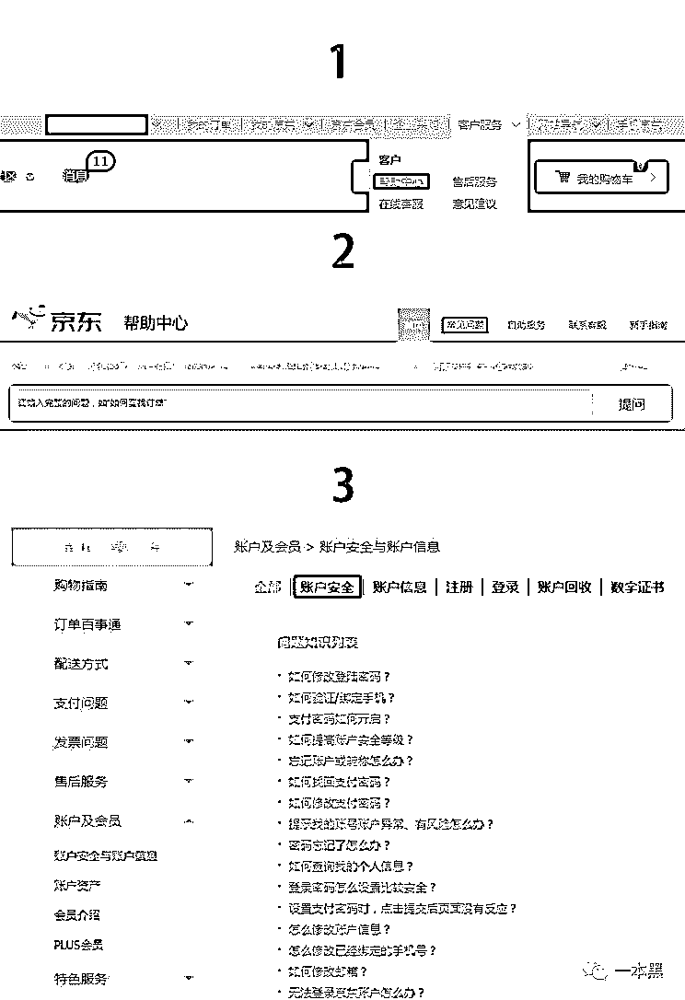

# 更换手机号？恭喜你加入信息裸奔豪华套餐

> 原文：[`mp.weixin.qq.com/s?__biz=MzU4ODAwNzUwMQ==&mid=2247484212&idx=1&sn=0fb02cd9d328bfaba8ce8c775c010bac&chksm=fde21216ca959b0095481350079d4224b3385b985d41136763eb83b2aec1984bd21f5cfb97ed&scene=27#wechat_redirect`](http://mp.weixin.qq.com/s?__biz=MzU4ODAwNzUwMQ==&mid=2247484212&idx=1&sn=0fb02cd9d328bfaba8ce8c775c010bac&chksm=fde21216ca959b0095481350079d4224b3385b985d41136763eb83b2aec1984bd21f5cfb97ed&scene=27#wechat_redirect)

导读

如果说换号有可能会让你裸奔，你还会毫无顾忌地换号吗？

**作者|小白**

**责编|振宇**

刚来深圳的时候，我为了方便换了一个本地号，注销旧卡前还算有意识地解绑了常用平台手机绑定，却偏偏忘记解绑云盘。大约三个月后，当我打开云盘准备提取文件（一些重要的工作文件、过往的工作记录以及一些惯用的软件安装包和学习材料）时才发现忘记登录密码而找回密码需要用绑定号码接收验证......

头大的我碰运气式的拨了早就注销的手机号，运气很好的是电话通了，对面是个女孩儿，没有戒备地答应帮我接验证码（虽然很感激，但是女孩这么做也是很有风险的）。

每次换号都会经历一连串的乌龙，比如那个女孩儿现在用的号码，是当初去学校报名时随录取通知一起寄给我的。

刚开始用的时候还经常会接到房产中介的电话，询问是否买房和卖房，或者上一任机主的朋友打来的电话，隔个三五天总要接个电话解释一遍。

**如果我说在这样的换号中，一不小心你就会处于裸奔状态，拿着你被运营商回收的旧号码的人，手里极有可能握着你的全部信息，那么你还会这么大意地更换号码吗？**

## 

**千防万防，换号难防**

身为一个社会人，除了小猪佩奇纹上身，换几次电话号码也必须是标配。

像小白这样进入大学换一个号码，和同学联系方便；之后出门工作再换一次号码，当地号码套餐比较优惠；前往其它城市生活再换一个当地号码；被人骚扰了或者想遗忘一段过去可能又会选择换一个号码......

生活在现代社会，换号的理由实在太多，而每次换号都能带来一些麻烦。轻则接到一些骚扰电话、处理一些前任机主遗留的问题，重则自己的网络账号绑定出问题、信息全部泄露。

**若是你更换的号码绑定了众多账号，而在注销号码时没有完全解绑，那么当号码回收，下一任机主就极有可能获得你的大部分信息，让你在他面前处于裸奔的状态。**

当我们拿到一个电话号码或者一个邮箱的时候，只需要每个网站试就能试出该号码有没有在当前网站注册。但是手动查询太慢又浪费时间，所以我们使用了一个小程序进行批量查询。

为了验证这一点，同时不侵犯他人的权益，我们使用了新同事的电话号码进行查询，在此之前我们不知道除姓名外新同事的任何信息。我们首先发现这个号码注册了下面这些网站。



简单看一遍，大概可以知道机主可能懂设计、有过网络零售经验、同时热衷于网络娱乐和向往旅行，并且极有可能有过借贷经历。

接着我们使用密码找回，利用手机动态码修改密码并登录了赶集和两个招聘网站，从而轻易获得了对方的详细工作经历及学校信息。以及，近期的租房情况和家政服务情况，并且以此推断出她当前的居住地址。

另外我们试探性地手动在百度尝试了密码找回，没有意外地获得了她的百度账号。在百度上我们看到了大量的个人信息，包括发帖记录、相册甚至云盘等。通过云盘内容，我们很轻易地知道对方很有可能是一个设计师或设计系的学生。



仔细浏览贴吧发帖，我们找到了这样一条记录，是 12 年某院校内的交友帖，于是我们就有了她的 QQ 号。



接着对记录上的 QQ 进行密码找回，登录 QQ 后我们看到了各种分组，空间里也出现了一些私人的照片、说说和评论对话。在空间有一个私密相册，里面是她和男朋友的合照。通过“家人”分组里好友的资料可以推测出他是一个河南人，甚至在她爸爸的一条说说动态里知道了他家的具体位置。



一个号码，十几分钟的简单尝试，已经让我们知道了机主的姓名、学校、工作经历、详细家庭住址、现居地、人际关系，甚至亲友的联系方式等等。我们相信，继续追溯下去还会得到更多，但是作为模拟回溯，这些已经足够了。

尽管为了尊重他人的隐私我们使用的不是新号而是新同事的号码进行模拟，但办理新号时极有可能拿到运营商的回收号，通过一样的方法照样可以得到大量前机主的信息。

在这个号码的新主人面前，前任机主就是赤裸的状态，有心人利用这些信息可以做更多侵犯前任机主利益甚至人身安全的事情。

这也是互联网时代公民越来越缺乏安全感的原因，一次几乎没有使用复杂技术手段的社工行动尚能做到如此，那掌握着大数据的平台更不用提，只是在掌握详尽信息的前提下，平台服务商们会不会尊重用户隐私呢。

## 

**账户注销？难过高考**

在换号的时候，除了解绑，能不能直接注销账号以绝后患呢？按照国家规定来说，必须能。但大数据时代，对这些互联网公司来说数据和用户就是一切，谁拥有的用户数据越多，竞争力就越大，哪怕是一个已经不再登录的“僵尸账户”，也是平台对外的有力宣传，对发展、融资都有极大地帮助。

也因此，**虽然规定能注销，大部分公司也不一定会遵守。哪怕遵守，也会钻空子设置重重障碍，尽最大可能让用户留存。**

比如某通讯软件，自诞生起就没有过“注销”这个概念，用户只能选择废弃，被动等待账号回收。前段时间该软件突然宣布注销功能测试，引起广泛讨论，但最终没维持多久，很快这个功能就被下线了。

又或者像某购物网站一样将注销按钮藏得深深的难以寻找，同时设置了“一个月内没有改密码”、“商城内无任何权益（余额、优惠券等）”、“一年内无订单”等等条件，可谓困难重重。

大公司尚需要体面，无论心里乐不乐意都会给用户提供注销服务，虽然过程比较曲折。但换做一些中小型公司，用户权利则完全是天方夜谭，拒绝提供注销服务，想离开的用户也只能被迫清空账户“离开”。

只不过一个连基本的注销权利都不愿给的公司，清空账户真的能清空过往的所有信息记录吗？按照注册时的合约，只要你是平台用户，平台就有权使用你的数据信息，这也成为了网民的新担忧。

公然侵犯网民权利，或者表面给你权利背后偷偷继续侵犯其实没太大区别，本质上来说都是无视用户权益、在违法的边缘试探的行为。

**本为方便，却变成掠夺，网络带来一切便利，也终究成了不安的萌芽地。**

还原事实｜专扒黑产

微信 ID：darkinsider

知乎 一本黑

头条 一本黑

投稿、爆料请点击菜单【爆料入口】

招聘、转载请点击菜单【联系我们】