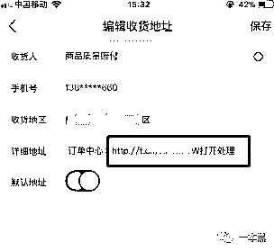
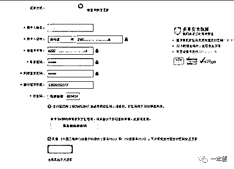
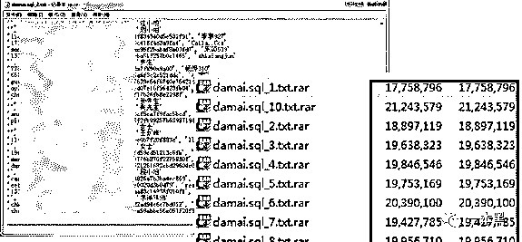
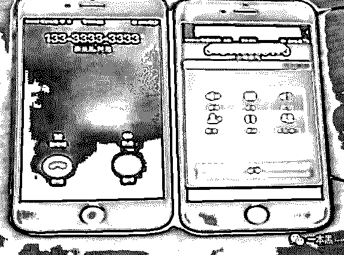

# 谁在我的收货地址加了个链接？让我钱包余额不翼而飞

> 原文：[`mp.weixin.qq.com/s?__biz=MzU4ODAwNzUwMQ==&mid=2247484206&idx=1&sn=a064fe2e793a1139fa3018d55f08462e&chksm=fde2120cca959b1a7bba1756cfead8fc363fdf81fb466389d49290d18284f11526bf6aaf7659&scene=27#wechat_redirect`](http://mp.weixin.qq.com/s?__biz=MzU4ODAwNzUwMQ==&mid=2247484206&idx=1&sn=a064fe2e793a1139fa3018d55f08462e&chksm=fde2120cca959b1a7bba1756cfead8fc363fdf81fb466389d49290d18284f11526bf6aaf7659&scene=27#wechat_redirect)

导读

大多数人不管是 QQ、微信、还是电商平台都是使用的同一个密码，这也就导致了只要知道你其中的一个密码，那么你其他平台的密码也就形同虚设。

**作者|东东**

**责编|振宇**

当你一丝不挂躺在床上吹风纳凉的时候，门外正在发出开锁的声音，显然是有小偷准备进来，你假装熟睡，想着小偷偷完东西就会走。

等没动静后你睁开眼，却发现耳边突然有人缓缓地说：**“我就知道你是装的......”**

现实生活尚且如此，互联网何尝不是细思极恐。

互联网时代，账号相当于一道门，而密码就像现实生活中的钥匙。

你能想象自己的钥匙被盗是多么可怕的一件事吗？

**“钥匙”被盗，钱财两空**

近年来，各大网站的用户数据库被盗已经不是什么新鲜事，即使是防御策略做得比较好的网站也深受其害。

前几天，一个就职于某电商平台的朋友告诉我一个发生在他们平台的真实案例。

客户小李接到声称是该平台的客服电话，“客服”号称小李购买的产品存在质量问题，为不影响客户的购物体验，平台已经为小李办理了退款手续，愿意以三倍的价格做出赔付，并发给小李一个赔付链接。

可能很多人会说，这都多少年的老套路了，难道还会有人信？确实，这种套路一听就感觉是在“钓鱼”。

接到电话的小李心想：“我混迹互联网这么多年，你们这点猫腻还能骗得过我？对方一定是在诈骗，此时小李正准备挂掉电话。”

这时电话对面的所谓“客服”不急不躁地说：“先生，我们已经为您办理了退款手续，您可以登陆自己平台的账号进行查看，平台已经为您上传了赔付入口，只要点击申请即可获得我们平台的三倍赔付。”

刚开始还“趾高气昂”的小李有些疑惑了，难道真有此事，带着疑惑，小李登陆了自己的平台账号，果真在订单的页面看到了退款中三个字。并在自己的收货地址处看到了“客服”所说了赔付入口。



看到此番场景的小李彻底打消了怀疑的态度，随即按照“客服”的指示进入所谓的“赔付入口”，输入自己的各种账号密码。

其实在这个时候，假“客服”的后台就已经同步收到了小李的支付宝账号密码等信息。



（钓鱼页面）

最终，小李的支付宝被盗刷，等发现时已为时已晚。

后来，在老师傅【计算机基础】的帮助下，我们拿到了诈骗人员使用 Voip 打电话进行诈骗的录音，大量的录音基本使用的都是都一个套路，不是冒充公检法，就是引导用户登录已经被修改的账户。

（诈骗部分录音）

**两个最骚的操作——“脱裤”和“撞库”**

可能到这里各位就要问了，所谓的“客服”到底是如何成功钓到小李的敏感信息的呢？

其实说白了就是因为小李的一个手机号码。

怎么做到的呢？首先，各位都知道，很多网站或平台可以用账号密码进行登陆，也可以使用手机号加验证码的方式登陆。

**那别人只知道你的手机号，但是没有验证码怎么登陆呢？**别急，慢慢往下看。

这里，我要先说两个黑客手段里比较骚的操作——**“拖库”和“撞库”。**

简单来说，黑客用技术手段入侵一个防护性能比较低的网站或平台，取得大量用户的账号和密码的行为，就叫做“拖裤”。因为谐音，“拖库”也叫做“脱裤”。

然后拿这些账号和密码到其他网站，例如支付宝、QQ、微信、淘宝进行批量尝试登陆的行为，就叫做“撞库”。

（图片来源于网络）

只要匹配成功，那这个账号密码是具有很大的价值的，黑客可以拿这些账号数据贩卖给诈骗团伙，然后对账号的主人进行精准诈骗。

一定程度上，这种手法有利有弊，就像一把菜刀，你可以用来切菜，但是就有人用来砍人，你说这种操作骚不骚。

这是黑客窃取个人信息最常用的手法之一，只要拿到一批可以登陆的用户账号和密码，就可以盗取更多的个人信息。

实际上还是因为大多数人不管是 QQ、微信、还是电商平台都是使用的同一个密码，这也就导致了只要知道你其中的一个密码，那么你其他平台的密码也就形同虚设。

曾经就发生过一起支付宝被盗 32 万元的案件。报案人声称自己的支付宝账号被窃贼盯上，在连续 10 天的时间里，自己支付宝里的钱不断被人转走，损失巨大。

而实际上此案件就是因为当事人的账号信息被黑客盗取，然后以 2 元/个的价格把支付宝账号信息卖给罪犯，罪犯登陆当事人的支付宝进行非法转账。

**只有手机就能登录你的账号？**

上述案例，一方面是用户自身在各平台的密码都一成不变，可能导致被“撞库”造成其他平台的信息泄露，另一方面则是安全意识比较低。

但回过头来说，最大的问题还是平台的防护机制做的不够好。

因为在某些平台上，我只要知道你的电话号码，我就可以用你的号码登陆该平台。

怎么做到的呢？首先，各位都知道，很多网站或平台可以用账号密码进行登陆，也可以使用手机号加验证码的方式进行登陆。

**那别人只知道你的手机号，但是没有验证码怎么登陆呢？**其实还得回到前面说到的骚操作—“撞库”。

前面所说的问题，黑客在只知道手机号的情况下是如何登陆进入小李的账户的呢？实际上通过老师傅的实验，该电商平台在验证码的机制上存在严重漏洞。

我们都知道很多平台的验证码是有时效性的，也就是说在规定时间内没有填入验证码，就得重新发送，但是该平台针对验证码没有做防护策略，即验证码没有时效性，可以一直的重复输入。

黑客就可以通过类似“枚举”的方式把验证码“猜”出来，加上该平台的验证码只有四位数，这就大大降低了“猜测”的难度。

（枚举：你可以理解成一种无重复、无遗漏，并且有次序有规律的排列组合）

在拿到验证码以后，黑客就可以登入小李的账号，从而修改订单信息，并把所谓的赔付入口实则是“钓鱼”的链接手动填在小李的订单信息中。

这样一来就会大大降低小李的怀疑程度，会让受骗者觉得这一切只能是平台才能操作，但他没有想到，黑客的骚操作同样厉害。

**“你有你的攻城术，我有我的空城计”**

尽管近年来不少媒体曝光了很多诈骗团伙的套路，但始终还是会有人上当受骗。

一本黑一直以来都在揭露灰黑产，让大家了解行业故事，但对于所有的灰黑产，特别是像文中所说案例一样，一直没有一个产品来承载最终的解决方案。

所以，一本黑希望就此能推出一个工具提供给大家使用。

灰黑产说得再多，还不如给一个解决方案，当遇到特定情况的时候能给大家一些帮助，这比什么都强。

别人有骚操作，一本黑难道就不能有一个产品解决这些骚操作吗？

首先，我们会收集大量的情报线索，在各大平台发布“蜜罐”引诱攻击者上钩，以此收集到攻击者尽可能多的信息。

（蜜罐：你可以理解为一种陷阱，目的在于引诱攻击者上当）

我们会整合大数据，对诈骗团队的手法、技术、团队进行分析，并对信息泄露的源头进行分析，当平台发生内鬼窃取数据的时候会做出应急响应，将威胁情报反馈给平台的安全防护端，从信息泄露的源头上进行防范。

诈骗分子一般会通过改号软件，把号码改为电商平台的客服电话，以此来骗取用户信任并实施诈骗。



当诈骗分子获取到用户的订单信息后，他们会冒充客服联系用户并提供退款赔付渠道，以此获取用户敏感账号信息。

我们会对已知的诈骗团伙和可疑的网络电话进行监控，如果我们发现某平台的用户正在遭遇电话诈骗，我们会第一时间给该平台发出通知，并且提供被诈骗用户的联系方式，促使平台第一时间通告用户。

于此同时，我们可以帮助平台寻找数据泄露点，及时修复漏洞。

假如用户落入圈套被诈骗，我们会根据犯罪分子的电话拨出情况进行追根溯源，了解到犯罪分子所在的窝点位置、手法、所使用的的技术等，给公安机关提供破案的线索。

拿到诈骗人员的相关信息后，我们还可以进行反“钓鱼”，获取诈骗人员电脑中的信息，这样就可以拿到最根本的证据。

揭露灰黑产的媒体本身就不多，大多都是泛泛而谈描述现象，能针对特定场景给出解决方法的更是寥寥无几。

一本黑希望做一个先行者，不管是追根还是溯源，我们都希望能做到面面俱到，谈其现象不如解其本质，也希望我们的想法是有价值的。

还原事实｜专扒黑产

微信 ID：darkinsider

知乎 一本黑

头条 一本黑

投稿、爆料请点击菜单【爆料入口】

招聘、转载请点击菜单【联系我们】