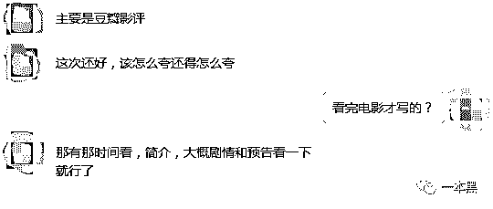

# 《后来的我们》出现 2000 万退票，是票房造假还是营销骚操作？

> 原文：[`mp.weixin.qq.com/s?__biz=MzU4ODAwNzUwMQ==&mid=2247484200&idx=1&sn=2b190652e6e1c6355c9d3285510b0440&chksm=fde2120aca959b1ca85ae2932122ada4112b88e6da5b1d89794d5be92f3efc6c9d9ad5bce25b&scene=27#wechat_redirect`](http://mp.weixin.qq.com/s?__biz=MzU4ODAwNzUwMQ==&mid=2247484200&idx=1&sn=2b190652e6e1c6355c9d3285510b0440&chksm=fde2120aca959b1ca85ae2932122ada4112b88e6da5b1d89794d5be92f3efc6c9d9ad5bce25b&scene=27#wechat_redirect)

导读

想要吸引观众的注意力，数据造假是其中的一种手段，只有先把数据变成一个可以任意掌控的“泡沫”时，才能得到更多人的关注。

**作者|东东**

**责编|振宇**

世上总是会存在一些令人意想不到的骚操作，但这在“水深火热”的影视圈却再正常不过。 

对于大部分人来说他们还都只是凑热闹的门外看客，里面的套路之深是绝大多数人不会想到的智商收割之作。

一直以来都很喜欢电影，所以会经常关注影视圈里的一些东西。

想必各位的朋友圈已经被《后来的我们》刷了屏，当我看到一些好友晒电影票转发情感文的时候，突然想到去年爆火的《战狗 2》，难道这就是你们觉得的中国好电影？

其实，早在《后来的我们》上映之前，猫眼的想看人数就超过了 90 万，这算是我见过最高的“想看”人数了，想必已经创造了该项指标的记录。

那时候我就在想，这部卖情怀的电影难道真有这么大的影响力吗？难道又是一部现象级的影片？

确实，因为前期的宣传，该片热度一直居高不下，微博热搜早已高达 8 亿阅读，上映一天更是拿下将近三亿的票房，截止一本黑撰稿发布前，该片的实时票房已经突破四亿大关。

但令人诧异的是，在票房猛增的同时却出现了反转，多方消息爆料称，《后来的我们》在上映首日出现大量退票情况，并且不少影院单日的退票率都在 10%以上，被退票的影院总数接近 4000 家，按照票房均价和退票数来说，当日退票总额大概在 2000 万左右。



微博“电影票房”也发博称，互联网时代，这种暗箱操作的手法着实让人意想不到。这种骚操作真是甩开以前的前辈十八条街，还能压住曲线铺开，要不是玩太过，弄得各大影院自爆，还真是发现不了。



**庄家潜伏进场，韭菜追高进场，庄家高位出货**

实然，这是一场有计划的营销手段，先是通过第三方售票平台购入大量电影票来刷高预售票房，从而造成一种该片很火爆的现象，以此来迷惑影院和观众。

接着影院就会觉得本来就是五一档，该片肯定会火，于是就会加大排片量和观影场次。

当然这世上从来不乏凑热闹的人，一块石头激起的水花都有可能会被围个水泄不通，观众会担心片子火爆买不到票所以会提前购票，这样一来就相当于“火上浇油”，影片的预售价和热度自然也就水涨船高。

等预售票房上去后，再大规模退票，反正此时已经圈了一波人，我黯然离场，尔等韭菜继续为我翻炒热度，岂不快哉。

其实，该片上映前也算是做足了各渠道的营销准备，认识的一些情感号大 V 和影评大号都陆续给该片“煽风点火”，朋友圈迅速就被“后来的我们什么都有了，却没有了我们。”刷屏

（在影片中，这句话真的很尴尬，不知道你们能不能感同身受。）

随后，我询问了其中一个情感大号的主编，他说早在一个月前就接到了该片软文广告的单子，都是为了赚钱，没必要和钱过不去。



认识一位专职写影评的朋友，他说每当有片子上映，接的单子都写不过来，要么是中规中矩的一顿好评，好么就是处心积虑的炒作。重要的是连电影都没看过就开始写......



朋友告诉我，圈内的很多大 V 都会接这种单子，当然《后来的我们》也不会例外，大 V 写完的文章会找很多水军去刷好评，价格大概在 0.5 元到 1.5 元左右，他们有很多这种水军的渠道，甚至有人专门靠水军发家的。

这其实是一条完整的利益链条，有需求方，自然就会有“供货商”。

这样一来就会给众多吃瓜观众造成一种这片子确实不错的感觉，自然就会掏钱买票。

《后来的我们》上映首日，豆瓣上的影评文章接踵而至，底下的评论我想都是广大水军的扪心评论吧。

为了一探真相，一本黑悄悄加入了一个水军付费群，进群后通过翻看聊天记录，确实发现了大量要求水军接单刷好评的单。



其实，不管是豆瓣刷分刷评论还是邀请大 V 做台，早就已经是业界潜规则，大家都心知肚明。

但那些连电影都没去看就一通好评如潮的人就有些过分了，翻看了群内分享的一篇请水军刷好评的文章，底下那些万能的口水评论我想可以适用到任何地方吧。（真的棒）



在这个碎片化的时代，想要吸引观众的注意力，数据造假是其中的一种手段，只有先把数据变成一个可以任意掌控的“泡沫”时，才能得到更多人的关注。

只有掌控群众的跟风心理，才能收割群众，控制你的情绪，引导你的思维，从而让你心甘情愿地掏钱买单，这一点操纵者玩得确实溜。

你要说片子不错，那这些手段都可以无视，关键是这东西真的没法看，让一推人买票花两个小时在影院尴尬度过，然后尴尬离场。

可能有些人会说，片子演得很好啊，精湛的演技加上富有感情的台词，情绪的把控恰到好处，揪住了观众的情感之门，肉眼之间传达出的情感变化，尘封在记忆里的点点滴滴一下就涌上了心头。

嗯，你就适合这种片子了，评论得也很到位，有种那英评论好声音的深邃之感，很棒。

值得注意的是，同时期上映的《幕后玩家》等影片自然也就成了炮灰，这些影片一没情怀二则营销不够，自然玩不过此等骚操作。

所以，总的看来，《后来的我们》才是真正的“幕后玩家。”

可以想象的是，五一小长假第一天，各位吃瓜群众正拿着电影票排着长队，前赴后继的去回忆自己的青春。

其实我也去看了这部电影，确实很好看，很感动，特别是开头吴京跳水的那段。

还原事实｜专扒黑产

微信 ID：darkinsider

知乎 一本黑

头条 一本黑

投稿、爆料请点击菜单【爆料入口】

招聘、转载请点击菜单【联系我们】