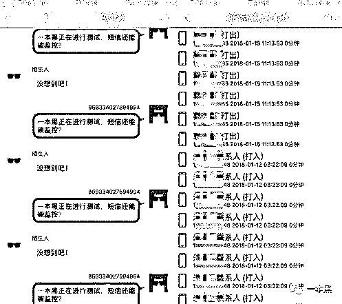
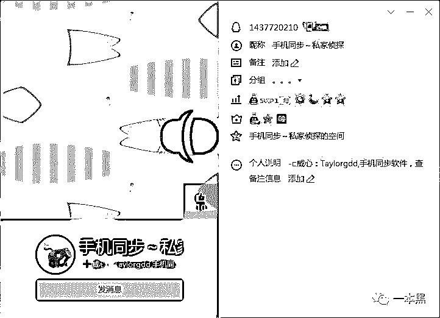
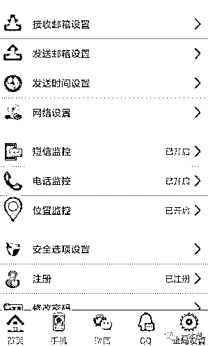
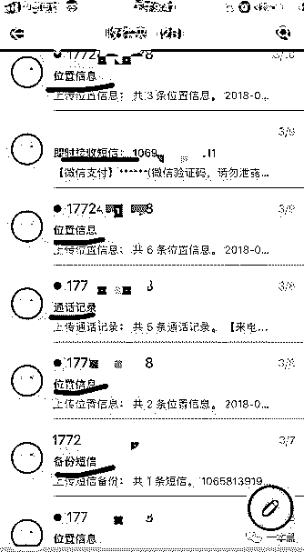
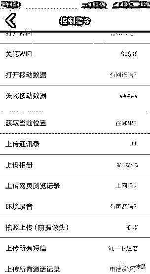
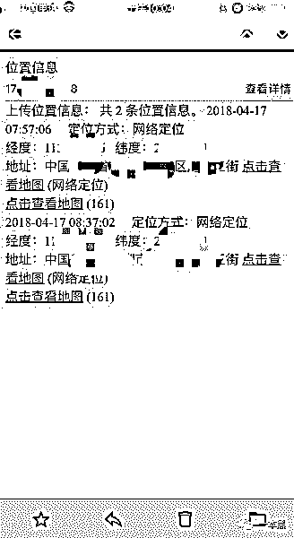

# 五秒钟监控你的微信钱包和聊天记录，苹果手机也在劫难逃！

> 原文：[`mp.weixin.qq.com/s?__biz=MzU4ODAwNzUwMQ==&mid=2247484180&idx=1&sn=43a0dc5f249e83616bd3ddadbecf576e&chksm=fde21236ca959b202bff552f2c99607bc9b4325ceb1c0c31c86416c587c23e64391c741e7d21&scene=27#wechat_redirect`](http://mp.weixin.qq.com/s?__biz=MzU4ODAwNzUwMQ==&mid=2247484180&idx=1&sn=43a0dc5f249e83616bd3ddadbecf576e&chksm=fde21236ca959b202bff552f2c99607bc9b4325ceb1c0c31c86416c587c23e64391c741e7d21&scene=27#wechat_redirect)

导读

不止是微信聊天记录，就连你微信的通讯录、朋友圈、甚至是钱包、转账记录都可以被别人轻易掌控。

**文|东东**

**责编|振宇**

**本文与好基友差评联合发布**  

一月末的时候，一本黑发表了一篇《你的手机正在被人悄悄的监控，别人能看到屏幕显示的所有内容》的文章。

文章主要讲述一款监控软件，只要把这款软件安装在别人的手机上，你就可以监控别人的手机，别人手机上的 QQ、微信、通话、短信等记录都可以一览无余，甚至是对方的当前位置，都可以进行监控。

本来这种软件的设计初衷是为了防止老人小孩上当受骗或者走失，针对特定情况可以起到一定的帮助，但由于其功能的强大，却被不少用来监控他人，全然变成了一个满足自身窥探欲望的工具。

不过，该软件目前已经无法正常使用，但是人心不足蛇吞象，这款软件失效后，我们又发现了另外两款用于恶意监控他人的软件。

比起前者，后面这两款软件的功能更加强大，**你能想象别人只要接触你的手机 5 秒钟，就可以监控你的微信聊天记录吗？**

**不止是微信聊天记录，就连你微信的通讯录、朋友圈、甚至是钱包、转账记录都可以被别人轻易掌控。**

**一条指令即可监控你的手机**

在之前的文章中我说过，人真的是一个充满好奇心的动物，更何况是在这个“饱暖思淫欲”的时代。

有些好奇心很重的人可能每天都会在想，自己的另一半会不会背着自己干些偷鸡摸狗的事，不管是加班应酬还是出差在外，都想知道对方身处何方，于是也就出现了想要监控对方手机的想法。

有需求就一定会有市场，针对这种窥探欲望的需求，就有人做出了一些监控软件解决这类人的需求。

通过读者爆料，我们联系上一位卖家，对方声称自己手里有两款监控软件，针对不同的手机，他们会给客户推不同的软件。



随后，我们先是拿到了卖家口中所说的第一款软件，这款软件只针对安卓手机，也就是说只能监控安卓手机，只要在被监控人的手机里安装这款软件，就能对其实施监控。

这款软件售价 588 元，付款后卖家发来了软件的下载地址和软件的教学视频，以及软件所需要用到的授权码。



和之前文章爆料的软件一样，这款软件也分为监控端和被监控端，操作者只需要拿到对方的安卓手机安装这款软件，在软件里进行一些简单的设置就可以完成监控效果。

让我们意外的是，监控端居然是新浪邮箱，根据卖家发来的教学视频，在被监控人的手机里安装完监控软件以后，还需要注册一个新浪邮箱用来接收被监控人的手机信息。

然后把邮箱和监控软件进行绑定，就可以对被监控人的手机实施监控。可怕的是这款软件也可以进行隐藏，安装完成后只要设置了隐藏模式，被安装的手机桌面根本发现不了这款软件的踪迹。

通过试用我们发现，只要被监控的手机安装了这款软件，监控端的邮箱里就会马上收到被监控手机的通话记录、短信记录、QQ、微信聊天记录等。

如果你以为只有这些功能的话那你就太天真了，这款软件还可以给对方手机发送指定的指令，从而对被监控人的手机进行控制和获取对方手机当前的各种信息。

发送指定的指令后，可以任意打开被监控人的移动数据、可以获取当前位置、上传通讯录、相册等。



（假如相册有私密照是多么的可怕）

以获取当前位置为例，我们用监控手机向被监控手机发送了一条指令，随后就在邮箱里收到了被监控手机的当前位置，点击位置可以跳转到地图界面，地图上可以清楚的看到被监控人位于那个街道那条路。



都说科技是一把双刃剑，它在带领人们探索新世界的同时，也有可能被恶意利用，就好比我们这次提到的手机监控软件，是该用在正确的地方对人产生有益的价值还是用于窥探隐私，说到底还是一个关于人心的问题。

**五秒监控苹果手机，微信钱包一览无余**

还记得我们在上次的文章中说，好在目前这种监控软件只能控制安卓系统的手机吗。不知道是科技发展得太快还是一本黑知道得太少，现在已经出现了能监控苹果手机的软件。

和只能监控安卓手机的软件比起来，这种监控苹果手机的软件只能对微信进行监控，但和前者不同的是，这种软件可以实时同步你的微信聊天记录，**不止是微信聊天记录，就连你微信的通讯录、朋友圈、甚至是钱包、转账记录都可以被别人轻易掌控。**

为了一探究竟，我们再次向卖家“购买”了这款软件。

购买？购买是不可能购买的，这辈子都不可能购买的，有老师傅在还需要购买吗？

软件售卖 888 元，但老师傅用计算机基础巧妙绕过授权码这道门槛，为我们节约了一笔资金，（但最后还是请老师傅吃饭了）

卖家说这款软件不需要安装在对方的手机上，只要安装在自己的手机上即可，因为这款软件针对苹果手机，所以要想监控苹果手机，监控端也得是苹果手机。

按照卖家发来的教学视频的步骤，我们安装了这款苹果微信监控软件，安装完以后软件里多出来一个悬浮的按钮，实际上就是一个插件。

插件里有一个功能叫做【一个号同时登陆两个设备】，只要把这个选项打开，软件就会生成一张二维码，通过拿被监控人的微信扫码这个二维码，对方的微信就会悄无声息地登陆在监控人的手机上，并且被监控的微信不会有任何察觉。

**而扫描二维码到登陆微信这个过程总共不会超过 5 秒钟。**

登陆被监控人的微信以后，我们不仅可以清楚的看到被监控人的聊天记录，还可以看到通讯录好友，朋友圈状态，甚至是钱包里有多少钱，绑定了几张银行卡，转账交易记录都可以看得一清二楚。

简直就像操作自己微信一样，微信上的任何功能都可以查看。老师傅解释道，**这就好比一个微信号可以同时在手机上登陆，也可以在电脑上登陆是一个道理。**

现在大多数人不管是生活还是工作都离不开微信，微信俨然已经成为了人们必不可少的一个社交工具，假如你的微信被不怀好意的人而已使用了，你微信的一切信息都有可能被监控，最可怕的是你微信里的钱也极有可能被别人转走。

另外，微信针对钱包功能有一个钱包锁，建议大家可以给自己的微信钱包加锁，设置方法在支付中心的支付安全里面。

那如何破解这种监控手段呢？通过实验我们发现，只要被监控人切换微信账号退出以后，监控者也会跟着退出，但是鸡肋之处在于，别人还是可以通过获取扫描二维码的方式再次对你实施监控。

对于这种监控苹果微信的软件，我们似乎显得有些无奈，不过但凡是程序都必定会存在漏洞，一方面，我们应该最大限度的避免别人接触到自己的手机，谨防别人通过这种方式监控自己。另外，我们可以经常切换账号退出再登陆，可以一定程度上的避免被监控。

有人在豆瓣上说公司的 boss 要给员工工作机装监控微信的软件，网友纷纷发表看法，那是别人的隐私你凭什么去监控。

虽然说公司老板是为了监督员工的工作情况，但事实上这种行为已经侵犯了员工的隐私权，员工完全有权利起诉公司的这种行为。



对于情感这个复杂的问题，也有很多人购买这种软件监控自己的身边人，生怕对方背着自己出轨，一本黑不擅长讨论情感问题，这里也就不在多说。



也许这个世界本来就是一个关于人性的舞台，事物的好坏还得看人心怎样去定义。

对于公司员工或身边人，通过监控的方式掌控对方的一举一动，本就是凌驾于彼此信任之上的一种不可取的方式。

老话说得好，用人不疑疑人不用，彼此都没有信任可言，员工凭什么给你打天下。

总的来说，是否信任他人，真的和这个社会、和他人无关，只和我们自己有关。

还原事实｜专扒黑产

微信 ID：darkinsider

知乎 一本黑

头条 一本黑

投稿、爆料请点击菜单【爆料入口】

招聘、转载请点击菜单【联系我们】