# 一张照片让你背负现金贷的债，还在随意发验证照吗？

> 原文：[`mp.weixin.qq.com/s?__biz=MzU4ODAwNzUwMQ==&mid=2247484175&idx=1&sn=29af192e9ed52c1bb22ff8de721ea89a&chksm=fde2122dca959b3b831a19a9c243be69040bfb7cd0cb9636878b77b3a95d51347a4a72fb0689&scene=27#wechat_redirect`](http://mp.weixin.qq.com/s?__biz=MzU4ODAwNzUwMQ==&mid=2247484175&idx=1&sn=29af192e9ed52c1bb22ff8de721ea89a&chksm=fde2122dca959b3b831a19a9c243be69040bfb7cd0cb9636878b77b3a95d51347a4a72fb0689&scene=27#wechat_redirect)

导读

某天你正在家打着王者，对面后羿残血，只差一枪解决，你正要松手放技能时一个电话进来。非常气恼的你接起电话，电话对面却催你还款，确认是真的欠债，不是恶作剧也不是骗局，你的脑子嗡的一声瞬间凉了。

而这一切，只因为一张照片。

**文|小白**

**责编|振宇**

# 

**你的手持身份证照片正在被贩卖**

信息时代，你的每一个行为都会留下痕迹，而在办理业务验证时往往需要身份证复印件甚至手持身份证照片，却不知这其中有诸多泄露环节。验证无过，只怕经手人“有心”。

有媒体爆出过通过搜索引擎可以轻易搜到手持身份证照片，引起了轩然大波，不久后又有另外的媒体立刻写出了文章反驳，称搜索出来的手持身份证照片大多是网站的“示例照”，并不是完整的个人手持证件照。

个人信息的泄露早已是公开的秘密，处在“所有人都知道，所有人都焦虑，所有人都无可奈何”的矛盾之中。

而事实是怎样呢？我们到底是需要警惕，还是放下悬着的心呢？且听我慢慢道来。

### 

**高清套图低价出售，里面有你的证件照吗？**

生活中有许多场景都需要用到身份证正反面照、学生证等，而这些重要证件的信息泄露也就相应地变得更加频繁，我们使用搜索引擎随意搜了几个售卖信息的“工作室”（真的很随意），添加之后简单聊了聊，结果让我们大跌眼镜。

“供货商”们货源充足，提供的图片高清，正反面照+手持身份证照一套的价格只需要 20 元~80 元不等，多买还有优惠，价格直接跌至 2.5 元~10 元。

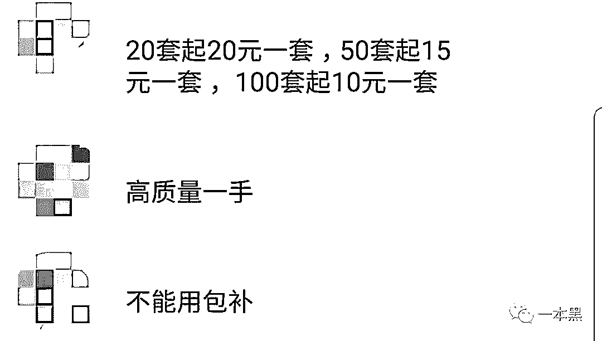

为了证实自己确实有这么多“货”，他们截取了部分文件图片及证件图片给我们。

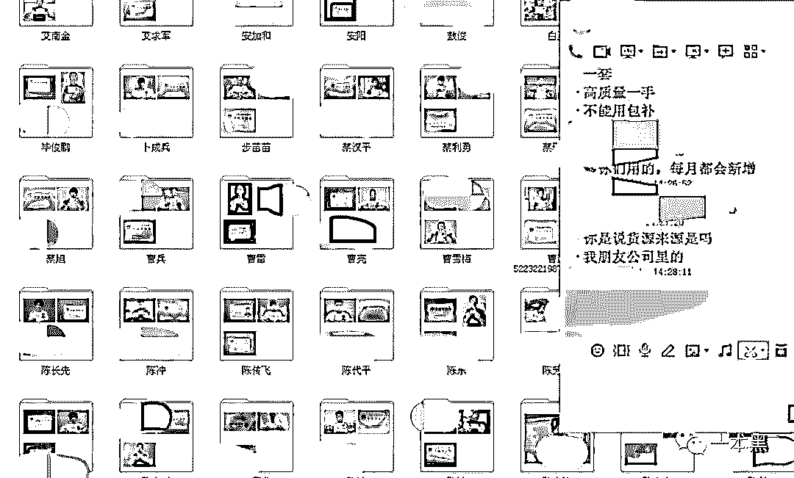

为了验证真实性，我们花 10 块钱买了一套，对方立刻发来一个文件夹，里面包含了身份证正反面照及一张手持身份证照片，打印出来也非常清晰。

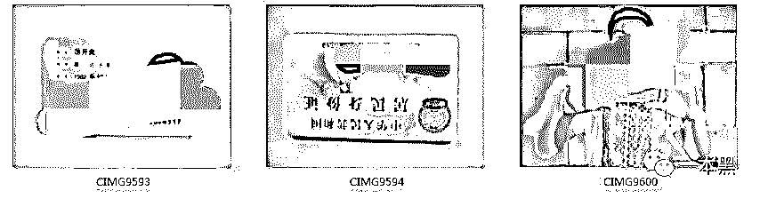

这些照片的流出渠道是多样的，通常来自电信运营商内部、中小型借贷平台、以及一些聚合支付平台等。流出途径除了内鬼操作外，还有黑客入侵盗取、钓鱼网站收集。

**我们为什么总是呼吁大家要重视公民信息安全？特别是在这些可以轻易获取用户各种信息资料的运营商内部，信息安全意识薄弱，防护手段只有薄薄一层，有心人轻轻一捅，所有信息全部漏进他们事先准备好的箱子里。将重要的信息资料交付到他们手里得瞬间，你就等同于选择开始裸奔。**

而在调查过程中，我们发现了一个更为可怕的信息泄漏源——学校。一个工作室在贩卖身份证照片的时候，顺口给出了与学生证一同打包购买的套餐价，只需要加多十元，我们就可以同时拿到包含学生证、身份证正反面、手持身份证的高清套图。

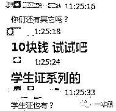

学生们外出做兼职的时候由于对信息的保护意识不高，非常容易按照对方要求给出各种信息和照片，这也造成了自己的信息在黑市流通的原因。少部分学生照片流出源头在校园贷，这些借贷平台不只利息高、放贷轻松，同时还进行这信息的批量贩卖。

### 

**不只是套图，还有原件**

如果你们以为他们出售的只是图片，那就真的太单纯了。除图片外，许多工作室出售的是身份证原件以及黑产“四件套”。为此我们通过 QQ 群搜索关键字，找到出售身份证的群并添加。

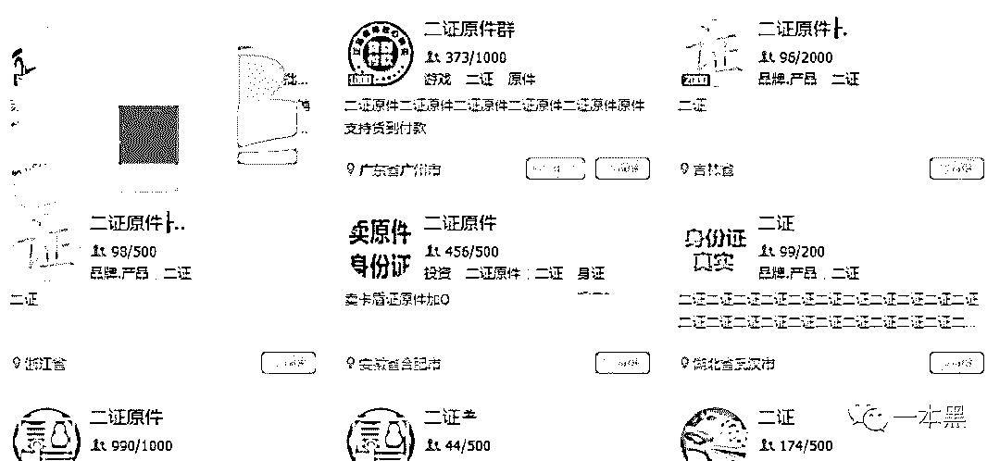

群主主动找我们聊天，确定我们的购买意向后群主发来了证件实图证明自己确实有货。

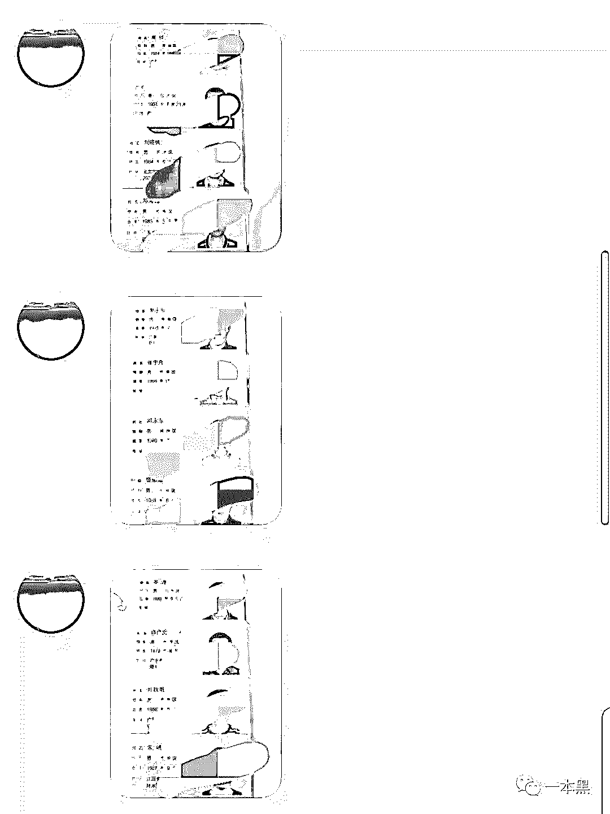

相比身份证套图，原件的价格贵了几十倍，单张可以达到 180 元~500 元。在服务方面，他们也做得非常“完美”，你可以选择证件的性别、年龄甚至地区，他们会尽可能满足你的要求。得来的证件确保可以用来办理电话卡、开房、购票等，不能使用还提供包赔包换补服务。

这些身份证通常是遗失证、盗窃证、社会闲散份子贩卖证以及去偏远地区收购所得的证件，其中必须注意的是遗失证及盗窃证。当你的身份证丢失后，落入这些人的手中就有可能会变成这个产业中的一环，被黑市商人直接叫卖或者办理完整的“黑产四件套”用来从事借贷、洗钱、薅羊毛等“业务”。

（所谓“黑产四件套”，即身份证、银行卡、银行卡密码、电话卡全套产品，四件套商人直接利用手中的身份证办理好这些以免去“顾客”们的麻烦，不必让他们额外再跑去银行或营业厅办理）

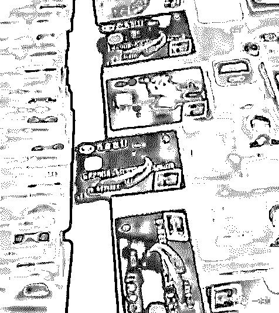

群内有专门出售“黑产四件套”的卖家，他们的生意同样非常火爆，头一天还在群里说有几十套，第二天立刻“断货”，需要等待“补货”。

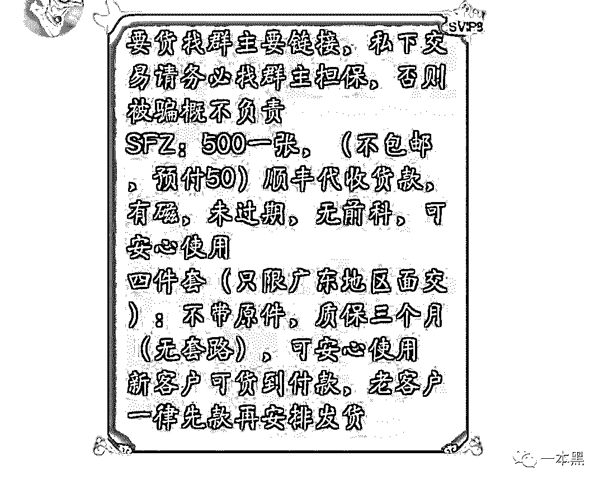

这些群的群主除了买卖证件外，还“兼职”做群成员相互交易的担保人，收取 10%的手续费，使得 QQ 群成为了一个小型的黑产交易市场。

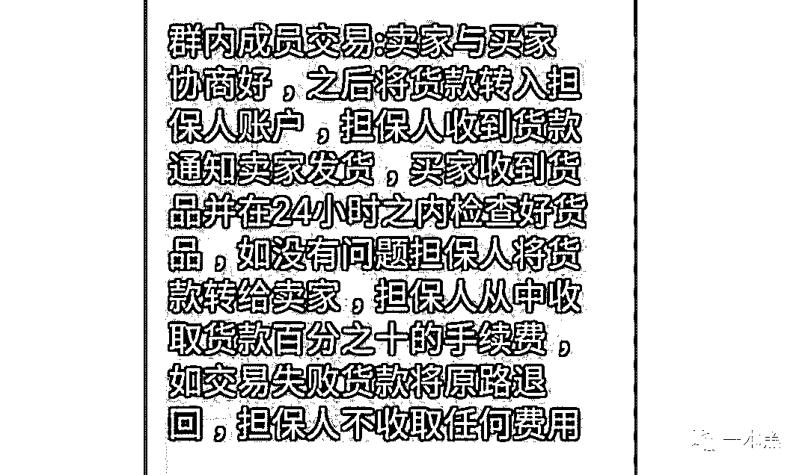

# 

**你的信息，被用来做什么？**

除了被广泛用于各种类型的诈骗，作为诈骗目标，你的信息还可能被用于以下场景。

## 

**黑产洗钱需要你**

黑产大佬们出货收款，总需要让这笔钱变成合法所得，而这个过程中，他们需要用到大量的银行卡账户。一来隐藏自己的身份，快速转移资金，二来将钱洗进国外账户躲避法律追责最终取出。

这些银行卡账户的来源，就是遗失身份证的你。身份证丢失后挂失，以为万事大吉，却不想旧的身份证还能继续被使用，部分银行的银行卡办理手续也不算严格，比较轻易就能被利用办理。

除此之外还有利用兼职学生进行银行卡办理的灰产从业者，发布收购信息，以各种理由收购银行卡，这些银行卡极大可能会变成洗钱中的一环。

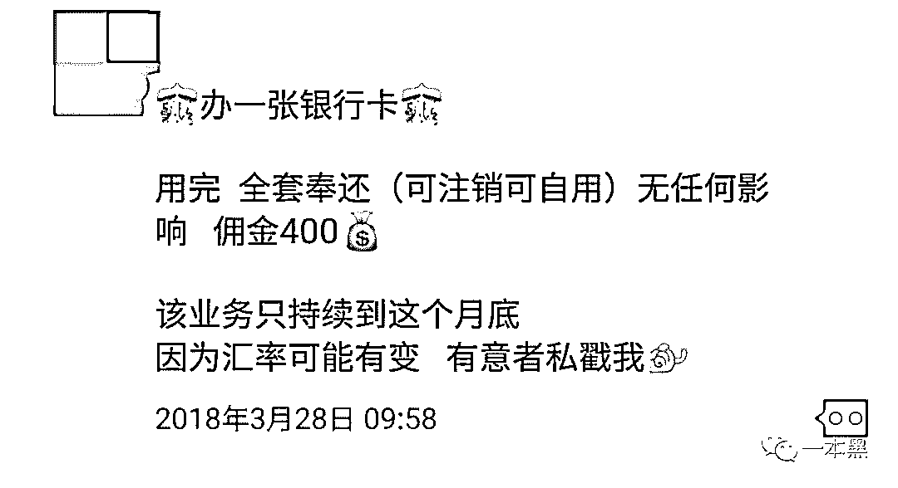

不过身份证信息新规出来，也让大家松了一口气。但不可不提的是，新规推行需要时间，并且由于新规的局限性，对从事身份证买卖的人来说暂时也不存在问题。

## 

**小额贷款需要你**

一件开心的事情是国家开始加大对现金贷的管制了，可这依然不能让人完全放下心，因为在部分中小型借贷平台，还是存在违规放款的现象。

而黑产四大件的存在仍然是他们骗贷的好帮手，一些审核不严的借贷公司轻易就能将钱打入诈骗者的账户。尽管这样的场景出现的频率不算特别高，但还是有人在尝试，相关的咨询和新闻也并不罕见。

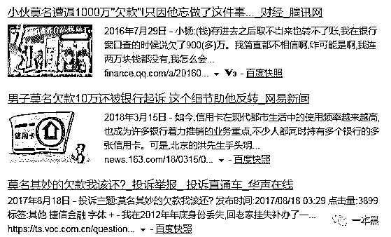

## 

**薅羊毛，你也是帮凶**

薅羊毛是灰产里面的常见手段，利用各种互联网公司的优惠政策和买来的身份信息，制造虚假账户，从中获利。

比较常见的是电商平台的秒杀活动、新兴金融平台的返现政策，以及各种新游戏推出时的红包活动等。

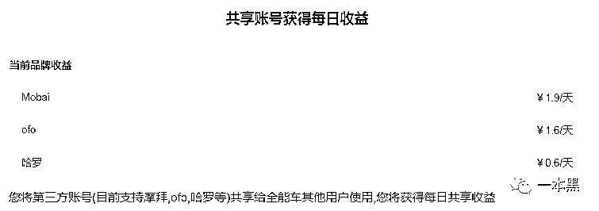

## 

**利益互换，来自互联网大佬的恶意**

这个世界本质是由利益连接的，两间公司关系好或者两个平台有合作，本质上是因为他们之间可以互利，而你们的信息，则会成为这种融洽氛围的牺牲品。

你在 A 网站注册时填写的关键信息，随时被“友好共享”至 B 公司，B 公司在与 C 公司合作时，又会为了便利进行实时同步。

个人隐私？不存在的。

互联网时代的到来使我们每个人都处于信息的洪流之中，这其中就藏着一双双狡诈的眼睛，他们随时盯着你的一举一动，看准时机便伸出罪恶之爪。

你不经意泄露的每条信息，都可能成为他们的目标，这些信息收集起来，就能对你进行完整的画像，为你定制专属骗局，试图榨干你身上的每一丝价值。

在这样的环境中我们瑟瑟发抖，不知所措，只能一点一点艰难防范，努力填补之前的漏洞。**在信息安全保护方面，道阻且无限长。**

还原事实｜专扒黑产

微信 ID：darkinsider

知乎 一本黑

头条 一本黑

投稿、爆料请点击菜单【爆料入口】

招聘、转载请点击菜单【联系我们】