# 转载 | 有人在微信里公然开赌场，月入过亿，代理商遍布全国，有人一夜输 9 万，却为何无人报警查处？

> 原文：[`mp.weixin.qq.com/s?__biz=MzU4ODAwNzUwMQ==&mid=2247484160&idx=1&sn=9f4048d2dde07d3cf12977baaf47b21c&chksm=fde21222ca959b342f428b6c750bfa3cf06ee1fcf770ab762cd31682e7f27a182e246370418b&scene=27#wechat_redirect`](http://mp.weixin.qq.com/s?__biz=MzU4ODAwNzUwMQ==&mid=2247484160&idx=1&sn=9f4048d2dde07d3cf12977baaf47b21c&chksm=fde21222ca959b342f428b6c750bfa3cf06ee1fcf770ab762cd31682e7f27a182e246370418b&scene=27#wechat_redirect)

导读

浅黑科技，一本黑的好朋友，他们的初衷就是找到那些执着于技术的人或企业。

和一本黑不一样的是，他们更乐于倾听别人口中的科技与未来。

比罪恶本身更可怕的，是所有人对它浑然不觉 ——  受害者前仆后继，监管者却视而不见，甚至开路放行……

不巧，这事儿正在真实发生。

最近浅黑科技（qianheikeji）接到一个读者爆料：**“有人利用微信推广新型网络赌博项目，受害者已遍布全国，有人一夜输掉近十万元”。**

更可怕的是，这个项目被精心包装成网购商城，披上了“娱乐购物”的外衣，有些受害者不觉得自己被骗，商城的人也不自认教唆赌博。

目前，这个项目仍在火爆招商，他们堂而皇之出现在微信群和朋友圈，拥有数十个微信公众号，公然在微博、百度贴吧推广招商。他们不仅在苹果商店、腾讯应用宝上架了自己的 APP，甚至还请了明星代言，把广告挂到了权威新闻网站…… 

……

……

……

**起底微信平台、苹果商店里明目张胆的新型网络赌博**

文|浅黑科技（qianheikeji）

**01 赌场的光鲜外衣**

“不然报警吧？”

家住湖南农村的老杨一晚输掉积蓄已久的 9 万块，家人劝他报警，他自己反倒不情愿。

“报警？怎么跟警察说？说我买了 9 万多块钱茶叶？……我不报！”

事实上，老杨心里不服，他还想去借点钱“回本”。

几个月前，有个网友给老杨推荐了**“维加斯商城”**，声称在上面**买东西就能赚大钱。**一天好几百，月入万元不是梦，投得多赚得多，单车变摩托。

老杨心想：别的商城买东西都是花钱，这个商城买东西还能赚钱？

出于好奇，他点进去看了看。

依照官方宣传，这家商城声称自己是**国内最新的“娱乐购物”模式**，顾客一边买东西一边还能玩游戏赚钱。

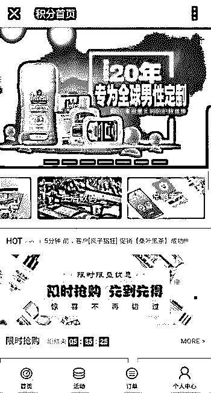（看起来和平常的商城无异）

老杨点开商城，看似平常的网购页面里有个**“促销专区”**，网友告诉他，**这是维加斯商城的“娱乐购物”的核心，是赚钱的关键。**

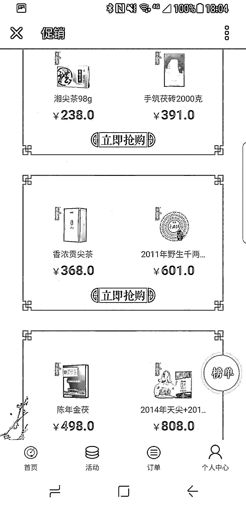（促销专区页面）

它的玩法是这样的：

> 顾客在商城买一件商品，就能获得一次“**促销**”机会。
> 
> 所谓“促销”其实就是抽奖，一旦成功就能用原来的价格买到另一件**1.6 倍**价值的商品，**而且还能退货直接拿钱**。
> 
> 如果“促销”失败，顾客依然能买到原来的那个商品，但不能退货。

**买东西免费送抽奖，抽中奖****了能赚钱，输了也不亏，能买到“等值”商品**。听起来，这是个稳赚不亏的生意。

在网友的鼓动下，老杨决定买个 200 元的茶叶试试。

购买完商品，老杨进入了一个“促销”页面，“促销”活动分为两种 —— “拆红包”和“猜鸡藕”。

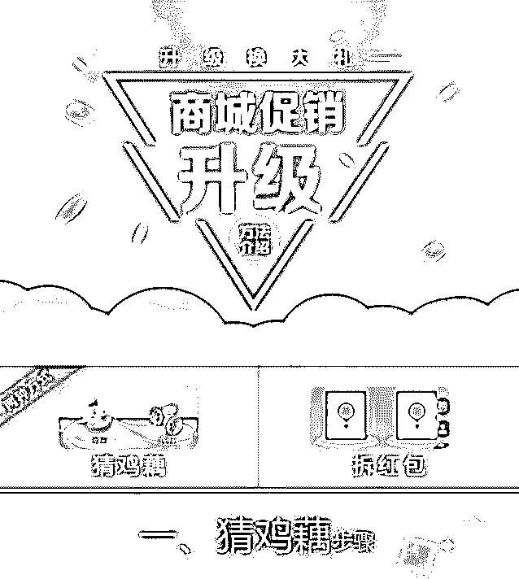

拆红包简单粗暴，页面里有两个红包，点开其中一个就能告诉你是否促销成功，类似于我们熟知的“砸金蛋”。

相比之下，“猜鸡藕”就更有有意思也更“专业”。

所谓“鸡藕”，就是“奇偶（单数和双数）”，开奖号码和正规福利彩票“重庆时时彩”开奖号码的最后一位数同步，10 分钟开一轮，顾客只要猜中就算中奖。

网友说告诉老杨，“这样能确保平台没作弊，公平公正。猜中的概率是 50%”

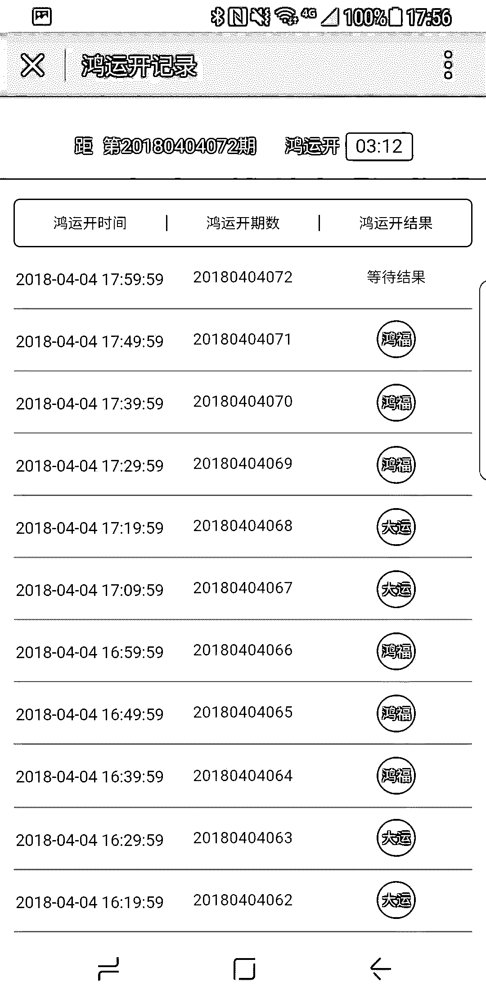（维加斯把单双称为鸿福和大运）

老杨试着下了一注“大运”，居然中了，价值 200 元的茶叶立马升值成 320 元。他当即点击退货，账上余额变成 320 元。

那次尝到甜头后，老杨再也忘不了这个赚钱的捷径，从此再没心思专心工作了，每天泡在这个所谓的“娱乐购物商城”，直到那晚他输掉家里积蓄的 9 万元，事情就再也瞒不住了……

----

事实上，稍加琢磨便不难发现，**这种所谓的“创新”玩法，和赌场的逻辑一毛一样**：

> 在拉斯·维加斯赌场里，赌徒买进筹码，参与“百家乐”、“21 点”、“大转盘”之类的赌博游戏，赢了就能获得面额更高的筹码，最后将筹码兑换成货币，离场。（或者输个精光）
> 
> 在维加斯商场里，顾客先买进茶酒等商品，参与“促销”活动，促销成功就能赢得面值更高的商品，最后将商品退货兑换成货币，离场（或者把钱买光，就像文章开头老杨那样）

商城里所谓的“猜鸡藕”，更是典型的“**外围投注**”赌博：**庄家私底下开设赌局，再利用公开博彩号码开奖。**

曾经一度流行于广东、湖南一带农村的**“地下六合彩”就是这种外围投注模式**。最风靡时，“地下六合彩”在农村形成了“全民买码”的氛围，上到七八十岁的老人，下到十几岁的小屁孩都想碰运气，人们甚至一度坚信看中央电视台播出的天线宝宝能预测开奖号码（是真事，不知道现在是不是改看小猪佩奇了），最后不少人输得倾家荡产。

**本质上，维加斯商城的猜鸡藕，就是另一个“地下重庆时时彩”。而商城就像是一个披着网购外衣的大赌场。****在这里，商品就是筹码，买货就是下注，促销游戏就是赌桌。**

和赌场不同的是，维加斯商场为输家准备了安慰奖，即便玩家输光了钱，也能“买”到一堆茶叶、红酒之类的高溢价商品。

**但这也正是商城的精妙之处，商品不仅掩盖了赌博的事实，也堵住了输家的嘴。**

**02 明目张胆地宣传扩张**

披着光鲜亮丽的商城外衣，这个维加斯商城光明正大地出现在网络和各大社交媒体。

微博上搜索“维加斯商城”，你能找到经济网刊发的一则资讯，大意是维加斯商城请了李修贤代言，引领“新娱乐购物时代”。

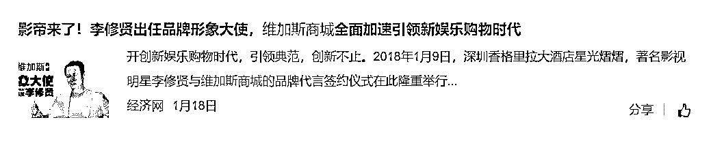（注：经济网是人民日报经济周刊官网、国家一类新闻网站，也就是传说中的权威媒体）

大家对李修贤这个名字可能不太熟，但多半见过他的脸。

他是早年间香港的**双料影帝**，经典港片《喋血双修》就是**他和周润发主演**的。**据说周星驰，郭富城，黄秋生等一大票现香港影坛巨头都算是他提拔出来的。**

权威媒体刊发报道，影帝代言加持，一般的吃瓜群众看到这里，多半会觉得这是一家做正当买卖的公司吧？**这正是他们想要的宣传效果。**

微博上，他们正大张旗鼓地招商：

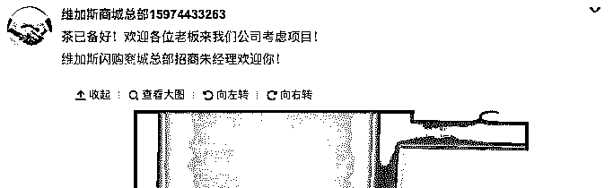

在微信上搜索“维加斯商城”，竟能搜到超过 30 个这样的公众号，**“娱乐购物”模式在全国各地开花。**

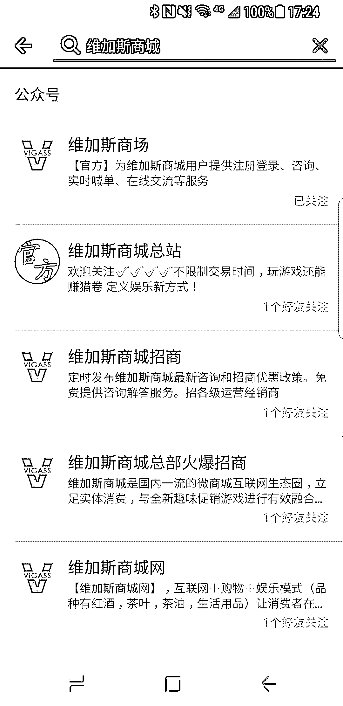（微信公众号搜索截图）

苹果商店和不少国内安卓应用市场也明晃晃地摆着维加斯商城的官方 APP：

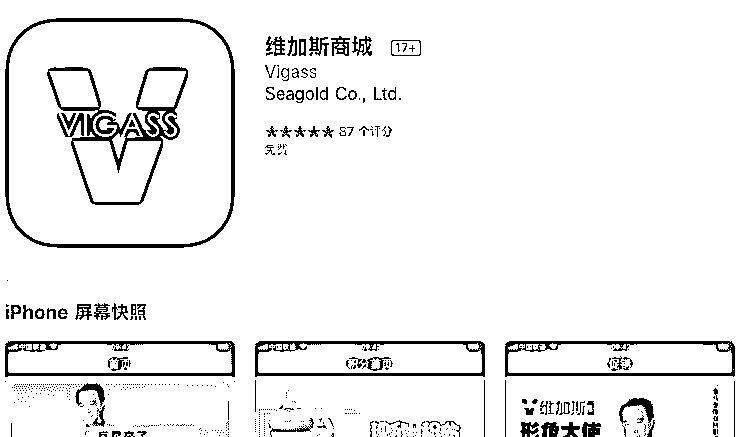（AppStore 苹果商店截图）

百度贴吧“维加斯商城吧”同样热闹。

自称总代理商的“谢强”正**发帖招下线**，他先是发了一个帖子：“维加斯商城到底是真的假的？是不是骗局？” 然后**自问自答**，图文并茂地夸了商城模式的创新，加盟的各种好处，还晒出了一个茶叶售卖商为商城颁发的“最佳合作伙伴”奖牌。

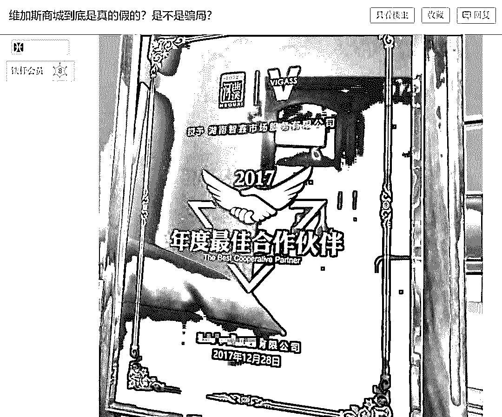

另一个帖子里，似乎有人质疑商城的合法性，谢强辩解道：

> “很多人都问我，维加斯商城不合法。那我想问你：商城给客户提供购物平台没错吧？客户购物以后，商城给到一次免费升级的机会，没错吧？
> 
> 好比在超市买东西，给你买满多少让您抽奖是一样的道理，没问题吧？”

逻辑三连，似乎无懈可击，我都忍不住要鼓掌了。

谢强在帖子里再次强调，**维加斯商城是多项国家政策支持，是政府扶持项，鼓励发展的合法电商项目。**

我搜了搜维加斯商城的总部公司的工商公示信息，的确是一家**合法注册的正规公司，注册资金 5000 万。**

我又搜了一下他们老板投资的其他公司，都是几百万上千万的公司，还有做钻石生意的，惹不起惹不起……

（天眼查结果截图）

到这一步，我的调查差点停止，我开始怀疑自己是否冤枉了这家公司，会不会他们真的是“娱乐购物”的创新模式，而我因为偏见错怪了他们？

**好在，我发现了新的线索。**

03 微商推广模式+诈骗话术

在维加斯商城客服“老 K“的微信朋友圈里，我发现了**典型的微商把戏**。

他的朋友圈除了豪车、洋房、嫩模就是商城流水记录。在一张截图里，客户“丁总”充值了 16100 元，在商城玩了 2 天就变了 34000 元，**资产短短几天内翻了一倍多。**

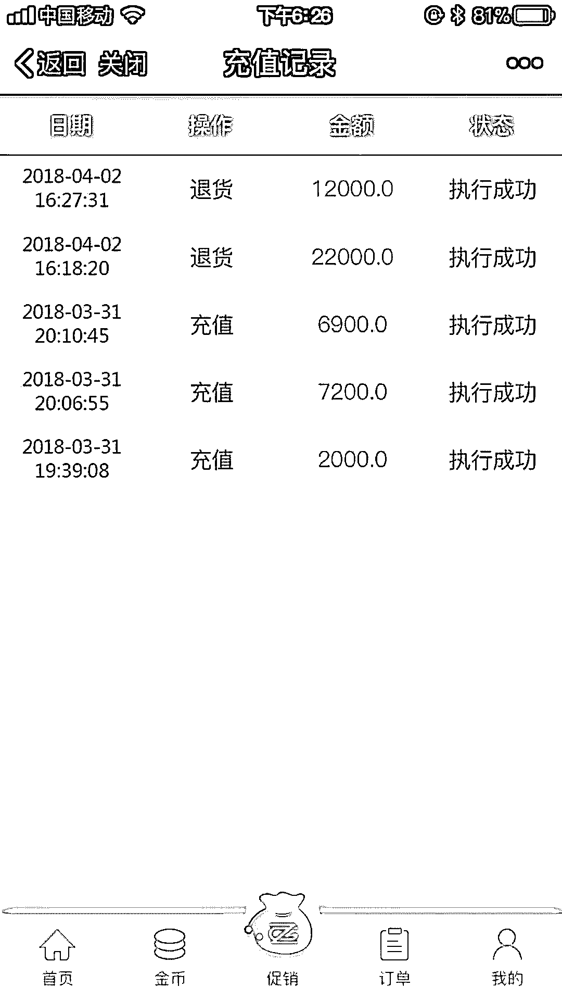（“恭贺丁总喜提三万四”）

作为一个见过不少套路的科技作者，我知道这截图不是真的，**但同时我也意识到，这种东西能骗过不少人，比如我父母、伯父姑姑这样生活在小城市，对互联网套路不甚了解的中年人，比如我那个刚毕业想赚得人生第一桶金的小表弟，再比如我那个当了 5 年兵光荣退伍，手里正揣着几万块钱血汗退伍费的初中同学……**

老 K 把我拉进一个微信群，有个群友正在分享赚钱心得，不亦乐乎：

> “接触维加斯商城已经①⑥①天了，目前已经赚了①10③000+元，感谢群主的分析建议！别问我每天为什么每天都赚钱，因为我又足够的本金再加上群主的分析能力，想不赚都难……”

我点开他的朋友圈，里面同样是大把钞票、精致酒店和漂亮小姐姐，看起来就跟真的似的。

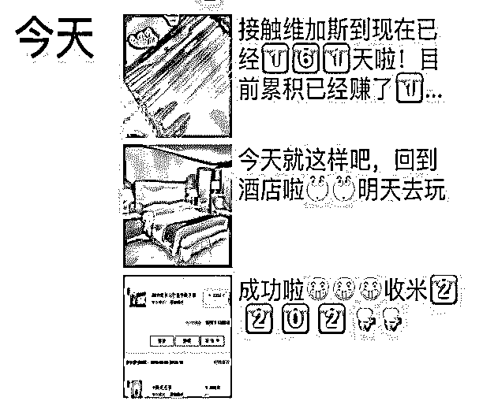

一番交涉后，老 K 神秘兮兮地告诉我：

> “我们有专门的 VIP 群，群主是研究时时彩很多年的专业老师，他会教你专业的投注方法，用科学的方法下注，成功率很高！**要不要了解一下？**”

不过他也说，**VIP 群不是你想进，想进就能进。想学到专业的投注策略，得先买够交易量。**

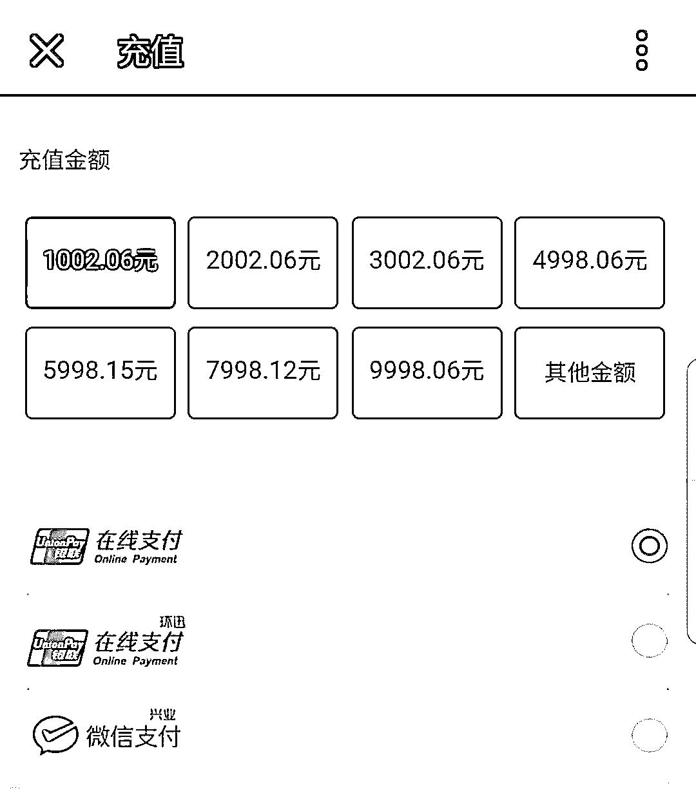（商城的充值界面很吓人，金额动辄近万）

一顿操作之后，我得到了所谓的**“必胜投注法”——倍投原理**，大致是这样：

买进一个商品，押大运（双数），输了就翻倍下注再买，输了就再翻倍下注，最后只要你赢一把，之前输的就都赢回来了。这样能确保稳赚不亏。

> “毕竟重庆时时彩的开奖号码尾数不可能一直是单数。只要出一次双数你就连本带利赢回来了。”

听起来似乎很有道理。 

老 K 说，商城专门为顾客设定了专属二维码，**一键注册成为经纪人，就可以自由发展属于自己的消费客户，系统每天自动返还佣金。**

也就是说，我不仅能自己赚钱，还能拉上同事、亲戚朋友以及浅黑科技的读者们一起来商城“发家致富”！

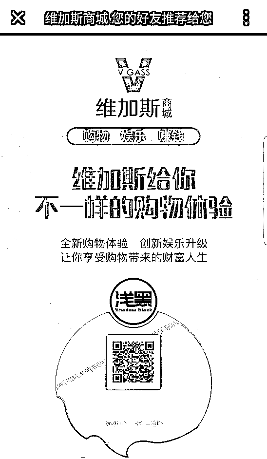（我也试着生成了一张二维码，感觉良好）

04  代理商日流水过万，受害者遍布全国

一不小心，我搞到一张代理商的流水数据统计图，显示 2 月 4 日**当天日流水达到 926592 元**，代理商抽取其中的 15%作为手续费，收入 135523 元。 

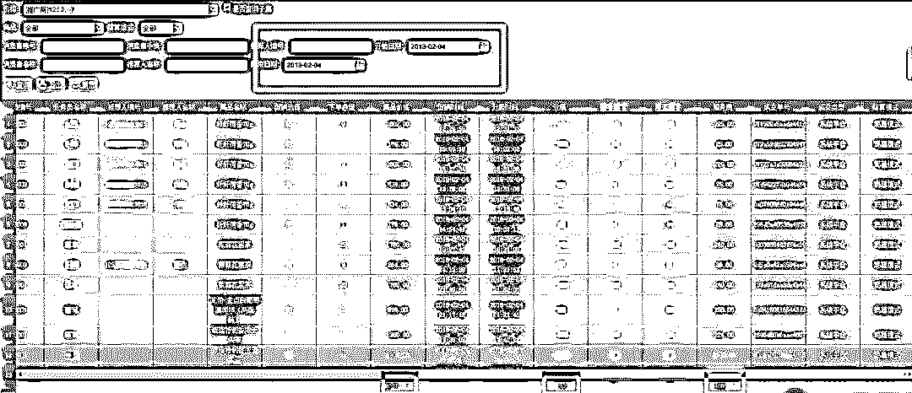（某个代理商的流水截图，点击可看大图）

这样的代理商有多少个？我不知道，但我发现了北京、天津、山东、湖南、广东、河南、福建等全国多个地区都有“火爆招商”的迹象。

我也不知道他们已经发展了多少层级，总规模做到多少，但我知道，请明星代言、制作和维护网站、公众号、APP，维系一个庞大的层级结构，四处发文宣传……这些都需要花很多钱。 

而羊毛出在羊身上。

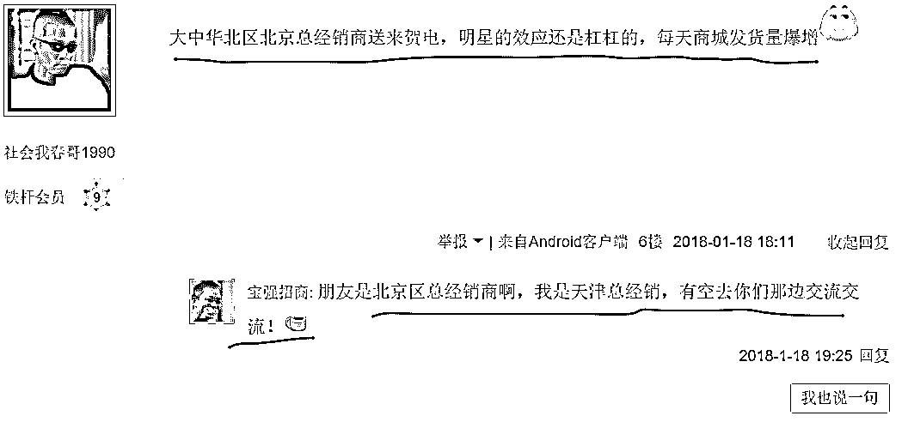

贴吧另一头，自称北京总代理商“春哥”和自称天津总代理商“宝强”正在愉快聊天，相互道喜。 

**我“一不小心”联系上了自称某地区总代理商的“刘世杰”，并取得了他的信任**。

他告诉我，提交身份证和银行卡就能成为个人代理商。但个人代理需要考核，**一个月内没有激活超过十个客户就会取消资格。**

> “手续费按照客户流水的 15%计算，一个月内客户交易手续费达到 1 万，你就能拿到手续费的 50%，否则只能拿到 30%。”
> 
> “你不用管客户输赢，只管让他刷更多流水就行。”

我问他一个月大概能赚多少？

他说，“这个得看客户群体了，做得好一个月赚两三万不难。”

按照这种计算方法**，如果一个代理商每月提成 2 万元，顾客至少需要在商城消费 26 万元，也就是忽悠别人把 26 万放进赌池。**

但是，想忽悠别人加入赌局并且奉上 26 万，并不是那么容易。

**于是我又从代理商那拿到了几份内部培训资料。**

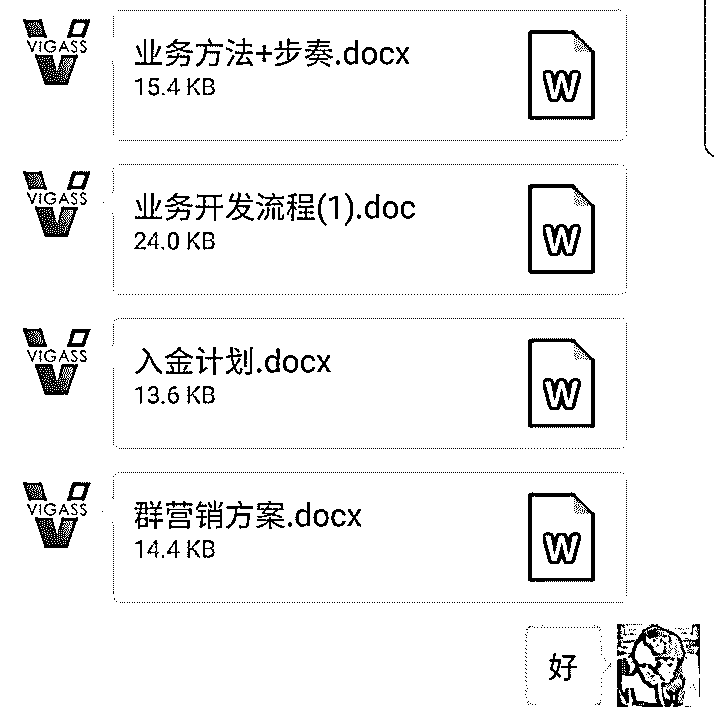

老实说，**我是全程张着嘴看完的**，里面写着详尽的忽悠话术，比如：

如何伪造一个热闹的微信群，营造出“不是你一个人在战斗”的假象；如何打造一个专业投资培训团队，手把手教客户投注技巧；甚至还为不同用户设计了不同的手法，里面有中年小老板、刚毕业的学生、普通上班族……

随便摘抄几段：

> “塑造自己的朋友圈，让客户知道我们做维加斯赚了很多钱，日子过得很好，不能只有盈利图，还得贴近生活，这样真实感才强，你可以……”
> 
> “群一定要真实，各种角色都要有，有赚了大钱的，有小亏之后寻找方法的，有精通下注的策略专家……要有互动……”
> 
> “切记：一定要抓住我以前输，现在赢很多的主旨来发展话术……”

资料很多，套路很深，但最终目的只有一个：**利用快速赚钱的刺激来吸引人们的注意力，让他们开始怀疑起自己每天朝九晚无公交地铁是不是像个傻 X。最终让他们在商城消费，刷流水。**

05  黑进后台，我看到了几亿流水 

本来事情揭露到这一步就算完结了，可是当我把这件事发到朋友圈，**一个嫉恶如仇的神秘黑客老师傅突然加了我微信，他要帮忙出手了！**

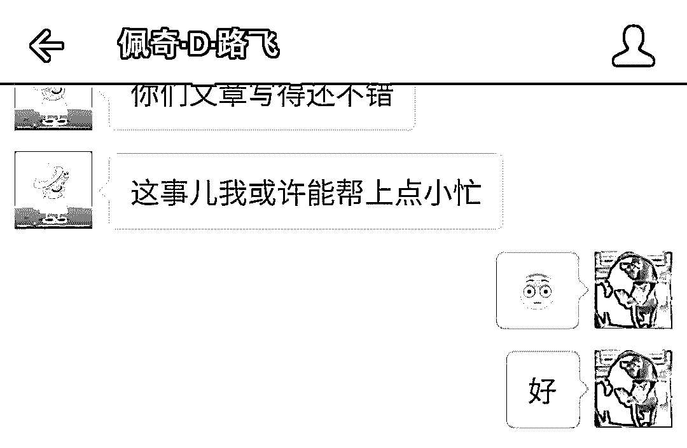

由于我之前已经以卧底身份取得代理商的信任，成功晋升为小小代理商后，对方给我开通了一个后台账号，**我把网址、账号密码都给了老师傅。**

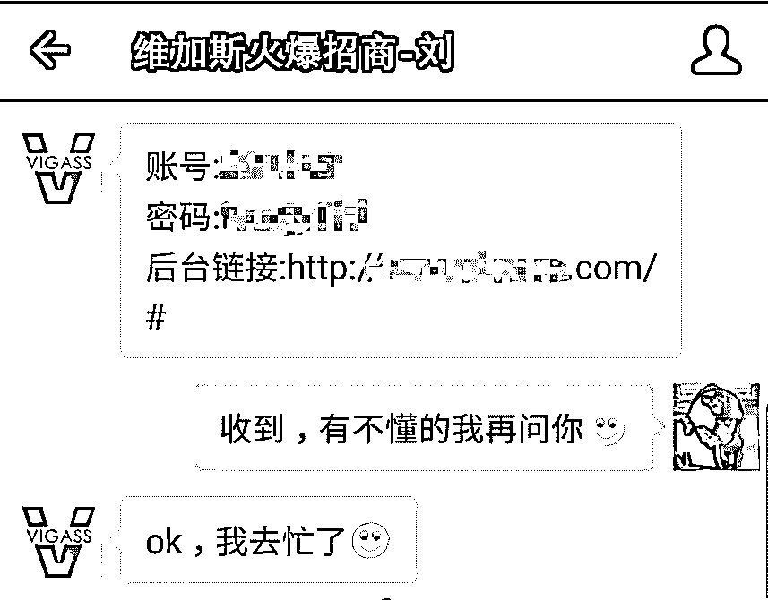

老师傅告诉我，他要动用一些**“计算机基础知识”**，抓包分析，并且利用账号规则对其他管理员账号进行爆破。

最后，他成功拿下几个管理员账号，其中一个账号显示账户资金已经多达 2.4 亿：

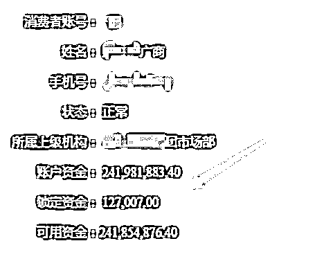

老师傅查询了一下这个账号 3 月份至 4 月份的流水记录，显示**该账号在一个月内的商品价格总值达到 108,627,086.00**，一亿多的流水，只用了一个月。这得让多少创业公司看得眼珠子都掉出来？

> “目前我看到的消费者数量不到**5 万**，推广商等权限较高的人员总共有不到**4 千**，分布在全国各地，而且每天人数都在增加。
> 
> 我看到的消费者资金总额最高的账户大概在**4 亿**左右，但具体数目和大概范围不能确定。”

给我发完截图并交代完大致情况，老师傅居然把我拉黑。神秘地来，神秘地走，不带走一丝云彩。

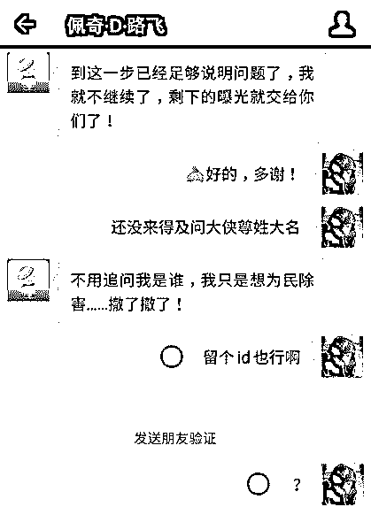

不过，在临走时，老师傅留给我一句话：

> 据我发现，目前这样的商城不止维加斯商城一家，还有很多！你慢慢查吧**。**

？？？？？？？？

我开始继续追查。

06 网络灰产也出现山寨版

不知道是不是这门生意太赚钱，**监管部门还没找上门，反倒是竞争对手嗅到着金钱的味道先来了**。

在百度搜索“维加斯商城”，排在第一位的是个粗制滥造的网页。**我按照上面的联系方式加了客服微信，被引导了另一个名叫“智谷享购”的商城。**

我恍然大悟，这是一种典型的利用搜索引擎特性的截流手法，俗称“黑帽 SEO”，**有黑产在截胡！**

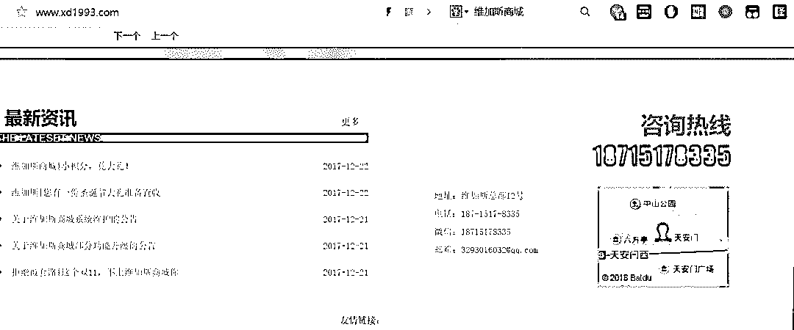（有多粗制滥造呢？地图显示维加斯商城总部地址在天安门城楼里）

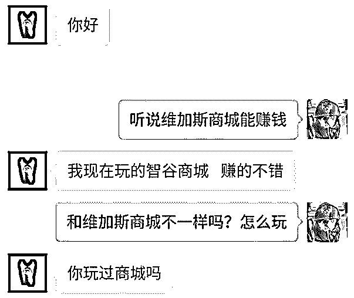（假冒的维加斯商城客服向我推荐了“智谷享购”）

我进去一看，发现这家**“智谷享购”商城和维加斯商城几乎是一模一样**，从宣传到网站样式都差不多：

香港老明星代言、十分钟净赚 XXX 元，正规品牌，国家政策扶持……**和隔壁维加斯商城不同的是，智谷享购请的是香港明星****许绍雄****。**

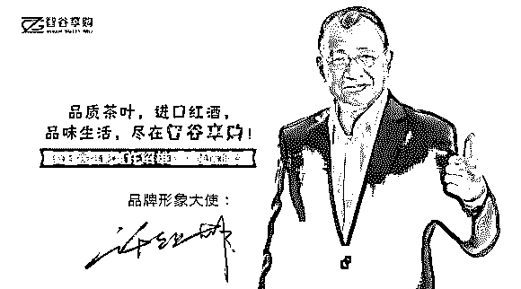

这个叫“智谷享购”的商城同样售卖茶叶、酒等高溢价产品，也有类似地下时时彩的竞猜活动，也有不少微信公众号，也在苹果商店和腾讯应用宝等应用市场上架了 APP。

循着线索，我继续查下去。**没过几分钟，我****又****发现了一个名叫****“醉江山商城”****的娱乐商城，**又是同样的明星代言策略，同样的发展下线代理商模式，同样的包装宣传手法……

再这么下去，香港老牌明星好像都不够用了……

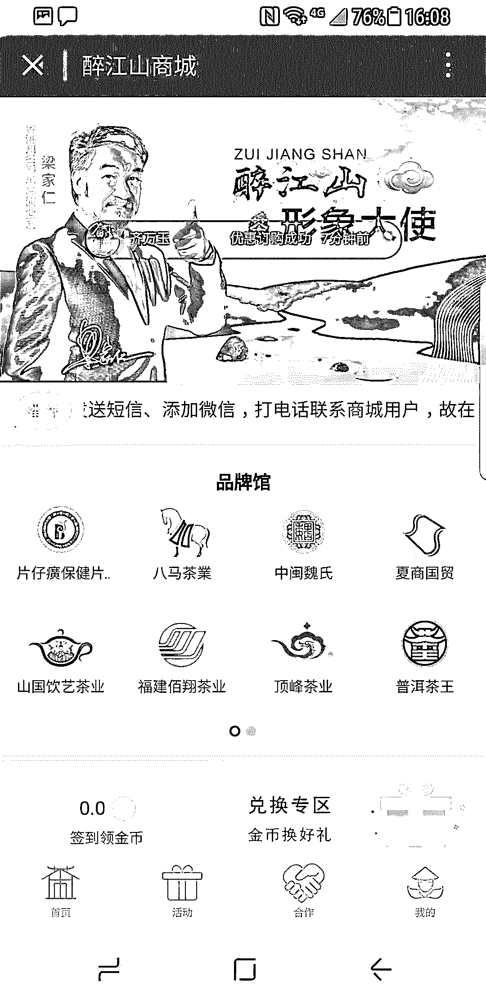（醉江山的代言人也是香港老牌明星梁家仁）

几分钟后……

**我****㕛****发现了一家叫****“和瑞易购商城”****的娱乐商城，**

**我叒发现了一家叫****“金樽闪购”****等多家类似的娱乐商城……**

**至此，我真的不敢再继续查下去了！**

我不知道这样的“”娱乐商城”还有多少个，但显然，如果没有丰厚的利润，维加斯商城又怎会出现如此多的仿冒者？

他们俨然已经形成一个庞大的“娱乐购物”经济体，甚至是一条完整的产业链，在全国疯狂榨取无数个家庭和个人的财产。 

**更可怕的的是，他们光明正大地出现在每一个地方，没有人指出来，监管部门也似乎尚未察觉。**

06 究竟算不算赌博？

调查期间，我一度陷入疑惑，这种“娱乐购物”究竟算不算赌博？

倘若有一天淘宝、京东之类的大型商城也引入这种模式：你在京东淘宝上买个东西，就送你一次抽奖，中奖即可返还双倍购物款，没中奖就当无事发生，该买什么还买什么。

这样也算是赌博吗？

我认为也算。

2015 年前后网上曾经风靡过一种名叫“一元购”的新型购物模式，玩法很简单，每个人出一元钱一起买一个商品，然后抽奖，谁抽中了商品归谁，就跟买彩票似的。

**这种模式诞生之初也被盛赞为“众筹购物”，能让大众花最少的钱去实现心中的宝马梦、iPhone 梦。**

后来，很多互联网巨头也利用这种模式做起了“庄家”（比如网易、陌陌、微博等），越来越多的人因为沉迷一元购而损失惨重，甚至倾家荡产。

终于在 2017 年，“一元购”被正式定性为赌博和诈骗。借这种模式敛财的企业才开始收敛。

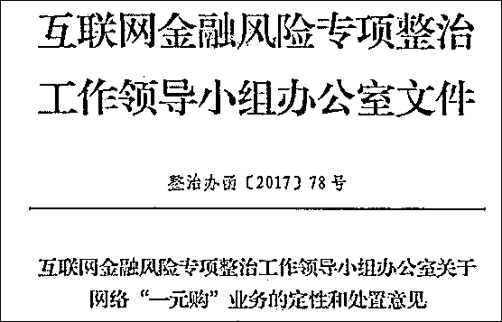

随着媒体揭露，人们才发现**最初做一元购的平台在 5 年里参与资金竟高达 247 亿元！**

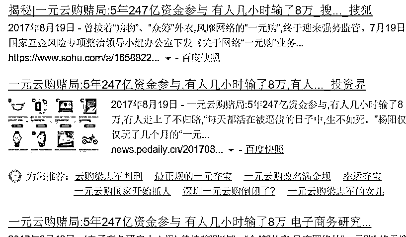（图片来源百度搜索结果）

类似的，淘宝网之前做过的“淘必中”项目也因为带有赌博性质而告终，有媒体曾爆料 13 位玩家累计充值超 400 万元，最终沦落至失去工作、四处举债甚至倾家荡产的地步。

我不知道维加斯商城这种模式是否会被定性为赌博，但是当我看到他们的招商广告里的那句：“微交易的时代已经过去，现在是微商城的天下”，**我感到后背发凉。**

**微商城的天下，该是怎样的天下？**

微博上曾有一篇揭露维加斯商城涉嫌赌博的文章，但目前已被删除，我不知道被删的原因。

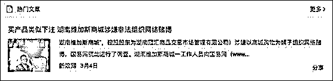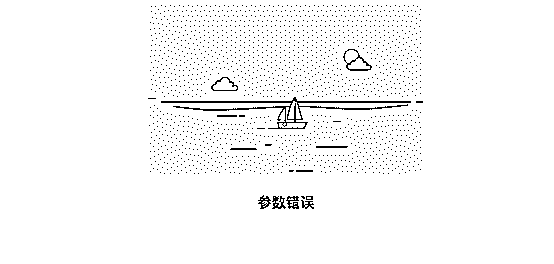

**同时，我也不知道这篇文章是否会被很快删除，但在这之前，**我希望更多的人看到真相。****

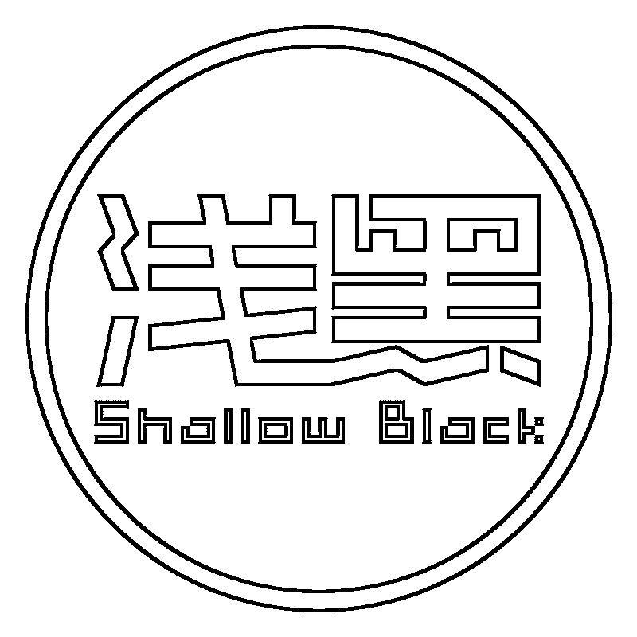

我们已委托第三方维权机构打击抄袭和违规转载，媒体转载本文请在公众号【浅黑科技】后台留言获授权，谨防误伤。个人转载无需授权。**爆料请直接后台留言。**