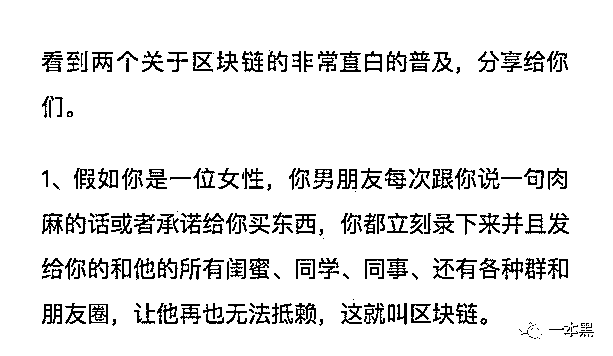
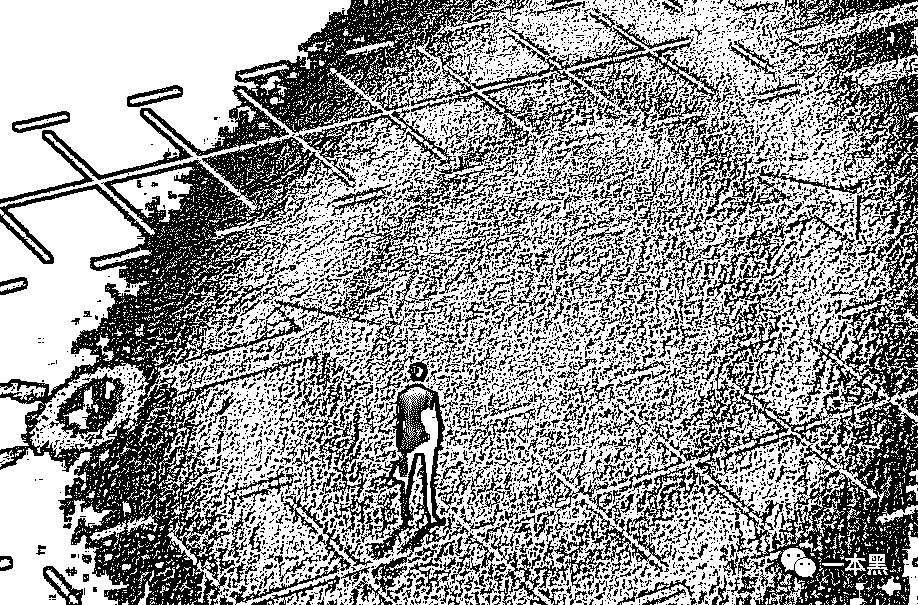

# 连区块链都不知道是什么，怪不得被同龄人抛弃

> 原文：[`mp.weixin.qq.com/s?__biz=MzU4ODAwNzUwMQ==&mid=2247484147&idx=1&sn=e265fde23705f1ec2254f5ec473165ea&chksm=fde213d1ca959ac73a06dfbd5c58aa6a1605b4202ba08834070a4520f2c18a7647d15185c68d&scene=27#wechat_redirect`](http://mp.weixin.qq.com/s?__biz=MzU4ODAwNzUwMQ==&mid=2247484147&idx=1&sn=e265fde23705f1ec2254f5ec473165ea&chksm=fde213d1ca959ac73a06dfbd5c58aa6a1605b4202ba08834070a4520f2c18a7647d15185c68d&scene=27#wechat_redirect)

导读

和早期互联网一样，现在也是一个天才、伟人、骗子混迹的时代。

**文|东东**

**责编|振宇**

前几天看到一个段子：“英国科学家最新研究发现，植物不但有感觉，甚至还有幻觉，譬如一些韭菜就认为自己是股民，是区块链参与者，是虚拟币受益者。”

**可以用区块链买充气娃娃？**

打个比方，我们日常生活的网购，选中商品下单后所支付的钱首先会打到第三方支付平台，卖家发货到买家确认收货以后，第三方支付平台才会把钱打到卖家账户。

这个购物的场景如果由区块链技术来做支撑则大有不同，这个时候买家和卖家可以直接交易，不需要任何第三方担保平台。

当买卖双方发生交易后，系统会以广播的形式发布他们之间的交易信息。收到这条信息的人在确认信息无误后会记录这笔交易，即收到信息的人为这次交易做了数据备份。

就好比李狗蛋在网上买了一个充气娃娃，系统就会拿着喇叭在村里大声的喊：“李狗蛋买了一个充气娃娃”。

“村里人”听到这条广播确认无误后就拿出小本本记下来，李狗蛋买了一个充气娃娃，在这里，记录的信息就好比是为这次交易做了数据备份。（在此，李狗蛋的交易信息是匿名的）

回到现在的网购，假如李狗蛋的订单出现了问题，支付宝系统故障无法记录这笔交易，那么李狗蛋的钱是不是就白给了。

而放到区块链上，假如订单出现了问题，因为前期系统拿着喇叭到处广播李狗蛋买了充气娃娃，所以无数的人记录下了这笔交易信息，就不会出现系统故障无法记录交易记录的情况。

即使卖家不承认有这笔交易想耍赖，无数记录了这笔交易的人就会出来反驳卖家撒谎，这样这笔交易记录将不受影响。（至于别人凭什么给你记录这笔交易信息，就牵扯到区块链中挖矿的问题，篇幅有限，找机会再聊。）

这里把交易记录从只有支付宝这个担保中心分散到无数人记录就可以理解为去中心化，即把这笔交易分布的记录在每个人身上，而这些记录被放到区块链上，可以把它理解为一个账本数据库。

按照目前还算规范的定义，区块链是一种去中心化的分布式账本数据库，采用密码学的方式保证现有数据不被篡改，采用共识算法对新增数据达成共识。

密码学和共识算法也很有意思，可应用的点也充满想象力，为了变篇幅过长这里暂不阐述，数据不被篡改就是。

即使你在这个区块链上“收买”了某个人，想把李狗蛋购买充气娃娃的事篡改成李狗蛋购买了一个不可描述的小杯杯，但理论上你是无法篡改所有人记录的信息。一定程度上能做到数据保护。

（说人话）如果还不够通俗，可以回顾一下我们曾经分享过的关于区块链的简单解释。



区块链的去中心化和传统中心化的方式不一样，因为它没有中心，或者可以说人人都是中心。

上图中记录男朋友承诺给你买东西，这条消息发送到朋友圈就是分布式账本数据，即每个人都会同步这些数据，而不是只有你自己知道这条消息。

**区块链有何优缺点：**

1、优点：数据匿名储存，保证数据不被篡改，对用户来说自身信息更安全。

2、缺点：效率比中心化的方式会低一些，可能会被利用到违法犯罪的场景中。

讲到区块链不得不提的是比特币，但很多人会说，比特币是区块链，但区块链并不是比特币。这就好比苹果是水果，但水果不是苹果是一个道理。

对于这个点我并不是很赞同，我认为**比特币是区块链技术的一个实际体现**这个说法会比前者更为准确。

其实不管是区块链也好，比特币也好，大家关心的更多是币本身，都关心哪个币更加赚钱，该怎么加入其中。

就像上面举到的购物的例子，同样是交易，运用到区块链上面，所有人都知道李狗蛋付了款，你耍赖不发货肯定是不行的，说白了区块链解决了一个信用的问题。

总的来说，区块链的愿景是好的，它想让世界变得美好，但在我看来，至少在当下，很多人打着让世界变美好的幌子大肆圈钱，完全把区块链的愿景抛在脑后，由此形成的区块链金融骗局、把韭菜割了一波又一波。懂得如何识别骗局，练就识别真假币的火眼金睛变得至关重要。

**区块链能给我们带来什么？意义何在？**

**1、隐私安全的意义**

时下的互联网已不是当初那个互联网，数据的多样性以及获取数据渠道的多元化，让个人隐私泄露的风险越来越高。

仅通过李狗蛋的一个身份证、一个手机号就可以查出他更多详细的个人信息，全家户籍、开房记录、出行记录、车辆记录......

从数据盗取、销售数据，再到利用这些数据进行违法犯罪活动的例子已经不少了。

目前来说，这已经形成了一条利用数据牟利的灰色产业链。从源头上来说，很多网站以及 APP 未经授权私自采集用户信息，除了以此做用户画像外，还被“内鬼”利用，游走法律边缘大肆买卖用户数据。

**传统的网络安全防护技术全然已经无法满足数据安全的问题**，那到底如何堵住这个数据泄漏的洞口呢？

我认为有一天区块链可以做到。

区块链技术就好比是一个大账本，里面记录了无数条数据。如果区块链能和互联网结合，只要把个人信息录入区块链，在这之后但凡涉及到个人信息的地方，都可以通过区块链来进行验证。

玩比特币的人都知道，比特币区块链上面的每一笔交易都是公开的，但其他人并不会知道某一笔交易具体是谁来完成的。

比如在区块链这个账本上，李狗蛋在张铁柱的网店里下单买了一份羞羞小视频，随后在线上向张铁柱支付了十个比特币。

因为在区块链这个账本上的每个组织或个人都有一个不同的代号，李狗蛋的代号是 A，张铁柱的代号是 B，仅通过代号是无法对应到具体对象的身份的。

所以外人并不会知道他俩是谁，他们彼此也不会知道对方的真实身份，这种方式在一定程度上保护了个人隐私。

但是有一天，网络突然开始打击传播淫秽色情视频，李狗蛋在空虚的夜晚想要释放自己，不得已和张铁柱约好线下见面通过 U 盘的方式传递小视频。

这时候他们在线下进行了实物交易并对接了暗号，李狗蛋环顾四周悄悄地说：“我是代号是 A，要一份欧美小视频。”

紧接着张铁柱扔下手中的香烟，从口袋里拿出存有小视频的 U 盘说：“我是代号 B，这里面有你要的小视频，嘿嘿。”

就这样，这次的交易把他们之间的代号和具体的人关联在了一起，区块链也完整地记录了这次交易流水，张铁柱不仅知道了李狗蛋爱看羞羞小视频，其他人也很轻松的获取到了李狗蛋的所有信息。

因此这种匿名性也就不复存在了，所以这种简单的化名机制不能完全的保证用户的隐私。

那这个问题怎么解决呢？其实，区块链还有一种机制就是允许任何人具有无穷多个代号，这些代号只有自己知道。

就算李狗蛋的代号 A 被张铁柱认出了，也不会影响他其他代号的匿名性。他的每一次交易可以只使用一个独立的代号，这样就比较安全。

这就好比电信诈骗犯每打电话诈骗成功一个人就把手机丟了一样，区块链用这种方式一定程度上实现了用户信息的匿名，对于像李狗蛋购买羞羞视频这种交易数据的场景是有很用的。

实然，这种匿名性是有利有弊的，从保护个人隐私的层面上来说非常重要，但同时也为一些犯罪行为提供了保护伞。

在 2017 年，有人做了一个应用，把各种名画上的露胸部分截图存到以太坊链上，说用这种方式来提醒人们，区块链的不可篡改是把双刃剑，如果有人把不适合的东西放上去，是没办法消灭的。

由此看来，区块链在某些地方还存在些许的不完善。他是否会像传统互联网一样有利有弊，我们只能拭目以待。

**2、信用的问题**

我始终相信区块链能让世界变得美好，归根到底，它这么火爆的原因就是解决了一个互联网还没有完全解决的问题，这个问题就是如何在陌生网络环境下建立彼此的信任。

当下互联网的信任一般都建立在第三方中心化机构，比如上面说到网购一件商品，支付宝就是第三方中心化机构。

但是这种中心化的机制存在一定的风险，举个浮夸的例子，如果哪天支付宝卷钱跑路或系统出现故障，交易数据全部被销毁，难道用户只能吃哑巴亏吗？

但对区块链来说就可以解决这种问题，比特币是人类第一次在没有任何第三方机构参与的情况下，完成双方互相信任的交易行为。

区块链可以让信用更直接的和货币关联在一起，试想一下，如果现实中的国家也发布了主权级别的加密数字货币，那么信用几乎就无限等同于货币了。

它满足了陌生环境中的交易，特别是在对方交易中经常使用到的支付、结算等需求。他不再依赖传统第三方中心化机构即可达到交易目的。

当今的互联网和社会都存在着深刻的信任危机，信任机制不完善是毋庸置疑的，不管是因为信息泄露带来的诈骗还是交易需求，无不在有损大众的利益。

所以传统互联网急需一个能改变信用体系效率的东西，而区块链技术的防伪、防篡改特性正是解决信用效率的首选，它能在陌生环境建立一套更完善的信任机制，我认为它是重建整个互联网信用最大的希望。

区块链现在的业务模型很大程度上来说是我们过去没有见过的。

就像互联网发展早期，人们可以想象在互联网上购物，但是很难想象到今天可以随意用手机上网和支付。

一个好的概念或商业机会在刚产生的时候去布局必然是最好的，就像当初的淘宝，现在的滴滴，别人都把这个事做成了，市场的半壁江山都占完了，你现在再去做能好做吗？

当初互联网还没有很普及的时候，马云在做电商，别人都认为他是骗子，终归到底是项目还没落地成真，等这个事情真的做成了，现在谁还会说马云是骗子。

也许现在的有些项目是伪需求，是假大空，但区块链会不会是下一个互联网？真的不好说。

和早期互联网一样，现在也是一个天才、伟人、骗子混迹的时代。

还原事实｜专扒黑产

微信 ID：darkinsider

知乎 一本黑

头条 一本黑

投稿、爆料请点击菜单【爆料入口】

招聘、转载请点击菜单【联系我们】