# 搭讪学变约炮学，一年睡 400 个女生，猪精男孩成功逆袭？

> 原文：[`mp.weixin.qq.com/s?__biz=MzU4ODAwNzUwMQ==&mid=2247484116&idx=1&sn=3f31f8898daca79ab67d816e3240ed6d&chksm=fde213f6ca959ae06182f6761802c8c9aada6e0f034b8d78eee5a6305916caeaae4d1a9170b4&scene=27#wechat_redirect`](http://mp.weixin.qq.com/s?__biz=MzU4ODAwNzUwMQ==&mid=2247484116&idx=1&sn=3f31f8898daca79ab67d816e3240ed6d&chksm=fde213f6ca959ae06182f6761802c8c9aada6e0f034b8d78eee5a6305916caeaae4d1a9170b4&scene=27#wechat_redirect)

文/小白（微信公众号：一本黑）

责编/振宇

【一本黑】媒体或商业转载必须获得授权，个人转发朋友圈无需授权。

读完需要

7 分钟

速读仅需 5 分钟

* * *

从微博爆出睡过 400 个女生、同时跟 17 个女性交往的“猪精导师”视频，到浪迹教育被共青团点名、创立者入狱，PUA 这个群体开始被大众认识，并且评价极低。

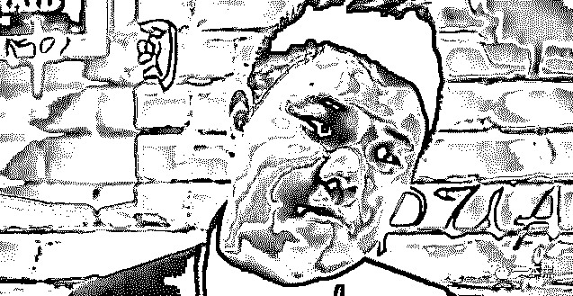

PUA(Pick-up Artist ) 直译是搭讪艺术家，原本是为了帮助不善与人交流的男生提升情商，更好地认识女生并且发展恋情。但男生们的想法总是不够单纯，慢慢地 PUA 出现了不同流派，而目的也从发展关系向迅速发生关系演变。

谜男应该是国内的 PUA 们最熟悉的“导师”，他利用自己的一套理论，带着一群弟子“实地演练”搭讪妹子的技巧，让弟子们可以在听完理论后亲自上阵“试验”学习成果，甚至还以此开设了一档节目。

他创造的谜男方法以及实战教学也是国内 PUA 导师们最常用的方式。简单说来，他是众多 PUA 心中的偶像，也是国内早期 PUA 的启蒙。

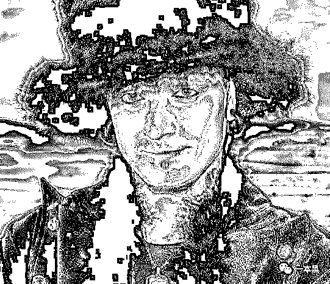

******从搭讪到骗炮****** 

******偏离原意的 PUA******

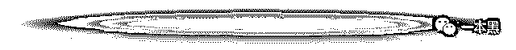

PUA 进入中国后，发展一直很偏，从一开始宣传的“教你把妹”，到后来的“教你迅速推到女生”，核心内容已经从约会、恋爱迅速变成了约炮甚至骗炮。 

而 PUA 早期学习者也在观看了国外各流派“导师”们的书籍、节目、理论后开始进行搭讪尝试，之后更是发现商机，自己开班授课，成为“导师”，以此获利。

以坏男孩学院里的各派导师和与坏男孩闹掰独立门户的浪迹教育为首的国内 PUA 教学机构也开始发展成长起来，除了传授把妹技巧外，他们也进行着更多方面的商业尝试。

线上课程、线下训练营、甚至一对一指导，如何快速获利也成为了这些机构最主要的探索方向。“导师们”会进行公开课教学，可能是一次语音课，可能是一次完整地从搭讪到推到的过程解析文章，而最终目的是吸引足够多的人听课并购买尽可能贵的课程。

（PUA 有自己的一套专业术语，本文中的推到在 PUA 中写作“TD”，意味和女生上床。）

他们甚至会把女生分类，直白地告诉你哪一类女生比较“浪”，可以直接上手；哪一类女生更好骗，可以成为你的欺骗目标。学员之间会有交流群，内容通常是互相鼓励以及“战绩”炫耀。

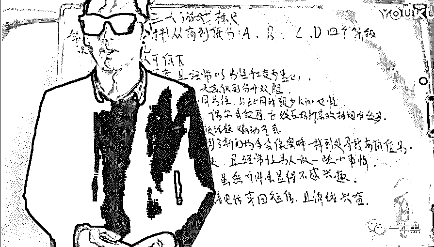

******亲身测试****** 

******这些机构究竟在做什么******

为了弄清楚更详细的流程，我们进入了 PUA 教学机构坏男孩学院官网，在里面挑了一节名为“”的公开课进行试听，同时添加讲课导师的微信。

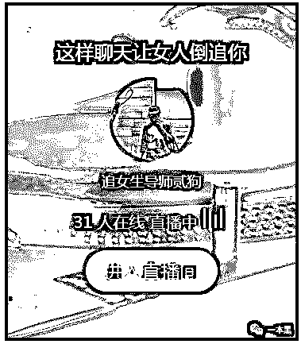

在微信中，我们扮演了一个 21 岁刚毕业的职场新人，对公司女神产生好感但是不了解如何接触，导师表示打字不方便，需要语音详聊。

开启语音聊过几句之后，导师直击痛点，表示“你追不到女生是因为你对自己认知不清，你知道现在你需要做什么吗？需要报课”。之后半小时的聊天在老师对我的打压、对学员学习后的成果吹捧以及课程推销中度过。

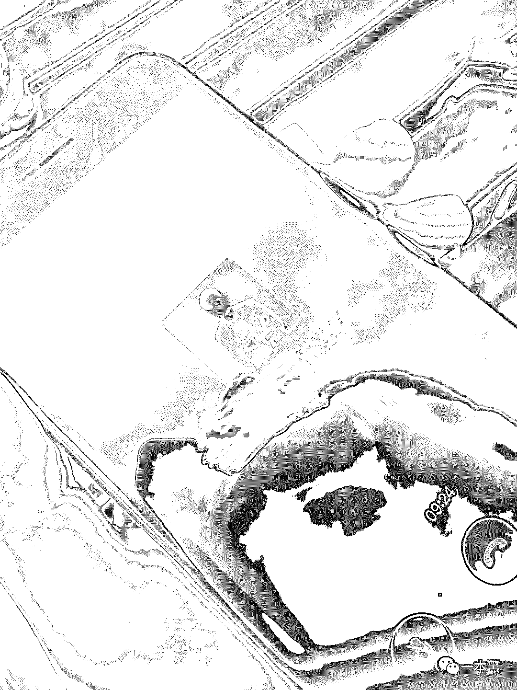

这其中，线下课程比线上课程价格更高，需要飞去导师所在地进行实地听课及训练，不同的导师会负责不同的课程，课程内容包括自我认知、搭讪技巧和实地训练等等。

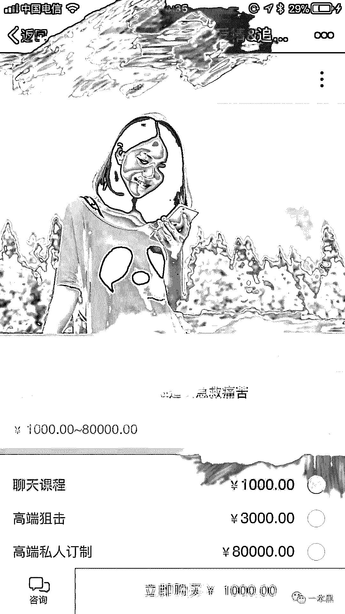

同时在报课后还能加入内部群，在群内交流进展成果，导师还能帮聊。一句一句教你如何与妹子聊天以达到约会的目的，在约会过程中导师会全程在线指导你说的每一句话以及每一个动作，而最终目的是“与妹子做点儿什么”。

在 PUA 导师的口中，跟妹子约会、花费时间金钱后总得“做些什么”，不然属于浪费。所谓“搭讪技巧”也不过是如何快速与女生建立短期的关系，目的明确，对长期的恋爱没有太大帮助。

为了加强我们的报课需求，导师给了我们一些学员的对话截图，同时告诉我们有学员在进行学习后第一个月已经跟 4、5 个女生发生了关系。

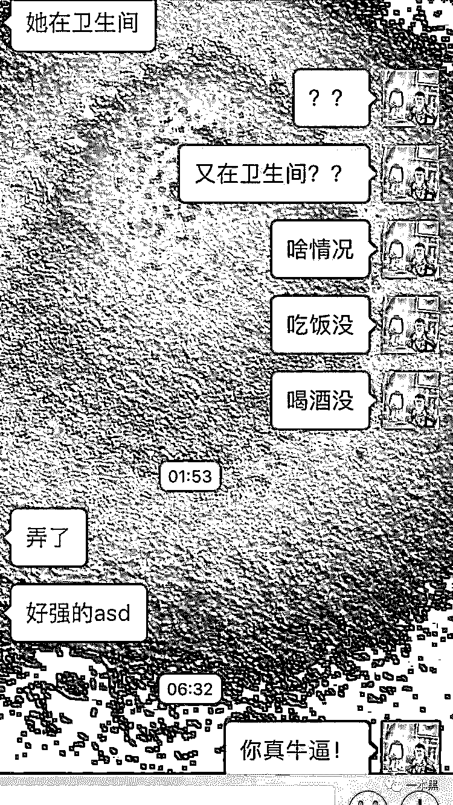

（图中所说的“ASD” 是 PUA 圈内术语之一，指女性为避免让人感觉“淫荡”或“过于容易得手”而经历的一种有意识或无意识的过程，PUA 认为这种抵抗比较不利于推到，但一般是象征性的。）

这样的服务是全套的，报名线下课程后，你能得到的还有所谓“逼格照”的拍摄，包括选择一些“高端场景”进行拍摄及修图，在朋友圈中发布，“提升自己的形象”。

而没有报线下课程也没关系，导师们的朋友圈中会有各种“逼格照”的赠送和文案指导。

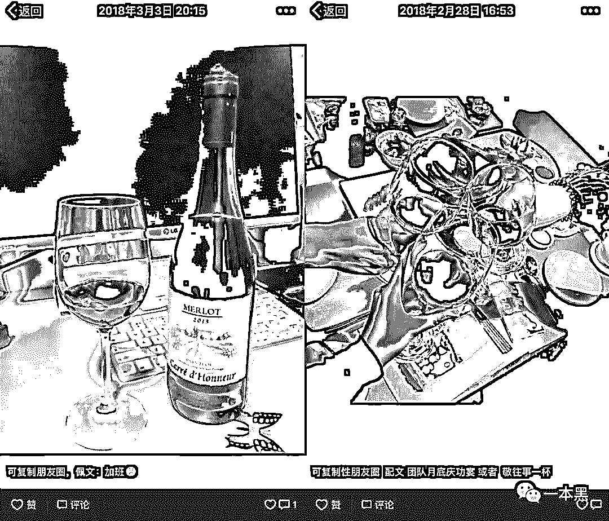

******从授课、演练到自我包装****** 

******PUA 的短期关系发展学******

PUA 教学有一套非常完整的流程，先以公开课吸引学员，然后进行线上课程，重点推介的是更贵的线下课程。

报名线下课程的学员们会去到导师所在的城市，听完导师讲的理论知识后会迅速进行实战。

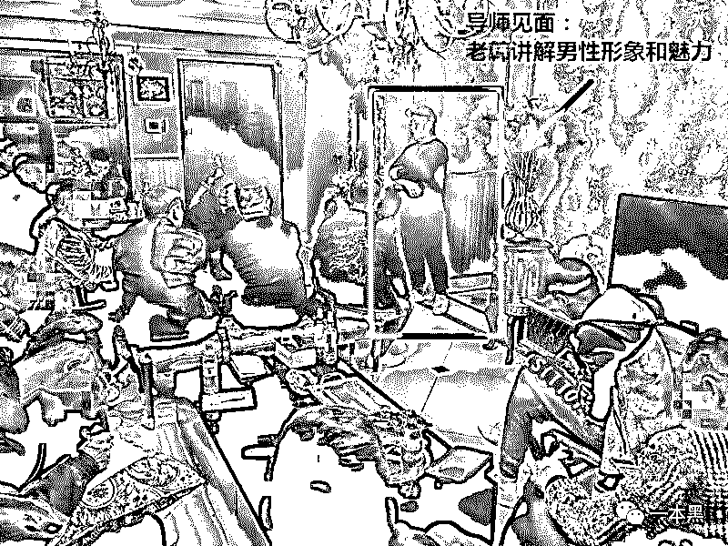

实战课从街头搭讪女生要号码到夜店实地接触，并且事后写下过程回顾与总结，分析成功或失败的原因。而最终判定你是否合格的方式是你与多少女生上了床。

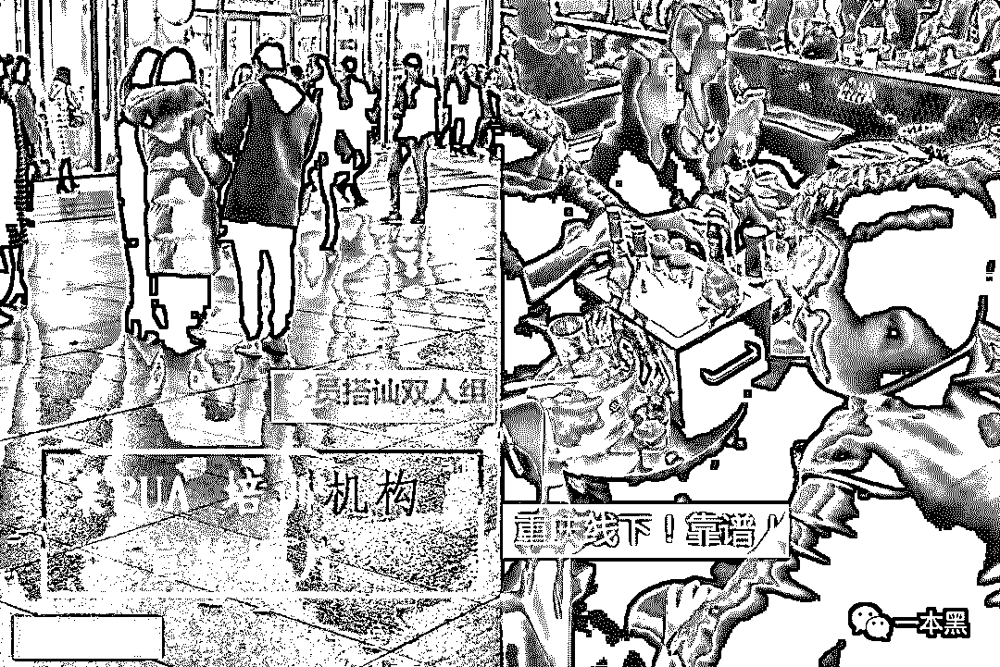

******为学习 PUA 缴纳的智商税******

这样的授课受害者通常不仅仅是被骗的女生，还有报名的学员。

以 PUA 教育机构浪迹为例，浪迹在早期开过一些“导师培训班”，承诺学习之后工作包分配。除了可以学到把妹技巧，还能留在机构成为导师，开上小跑车、灯红酒绿，左拥右抱，走上人生的巅峰。

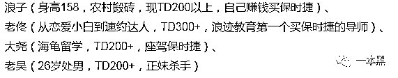

而事实上，最终并不是每一个付费学员都能成为导师，他们中的大部分会因为不合格被分配去做课程销售，每卖出 5000 元提成 200 元，且无底薪。

几个不合格的学员因为不满找媒体曝光，被曝光之后浪迹发了一篇声明，表示举报的学员在学习期间确实有进步，推到了一两个女生，但是远远达不到成为导师的要求，同时贴出合格学员的战绩。

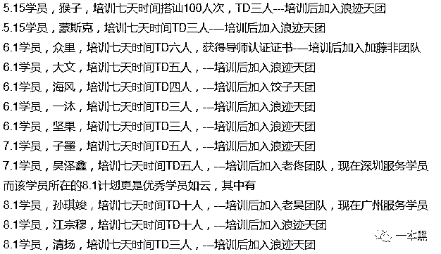

除了浪迹，另一个知名 PUA 导师在被曝光与他的学员一起骗女生上床，甚至学员中还有艾滋病人报复社会后也发表了一篇声明。这篇声明除了否认学员有艾滋病人外没有对任何其它的质疑进行正面回应，甚至说话前后矛盾。

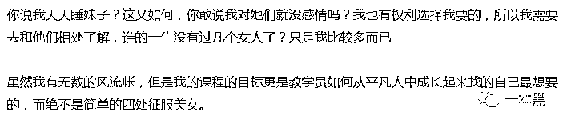

强行辩解自己和学员没有玩弄女生，却解释不了流出的群对话的内容。

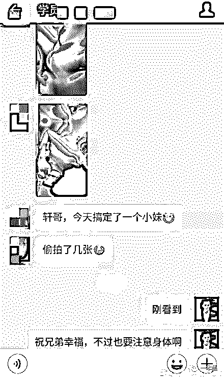

导师们的公关能力如此差劲，课程视频中的表达和气质也实在谈不上优良，要谈情商实在谈不上，却依然能让众多男生前赴后继，只能说是需求造就市场，同时蒙蔽需求者的双眼。

写在最后

翻看 PUA 导师们的视频及课程海报，满满地城乡结合部气息扑面而来，走在路上你甚至很难想象这样的人是圈内备受追捧的“把妹达人”，而他们之所以成功是因为下手目标明确。

包装自己的朋友圈，利用一些聊天与接触的技巧，以来自小城市的姑娘和涉世未深的女大学生为目标，让对方以为是发展长期关系而上床，贬低对方的自我认知，抬高自己，达到“驯化”的目的。

他们会在群内分享欺骗经验，甚至床照，以此炫耀，得到群内其它成员的赞赏。除了被爆出的“艾滋病人报复”事件外，还有以女生为其自杀作为炫耀资本的案例。

**而这也是他们被主流社会诟病的原因。**

PUA 的存在本意是帮助不善交际的男生学会交流，却在不知不觉间越走越偏。而在这一系列的过程中，PUA 们也渐渐迷失，生活的目的变成推倒各路女生，除了忘记交往的本意，也忘记了生活的本意。

还原事实｜专扒黑产

微信 ID：darkinsider