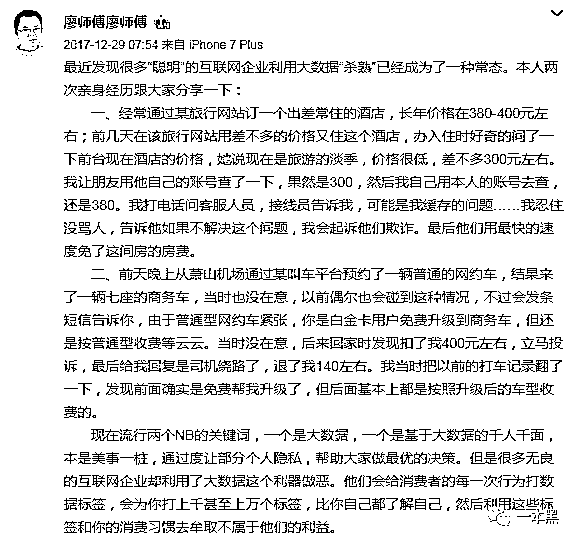
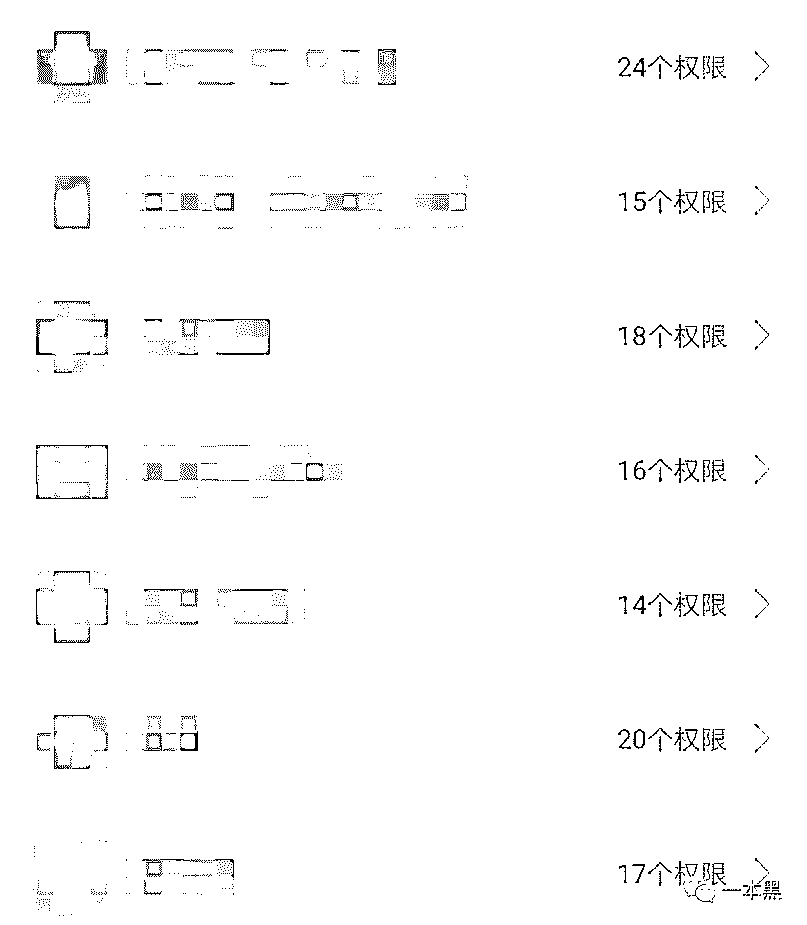
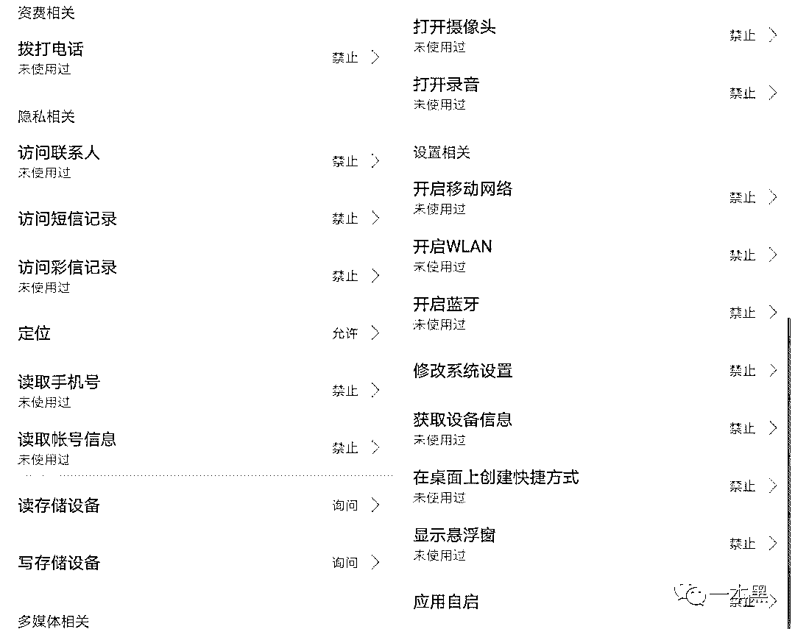
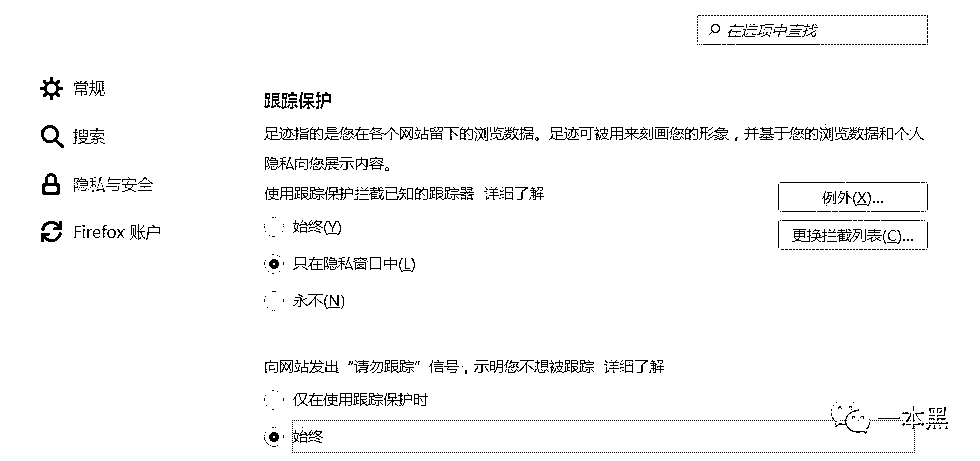
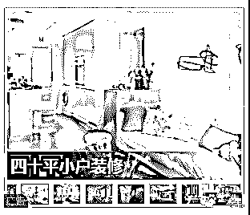
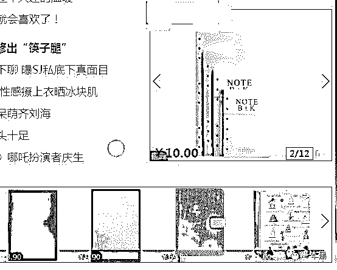
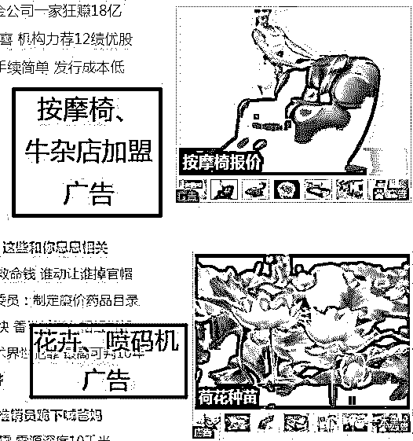
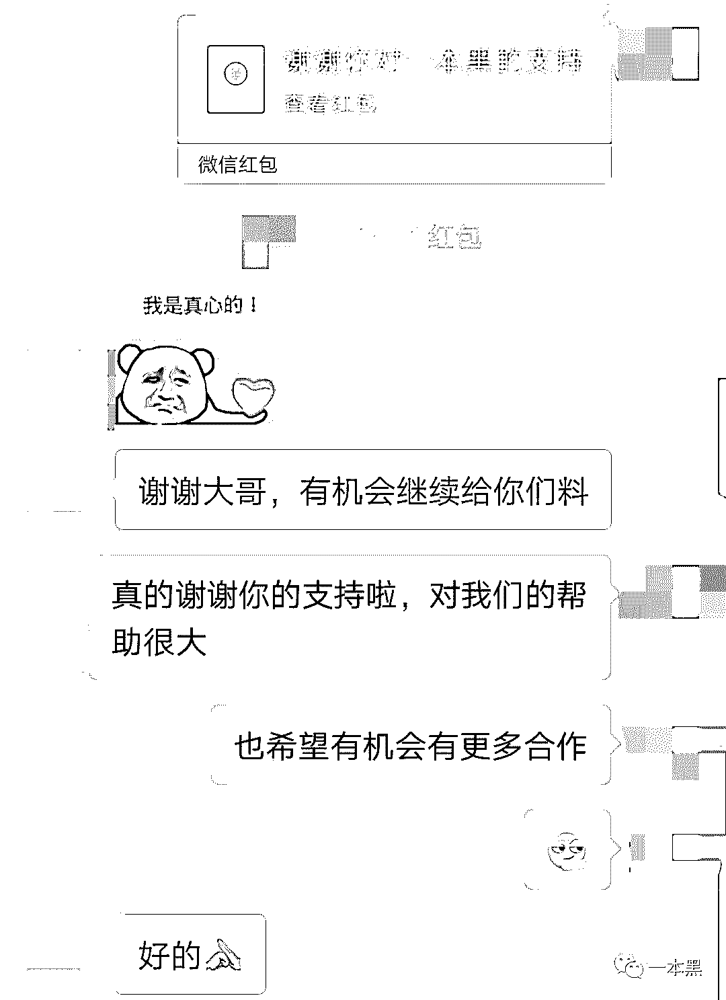

# 相同商品不同价格？身处网络不止裸奔，还待宰

> 原文：[`mp.weixin.qq.com/s?__biz=MzU4ODAwNzUwMQ==&mid=2247484113&idx=1&sn=1d88d50b456b880a31881d2ef7565850&chksm=fde213f3ca959ae56f2e97e7420d443bfbf863cbfb73ea75b96d03ef72edd2424783a53ce390&scene=27#wechat_redirect`](http://mp.weixin.qq.com/s?__biz=MzU4ODAwNzUwMQ==&mid=2247484113&idx=1&sn=1d88d50b456b880a31881d2ef7565850&chksm=fde213f3ca959ae56f2e97e7420d443bfbf863cbfb73ea75b96d03ef72edd2424783a53ce390&scene=27#wechat_redirect)

文/小白（微信公众号：一本黑）

责编/振宇

【一本黑】媒体或商业转载必须获得授权，个人转发朋友圈无需授权。

读完需要

7 分钟

速读仅需 4 分钟

* * *

2013 年被称为大数据元年，之后“大数据”这个词钻进了各行各业各个角落，甚至去街边买个煎饼，摊煎饼的大妈也能头头是道地给你分析她的“大数据营销学”。

杂而乱，是在大数据这个概念被广泛推开之后产生的现象，很多时候张口就是“大数据”的人自己都不清楚所谓“大数据”到底是什么。

而去年的“百度监听事件”到今年被广泛讨论的“大数据杀熟行为”则成为了转折点，如何在大数据下保护自己的隐私，成为了新的话题，大数据下，人人自危。

“大数据杀熟”被广泛讨论源于微博网友的一条动态，300 元的酒店房间，因为他是熟客，需求比较大，因此推送给他 380 元。

事件一出，一片哗然，那么 app 和网站真的那么强可以随意得到你的信息吗？这一切源于他们暗藏在隐私协议里的不平等条款，使得用户处于默认同意交出隐私的状态。

****App 里的权限秘密****

**智能手机流行的今天，手机里随意几十个 App 是基础，而这些软件要求的权限也越来越多，**同一款软件在安卓请求的权限平均比苹果多 3~4 倍**。**

**安卓权限大全中共有 120 种左右的权限，常用软件要求的权限动辄二十多个，占了所有权限的 1/6，这些权限真的是必要的吗？**

****

**以某款打分软件为例，在苹果请求的权限是**5**个，关于隐私的权限只有“位置”，而在安卓，它要求的权限多达**19**个。**

**除了可以被理解的“发送短信”和“拨打电话”外，还包括涉及隐私的“访问联系人、短信、通话记录”等，一个点评软件真的需要用到这些权限吗？**

**我们试着将所有权限禁止，只保留定位权限，之后打开软件试用，除了点评时不能访问相册外，其它所有功能使用正常，包括拨打商家电话和点评时拍摄照片上传。**

****

**最开始，一个软件向你请求权限，通常是为了保障其正常运行，而这种请求渐渐变成一种入侵。对正规厂商而言，这种入侵的目的不在于你的隐私，在于你使用中产生的“数据”。**

******厂商收集数据的原因******

******用户画像：**掌握的数据越多，得到的用户画像越全面精准，更方便以后的营销活动。实时监控用户行为，了解产品用户群及喜好、及时作出相关调整，观看调整后结果。****

******为日后的其它产品打下基础：**许多软件要求一些目前并不需要的权限，可能是为软件以后的更新做准备，也可能是为以后开发新产品备用。可这样的“以防万一”很多都是冗余的。****

******为关联的其它产品索要数据：**关联产品可以是同公司旗下的产品，也可以是合作方。作为一种资源共享的方式，给对方相应的数据后，也可以获取自己需要的数据。****

****厂商获得更多改善产品的内容，使用者因为产品获得更便捷的生活。故事原本应该这么讲，可由于厂商的趋利性和过分的贪婪，获取的数据往往不仅仅用于改善产品和用户体验。****

******在隐私协议中设陷阱，在用户不知情的情况下交换数据，用户的隐私在不知不觉中已经成为了一种另类的商品。******

****而这些，也是让“大数据杀熟”泛滥的原因——利用用户的使用习惯和信息不对等，推什么用户都得接受。****

****同样的关于“隐私泄露”的问题，也出现在 Web 上。****

********Web 隐私泄露防不胜防********

******App 不安全，那么网页总会安全一些吧？毕竟它有“Do Not Track 请勿跟踪”选项。但事实跟你们想的完全相反。******

******“Do Not Track 请勿跟踪”是一项隐私保护协议，许多人在开启之后会安下心来，觉得隐私终于被保留了，而事实上 DNT （Do Not Track 请勿跟踪协议简称）协议能带给你的帮助很少。******

******它并不是一个带有强制作用的技术协议，只是一个带有商量意味的请求，当你在支持该协议的浏览器上勾选 DNT 后，**它能做的只是帮助你通知接下来访问的所有第三方“我不希望被追踪”，至于对方是否尊重你的选择完全靠自觉**，而国内大部分网站是没有这个自觉的。******

****简单点说，你能做的只有在支持协议的浏览器上勾选 DNT ——开始访问各种第三方——向上天祈祷他们能尊重你的选择。****

****从搜索引擎到任何第三方网站，甚至输入法，每一个环节都有可能造成你隐私的泄露。为了证明 DNT 的有效性，我们又做了一个简单的小实验。****

****首先打开火狐浏览器，勾选 DNT 选项（选择火狐是因为小白平时极少使用，对实验比较公平）。****

********

****之后打开某个广告非常多的新闻网站，确定当前广告推送状态（在搜索之前这个网站推送的广告大多是家装广告）。****

********

****然后打开某两款搜索引擎，尝试搜索平时比较少搜索的关键词。一款搜索按摩、牛杂、本子等关键词，另一款搜索盆栽、喷码机等关键词，搜索结束后随机点击网页制造痕迹。****

****搜索本子的时候我们重点点击了某购物网站的页面，反馈结果很迅速，一个小时内该购物网站的广告投放展示立刻全部变成了本子。****

********

****而其它关键词没有任何广告反馈，大家似乎都遵守了 DNT 协议？我们感到很欣慰，大家终于开始重视用户的选择了。然而......延迟半天左右，我们收到了某广告联盟的相关广告推送。****

********

****用广告联盟举例子，只是为了让隐私泄露这件事更具象，在能看见的情况下让你了解一个人的隐私能泄露得多彻底和迅速。****

****而在看不到的地方，你的每一个行为都被实时记录和传输。在信息保护得力的情况下，大家自然不必担心，但越来越多的事实都在发出提醒，我们的信息并没有那么安全。****

******数据是没有对错的，它只是忠实地记录了你的行为**；得到这些数据的厂商最开始也是没有错的，为了生存他们必须赢过对手，需要靠数据优化产品，尽可能多地获取用户。****

******最终造成矛盾的，是被部分厂商遗忘的初心。******

****从各种公司营销所需的“用户画像”到 X 宝“千人千面”，都是借助大数据的帮助完成的。而过程中涉及的用户隐私保护，全靠使用者自觉。也因此隐私保护在当下所面临的环境是十分严峻的，一次搜索，一次网页点击，或者一次输入法输入，任何一个动作都可能造成你的隐私泄露。****

****打车软件靠数据给用户画像，同时段同地点同目的地给出不一样的价格；****

****购物软件靠数据了解客户，同样的时间同样的商品显示的价格高低不一；****

****旅行软件靠数据给顾客分类，一样的房间一样的机票高出一大截；****

****......****

******这些是数据的锅吗？******

****我们由衷地感谢为我们提供便捷生活的所有厂商，它们背后是无数人的努力，前提是得到数据的同时也懂得保护好它们，给每一个用户画像之后能给到相应的尊重。****

******希望有一天，我们上网不必一手比价软件、一手模糊使用痕迹软件。******

* * *

******振宇的脑洞时间**********大数据继续发展，完全覆盖生活后的未来某天：********你打开电脑，看见大数据给你推送的“最适合你的新闻”，听着大数据认为的“你最喜欢的歌”，电脑旁放着刚邮到的大数据计算的“你最喜欢的零食”，跟大数据推荐的“你可能喜欢的好友”聊天，一起交流关于最新事件的看法，你们惊讶于双方的合拍程度，甚至约好下次一起晚饭。外面的阳光刚刚好，安静温柔......****

* * *

******关于“爆料”**********自“爆料入口”设立以来，团队需要处理大量的信息，逐条查看，筛选出合适的线索作为推文的主题，近期已不乏由此而生的稿件。碍于产品功能所限，我们无法给予爆料提交者任何反馈，尽管如此，大家也无须有线索被忽视的担忧。********让更多人了解这些内幕，进而保障自身的安全。初心犹在，毋须担忧。****

********

********

****还原事实｜专扒黑产****

****微信 ID：darkinsider****