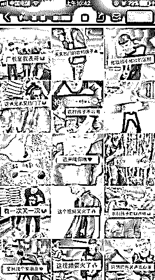
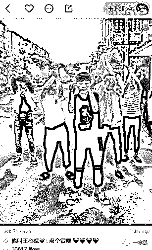
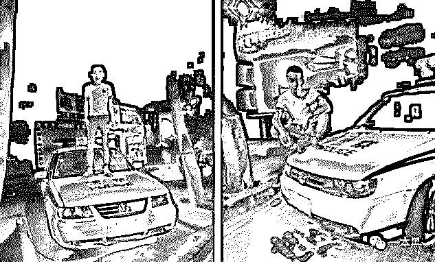
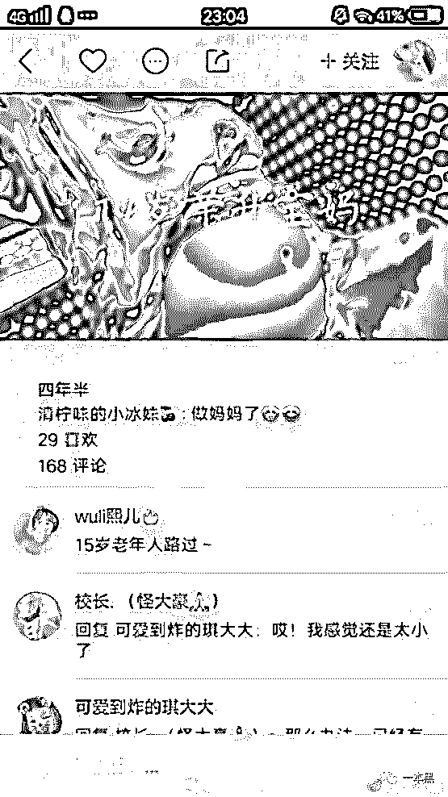
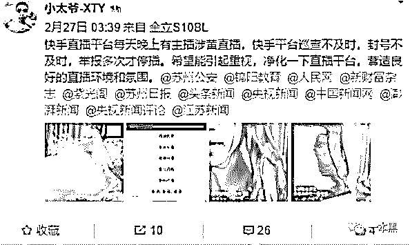
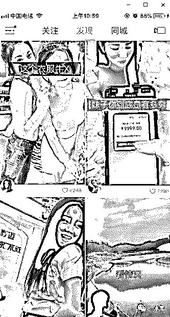

# 和快手的低俗比起来，我们又能好到哪里去

> 原文：[`mp.weixin.qq.com/s?__biz=MzU4ODAwNzUwMQ==&mid=2247484106&idx=1&sn=8440c6c9bf1a58050cc8a38b0aa575ab&chksm=fde213e8ca959afe38a9a9826613d406271a841c8d8e5d69df2d4c826ba14753d177e5dba76e&scene=27#wechat_redirect`](http://mp.weixin.qq.com/s?__biz=MzU4ODAwNzUwMQ==&mid=2247484106&idx=1&sn=8440c6c9bf1a58050cc8a38b0aa575ab&chksm=fde213e8ca959afe38a9a9826613d406271a841c8d8e5d69df2d4c826ba14753d177e5dba76e&scene=27#wechat_redirect)

文/东东（微信公众号：一本黑）

责编/振宇

【一本黑】媒体或商业转载必须获得授权，个人转发朋友圈无需授权。

读完需要

8 分钟

速读仅需 3 分钟

* * *

多年以后，小凯翻开手机记录，准会想起自己第一次拍摄农村视频的那个遥远的下午。 

这里是个拥有几百户人家的村庄，颓丕的土房与新修小楼格格不入，却随处可见。河流两岸清澈见底，沿着布满石头的河床一眼望去，可以看到中国乡村的普遍现象。

**快手：你永远叫不醒一个装傻的人**

每次进入小凯的视频主页，展示的要么是演技尴尬的黄段子，要么是低俗无趣的翻拍作品。

甚至连普通话都说得不标准，但是这种淳朴的乡村气息却吸引了很多人的观看，让他迅速在短视频平台快手上坐拥几十万粉丝。

小凯十七八岁，自去年接触短视频快手以来就频繁发布这类乡村题材的短视频。视频一般由三到五人完成，基本都是家人出镜，老人小孩有时候也会在屏幕前笑得乐开怀。

这种自导自演的乡村题材视频在快手上并不在少数，透过区区 5 寸屏幕，我却看到了当下中国农村以及小城镇青少年的些许现状。

快手上太多不务正业的青少年，以为身上纹几条龙就是社会，整天不好好上学，学人家打架斗殴的大有人在。

他们没学历背景还未成年也没有什么能力，却总是学一些快手网红，聚众社会摇，以为自己就是最牛逼的，这就是社会，这就是快意江湖。

嘴里经常说出的一句话一定是“老铁，没毛病”，“双击，666”。

有甚者为了博取眼球，竟然脚踏警车自拍，直播的时候挑衅并侮辱警察，结果必然就是拘留了，没毛病吧。

《我们不一样》给快手上的这些歪风邪气添加了不少色彩，以穷小子逆袭高富帅的故事为线索，开着跑车跻身社会名流，与前女友擦肩而过，回想起当初分手时转身的瞬间，画面调到灰色，此时必定会想起：“我们不一样，每个人都有不同的境遇......”

你看，“逼格”一下就上去了，瞬间让你觉得有酒有故事。

那些吃毛毛虫，喝尿的重口味例子我就不举了，毕竟我们不一样，对吧。

除了这些效仿社会人的青少年和重口视频，穿着丝袜对着镜头搔首弄姿的也不在少数，他们大多是为了引流做微商，所以出此“下策”，不得已而为之是我想到的形容他们最好的词汇。

在快手，你永远也叫不醒这些装疯卖傻的人，在这个乌烟瘴气的环境中，他们自我感觉良好，他们认为自己没毛病。

**14 岁少女怀孕，快手涉黄打擦边**

如果说上述那些视频内容只是开胃菜，那快手上 14 岁少女怀孕的视频可以说是让人难以下咽了。

看了快手上的这些视频，我会有一种深深的无力感，会让人觉得中国广大的底层青少年已经没有希望了。

这些只有十四岁左右的小女孩本应该坐在教室里接受教育，却早早生下小孩，人生轨迹从此翻天覆地。

生活环境、文化程度、都是影响他们的重要因素，**不难看出，在中国的广大落后地区，根本不存在性教育这一说法，可悲至极。**

也许我们本不应该用一个恶意的角度去揣测这些小姑娘的人生，但是也实在是没有办法用一个善意的眼光去看待他们的极端想法。

在他们还未绽放的青春岁月里，这种突如其来被打乱的人生恐怕犹如破镜，难以重圆。

这其中难以言表的滋味，也许她们多年以后才会懂。

前几天，某媒体记者接到爆料，有多位网友在微博中举报快手深夜再次涉黄，并且配上了视频的截图。

针对此事，随后快手回复称：“经过调查，这些账号由盗号途径进行直播，已于此前处理”。

有读者给我们爆料，他有一个初中同班同学，特意辞掉工作在快手上搞色情直播，收入还特别的可观。

这些女孩为了博眼球挣钱，直播时故意打擦边球，为本身就乌烟瘴气的快手又加了一把火。

虽然快手公关回复事件所属是盗取他人账号，来获得直播权限从而进行隐秘性违规直播，但是否存在色情黑色产业链导流这一潜规则，大家心里多少可能都有数。

**快手：我们不一样，其实也一样**

要说快手为什么会成为短视频行业的巨头，我认为其最大的原因就是找到了用户群体，并且摸透了用户最本质的心理诉求，它实实在在的满足了中国光大底层人民被压抑的“欲望”。

快手用户大多数来自三四线，甚至五六线城市，而这种城乡结合部一旦有一个产品兴起必然就会形成裂变效果，一传十十传百，迅速就铺展开来。

快手打着口号：“记录世界，记录你”，它给予了每个用户一个平等的展示自我的平台，只要你上传视频，就有可能被千千万万的人看到，这对于中国广大底层用户来说，无疑是一种“欲望”的释放。

他们所处环境闭塞，娱乐项目也不多，而快手的出现正好给了他们这样一个舞台。和每个人一样，他们也渴望被关注、被认可，由此玩快手也就成了刚需，成了释放“欲望”的一个工具。

说起快手这个产品，其一定是团队经过深思熟虑之后的产物，他们真正的懂用户，他们知道用户需要什么。

快手不像微博，不像自带流量的明星，你一个底层人民想要在微博火起来几乎不太可能，而对于快手来说，它去掉了微博那种模式，只是把快手作为一个展示自己和记录自己的平台。

只要你发布的视频足够吸引眼球，你就有可能在平台上火起来，这是底层人民的欲望和需求，不仅包含心理满足，还有物质原因。

他们压抑太久，只有这种方式才能让他们走捷径，**快手，是他们想要一夜爆红的救命稻草。**

于是也就出现了各种低俗、恶趣味、脑残、毁三观的视频，从此快手对外宣布：“我们不一样”。

只要你搜索关于快手的内容，在一些热门的评论里一定会看到一句话：“中国脑残千千万，快手占了九成半”，然而这就是中国乡村的部分精神面貌，不用走出家门，快手告诉你一切。

在快手，你无法叫醒这个装睡的平台，不管是多么低俗，你觉得快手团队不知道他们的用户质量吗？**但相比巨大流量，低俗恶趣味又能有几斤几两。**

不得不说的是，快手上除了这些低俗视频，自然也有清流用户，他们正常的展示才艺，获得认可，中间犹如隔着一道沟鸿，与前者形成鲜明的对比。雅俗共赏，尽在快手。

总之，快手颠覆了国人的认知，低俗必将会成为它无法洗白的宿命，就像人们一提到陌陌，脑海里必定会浮现约炮二字一样。

但它展示了一个真实的、鲜活的底层人民的生活姿态，它告诉我们，**中国乡村，魔幻而现实，并不全是诗和远方。**

虽然很多人觉得快手上用户上传的视频都很低俗，会瞧不起他们，相比自己体面的工作，简直就是一个天上一个地下，但比起视频中那些热闹的场景，屏幕前的自己显得是那么的孤独。

也正是由于孤独，才会有那么多人去观看，对别人察言观色，自己却孤独得像条狗。

前几天振宇给我说他也喜欢一个人在家的时候看直播，看别人的生活动向，体会别人的热闹。他说有时候只是单纯的把别人的直播间挂着，因为身边太冷清，想听到身边有说话的声音，仅此而已。

每个人都向往别人的生活，觉得别人的生活才是自己想过的，但对于当下，你又能改变什么。

**你觉得别人低俗，但那只是一种生活方式，你高尚还不是照样每天充当公司的一颗螺丝钉，你是送餐员、小区保安、公司销售、高层管理，还不是照样每天看人脸色。**

相比快手上那些想要一夜爆火把自己搞得低俗恶趣味的人来说，你也想走捷径一步登天不是吗？

**在人间有谁活着不像是一场炼狱，和他们比起来，我们又能好到哪里去！**

还原事实｜专扒黑产

微信 ID：darkinsider