# 别上那辆网约车！“假司机”暗藏安全隐患

> 原文：[`mp.weixin.qq.com/s?__biz=MzU4ODAwNzUwMQ==&mid=2247484048&idx=1&sn=93e5de072e205546fe91bd78ab37855a&chksm=fde213b2ca959aa462a161ee3d46cacea096cef3fb5af3612b3576d3f3eece4d0e22a13875a5&scene=27#wechat_redirect`](http://mp.weixin.qq.com/s?__biz=MzU4ODAwNzUwMQ==&mid=2247484048&idx=1&sn=93e5de072e205546fe91bd78ab37855a&chksm=fde213b2ca959aa462a161ee3d46cacea096cef3fb5af3612b3576d3f3eece4d0e22a13875a5&scene=27#wechat_redirect)

文/小白（微信公众号：一本黑）

责编/振宇

【一本黑】媒体或商业转载必须获得授权，个人转发朋友圈无需授权。

读完需要

7 分钟

速读仅需 5 分钟

* * *

****路遇假司机****

****网约车安全隐患****

****

**2016 年 5 月，深圳一名女教师打网约车准备回家，却不想司机中途变道，将车子开到偏僻路段，持刀对其进行了抢劫，之后更是将其残忍杀害。** 

**这起案件一出，立刻引起了公众的恐慌，网约车安全问题再次被摆上台面，而这出悲剧原本是可以被避免的......**

**除了这个案子，在网约车大行其道的今天，乘客门遇到的相关恶性事件从没间断过——轻则司机态度恶劣，重则遇到司机电话骚扰甚至车内猥亵。**

****

**2017 年 6 月数据显示，深圳警方仅一个月内接到涉及网约车司机的报警电话就有一千多起，符合相关立案标准的有几十起，这其中就包括强奸、猥亵、抢劫、殴打乘客等事件。**

**前不久，广东警方打掉了一个专门从事网约车违规注册的黑产工作室，这条新闻引起了我们的兴趣，在深入调查并且了解他们的操作流程之后发现，一个小小的动作可以大大地降低网约车安全隐患。**

****网约车黑产之手**** 

****

**大部分网约车平台对车主都是有一定要求的，达不到要求理应被拒绝注册，然而现在市面上有一些黑工作室，专门接这些业务。**

**无论你是因为哪种原因注册失败，花个 5、600 他们就能帮你解决，小编随手一查，这样的工作室数量还不少，能“解决”的问题涵盖范围也很广。**

**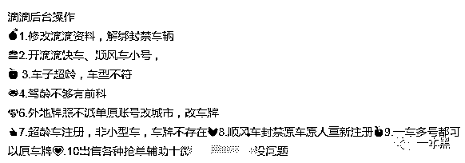**

****  驾龄不够随便改****

****为了弄明白他们的操作流程，我们添加了几个相关微信号进行“业务咨询”，得到的答案无一例外——在驾龄不够的情况下，他们给出的方案是找姓名相同的驾驶证上传注册。****

****因此乘客在打车的时候，注意确定到达车辆的车牌号与软件给出的是否一致是一个很重要的环节。****

****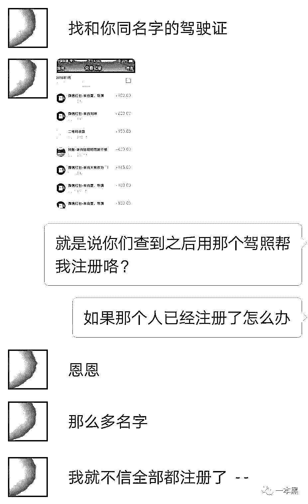****

****问题也随之而来，找相同姓名的驾驶证替换注册，前提是得有这么大批量的同姓名车主驾照信息，这些信息都是从哪儿来呢？****

****在进一步的调查下我们发现，这些名单的来源除了黑市购买外，有很大一部分都走的是“内部渠道”，而黑产工作室所透露的“内部渠道”在这边并不方便公示。****

****这些售卖信息的“内部人员”是真的不知道泄露个人信息的严重性吗？完全没可能。只是在利益面前，一切道德甚至法律的约束都化为幻影被随意穿透，任意践踏。****

****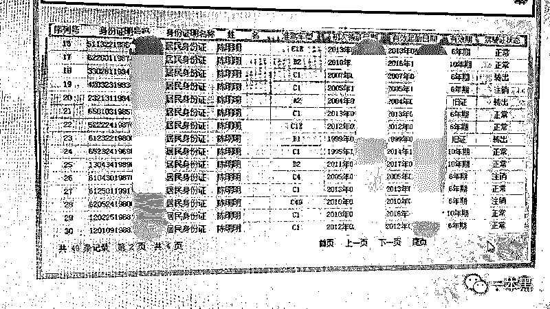****

****“内部人员”提供的名单，信息非常全****

****这其中的利润也是相当可观的，一级代理给下级的名单售卖价格为 8~10 元每条，而销售端给这些司机的最终价格是 500~600 元。****

****一个相当低贱的价格，让这些所谓“内部人士”在出卖他人信息的同时也出卖了自己的职业修养。****

****  异地改牌，轻而易举****

****同样的，异地车辆不能在所在地接单，哪怕能接单也没有奖励，这样的规定本来是为了城市整体交通环境而设置，在这些工作室看来也完全不是什么大问题。****

****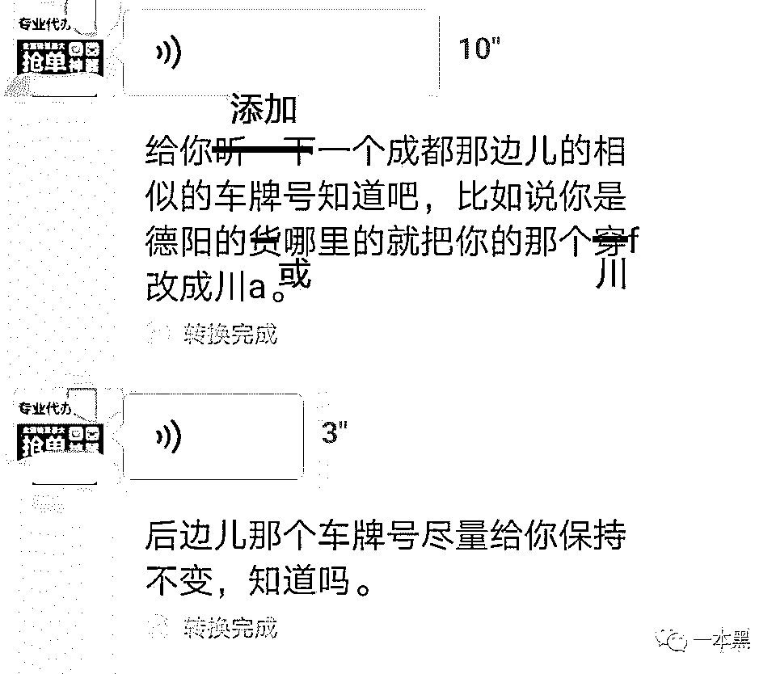****

****添加相似车牌号上传，一般只改变前面的地域编号，后几位数字尽量保持不变。****

****这种修改方式为的是减少麻烦，降低乘客对车牌号码的敏感度，车牌后几位数字相同一般乘客不会发现问题。****

****这也是一个警醒，稍微有警觉的乘客可能会核对车牌后几位数字，但不会注意车牌的全部，所以核对车牌的时候一定要细心，确定看起来一致的车牌中是否暗藏猫腻。****

****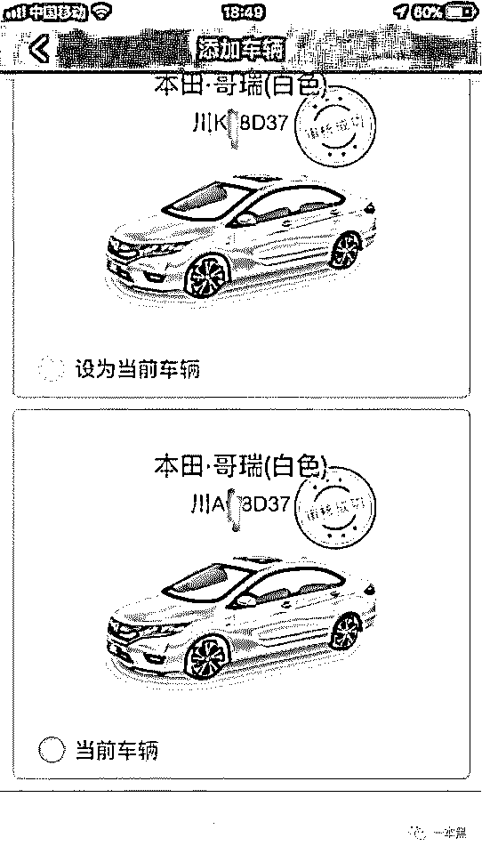****

****有意思的是，小白询问的所有工作室对北上广深的业务态度都很微妙，或者价格要求超出其他城市改牌价的 4 倍，或者直接拒绝对这些地域的相关业务。****

****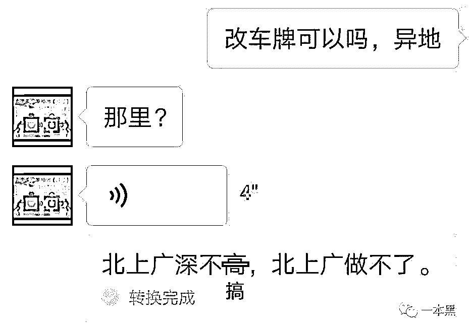****

****究其原因，是这些地区需要提供的资料太多，网约车方面对这些城市申请的检查太严而且风险太大，更容易“出事”。****

****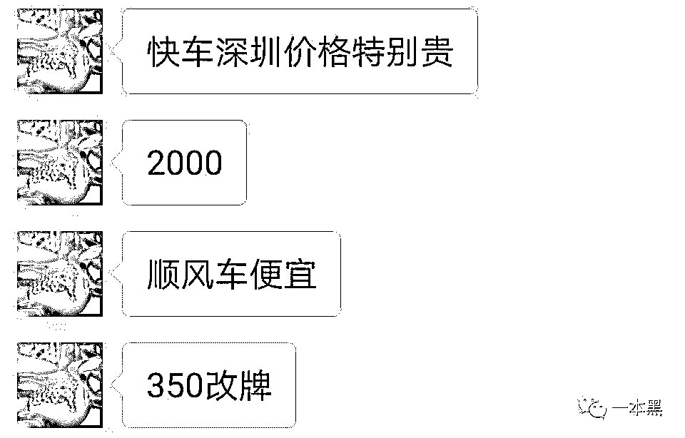****

****而这恰恰说明网约车注册的漏洞监管并不是不能实现的，只是网约车公司放松了对其它地区的监管，使得这些工作室有机可乘。****

****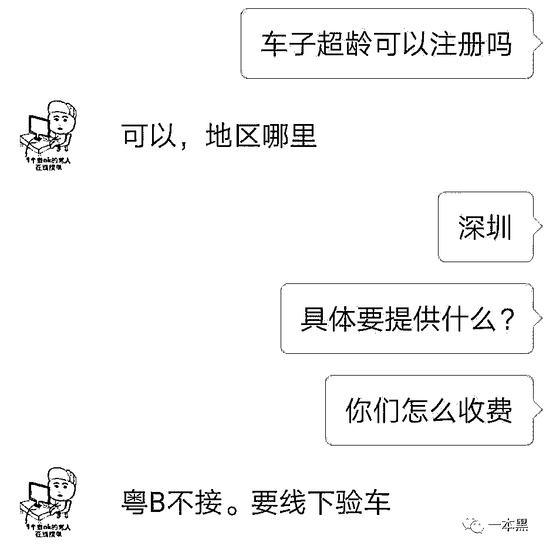****

****  小城市车牌型号随意切换****

****最明显的对比是在一些二三线甚至更边缘的城市，随意上传虚假车型信息也能注册成功，驾龄不够使用父母或朋友的驾照注册等等都很普遍，监管几乎为 0.****

****用一位司机的话说：没有太重大的问题注册一般都会通过。****

****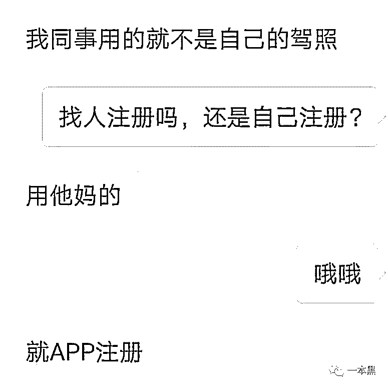****

******外挂不只在游戏****** 

******网约车也有挂******

********

****注册有漏洞，注册完成成为网约车司机后照样有一些空子可钻，利用这些空子，一些司机的收入会比遵循规则的司机高出许多，这里面最有意思的是“外挂”。****

****在这次摸排行动中，广东警方还打掉了两个制作售卖外挂的团伙，这两个团伙累计获利超过 1000 万元。滴滴抢单外挂利润能有这么高？其实看完他们的分销也就不难理解了。****

****这一类的团伙一般分为制作软件的技术团伙、分销团伙和各级“代理”。****

****技术部门制作出软件后，分销部门会立刻去贴吧、微博、知乎甚至是自制的网站散布消息，招收一级代理，一级代理拿到软件后选择直接售卖或者继续将软件分发去合作的滴滴黑产工作室，甚至原本是买家的部分司机，最后也会成为一个底层的小代理帮忙“销货”。****

****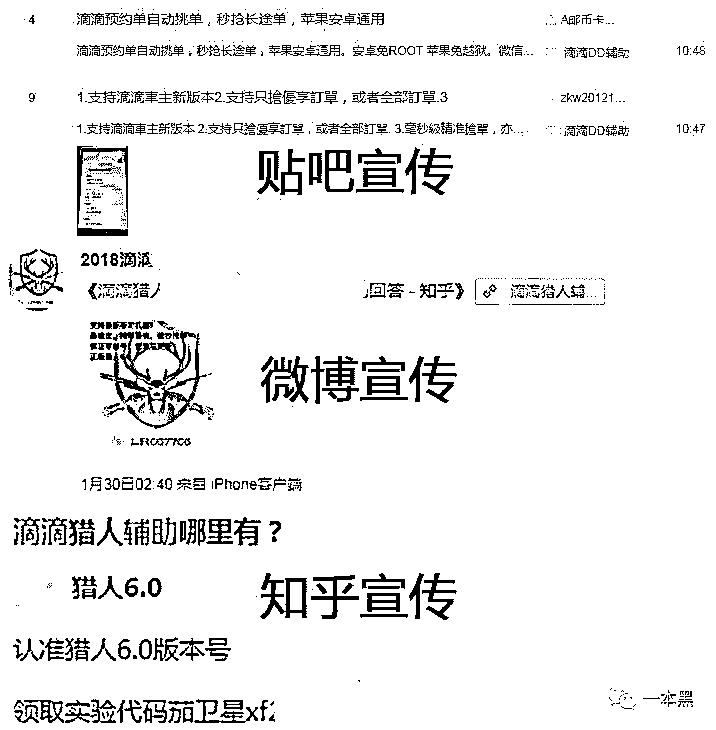****

****而这一类的软件数量绝对不会少，就我们调查了解，网约车的外挂大致分为 3 种：预约单抢单、普通出车抢单和修改定位。****

****  预约抢单挂****

****现在市面上流传最广的应该是下面这款叫“猎人”的抢单软件，经过简单的设置，一些司机可以很轻易地抢到长距离的预约单。****

****并且这款软件已经火爆到出现“盗版”了。****

****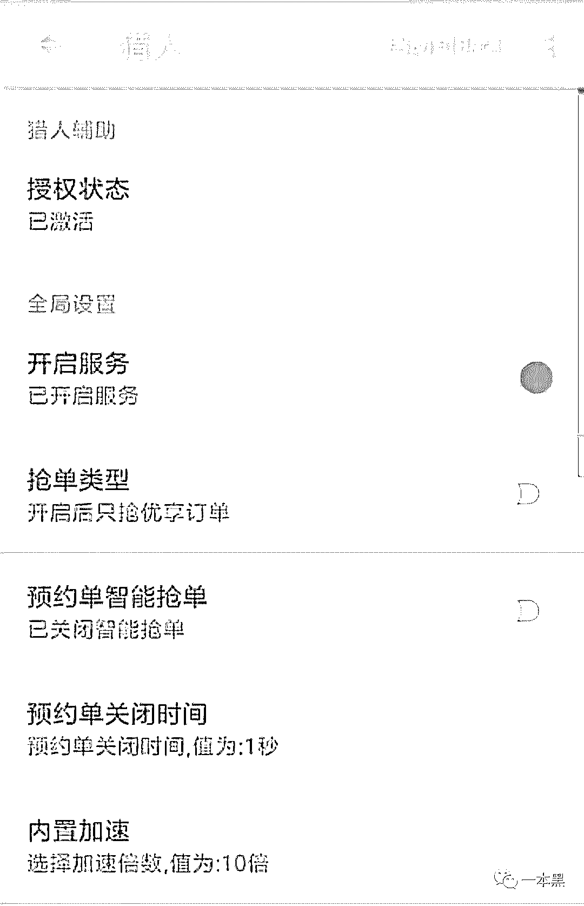****

****除了可以设置抢单类型外，这款软件还能设置抢单范围和行程范围，符合条件自动抢单，一些司机可以利用这款软件抢到行程长距离自己近的“优质”预约单。****

****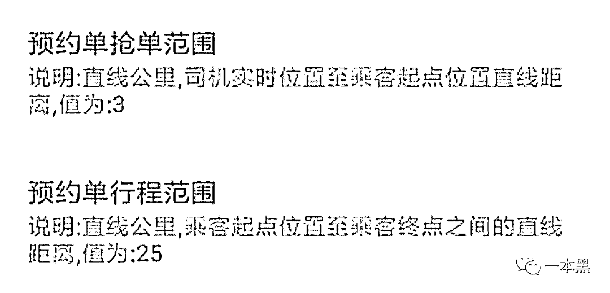****

****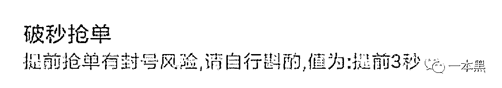****

****  普通快车抢单挂****

****有专门抢顺风车的外挂，自然就有抢普通快车单的软件。这种软件被排查的力度更严，被封号的概率也更大，所以卖家非常少，收费也是猎人的几倍，每个月使用费高达 800 元。****

****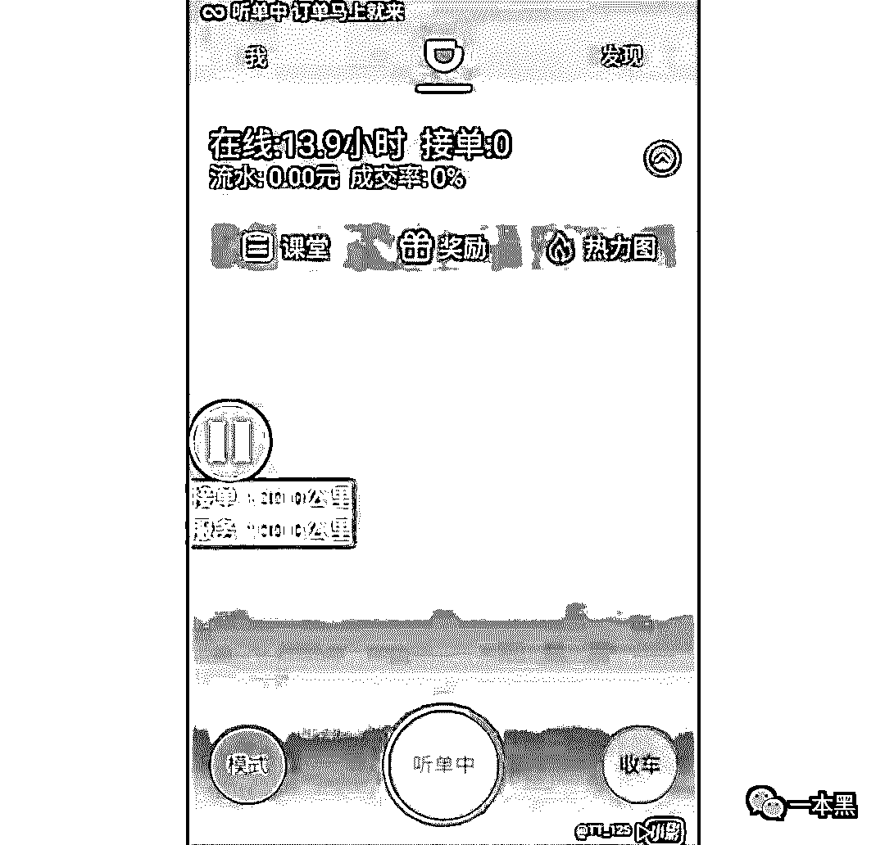****

****跟猎人一样，这款外挂也可以选择接单距离和行程距离，选择过后，可以通过车上的悬浮窗小工具控制是否开启自动抢单。****

****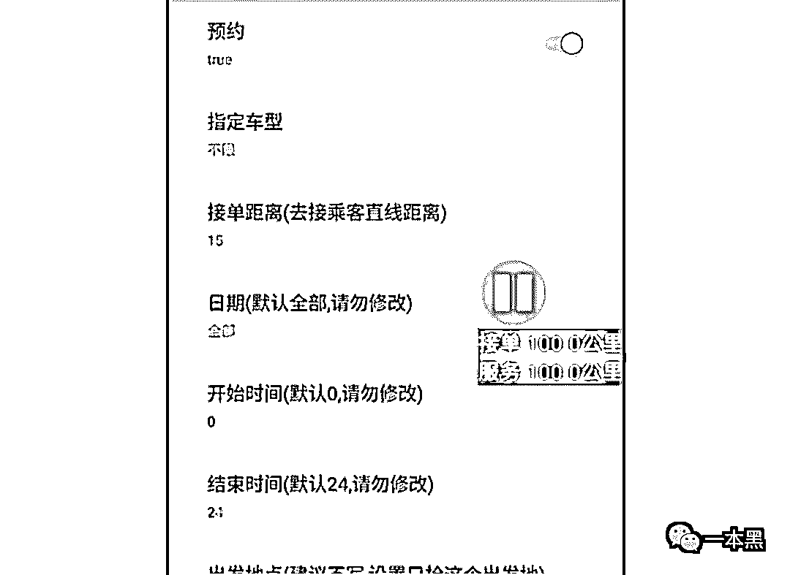****

****使用软件的司机可以挑选自己喜欢的单子接，不喜欢的可以直接拒单。****

****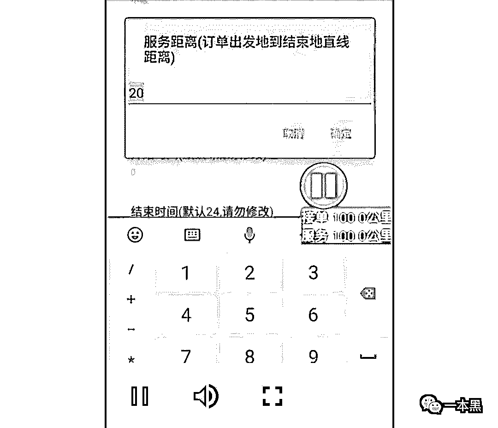****

****  定位转换软件****

******更改定位的软件比前面的软件都有意思，它的使用范围可以很广，不限于司机抢单。******

******探探、陌陌、微信改定位都可以使用，是一款代购微商们非常喜欢的软件，普通上班族甚至还能用这款软件进行钉钉签到，防止迟到扣工资（不是老师傅告诉我的）。******

******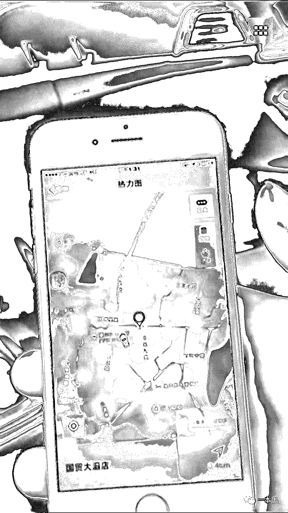******

********网约车更长的路******** 

******************一些小小的问题，最终都可能酿成大大地祸患。****** 

******钻漏洞注册成为网约车司机，驾驶真的坐上这样的司机开的车，隐患实在巨大，一旦出事，这些虚假注册信息将成为嫌疑犯的一块遮挡不，增加警方查案的难度。******

******文章开头提到的网约车司机抢劫杀人事件，虽然嫌犯使用的是真实信息注册，但当天所用的是伪造车牌，假使叫车的女教师能注意到车牌不符，然后拒绝上车，后面的遗憾也就可以避免。******

******在日常生活中，许多乘客都碰到过牌照不符的情况，但大多数时候不会引起重视，一般司机随意找个借口就能糊弄过去，甚至都不需要司机找借口，乘客默认接受。******

******在打车的时候，我们还是希望大家能保持警惕：******

******┊  注意仔细核对车牌，确定车牌是否相符。******

******┊  行驶过程中注意路径是否正确。******

******┊  将车辆信息或者行程信息分享给亲友******

******┊  发现不对立刻报警。******

******新年快到了，无论是回城的顺风车，还是串亲戚的快车，对网约车的需求量一定会增高。在最后一本黑还是带着老师傅苦口婆心地提醒大家——******

******不要因为过年就放松对自身安全的警惕，在乘坐网约车时，多多注意叫来的车子和司机有没有问题，时刻保护好自身的安全。******

******还原事实｜专扒黑产******

******微信 ID：darkinsider******