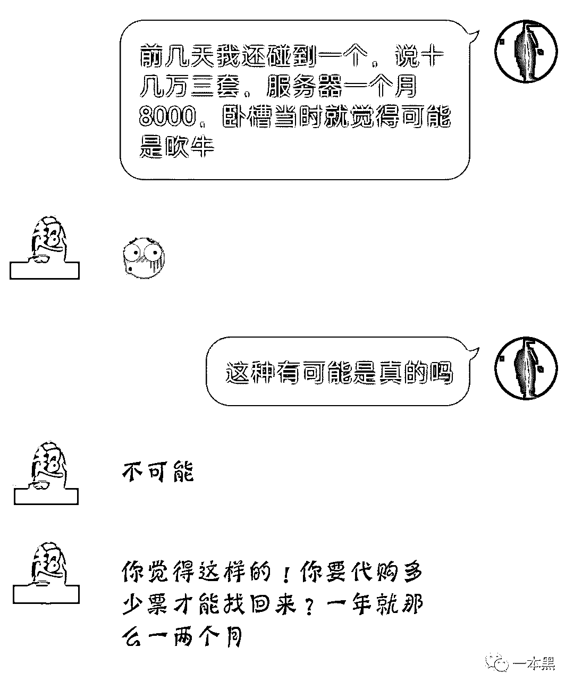
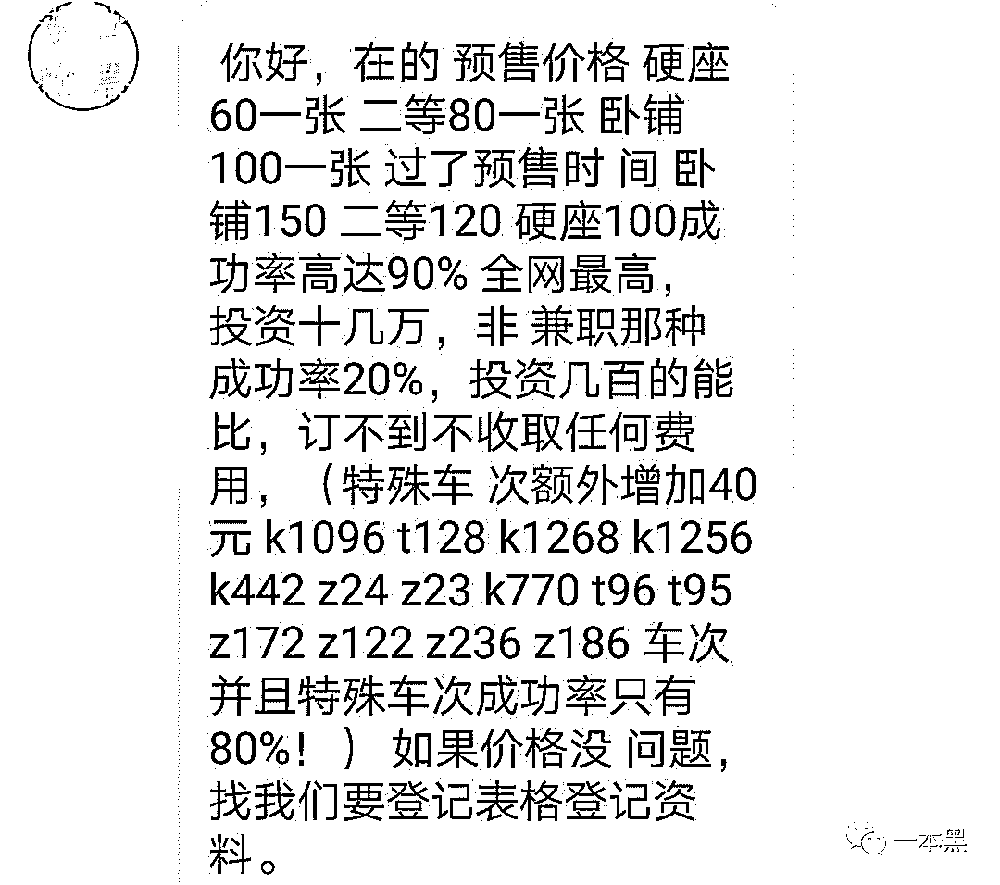
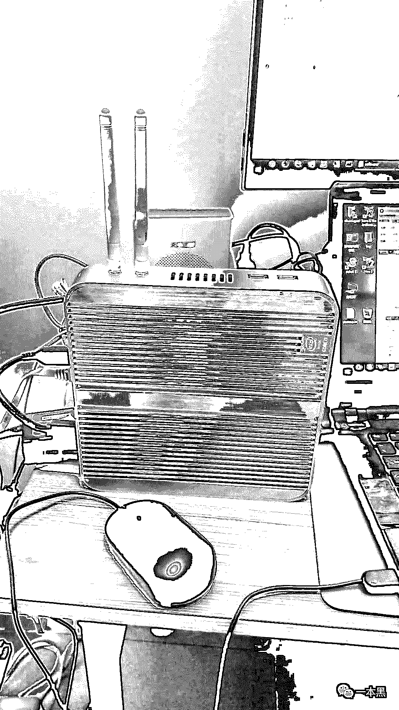
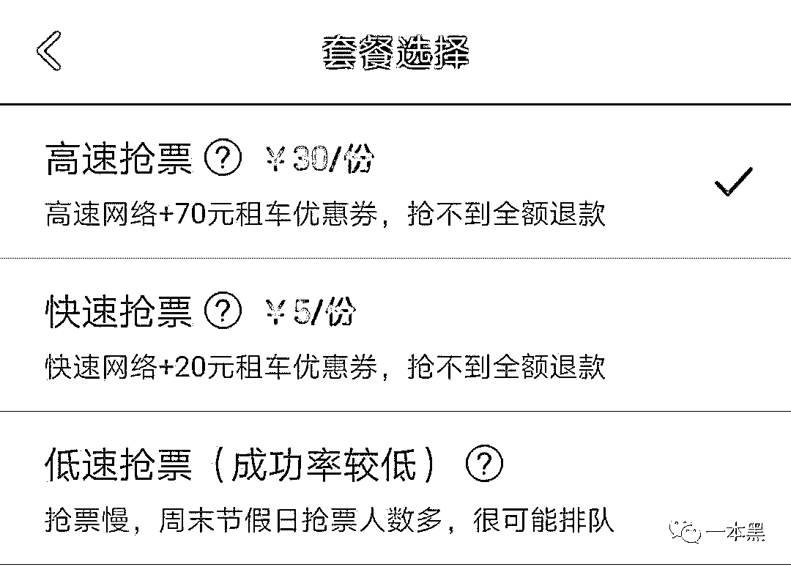
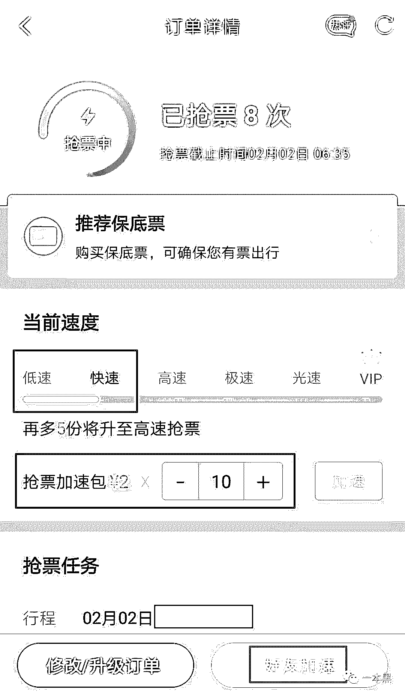
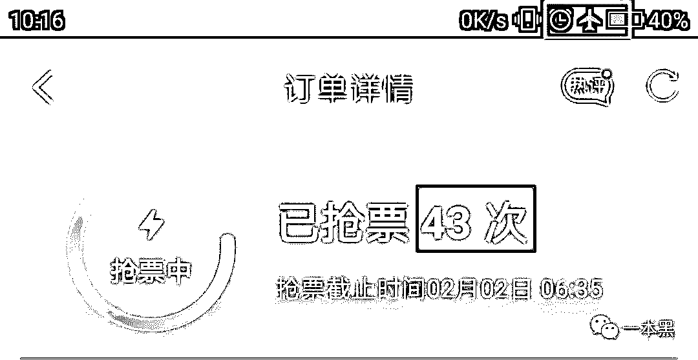
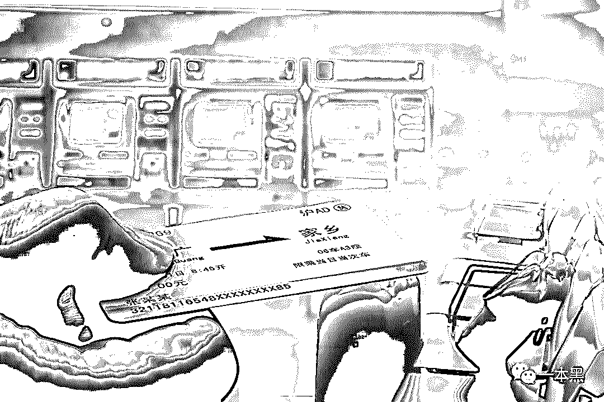
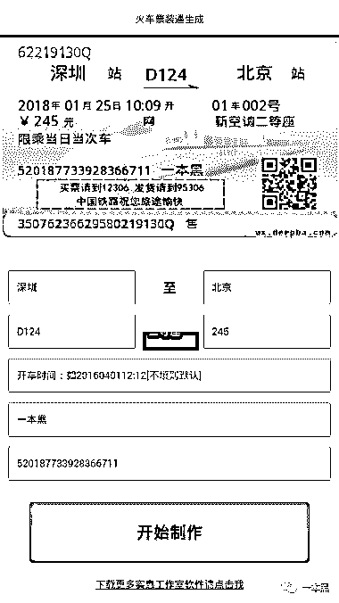

# 原来黄牛是这样抢票的！掌握这几个关键点，你也可以轻松抢到票

> 原文：[`mp.weixin.qq.com/s?__biz=MzU4ODAwNzUwMQ==&mid=2247484037&idx=1&sn=513affe5b4124059a4254a91bb262002&chksm=fde213a7ca959ab1640ec25896a2bc841739978820225ae540e4621f459643696299960a5928&scene=27#wechat_redirect`](http://mp.weixin.qq.com/s?__biz=MzU4ODAwNzUwMQ==&mid=2247484037&idx=1&sn=513affe5b4124059a4254a91bb262002&chksm=fde213a7ca959ab1640ec25896a2bc841739978820225ae540e4621f459643696299960a5928&scene=27#wechat_redirect)

文/小白（微信公众号：一本黑）

责编/振宇

【一本黑】媒体或商业转载必须获得授权，个人转发朋友圈无需授权。

读完需要

9 分钟

速读仅需 5 分钟

* * *

年度大假又将来临，作为唯一一个全国人民目的地都是老家的长假，车票难买是标准试题，难以解决。

今年的我又像往年一样是一条抢不到车票的咸鱼，正准备向黄牛低头，却发现公司同事一个接一个取到了回家的车票，无比诡异，难道 12306 只针对我一人？

这个问题，终于在某个晚上于老师傅家得到了答案......

黄牛模拟，老师傅的抢票秘诀

老师傅家的三台电脑+一台服务器上闪着一个不停在刷新的软件，我正想上前仔细研究，他便拿着两听啤酒走过来，慢悠悠地坐进沙发主动解答：

“怎么，好奇？这是我每年春运的必备武器，没有它还真难回家。”

“春运回家？这是刷票软件？我也用啊，可还是抢不到票......”

“你抢不到正常，毕竟你的装备跟我比起来还是有差距的。”

在老师傅的解说下，我终于明白所谓差距到底体现在哪里：

┊  百兆级的网络

┊  独立的服务器

┊  高配置路由

┊  七类万兆网线

┊  某独立抢票软件

┊  多台机器同时启动

这些都是普通用户不具备的条件，也就是老师傅口中所说的差距。

“其实说起来，大部分黄牛操作的基本原理跟我应该是一样的，或者换句话，我现在就是一个不收中介免费给同事们抢票的小黄牛。”老师傅喝了一口酒，嘴巴里嚼着小鱼干继续说道。

  你与黄牛的十万八千里差距

事实真的如老师傅所说，黄牛抢票的原理也是这样吗？老师傅的话理论上说来不应该怀疑，但求真是一个质疑和探索的过程，为了验证老师傅的话，第二天我默默地潜进了几个黄牛群。

大部分黄牛群都开启了全员禁言，入群时会收到提示，或者要求入群者添加客服 QQ ，或者有客服 QQ 主动来添加，主动添加我的黄牛非常干脆，上来直接询问是否需要买票，在一步步套路下，这个黄牛得意地透露出自己团队的刷票原理：

可这个说法却被他的另一个同行否定。

两边答案不统一，迷茫的我再次向老师傅求救，到底两个黄牛谁在说谎呢？

  抢票软件和独立服务器

黄牛们所使用的软件无非两种，一种是市面上已有的软件，一种是自己找人写或者找第三方购买的的独立软件，这些软件其实没有太大的优劣之分。

非要说区别的话，大厂的抢票神器使用的人数多，服务器被平均分配，每个人获得的使用份额减低，抢票能力跟单独使用服务器的独立软件比起来会稍弱一些。

因此部分黄牛会选择购买或租用独立服务器，这种说法也比较合理，不过 8000 元已经算是一个比较高的价格了，如果真的 8000 每月，更大的可能性是租用了多台普通服务器，价格合计 8000 左右。

至于找第三方代理购买独立软件是有可能的，购入价格是否一万二每月是一个见仁见智的问题。按照他们的报价，每张车票平均收取 100 元左右的中介费，每个月需要售出 120 张车票才能回本。

折算一下，每个月需要售出至少 200 张车票才能平衡收支，还不算人工，若该黄牛说的是实话，那么这个团伙规模巨大，客源还需要稳定。但基于服务器价格的原因，我们更倾向相信他说的操作方式真实，但报的价格偏高。

另外不得不提的是，黄牛中也不乏像下图一样的二道贩子，使用市面上的抢票软件进行抢票，成功则收取服务费，不成功也没损失。

  多设备刷票，抢占数量优势

许多人在家抢票也习惯开几台机器一起，增加下单率，黄牛们也一样，他们的团队中人数不一定多，但一定会有多台设备一起开启软件，增加下单频率，从而提高成功概率。

由于大多黄牛都是以这种形式拿票，也就难怪他们都不会保证 100%购票成功。保证 100%抢票成功的黄牛，只能是捞一笔就走的二道贩子或者拿到钱直接删除拉黑的骗子。

  网速快则抢票快？

这个原因看起来不可思议，但绝非笑话。拿着 10M 的长城宽带和 100M 的电信宽带以及千兆级的企业宽带速度自然不一样，一张车票放出来，网速快的一方总能先刷新成功然后进行抢票动作。

比如给同事们做代购的老师傅，家里装着百兆宽带，网速就先占了优势。

三台电脑+一台 3000 块的服务器同时开启，加上高配置路由和七类万兆网线，目的是降低自己数据包到达 12306 服务器的延迟，最终提升自己的抢票速度，这提升的速度里包含着同事们回家的希望。

  刷票软件的“加速”功能是什么

解决了黄牛的操作问题，另一个问题又出现了。市面上众多的抢票软件都有付费购买或分享即获得加速的功能，这种“加速”到底是什么意思呢？

在老师傅的一番解释下终于有了正解：“抢票软件并不存在加速这一说，所谓加速，其实就是前期先给你软件能实际刷新速度的 50%，然后你每达成一个条件（或者付费，或者分享）就多给你提升一些刷新频率。这也是普通网友和黄牛之间的又一个差距。”

以 X 程的抢票服务为例，确定抢票后会收到第一层加速提示——购买加速包，且这个加速包的价格会随着车次的热门程度产生变化。

进入抢票页面会会有更多的加速提示：至多可以买 20 个的 2 元加速包、邀请好友点亮的宣传加速包等等。

值得一提的是，这个宣传加速包必须要被邀请人填写手机号码才算正式点亮，单独进去点亮是不会被算为加速成功的。

好不容易全部加速结束，准备坐等火车票，那你就太天真了。在用该软件做测试的时候，我们有了一个意外的发现，断网之后抢票次数依然在涨。

抢票下单这个动作是 X 程后台系统操作的，哪怕手机断网，后台服务器还是会继续下单。

但是断网后 app 上抢票次数依然持续上升，说明这个数字增长是写在脚本里的，跟后台下单的次数并不关联，亦即——你看见的抢票次数根本就不是后台系统下单的真实数字。

心机和套路不加修饰地写在脸上，普通用户却没法儿有半句怨言，说到底问题的根源还是在火车票上，没有网络渠道的时候黄牛们排队抢票，有了实名制和互联网抢票，黄牛还能抢到票，这些问题到底出在哪儿呢？

  锅在 12306？

“说起来，抢不到票还真不能全部甩锅 12306，它绝没大众想象的那么差，特别是在阿里云介入之后。”老师傅递给我一篇口香糖继续解释。

我们其实可以把 12306 看作一个电商网站，它的特殊性在于访问量集中，增长猛烈，下单也都瞬间完成，同时伴以复杂的库存计算。

17 年春运时 12306 的日均访问量超过 400 亿次，线上最高日售票量就到了 855.6 万张，这些访问出现得集中，放票阶段一拥而上，几分钟抢空一个车次毫不夸张。

且同一个车次，同一个座位，会因为购票的起点和终点不同产生不同数量的车票，这些商品数量的增减全部都是动态且短时间处理的，库存极难搞定。

面对动辄崩溃的系统，增购服务器不是一个好的选项（为了旺季增购的服务器在淡季闲置产生浪费），阿里云的介入是这个问题的最优解。

有 X 宝的部分活动经验可以借鉴，且云服务器比买硬件便宜，交付时间也短，高峰过后能释放掉多余的内存不造成浪费。

阿里云还在云上部署了一套独立的余票查询系统，跟 12306 本身的票务查询互补使用，根据负载调整两边的访问比例，缓解了日浏览量超高、服务器压力太大的问题。

“更简单点儿说，12306 现在的后台远没有到要挨骂的地步，出不了票是供需难以平衡的必然结果，追本溯源，还是铁道部门运力的问题。”老师傅嚼着口香糖随口说。

“这个有点儿像 12306 增购服务器的考虑，增加列车可以解决节假日的运输问题，但节假日过后的绝大多数普通日子里这些列车都将是闲置浪费的。”

  漏洞：实名制下依旧存在的黄牛

实名制后，为什么黄牛还能买到票？这是一个好问题，除了急于购票的买家主动提供身份信息外，黄牛们还会主动去黑市购买身份证信息，用来囤积热门车次的车票。

这样的票被查到不是风险很大吗？

“每列车挤满了乘客，查票是一个很大的工作量，能保证查到每一个人已经是不容易的事了，更遑论仔细核对身份信息。”老师傅熄灭烟头说着。

更大的风险，骗完即溜

各行各业都少不了骗子的存在，这种灰黑产业里更是加倍的多，在网上，除了倒卖车票的黄牛，还有利用软件合成虚假车票骗钱的假黄牛。

当买家怀疑真假时，他们可以立刻合成一张火车票，并把图片发给买家，以此捞钱。

  关于春运，关于回家

这一番探索，才算真正明白了“过年回家”这个过程里的购票细节。

黄牛和刷票软件的存在都源于大众心中的一个情节——返乡。

过年对大部分中国人来说不但代表着团聚，也代表着全年的句点和新年的开始，算是一项不可缺少的仪式。

正是这些让春节的各种交通网都塞满了人，也让黄牛有了可乘之机，回家的渴切之心可以理解，但在这份渴切之下，也希望大家不要放弃对安全的警惕，不管是身体的，还是个人信息的。

  话外

“老师傅，我的车票为什么还没买到？”

“车次太热门没有票出，你做好准备过年留在这里加班吧。”

“= = ”

还原事实｜专扒黑产

微信 ID：darkinsider