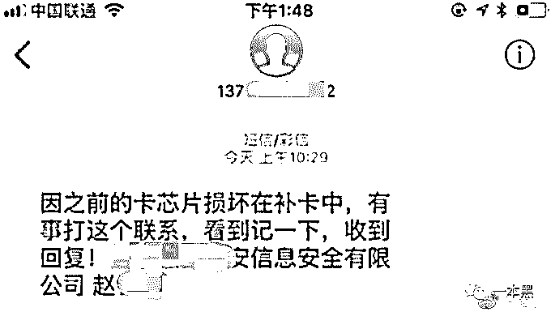
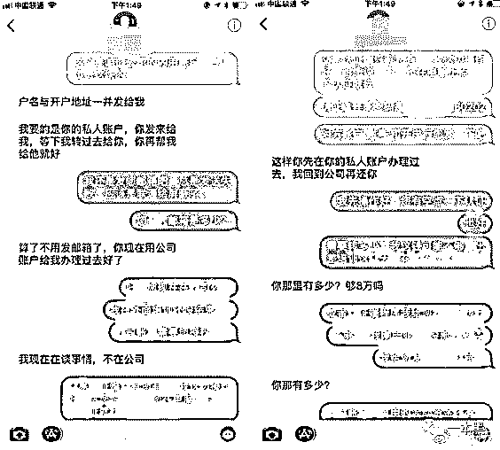
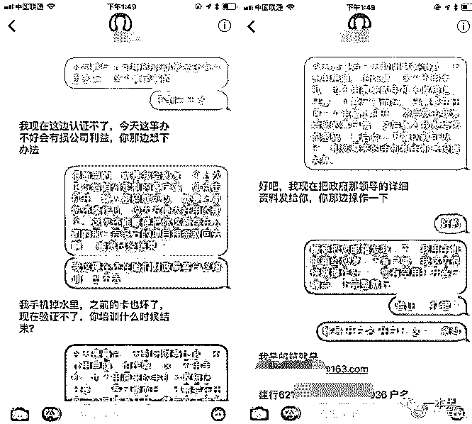
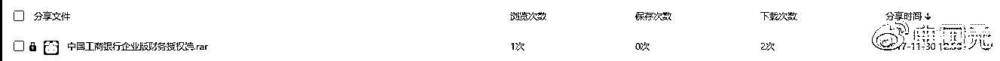
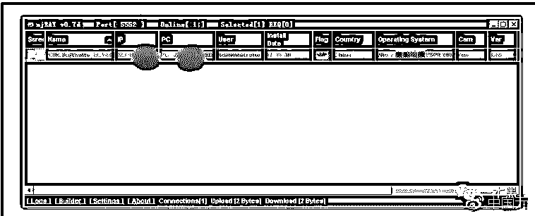
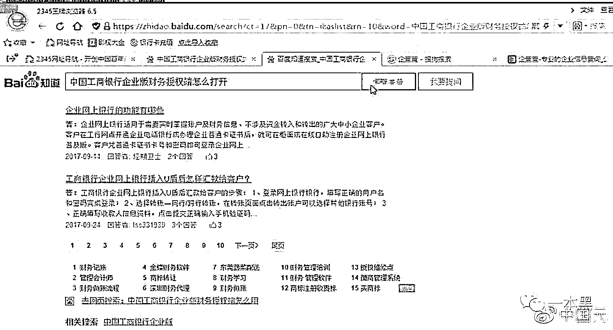
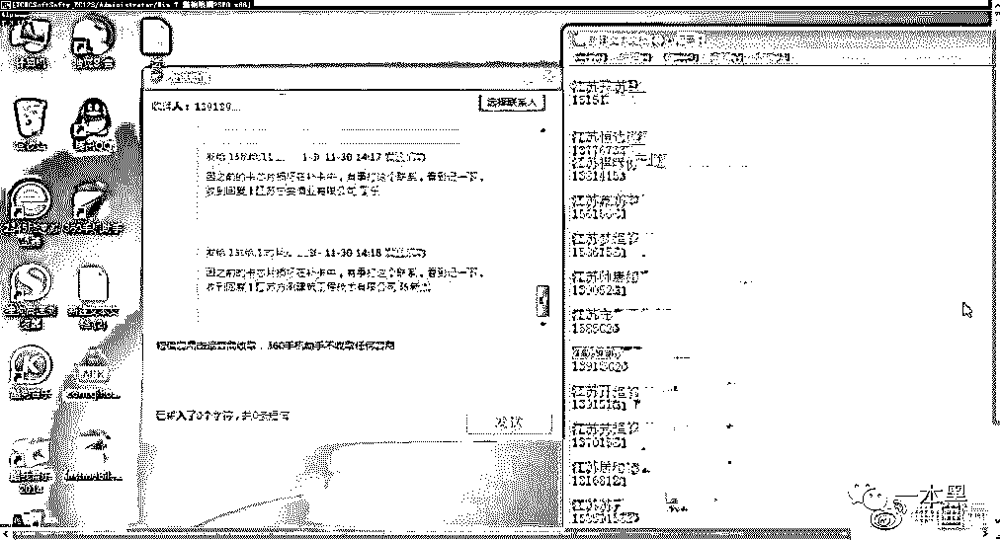
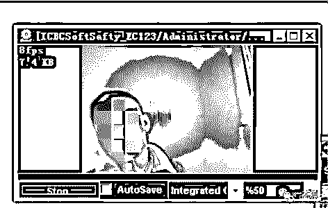
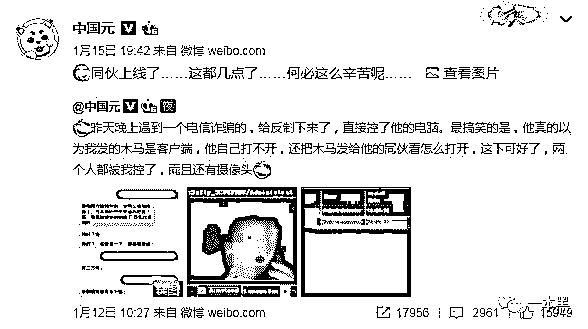

# 诈骗反被骗，白帽黑客简单下套一锅端

> 原文：[`mp.weixin.qq.com/s?__biz=MzU4ODAwNzUwMQ==&mid=2247484023&idx=1&sn=027053bda85f4aada6a7e89a7a2da0b9&chksm=fde21355ca959a43b30fd9cb7784ca39b956869a808bd647844d12b05f599a89f8faf8c69836&scene=27#wechat_redirect`](http://mp.weixin.qq.com/s?__biz=MzU4ODAwNzUwMQ==&mid=2247484023&idx=1&sn=027053bda85f4aada6a7e89a7a2da0b9&chksm=fde21355ca959a43b30fd9cb7784ca39b956869a808bd647844d12b05f599a89f8faf8c69836&scene=27#wechat_redirect)

文/小白（微信公众号：一本黑）

责编/振宇

【一本黑】媒体或商业转载必须获得授权，个人转发朋友圈无需授权。

读完需要

6 分钟

速读仅需 3 分钟

* * *

最近一个反诈骗的案例让微博上的小哥“中国元”大火了一把，一本黑找到小哥（后文简称小元哥），聊过之后发现这并不是他第一次进行诈骗反制，之前也成功过，对于这次突如其来的热度，小哥也摸不着头脑。

**诈骗反制，远程操控简简单单**

故事的开端，永远一样，小元哥又一次收到了骗子的短信。

用小元哥的话说“正好工作上没啥事，而且近期诈骗比较猖狂，想搞一下他们，然后提交给警方”，抱着这样的想法，小元哥开始给骗子发短信，目的是套路他们用邮箱接收自己的远程木马。

骗子其实并不想给邮箱，对骗子来说流程必须快准狠，简单直接才能最大化收益，不过小元哥利用了骗子的贪婪，告诉骗子公司的卡上有 600 万，诱导骗子给出邮箱接收“网银”。

骗子上当后小元哥立刻做了一个伪装成网银的木马，由于大部分邮箱附件上传 exe 都会被杀毒引擎查杀，小元哥还细心地压成了压缩包。

可能是邮箱被认定为垃圾邮件，丢进了垃圾箱，骗子并没有收到这封邮件，于是小哥重新发了百度云链接给骗子下载。

果然脱离了剧本的骗子毫无智商可言，在木马面前没有任何抵抗，直接缴械。接下来骗子的一切动作在小元哥面前都完全透明。

小元哥的木马端接到新机上线提示

小元哥通过木马看见骗子搜索网银使用方法

通过木马看到的对方电脑界面，被骗的人不少

打开了骗子的摄像头，看见了骗子的长相

除此之外还有意外收获，由于骗子怎么都打不开“网银”，便将“网银”发给了 2 个同伙，于是小哥最后实际控制的骗子有 3 个......

目前小元哥已经将线索交由警方，警方正在侦破，具体进度不方便透露，但可以确定的是，这些人大概率是跑不掉的了。

**关于小元哥的木马程序**

关于协助小哥伪装成网银立下大功的木马，小白找到在阳台晒太阳的老师傅，老师傅按灭手中的烟头，看着远方说道：这其实是用网上开源的代码修改过后的远控木马，看描述这个木马应该没有免杀功能，而骗子之所以接二连三中招只因为——他们电脑都没装杀毒软件。

老师傅提示：杀毒软件很重要。

这款木马的原理其实很简单，获得对方电脑的权限，看见对方电脑的一切操作甚至对对方的电脑进行操作。

如果你们也想体验一下远控的感觉，可以打开 QQ。QQ 上有一个类似的小功能叫“远程协助”，与小哥的木马不同在于——QQ 远程需要对方手动同意之后才能运行。至于 QQ 远程不能打开对方的摄像头，老师傅表示其实是可以的，只不过 QQ 没有开放这个功能。

老师傅提示二：家用摄像头没事还是封起来吧。

用于帮助小白用户处理操作难题的“远程协助”功能

**电信诈骗花样多？**

**防范其实很简单**

电信诈骗存在已久，形式多样，但手段归纳起来大致就是一下几种：

**形式一：虚假链接、木马链接**

以机票延误补钱、网购退款等理由，发送虚假链接套取受害人银行卡号、密码等信息，从而提取受害人存款；或者发送木马链接盗取用户网银资料。

漏洞：退票退款等并不需要额外提供银行卡号等信息，一般可原路退回。不随意点击不明链接，有疑惑及时联系官方客服。

**形式二：冒充公检法工作人员**

以与重大案件牵连等理由恐吓受害人，要求受害人将账户资金转入“安全账户”。

漏洞：公检法并没有所谓“安全账户”一说，遇到此类电话一律报警处理。不要回拨诈骗电话提供的其它电话，不要转账给任何其它账户，不要随意透露银行卡及密码等信息。

**形式三：伪基站造就“官方号码”**

接到诸如“10086”等官方号码时，注意对方询问内容，若碰到下载指定 app、点击指定链接、报出任何密码等要求时果断挂断。

漏洞：官方不会以任何理由要求用户下载软件或询问账号密码，一切都是伪基站在作怪，你接到的“官方号码”不一定出自官方。

**形式四：冒充亲人、老板等要求转账**

分列式 1：电话、短信诈骗

以电话、短信等形式进行诈骗，小元哥这次遇到的电信诈骗就属于这种

分列式 2：建立 QQ、微信群等

头像及资料完全复制，李逵李鬼难以分辨。

漏洞：若遇高额转账要求，别贸然转款，直接电话或见面联系对方，骗子无缝可插。

**形式五：冒充银行工作人员**

冒充银行工作人员，编造各种理由，要求受害人给银行卡号、密码、动态码等。

漏洞：无论骗子编造什么理由，银行工作人员都不可能向你索要以上信息。

**总结**

电信诈骗看似花样繁多，其实它们的指向归纳起来就三点：

1.要求点击高仿链接或下载 app

2.要求受害人给出银行卡号、密码、动态码等

3.要求直接转账

无论接到什么形式、什么理由的电话或信息，只要最终目的跟以上三点重合，立刻断开联系不再理会，一定没错。

春节临近，又一波诈骗高峰要来啦，希望这篇文章能给大家一些些细微的帮助，在往后遇到类似事件的时候能察觉到一些骗术特征，不会上当。

还原事实｜专扒黑产

微信 ID：darkinsider