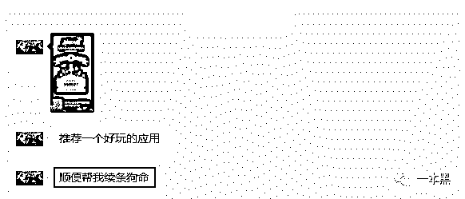
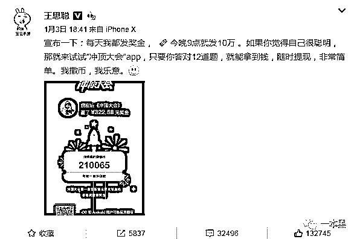
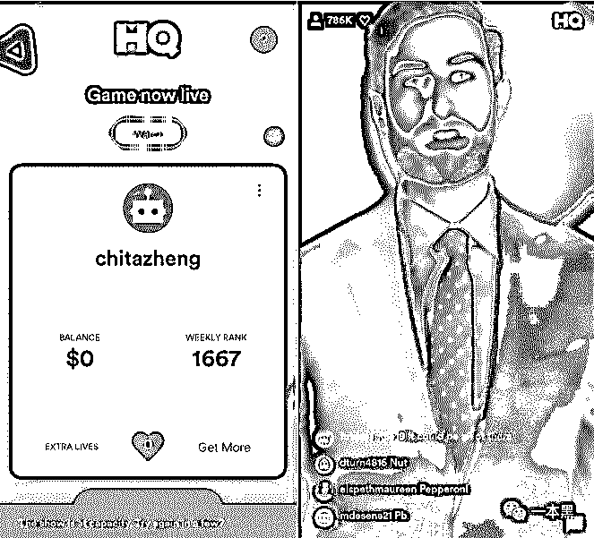
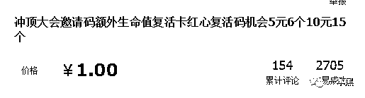
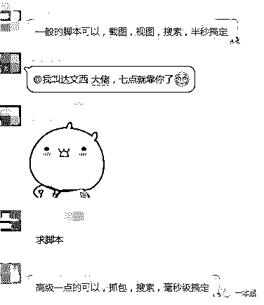
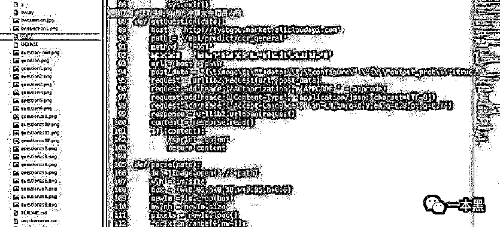
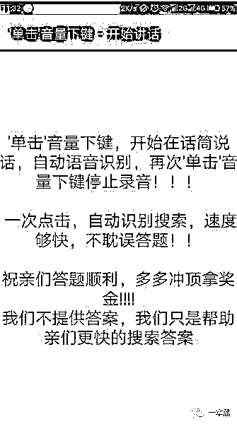
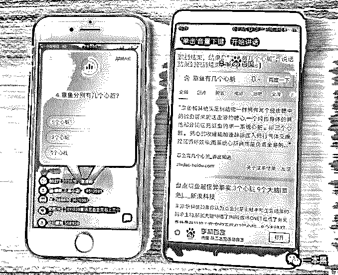
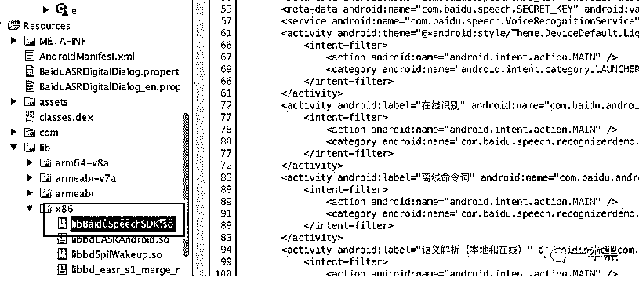

# “冲顶大会”类直播答题惊现“外挂”，一秒钟出答案，没想到吧！

> 原文：[`mp.weixin.qq.com/s?__biz=MzU4ODAwNzUwMQ==&mid=2247484008&idx=1&sn=2dec2fea2365532251c4df99a818009c&chksm=fde2134aca959a5cccb6682f32dd10cb1621a707941b6e8d84f981eaf6234314f249aa5dfbd4&scene=27#wechat_redirect`](http://mp.weixin.qq.com/s?__biz=MzU4ODAwNzUwMQ==&mid=2247484008&idx=1&sn=2dec2fea2365532251c4df99a818009c&chksm=fde2134aca959a5cccb6682f32dd10cb1621a707941b6e8d84f981eaf6234314f249aa5dfbd4&scene=27#wechat_redirect)

文/东东（微信公众号：一本黑）

责编/振宇

【一本黑】媒体或商业转载必须获得授权，个人转发朋友圈无需授权。

读完需要

8 分钟

速读仅需 3 分钟

* * *

一个爆款产品的出现，无疑会引来人们的争相模仿。

一方面暴露出其创新能力的缺失，另一方面也是跟风之气的泛滥。但即便如此，各路人马还是会有人赚得盆满钵满。

**答对 12 题，平分一百万大奖**

上周，一个名为二狗的朋友突然给我推荐了一款好玩的应用。

这款应用名叫冲顶大会，据说是一款益智类全民竞答游戏，只要答对十二道题就可以瓜分几十几万的大奖。

（我有一个朋友叫二狗，三年前认识他的时候，他还没有这么忧愁）

一开始我还将信将疑，但从对话中透露出他对这款应用的“信任”，索性我下载这款应用体现了一番。

游戏规则简单粗暴，在特定时间会有主持人进行主持，一共 12 道题，几十万网友同时作答，只要全部答对，就可平分几万甚至几十万的现金大奖。

每个人都有自己的邀请码，只要成功邀请好友进行游戏，就会获得一次复活的机会，进而继续答题。

其实，这款产品最早是由王思聪在 1 月 3 号生日当天发布微博进行了第一波推广，由此也正式揭开了直播答题的新模式。

和“吃鸡游戏”以及共享单车一样，该款产品一经铺开，即刻引来各路人马的跟风模仿。

花椒的“百万赢家”，映客的“芝士超人”，西瓜视频的“百万英雄”，就连一直播也在昨天发布了同类产品“黄金十秒”。

前后不到一周的时间，同类产品已经迅速到位，各家都在跑马圈地，迅速占领市场，准备瓜分这款新模式下的奶油蛋糕。

实际上，这类产品的出现并非先例，而是引自国外的一款名为 HQ 的产品，不管是从答题模式还是界面设计上来看，都和这款 HQ 如出一辙。

先不说中国互联网人的创新能力，在某些方面，单是眼光和对市场的嗅探能力还是值得肯定的。

老少皆宜且低门槛的游戏模式，让用户的参与没有任何的成本，加上这种知识答题的益智游戏内容，让这类直播答题平台很容易传播和推广，符合人人都可以参与的条件，自然就会迅速传播开来。

然而一个行业的猛然出现必定会带动一系列“产业”的发展。一些别有用心的人就在里面扮演起了“偷吃奶油”的角色。

一边是互联网巨头的烧钱战争，一边则是这群小喽啰的“生意之道”。

**直播答题还能有“外挂”？**

这类软件一经出现，有人跟风尝试，想通过答题赚点零花钱。

而有人却看到了其中的商机。前者我们可称其为普通玩家，后者则是赚这些普通玩家钱的高级玩家。

有一句话在一定程度上说得很在理：“赚那些想赚钱的人的钱，是最赚钱的方法”。

因为平台存在邀请好友即可获得一次复活机会这种机制，于是就有人通过帮别人刷邀请码增加复活机会来赚钱。

有人会说邀请好友不就行了吗，干嘛费这么大劲去购买呢！

对此我也无话可说，但这种现象确实存在，而且需求量还很大。

（5 元可获得 6 个复活机会，10 元可获得 15 个）

不得不说，在一定程度上，这类平台慢慢激活了玩家的原始赌性。

除此之外，甚至还会有一些付费的 QQ 群或者 YY 群，他们有专业的答题人会在群内直播答题结果。

这类群不在少数，少则几十上百，多则上千人。按入群费十块钱来算，一千个人就是一万块，这类高级玩家无疑是在秀自己的小聪明。也算是利用这波热潮赚了不少钱。

如果说这类玩家是在耍小聪明，那下面这类人则显得更加的高级。

有人甚至自己写了脚本工具，用抓包、调用人工智能等方式进行“作弊”答题。

这种辅助工具一方面用在群内服务付费玩家，另一方面他们还会出售这类辅助工具。可谓是“一个孩子套两条狼”。

（Python（编程语言）写了一款能够在网站上自动检索答题信息的程序）

老师傅解释道，这种程序的基本思路就是通过 adb 手机截图，然后用百度图像识别开发包识别问题，再进行自动搜索。

另外，通过渠道，【一本黑】又拿到了另外一款辅助工具，这款辅助工具采用语音自动识别，可以对平台中的问题进行语音识别，只需要一秒钟就可以获得答案。

拿到软件后，刚好赶上某直播答题平台的答题时间，于是我和老师傅就准备对这款软件的实用性进行检测。

对于比较明确的题目，使用这款软件确实可以在一秒钟就可以找到答案。

（测试效果图）

但是总体下来，这款辅助工具并没有那么好用，针对一些比较刁钻的题根本无法解答。比如：“以下那种动物的血是红色的”。

另外，如果普通话不标准，语音是根本识别不出来的，这和市面上大多数的语言识别软件是一样的。

其实，这种辅助工具的原理很简单，只是调用了某产品的语音识别功能而已。

老师傅通过破解该辅助软件的源码也发现了其调用的 SDK。

说到底，这种辅助工具并不难，难的是操作者的意识和思路。

**对于热潮，切勿盲目跟风**

实际上，平台放出的十万甚至百万大奖，由于火热程度水涨船高，参与人数日益上涨等缘故，即使最终全部答对 12 道题，瓜分到的奖金额度也会很有限。

而那么赌性被慢慢激发的玩家通过各种方式增加复活机会或是购买辅助工具，最终获得的奖金必定远不如所投资出去的钱，这又是何苦呢！

一定要相信，各路巨头大佬前期撒出去的钱一定会想办法在后期赚回来。对于只需要花十几万就可以获得几十上百万的优质用户，这样的获客成本简直就是赚到了。

你抱着侥幸心理以为能赚到一些钱，于是不停地分享给好友以获得复活机会，俗不知却给平台做了免费的推广。

你购买辅助软件想要助你答题一步登天，实际上却给那些“聪明人”多加了几个订单的机会。（只能说，还是太年轻。）

不管是 2017 年上半年的王者荣耀还是下半年的吃鸡游戏，每一个新模式的出现必定会引发一波全民热潮，各厂商也在其中争得你死我活。

2018 年的第一波热潮是否来得快去得也快我们不得而知，但对于普通用户来说，淡定且看透本质，切勿沉迷才是明智之选。

**直播答题，何去何从**

很多媒体已经分析过这款产品火爆的原因以及未来的发展趋势，但【一本黑】向来是一个区别于大众的媒体，总想谈点别人没说过的东西。

2016 年可以说是知识付费的元年，即用户付费获取知识。

那相对于这波热潮来说，付费的主体由用户自身变成了平台自己，用户通过答题不仅可以增添些许娱乐型，而且还有可能为自己的知识赚到一定的奖励，这在一定程度上也是这波热潮来袭的原因之一。

比如说，抢到一个一块钱的红包你可能会高兴一下，但如果你走在大街上看到地上有一块钱，你不见得会去捡。

以前有些 APP 推广的时候会有下载送十几二十元的活动，厌倦了这种套路的你肯定会无动于衷。

但如果出现一种新模式说答题可以瓜分几百万的红包，我想你一定会跃跃欲试。

同样最后得到的只有几块钱，为什么你会选择后者呢？**道理其实很简单，这个产品让用户觉得刺激，觉得爽，用户在答题过程中成为了主体，也体现了自己的参与感。**

但这波热潮仅仅只是一个开始，由于功能的单一性，用户必定会对其产生厌倦态度。

各大厂商也必定要考虑后期如何激活更多的用户和增加更多好玩的功能来留住用户。

直播答题的这波热潮算是直播行业新燃起的一把火，至于到底能燃多久，还得考虑用户的新鲜感到底有多久。

通过烧钱行为大肆扩展用户，并不是不可取，但如何在同类产品之间建立壁垒，拉开差距，在这场互联网的新战争中，我们也只能拭目以待。

突然想起前几年，支付宝集五福瓜分几亿红包的活动可谓是在春节前夕吵得热热闹闹。自那以后，春节的舞台不仅只有央视春晚，还有支付宝的集五福和抢红包。

对于抢红包这种新鲜事，只要在家庭群里发几个红包，不管钱多钱少，一年难见几次的父母们总是抢得最开心的一个。

今年的春节，不难预料，一家人开开心心地坐在一起吃着年夜饭，小孩在一旁追逐打闹，大人们拿起手机参与全民答题赢大奖活动。

竞猜结束，喝醉的老爸放下手机开始讲述他们那个年代的心酸往事......

还原事实｜专扒黑产

微信 ID：darkinsider