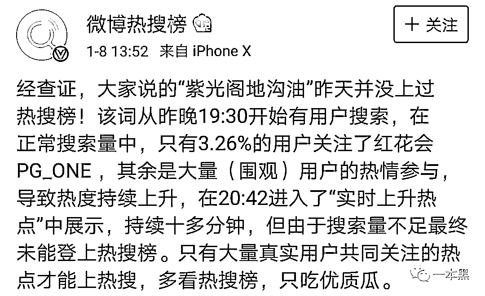

# 上榜只需六万块，微博热搜成灰产？紫光阁“饭店”变形记

> 原文：[`mp.weixin.qq.com/s?__biz=MzU4ODAwNzUwMQ==&mid=2247484002&idx=1&sn=7632c7fe1d8388f2b388f9e0fd48f7b0&chksm=fde21340ca959a561ecc8b100bd8ccffb44854c2ee868babef2969d17dd5d6c5e9a56c919110&scene=27#wechat_redirect`](http://mp.weixin.qq.com/s?__biz=MzU4ODAwNzUwMQ==&mid=2247484002&idx=1&sn=7632c7fe1d8388f2b388f9e0fd48f7b0&chksm=fde21340ca959a561ecc8b100bd8ccffb44854c2ee868babef2969d17dd5d6c5e9a56c919110&scene=27#wechat_redirect)

文/东东、小白（微信公众号：一本黑）

责编/振宇

【一本黑】媒体或商业转载必须获得授权，个人转发朋友圈无需授权。

读完需要

6 分钟

速读仅需 2 分钟

* * *

随着新浪微博的发展和日趋增长的用户基数，新浪微博这块肥肉也理所当然的成为了兵家必争之地。

从早期的论坛时代开始，水军就一直充当着舆论风口浪尖的操作者，他们是社交时代的反光镜。

虽然平台在变化，但他们仍然主导着公众的意识，潮起潮落间折射出整个网络社交的变迁。

看热闹是人之本性，也算是人们获取信息的渠道之一，这本就无可厚非，也实属正常。

但是当下的很多热门仿佛都已经变了味，着实有种挂羊头卖狗肉的感觉。对于操纵者本身来说，这是一种营销手段，主要目的还是为了博人眼球，到达名利双收的效果。

**“热搜生意”的推波助澜**

近日的“紫光阁地沟油”一事就是最好的说明。

嘻哈歌手 PG_ONE 被爆出与某女星的绯闻这几天算是刷了屏，在被紫光阁、新华网等官媒点名批评后，有微博爆出 PG one 的粉丝以为紫光阁是一个饭店的官微，于是想通过购买热搜榜“紫光阁地沟油”进行诋毁。

（图片来源于网络）

随后“瑟瑟发抖”的紫光阁也对此舆论做出了回应。

不仅如此，连王思聪 30 岁生日都被通过买热搜的方式登上热搜榜。

（王思聪发博调侃）

关于 PG_ONE 粉丝是否通过购买热搜进行报复一事，以及娱乐圈那些破事，诚然不是【一本黑】讨论的重点。

但是暗藏在微博运营体系中的“热搜生意”却在我们的调查下逐渐露出水面。

新时代的“水军”依然充当着“捧人”和“黑人”两个身份，他们深知广大网民的从众心理，只要结合当下热点，就能肆意妄为的调动网民的情绪，通过“借势”或“造势”的方式来达到营销的目的。

时代的发展并不允许这帮“水军”停滞不前，从最早期各司其职的水军团队，到现在通过软件+人工的方式实现营销的推波助澜，无不在体现其行业的更新迭代。

**新浪微博故意隐瞒“热搜生意”？**

虽然新浪微博官方否定了买热搜的说法，但是从声明内容来看，还是走了一个概念差，并不能充分证明此次事件非刻意人为。

官方说明中强调“紫光阁地沟油”未上热搜，但从众网友的截图中我们可以看到这个话题确实是进过微博实时热搜的，只不过没有到前 10。

新浪微博回应反驳的另一个点是该关键词的搜索量中关注 PG_ONE 的人只占 3.26%，因此没有“买热搜”的说法。

但事实上，若是一个工作室操纵关键词上热搜，旗下的小号并不需要特地关注 PG_ONE，毕竟他们只是一个推手。

由此我们可以判定新浪微博的这份回应不能被视作充分的反驳理由，只是钻了一些概念的漏洞。

**“热搜生意”是暗箱操作？还是另有猫腻？**

热搜榜单的买卖是否真的存在呢？答案是肯定的。

首先是新浪官方的买卖行为，长期默认的展示位是微博热搜榜的第 3 和第 5 位。其中第 3 位会有“荐”字提示，告知用户这是广告，而第 5 位则不会有任何广告说明，直接以热搜的形式出现，这也是众多甲方趋之若鹜的展示位。

官方买卖能确保时效且稳定，因此收费也格外昂贵，一般对外报价是 60W 人民币每天，实际按 6 折收取，即 36w 元每天。

除购买官方广告外，还有另一种上热搜的方式——**从事微博营销的专业工作室。**

基于多年的新浪微博运作经验及人脉资源，这些工作室通常都了解新浪的一些规则，比如上热搜的条件、被降权的条件等。

同时手里有相当数量的微博大小 V 资源协助，这些资源可能来自其它专业营销号公司，也可能是工作室旗下的自有账号。

相较于新浪官方，这些工作室的优势在于可买的榜单名次范围更广，同时单次收费也更加低廉，实时榜单前十位仅需要 6w。

而缺点则是时效不能保证，一般上榜时长一个小时左右，且只能确保排名的大致范围。若想上榜时长更长，则需要支付更多。

刷上热搜的方式也很简单，先由一个大 V 发布带关键词或话题的微博，再由众多小号跟着炒热，转发、评论和点赞，当话题上榜达到预期目标后就停止转发，之后只要没有其它话题赶超，该话题会一直维持在榜单上。

除了刷热搜榜单和话题榜单，这些工作室同时还经营着诸如刷转评赞、微博大 V 广告直发和转发、刷视频播放量、刷电影评级等业务，涵盖面非常广，几乎可以说是微博广告操作层面的一条龙服务了。

工作室通常会有一个专业的刷量平台，在平台上操作某条微博所需的转评赞数、转评赞的僵尸粉级别等等，辅助话题上榜。

在与该工作室的接触中，我们获得了对方曾经实操的一份营销案例，在这份案例中可以看到这个工作室全面的操作手法。

在确定话题和扩散方式后，该工作室将节目主持人的关键话题抛出，联合 KOL 参与，小 V 扩散，最终吸引普通用户参与，话题直接被刷上热门第二。

不过去年由于微博政策收紧，一些工作室已经暂停了卖热搜的业务，风头过后照样重来。这次紫光阁的事件一出，不少工作室也纷纷停下了这项业务，不过就像前几次一样，风头过后，这项需求量超大的业务必会卷土重来。

这次 PG_ONE 的八卦，早已变了味，我们讨论的重点也已经不是最开始的八卦那么简单。一个“工作室收买狗仔”、“工作室购买热搜、水军”的传言，一个 PG_ONE 粉丝购买热搜的乌龙，都将我们内心隐藏的不安瞬间牵扯出来。

一个社交平台可以轻易做到对言论的控制，你能看到什么不能看到什么都可能经过筛选，被收买的内容出现在你眼前，被认为不该出现的内容转瞬消失。

社交的多元化立刻被拍回泥里，这不是我们所希望的，它的存在是不合理。我们只希望在某一天，点开热搜，看见的是网民真实的选择，而不是任何人为操作的强行指引。

还原事实｜专扒黑产

微信 ID：darkinsider

* * *

振宇的碎碎念：

上周 4 号的时候，英特尔处理器曝出两个可用来窃取信息的漏洞，几乎近二十年的电脑、手机、云计算产品都会受到影响。

面对如此级别的安全事件，几乎所有提供云计算服务的公司都会第一时间升级补丁并且发出公告，只是公告的渠道各不相同，可能是公司网站也可能是新媒体渠道。

然而各路安全媒体在报道的过程中，专门点名列出了“没有公告”的厂商，而其标准是官网上是否有此通告。

对于这样草率的标准，不免有公关操作之嫌，何况根据随手查了两家被点名的厂商，在这篇文章发布以前，腾讯云和青云确实已经发布了公告，从公告的时间和升级的时间来看，各大厂商也是极其类似的，所以这里并不存在需要商榷的差异。

面对重大安全事件，几乎所有的厂商反应都是非常类似的，在这个点去找差异并没有任何意义。

简而言之，面向 B 端用户的媒体缺乏严谨性，安全问题与公关运作过于紧密，这两个现象都很让人失望。