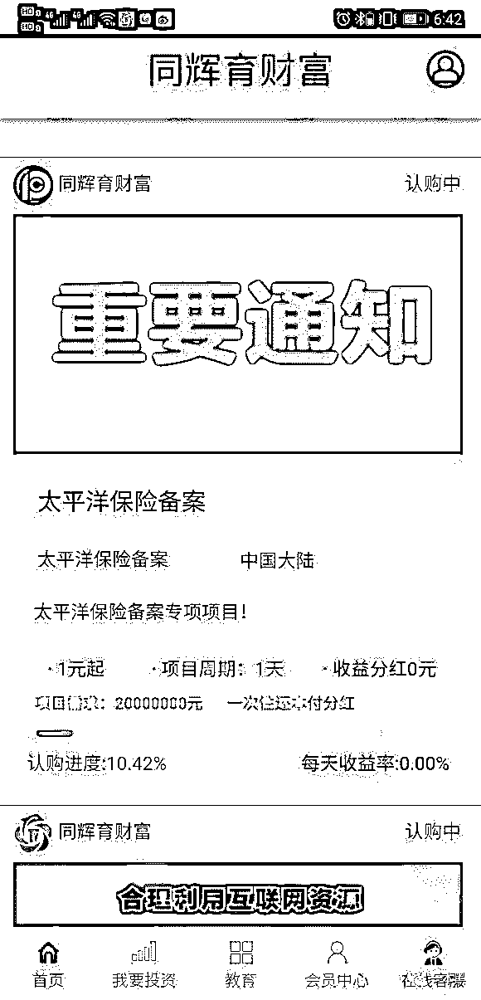
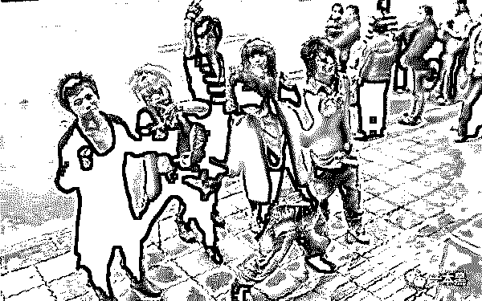
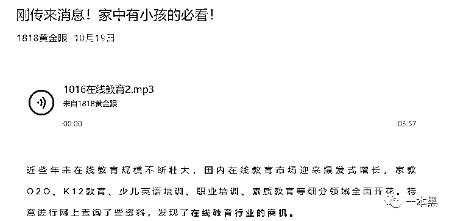
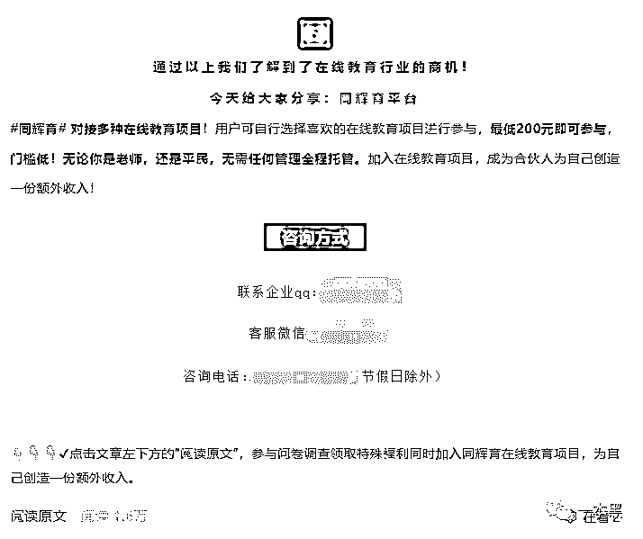
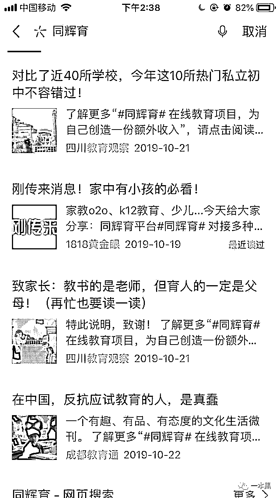
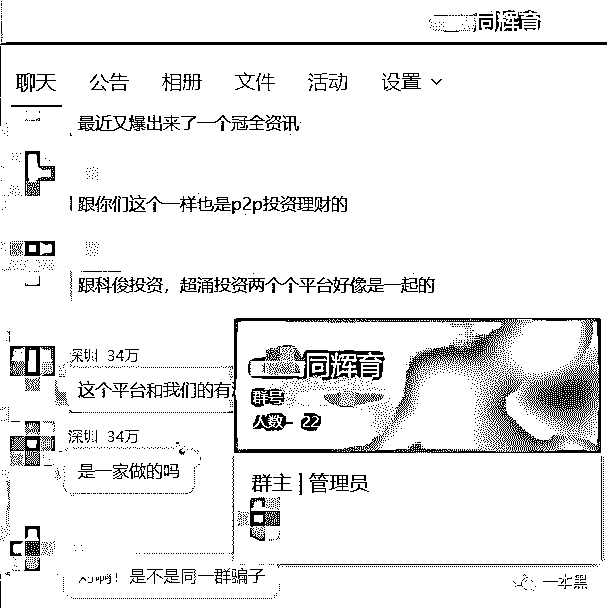
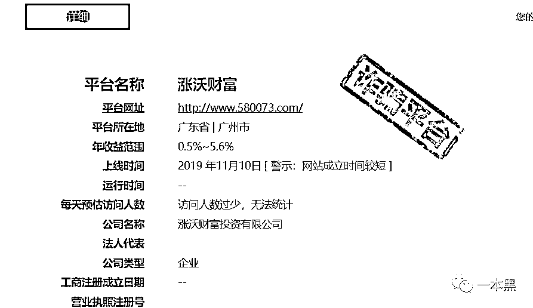
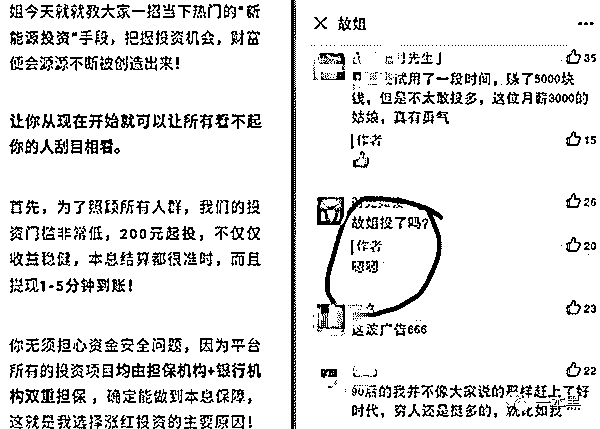

# 我在 1818 黄金眼，看到一条诈骗广告

> 原文：[`mp.weixin.qq.com/s?__biz=MzU4ODAwNzUwMQ==&mid=2247486952&idx=1&sn=14c1927a8b12298cf630c001da86afd2&chksm=fde21ccaca9595dcad83f96026f208f15fed1585532c87eae4a3ab73fbe5a9e90d8efd42dd3c&scene=27#wechat_redirect`](http://mp.weixin.qq.com/s?__biz=MzU4ODAwNzUwMQ==&mid=2247486952&idx=1&sn=14c1927a8b12298cf630c001da86afd2&chksm=fde21ccaca9595dcad83f96026f208f15fed1585532c87eae4a3ab73fbe5a9e90d8efd42dd3c&scene=27#wechat_redirect)

【黑话连篇】

该栏目更多的是揭露事件或对事件的看法，以达到让人精神升华的目的。

* * *

前几天有读者在后台爆料，说自己被骗了，P2P。不，应该是诈骗平台。我当时第一反应是，现在国家不是正在严打 P2P 吗？一些省份都已经开始全面清退 P2P 平台了，怎么还会有人如此嚣张，敢顶风作案。经过了解才发现，这事是结合广告、欺骗与冒名顶替等多种手段并用的一起恶性诈骗事件。**顶风作案的“P2P**”****事情是这样的，读者小曹说自己 11 月初在一个名叫【教师资格考试网】的公众号看到一篇推文，文章标题是《身份证 1997-2001 年出生的大学生注意了，再忙也要看一下！》大致内容说的是在线教育前景一片大好，同辉育这个平台值得信任，200 块起投，现在注册还送价值 XXX 元的红包。考虑这个公众号在业内还算资深、靠谱，加上自己也即将成为一名教师，自认对教育行业有一定的了解，多方原因综合，投了。平台说是连接各种在线教育项目，投进去的钱就是为了帮助他们做推广，赚了钱给分红，还会定期返还现金。第一个月的确如此，给了分红，返了本金。体验之后觉得还蛮靠谱，小曹决定加大投资，正好平台也推出了一个新项目，于是小曹投了一份。后来被客服通知，合同里写着，一次性得买八份，否则就是违约，会被起诉。由于法律知识储备不够，害怕被起诉，小曹不得不向朋友借钱填上这个空缺，前前后后差不多投了 34 万进去。等钱都投进去之后才发现，平台不能正常提现了。小曹意识到出事了，于是立马报警。经过对比查证，发现平台注册所使用的的资料完全是冒名顶替，App 上写着公司名是广州**投资，在天眼查上这家公司的注册资本为 3900 万，注册时间是 2019 年 4 月。旗下还有上千家子公司，但都是地产投资、物业管理之类，经查实和平台方毫无关系。收款方显示是深圳某公司，开户行是深圳市罗湖区某行，于是小曹立马返深报警，警方说可以立案，但是从报案到立案是需要时间的，也就是在这几天里，平台卷钱跑路了。12 月 3 号下午 5 点半，有人在贴吧发帖说平台预计要跑路了，让大家多留意。果不其然，当晚七点左右，大家开始奔走相告：同辉育正式宣告跑路，App 瘫了，官网关了，负责人也联系不上了。隔天贴吧就有人爆料，他们的新平台已经出来了，换了名字和网站，内核还是一样的。上面这个所谓的投资项目连名字都懒得起了，居然就叫“太平洋保险专项备案项目”。还真是敷衍。本着  斤斤计较 实事求是的优良美德，我想要去找找太平洋备案到底有没有这个项目，结果，太平洋保险没有自己的备案查询系统。只有中国保监会有备案产品查询，然后你就知道了，这玩意连名字都不肯起，根本就没得查。查不到算了，那就自己去体验一下。但是 App store 已经搜不到了这款软件了，网上也没找到安装包。我找不到关于同辉育的任何资料，备案、注册公司、业务范围、通讯地址，通通没有。看着贴吧里贴出来的截图，这个简陋的界面，不禁让我陷入沉思。这个款式，这个风格的 app，我一年到底能见着多少个。本来小曹还给我提供了同辉育的联系方式，最后也因为对方微信账号异常检索不到了，同辉育法务的 QQ 头像也一直是灰色的。根据收款方显示的企业名称，我从天眼查上找到了该公司联系人的电话号码，然后试图以支付宝转款的方式确认对方的身份，结果发现这就是法人代表的真实身份，姓名验证连猜都不用猜。通过这个号码也能找到这个微信，但是该怎么说呢？你一看到微信头像就知道这是黑市上买的三件套注册的。微信头像的确是真人自拍，但从发型能判断出那是二十一世纪初的产物，一个紧贴着镜头的大头照，200 万像素拍出来的照片，里面的人还顶着一头极其有个性的杀马特发型。

**

*就是葬爱家族的这种风格*

而这个电话号码也没在网上留下任何痕迹。用高德地图检索公司地址—广东省深圳市宝安区 XX 工业区 11 栋。查完才发现，哦豁，这个工业区一共才 9 栋楼。所以，这就是一个彻头彻尾的诈骗平台，公司是皮包公司，地址是虚拟地址，资料是随便冒用的大公司的信息。假的假的，一切都是假的。我们曾经说过，这类骗局之所以屡禁不绝，是因为骗子总是打一枪换一炮。这个同辉育平台或许已经有了很多个前身，以及无数个尚未可知的未来。只是我们目前还不清楚罢了。**真官 V 发假广告**再说回来，小曹之所以会注意同辉育这个平台，是因为他 11 月 6 号在【教师资格考试网】看到的那篇广告文。这篇广告目前已经删除，于是我联系到他们的编辑，想要了解具体的情况，并希望能拿到同辉育方的有效联系方式。然而这个公众号的编辑？客服?的回答却挺迷的，以下简称考试网

> *我：**你们曾经发布过一篇同辉育财富的广告文，请问对方的联系方式你们还有吗？**考试网：**嗯，怎么啦？**我：**这个平台跑路了，有蛮多人的钱被骗了，拿不回来了**考试网：**哪一个公众号？**我：**教师资格考试网**考试网：**我问了主编，我们没有发过吧。我们一般不接理财类的，直接教育方面的。**我：**（截图展示）这个，已经删除了，11 月 6 号发布的**考试网：**我们发布的是考研的内容，没有发理财的。**我：**那你能把那篇的内容再发我看看，确认一下吗？**考试网：**广告当月都删除了**我：**那你有他们的联系方式吗？**考试网：**没有**我：**那删掉的那篇文章，截图发我看看吧**考试网：**我不是编辑，我不负责内容，具体我不清楚。**我：**那你能把你们编辑的联系方式推给我吗？**我：**喂.......**我：**woc*

以上就是对方的全部回应，之后不管我再发什么，对方都没有再理过我，刚开始问是不是接过这个广告，对方的回答是肯定的。等我一说平台跑路，就开始各种不清楚，不知道，不了解，并且极力否认自己曾经发过这类广告。小曹说 1818 黄金眼也发过这篇广告，并且还没有删除，于是我看了看。诶，的确是同辉育的广告。于是我在 1818 黄金眼的后台留言咨询，但一直没有得到回应。      我不知道为什么 1818 黄金眼这样的民生节目会接这样的广告，毕竟他们的宗旨可是 **“关注民生，服务百姓 ”**。日常除了哈哈哈、666 和发际线小吴，《1818 黄金眼》在民间也被大家评为是一档有良心的民生节目。在豆瓣上，大家对 1818 的评分高达 9.5 分，甚至在我们的后台也曾有读者建议我们和 1818 黄金来次合作。可见对于这个节目，大家都是一致好评，我也不例外。但这次广告，着实让人摸不着头脑，为什么在 P2P 雷声滚滚的时候还要接这种广告？为什么接广告的时候没有对平台资质进行基本的审核？为什么平台跑路之后没有及时给出回应？除了这两个公众号外，还有一些的教育行业的公众号都发布了此篇广告，文案或许有不同，但都是同辉育的推广文。

或许，我们可以这样理解。这一次，同辉育玩的就是细分领域里的在线教育行业，瞄准了教育领域的大 V，专门挑他们做的广告。也就是所谓的精准打击。由于目标市场比较精准，所以受害者的人数没有那么多，一个声音想要被听见，一定需要无数个同音量的附和，但在同辉育的维权群里，我一共就只看到了二十几个人。大部分人都和我一样，潜水、默默围观。微博上有个叫同辉育诈骗的人，也仅仅是发了两条微博说了一下事情经过，之后就再没出声。这类平台现在已经开始玩精准打击了，不再像此前的趣步一类玩圈地运动，他们要的就是这种效果。10 月中推广，12 月初跑步，一个半月一个项目。小范围、低知名度、从圈钱到跑路的周期，尽可能压缩，这是新的玩法。当全国都开始严打 P2P 的时候，这种野鸡平台要圈钱，只能玩速度。广告文案各不相同，行业大 V 都在发，而且发的还是行业前景分析的文章，给用户营造一种“抓住这个机会，你就踩在风口上”的感觉。虽然对于平台并不了解，但是大 V 尚且可信，于是跟着大 V 走，是大部分投资人被骗的第一个理由。发文前几天，小曹说他们又发现了一个新平台，模式和同辉育一模一样，甚至资质都是一样的，叫涨沃财富。我去看了下。嗯，这次瞄准的是手游领域。51 网贷上赫然几个大字，写着诈骗平台。该平台 11 月 10 号上线，现在已经 12 月中下旬了，估计要不了几天又要跑路了。因为一个月前，就有人在知乎回答说试水了收益不错，现在也快到收网的时候了吧。也不知道这个平台是找谁打的广告。。。      **大 V 有责任吗?**前面说到小曹看的那个【教师资格考试网】，我一开始以为是教育部推出的官方网站，因为网址看起来也极其的官方。于是我去搜了一下，发现中国教育考试网（官方网站）的网址曾经是 ntce.cn（现已弃用），而全国教师资格考试网（也就是上文提到的教师资格考试网）则是 ntce.com。在输网址的时候，一个记岔，就李逵变李鬼。而教师资格考试网这个网址极其官方的网站，还推出了自己的同名公众号，但一开始他们叫 X 哥说教育，后来才改成现在这个名字。这个看起来像官 V 的公众号，其实是私人创办的假官 V，背后主体是一家教育培训机构，所以盈利是主要目的，接广告自然也是理所应当。至于是不是真的只接教育类广告就不得而知了，毕竟我也进不去后台，不知道那篇广告究竟说的是个啥。但不管是假官 V 还是 1818 那种真官 V，对广告内容缺乏审核是基本事实，也就是我们常说的恰烂饭。人人都得吃饭，人人都得挣钱，广告不精准，太频繁都尚能接受。但是骗人，不行。一年前，知名情感大 V“故姐”在文中植入理财广告，文章称，“200 元起投，满 24 小时收益，提现 1 分钟到账，现在加入还有 28 元现金赠送，每日签到可领 2 元。”这个文案和同辉育的何其相似，也同样是通过大 V 引流撒网，最终卷钱跑路的故事。故姐在其中充当的不仅仅是广告的作用，同时还从中拿提成，公众号既是传播媒介，也充当销售的职责（故姐推荐的某个项目，推荐人可享受 3%的提成）。正是因为故姐的卖力宣传，才会有那么多的粉丝出于信任投了文中的平台。      大 V 的背书，相当于给用户打了一针强心剂。因为相信故姐，投了相关平台的接近 500 人，涉案总金额高达 300 万。在故姐的广告发出去一星期后，几家平台纷纷卷钱跑路，最终故姐一号也被封。用这种手段来圈钱，实在是急功近利，但，罪有应得。离同辉育跑路，也已经过去大半个月了，目前发广告的公众号没一个吱声，甚至根本不承认自己发过此广告。互联网广告法只规定了广告内容的适用条例，却没有对广告发布方出具相应的管理法则，如果大 V 因发布诈骗广告导致用户财产遭受损失，是审查失责还是归为同谋？又或者同为受害者？具体该如何划分，出事之后，大 V 们是否需要积极配合调查，提供资料呢？自媒体领域不断的有新的大 V 涌现，变现的手段也日新月异，但广告这个最不费事的来钱手段，依旧是大家的赚钱首选。自媒体行业守则与从业规范，貌似并没有具体的规章制度可循。

* * *

年底了，人人都在努力冲年终奖，大 V 们也要冲业绩，各路牛鬼蛇神们也都出来准备大干一场。每逢年底，平台暴雷、电信诈骗以及各类老套的骗局又纷纷重出江湖，骗子们也都想赚笔钱回家过年。今年的经济并不那么景气，看到那种说“定期分红、收益稳定、前景大好”的非大平台好项目，还请捂好口袋。人人都想赚钱，你想要利息，骗子想要你的本金。有句话在江湖上流传已久，但现在仍然适用，叫*土豪死于信托、中产死于股票、草根死于互联网金融。*牢记，共勉。*大家好，我是老黑。*
*早年做过技术，也做过自由调查记者，曾协助警方打掉产值上亿的色情网站、也干掉过骗了无数人的非法集资。**之所以写【一本黑】公众号，是想用最简单的语言，告诉大家，这个世界上真的存在魔鬼，不然你没法理解人性。**为了防止失联，请加我微信：****ofcourse9528***

**推荐阅读：**[私密社群，快上车](http://mp.weixin.qq.com/s?__biz=MzU4ODAwNzUwMQ==&mid=2247486383&idx=2&sn=0821d0bff33285d235b2e1b9af9a9e27&chksm=fde21a8dca95939b496421a2177f83d8022e5a25ce95ea8b2929b17b26fe95aeb5ca902b722a&scene=21#wechat_redirect)[心灵培训才是当代智商收割机的 top1](http://mp.weixin.qq.com/s?__biz=MzU4ODAwNzUwMQ==&mid=2247486873&idx=1&sn=5f0a2b851c0f036379c759c54086f055&chksm=fde21cbbca9595ad9353ad10160aebd04399ae7bff000dc4e7894538950c385282d193730121&scene=21#wechat_redirect)[花两万块让孩子学脑门吸铁勺？](http://mp.weixin.qq.com/s?__biz=MzU4ODAwNzUwMQ==&mid=2247486934&idx=1&sn=bac18372b12157b53a7d1244b26b0455&chksm=fde21cf4ca9595e2406f08caa8af660714d148c60c3bbd9ffcb1433fc9b696c6bdb4072543c0&scene=21#wechat_redirect)[恕我直言，这届家长可能要治治脑子](http://mp.weixin.qq.com/s?__biz=MzU4ODAwNzUwMQ==&mid=2247486934&idx=1&sn=bac18372b12157b53a7d1244b26b0455&chksm=fde21cf4ca9595e2406f08caa8af660714d148c60c3bbd9ffcb1433fc9b696c6bdb4072543c0&scene=21#wechat_redirect)