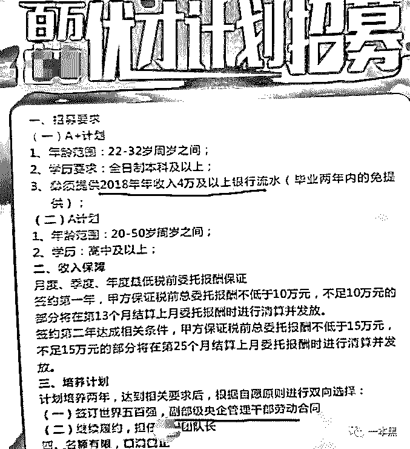

# 求你们别再去干保险送人头了

> 原文：[`mp.weixin.qq.com/s?__biz=MzU4ODAwNzUwMQ==&mid=2247486793&idx=1&sn=5a9a6cef5298f22e9e42746d43fe31e7&chksm=fde21c6bca95957d1edac6d5bd71937ff4fb6ca00c9b05179162d7ae177e804f6e0022a3c730&scene=27#wechat_redirect`](http://mp.weixin.qq.com/s?__biz=MzU4ODAwNzUwMQ==&mid=2247486793&idx=1&sn=5a9a6cef5298f22e9e42746d43fe31e7&chksm=fde21c6bca95957d1edac6d5bd71937ff4fb6ca00c9b05179162d7ae177e804f6e0022a3c730&scene=27#wechat_redirect)

【黑话连篇】

该栏目更多的是揭露事件或对事件的看法，以达到让人精神升华的目的。

* * *

你朋友圈里有那种一天到晚发养生知识、汽车保养、个人财富升值的朋友吗？我有，好几个呢。不是家人，不是同事，是微商和卖保险的。不对，卖保险的这个称呼一点都不专业，人叫保险代理人。除了父母之外，整个朋友圈最关心你的人，非他莫属。有人关心你的健康，也有人关心有没有房，房子够不够大，他们是卖房的。哦，不，房产经纪人/置业顾问，你的贴心房产管家。微商、卖房的、卖保险的是朋友圈里的真情铁三角，一旦有任何突发事件，他们一定第一个发来慰问的。这样体贴的朋友，如此真切的关怀，试问谁不会感动。所以我们今天就来聊聊保险代理人这个 “温暖人心” 的职业吧。**我在世界 500 强卖保险**前阵子抖音上有个视频，是一个女孩子在镜头前哭诉自己在*安卖一年保险，钱没赚着，反而还负债 3 万。对外也没卖出去几份，自己和家人却买了 4 万多块的保险。对象也不理解自己，现在日子过不下去，想要离婚。这个视频发出来没多久点赞就上万了，但很快又被删除。具体原因咱也不知道，或许有啥内情，或许是舆论的压力。但保险代理人的生存状况，的确如她所说，甚至比她状况还糟糕的大有人在。而且并非只是*安一家的保险代理人如此，几乎整个行业都是这么个样子。其实卖保险，也分为两种，保险代理人和保险经纪人。通俗点讲，这两者的区别就在于，代理人只卖一家公司的保险；而经纪人可以卖很多家公司的保险。那个在视频里哭诉的女孩就是保险代理人，而代理人并不与公司签署劳动合同，所以并不是公司正式员工，也享受不了公司的高福利。知乎上有个话题叫【在中国*安工作是一种怎样的体验？】，从曾经*安保险代理人的诸多回答中，我了解到作为保险代理人这份工作到底有多坑。不管是哪种身份，主要职责都是卖保险，区别在于怎么卖，卖什么。【保险代理人】字太多了，为了方便，后文就直接用销售/卖保险的代替这个拗口的称呼了。不管是什么行业，基本上每一个做销售的人最开始都是被无责任（高）底薪所吸引的。不管这个月销售业绩怎么样，该给的钱公司都得给。就算一样都没卖出去，也不至于饿死，卖保险也同样如此。但是你看到的并不总是真相，招聘时人事和你说的也不是真相。比如 3000 的底薪，想要全部拿到手也不是件容易的事，因为这 3000 的底薪可能又是，1500 的基本工资+800 的补贴+200 全勤+500 新人奖。其中补贴要求全勤，请假一次扣 500，两次三次全扣这样。加上请假本身扣工资，那么如果你这个月请了三次假，又没卖出保险，那你这个月到手的钱可能就一千出头。即使你下个月全勤也不一定能拿到全额，因为总有各种扣款的借口。如果你一直卖不出保险，别说补贴，基本底薪可能都没有了。这个时候，你的上司，你的同事会纷纷伸出援助之手，教你开单。基本上每个卖保险的，第一单都是“自杀”。为什么叫这个名字？因为卖给同学朋友叫杀熟。卖给自己，自然就叫“自杀”。作为销售，自己买的第一份保险往往也是自己职业生涯的开端。作为员工，第一份保险基本算公司送的。因为佣金+业绩，差不多都能抵扣保费。再说了，给谁赚都不如给自己赚，于是很多销售，毫不犹豫选择了自己买。但一个很重要的问题却往往被忽视，保险缴费是有年限的，而且还是连续的。虽说第一年保费白送，但一份保险动辄交二三十年，累积下来也是一笔不小的费用啊。自己买保险是第一步，由于初入保险行业，人脉积累和经验有限，很多人的第二份、第三份乃至第 N 份保险，仍然是卖给自己身边最亲近的人，也就是杀熟。自己买完给家人买，家人买完换亲戚，之后同学邻居挨个轮一遍。干了保险，基本身边的七大姑八大姨，近的远的都得保持良好的关系，说不定人家哪天就心动想买保险了。有的销售还会根据亲戚的年龄、财产、有无孩子等情况画个小本本，毕竟知己知彼才能逐个攻破。卖保险并不是只要撑过前几个月就好，当你把亲戚朋友都问遍之后你才会发现，越往后越难。熟人没有意向，陌生人不会轻易相信你。医疗知识、保险规划对于基层销售来说也是一件难事。所谓万事开头难，然后中间难，最后结尾难。虽说保险佣金高，但保险的佣金实际上是逐年递减的。卖出去一份保险，第一年的佣金大概为保费的 30%—50%，次年大幅下降，三年后基本没有。而一般缴费期为 20-30 年的重疾险，佣金约为保费的 5%以下。假设这份保险，年缴费 1 万，那么这一单的全部佣金最高也就是 1 万。据说主管级别的佣金能往上再加个 10%-15%，但前提你得完成足量的单。对普通销售来说，能开单就谢天谢地了。升职加薪，一切随缘。我没有干过保险，但我身边有卖保险的朋友。虽然我成天看她们发各类车祸新闻、保健知识、保险促销活动，但是他们却都很低调。从来不在朋友圈晒收入，这方面和微商完全不同。高佣金之外是更大的隐形开支，做买卖做的其实是人脉生意。为了开拓人脉、维系人情、发展团队，各种请客吃饭、团建聚餐肯定少不了。这些钱公司肯定不可能帮你出，这些得自己摊。万一碰上抠门的公司，可能资料打印费都得自己掏。嗐，还有税呢。这些不都是支出，花钱的地可比赚钱的地儿多多了。据说每个销售，平均每个月能开个一两单（均保费 5000 以上）就算业绩不错的了。二八定律在任何行业基本都是成立的，但绝大部分人都只是那 80%，什么屌丝逆袭，年薪百万，出任 CEO 迎娶白富美的故事，听听就得了。要记住你是琼 B 的事实，赚钱要慢慢来。一步登天的事，难~踌躇满志入行，最后悄然黯淡离场，这才是大部分人的真实写照。**为什么保险公司永远在招人**不知道你有没有注意到保险公司和地产中介，这俩永远在招人。除了上面说的主动加入销售行列的人，还有一部分保险销售则是被各类高薪招聘广告忽悠进去的年轻大学生。就和地产公司的管培生一样，一出校门就年薪十几万，呆满三五年就直接晋升经理级别，可真是前途无量啊。保险公司的储备干部、优才计划也同样如此。在昆山这样一个县级市，月薪 15-20k，还有额外绩效奖励、交通补助、补充医疗保险、员工旅游，并且还是双休。这样的工作即使放在北上广，待遇也算得上相当不错了。并且，这个岗位没有任何经验和学历要求，简直不可思议。emmmm，但业内人士爆料，这些所谓的高薪岗位，XX 干部，招进去都 TM 是卖保险的，还有什么内勤岗位也是卖保险的。至于月薪 15k，只要你每个月卖出 30 万的保险，按 5%的提成，那收入就是 1 万 5，没毛病啊。
进去之后得先培训，培训要培训费和考试费（考代理证），考到证之后要交保证金。交完之后你就可以持岗上证卖保险了，不说多了，在你正式上班前你起码得先给公司交 500。（*注：**不管是通过哪种形式成为代理人，想要卖保险就得考证 *）
不要疑问，为什么这么不合理的招聘都会有人上当，因为是大公司出面，人面试的时候也不会和你说是让你去卖保险啊，一般都说是理财。谁能相信世界 500 强招储备干部是进去是卖保险的呢。

**

*某保险公司的百万优才计划*
就像大学生毕业去干管培，因为那是校园招聘啊，能进入学校招聘的企业，起码学校会审核，而且还都是学长学姐带队。再说了，谁愿意一辈子当职员，不想当领导的职员不是好干部啊。有学校背书，有 500 强名头撑着，谁知道挂羊头卖狗肉的事会这么明目张胆。再说了，就算说了是去卖保险的，一堆胡吹乱侃之下，哪个面试者还会细想。高工资、高福利，还是大企业，那多半出不了岔子。。被招进去的“干部”、“优才”、“内勤”们并不总是和上文的那些销售们一样，需要出去拜访客户，出门应酬。他们有的要出门推销；有些干的是客服坐席，也其实就是电话销售。有时候我们总会接到一些推销电话，一开口就是，“你好，我是 XX 公司的 XXX，我司现推出 XX 产品......”。这种照本宣科，毫无互动气息的推销电话十有八九就是他们打来的，初初接触销售的人，都是按照公司给的话术，一个字一个字照着念。虽然这是他们鼓起勇气才拨出的电话，念出的台词，但我依然会毫不犹豫地选择挂掉。都是成年人，大家的日子都不好过......这些客户名单都是“正规”渠道来的，比如大公司旗下肯定会有很多类型 App，比如什么证券、车险、医疗、教育等，这些平台的注册用户都是对相关领域有明确需求的人，所以就，自产自销内部消化嘛。比如关注车险肯定是因为已经买了车或者即将买车，这是多么精准的 打击 需求。所以你每次注册完 xxAPP 就能接到一堆的推销电话，可能是卖保险的，可能是卖理财的，也有可能是卖墓地的，具体取决于你当前的需求和该公司及其合作伙伴旗下的业务。至于你有没有购买的需求，想不想接电话，谁管你呢。反正电话在手，打不打随我。是吧~~~初出茅庐的愣头青被挂了电话会觉得很挫败，很失落，但时间久了也就习惯了。甚至能够微笑着开始下一个。打电话其实也有一些成交几率，比如长期 996 或者 007 的秃头青年，重疾险和意外险对他们来说的确是刚需。但这么容易成交的客户肿么可能轮得上毫无资历的新人。暖名单（垃圾名单）才是他们的资源，电话那头可能真的就是一个没有钱、没有购买意向，就为了一筐鸡蛋留下自己信息的人。他们有可能成交吗？也有可能，只要这笔买卖足够划算，比如卖保险相当于拿钱去投资，每年都分红；原价 9999，现价 999，内部折扣仅限优质 VIP；买就送价值 xxx 元的净水器/电饭锅，保险白送.....有的时候，有些客户会提些无理的要求，比如加微信，看照片，约饭聊天，还带着暧昧暗示的那种。小女孩肯定打心里排斥这种客户，钱再重要也抵不过尊严。但是上级觉得这是成交的好机会，得先拿话哄住客户，其他的等成交了再说，这叫稳单。总之，你得让客户觉得自己不是在花钱，而是在占世界 500 强的便宜，不管是钱的便宜还是什么其他的便宜。所以有时候，为了成交，销售会使用一些不太真切的描述。客户买完之后才发现这和网恋奔现一样不可思议，不晓得自己怎么就鬼迷心窍掏空了口袋。碰上那种实在掏不出钱，但被忽悠的很想买的客户，可以让他们去办银行卡、借网贷，反正买到就是赚到，不会亏的。为了出单，你得暂时把良知搁到一边，一咬牙一狠心钱就到手了。扛的过去慢慢就继续在保险行业摸爬滚打，但大部分都过不了自己那关。0 成交让他们背上一身债，最后默默离场。除了那几张令人秃头的保单和干瘪的钱包，他们什么也带不走。哦，或许走的时候，上级还会以你的业绩太差拖团队后腿为由，让你买份保险再走。来都来了，不掏干净口袋，怎么好意思走。至于为什么总是在招人呢？因为你的上级他也卖不出去保险，所以要招人，招一个人能拿一两百块或者更多的奖励。此外，谁招进来谁带，招进来就算是自己旗下团队成员，成员卖出去保险，上级也能拿一定比例的分成。 所以咯，卖不完的保险，招不完的人。**别去送人头了，真的**保险公司的套路远不如此。那些从月薪 2000 到年薪百万的领导从来不会告诉你，他每个月要给自己和家人付多少保费。他也不会告诉你，为了维持自己成功人士的表象，每天压力有多大。他甚至不会告诉你，看似左右逢源的背后，是亲戚朋友都不再往来的事实。你也不知道他们为了立人设，到底给自己加了多少戏。什么诺贝尔奖、美国总统、海豹突击队、叙利亚解救人质信手拈来。这是怎样的想象力和创造力，微商朋友们都不敢给自己戴这么华丽又厚重的皇冠呢。卖保险和干微商有一个共同点，都喜欢先朝身边的亲朋好友下手。也不是说他们骗人，微商的商品未必差、保险未必坑人，但这不是必需品你明白吧？不是必需品就不会人人都想要。就像我喜欢学高数，沉迷各种数字的排列组合，但你非得让我去看苍老师。虽然苍老师是促进全人类可持续繁衍的重要担当，也是我们极重要的幸福源泉，但我不喜欢，看的再多我也不快乐，求而不得才最痛苦，你明白吧。快乐的方式有很多种，只有高数才是我的解药。而苍老师，不是。卖保险的人总是强行给你灌输【缺了这个，你的日子就不行了】的观念，诱导你去买保险，你买完之后还叫你拉动你的身边人买。一个接一个，卖个保险搞得和拉人头似的。别去了，真的。还有啊，想要干好保险，你得先给自己洗脑吧。你得先劝服自己，这个保险是自己需要的是必买的，你才能让别人相信。自己相信的下一步就是自己购买，这个东西这么好，你自己都不买，这说不过去不是，于是各种保单一张张飞进口袋，一摞摞人民币离家出走。所以啊，你这不是去保险公司上班的，你这是去当客户啊。没卖出保险，先自己买一堆，这不是送人头是啥。再说了卖保险也不是人人都能赚大钱，如果是因为干其他的不赚钱才选择做这个，那卖保险也未必能赚到钱。能力要积累，经验和人脉不也同样如此？做销售必须得会识人，你行吗？恐怕不行，因为保险公司的套路轻而易举就把你网进去了。想要找轻松工作，上班自由，但是自由和财富不可兼得，你能接受吗？保险也是个专业的行当，保险、医疗、教育......这些行业都了解吗？最新政策知道吗？光会发朋友圈也不行啊。家里也没矿，上班都是为了赚钱。既然赚不到钱还可能负债，去了干嘛呢？听听前人的意见，看看别人的经历再认真考虑这行是否适合自己，别蒙头蒙脑，觉着能赚钱就一头扎进去。可能最后，你学会了刷信用卡，学会了装 13，学会了虚与委蛇，但就是学不会卖保险。真的，咱别去保险行业送人头了。最后说一点，我们从来不否认保险在关键时刻的能起到重要作用，甚至能救命，毕竟我自个也买了保险。但是保险归根结底是个专业的活计，专业的事情需要专业的人来做。别去给保险行业送人头，也不要自以为能抵抗一切风险。如何根据自己情况，合理规避风险是每个成年人的必修课。毕竟，像我这样的 00 后都开始秃头了，还有什么意外是不能发生的。*大家好，我是老黑。*
*早年做过技术，也做过自由调查记者，曾协助警方打掉产值上亿的色情网站、也干掉过骗了无数人的非法集资。**之所以写【一本黑】公众号，是想用最简单的语言，告诉大家，这个世界上真的存在魔鬼，不然你没法理解人性。**如果你想认识我，不妨加我微信：****yibenheiSW***

**推荐阅读：**

[私密社群，快上车](http://mp.weixin.qq.com/s?__biz=MzU4ODAwNzUwMQ==&mid=2247486383&idx=2&sn=0821d0bff33285d235b2e1b9af9a9e27&chksm=fde21a8dca95939b496421a2177f83d8022e5a25ce95ea8b2929b17b26fe95aeb5ca902b722a&scene=21#wechat_redirect)

## [网贷打赏女主播的，全是傻逼，有一个算一个](http://mp.weixin.qq.com/s?__biz=MzU4ODAwNzUwMQ==&mid=2247486749&idx=1&sn=3f55887d61b8f5833a075f513e43b6cd&chksm=fde21c3fca959529da658a51e08a0d9c49fe571207d32b4fb2c776a82329b5273b3acb456f65&scene=21#wechat_redirect)

[比 PUA 更可怕的，是“诱导自杀”](http://mp.weixin.qq.com/s?__biz=MzU4ODAwNzUwMQ==&mid=2247486765&idx=1&sn=718798556ac6cc59b5599dcde67fce1e&chksm=fde21c0fca95951911288fc2af8dccc14d97a4bcb096d066f26cf0f13f70ffbdd8a1188938e7&scene=21#wechat_redirect)