# 比 PUA 更可怕的，是“诱导自杀”

> 原文：[`mp.weixin.qq.com/s?__biz=MzU4ODAwNzUwMQ==&mid=2247486765&idx=1&sn=718798556ac6cc59b5599dcde67fce1e&chksm=fde21c0fca95951911288fc2af8dccc14d97a4bcb096d066f26cf0f13f70ffbdd8a1188938e7&scene=27#wechat_redirect`](http://mp.weixin.qq.com/s?__biz=MzU4ODAwNzUwMQ==&mid=2247486765&idx=1&sn=718798556ac6cc59b5599dcde67fce1e&chksm=fde21c0fca95951911288fc2af8dccc14d97a4bcb096d066f26cf0f13f70ffbdd8a1188938e7&scene=27#wechat_redirect)

【黑话连篇】

该栏目更多的是揭露事件或对事件的看法，以达到让人精神升华的目的。

你听说过“诱导自杀”么？远隔千里，一根网线，你就能轻飘飘的离开这个世界。最近，一篇揭露抑郁症诱导自杀的文章流出，其作者伪装成一名抑郁症患者，向这名号称可以“帮助你自杀”的人发出“求救”。但作者并不是真正的抑郁症患者，双方都非常谨慎，最后因为具荷拉事件，部分抑郁症患者的焦虑加重，所以决定提前将文章发表，尝试挽回更多的生命。联系到这两年无数因抑郁症离开的生命，我们无法抑制的愤怒。真实骇人听闻，对病痛之人下手，本已其心可诛。更令人愤恨的是还要收取自杀者的钱财，换言之，你的命，你的钱，我都要。这个魔幻的世界还要带给我们多少震撼？花季生命已逝，作恶多端的人怎能依旧挥起屠刀？**诱导自杀事件始末*****（高能预警：**为不影响办案，所有涉及当事人的信息全部模糊，聊天记录图片不会放出。）******一位微博用户 A 连续发布类似“帮你自杀”“帮你离开这个世界”等言论。******微博用户 X 的用户用自己的小号进行了伪装，与其进行了长达五天的私聊，其中因为担心微博查封账号，将聊天平台由微博转到微信。******A 的微博一直在为一些抑郁症患者的微博点赞，点赞内容都是明确表示有自杀想法的言论。******       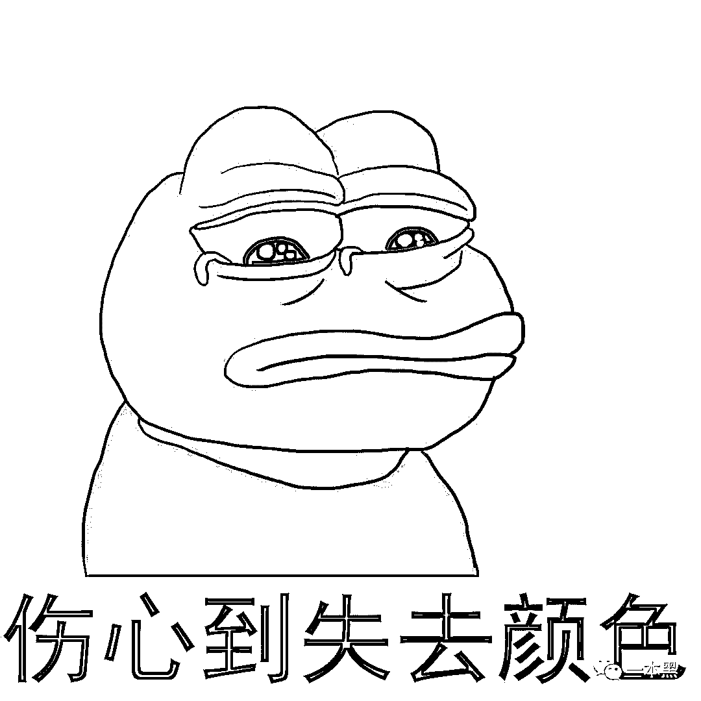      ******抑郁症不同于其他疾病，外人无法共情，甚至连医生都不能感同身受本人的痛苦。家庭、社交关系等其他因素，再加上自身的失眠、疼痛等身体上的病症，都让他们极其绝望和悲伤。******又加之本身病症的表现，他们通常无法通过正常方式向外人求助。所以他们在深夜发出的微弱和孤单的讯息，是属于抑郁症患者的呐喊和求救。******冬天仿佛是抑郁症的高发期，2017 年 12 月，韩星金钟铉因抑郁症在家中烧炭自杀。死后金钟铉的粉丝才在金钟铉的纹身上发现相关讯息。******       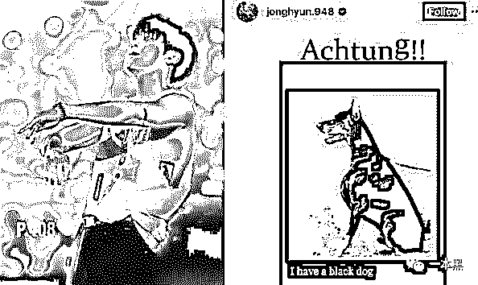      ******金钟铉此前发布的 ins 中，图案有这只黑狗，其身体上的纹身也有同款，黑狗上方的文字“Achtung”是德语注意的意思。******英国前首相丘吉尔曾说过“心中的忧郁就像一只黑狗，一有机会就咬住我不放”。这是金钟铉发出的求救信号。******抑郁症患者，有时候不是想死，或者不想死，而是他们“不得不死”。在金钟铉生前，无人关注到这个求救讯号，号称偶像身上每一个毛孔都了解的——金钟铉的粉丝，也没有关注此事。******抑郁症患者的呼救是无声的，通过社交平台宣泄是其小心翼翼伸出的一根触角，绝对不可以被有心之人利用，来进行生命的掠夺。******       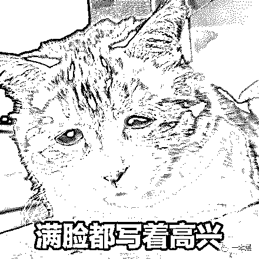      ******通过有效的治疗，或者身边人合理的鼓励，抑郁症患者的病情能够得到有效的控制，就算是对于正在病中的抑郁症患者来说，朋友、家人、甚至陌生人的陪伴和鼓励都有可能陪伴他们度过今天的黑暗，拥有多一天的治疗机会。******对抑郁症患者来说，任何对轻生念头的肯定行为，都在鼓励他们更快走向死亡，此外，他还会主动发送私信，询问是否需要帮助。******没有一个人可以决定另一个人的生死，可是这位“A 用户”却号称可以帮忙布置自杀的场景，想好所有的环节与细节。******这是诱杀？还是他杀？轻飘飘的语气让人不寒而栗。我们能推测，这样的聊天和交谈是他的日常交流方式。在聊天过程中，A 更新了一条新的微博动态，让人脊背发凉。*********“第十二个。******”*********我猜大家不约而同的都拥有同一个设想：他诱导自杀已经成功了第十二个人。真实美剧情节，《犯罪心理》中的变态杀人狂就在我们的身边。******当然这不是什么美剧，是真实的，鲜活的，跃动的生命从这个世界上被抹去了。******       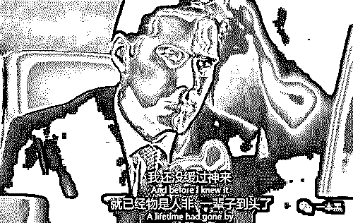      ******虽然已经行至悬崖，准备纵身一跃，但只要最后一步没有迈出去，就仍有被拉回来的可能。这时，有一只无形的黑手推了你一把，从此万丈深渊，无法回头。******这怎么能不是谋杀？******更过分的是，A 声称可以通过邮寄的方式寄去进口药物，一支 340 左右。******你们看到了么！！！！杀人他妈的还要收钱！！！！******       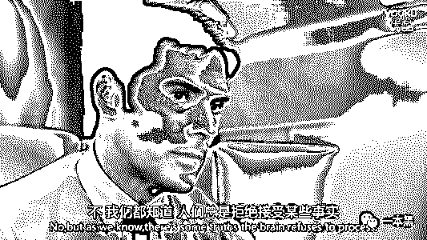      ******当时看到这里，我已经不会打字了，对于人性之恶一本黑讨论过很多：征服欲、兽欲、控制欲、窥视欲等等。******由于出生环境和生长经历不同，既然无法共情那尽可能做到理解，我对欲望一般都秉持着“允许你存在，但你要控制”的包容心理。******可谁能想到世界上还有杀人拿钱这种事呢？一百万和一分，多少都不嫌弃。命都在你手里了，你害想咋地。******冷静下来想，诱导自杀这类人有一个共同特质，控制欲非常强的人且心理素质非常好，遇事冷静，所以才企图通过精神控制他人。此外，故事里的 A 还是一个性虐待的狂热玩家，曾关注过大量的 SM 账号。******另外，这类人通常是典型的拥有“上帝和救世主”人格的人，沉迷操控生杀大权，期盼着整个世界都臣服于他，所以才会诱导别人自杀，以此获得成就感与骄傲感。******A 自称价格昂贵的安乐死在国内没有办法进行实施，而某些药物麻醉类药物是我们都能想到的自杀场景，A 所谓的自杀场景构建，不过就是寄去一支**340 块钱的药物** 。******诚然，在生命的逝去面前，340 块钱什么都不算，但是其所号称的自杀场景构建里，打款一支 340 块钱的麻醉类药物，是不是有些啼笑皆非，荒唐可恨。******             ******一件事情会结束，但诱导别人自杀的凶手一定不止一个，更多的受害者也仍在继续走向死亡……******这篇文章发出的时候，A 的微信微博都已经被官方封禁，但我们都明白，一个恶人倒下去，随之而来的只有更多像他一样的人被发现，被曝光。******我们所知道的黑暗，通常只是冰山一角。针对女性的 PUA，不仅仅是对女性进行情感控制，甚至也会对女性进行诱导自杀，诱导女性用死亡的方式来证明对自己的爱。******        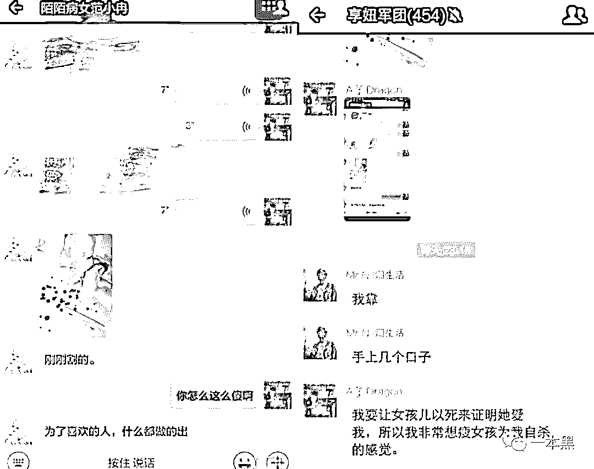       ******而利用抑郁症患者的病症下手，也不是时至今日才出现的问题，之前各大媒体平台也都有用户曝出有人在进行诱导自杀。******       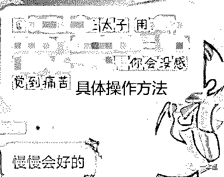      ******这些生命是不是全部逝去我们不得而知，但是据 A 所言，两个生命是他亲自参与，我不能想象他是如何亲力亲为的操纵生命的逝去，但仅仅想到这个事件，也会心头发慌，一阵恶寒。********雪莉和具荷拉**********雪莉和具荷拉都曾是韩国女团的成员，两个人都患有抑郁症，我不把抑郁症的患病原因强加给任何人，我们只谈事实。**********雪莉在生前因为不穿内衣出镜遭到了网络的暴力和非议。具荷拉则是被前男友拍摄了隐私的视频和图片以此威胁，视频和图片没有传播，单是具荷拉下跪恳求前男友的事件被曝光，就让具荷拉遭受了同样激烈的网络舆论。**********       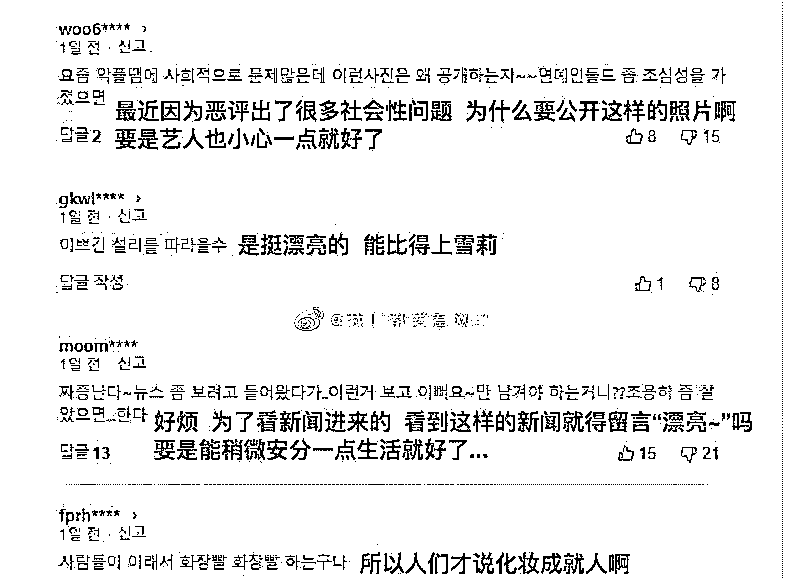              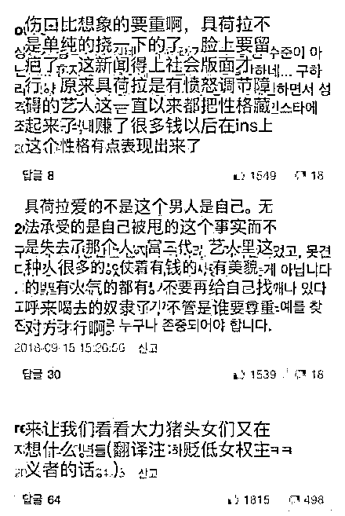       **********具荷拉曾在今年五月份尝试自杀，但是被经纪人救下。雪莉则是在今年 10 月份被人发现自杀身亡，41 天后，具荷拉尝试第二次自杀，最终也离开了世界。**********尽管不属于诱导自杀的范畴，但是网络暴力的恶评仍然逃脱不了关系。**********诱导自杀是在互联网的暗处，对普通的抑郁症患者进行诱导，而对患有抑郁症的公众人物而言，每一句评论里的“去死吧”，都是正大光明的死亡推手。**********社会不该总由牺牲来推动进步，但既然牺牲已经发生，我们不单单是要追责，也要正视与警惕，给我们以前没有关注到的角落多一点点目光。************或许，你听说过蓝鲸游戏么？************** 诱导自杀并不是现在才有，早在两年前，就已经被官方曝光过，但是当时只是“有其事，未有其实”，并没有媒体曝出多少孩子因此失去性命，所以并没有引起重视。**************“蓝鲸游戏”起源于俄罗斯，是一种在互联网上，以游戏形式传播的，教唆他人进行自杀的活动。创立者一开始的目的是清理社会，向他认为的“社会无用的人”推销自杀。但是互联网的传播形式愈演愈烈，在 2015 年 11 月到 2016 年 4 月，仅半年间，就造成了俄罗斯 130 余名青少年的自杀。**************2017 年上半年，“蓝鲸游戏”被曝出其在我国进行传播，形式主要是通过 QQ 群。一开始是一些简单的活动，比如相约“凌晨 4:30 起床”“今晚不写作业”，诸如此类有点难度但是无伤大雅的“游戏”。**************        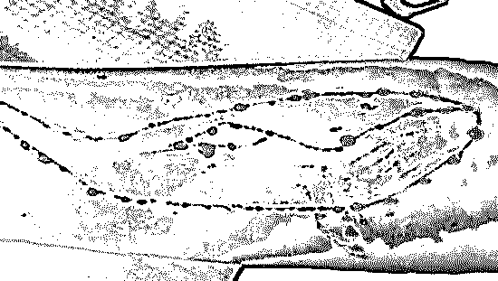       **************之后就是相约“今天在右胳膊上划一个十厘米的伤口”“今天一起闯红灯”等有危险但是不会伤害生命的“游戏”。**************再发展，就是相约“割腕”“安眠药”“开天然气”这一些自杀式行为了。**************被官方媒体曝出以后，当时 QQ 群都得到了很好的控制，也是因为我国的小孩子都在家长和老师的看管之下写作业，所以没出大事。**************这件事就仿佛一个传遍中年人朋友圈的养生消息，转发了就是知道了，看过了就是完全理解了。**************“蓝鲸游戏”虽然没有造成具体被曝光的伤害，但是提醒着我们要对网络诱导自杀提起足够的重视。**************通常混迹于社交平台的都是青年人，对于年轻人的心理健康，我们是不是要给予更强的关注？****************走饭君，你听到了么？****************@走饭 是一位重度抑郁症患者，大学毕业前夕，微博更新了最后一条动态后，她选择在宿舍自缢。***************“我有抑郁症，所以就去死一死，没什么重要的原因，大家不必在意我的离开。**拜拜啦。”***************她的微博大都在几十个字，没有配图，描绘的都是生活小事，真实中带着一点荒诞。@走饭去世之后，网友们把这种叙述方式叫做“走饭体”，延伸意义是行尸走饭。**************@走饭离开了之后，她的微博变成了很多青年人吐槽失意和落寞的自留地，她的最后一条微博评论已经超过 160 万，转发也有 60 万。**************       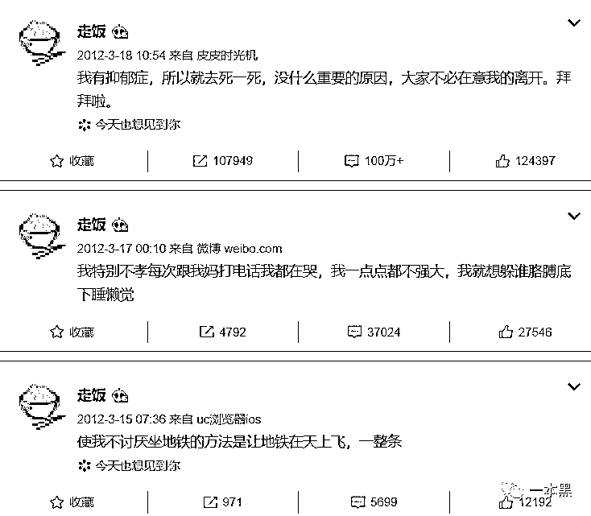      **************打开走饭的转发和评论，也能看到很多抑郁症患者的留言，我们能看到他们对“生”的渴望，和被抑郁症压垮的绝望。**************中国有超过 5400 万的抑郁症患者，相当于 100 人里就有 4 个抑郁症患者。**************如果算上抑郁情绪，有 75%的人都会处于心理亚健康的状态，这也是抑郁症的前兆。**************        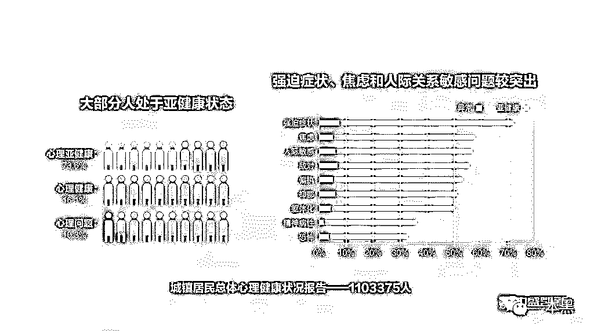**************       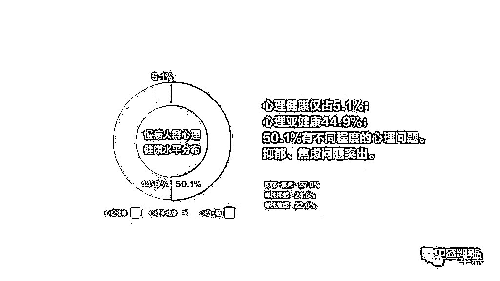        **************还觉得抑郁症离我们太远么?**************现代社会越来越讲究个性，讲究生命体的“和而不同”，我们是不是应该给予年轻人更多的关注和宽容？**************面对网络世界参差不齐但排山倒海的呼啸，又有多少“病人”能扛住这股滔天巨浪？**************金钟铉死了，我们点点头，抑郁症；崔雪莉死了，我们摇摇头，真可惜；如今具荷拉也去世了，热度还在，我们还在怀念和惋惜。**************我们转发着“但愿这样的事情不要再有，太心痛了。”但是几天后，又是一番崭新的光景。娱乐至死，我们永远是看花人。**************被遗忘的人永远被遗忘，失去热度和关注以后，有多少抑郁症患者在尽己所能的求助，又有多少“诱导自杀”的罪犯在暗处肆意生长。**************我们无意将抑郁症患者揪到台前，围观一个病患的痛苦与绝望。但娱乐至死的年代，只有流量和热度才能慢慢的照亮一个又一个阴暗的死角。**************抑郁症从不该和自杀画上等号，而操控抑郁症患者进行自杀的恶魔，祝愿他们通通下地狱吧！*****************************大家好，我是老黑。******** ********早年做过技术，也做过自由调查记者，曾协助警方打掉产值上亿的色情网站、也干掉过骗了无数人的非法集资。****************之所以写【一本黑】公众号，是想用最简单的语言，告诉大家，这个世界上真的存在魔鬼，不然你没法理解人性。****************如果你想认识我，不妨加我微信：****yibenheiSW**********

*********推荐阅读：*********

*******[私密社群，快上车](http://mp.weixin.qq.com/s?__biz=MzU4ODAwNzUwMQ==&mid=2247486383&idx=2&sn=0821d0bff33285d235b2e1b9af9a9e27&chksm=fde21a8dca95939b496421a2177f83d8022e5a25ce95ea8b2929b17b26fe95aeb5ca902b722a&scene=21#wechat_redirect)*******

*******[网贷打赏女主播的，全是傻逼，有一个算一个](http://mp.weixin.qq.com/s?__biz=MzU4ODAwNzUwMQ==&mid=2247486749&idx=1&sn=3f55887d61b8f5833a075f513e43b6cd&chksm=fde21c3fca959529da658a51e08a0d9c49fe571207d32b4fb2c776a82329b5273b3acb456f65&scene=21#wechat_redirect)******* 

*******[你的微博为什么会自动搞黄色？](http://mp.weixin.qq.com/s?__biz=MzU4ODAwNzUwMQ==&mid=2247486745&idx=1&sn=64caf2a526a12c5bf526e73b11e564b6&chksm=fde21c3bca95952de8a1af20470fc6bd802e40aa9e564ec0470942f2fdb98939f3e986bac4d0&scene=21#wechat_redirect)*******