# 你的微博为什么会自动搞黄色？

> 原文：[`mp.weixin.qq.com/s?__biz=MzU4ODAwNzUwMQ==&mid=2247486745&idx=1&sn=64caf2a526a12c5bf526e73b11e564b6&chksm=fde21c3bca95952de8a1af20470fc6bd802e40aa9e564ec0470942f2fdb98939f3e986bac4d0&scene=27#wechat_redirect`](http://mp.weixin.qq.com/s?__biz=MzU4ODAwNzUwMQ==&mid=2247486745&idx=1&sn=64caf2a526a12c5bf526e73b11e564b6&chksm=fde21c3bca95952de8a1af20470fc6bd802e40aa9e564ec0470942f2fdb98939f3e986bac4d0&scene=27#wechat_redirect)

       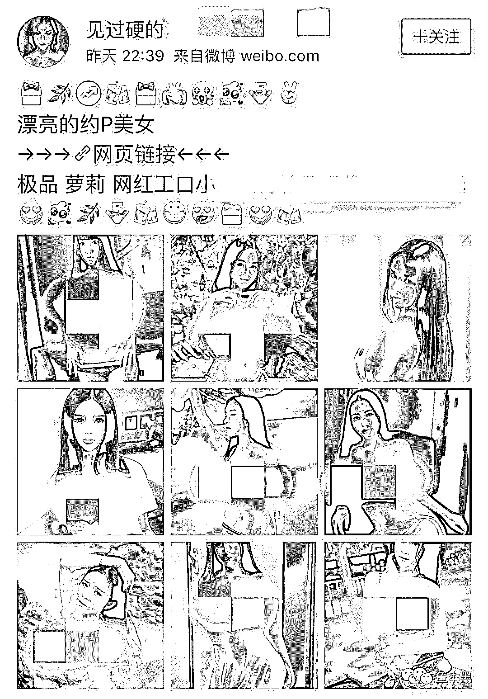      

       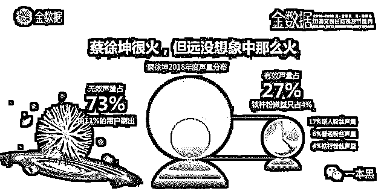      

       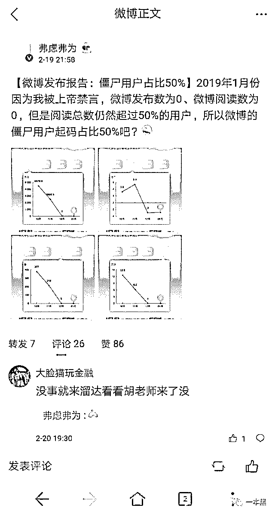      

       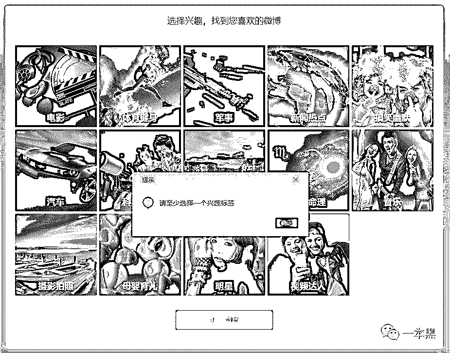      

             

       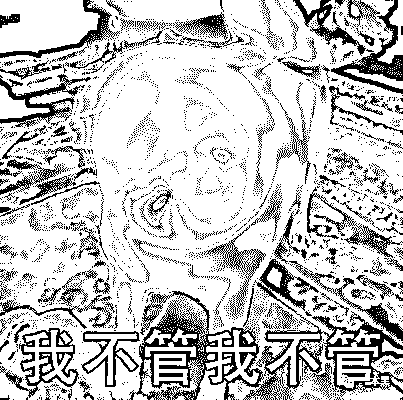      

             

             

       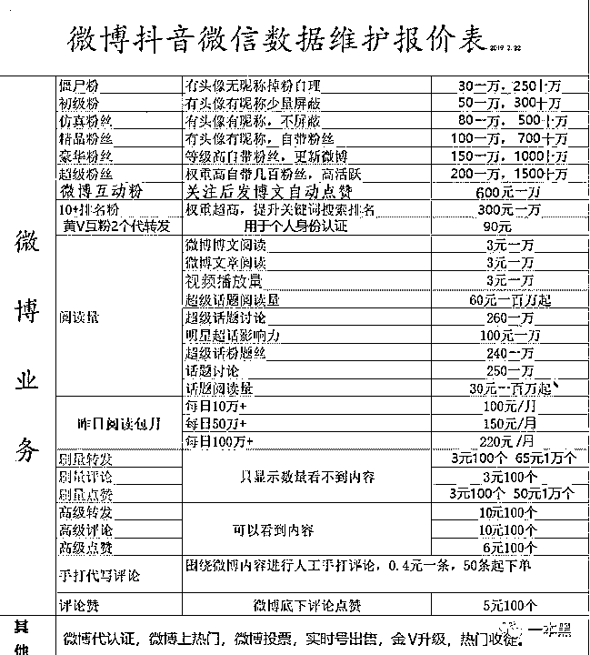      

       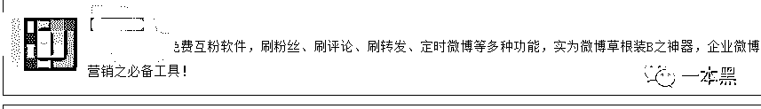      

       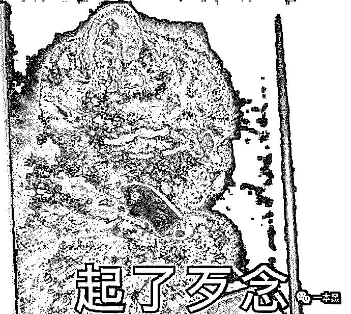      

       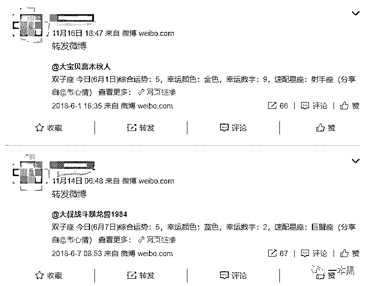      

       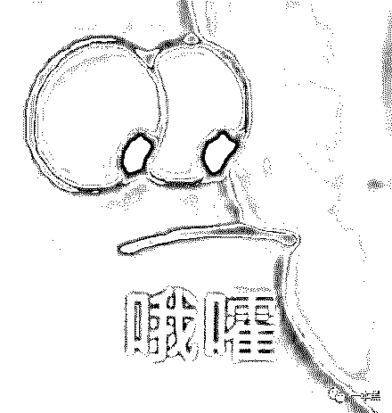      

             

             

             

             

             

             

             

             

             

             

             

             

             

             

             

             

             

             

             

             

             

             

             

             

             

【黑话连篇】

该栏目更多的是揭露事件或对事件的看法，以达到让人精神升华的目的。

* * *

一觉醒来，同学群炸锅了。他们说我在微博 ghs（搞黄色），天知道我才刚睡醒，微博都卸掉好久了。再说了，ghs 为啥要在微博，一点赞一转发，好友都知道了，毫无隐私可言。再说了，P 站不香吗？学高数的好地方啊。但他们有截图为证，说我经常点赞一些内涵丰富的微博，怀疑我不仅搞 ghs 还去整容了。于是我一脸懵逼地重新下载微博、登录，立马就惊醒了，到底谁动了我的微博啊？成天点赞些有的没的，毁我清誉。一看登录历史，没毛病啊，除了自己的电脑就是手机，上次登录还是半年前。这到底是怎么回事？上网一搜，嗬，原来我不是一个人在战斗。**很多人被迫在微博 ghs**百度、微博、知乎、各类技术论坛上很多人求助：自己的微博账号异常关注了一堆营销号，还经常无缘无故给一些奇奇怪怪的微博点赞。什么无痕丰胸手术、月瘦 20 斤的减肥茶、性感约 P 小姐姐（骗子，通通是骗子），以及微博上投放的各大品牌广告，甚至有的时候还有“主动”参与转发，总之类型五花八门，操作的时候都神不知鬼不觉。就算自己及时发现，删了动态改了密码，过阵子又会发生同样的事情。       中招的微博一般更新频率都很低，或者十天半月才登陆一次，而被点赞的账号都有一个特点，粉丝数仅几百上千，但微博点赞和转发轻易就能上万，而且发的还都是广告。让我想想，好像哪里不太对。为什么我以前千辛万苦编的段子，最高点赞都没超过两位数，而别人随便发个广告就上万赞，并且粉丝还没我多。是我的微博不够硬？还是我这个人没有吸引力？不，这不可能，就算是，我也不会承认的。那些轻易能获得巨大流量的人除了自身号召力以外，还有可能是因为有钱或者得到了平台内部的奖励。有钱可以刷量，只要你会唱跳 rap 打篮球，你就可以轻易登上流量的顶峰。或者你本身就是个名气不错的人，那么也有可能会被平台推荐，收割 收获一波粉丝轻而易举。      图片来源：金数据（有效声量指的是真实数据）不管是平台推荐的还是花钱刷量，那些被推荐和被交易的微博用户都是流量浪潮下的受害者。也就是上文说到的莫名奇妙给别人点赞、转发的微博账户。当流量成为可供买卖的商品，就一定会有人卖，有人被卖。价值对等在互联网世界是不存在的，所有的交易都在追求低成本甚至零成本，于是薅羊毛，灰黑产才这么猖狂。我们不仅没有隐私，甚至连操控自己隐私的自主权都没有。就算给所有的账号都加上复杂密码，也防不住别有用心的人，顶不住资本的力量。**微博推荐机制与 KOL**为什么微博刷量这么猖狂，因为微博用户基数大。微博高级副总裁曹增辉说平台活跃用户有 4.3 亿，其中明星 3 万，KOL 40 万。而我国网民总量约为 8.29 亿，也就是说中国网民，一半都爱用微博。4.3 亿只是活跃用户，据某微博用户估计，微博的僵尸粉数量或许也有 50%。毕竟当他发博数量为 0 的时候，阅读数都能超过 50%的用户。那么，被超越的 50%要么为阅读 0 ？要么为负数？     要照这么算的话，微博的总用户数或许都超过 8.3 亿了，嘻嘻嘻 8 亿多的用户，那 1 亿的转发量也正常嘛，我们可能真的错怪了人家呢。为了凝聚这几亿用户，微博不断引进各种新技术，什么 AI 算法，大数据推荐啦，从你注册微博的那一刻开始，AI 就在为你服务了。为了优化用户体验，避免你淹死在知识的海洋里，注册账户之后必须选择兴趣标签，选完了就给你推荐几十个博主，不关注也得关注。除了注册时的贴心，日常使用时，AI 算法在信息流展示也同样发挥了巨大的价值。比如，刷微博总是翻两页就来一个广告，即使点了不感兴趣，也还是要锲而不舍地给你推荐。微博一天天地给我推荐整容、整牙、拍婚纱照的广告，是想告诉我不整容连婚纱照都拍不了吗？推荐一次我点一次不感兴趣，然并卵，见缝插针的广告不但没少反而越来越多了。不知道的还以为微博和趣头条是兄弟公司呢。AI 这是在特地和用户唱反调的吗？不想局限于自己关注的内容，看看热门吧。成天不是给我推荐沙雕视频就是娱乐圈八卦，还有些我都不好意思说。就算选了不再看该话题，下一条也还是同类型的内容，极其让人无奈。阳春白雪的内容我或许看不懂，但通俗易懂的我还是可以的。整天给我推荐些低俗的内容是几个意思？瞧不起人还是咋地。这个问题，其实微博也曾回应过（信息流排序/限流算法），大概意思是，你喜不喜欢是你的事，屏不屏蔽是我的事。不过呢，屏蔽是不可能屏蔽的，这辈子都不可能屏蔽的。顶多把你不喜欢的往后排一排，实在不行，减少曝光的频率总行了吧。作为普通用户，我们没有选择想看还是不想看的权利，只有系统才能决定你应该看什么。而且吧，系统不仅能决定你看什么内容，还能决定你看谁的内容，成为谁的粉丝，给谁点赞。每个社交或是内容平台都喜欢大 V 或是 KOL，因为他们自带流量，只要大 V 活跃，那么他的粉丝自然也会活跃。用户活跃了，平台才能活更久，赚更多钱。为了和大 V 们保持良好的关系，就需要给大 V 甜头。什么甜头大 V 都爱呢？钱，钱太俗了，所以多多益善，毕竟大家都是俗人。此外，随着各类平台的增多，大 V 也想多平台发展，那自然就会舍弃其中一些，因为精力有限。那怎么办呢？除了钱，大 V 还喜欢成就感，对于输出内容的大 V 来说，阅读、粉丝、点赞、转发是成就感的最直接体现。档次再高点的无外乎就是奖项，媒体报道之类。但奖项是有限的，几十万大 V 不可能人人都得一个奖，编也编不了那么多，那就给数据奖励好了。于是就有上文的用户莫名其妙关注了一堆人，给一些微博点赞的事了。合作时间不长的大 V，给他们塞的就是我这种十天半个月登一次的非活跃用户，甚至僵尸粉（主要为了撑场面用的）。大 V 心里肯定也有数，毕竟点开头像一看就知道是咋回事了。但大家都假装不知情，流量嘛，就和皇帝的新装一样，只要你觉得是真的它就是真的。合作时间长能力强的大 V 就给活粉，毕竟这样的大 V 是真的有号召力，对平台吸粉也有用的，就不能随便敷衍。但是粉丝给是给了，留不留得住还得看大 V 的个人能力，毕竟这些粉丝都是活的，只能强给，不能强留，这样子。活粉指的是那些有明确兴趣范围，使用微博频次高，但也不爱发声的人。反正推荐的也是相关领域的大 V，说不定看着看着你就对大 V 人家感兴趣呢，日久生情嘛都是这样搞的。所以微博这么搞纯粹是为了提升用户体验，毕竟三赢呢？平台活跃度高，大 V 的数据好看，底层用户的体验更好了呢。大家要学会体谅，嘻嘻嘻~你说是吧胳膊拧不过大腿，个人玩不过平台，何况是这么骚的平台，于是很多人选择注销微博，不再做无谓的挣扎。**刷量江湖与平台绝招**不过有的时候，你的微博出现异常点赞和关注，也不总是微博的锅。这就不得不提到微博刷量江湖了。      这是我从一个微博刷量的群里截的报价，按照粉丝活跃度不同，刷量的价格也不同。玩法多的很，但我们今天不讲刷量。一般刷量的粉丝来源，一部分是自有，一部分来自外界。自有也就是所谓的养号党，批量注册，质量不高，低价使用。外部粉丝就，来源不那么好看了，甚至是非法。比如窃取 cookie，不法分子和运营商狼狈为奸，非法获取用户 cookie，清洗分类之后，就可以拿到完整的账户信息、密码，如微博。再用微博进行一些偷鸡摸狗的操作，微博转发、点赞还只是低段位的玩法。为了逃避监管和责罚，他们将窃取的资料存放在海外服务器。只要和运营商的合作不中断，不管你改多复杂的密码都是没用的，账号被“劫持”的情况还是会不停地发生。比如我们有时候登录一些网站或者 APP 的时候，图省事喜欢用社交账号一键登录，事后也没有取消授权，账户信息就一直留在那了。于是有人利用漏洞，非法调用接口，就能够直接使用这些账号资料。再比如，一些外挂软件，可以免费实现互粉、刷粉丝、刷转发，这样的软件多不胜数。       其他的或许还涉及个人信息及隐私买卖，每一次当新闻曝光的 XX 网站用户信息泄露时，这些信息其实早已在市场上转手过好多个轮回了。总之，在我们看来或许一个没什么价值的微博账号，在灰黑产的眼里，都是能拿来赚钱的工具，区别在于赚多赚少。针对这些现象，其实微博也有给出一些解决方法，比如，防盗必杀技——改密码。这就和手机有问题先重启一样，没什么毛病，甚至能解决绝大部分问题，但总觉得哪里怪怪的。就像女生肚子疼，对象叫你多喝热水一个道理，有用是有用，但就是心理觉得别扭。其次，取消第三方应用授权，在管理中心-我的应用，取消不常用的网站授权，尤其是那些不知名的小网站。实在不行的话，建议再加上登录保护，虽说是麻烦一点，也不一定有用，但好歹有个心理安慰。在查看新浪客服关于此话题的回应时，我看到了一个微博官方推出的粉丝修正网站，说是可以帮助清除一些存在问题的用户，说白了就是清除僵尸粉。于是我试了一下。毕竟我一条微博也没发过，也从来不给人点赞、转发、评论啥的，就这样还有一百多号粉丝，怎么想怎么不正常（其实我的账号也被迫关注了上百个莫名其妙的人，全靠手动删除）。结果试完后，系统告诉我帮我清理了 0 个粉丝。

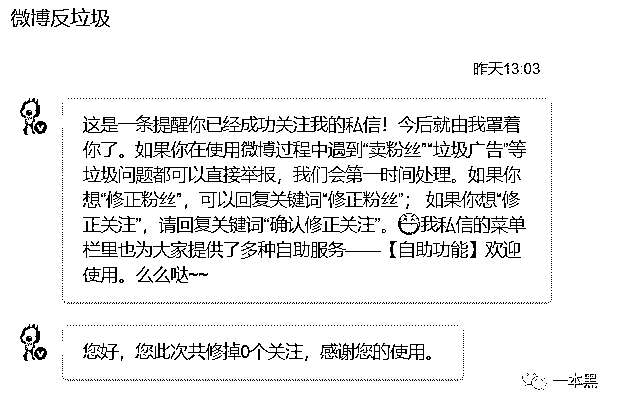

？？？我的粉丝竟然都是真粉、活粉。我就知道关键时刻只能靠勤劳的双手，于是我选择手动查看粉丝资料，结果，第一个粉丝的最后更新日期居然是 2017 年。。。剩下我就不说了，都是些什么玩意。一个两个的，怕都是同一个养号集团出来的。发的内容，关注的人，微博设置的昵称，更新的频次，都是一样的格式。            要不怎么叫渣浪呢，还真是有点渣。为了留住用户，这套路刷刷的~最后，想要彻底解决微博异常点赞、转发这个问题，有办法吗？权威专家回应：木得办法。平台内部操作你搞不定，违法窃取你也搞不定。你懂吧。也不晓得去充个会员有没有用哦？

* * *

当我们习惯把流量当成衡量网络时代成功与否的标尺，那么这场虚假流量的狂欢 party 就不会停止。刷量与谣言一样，短时间内，甚至永远不会消失。只要我们继续迷信流量，就一定会有流量的受益者和更多的受害者，或许是你我一样的普通人，或许是身处舆论顶端的 KOL 。所有混乱、失序的地方都会酝酿改变的机会，在流量为王的价值体系下，或许不久的将来我们也会迎来一场新的变革。夫风生于地，起于青萍之末。且等着吧。

*参考资料：*

*微博用户账号莫名成刷量工具，流量困境之下急需新故事；新月，蓝鲸 TMT*

*微博为什么越来越像今日头条？；i 黑马*

*“史上最大数据窃取案”告破，揭开微博“被加粉”的秘密 ；重案组 37 号*

*大家好，我是老黑。*
*早年做过技术，也做过自由调查记者，曾协助警方打掉产值上亿的色情网站、也干掉过骗了无数人的非法集资。**之所以写【一本黑】公众号，是想用最简单的语言，告诉大家，这个世界上真的存在魔鬼，不然你没法理解人性。**如果你想认识我，不妨加我微信：****yibenheiSW***

**推荐阅读：**

[私密社群，快上车](http://mp.weixin.qq.com/s?__biz=MzU4ODAwNzUwMQ==&mid=2247486383&idx=2&sn=0821d0bff33285d235b2e1b9af9a9e27&chksm=fde21a8dca95939b496421a2177f83d8022e5a25ce95ea8b2929b17b26fe95aeb5ca902b722a&scene=21#wechat_redirect)

[走路赚钱，每天 2 毛，步多多你能别骚了吗？](http://mp.weixin.qq.com/s?__biz=MzU4ODAwNzUwMQ==&mid=2247486693&idx=1&sn=c3edd7802a1cc51f4836fe3c04c8ecf1&chksm=fde21dc7ca9594d134231fcb248999297e27b13add79816c6fed0a737a3c2d3528e3c1f44dc3&scene=21#wechat_redirect)

[自媒体碰瓷，黑公关删稿，被阉割的真相和被操控的舆论](http://mp.weixin.qq.com/s?__biz=MzU4ODAwNzUwMQ==&mid=2247486695&idx=1&sn=a50c11ab5df3d64e84cce72b1848321b&chksm=fde21dc5ca9594d37fc9f533b7f12e30174d5a976588fb475ac5a78f5bf5a03d7bfee33509dc&scene=21#wechat_redirect)