# 走路赚钱，每天 2 毛，步多多你能别骚了吗？

> 原文：[`mp.weixin.qq.com/s?__biz=MzU4ODAwNzUwMQ==&mid=2247486693&idx=1&sn=c3edd7802a1cc51f4836fe3c04c8ecf1&chksm=fde21dc7ca9594d134231fcb248999297e27b13add79816c6fed0a737a3c2d3528e3c1f44dc3&scene=27#wechat_redirect`](http://mp.weixin.qq.com/s?__biz=MzU4ODAwNzUwMQ==&mid=2247486693&idx=1&sn=c3edd7802a1cc51f4836fe3c04c8ecf1&chksm=fde21dc7ca9594d134231fcb248999297e27b13add79816c6fed0a737a3c2d3528e3c1f44dc3&scene=27#wechat_redirect)

【黑话连篇】

该栏目更多的是揭露事件或对事件的看法，以达到让人精神升华的目的。

* * *

这世上，赚钱就要开脑洞。你想啊，常规的赚钱门路就那些，竞争太激烈了。靠卖苦力，摸摸光滑的脑门，什么时候可以迎娶白富美，走向人生巅峰！可是轻松赚钱的门路，臣妾想不出啊，怎么办？别着急，经济学定理，有需求一定有供应，市场就是这么的伟大。躺着赚钱虽然是遥不可及的梦想，但你可以走路赚钱啊！现在的成年人都很焦虑，小时候要比学习成绩，工作后要比赚钱多少，连每天走路，都要用计步软件，比个高下。突然有商家告诉你“每天 4000 步，月赚 200 块，最高能赚 2 万”。这可比每天辛苦搬砖、上下班挤地铁幸福太多了。幻想一下，牵着女友的小手，漫步在三亚的海滩，吹着微风，还能赚钱，这才是人生啊！             我们之前的文章介绍过，“趣步”就是这么一个“牛逼”的 App，[“我辞了月薪 8000 的工作，带着老公一起干 Q 步”](http://mp.weixin.qq.com/s?__biz=MzU4ODAwNzUwMQ==&mid=2247485321&idx=1&sn=66d91f7d0296b832eb2297114d898932&chksm=fde216abca959fbd68e1e2806abb704f1ab7c4a2318a3ffa92dd39eccf2bf5e979d47915cf7a&scene=21#wechat_redirect)趣步在 18 年下半年突然爆火，号称以区块链技术为支撑，立志“让国民每天走路的汗水不白流”，曾登上 App Store 生活类第一的位置，在短时间内席卷了 2 千万用户。不过别看广告吹得神乎其神，靠走路，你是赚不了几个钱的。“趣步”为你想办法，借鉴了 2 个绝对经典的方式——传销和资金盘。通过走路，你可以获得一定糖果，但每天是有上限的。想多获得糖果，就去拉人头，增加活跃度，获得更多糖果。糖果多了后，你可以通过大量买入、拉人头等方式，把交易区的糖果价格炒高，趁机抛售，赚取差价。这么骚的操作自然引起了政府的关注，终于在今年 8 月被立案调查。老大倒了，老二要吸取教训啊，违法的事不能做。中午吃饭时，我刷手机，看到一个视频，有人在通过走路软件赚钱，叫步多多，宣称“让每一步更有价值”。难道是下一个“趣步”吗？还是真有商家做慈善，想给广大用户发点钱？**想轻松赚商家钱是做梦！****我打开华为应用市场，点开步多多，下载量近 4000 万，果然人民群众的发财欲望是旺盛的，在趣步不争气，美梦破碎后，立马找到替代品。****很多用户看到这个庞大的下载量，肯定心急如焚，觉得自己落后于那么多人，简直少赚了一个亿。不过我不是一般人，经过细细地观察软件介绍，发现了一个冲突。****       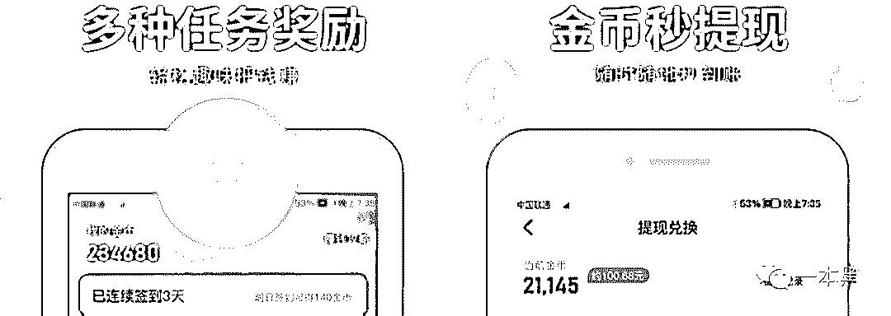       ****左边 234,680 金币兑换 23.468 元人民币，相当于 1 万金币换 1 元。而到了右边，21,145 金币兑换 100.68 元，相当于 200 金币换 1 元。****够骚，屏幕上移动几厘米，汇率波动这么大！但能理解，韭菜太多了，公司在忙着收割，这点小问题，who care!****       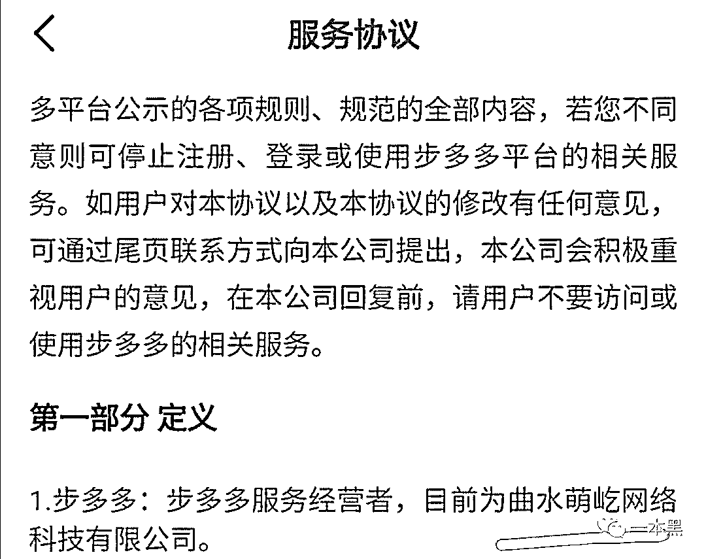       ****看到用户协议上，步多多经营者为“曲水萌屹网络科技有限公司”，我通过公开资料查询发现，竟然今年 5 月才成立，半年多发展到这么大的用户量，真是让很多做产品的互联网公司汗颜！****       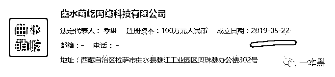       ****当然广大用户热衷于使用步多多，肯定不是为了锻炼身体，不然用微信运动就好了，干嘛要多下个 App,浪费手机存储空间，是游戏不好玩，还是小姐姐不好看？****那么走路到底能赚到多少钱呢？****步多多广告里宣称“我今天走了八千步，赚了 11 元”，你喜滋滋地下载后，赶紧去走路，结果发现才几毛钱，很愤怒。****这就是你的理解不到位啦，走八千步只是一个基础条件，还有其他操作，但不能告诉你，否则把你吓跑了怎么办？****       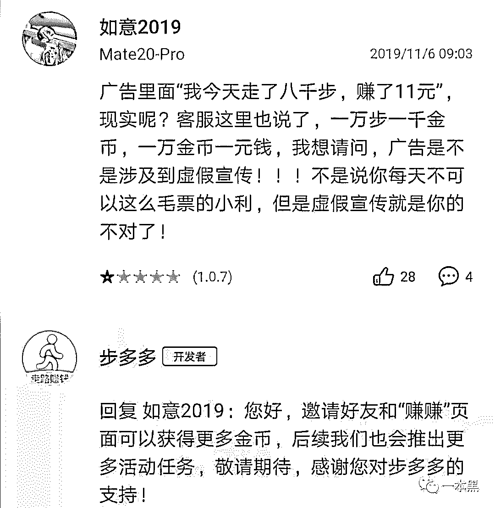       ****胳膊拗不过大腿，你服啦：“我多走点路行不行”？还真不行。****       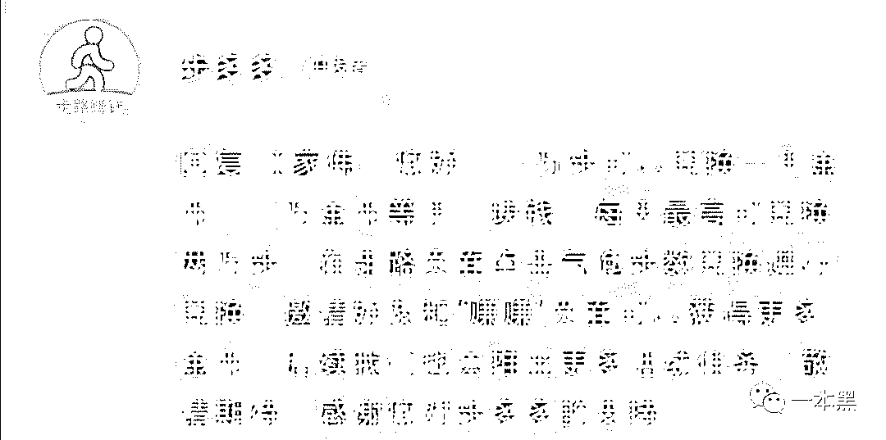       ****步多多说得很清楚了，1 万步可以兑换 1 毛钱，每天最高兑换 2 万步，也就是 2 毛钱，5 天你可以得到 1 块，1 个月你可以得到 6 块，够你买一盒比较好的方便面了，要像这位兄弟一样学会满足。****              ****好吧，你说，蚊子再小也是肉呀，几块钱也不错，你还要接受一个残酷的现实，就是人家的计步器可能不准，比如少个一些步。****       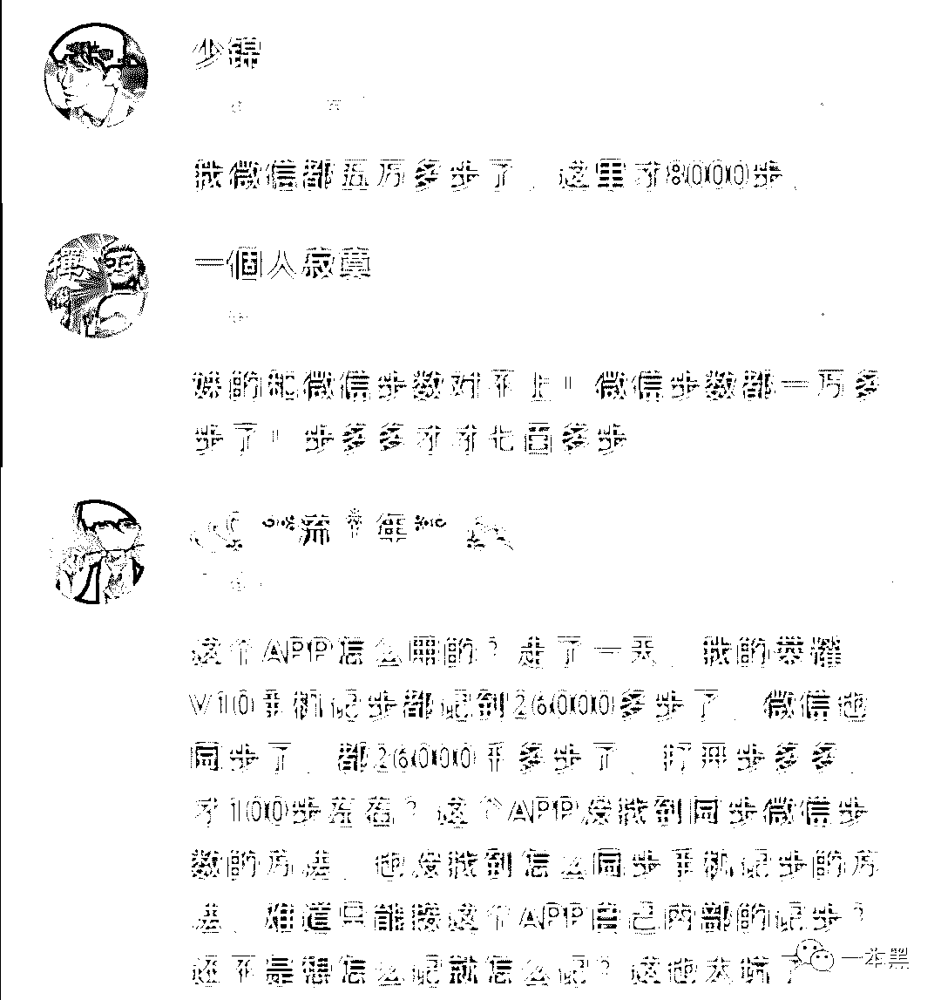     ****对于这个问题，本着严谨客观的精神，我打开步多多和微信运动，绕着写字楼走了几圈，发现步数差距不大。不过，不排除软件有抽筋的情况，可能某些时候，就是计步不准。****步多多人员的服务精神还是可以的，给了解释。想赚商家钱就是不容易，送你一首歌，周杰伦唱的：在我的地盘，听我的。****       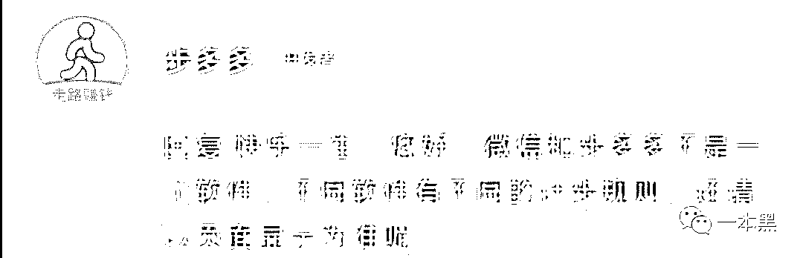       ****算一下，走路好像也赚不了几个钱。别失望，为了增加用户对产品的黏性，顺便鼓励你，步多多还给你准备了一些小钱，像打篮球、跑步、乒乓球啊，你点击后，等待一些时间，屏幕上的小人运动完，就能得到几十金币。****为了让你持续使用软件，除了签到领金币这类常规操作，步多多还为你准备了一个看起来很多的钱，8888 金币，是否很兴奋？不过这太难啦，你要完成很多成就，像首次突破、连续坚持 3 天、一周、14 天、21 天、一个月，累计公里。全部达成后，你也就获得 8 毛多，连凑够 9 毛都缺一两分。****到这，如果你还没放弃，真是太坚强了，步多多都感动了，向上市公司趣头条学习，拉人头，看广告，给你持续赚金币的机会。****问题就是钱有点少，看一个视频 30 秒，看 10 个需 5 分钟，600 金币等于 6 分钱，好久没见过这么小的货币啦。邀请 1 个好友得 2000 金币，就是 2 毛钱，这让互联网平均几十元的获客成本显得相形见绌。****       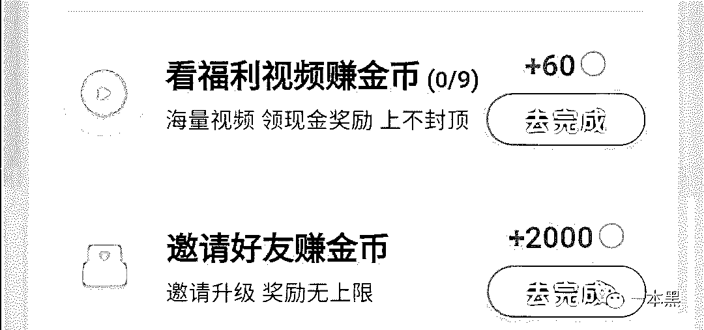       ****面对这残酷的现实，你是否还想挣扎下，有些广告视频太烂俗了，能否用点技术手段，人躺着就能赚钱，多爽。好想法，只是要小心，步多多一旦查到你，很麻烦，毕竟人家在你签的服务协议里提前声明了。****       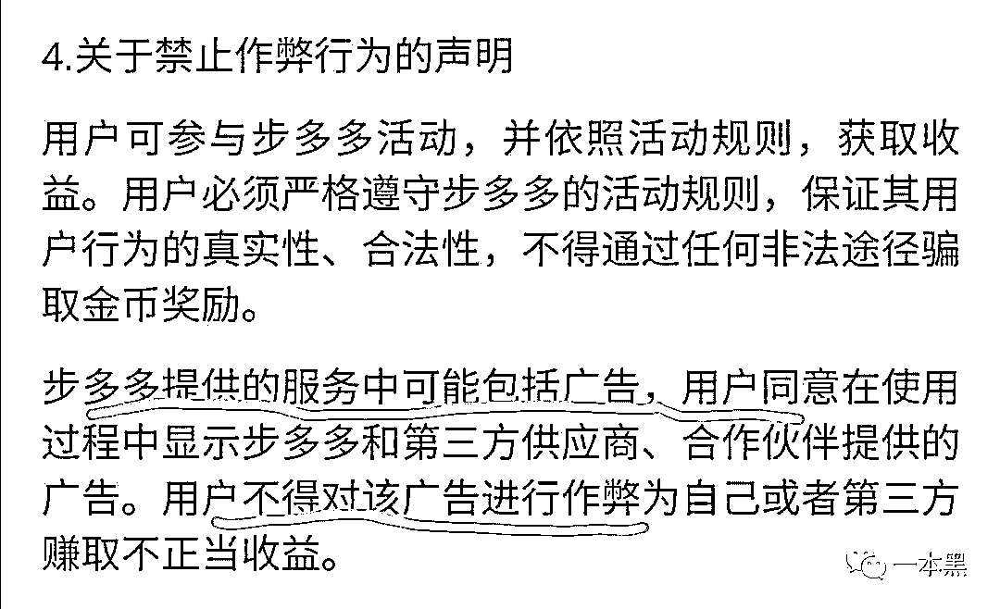       ****算了，你说，毕竟是从商家那赚钱，要遵守规则，不就是多走点路，多拉点好友，多看点广告视频吗？没什么，多劳多得嘛，很公平。****你还要学习下薛定谔的猫，一切都是不确定的，你获得的金币可能会缩水，现在是 1 万金币换 1 元，以后可能会 2 万金币换 1 元，这也许就是为什么，前面提到的软件介绍里，金币兑换率有冲突，这是提前给用户打预防针呀。深谋远虑，佩服！****提现规则也是随时可变的。别看你有个几千金币，你都提不出来，最开始，新用户的最低提现金额是 0.3 元，现在升到了 1 元，以后就不好说了。****       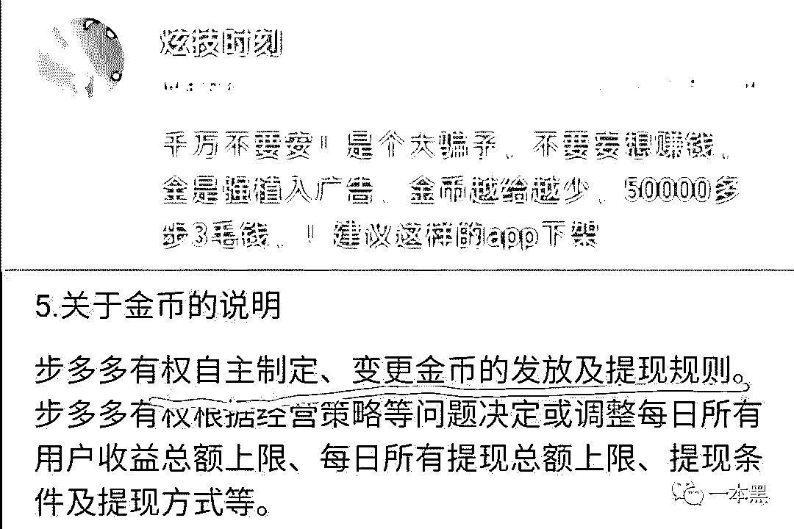      ******雇佣用户打工脑洞大********作为用户，你觉得自己是主动选择步多多，然后赚取一些小钱？看来还是太年轻了！********互联网产品之所以骚，就在于它充满了各种套路，步多多也不例外。********你要领金币，看 3 秒广告；你要金币翻倍，看 30 秒广告；想赚金币，看 30 秒广告；领取成就金币，看广告；想参加福利大放送活动，看广告，想提高中奖率，看广告；当天累计兑换超过 2000 步，还想继续，看广告。********而且广告必须看完，如果你退出软件，再打开，还是广告。********不要抱怨，虽然你赚的只是一点小钱，但是几百上千万的用户加起来也很可观了。步多多靠什么赚钱发给用户，当然是广告啊！********雇佣一个员工，现在至少 3000 元吧，还要交社保，而雇佣一个用户呢，一个月就算 10 块钱，都可以雇佣 300 个用户，让他们每天花大量的时间在步多多上看广告，还以 2 毛钱的单价拉朋友下载步多多。********雇佣用户打工，这赚钱的套路果然很骚。但以前不是这样的，当时的互联网产品都是在内容中夹杂一些广告，还要不时地担心用户会不会反感呀、是否要将广告做得好看点。********但自从 2018 年，趣头条在美国纳斯达克上市后，仿佛大家一夜之间觉醒，原来还有雇佣用户打工的骚操作。********什么广告质量、用户体验呀，都不重要，只要你来看广告，商家就分给你一点小钱，自己拿大头。这太诱惑人了，很多想赚钱的商家都忍不住借鉴。********既然走路可以赚钱，那么喝水更应该赚钱，人可以不走路，但不能不喝水呀。“让每一杯水都有价值，顺便助你月入 100 元”，水宝宝这个 App 为了广大用户的身体健康，特意发金币给你，鼓励喝水，当然想赚更多钱，一定要拉人头和看广告。********但是下图左边是步多多，右边是水宝宝，有没发现一个问题，2 个 App 的界面和功能都太像了，简直是一个 App 模板做出来的。********走路和喝水领金币都有一个圆圈，左上角都有赚钱攻略，中间都是邀请好友，底部都是数据记录和热门活动。盈利模式都是雇佣用户打工，赚广告费。********        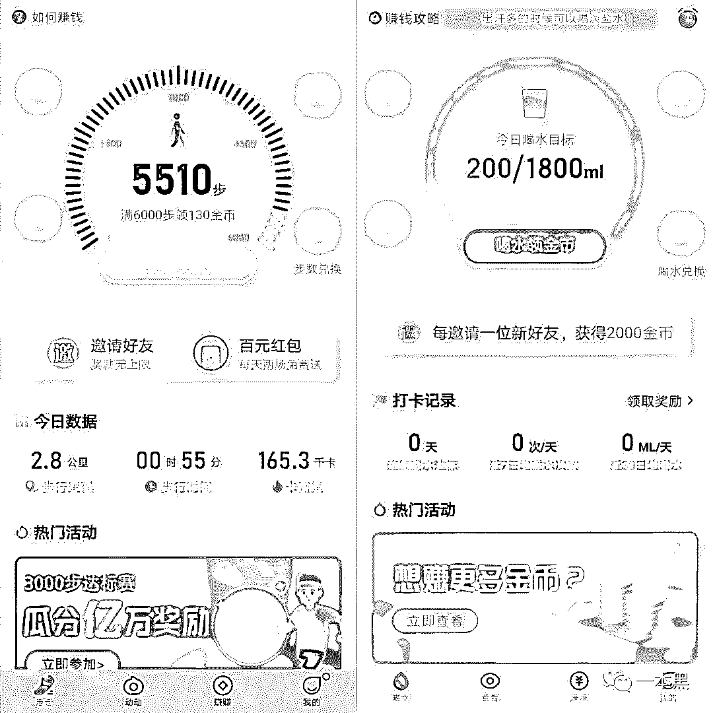********世上竟有如此巧合，这难道是一家公司的 2 个产品？我好奇了，到网上进行一番搜索，发现这两家公司拥有一个共同的股东。      ********虽然水宝宝才推出不久，下载量就几十万，但相信，在大量广告的宣传下，用户会很快增加。以后，很多人会走路用步多多，喝水用水宝宝，双倍的赚钱，拥有双倍的快乐，想想就很奇妙！********现代人的一大消遣是玩游戏，有些用户经常抱怨游戏商奸诈，充钱的用户是大爷，不充钱简直没人权。********我同事有玩一个手机游戏，游戏商就非常好，所有用户一律平等，别看你有很多钱，看不上，禁止你充钱。但就这么有良心的游戏，我同事还经常吐槽，因为无论你干什么都要看广告，不能加速，不能返回。********你可以选择不看广告，但是，游戏里的物品标价都超高，不看广告，你根本买不起，玩着就没意思了。********             ********走路赚钱没想象中那么美好，步多多只是为了雇佣用户打工，赚取广告费，为什么还有这么多人去使用呢？********一怪商家能忽悠。什么抖音、趣头条、迅雷、墨迹天气、各种免费小说网站，投放媒体多到令人发指。而且广告内容严重夸大，就算你一个月走 10 个马拉松，也只能赚 6 块钱，离充值视频网站会员差远了。********二怪商家太了解用户心理。为什么要设置 1 万金币兑换 1 元，直接 1 兑 1 不好吗，更简洁明了？不行，因为给你 100 金币，你会高兴，因为感觉 100 很多呀，换成人民币是 1 分钱，你还要吗？********其次，按照步多多的设置，看一个视频是 0.6 分钱，拉来一个朋友是 2 毛钱。这如果放到线下，有人给 0.6 分钱，让你看一个 30 秒的广告，估计你会跟他打起来，这是在侮辱人吗？而在线上，你会主动去看，获得那点钱。********三怪部分用户对商家怀有美好期待。很多用户被广告忽悠，以为能赚大钱，用了 APP 后，才发现和预期不符，于是各种痛骂步多多，但又不舍得卸载，觉得一点钱也是钱呀，就一边用，一边希望步多多能够善良。********唉！对于我们这样的普通人，想通过步多多这类走路软件赚回工资，那是做梦；想赚点饭钱，也是太年轻，没有经历过社会的毒打。********       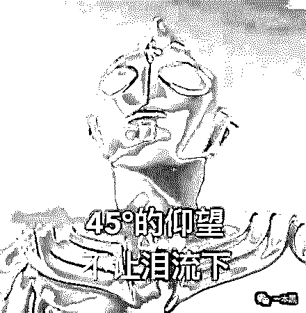      ********如果你只是图个新鲜，觉得有意思，那就参与下，无欲则刚，你可以尽情地感受。********如果是想赚钱，那就要准备付出比收益多 10 倍的代价，把自己的宝贵时间和人脉花在这种性价比极低的事情上。********如果想逃避现实，用一个虚无的幻象，如每天走路在赚钱，去安慰自己焦虑的内心，没有意义。********如果是被商家广告引诱，就当交一点智商税，用过之后，就知道产品到底如何，果决断舍离。********最后给个建议，在下载软件前，还可以先看下大家的评论，在网上搜索一下，让别人的经验避免自己入坑。********蜜糖的外衣下往往是难言的苦涩，你想赚商家的钱，结果却被商家雇佣打工，这个世道真是太残酷了！*****************大家好，我是老黑。***** *****早年做过技术，也做过自由调查记者，曾协助警方打掉产值上亿的色情网站、也干掉过骗了无数人的非法集资。**********之所以写【一本黑】公众号，是想用最简单的语言，告诉大家，这个世界上真的存在魔鬼，不然你没法理解人性。**********如果你想认识我，不妨加我微信：****yibenheiSW*******

******推荐阅读：******

****[私密社群，快上车](http://mp.weixin.qq.com/s?__biz=MzU4ODAwNzUwMQ==&mid=2247486383&idx=2&sn=0821d0bff33285d235b2e1b9af9a9e27&chksm=fde21a8dca95939b496421a2177f83d8022e5a25ce95ea8b2929b17b26fe95aeb5ca902b722a&scene=21#wechat_redirect)**** 

****[一夜薅走 700 万，背后是 70 万职业打假人的狂欢](http://mp.weixin.qq.com/s?__biz=MzU4ODAwNzUwMQ==&mid=2247486626&idx=1&sn=e20fbd5bab3b415a2193d536686bb3ff&chksm=fde21d80ca9594965853e5da54fd5fd20caa8c336406e298ff58b6fbaf3f421bf1fed83ce5ce&scene=21#wechat_redirect)**** 

****[豫章书院死灰复燃，举报者遭死亡威胁 ，还有人重度抑郁自杀](http://mp.weixin.qq.com/s?__biz=MzU4ODAwNzUwMQ==&mid=2247486597&idx=1&sn=549f291beb8b97f31e158aff7870012a&chksm=fde21da7ca9594b193f5685feb0ef09b14ab257c0b6e34c4d5b2d5caf4f24fbc1e4f7b3b4c01&scene=21#wechat_redirect)****