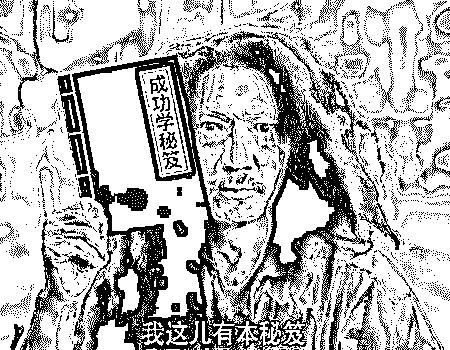
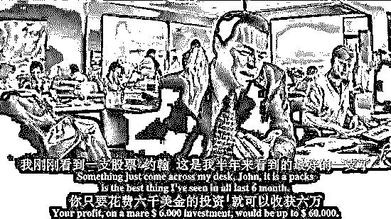
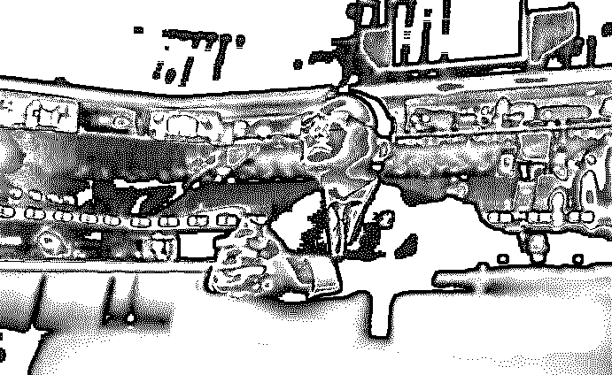
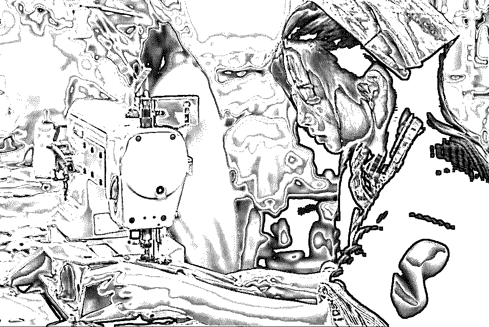
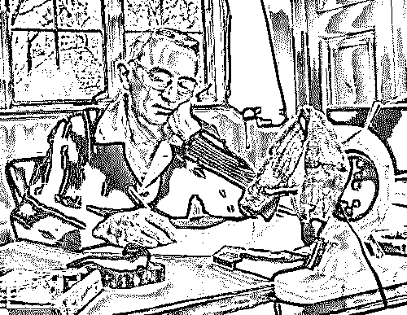
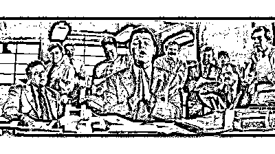
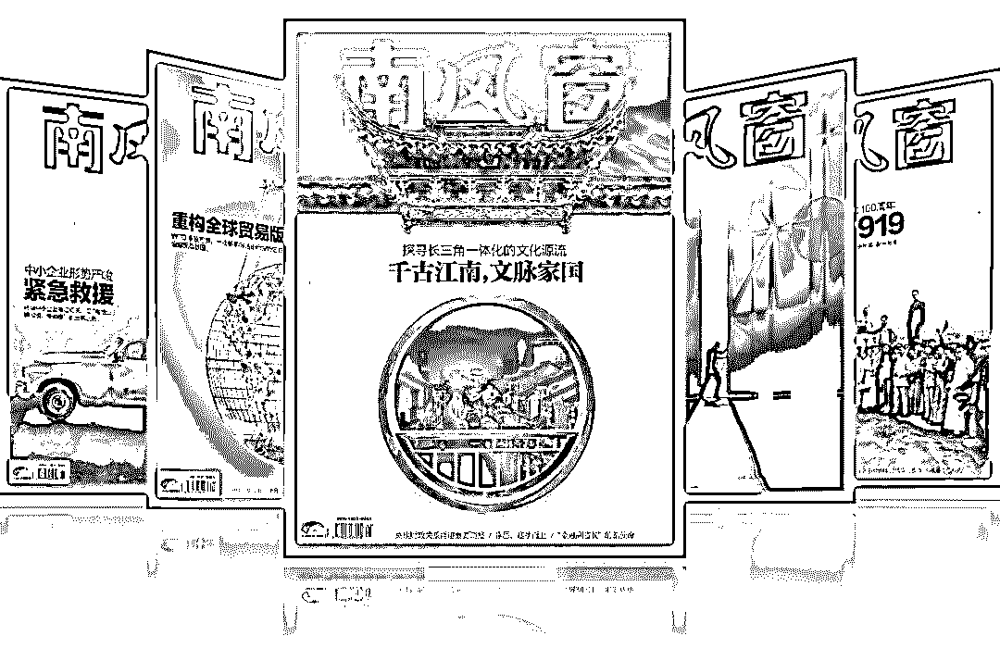

# 韭菜的自我修养，是让成功学大师先富起来

> 原文：[`mp.weixin.qq.com/s?__biz=MzU4ODAwNzUwMQ==&mid=2247486668&idx=1&sn=67a8c0954722637ec51b9f39c9ed8e76&chksm=fde21deeca9594f882d1ccac7cc13247f135564ee512dfcfaa37534adab6554b101d0a8404fb&scene=27#wechat_redirect`](http://mp.weixin.qq.com/s?__biz=MzU4ODAwNzUwMQ==&mid=2247486668&idx=1&sn=67a8c0954722637ec51b9f39c9ed8e76&chksm=fde21deeca9594f882d1ccac7cc13247f135564ee512dfcfaa37534adab6554b101d0a8404fb&scene=27#wechat_redirect)

本文转载自“南风窗”（ID：SouthReviews） 作者：施晶晶畅销书榜单里，成功学从不缺席。网上的书店里，它换了马甲，穿上“励志”的衣服，换上精美装帧的魅惑，打着花里胡哨的作者名字，配合“限时抢”的 Logo 进行饥饿营销。翻来看看，不免怀疑，作者所有的心血只在书名里。
朋友圈里，“你离成功人士只差这 12 个特质”、“月薪 5000 和月薪五万的人区别在哪里”、“比穷更可怕的是你的穷人思维”等标题比比皆是。一不小心遇上各路“成功学教父”的助理微商们，请千万点进去和他们聊聊，你将欣赏到辣眼睛的海报、机器人般的快速回复、以及洗脑式的“你同意吗？”“你认可吗？”。一步一机关，诱导着你交钱听课。他们不说什么只要 998，不扯什么“买不了吃亏上当”，他们只是坚定地表示：“1680 人民币是你决心的证明”。但越往后，高阶课程的入场券就要提升到 20 万、40 万。直到有一天，任正非捅破了窗户纸。**在采访中他表示，那些给华为写传记的作者，他一个都不认识。****无处不在的成功学背后，是那些年很多人交的智商税。******成功的魅惑********别人的成功是不可复制的，成功学都是些正确的废话……这些道理并不难懂，可总有人被“成功学”弄得五迷三道。********成功学的成功，要归功于“大师”们的巧妙包装。最有门道的是其中的培训课程。****************一位曾误入“企业分配之神”李英灿开设的培训课程的朋友，惊讶于现场不由自主的亢奋。**“大声告诉我，你想不想成功？******想不想拥有更好的生活？******”**诺大的酒店会议厅，高八度的嗓门儿借着麦克风开始轰炸听众的耳朵。************“你可以拒绝学习，但你的竞争对手不会”，撩起人的恐慌和好胜；“是不是”“好不好”“你同意吗？”——讲师们洗脑时的口头禅，就像老师划重点一样，时刻提醒注意，总能换来台下一片山呼海啸。********不时冒出“客户”“营销”“现金流”装作自己是专业人士，很快又用直白的话瞎解释一番；几个“成功案例”现身说法，小学毕业的农民大哥激情澎湃讲述自己怎样摇身一变成董事长，晒出喜提奔驰的照片，张口闭口不忘感谢导师的再造之恩；末了现场音响滚动播着《超越自己》提神醒脑，那场面堪比集体升天。****************这些动员话术和氛围营造背后的逻辑就是大忽悠。********他们的套路大多相似：********狐假虎威，打着成功人士的名号招摇撞骗；********避重就轻，有结果没过程，有激情没方法，或者是伪方法；**** ****以偏概全，制造“幸存者偏差”，只强调极个别的成功，不讲失败率。**** ****漫天的培训课程，用看似近在眼前的幻觉吸引人，却从不透露过程中的辛酸和风险，难道只是说着勤奋再勤奋，高呼千篇一律的口号，好运就能从天而降？****************成功和失败是一体两面，但一个悲惨的现实是，各路“神仙”都在教我们如何成功，却从来没人告诉我们如何会失败，明明走弯路的经验更加宝贵。**********韭菜炼成法************贵州遵义的牛芳芳，通过微信认识了“成功学教父”陈安之，她卖掉了家里的 300 头牛羊，凑了 108 万培训费，成了陈安之的“终极弟子”，回过神来，自己几乎家破人亡。************《欢乐颂》里的邱莹莹，职场情场双失意，啃起老爸买来的励志书。面对职场精英安迪的提醒，依然坚持“不理智不逻辑”，反而觉得得到了激励。************罗振宇，从央视离职下海做起了知识生意，说书讲道理，收获了一波粉丝，他们有多黏人？“看罗振宇的文字都有语音感，我脑子里全是他读这些话时候的抑扬顿挫。”一位粉丝写道。************2014 年，一场卖书实验，不打广告、不预热、不告诉你具体是什么书，8000 套图书包，含 6 本书，单价 499，90 分钟，全部售罄。2018 年，罗振宇跨年演讲《时间的朋友之中国式机会》门票卖到了 1200 一张。************************罗振宇在 2018 年跨年演讲《时间的朋友之中国式机会》现场************对于高级别韭菜，我们更多时候叫它粉丝。**************韭菜的不自觉在于认知的局限，成功学又瞄准了他们的心理弱点。****************有钱，有文化，这是今天让人刮目相看的两个指标。**************陈安之们盯上了三四线韭菜们的钱包，最好是来自农村，小学初中学历，又有野心的人。上课交钱，抛出几个“商业项目”让人砸钱投资。罗振宇们服务的是一群想有文化，但没什么时间又静不下心读完一本书的人，愉悦他速食还犯懒的心。************经济不发达的地区，对贫富差距悬殊的感受更深，辛苦打拼积累了一小笔原始资金，却比不上经商来钱快。现代化、机械自动化的铺开，社会对低水平劳动力的吸纳能力减弱，辛苦钱越来越难赚了。眼红、不满足、又有一点钱作为拼搏的资本，赶着时髦学投资，找更快捷的致富之路。************************培训课几千块是不便宜，比起传统的学校教育，他们觉得性价比很高，没有时间长、零基础、难度大的问题。************“罗辑思维”和“得到”是典型的，给人一种自我提升，进入上升通道的错觉，这种学习和获得的快感转移了对现实空虚的不满。没有办法从现实的物质层面够到成功的标准线，于是向内寻求精神层面的“超凡脱俗”，同时祈求这种思想的提升能给自己并不如意的现实处境带来改变。**************成功学就是门生意**************成功学是舶来品，最早就是战争和经济危机时候的一种安慰剂。它鼓励人们积极乐观、养精蓄锐、静待时机爆发小宇宙，咸鱼翻身，登上人生巅峰。************奥里·森马登、戴尔·卡耐基、拿破仑·希尔是成功学的代表人物，他们都实现了咸鱼翻身。************戴尔·卡耐基被称作是“成功学之父”，他的成名靠的是教人演讲，真的是靠嘴吃饭，据说他讲了超过 15 万次课，每个星期能赚 500 美元，相当于今天的 12500 美元。************************“成功学之父”戴尔·卡耐基************成功学，它一开始就是门生意。************你一定听说过卡耐基写的《人性的弱点》，号称“成功学圣经”，畅销全球。************但事实上，卡耐基并没写过一本叫《人性的弱点》的书，倒是写过一本《如何赢得朋友和影响他人》。书里写的其实跟教你成功没关系，而是告诉你怎么招人喜欢。这本畅销书在美剧《小谢尔顿》里，可是好好被黑了一把。************交友困难的小谢尔顿从图书馆借来了这本书，按照书里的交友法则进行尝试，**结果制造了几波尬聊，也没能交上朋友，当他随口一聊，找到共同兴趣爱好后，反倒交到了朋友。****************后来他发现，这本书根本没用。******他找到借过这本书的人，发现他们都是些感情事业受挫的成年人。****************今天的中国仍是机会富矿，但正在从野蛮生长的阶段迈向规范，越来越多的机会拼的不是廉价劳动力，而是需要专业的技术和科学的管理，门槛更高了，我们需要搭梯子、制造工具，才能摘到树上的果实。这种专业性和知识，正是成功学信徒们所欠缺的。************我不忍心用无知和愚昧评价对成功学着迷的人，因为人性自有它脆弱的一面，而它们最终都指向恐惧——对疾病和死亡的恐惧、对缺乏充分保障的恐惧、对被时代抛弃的恐惧，以及不能实现自我价值的恐惧……************在一种朴素的认知中，有人选择了相信成功学对此或有帮助，并且成本较低。************我们也没有什么资格去嘲笑成功学，显示自己的优越感，事实上我们每天也如出一辙地被各种信息的左右和塑造。************************人能在多大程度上克服弱点，不被忽悠，在多大程度上突破自己的认知局限，关键还得看教育。************一切问题说到底都是教育问题，别听信什么读书无用论，那都是信奉成功学的人想拉你入伙的口号。************成功无学，教育有学，希望我们都成为教育的虔诚信徒。************大家好，我是老黑。早年做过技术，也做过自由调查记者，曾协助警方打掉产值上亿的色情网站、也干掉过骗了无数人的非法集资。之所以写【一本黑】公众号，是想用最简单的语言，告诉大家，这个世界上真的存在魔鬼，不然你没法理解人性。如果你想认识我，不妨加我微信：**yibenheiSW**

**推荐阅读：**

[私密社群，快上车](http://mp.weixin.qq.com/s?__biz=MzU4ODAwNzUwMQ==&mid=2247486383&idx=2&sn=0821d0bff33285d235b2e1b9af9a9e27&chksm=fde21a8dca95939b496421a2177f83d8022e5a25ce95ea8b2929b17b26fe95aeb5ca902b722a&scene=21#wechat_redirect) 

[一夜薅走 700 万，背后是 70 万职业打假人的狂欢](http://mp.weixin.qq.com/s?__biz=MzU4ODAwNzUwMQ==&mid=2247486626&idx=1&sn=e20fbd5bab3b415a2193d536686bb3ff&chksm=fde21d80ca9594965853e5da54fd5fd20caa8c336406e298ff58b6fbaf3f421bf1fed83ce5ce&scene=21#wechat_redirect)

[网恋一时爽，隔天火葬场、生死杀猪盘，情欲屠宰场](http://mp.weixin.qq.com/s?__biz=MzU4ODAwNzUwMQ==&mid=2247486633&idx=1&sn=da4149b5643b86153a6411d34f298e4c&chksm=fde21d8bca95949d6ce1c5c7ddb29b3d1e2fc61f3efb96bbacff06feeeee3f2efbc9f4b76262&scene=21#wechat_redirect)

本文转载自“南风窗”，内容已获授权。**南风窗，中国政经第一刊。****冷静地思考，热情地生活。**如需转载请联系“南风窗”（ID：SouthReviews）。******