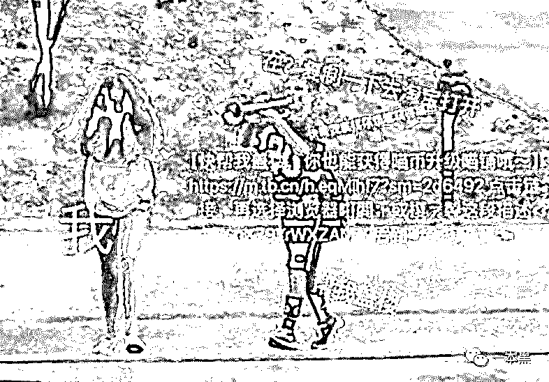
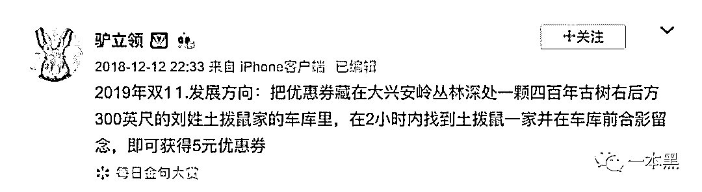
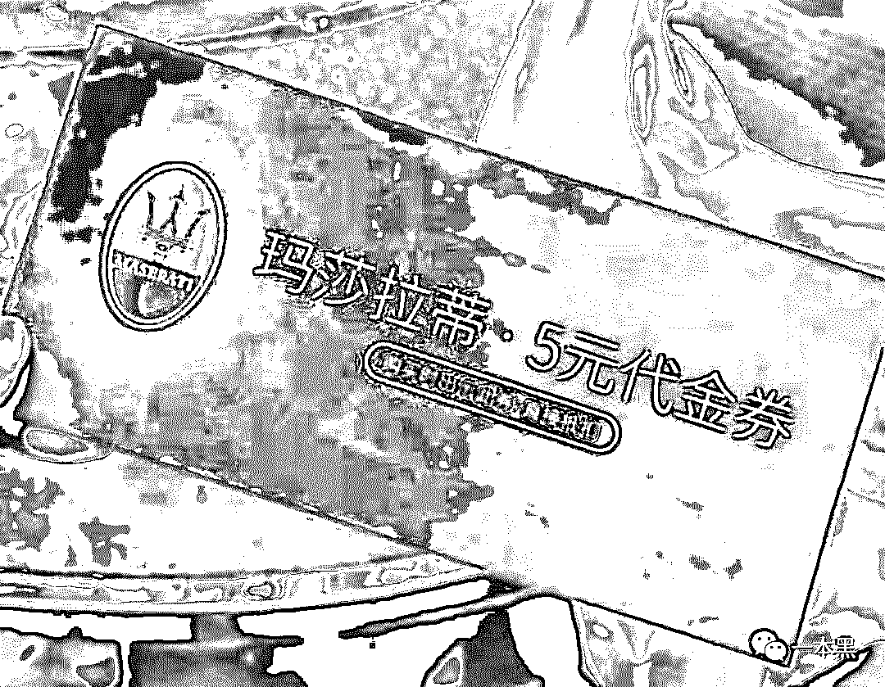

# 双十一这些套路，谁 TM 顶得住啊

> 原文：[`mp.weixin.qq.com/s?__biz=MzU4ODAwNzUwMQ==&mid=2247486603&idx=1&sn=de37ec64351ad20f5672556e804f7ffc&chksm=fde21da9ca9594bf0c3a3ed89bddf6684f99503726b13f70e3715736c603d38dddccff4997a9&scene=27#wechat_redirect`](http://mp.weixin.qq.com/s?__biz=MzU4ODAwNzUwMQ==&mid=2247486603&idx=1&sn=de37ec64351ad20f5672556e804f7ffc&chksm=fde21da9ca9594bf0c3a3ed89bddf6684f99503726b13f70e3715736c603d38dddccff4997a9&scene=27#wechat_redirect)

 双十一诞生那年，我看到了中国电子商务行业鼎盛发展的苗头，直到今天，双十一可以说影响到了国际电子商务行业。

来看一组数据。

2014 年双十一，阿里巴巴全天交易额 571 亿元；2015 年双十一，天猫全天交易额 912.17 亿元。

2016 年，1207 亿元。

2017 年，1682 亿元。

2018 年，2135 亿元。

今年双十一，会不会达到 3000 亿？很难说。

但从这些逐年增长的数据来看，可以看到国民消费能力的提升，这是一件好事。

不过到今年，双十一的第十个年头，我真的觉得在玩法上是越来越骚了。

以往的双十一，先涨价后降价不说，加上各种烧脑的优惠券规则，简直就是一年一度的数学考试运动会。

大家都不是会举一反三的人，搞这些忽悠谁呢！

我向来没有双十一购物的习惯，也从来没把双十一当成是一个节日，这玩意说实在的挺傻逼的，明明是一个网购促销活动，非得把他上升成一个节日。

咋滴，中国那么多传统节日也没见几个人好好过不是。

**不过话又说回来，你说全民狂欢节，大伙图个热闹，乐呵乐呵也还行，但别整那么多套路行吗？挺恶心。**

因为一直以来都没有一定要在双十一购物的习惯，更别说被双十一套路了，所以我只知道双十一这规则，那规则的。

本身就够忙的了，你说一大老爷们非得守着时间，去抢几块钱的满减优惠，膈不膈应人。

说起今年双十一，玩法是比以往骚太多了，什么红包合伙人、瓜分 20 亿、还要点赞之类的。

最气人的是什么组战队，盖楼，天哪！我他么头都大了。**我又不是施工队，盖他么什么楼。**

哎，不得不说现在的互联网套路真的是能骚断你的腿。

一个个产品、运营抱着本游戏化运营的书，就开始各种设计套路，这本身没什么可说的，拉新促活一条龙嘛！

在产品上可以说是相当成功了，游戏化运营的精髓也掌握得头头是道，但我觉得互联网按照这种模式发展下去，套路真的能得人心吗？

你说你套路就算了，好歹红包给整大点啊，人家辛辛苦苦扰骚好友求盖楼，一顿操作猛如虎，一领红包两块五，怪抠的！

两块五就算了，仔细再一看，你可能会发现这两块五优惠券的使用规则：消费满 500 元，且讲此链接分享给十个好友，且每位好友均实际消费满五百元，且限指定商家的日化用品。

我就想问问这套路是哪位高手产品规定的，你来，咱们好好聊聊。

之前不就有位博主发微博预测了一下 2019 年的双十一方向吗？我觉得说得挺实在的。

2019 年双十一发展方向：把优惠券藏在大兴安岭丛林深处，一颗四百年古树右后方，300 英尺的刘姓土拨鼠的车库里，在 2 小时内找到土拨鼠一家，并在车库前合影留念，即可获得 5 元优惠券。

哎，双十一的骚，真的闪断了我的老腰。

这真的是太烧脑了，不就买个东西吗？非得整这些花里胡哨、有的没得，真诚一点不好吗？

听说今年还有什么定金模式，就是说双十一太火了，火得商家的库房都快被拆了，所以需要设置一个门槛，也就是说前多少位付了定金的人，可以先拿到购买名额。

并且付了定金以后，还有所谓的补贴。你看，就这套路也有一堆人抢着付定金呢！

不得不说，互联网的很多产品经理真的是流弊，他们太懂人性了，消费者的心理简直被拿捏得明明白白。

可造之材，可造之材。

另外，今年可以说是直播带货爆发的一年，双十一除了各种非主流套路外，直播带货也加入了进来，各种优惠券也是满天飞，OMG，再不抢就来不及了、手慢无哦！

我就想问问，有没有五元玛莎拉蒂代金卷，我车都看好了，就差这张优惠券喜提豪车了。

对比现在双十一的各种套路，拼多多就实在多了，直接品牌低价，拒绝套路。

之前我多次提过拼多多要打“翻身仗”，所以今年双十一年度大促，拼多多更是挥舞着"百亿补贴”的大旗高调入场。

优惠不仅力度大，难能可贵的是玩法也是朴实无华、简简单单。直降到实诚低价，不需要付定金、不需要 0 点熬夜，更没有繁杂烧脑的游戏化运营套路。

各种价格吊带友商，可谓是双十一的一股“清流”。

之前我也分析过拼多多为啥要搞“百亿补贴”计划，无非是企业运营到一定阶段的战略升级。

拼多多靠下沉用户起家上市，现在人就是个阔少爷，不差钱，直接花 100 亿元补贴全网大牌，商品会在成本价的基础上补贴 5%-50%（即商品销售价=成本价-补贴金额），保证售价都是低于市面上的行情价。

另外，这些参加百亿补贴的商家基本都同时在天猫、京东开店，发的商品是完全一样没有任何差别的。

百亿补贴的商家资质会经过平台严格审核，并且拼多多联合中国人保财险，承诺假一赔十。

之前好几次文章中我说过，别看人家拼多多是玩下沉起家的，就觉得 low，很多事情是需要亲身体验才能去评价的。

反正我上次买过 AirPods 后，两个字就是真香，最骚的是拼多多对 iPhone11 的补贴，直接补贴 800 元，到手价 4699 元。

你说这谁顶得住啊。

反正明天就是双十一，拼多多已经开启了“双十一提前购”专场促销，活动期间，全网爆款补贴在加码，低过全网预售价，没有烧脑套路，直接买就完事儿。 

下面是“百亿补贴”入口，简简单单，朴实无华！

真香警告！

<mp-miniprogram class="miniprogram_element" data-miniprogram-appid="wx32540bd863b27570" data-miniprogram-path="pages/index/index?target_page=%2fpages%2fweb%2fweb%3fspecialUrl%3d1%26src%3dhttps%253a%252f%252fmobile.yangkeduo.com%252fbrand_activity_subsidy.html%253f_pdd_fs%253d1%2526_pdd_tc%253dffffff%2526_pdd_sbs%253d1%2526refer_scene_id%253dwxapp_ybh1110" data-miniprogram-nickname="拼多多" data-miniprogram-avatar="http://mmbiz.qpic.cn/mmbiz_png/I3ht2WMGrPjCHmjfv8HgvrE9fKcs1mJeQ07xzC291zYaGZePawdr7ERWA0cXJuKJGhfe6XOGnz56JV0xNja7BQ/640?wx_fmt=png&amp;wxfrom=200" data-miniprogram-title="拼多多百亿补贴，一起薅羊毛" data-miniprogram-imageurl="http://mmbiz.qpic.cn/mmbiz_jpg/sVQx2tT1ziaWh0rZYSczw82YH87bZuNicG9Q4F7ynYV669TBOQC4ylhtV9G7KYvKJMRnDicffNgHOvHhhD8Fb6OtA/0?wx_fmt=jpeg" data-miniprogram-type="card" data-miniprogram-servicetype="0"></mp-miniprogram>