# 豫章书院死灰复燃，举报者遭死亡威胁 ，还有人重度抑郁自杀

> 原文：[`mp.weixin.qq.com/s?__biz=MzU4ODAwNzUwMQ==&mid=2247486597&idx=1&sn=549f291beb8b97f31e158aff7870012a&chksm=fde21da7ca9594b193f5685feb0ef09b14ab257c0b6e34c4d5b2d5caf4f24fbc1e4f7b3b4c01&scene=27#wechat_redirect`](http://mp.weixin.qq.com/s?__biz=MzU4ODAwNzUwMQ==&mid=2247486597&idx=1&sn=549f291beb8b97f31e158aff7870012a&chksm=fde21da7ca9594b193f5685feb0ef09b14ab257c0b6e34c4d5b2d5caf4f24fbc1e4f7b3b4c01&scene=27#wechat_redirect)

【黑话连篇】该栏目更多的是揭露事件或对事件的看法，以达到让人精神得到升华的目的。

* * *

最近一篇名为【因为曝光豫章书院，我朋友被他们报复到自杀。】文章将已消失两年的豫章书院再次推到了风口浪尖。作者是当初发文揭发豫章书院的第一人，文章中他讲述了自己连同志愿者在举报豫章书院，解救被关押的学生后的两年里，一直遭受着来着各方的骚扰与威胁。因不堪频繁的报复骚扰，有人因此丢掉工作，有人因此患上重度抑郁，自杀未遂，而作者本人更是遭到了死亡威胁。当我知道这件事情的时候觉得很是骇然，去年花总曝光五星级酒店用毛巾擦马桶的事，同样也被人肉被死亡威胁。这个世界何时变得如此魔幻，为何伸张正义的人得不到保护？为什么作恶多端的人依然逍遥法外？**豫章书院卷土重来？**几天前， 天眼查官方发布了一条微博，内容大概是豫章书院虽不复存在，但公司仍未被吊销，创始人吴军豹依然从事教育培训行业，而豫章书院的商标在今年三月也已通过审核。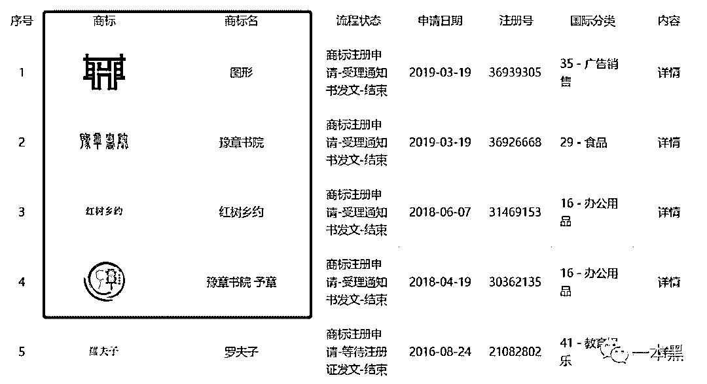这个意思不言而喻，豫章书院想要卷土重来。经查实发现，吴军豹旗下的豫章书院今年三月申请完商标不久就改名了，也就是如今的堂渊文。改名之后，吴军豹便退出了公司所有的股份，并且不再担任任何职务。      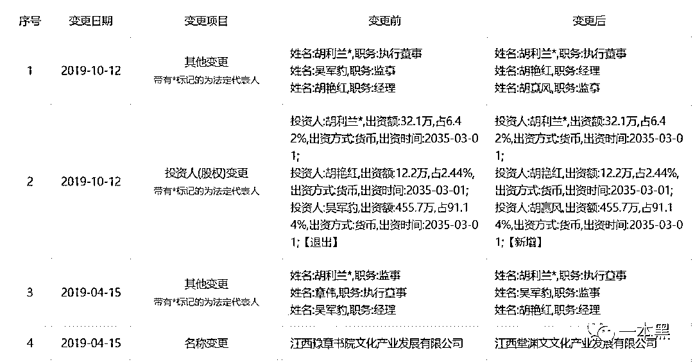吴军豹在法律上似乎与豫章书院不再有任何关联，然而此次事件一出，豫章的方面的发言人仍然是吴军豹，微博上也是由吴军豹出面。（微博现已注销）看似没关系，但却处处维护，豫章书院虽已不复存在，却又悄悄申请商标。难道真像豫章所说的，为了保护传统文化才申请的商标？你信吗？豫章书院被曝光，距今已两年时间，除了学校被关停，相关工作人员被遣散。当事人没有受到任何处罚，吴军豹甚至还在微博发言称【志愿者不堪骚扰自杀未遂只是一场自导自演】，并给文章作者发布了律师函警告。      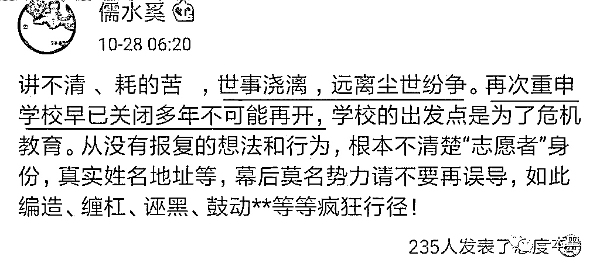与此同时，在新京报的报道中，吴军豹同样表示该行为并非是他的授意。文章的末尾称，倘若吴军豹是被栽赃陷害，那么法律应当为其正名并提供保护，而对于“志愿者被报复自杀”一事却觉得骇人，希望警方核实事情真相，不能让这种恐惧的氛围蔓延。      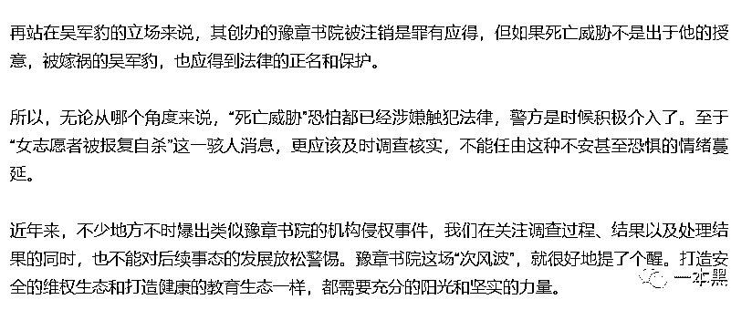*截图来自新京报网《“死亡威胁”恐怕已涉嫌触犯法律，警方是时候积极介入了》**吴军豹的说辞是否可信暂不可知，但他从不无辜，也不值得同情。出于愤怒的缘故，我甚至觉得这篇报道中加了去污粉的成分。**毕竟除了吴军豹一伙，谁还有这个动机去针对这一群普通的年轻人呢？**吴军豹的豫章书院和杨永信的 13 号房是多少青少年的噩梦，吴军豹用国学当幌子，杨永信用脉冲疗法做掩饰，本质都是依靠暴力使人屈服，剥夺他人人格与意志。**打造一个对生活不抱任何希望，终日活在阴影与绝望之中的孩子，就是杨永信等人对这个社会最大的“贡献”，但他们和刽子手又有什么区别呢？一个人活在世上，倘若没有希望没有爱，有什么乐趣可言呢？**两年过去了，那些被解救的孩子至今未曾阴影中走出，那些施虐的、性侵的却依然未曾受到任何处罚。甚至仍然有人在网上为他们洗白，并呼吁重开类似的戒网瘾学校。**互联网的记忆向来短暂，苦难从来只被少数人记住，娱乐至死的狂欢才是主流。**就像此次被报复的志愿者们也并未引起多大关注，跟进的媒体少之又少，微博热搜永远属于【做头发】一类的娱乐事件。吴军豹高调亮相，默默离场，又有几人知道呢？**赤身裸体关小黑屋，搬水泥做苦力，让人吃泔水一样的东西，徒手清粪坑，钢骨龙鞭抽打，性骚扰乃至性侵。豫章书院做过的每一件事，至今仍能在网上找到痕迹，但我们没有想去回忆。**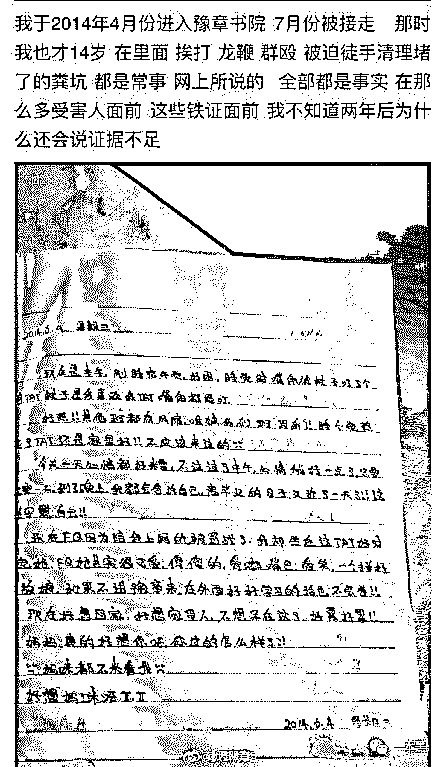**那些揭发豫章书院的人就像勇士一样横空出世，将这类戒网瘾机构最真实最阴暗的一面撩开，展露在世人面前。**我们看过，我们气愤，然后不了了之，我们不再关注豫章，我们也不再关注那些举报者们。我们不愿意回忆苦难，但我们也不愿意提起那些正义之士。**被遗忘是一件悲哀的事情，也是一件危险的事情。没有关注，没有热度，也就意味着危险或许就在暗处潜伏。**他们不应当被忘记，他们做过的事情也同样值得被铭记。****那些被报复的志愿者们***

> **2017 年 7 月，豫章书院受害者周周在逃离豫章之后在网上发帖曝光事情真相，结果被起诉诽谤。****2017 年 10 月 16 日，周周向知乎大 V@ 温柔求助（豫章书院曝光正是得益于@ 温柔及其他志愿者的努力。）****2017 年 10 月 26 日，在经过多番取证之后，@ 温柔在其知乎专栏发布《中国到底有多少个杨永信》一文，第一次让大众知道豫章书院这个令人畏惧的存在。文章很快传播发酵，当晚吴军豹便私信@温柔，希望删文，并关闭了豫章的官网。****2017 年 10 月 27 日，南昌当地宣布对豫章书院立案调查。****2017 年 10 月 28 日，@姗尼玛大王在微博讲述了自己在豫章时的经历，事情持续发酵，媒体开始介入。与此同时，@温柔再次发文《在和戒网瘾学校的吴军豹校长对话后》，但文章很快被删，所有转发此文的微博都被限评。豫章方面也开始洗白。****2017 年 10 月 30 日，@温柔发布的所有与豫章有关的文章都遭到举报。之后央视、新京报等各路媒体都开始跟进。****2017 年 11 月 8 号，也就是第一篇文章发布的第 12 天，豫章关门了，剩余的 80 多名学生被成功“解救”。****2017 年 12 月 7 日，豫章书院正式被立案调查。**

*原本以为这事就算不是尘埃落定起码也接近尾声了，就像电视剧的结局，坏人得有应有的惩罚而好人们都重获新生，走向幸福。**但事情并非如此，就在以@温柔为首的举报者们准备功成身退的时候，贴吧里出现了他们的个人信息，温柔的真实姓名被公开。**其他志愿者比如子沐同学，在回归学校后，频繁被人举报，说参加邪教组织，父母也不理解。明明自己做了好事，却还要承受家人的责备，老师的误解以及外部的骚扰，多方压力之下，子沐患上了重度抑郁症，走投无路时候，子沐选择自杀结束这一切，幸而被及时发现抢救了回来。**不仅仅是子沐同学，其他志愿者的日常工作生活也受到了严重影响。一个在游戏公司做策划的志愿者，因帮助豫章书院的同学维权，个人信息被挖出，对方多次致电他所在的公司，对他进行骚扰和举报，为了降低影响，公司将他辞退。**后来与朋友创业，同样因为这个原因，无法继续留在公司，朋友说，“帮你保留股份，但希望你能退出公司”。**这只是其中两个志愿者的经历而已，其他的不多赘述，想必大家也能想象得到他们的处境。只要个人信息被暴露，等待他们就是无止境的骚扰与威胁。@温柔甚至还收到过死亡威胁。**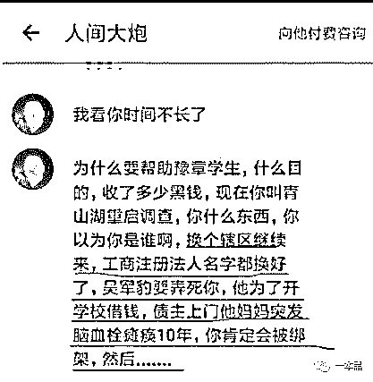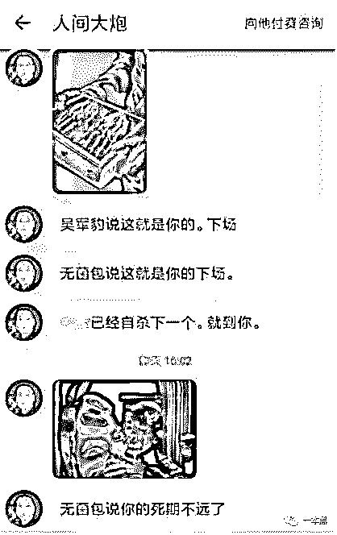***图片来自@温柔微博***这些志愿者们，他们做错了什么？他们无非是让我们看清了一些真相，就要被如此对待。**而吴军豹们呢？做下那么多恶，他们未曾受到任何处罚，所有的起诉最终都以证据不足为由而告终。吴军豹继续当选南昌心理学会 2019 年的理事，以一手电击技术闻名的杨永信至今仍是临沂市第四人民医院的副院长，每周四坐诊，挂号费 24 块。（不知道半年过去，挂号费涨了没）**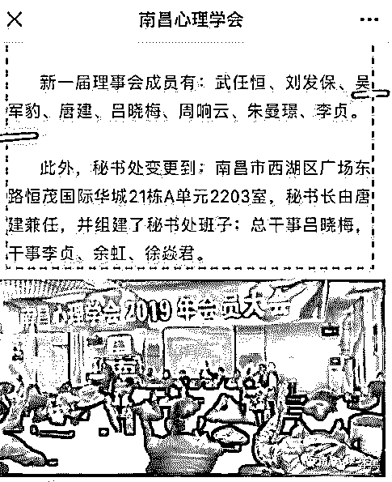**13 号诊室关闭了，杨永信做过的事也就一起被抹去了；豫章书院关闭了，吴军豹也就不再有过错了......**杨永信们的时代过去了，但网戒的余毒清除还需要一段漫长的时间，毕竟百度上戒网瘾学校的网址还能翻很多页。**      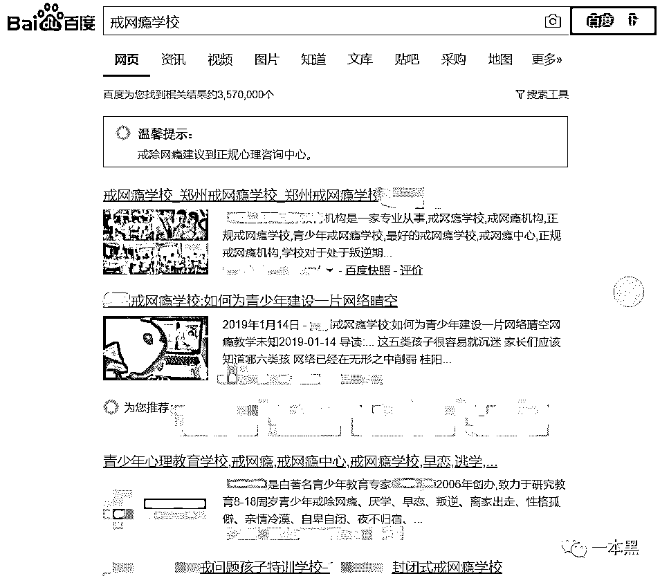****英雄是否需要无名****@温柔在 B 站的视频里说，2017 年媒体曝光之后，豫章被关停，并没有人知道他们，媒体也没有提过他们在这件事上做过的努力，他们自己也并不在意。因为初衷也只是为了揭开真相而已，知否被人知道无所谓，和所有的正义之士一样，他们甘愿默默无闻。**正是因为他们的低调，媒体从未将聚光灯转向他们，光芒之外的黑暗，有人将罪恶之手伸向了他们。没有人知道他们做过多么伟大的事情，也就没有人会时刻关注他们。**汤兰兰案，警方为了避免她遭受二次伤害，选择用隐姓埋名的方式保护她，让她开始新的人生。虽然后来她的新身份被无良媒体曝光，生活被弄的一团糟，但她的安危始终是有保障的。**无名有时候是一种保护，但对于@温柔、花总这些人来说，显然不是。只有足够的曝光度和知名度才能够保护他们的安全。**花总曝光五星级酒店的卫生内幕就被人肉被死亡威胁，因为他触动了酒店的利益。举报豫章书院的志愿者同样触犯了他人的利益，揭开了行业的遮羞布，所以报复从未停止。*

> **蒋卫锁在曝光奶业掺假不久后遇袭身亡；****李翔揭发了地沟油真相，最后被刺身亡；****调查汶川地震校舍豆腐渣工程的谭作人，因煽动颠覆国家政权罪被判刑 5 年；* *

**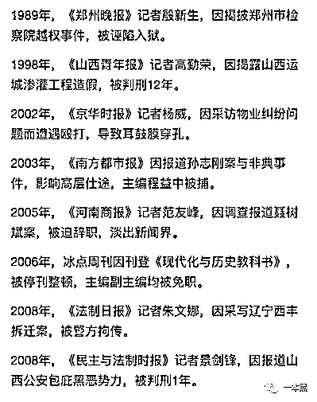****图片来源知乎***上面所提到的人，他们每一个都曾因为揭发各行各业的黑幕，而遭到了不公正的待遇，即使有些人已经被官方媒体报道，被舆论推到了大众的面前，却仍然没能逃脱被报复的命运。**幸运的人，只是被免职，并且终身都不再能从事相关行业。不幸的，要么入狱，要么丢命。**但起码他们还能被人记住，因为他们曾被媒体报道。但是@温柔他们什么都没有，媒体也从未关注过他们，所以他们的命运会是怎样呢？丢工作是开始，自杀未遂也不会是结束。报复从两年前持续至今，何时停止，何时消失，我也不知道。**@温柔说，他不想成为下一个蒋卫锁。**13 号房和豫章书院关闭了，但是更多的戒网瘾学校仍在营业，只要这个行业仍然存在，或许我们就无法等到吴军豹等人获罪的那一天。**只要家长们仍然将上网、玩游戏当成一种不良行为或是心理疾病来看待，这个行业或许就不会消失。**即使今天电子竞技已经变成一项比赛项目进入亚运会了，在一些人眼里，游戏仍然是洪水猛兽，上网超时就是网络成瘾。**虽然@温柔等人没能使这个行业消失，当然也不可能让他们消失。但他们改变了这个行业前进的方向，暴力不再是改变孩子行为的主要手段。**      *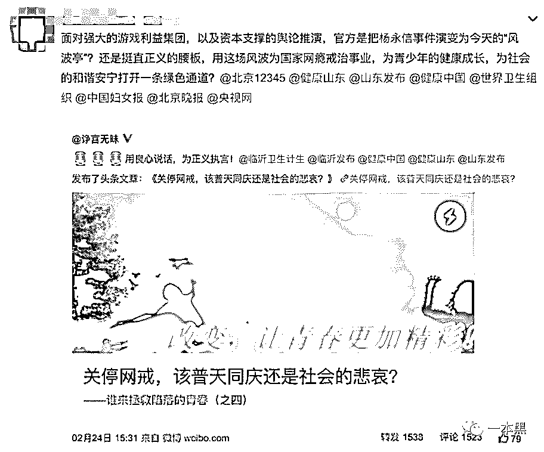       据爆料，诤言无昧是杨永信的微博***直到今天，微博上仍有无数人在为网戒机构正名，为杨永信之流洗白。我们叫不醒一个装睡的人，也改变不了一个无能的家长。**子不教父之过，如果说熊孩子背后是家长的纵容，那么“网络成瘾”的孩子背后，仍然是无数个无能且懒惰的父母。** *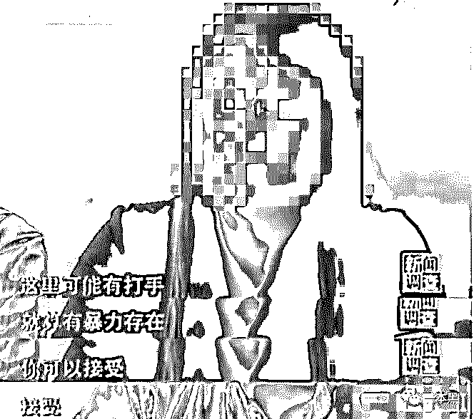****图片来自 CCTV***每个人都有权选择自己的事业、未来及爱好，但总有一些人打着“为你好”的旗号，纵容、制造各种伤害。**豫章书院残害的是所谓的“不良少年”，但杨永信不一样，他“博爱”。除了网络成瘾的孩子，打麻将上瘾的老人，广场舞上瘾的大妈，不听父母话想继续读博深造的大学生，通通都是他关照的对象，不管你有什么理想什么爱好，只要进了 13 号房，出来一定再也没这个想法。**我不知道维护杨永信和豫章书院的人是出于什么目的，有什么意图。或许是家有不听话的孩子，或许是家庭生活不和谐，又或许是单纯的崇拜者。**但我只想对他们说一句，去你*的。*

* * *

*我们应该如何保护这些甘愿冒着危险去揭露真相的人？法律如何保护举报者的人身安全？在法律之外，在聚光灯照不到的地方，我们能做些什么来帮助他们？**有的时候我们应该沉默，但有的时候我们需要发声。**键盘，不是只能用来喷人，它也可以是武器，是保护正义的武器，也是保护为正义发声之人的武器。**正义从来不需要血的代价，更不需要他们用生命奉献。**@温柔不会成为下一个蒋卫锁，我们也再不需要第二个蒋卫锁。**“说真话的被迫失声，伸张正义的不得善终。”这样的世界总会有一个尽头，造化不会总是为庸人设计......**一本黑新社群已开通，社群名字叫做【一本黑的朋友们】，它没有一个具体的定位，里面会聊赚钱案例、想法、思路；它同时也是一个资源对接平台，帮助大家寻找可以合作的资源，但灰黑产严厉杜绝。
同时也会不定期邀请牛人嘉宾进来分享，听大佬的赚钱经历和想法，与牛人交流，是提升认知的捷径。总之，这是一个全新的成长型、认知升级、资源对接社群，后续会在社群内公布各种有趣玩法。**你还没上车？**

推荐阅读：

[私密社群，快上车](http://mp.weixin.qq.com/s?__biz=MzU4ODAwNzUwMQ==&mid=2247486383&idx=2&sn=0821d0bff33285d235b2e1b9af9a9e27&chksm=fde21a8dca95939b496421a2177f83d8022e5a25ce95ea8b2929b17b26fe95aeb5ca902b722a&scene=21#wechat_redirect) 

[求你们，别再当网红镰刀下的韭菜了](http://mp.weixin.qq.com/s?__biz=MzU4ODAwNzUwMQ==&mid=2247486568&idx=1&sn=72e3538ddd05119daeffc677860ff6d6&chksm=fde21d4aca95945c6b67569a4bb56a6f7524138db69114d6c757a62914ce92defd93f3afdfa6&scene=21#wechat_redirect)

[误入电话僵尸集体被敲诈，我扒出对方手机号，并劝他从良](http://mp.weixin.qq.com/s?__biz=MzU4ODAwNzUwMQ==&mid=2247486577&idx=1&sn=10c235c2de762925a93a18d9182f9455&chksm=fde21d53ca9594458dd8270122f3f44fd748215d8ea8c38fb49502e83b35874c9e1e6595a51b&scene=21#wechat_redirect)*