# 你以为的薅羊毛，其实是在给淘宝客送人头

> 原文：[`mp.weixin.qq.com/s?__biz=MzU4ODAwNzUwMQ==&mid=2247486589&idx=1&sn=50076c9f4ca0f937b2a9c90408f18b95&chksm=fde21d5fca959449ae9c38f8ca609ee3e6277eb6f8d59e3f5583171a72c03b2bd1fca332b8cb&scene=27#wechat_redirect`](http://mp.weixin.qq.com/s?__biz=MzU4ODAwNzUwMQ==&mid=2247486589&idx=1&sn=50076c9f4ca0f937b2a9c90408f18b95&chksm=fde21d5fca959449ae9c38f8ca609ee3e6277eb6f8d59e3f5583171a72c03b2bd1fca332b8cb&scene=27#wechat_redirect)

【黑话连篇】该栏目更多的是揭露事件或对事件的看法，以达到让人精神得到升华的目的。

* * *

双 11 即将来临，各大品牌的满减活动都看明白了吗？购物车满了吗？攻略做好了吗？购物津贴够了吗？定金付了吗？什么？双 11 套路太深，不会玩。好巧我也是。原本双 11、618 这些人造节日就是为了促销准备的，好好打折卖东西就完事了，还非要搞什么定金、尾金、津贴、优惠券、红包乱七八糟一大推，让我一度怀疑自己脑子是不是不太好使。既然搞不明白那也不强求，算了，咱不买了还不行嘛。*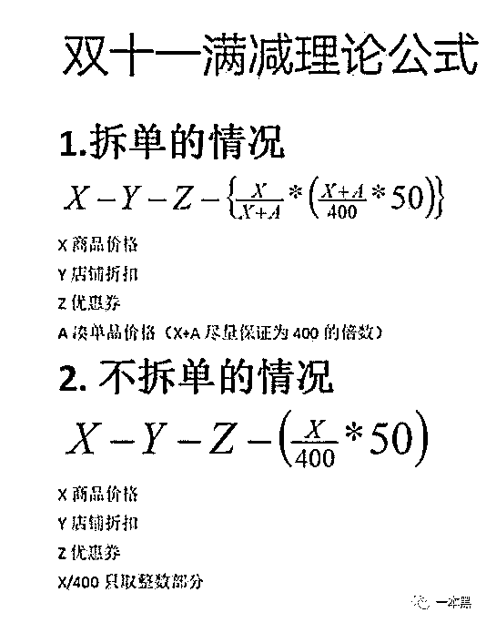**双 11 满减公式*但事实是，你不买东西也逃不掉双 11 的骚扰，各个淘宝店铺的促销短信每天都在提醒你这个盛大的节日即将来临，微信群里各种盖楼求助永远也屏蔽不完。甚至多年不联系的同学还会发私信给你，“在吗？帮我点一下，实在是没办法了，我不能拖我们队的后腿。”这种信息看见了千万不要回了，回了第一次就有第二次。淘宝盖楼，京东拆红包，简直不胜其烦。为了修补这种单方面索取带来的伤害，一些朋友会十分好意地拉你进一些所谓的羊毛群，美其名曰，省钱帮手。群里每天都有各种内部优惠券以及各大品牌的促销活动消息，似乎进了群就能省下一大笔钱。集腋成裘嘛，生活品质的飞跃指日可待。**羊毛群里的淘宝客****“下载**白条，注册之后就可以领取价值 XX 元的新人红包，大家冲呀。”在羊毛群里，我们经常能看到这类消息。又或是，“复制以下链接，在**返利 APP 打开，就可以领取价值 XX 元的内部优惠券”。****除了优惠券，群里还有各个平台的现金红包以及支付宝口令红包能领，甚至还会有免单活动。不用质疑，这类活动多半是真的。****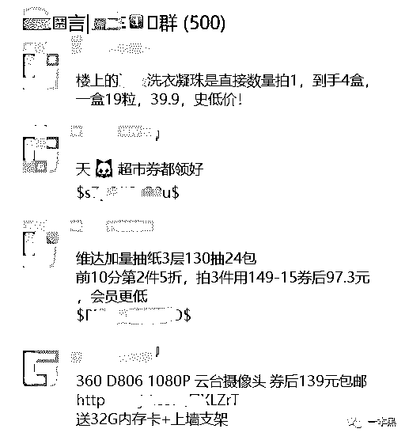****当然群主也并不是用爱发电，之所以花时间去搜集这些活动，目的也只有一个，赚钱而已。只是这种赚钱方便比较隐蔽，大部分人不清楚罢了。****这类靠转发优惠券赚钱的职业有个专业的名字，叫做淘宝客。早年间，淘宝客是个非常赚钱的生意，后来做的人多了，钱就不那么好赚了，但作为兼职，还是一个非常不错的选择。****还记得贝店、未来集市这一类社交电商的口号吗？“自用省钱，分享赚钱” ，不管是社交电商还是淘宝客，赚钱无非是来自于返利和佣金以及服务费。****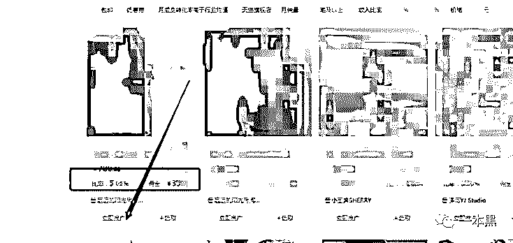****每一个淘宝客都是一个巨大的流量池，手握多个微信 QQ 群，这些群多半是禁言群。群内每天不定期发布各类品牌的活动，群员只需要点击链接购买即可，不需要发言，否则会被请出群。****禁言的原因，群主解释说是为了防止优惠券被淹没，其实是人太多管理不过来而已。毕竟这仍然是一门群控生意，管理人最好的方法就是禁言，只要不发声就不会引发混乱。****即使有人因为禁言而退群也无需担心，毕竟这类群，最不缺的就是人。我的第一个羊毛群就是从微博主动加的，短短一天，那个微信群就满员了，随后群主宣布还有会开二群三群，有需要的可以拉自己朋友进群。****除了群员的自主传播，你在微博上看到的所谓淘宝省钱广告、优惠券专号以及微信上的种草号，多半也是隐藏的淘宝客。****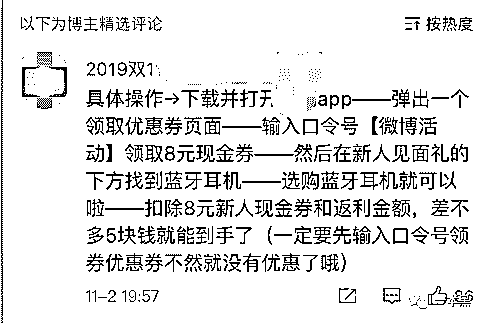****抖音和小红书等内容平台也同样是一个非常好的引流渠道，抖音橱窗里的商品链接，小红书里的种草日记，蘑菇街、美丽说里的穿搭日志。****所有以分享为主题的平台都可以成为引流渠道，引来的流量可以分散到各类羊毛群或者是返利 APP 甚至是金融、保险类 APP。****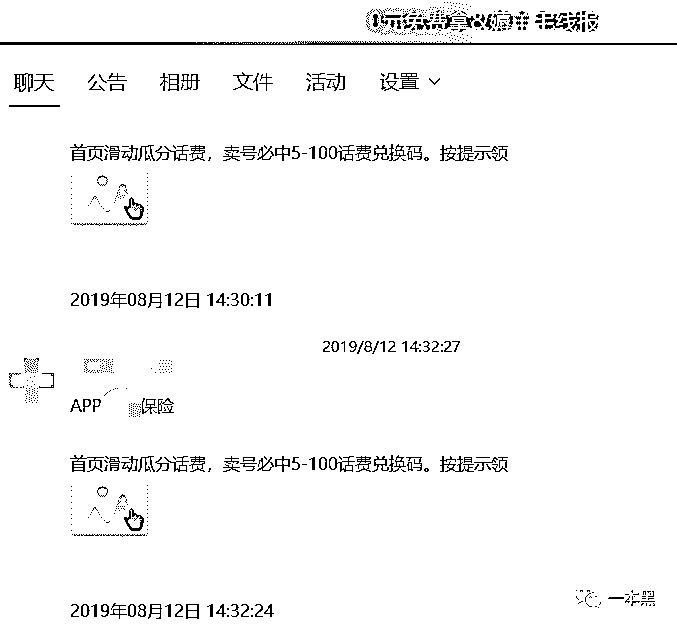****那些声称“能帮你省钱”的事，都是一个赚钱的好生意，这个不需要质疑。******淘宝客与抖商培训******淘宝客发展了这么多年，也已经形成了一套自己的运营模式。虽然只是简单通过优惠券拿返利，但实际也涉及到招商、选品、引流、分发、文案等，和电商运营几乎没有什么区别。****如何对接商户，什么比例的佣金和服务费最合适；哪种类型哪个价格区间的商品转化率高；如何运营维护社群；如何尽可能快速的引流，还不被平台封号。想成为一个专业的淘宝客，这些都必须知道。****淘宝客是指阿里妈妈旗下一种按件计费的推广模式，同时也代指帮淘宝卖家推广商品赚佣金的人。****这一职业诞生于 2007 年，最初是以返利的形式存在，比如各种返利 APP 或者返利机器人。****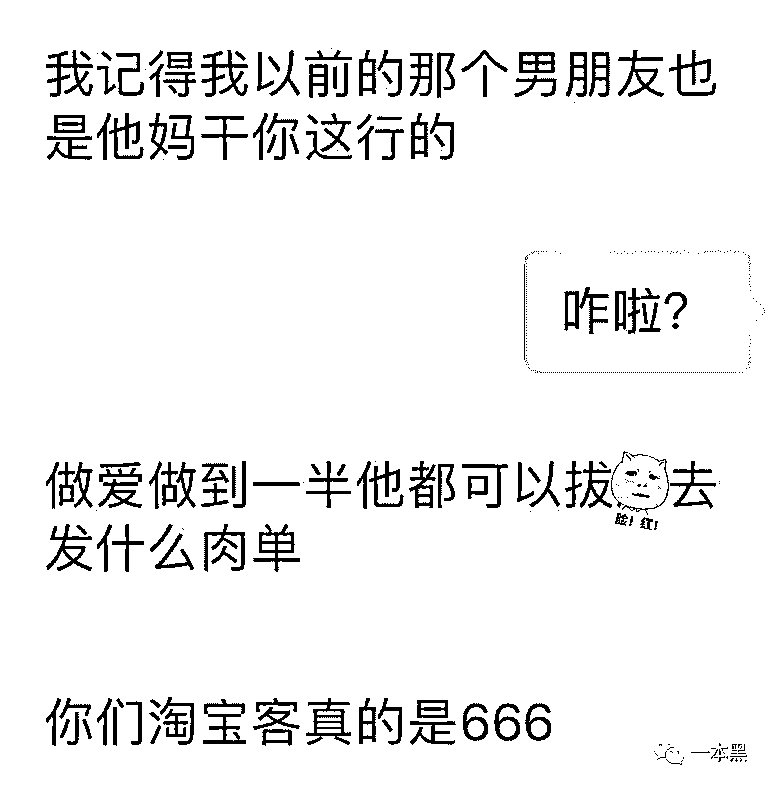*****猜猜淘宝客有多赚钱*****假使你在返利平台买块肥皂，通过平台购买能返利 5 块钱，其中 2 块钱可能给平台拿走，3 块钱给个人，只是平台没把这事告诉你而已。这也是返利网的主要盈利模式。****后来出现了内容导购，譬如服装穿搭装扮的网站到后来的蘑菇街、美丽说，平台一边给用户提供搭配指南，一边提供购买链接，这也是淘宝客存在的一种形式。****再到后来的各种 9 块 9 包邮的网站，只不过这些网站专做特价商品推广，用低价导购的方式为用户提供购物指引，其实这也是淘宝客的一种玩法，只是淘宝客+电商变成了新的外衣。********由于返利网站如雨后春笋般涌现，淘宝用户被截流，在此基础上淘宝多次修改规则挽留用户导致返利网站的生存受限，同时拼多多崛起，9 块 9 包邮网站的优势不复存在，于是转型的转型，衰败的衰败，淘宝客的黄金年代也一去不复返。****直到 2015 年左右，单品优惠券的发明，淘宝客又迎来了新的春天。****不同于返利的延后性，单品红包的优惠是即时的，并且优惠力度更大。对于消费者来说，单品优惠券比返利更具有吸引力，于是一些淘客瞄准商机，靠红包迅速实现群裂变，手握大量的用户。****人一多就不可能事事亲力亲为，于是又诞生了采集（负责选品）、分发、招商等单个服务商。****随着微信打击群控机器人强度的日益加强，淘客们必须寻找腾讯以外的阵营。于是各类淘客 APP 成为了淘客们新的聚集地。****APP 作为平台方同时也是服务方，包揽了淘客们在推广以外的所有工作，文案、选品、采集等等，只是淘客们只能推广平台方提供的品牌。这和贝店、云集一类的差异已经不大了。****市场又打开了，想吃肉的自然也多了。****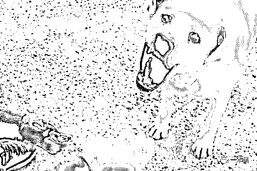****于是又诞生了一个新的职业，淘客培训。****我原以为淘宝客只有培训这一门生意可做，打开闲鱼，才知道自己想象力太差。****淘宝客账户初级升高级，需要引流 60 人，引导 7 人付款，30 天内的成交总金额需超 1000。对于刚接触淘宝客的人来说，这似乎有点难。****但在闲鱼你只要花 24 块，就有人能帮你完成这些事，并且还能返还 4.5 的联盟佣金。也就是 20 块就能帮你完成账户的升级。****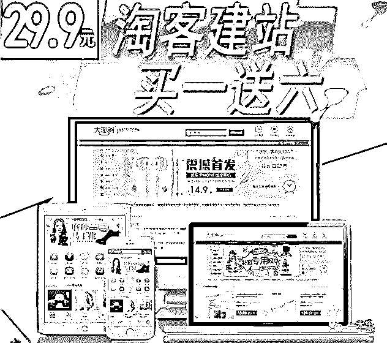**

> ***淘客建站，外送发单机器人、导购机器人、淘客教程、精品采集群、APP 及售后。**买一送六仅需 29 块 9 ；******采集软件，99 元（采集软件用来帮助淘宝客采集各类商品的优惠券）；******利用淘客系统月入 5W+的教程，售价只要 88.88 元；***

**此外还有，无限添加好友的软件；分发软件；招商团长淘宝客培训等，只有你想不到的，没有买不到的。****有免费发优惠券的，就一定有人利用信息差，买卖优惠券的。淘宝上还有人以极低的价格买卖店铺隐藏优惠券，一般 0.1-1 元，就能买到一张价值四五十的优惠券。****淘客培训发展的如此完善，还能理解，毕竟已经存在十几年了。但抖商培训就有点让人摸不着头脑了。****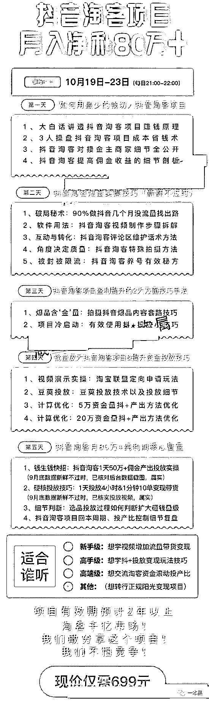****价值 699 的抖商培训课****我在闲鱼看到了一条抖商培训的链接，介绍里说该讲师今年大一，资深抖音淘客操盘手，碾压李佳琦，荣登达人榜第一，月入 80w+。****看完第一感觉就是？？？怎么就资深了？抖音小店 18 年才上线。还碾压李佳琦，完全没听过这号人啊。****刚成年的大学生不是正应该被割的年纪吗？怎么还反过来割别人的韭菜了，而且课程卖的还不便宜，699 块一人。****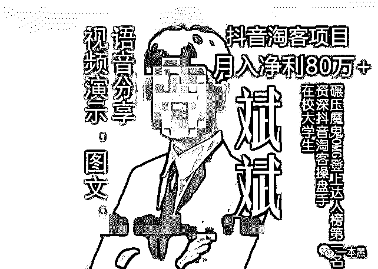****这届大学生，真是了不起，年纪轻轻就割的一手好韭菜。****抖商，顾名思义就是抖音电商，而所谓的抖商培训就是教你如何利用抖音卖货。比如通过打造账号矩阵，增加曝光度；比如选择爆品、蹭热度、打造人设之类的。****抖音上线三年，2018 年初推出电商业务。想要单纯靠运营来卖货也不是不行，但如果靠这个所谓的培训就想实现月入过万，甚至数十万。我劝你还是洗洗睡吧。****前两年微商刚兴起的时候，也有很多微商的培训课，价格从几十到几千不等，报名同样火热，至于学成的，就......。如今微商的火还未灭，抖商又起来了。****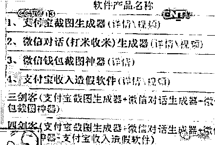****微商装 B 四剑客****除了淘宝客、抖商，其他的电商平台也都有自己的推广方式，比如网易严选的推广就叫网易推手，比如贝店云集等平台就是店长。只是贝店那些平台收会费，佣金低些罢了。****随着微信打击外链的强度日益加强，淘宝客们如今的生存似乎稍微困难了一点，譬如商品不能再发链接而是使用图片，链接只能贴在朋友圈的评论区。总而言之，用户体验下降了。****但实际上，淘客们早就有了新的阵营，各类淘客联盟 APP 才是淘宝客的聚集地，微信只是成交的“最后一公里。”******收手吧，骚年********不管是哪种形式的返利，不管是哪个平台的推手，其最终目的只是为了让你多花钱。当你在羊毛群里认真查看每一个优惠券的时候，已经被不知不觉带进购物的漩涡。********所谓羊毛出在羊身上，你薅的到底是平台，还是自己的钱包？这个似乎没有人想过。********其实各色优惠券和李佳琦的 OMG 有着异曲同工的作用，每一张优惠券就是一句“这个好划算啊，大家快买它”。乍一看各种划算，买到手才发现，这玩意自己压根用不上。****************做生意最长久的方法，是给消费者培养一种习惯。淘宝客深谙此道，羊毛群里的用户们，大多见肉就上，也不管这肉好不好吃，变没变质。********羊毛群里有各种车（优惠活动），其中有一种叫做口水车，也就是所谓的基因检测。用户在指定店铺下单某款价价格约为 500 的基因检测项目，之后给店家寄唾沫样品，大约半个月之后用户收到检测结果并评论，就可以收到店家的全额返现或是购物卡补贴等。********APP 注册拉新拿红包已经是常规操作了，基因检测这个却是真的没看懂。店家为了刷销量，通过淘宝客推广，用户 0 成本检测，淘宝客收取佣金+服务费。********卖家既亏了检测成本还亏了佣金，这样赔本赚吆喝的生意，几乎隔一段时间就会出现在羊毛群里。卖家究竟图啥呢？用户的基因信息又会如何处理呢？********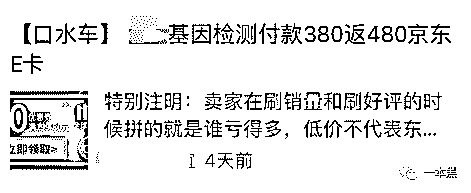********不止口水车是一个谜一样的存在，有的时候，商家所谓的大额优惠券同样是在糊弄傻子。********原价 100 块的商品，卖家在发券之前，提价到 198，再通过淘宝客的推广发放价值 100 元的隐藏优惠券，让用户误以为赚了大便宜，但实际上只优惠了两块钱而已。********如果你打开店铺查看同类型商品，你会发现原价与优惠后的商品差异并不大。但是热衷于薅羊毛的人几乎不会进行这一步的操作。********沉浸于薅羊毛的人压根没意识到这是商家的套路，还觉得自己省下了一大笔钱。********其实他们已经被各式优惠券捆绑在羊毛群里，又被商家的套路所迷惑，完全忘记了自己进羊毛群的初衷。********当你还在薅平台羊毛省钱时，淘客们靠薅你已经实现了暴富。********参考资料：****

*****《深度解析“淘宝客”这个赚钱的神秘行业*》*；**老胡地盘*****

****一本黑新社群已开通，社群名字叫做【一本黑的朋友们】，它没有一个具体的定位，里面会聊赚钱案例、想法、思路；它同时也是一个资源对接平台，帮助大家寻找可以合作的资源，但灰黑产严厉杜绝。
同时也会不定期邀请牛人嘉宾进来分享，听大佬的赚钱经历和想法，与牛人交流，是提升认知的捷径。总之，这是一个全新的成长型、认知升级、资源对接社群，后续会在社群内公布各种有趣玩法。**你还没上车？**

推荐阅读：

[私密社群，快上车](http://mp.weixin.qq.com/s?__biz=MzU4ODAwNzUwMQ==&mid=2247486383&idx=2&sn=0821d0bff33285d235b2e1b9af9a9e27&chksm=fde21a8dca95939b496421a2177f83d8022e5a25ce95ea8b2929b17b26fe95aeb5ca902b722a&scene=21#wechat_redirect) 

[求你们，别再当网红镰刀下的韭菜了](http://mp.weixin.qq.com/s?__biz=MzU4ODAwNzUwMQ==&mid=2247486568&idx=1&sn=72e3538ddd05119daeffc677860ff6d6&chksm=fde21d4aca95945c6b67569a4bb56a6f7524138db69114d6c757a62914ce92defd93f3afdfa6&scene=21#wechat_redirect)

[误入电话僵尸集体被敲诈，我扒出对方手机号，并劝他从良](http://mp.weixin.qq.com/s?__biz=MzU4ODAwNzUwMQ==&mid=2247486577&idx=1&sn=10c235c2de762925a93a18d9182f9455&chksm=fde21d53ca9594458dd8270122f3f44fd748215d8ea8c38fb49502e83b35874c9e1e6595a51b&scene=21#wechat_redirect) 

# 

> 原文：[`mp.weixin.qq.com/s?__biz=MzU4ODAwNzUwMQ==&mid=2247486580&idx=1&sn=fb73ab4ed5bef44b3fbaa35bb614fd4c&chksm=fde21d56ca95944089e55bf0fe7dee84f42dddab62e789123fd91e17f66b68b5a6b6e8689c15&scene=27#wechat_redirect`](http://mp.weixin.qq.com/s?__biz=MzU4ODAwNzUwMQ==&mid=2247486580&idx=1&sn=fb73ab4ed5bef44b3fbaa35bb614fd4c&chksm=fde21d56ca95944089e55bf0fe7dee84f42dddab62e789123fd91e17f66b68b5a6b6e8689c15&scene=27#wechat_redirect)

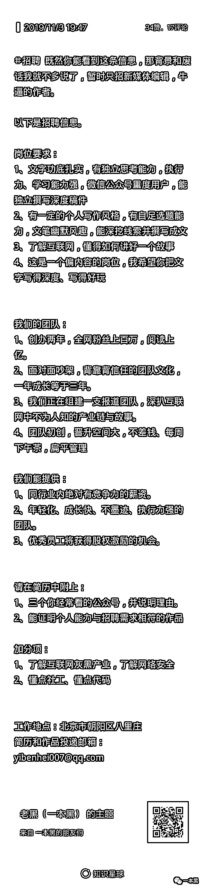****