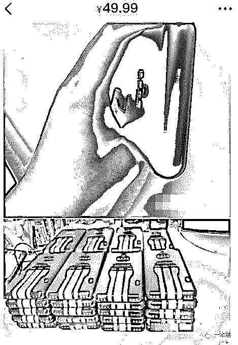
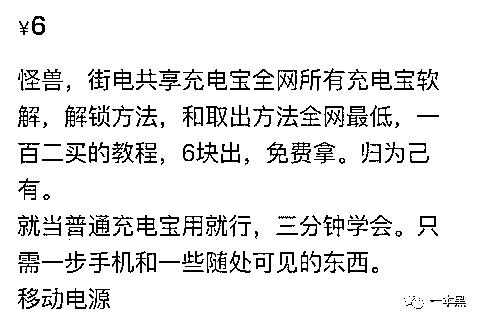
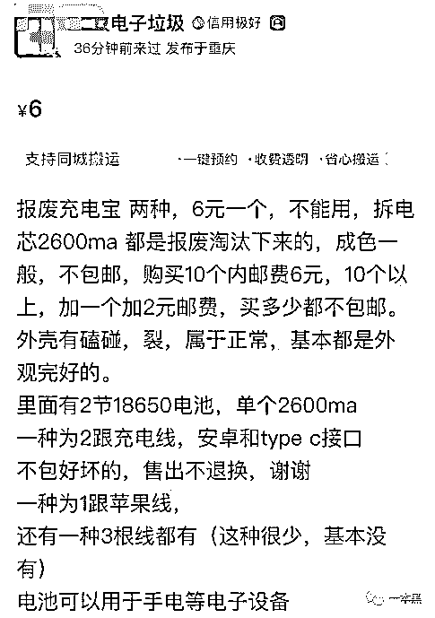
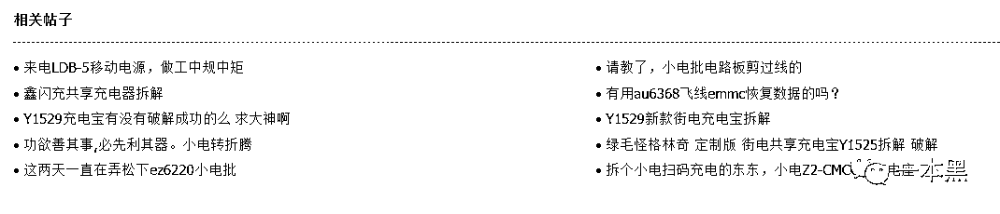
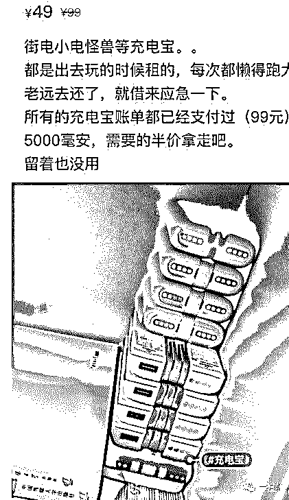
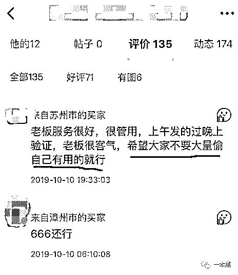
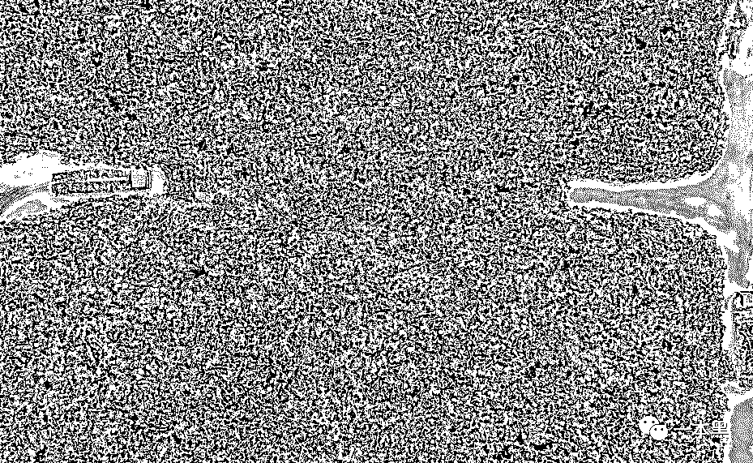
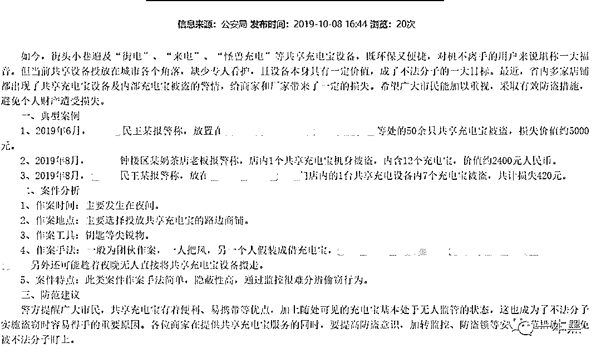

# 暴力破解、闲鱼销赃，忘了他吧我偷共享充电宝养你

> 原文：[`mp.weixin.qq.com/s?__biz=MzU4ODAwNzUwMQ==&mid=2247486487&idx=1&sn=042716704f4c7a82acc3658c20cf8a50&chksm=fde21d35ca959423d6c682d903044d5d45339e580a1fd4c1ba7b8df9a31a5dcaa135cac625be&scene=27#wechat_redirect`](http://mp.weixin.qq.com/s?__biz=MzU4ODAwNzUwMQ==&mid=2247486487&idx=1&sn=042716704f4c7a82acc3658c20cf8a50&chksm=fde21d35ca959423d6c682d903044d5d45339e580a1fd4c1ba7b8df9a31a5dcaa135cac625be&scene=27#wechat_redirect)

【黑话连篇】该栏目更多的是揭露事件或对事件的看法，以达到让人精神得到升华的目的。

* * *

 ****还记得当年王思聪曾说，“如果共享充电宝这玩意能成，他就直播吃翔。”很遗憾，他食言了，我至今没能看到那个盛况。

而当我再次去翻这条微博的时候，发现已经被删除了。

如今遍地开花的充电宝不仅给很多人解决了燃眉之急，也给一些“羊毛党”带来了新的致富商机。

当然，这种行为，是入不了我眼的。

在我看来，共享经济是一门短时租赁经济，方便廉价是主要优势。各种共享物品的出现，某种程度上来说一种便民行为。

但如果有人连这点租金都不愿意付，甚至想要靠剽窃共享物品来赚钱......

这样的钱，不赚也罢。

**咸鱼上的共享充电宝**

**近期，闲鱼上出现了很多共享充电宝及破解教程，价格低的让人心动。5000 毫安的怪兽充电宝最便宜的只要 15 块钱。**

**不止有怪兽，街电、小电、来电、咻电，各大牌子的共享充电宝，要多少有多少。**

**此外，还有各种联名款，什么复联、吴青峰、刘昊然、鹿晗的应有尽有。物以稀为贵嘛，联名款自然卖的也比较贵，售价一般不低于 50。**

****

**看这一摞充电宝，说了忘了还，谁信？？？**

**这类共享充电宝为了防盗其实也是做了很多措施的，然而这些手段在“专业人士”面前，要破解也就是工具和时间的问题。**

**一般来说共享充电宝只能往手机里充电，电量用完了就不能再使用了，充电需要还到公司使用特定的充电器进行充电。有的需要使用底座；有的需要密码充电器。**

**不过闲鱼上的卖家大部分都声称自己的充电宝通过某种技术手段后已激活，完全可以正常使用，一切 ojbk。还有的卖家连密码充电器都给你配好了，即买即用。**

**比起直接买充电宝，对教程感兴趣的也不在少数，毕竟自己动手丰衣足食。只要掌握了技巧，充电宝就可以取之不尽用之不竭。**

**所谓教程就是教你如何免费从商家那“薅”充电宝，说白了就是剽窃，你也可以叫做偷。大家都不是什么读书人，窃就是偷，这事不是薅羊毛就是偷。**

**卖家还大言不惭地说是“免费拿”，归为己有。真是脸都不要了。**

****

**教程 6-20 块钱一份，说是直接利用软件破解，其实压根没有科技含量。**

**无非就是先花钱借，然后在还的档口上整点幺蛾子，再打电话告诉客服：“哎呀，这个充电宝有 bug 啊，我都已经还了，系统还在继续扣我钱，你赶紧给我解决”。**

**出于服务行业顾客至上的的准则，客服一般会选择先处理矛盾，再请人排查核实。**

**而这正是他们钻空子的好时机，至于具体怎么做就不告诉你们了，不然就是教唆人犯罪了。**

**那些卖充电宝和教程的卖家其实并不怎么实诚，因为二手物品不支持退换货，要是买个垃圾回来只能自认倒霉。**

**反倒是那些专门把充电宝拆开卖零件的卖家更为可靠，比如，10 块钱一个的电路板，6 块钱一组的电池。卖家还会告诉你，哪些没开过盒，哪些有开裂可能存在问题。**

**而且卖家还特别良心把昵称都设成 xx 电子垃圾 。**

**   **

**不要担心零件没人买，那些数码论坛上，暴力拆解共享充电宝的教程一堆堆。**

**什么钳子、锤子、扳手、升压器、焊接挨个上，总能一个能搞定。但是暴力总有搞坏的时候，这会子就需要上闲鱼买配件了。**

**      **

**也不知道是他们的时间不值钱还是他们的探索欲和动手能力都很强，明明网上全新的充电宝那么便宜，还非得自己动手整一个。**

****读书人的事不叫偷****

****很有意思的是，每个在闲鱼上兜售共享充电宝的，都不会直接说这是自己薅来的，或者说这是自己通过某些不正当手段拿来的。****

****他们一般都有两个借口：自己借的忘记还了或者朋友送的。****

********

****租个充电宝一小时两三块钱，超时未还，一天扣 10-20 块。只有超过 10 天未还的时候才会扣 100 块押金。****

****一个两个忘了还，买下来还有可能，家里动辄九十个充电宝全都是借了忘还的，侬脑子瓦特了，10 个就是 1000 块啊。****

****为啥非要高价买下来然后再上闲鱼三折转手，牺牲自己成全他人吗？****

****这种鬼话，说出去谁信？****

****还有什么朋友借太多忘了还送自己的，你要是私信问他有几个，那还不是想要几个有几个。我也希望能有这样的朋友，天天免费给我送充电宝。****

****这事刚被曝出来的时候，我在闲鱼搜到了很多教程，等过了两三天，卖教程的少了，卖充电宝的突然多了起来。****

****而且很多充电宝都已经成功卖出，教程就更不说了，前天收藏，隔天就有几十个评论。****

****我想，我们可以这样猜测一下：小部分人卖教程-大部分人买教程-教程下线，大量充电宝上线。****

****买了教程的大部分都表示：“亲测有效，卖家靠谱。”偶尔也有一两个良心发现的，会奉劝大家不要偷太多……****

****又或者是买了教程但不好意思实际操作，并对这类行为发出了强烈的质疑和谴责。但并没有什么卵用，压根没人理他。****

****这钱也太好赚了，绝对的空手套白狼，什么道德、什么伦理，先放一边吧，赚钱才是王道。****

********

****卖的无所畏惧，买的心安理得。****

****行窃如今都能变成一门可以公开交易的生意，真是可笑至极。****

******共享经济死在道德洼地******

******所谓的共享经济原本指的是把闲置的物品重新利用起来，让一部分人获利，让一部分人便利。平台只是中介，帮忙撮合双方需求，赚取服务费。比如 uber，airbnb。******

******但是我们如今所说的共享经济，其实只是互联网短时租赁经济。平台既充当服务方，又承担中介的职责，相当于 B2C。******

******说白了就是，我们没有共享经济，我们只有租赁经济，不管是共享篮球、共享雨伞还是共享轮椅，都是要花钱才能用的，并且还需要向平台缴纳一定的押金。******

******但是你知道咱们企业的尿性都是，新名词=新风口=新生意，说租单车、租雨伞，那肯定没新意。但要是说共享，那就不一样了，资本和用户肯定蜂拥而至。******

******资本觉得能赚钱所以一窝蜂来了，普通用户觉得有便宜不占，王八蛋。所以共享经济在刚开始的时候，十分热闹。******

******满大街的共享单车，公交站台到处都有雨伞，办公室里好几个无人货架，真是要多方便就有多方便。******

******物以稀为贵这个道理什么时候，什么场合都是适用的，当共享单车多到塞满人行道的时候，再也没有人重视它的价值。于是乱扔的、乱写乱画、拆锁搬回家的数不胜数。新闻报道说，中小学生可以徒手开共享单车时，我们都觉得很有意思，甚至有人喊 666。******

******再后来共享单车一家家倒闭，曾经 5 米内就能找到共享单车，现在 50 米内也不定有一辆。******

******      ******

******共享单车坟场******

******当共享单车一批批被丢弃在垃圾场，我们终于开始反思，到底是谁杀死了共享单车。******

******有人说是资本的狂热催生了共享单车潮，大量的品牌疯狂挤进早已饱和的市场，加速了共享车的洗牌；也有人说是品牌方看不清形势，自取灭亡。但不论是哪种结论，人性的贪婪都是压死骆驼的那根稻草。******

******如果说共享单车死于资本和人性的合谋，那么无人货架则是赤裸裸的死于人性之恶。******

******曾经大家都觉得最后一公里是成交关键，于是无人货架做到了最后 10 米，转身走两步就能买东西，简直是白领们的救命福音。******

******我曾经非常看好无人货架，作为共享经济的成员之一，我觉得它应该能超过共享充电宝，成为最赚钱也是活的最久的那一个。******

******但事实证明，我没半点投资眼光，当我眼睁睁看着便利蜂、猩便利、每日优鲜便利购等品牌一个个货柜都搬离了办公室，我知道共享经济在中国，是行不通的的，当然只是就目前来说。******

******再过了一阵，其中某一个货柜又搬回来了，这次不再是开放式货架，而是智能货柜，要绑定微信，扫码开门。由于货架体积容积有限，商品种类大幅减少，买东西的自然也少了。******

******从开放式货架到智能货柜，是一种进步，也是一种无奈。如今的智能货柜已然变成了一个自动售货机，为了防止盗窃，货柜也都摆放监控覆盖的领域。******

******我们现在看到的所谓的“共享经济”除了赚钱之外，考虑的最多的应该是如何防盗，共享经济早已脱离了初衷，既没有盘活闲置资产，也没有减少浪费。******

******共享经济以信任为基础，靠契约来维系。然而频繁的失窃事件，让我们看到的更多的是人性的恶。共享经济，既没实现共享，也没能实现盈利。******

******甚至有人说，共享经济的出路是，涨价。******

************

******不过涨价绝对不是出路，共享充电宝的这波失窃潮之前也经历了一次提价。从最初的 1 元/小时，到现在普遍 5 元一小时，大家租不起充电宝，总有其他的方法解决。比如，上闲鱼买，比如自己动手，“免费拿”。******

******共享经济，最终都逃脱不了人性的桎梏。而那些被迫中途离场的企业，除了低估了对手还高估了人性。每次我们说到共享经济，就总会说到契约精神，会说到道德困境。因为再厉害的防盗也防不住人心。******

******而共享经济的方便之处在于随用随取，并且可以免押金，前提是你得有信誉，比如芝麻分达到一定等级。******

******我就奇怪了，那些免押金租东西的人，为什么非得贪这点小便宜？用自己的信誉去换这几十块钱，真的值吗？******

******再说了共享经济又不是剽窃经济，用了得花钱，借了要还，这是底线。******

******想要薅羊毛，当然可以。然而羊毛是商家主动让利回馈客户给出的优惠活动，这和不问自取是两码事。******

******偷就是偷，别侮辱了羊毛。******

******我在某地政府网站上看到一个公告，叫做【警惕近期盗窃商铺共享充电宝案件多发的预警】，报告里写着当地出现多起商铺共享充电宝失窃事件，初步判断为团伙作案，希望各企业及商铺加强防盗，装好监控，别给不法分子有可乘之机。******

******闲鱼上批发共享充电宝的，你猜猜他们的进货渠道是不会有一部分来自于此？******

************

******你看政府公告里，明确写着这类行为属于盗窃，而实施人群叫做不法分子。******

******所以闲鱼上大量买卖、收购共享充电宝的行为，应该叫做销赃。******

* * *

******“打工是不可能打工的，这辈子不可能打工的。做生意又不会做，就是偷这种东西，才能维持得了生活这样子。”******

******很想问问那些大量窃取共享充电宝换钱的人，是否也是这样？******

******希望有一天，他们碰上喜欢的女孩，不会说出那句，******

************

******“忘了他，我偷电瓶车养你啊。”********** **********一本黑新社群已开通，社群名字叫做【一本黑的朋友们】，它没有一个具体的定位，里面会聊赚钱案例、想法、思路；它同时也是一个资源对接平台，帮助大家寻找可以合作的资源，但灰黑产严厉杜绝。
同时也会不定期邀请牛人嘉宾进来分享，听大佬的赚钱经历和想法，与牛人交流，是提升认知的捷径。总之，这是一个全新的成长型、认知升级、资源对接社群，后续会在社群内公布各种有趣玩法。**你还没上车？**

推荐阅读：

[私密社群，快上车](http://mp.weixin.qq.com/s?__biz=MzU4ODAwNzUwMQ==&mid=2247486383&idx=2&sn=0821d0bff33285d235b2e1b9af9a9e27&chksm=fde21a8dca95939b496421a2177f83d8022e5a25ce95ea8b2929b17b26fe95aeb5ca902b722a&scene=21#wechat_redirect) 

[国庆出游住酒店被偷拍、房门被强行打开，怎么办？](http://mp.weixin.qq.com/s?__biz=MzU4ODAwNzUwMQ==&mid=2247486399&idx=1&sn=54fc1787c019cad282ebc313971993bc&chksm=fde21a9dca95938ba93690487a435e85c548902b209f80ffc4718275c17605cec48812a1da9f&scene=21#wechat_redirect) 

[玩人性、玩套路，还是社交电商又狠又骚](http://mp.weixin.qq.com/s?__biz=MzU4ODAwNzUwMQ==&mid=2247486418&idx=1&sn=f32d8db5d6b33a5d2697bb4c83aa0baa&chksm=fde21af0ca9593e6d8aae5f5dad4b2dc373f59655edaac05ca67761587bd67cd513c858ff56c&scene=21#wechat_redirect)**********