# 约单还是约*？赚钱还是骗钱？

> 原文：[`mp.weixin.qq.com/s?__biz=MzU4ODAwNzUwMQ==&mid=2247486465&idx=1&sn=234064d287424cdb3c86557b6bc76135&chksm=fde21d23ca959435532da6434269e28ac6858511f9d2648b0aeb025c5749190858da4d669e2c&scene=27#wechat_redirect`](http://mp.weixin.qq.com/s?__biz=MzU4ODAwNzUwMQ==&mid=2247486465&idx=1&sn=234064d287424cdb3c86557b6bc76135&chksm=fde21d23ca959435532da6434269e28ac6858511f9d2648b0aeb025c5749190858da4d669e2c&scene=27#wechat_redirect)

【黑话连篇】该栏目更多的是揭露事件或对事件的看法，以达到让人精神得到升华的目的。

* * *

****嘿，同城，约吗？********不要想歪，我说的约，不是那种约，而是做足底按摩、修电器水表的那种约。********当斜杠青年的概念出来时，人人都想拥有一份副业，一门在工作之余还能养活自己的行当。干技术活的，除了本职工作还能接接私单赚外快，像我这种吃啥啥不够干啥啥不行的，就只剩下不值钱的时间。********如果说用时间就能换钱，我能做些什么呢？********让我想想，代吃代喝？不行，减肥更费钱。陪吃陪喝陪玩，这个我行啊。********花钱请陌生人吃饭，真的有人愿意买单吗？********别说，还真有，约单就是专门为撮合这些人而生的平台。从官网的介绍来看，这是一个专业的时间售卖与技能交易平台，据说年交易量超 3000 万单，总交易金额达到 200 亿，注册人数超 7000 万。********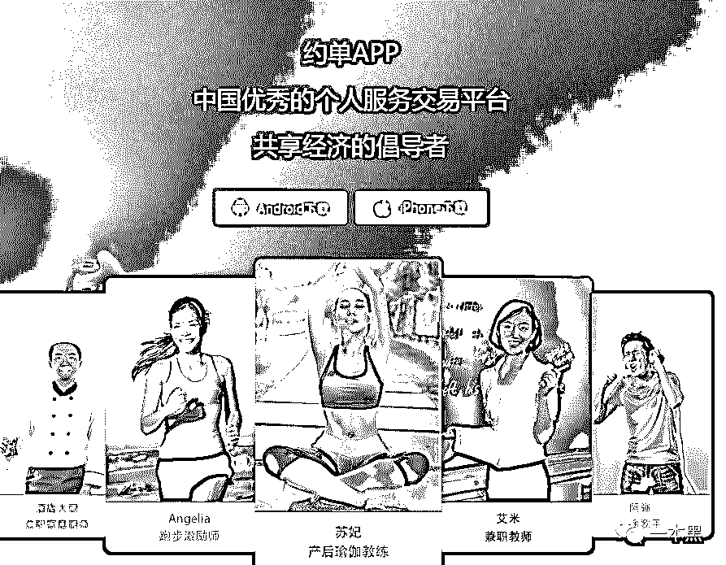********和淘宝一样，只要花钱就能在上面找着任何你想要的东西。不过约单上只交易服务，不交易货物。说白了，就是租人。********从简介上看，这是一个非常友好的 APP，起码对我这样的穷人来说，又多了一个赚钱的渠道。********但是，从网上的评价来看，这个 APP 似乎并没有它说的这么美好，坑人、骗钱、色情和盗用个人信息是出现最多的负面评论，甚至平台还有一些见不得光的东西存在。**********约单到底有多坑**********2016 年网信办发布了《移动互联网应用程序信息服务管理规定》条例，规定 APP 的发布者及使用者需要进行电话、身份证或者微信、微博等认证，确保信息安全。********尽管约单的 APP 上也是这么写的，但实际上却有点区别。条例里说 APP 可以要求用户通过 XX 或者 XX 方式进行实名。********到了约单这就不得了，你根本没得选，不实名就不能用。********想要使用约单，你需要完成以下 5 个认证：身份认证、技能认证、微博认证（实名认证）、支付宝绑定认证（实名认证），微信支付绑定认证（实名认证）。********这是官网上写的，可是等我打开手机一看，认证变成了手机+身份证+支付宝+微博+微信。********居然不再需要技能认证，我以为是角色问题，因为我选的是需求者，也就是花钱请人出饭的那方。********等我切换到服务方的时候，居然还没有技能认证这一项。平台的推拿师和足底按摩都不需要认证就能做吗？于是我又在网上搜了一下，发现曾经的认证中心，甚至还需要芝麻分信用认证？********平台又不能赊账，为什么认证了支付宝还要认证芝麻分。这个谜一样的认证要求，还没等我搞明白，就消失了。无奈~********刚设置好角色和约单方向之后，立马就收到十几条信息消息，大部分来自漂亮小姐姐，还都是 XXX 已接受我的订单请求。********？？？********这个操作怎么有点似曾相识....********我还没发布需求呢，哪来的单？注册的时候必须先填约单方向，也就是兴趣爱好。我不得已选了徒步、足疗和文身三项。********感情平台是觉得，人只要有爱好，就会有需求么？********想看看小姐姐给我发了啥，系统让我先绑定手机号，绑就绑吧。绑完了才看到小姐姐给我发的消息都是让我去充值的，还说能返利，最高返 80%。********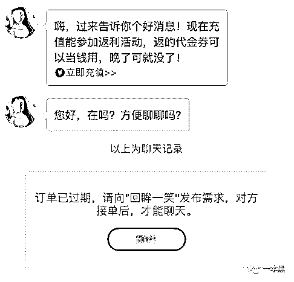********托，不用说了，这绝对是托。不管是文身、足疗还是交友，十几条消息，一半以上第一句话都是让我去充钱。********呸，不要脸。****************我想给她回一句，滚，老子没钱。结果系统提示订单已过期，需要向对方发布需求才能聊天。但问题是发布需求是需要预约的，预约要交诚信金。得了，就是给钱，不给钱还不能发消息。********诚信金最低 50 起，平台说订单如果没达成，系统会把诚信金退回来。********老子信了你的邪哦，吃进去的钱还能吐出来。当初我就在网上看到大家评论说说这个 APP 充的钱有去无回才关注的。********约单这个 APP 还真是不诚信。干啥都要钱，发消息要钱，发需求要钱，订阅消息要钱，干啥都要钱。********给了钱还不一定能约到，有个人是这么说的，相约的永远约不到，约了你的永远见不到人。********说到诚信，我又发现一个点，在约单发布的外部通告里，说 APP 的全球服务者注册量超 7000 万，为 4500 万用户达成了合作。但是 APP 却显示用户量 800 万。********这前后口径差的不是一般大啊，有种牛皮吹上天的感觉呢。****

> *****截止至 2018 年末,约单已经布局落地 400 多个城市,有超过 7000 万的全球注册服务者,帮助 4500 万用户在平台上完成了时间与技能的交易,创造了平台年交易额 670 亿元。**********（来自科技快报《* 约单:用大数据助力共享经济发展》）****

****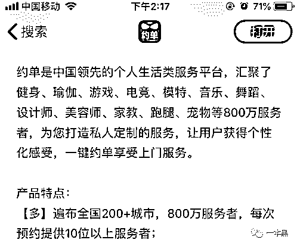********数据虽然对不上，起码还有漂亮小姐姐。********相约吗？一看浏览人数，百万起步，想着先预约，排队等着吧，毕竟小姐姐活好技术好（我说的是足底按摩的那种技术哦），等等也值得。********抱歉了，你是等不到了，不仅等不到人，诚信金也回不来了。在交易达成前，平台总有各种理由扣掉你的保证金。********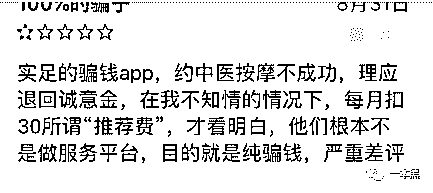********如果你不想约了，想退掉这个单。不好意思啦，诚信金扣 30%哦。********要是想广撒网，增加成交几率，那就选择平台的订阅服务吧，30 块一个月，每个月都给你推荐好多优质服务者。********什么？你只想定一个月。****************这是我的平台，我说你想定几个月就定几个月。听我的，等钱扣完了，你爱去去哪，趁早滚蛋。********如果你很幸运，钱没被扣还想要提现出来。诶，不好意思，你的账户存在异常互动，要被平台封掉了。********嘿嘿嘿。********嗯，被封账号是别人的经验，因为在我的钱包里，我压根都没找提现的按钮。我的钱包里就两个硕大的充值，一个充钱，一个充钻石，钻石 6 块钱能买 420 个。********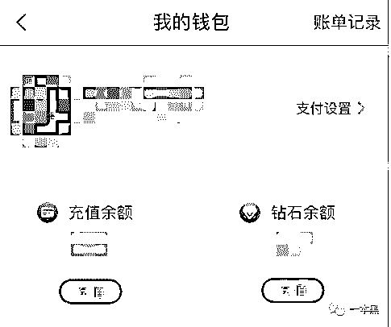********钻石能用来干嘛？我也不知道，因为我打开的每项服务都是要钱的，钻石能用在哪，我真不清楚。希望有使用过钻石的小伙伴帮忙解答一下。********百万流量的性感小野猫********我都怀疑约单这个平台是貔貅变的，只进不出啊。不止在钱方面扣扣索索，这个平台的真实性也让人怀疑。********那些动不动就百万访客量的小姐姐，评论居然才几个或者几十个，但是满意度却很高，五星制，一般都有 4.5 星。********高手都是这样吗？一般不出手，出手不一般。********(但其实所谓的百万浏览量，真实数据可能只有零头。遥记得当年运营网站的时候，每篇文章的起始阅读量我都是设置的 3w 起步）********系统给我推荐的小姐姐也都是十分 胸大 貌美，但我还是有点不敢相信是本人。但是资料里全都写多年推拿经验，手法老道。而且这些推拿小姐姐一般还都有模特的工作。********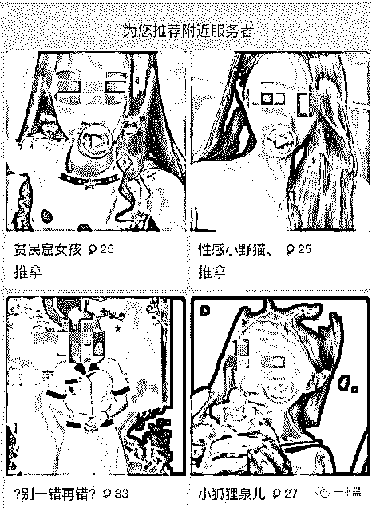********其中有一个叫【**小甜心】小姐姐的个人介绍，让我十分摸不着头脑，********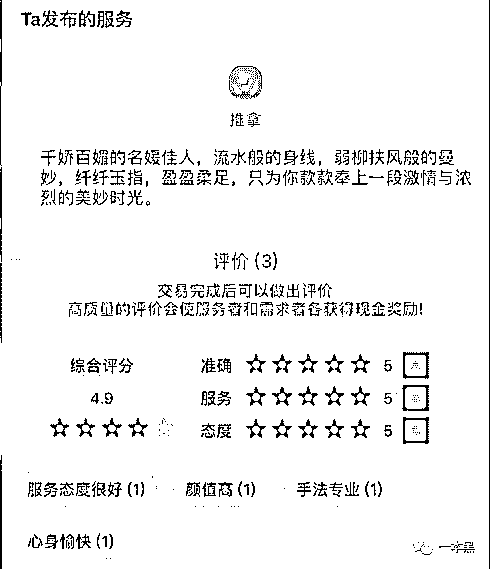****

> *****千娇百媚的佳人**********流水线般的身材。哦不，流水般？平坦？？？的身材**********纤纤玉指，盈盈柔足**********为你奉献一段激情与浓烈的美妙时光*****

****我就做个推拿，你不介绍自己的专业能力，却介绍自己的身材，这有点说不过去啊.....而且连脚都写进去了，是要提供踩背服务吗？********不懂不懂，成年人的世界我不懂。********另外一个模特小姐姐写了自己的身高和三围，175cm，34D，60cm、90cm。我也不知道是个什么尺寸，但应该不差吧。********小姐姐说自己的主业是模特，业余工作是线下服务。哦，她的昵称叫【小妹丽质可爱型】。********这里的小姐姐昵称都挺奇怪，譬如【激情小*妹】、【胸大无脑的**】、【**公主】、【今晚你来驾驭我】、【粉嫩达人】、【性感小野猫】。********诸如此类的小姐姐在我的推荐里，多不胜数。********我就想找个推拿师而已，不知情的肯定误会我要找什么不得了的服务。**********不止坑钱，还盗图**********不止有昵称奇怪的小姐姐，平台还有长相一模一样的小姐姐。********两个小姐姐，一个离我 9 公里，一个离我 20 公里，但是她们长相却极其相似，工作经验也一样。甚至连介绍视频都同样是从好看视频上下载的呢。********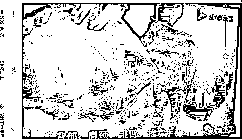********说不定她们是双胞胎，考上了同一所大学，然后在同一个地方，做一样的工作。********对不起，我也不信。因为她们一个 30 岁，一个 34 岁。********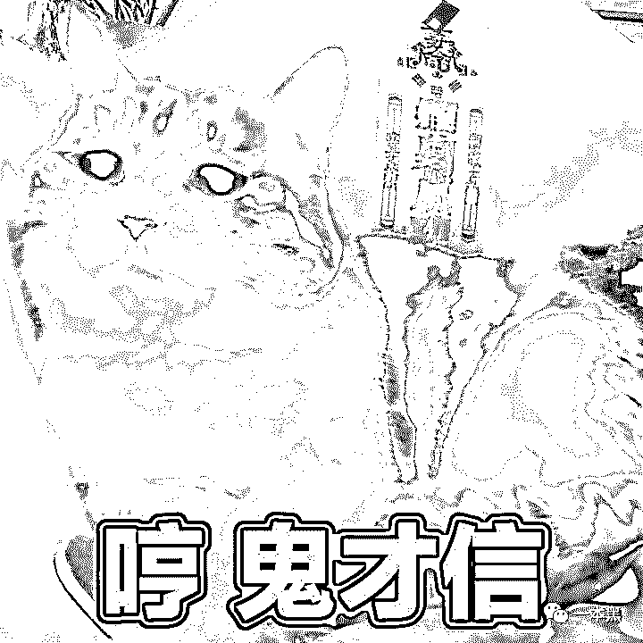********我一直是个好奇心 八卦 比较强的人，于是我就去其他地方求解。然而这个问题，无解。********但我又发现了一个新的问题。********约单这个平台不实诚就算了，用户也不实诚。很多小伙伴们都表示，自己发在微博和朋友圈的照片被人冒用了，连昵称都一样。经常有人打电话过来问她约不约，但问题是，自己压根都没注册过约单。********而且，这并不是个例。********他们决定去约单上投诉，结果你猜怎么着。**********“对不起，您的积分等级不够，不能举报该认证用户。****”**********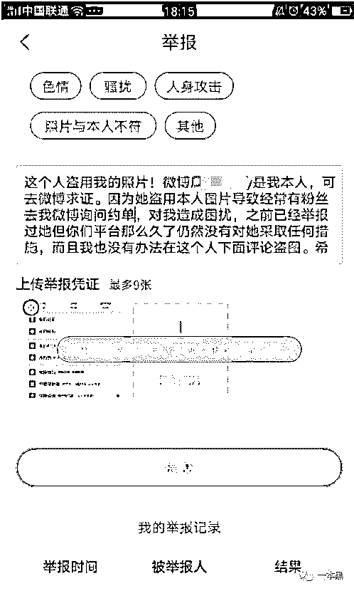********找客服反馈，当然可以，你要提供身份证照片哦，否则不能证明本人在举报呢。给照片原图也不行哦。********实在不行，那自己改个昵称吧。*********平台：**好啊好啊，改名 30 块，谢谢。*********       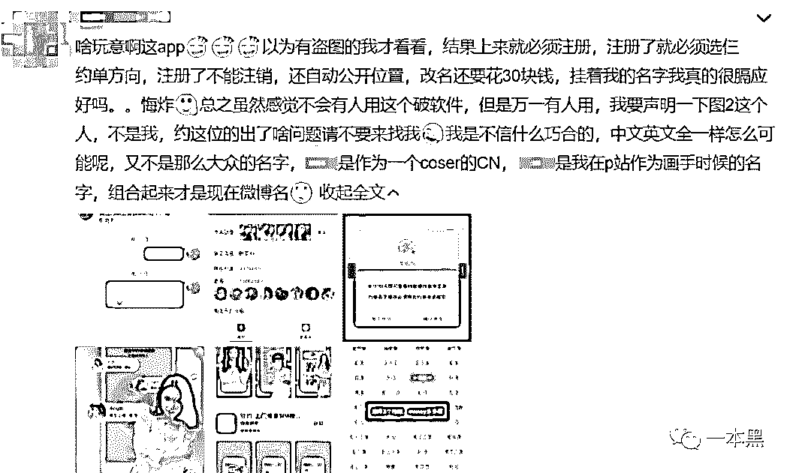********是不是感觉像吞了苍蝇一样恶心。********这个平台，从注册的那一刻开始，就在想着怎么坑用户。不经允许获取你的位置并公开；必选约单方向，选了就给你推人；当你准备聊天就想着法子收钱；收了钱还不提供服务；不提供服务就算了还找借口扣你的钱。********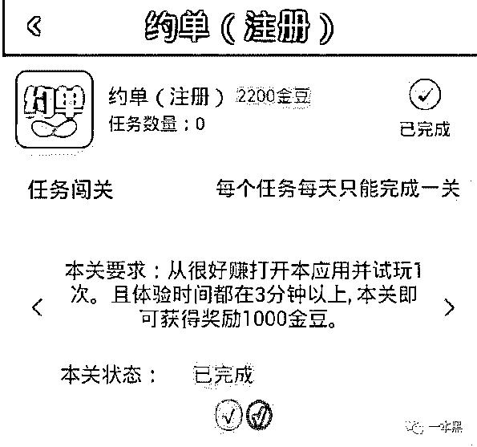      * 图片来自约单官方微博*********约单那几百或者几千万的下载量大概就是这么（雇人注册）来的吧。********真是虚伪、恶心、坑爹，呸~********约单说是他们是基于 LBS 提供服务，也就是所谓的就近原则，你在哪个位置就给你推荐附近的人。我看了下系统给我推荐的，最近的 5 公里，最远的 18 公里。********我也不知道这算不算附近，想当年下趣步的时候，附近的人都是几百米范围内的。约单的自己宣传稿里也写着呢：3 公里范围内，3 分钟上门服务。可惜了 3 公里范围内，一个都没给我推荐。********实际上，约单提供的应该算是同城约单。那和 58 同城、闲鱼上的约人也没什么区别呐，更何况咸鱼还有神兽镇宅呢。****

* * *

****说什么专业技能+时间交易平台，我给人刷锅也是按小时收费的，两者有什么本质差异吗？没有。********所以，你会发现每一个割韭菜的都喜欢造词。********如果你创造了一个新的词，你就创造了一个新的风口，然后你就拥有了一片韭菜田。********说到底还是在利用人性的欲望赚钱，而且这类 APP 从一开始就没想做良民。从面世开始，约单的宣传都是打着交友、脱单的旗号。********然而这并不是一个婚介平台，所以他的交友和早年的陌陌是同一个意思，约单=约人=约* 。什么用技能和时间换钱，只是额外的辅助和遮掩的幌子罢了。********就像曾经路边亮粉红色招牌的发廊，说是理发，其实理哪里还不是顾客说了算。正是这些平台的按摩、足疗、交友、推拿等把一些原本正经的服务行业也搞得乌烟瘴气。********平台上也未必都是虚假信息，然而劣币驱逐良币。与其大海捞针碰运气，还不如换个正经平台找服务。********在 App Store 里搜【约】就能出来几十上百个这样的 APP，里面也都装模作样地写着推拿、交友，实际上干的什么勾当，照片上那些性感火辣的美女在暗示些什么，大家都心知肚明。********但这类 APP 偏就有人下载，随便打开一个，评论量都是几千上万。真实的评论清一色还都是说骗人，不充钱啥都不能干，充了钱立马被骗。充值一般 50 起步，上不封顶。充进去的钱，服务方和平台瓜分。********这其中平台干了啥，啥也没干，注册个公司，然后从网上下载开源代码，找 UI 设计 logo 和页面就能上线。再花钱刷点数据，克隆一点用户资料，不愁没傻子上钩。********子曰， 吾未见好德如好色者也。********嗯，古人诚不欺我。********毕竟，这世上最不缺的就是韭菜，尤其是蔫了吧唧的黄韭菜。********一本黑新社群已开通，社群名字叫做【一本黑的朋友们】，它没有一个具体的定位，里面会聊赚钱案例、想法、思路；它同时也是一个资源对接平台，帮助大家寻找可以合作的资源，但灰黑产严厉杜绝。同时也会不定期邀请牛人嘉宾进来分享，听大佬的赚钱经历和想法，与牛人交流，是提升认知的捷径。总之，这是一个全新的成长型、认知升级、资源对接社群，后续会在社群内公布各种有趣玩法。**你还没上车？**下面是小黑库里的商品（反偷拍小魔镜和安全门档）。反偷拍小魔镜可以检测酒店、民宿、出租屋内是否暗藏针孔摄像头，也可以当做报警器来使用，非常适合经常出差的商务人士、旅游、或者在外住房的任何人士。
安全门档可以帮助你更安全的抵挡房门，小巧方便实用性强，可过安检，出差随身携带也很方便。经常出差、独居、或者旅游的妹子或汉子，并且分外注重个人安全的朋友，都可以入手。如有需要，可以点下面的链接进行购买：

酒店、民宿、出租屋被偷拍怎么办？（小魔镜）

住酒店被偷拍、房门被强行打开，怎么办？（安全门挡）

推荐阅读：[玩人性、玩套路，还是社交电商又狠又骚](http://mp.weixin.qq.com/s?__biz=MzU4ODAwNzUwMQ==&mid=2247486418&idx=1&sn=f32d8db5d6b33a5d2697bb4c83aa0baa&chksm=fde21af0ca9593e6d8aae5f5dad4b2dc373f59655edaac05ca67761587bd67cd513c858ff56c&scene=21#wechat_redirect)

## [电子烟利润这么大，怪不得镰刀一把把落下](http://mp.weixin.qq.com/s?__biz=MzU4ODAwNzUwMQ==&mid=2247486406&idx=1&sn=9a582ca128bf7736f163f57cf2683e4b&chksm=fde21ae4ca9593f2c78ccaeb053491045f88c19e3df9a17095d01a8ff2493c48082c9508bb7d&scene=21#wechat_redirect) 

## [韭菜互割、你亏我赚，股票这一行能赚到钱的，万不足一](http://mp.weixin.qq.com/s?__biz=MzU4ODAwNzUwMQ==&mid=2247486351&idx=1&sn=5bd33d96a03839f44b97e27adc406f1d&chksm=fde21aadca9593bbf6615baf32d561e816fdef5c55024ea16200b256bbc0d95b1f4998261df0&scene=21#wechat_redirect)

**点赞不被割↓******