# 看完抖音高仿明星的生财之道，我自闭了

> 原文：[`mp.weixin.qq.com/s?__biz=MzU4ODAwNzUwMQ==&mid=2247486438&idx=1&sn=61c29c24ff549c19ea166a6c236e1fae&chksm=fde21ac4ca9593d2b3e531bae666d4723cb9d89b05e4c2c7badd04c19866cf2a71f06ab69025&scene=27#wechat_redirect`](http://mp.weixin.qq.com/s?__biz=MzU4ODAwNzUwMQ==&mid=2247486438&idx=1&sn=61c29c24ff549c19ea166a6c236e1fae&chksm=fde21ac4ca9593d2b3e531bae666d4723cb9d89b05e4c2c7badd04c19866cf2a71f06ab69025&scene=27#wechat_redirect)

【黑话连篇】该栏目更多的是揭露事件或对事件的看法，以达到让人精神得到升华的目的。

* * *

 ****当我还年少的时候，我认为知识是属于全人类共同的财富，不论是书籍、影片还是音乐，所以我从不为知识付费。

随着个人素质的显著提高，如今我在支持正版的这条路上，越走越坚定，并且坚信只有正版才是市场的主流，山寨的迟早药丸。

因为，天下苦山寨久矣。

然而，我还是高估了人民群众的鉴别能力......

**从抖音周杰伦说起**

**当朋友圈都在刷屏周杰伦的新歌【说好不哭】的时候，我刷抖音刷哭了。不是因为我买不起哈苏（虽然我的确买不起），也不是因为我没有朋友一起喝奶茶，而是因为我在抖音看到了一个山寨版的周杰伦。**

**那是一个夜深人静的晚上，睡前照旧打开抖音助眠，就在我迅速滑动屏幕的时候，我好像看到了一个眼熟的人。**

**诶？周杰伦也开始玩抖音了?**

**一看名字，雍杰伦~**

**点开他的主页后，我又看到了孟华健、李荣 告、谢 廷 锋。感情这是一个山寨明星团。**

**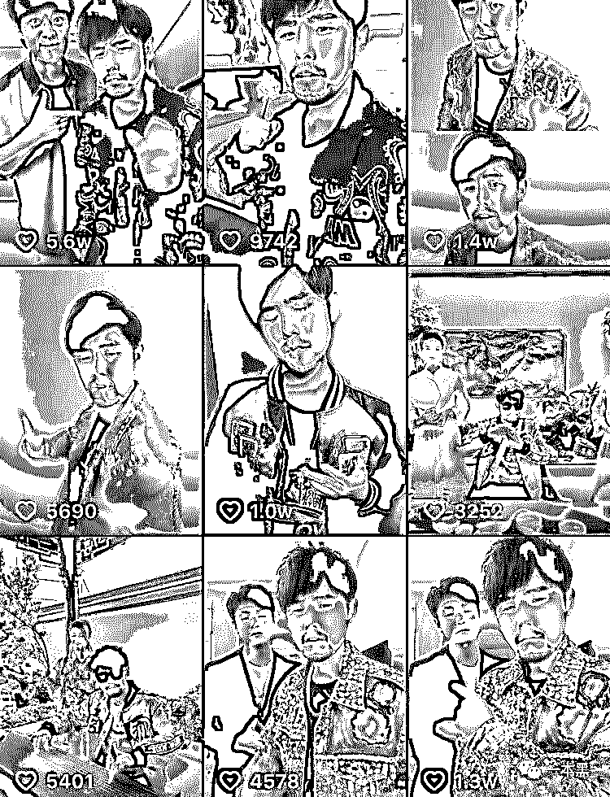**

**雍杰伦的抖音日常就是模仿周杰伦的说话、动作、着装以及发布一些自己参加商演的视频。**

**单看照片的确是像，但是一开口就露馅了。怎么说呢，大概是用力过猛，作的有点过头。**

**如果你是周杰伦的粉丝，看到这些视频应该会觉得尴尬，甚至想要点举报。但这并不碍事，他仍然火的一塌糊涂。**

**雍杰伦如今在抖音上有 170 万粉丝，这 170 万粉丝最直接的变现方式就是卖货了。由于抖音这个平台的鸡贼属性，单从销量来看，你根本无法知道一个人的带货能力到底是强还是弱，因为它显示的是全网销量。**

**所以抖音卖货只能算作是他们的副业。**

**除了卖货，他们还有直播打赏这一收入来源，雍杰伦的直播收入并没有明确的数据。但是抖音山寨赵丽颖上线直播 3 天，就俘获了 200 万粉丝，据称打赏的收入超过百万。**

**如今山寨赵丽颖的粉丝已超过六百万，作为一位职业主播，她的收入，我不敢想象。**

**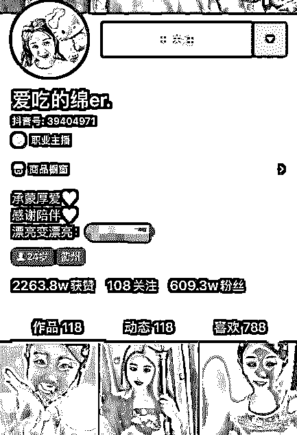**

**虽然雍杰伦的简介写着自己是个演员，但人家开演唱会也同样在行。今年 7 月份，抖音周杰伦（雍杰伦）和快手周华健（快手百万级的主播-孟华健），共同成立了一个叫周而复始的乐队，没错就是周杰伦“周而复始，地表最强”演唱会的那个主题。**

**人家在北京 MAO livehouse 开了场演唱会，票价 220 起。尽管俩都是山寨的，但看看这人气，比一些七八线的小明星还受欢迎。**

**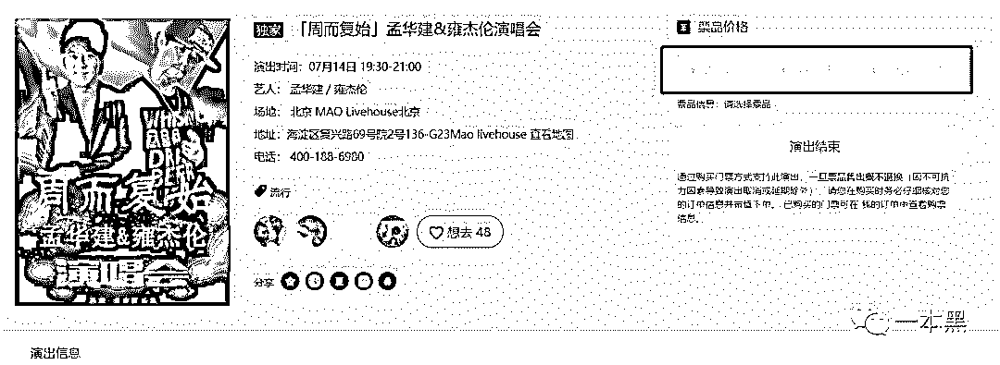**

**他们宣传文案也特别有意思，**

> ***想看华健和杰伦同台演出吗？**来呀！***
> 
> ***我说的是孟华健和雍杰伦啊！***
> 
> ***雍杰伦，举手投足就是 Jay 啊，不信你来现场看看，一张嘴坏了！**更像！***

***在采访里，雍杰伦表示自己也是周杰伦的粉丝，模仿是出于热爱。但打着周杰伦的名号赚起钱来也同样毫不手软。***

***而雍杰伦们只是抖音等平台上山寨明星的一个缩影而已。***

*****山寨明星经济学*****

*****虽然人人都知道应该尊重版权，支持正版，但仿冒品有时候就是比正品更受欢迎。*****

*****前阵子微博上有个热门话题是 #山寨版林俊杰涉嫌欺诈#，说的就是一个叫范一贤的人假冒林俊杰的身份，到处接商演、做代言，成功实现年入百万，最终被本尊起诉的事情。*****

*****当年模仿秀火的时候，催生了一大批靠模仿明星营生的人。后来这波热潮过去，钱不好赚了，于是他们就转移到了各大直播平台。*****

*****从爱好到职业，取决于你是否拥有足够的流量。当这些人靠模仿尝到了流量的甜头后，便开始将模仿明星当成了职业。*****

*****一旦爱好变成可以赚钱的工具，初衷一定会发生变化。起初，可能只是希望模仿的像一些，可以得到偶像的认同，可以得到其他粉丝的喜爱。后来流量大了，就希望模仿的更像一些，钱就能赚到更多一些。*****

*****于是他们变成了职业主播，日常发布模仿视频，也会经常追热点。流量到了一定级别，就可以接一些商演，甚至代言。*****

*****尽管明眼人很快就发现这并非明星本尊，但是如果你看了抖音的评论，你就会发现，那些不知情把李鬼当李逵的同样不在少数。*****

*****而这些分不清山寨和本尊的人，正是那些愿意为山寨明星买单的人群。*****

*****我在抖音上看到了一个山寨版的汪涵，昵称直接就叫涵哥。讲真，除了胡子和眼镜，看哪哪不像。他的模仿视频，更是让人直起鸡皮疙瘩。*****

*****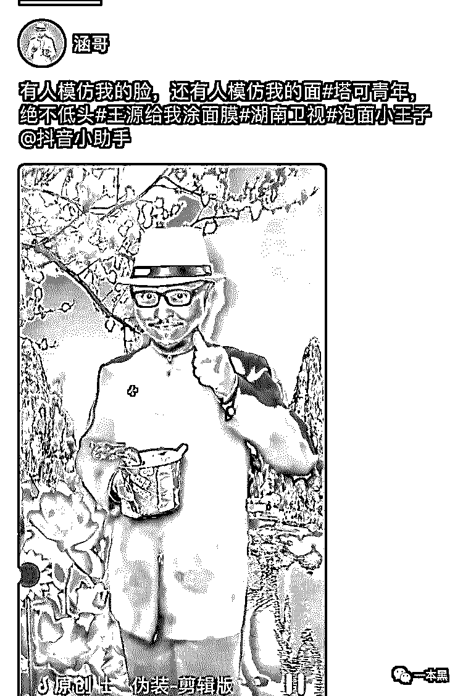*****

*****虽然评论里很多都是对他的嘲讽和质疑，但这根本不影响人家红呀。“涵哥”的抖音号显然是公司运营的，他的主页照片是团队成员的合影。*****

*****虽然我凭衣服只能认出山寨汪涵和山寨小沈阳，但从“涵哥”抖音 60 万粉丝来推测，该公司的号召力同样是百万级别的。*****

*****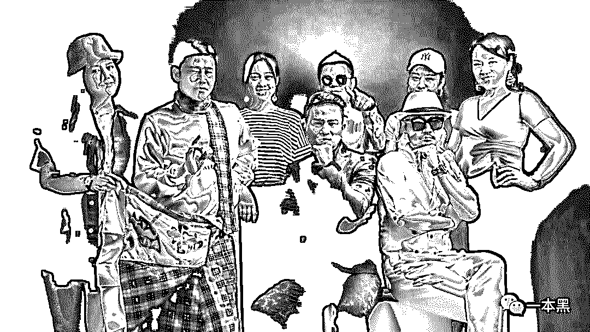*****

*****这就是流量的魅力，喜欢也好，谩骂也好。只要有流量就会有钱赚。*****

*****卖货、直播只是山寨明星赚钱的一种方式，走穴、代言才是他们主要的赚钱方式。*****

*****不要小看山寨明星，在一些小城市，他们甚至比本尊更受甲方的欢迎，原因无他，便宜而已。*****

*****譬如，县城地产开盘和公司年会，是山寨明星去的最多的地方。在雍杰伦的抖音里也能看到他参加一些公司年会表演的视频，一些有钱的公司可能会直接包一个团。什么山寨周杰伦、山寨周华健、山寨刘德华，应有尽有。*****

*****在活动造势的时候，企业方会说：XXX 明星即将空降本地给广大市民带来一场极致视听盛宴。最主要的是，这场活动不需要购买门票，只要你来现场，就能明星亲密接触。*****

*****至于到时候有人发现来的不是明星本尊，而是 XXX 模仿者，活动方大可以解释，“我们没说是本尊啊，我们在名字后边加上了（模仿秀）三个字；又或者是，我们在名字上加了引号。”*****

*****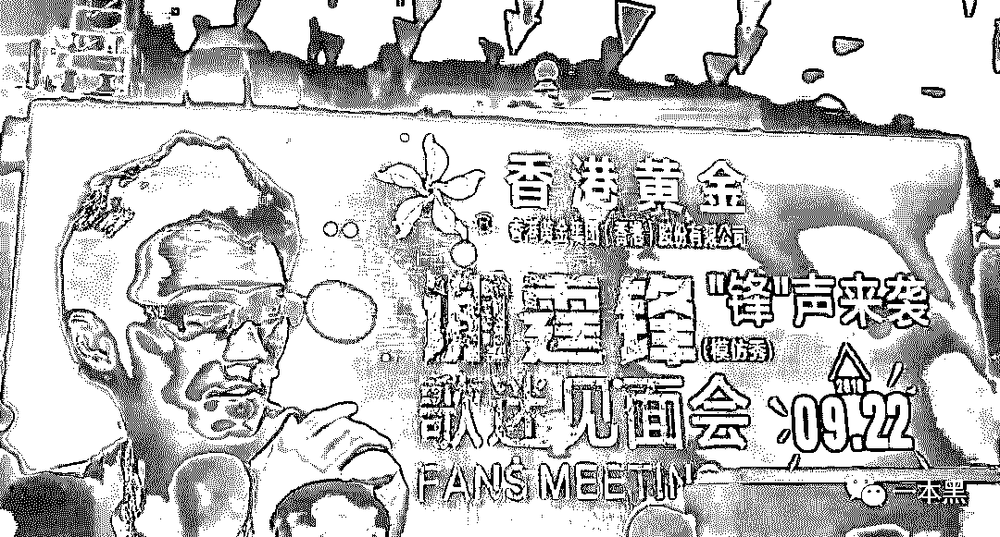*****

*****反正最终解释权归主办方所有，观众怎么想不重要，人来了就行。*****

*****不止娱乐圈明星有山寨版，商界、政界名人同样有山寨版。在一个山寨明星团的官网上，我甚至找到了一些政界名人的模仿者。（出于安全目的，还是打码处理）*****

*****        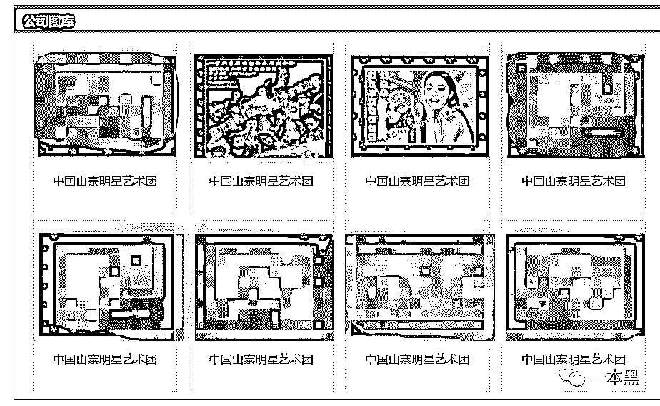*****

*****山寨明星之所以受欢迎，是因为市场有需求。企业花不起上百万的代言费请一线明星，但又想借助明星的号召力，于是退而求其次选择山寨版。***** 

*****与其请个不知名的小明星还不如花钱请个大牌山寨版，起码知名度在那，这个买卖怎么着也不会亏。*****

*****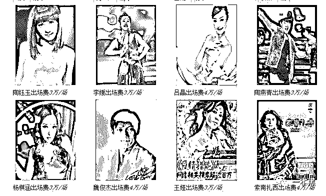*****

*****上图是某明星商演网站出场价 5 万以下的明星，看了一圈，太尴尬了，没一个认识的。*****

*****5 万块，是请一个啥名气没有的十八线明星？还是请四个山寨的一线明星?会打算盘的商家选择后者。*****

*****从人数来算，当然是山寨版的更划算；按知名度来讲，同样是山寨明星更划算。山寨刘德华一定比正版陶钰玉更受欢迎，不信你上街问问。*****

*****毕竟康帅傅这么多年了还没从市场绝迹，你就知道山寨产品的市场有多大。*****

*******nobody  wants  to be nobody*******

*******在直播火起来之前，我从来没想过一天能看到这么多山寨明星。直播平台造就了许许多多的红人，从素人到明星似乎也只在一瞬间。*******

*******虽然他们的明星脸少不了化妆和滤镜的加持，但这不重要，没人在乎卸了妆之后他到底是山寨高晓松还是正版矮大紧。*******

*******赚钱是一方面，舆论是另一方面。赚的钱越多，他们承受的质疑也会更多。*******

*******模仿本身并没有错，也不违法。但靠着模仿明星捞金的人，经常混淆道德与法律的边界，模仿秀是 OK 的，但如果宣传方给出的都是明星本尊的资料，那就涉嫌欺诈和侵犯名誉及肖像权了。*******

*******在这场交易之中，大部分的山寨明星本人是知情的，甚至参与其中。他们通常会使用一些极具迷惑性的词汇甚至使用明星本人的照片作为宣传，这也是他们的惯用计俩。*******

*******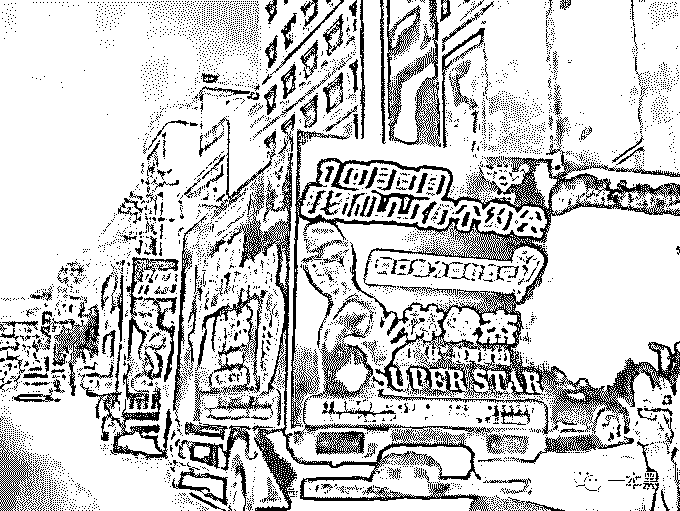*******

*******↑譬如山寨林俊杰-范一贤的宣传海报*******

*******当然也有部分比较有素质的模仿者，他们会拒绝主办方让他冒名明星本尊的做法，并希望主办方能在显著位置明确标注模仿秀等字样，以免误导观众。不过这只是极少数而已。*******

*******山寨明星火是因为他们模仿的明星本人火，某种意义上来说这种行为应当属于傍大款的一种。但是有意思的是，一旦他们处于流量顶端的位置久了，就不再甘心只做明星的影子。*******

*******他们也希望能够以自己真实的身份出现，能够做真正的自我。所以我们会看到很多山寨明星的头衔并不是 XXX 模仿者而是艺人 XXX，然后在个人简介一栏，填上自己过往的经历。比如，XX 模仿秀一等奖之类。*******

*******一方面他们想走出明星本人的阴影，一方面又不得不向现实低头。因为没有人愿意为无名之辈买单，一旦脱离了明星的光环，他们也就只是张三和李四。*******

*******山寨明星从诞生至今，早已形成了一条极其完整的产业链。*******

*******网上喷薄而出的小张柏芝、小赵丽颖正是他们步入这一行的起点，由一张“长”的相似的脸，引发舆论热点，紧接着趁热打铁入驻直播平台，保持热度。*******

*******再经过一段时间的运营之后，等流量稳定了就可以开始变现。不管是卖货还是商演，只要有钱赚，做什么都可以。*******

*******这其实就是一个明星生产工厂，有演艺公司对接客户，有经纪人安排行程，有专门的团队负责运营和炒作。只不过这个工厂专门生产仿冒品，因为时间短、变现快。*******

*******这世上哪有那么多因热爱而生的职业，大部分都只是为了赚钱罢了。*******

* * *

 *******山寨明星就是一门靠忽悠为生的职业，甲方乙方合起伙来骗钱，最终买单的，还是那些狂热的粉丝和不明真相的吃瓜群众。

有人说，自从粉上山寨明星，就成功的实现了演唱会自由。虽然这只是一句戏言，但那些明知是山寨却仍愿意掏钱去看山寨明星演唱会的人，或许真的会这么想。

就像那些买不起限量版 AJ 就选择买高仿的人一样，他们其实内心真正渴望的还是正版，但是钱包有限，于是山寨成为退而求其次的选择。

对于他们来说，山寨更像是一种心理安慰：我尽力了，但我能力真的有限。

通俗点讲，这叫打肿脸充胖子。

当然，他们也有可能就是热爱山寨。毕竟人的认知和审美也不是一蹴而就的，只要方向是上升的，道路曲折一点也未尝不可。

一本黑新社群已开通，社群名字叫做【一本黑的朋友们】，它没有一个具体的定位，里面会聊赚钱案例、想法、思路；它同时也是一个资源对接平台，帮助大家寻找可以合作的资源，但灰黑产严厉杜绝。同时也会不定期邀请牛人嘉宾进来分享，听大佬的赚钱经历和想法，与牛人交流，是提升认知的捷径。总之，这是一个全新的成长型、认知升级、资源对接社群，后续会在社群内公布各种有趣玩法，你还不快上车吗？（[私密社群，快上车](http://mp.weixin.qq.com/s?__biz=MzU4ODAwNzUwMQ==&mid=2247486144&idx=1&sn=e08c4c5b9bfd314a704d48e5e2e26115&chksm=fde21be2ca9592f4dce57c176022770d5bdace121618725bc3c164229a9ddfd1da08b735369c&scene=21#wechat_redirect)）推荐阅读：[玩人性、玩套路，还是社交电商又狠又骚](http://mp.weixin.qq.com/s?__biz=MzU4ODAwNzUwMQ==&mid=2247486418&idx=1&sn=f32d8db5d6b33a5d2697bb4c83aa0baa&chksm=fde21af0ca9593e6d8aae5f5dad4b2dc373f59655edaac05ca67761587bd67cd513c858ff56c&scene=21#wechat_redirect)

## [电子烟利润这么大，怪不得镰刀一把把落下](http://mp.weixin.qq.com/s?__biz=MzU4ODAwNzUwMQ==&mid=2247486406&idx=1&sn=9a582ca128bf7736f163f57cf2683e4b&chksm=fde21ae4ca9593f2c78ccaeb053491045f88c19e3df9a17095d01a8ff2493c48082c9508bb7d&scene=21#wechat_redirect)

## [韭菜互割、你亏我赚，股票这一行能赚到钱的，万不足一](http://mp.weixin.qq.com/s?__biz=MzU4ODAwNzUwMQ==&mid=2247486351&idx=1&sn=5bd33d96a03839f44b97e27adc406f1d&chksm=fde21aadca9593bbf6615baf32d561e816fdef5c55024ea16200b256bbc0d95b1f4998261df0&scene=21#wechat_redirect)

# 

> 原文：[`mp.weixin.qq.com/s?__biz=MzU4ODAwNzUwMQ==&mid=2247486426&idx=1&sn=a934f8df0312a7dcfb5c699d5e6e8721&chksm=fde21af8ca9593ee4c7c00c129e9cc55a6d4ace6002fccfd26630db09530b043046e84d9556e&scene=27#wechat_redirect`](http://mp.weixin.qq.com/s?__biz=MzU4ODAwNzUwMQ==&mid=2247486426&idx=1&sn=a934f8df0312a7dcfb5c699d5e6e8721&chksm=fde21af8ca9593ee4c7c00c129e9cc55a6d4ace6002fccfd26630db09530b043046e84d9556e&scene=27#wechat_redirect)

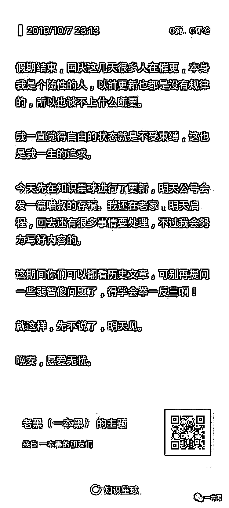

# 

> 原文：[`mp.weixin.qq.com/s?__biz=MzU4ODAwNzUwMQ==&mid=2247486424&idx=1&sn=bbd30bf5a1e101a5ffe17746b43fcf7a&chksm=fde21afaca9593ecdd05730fcf98d559a25e099322aaa49739d74aedc810b3203f6385219b2e&scene=27#wechat_redirect`](http://mp.weixin.qq.com/s?__biz=MzU4ODAwNzUwMQ==&mid=2247486424&idx=1&sn=bbd30bf5a1e101a5ffe17746b43fcf7a&chksm=fde21afaca9593ecdd05730fcf98d559a25e099322aaa49739d74aedc810b3203f6385219b2e&scene=27#wechat_redirect)

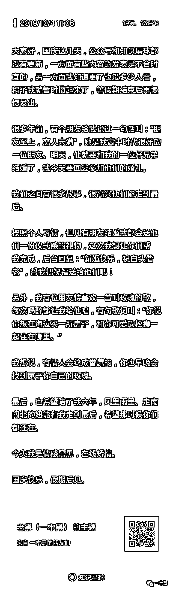***********