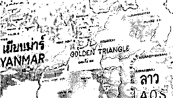
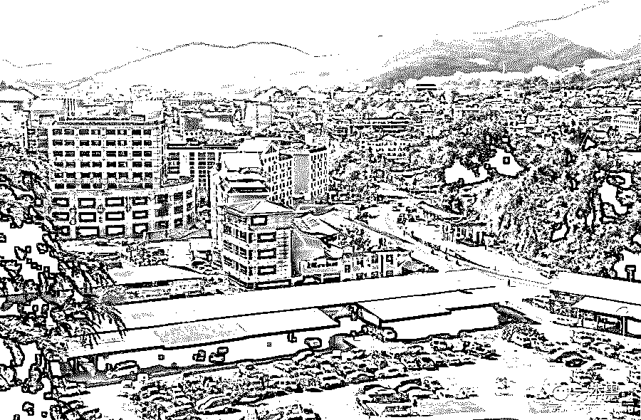
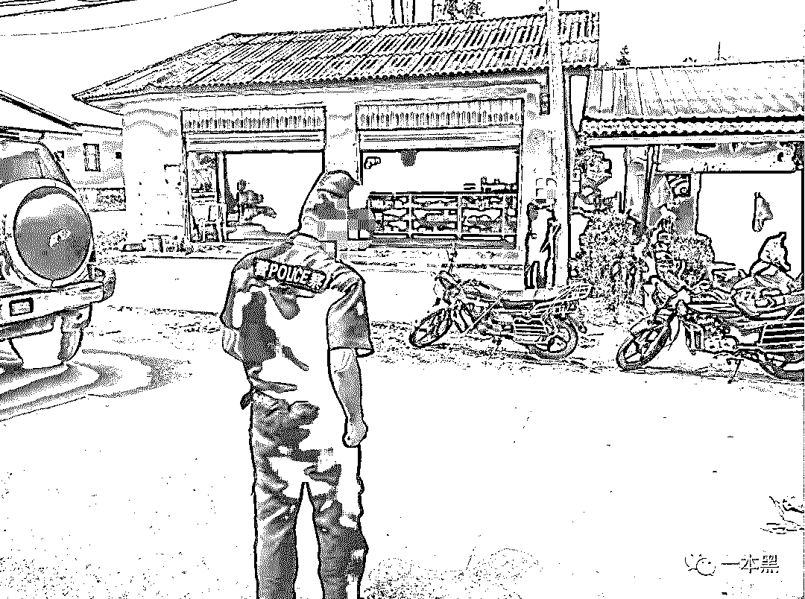
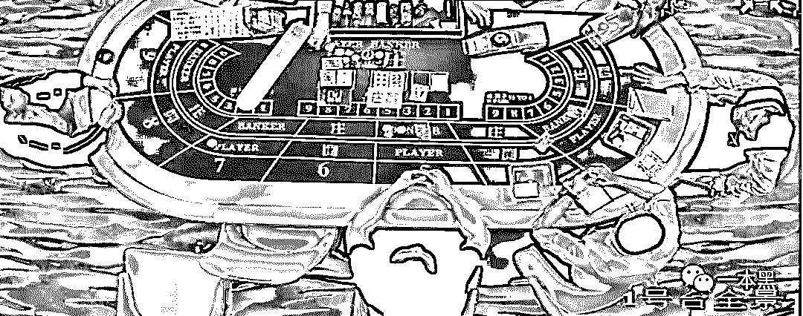
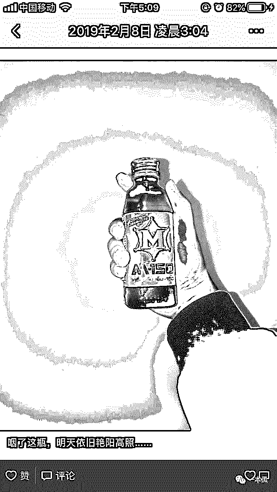

# 金三角见闻录：16 岁当警察，19 岁挪用公款赌博入狱

> 原文：[`mp.weixin.qq.com/s?__biz=MzU4ODAwNzUwMQ==&mid=2247486366&idx=1&sn=3dc0618e4026142b3c7263b4c722dbec&chksm=fde21abcca9593aa61d48ba3e8f5cc1957679f5bf42b2eba5c18c34de8ffa8714a27bb845cf6&scene=27#wechat_redirect`](http://mp.weixin.qq.com/s?__biz=MzU4ODAwNzUwMQ==&mid=2247486366&idx=1&sn=3dc0618e4026142b3c7263b4c722dbec&chksm=fde21abcca9593aa61d48ba3e8f5cc1957679f5bf42b2eba5c18c34de8ffa8714a27bb845cf6&scene=27#wechat_redirect)

【黑话连篇】

该栏目更多的是揭露事件或对事件的看法，以达到让人精神得到升华的目的。

* * *

****我对金三角的了解仅限于港片中介绍的毒品天堂，混乱和欲望是它的代名词，但这早已不是今天的金三角。********如今的金三角平静且繁荣，一些见不得光的东西也只在暗处流动。对安守本分的人来说，枪支和毒品是一辈子都接触不到的违禁品。********但是赌博和性交易却依然光明正大地存在着，虽然每个人都知道那是不能触碰的禁区，但有时候人的欲望稍微一越界，就会造成无法挽回的结果。****

* * *

****16 岁的时候，你在干什么？逃课上网，偷看隔壁班花又或是忙于应对即将到来的中考？********你我或许终其一生都只是个平凡的普通人，平凡的经历，平凡的学历，平凡的外貌，就这样过着平凡而又平庸的人生。********没有大起大落，亦不至于大喜大悲，平凡又平稳。********但有些人不一样，他们的人生很早就开始燃烧，炽热并且深刻。********譬如，今天文章的主人公，16 岁就成为了缅甸第四特区的一名警察，虽然是基层，但前途依旧坦荡。********凭借他的胆量以及勇气，或许将来会平步青云，但是因为一念之差，他不仅丢掉了铁饭碗，还丢掉了自由，虽然只有三个月......********我不知道他叫什么名字，只知道他的微信昵称叫“救赎”。********这个昵称和他的经历倒是很相符，至于他要救赎什么？我没问，他也没说，但我想你看完应该会明白。********在随后的交谈中，我发现他和我见过所有年轻人都不一样，不仅仅因为他的经历，更因为他的认知。********他向我讲述了他在金三角当警察的那三年以及挪用公款赌博被抓，后来被释放又回到中国重新开始的故事。********......********救赎，今年 20 岁，土生土长的中国人，在国内念完初中后毅然决定离开校园去社会上闯荡，********由于父母早年就离家去往缅甸做生意，所以救赎大部分时间都是一个人生活，从小学一年级开始寄宿，辗转云南、福建两地。救赎完成了九年义务制教育后就毅然决然地离开校园，去了缅甸。********用他自己的话说，从此开始了他操蛋的人生。********救赎所在的地区位于缅甸金三角区域的掸邦东部第四特区，号称缅甸拉斯维加斯的勐拉，这是一个高度自治，并且带有十分浓郁的历史遗留的地方。********这里也是华人的天下，95%的人都说汉语，用人民币，甚至用着中文教科书。如果不看路牌，你甚至以为自己就是在中国。********曾经臭名昭著的金三角，在毒品交易被禁止后开始大力发展第三产业，勐拉如今的支柱性产业也变成了博彩和木材，毒品和枪支受到严格管控。********尽管金三角地区的局部动荡依然存在，缅甸依然处在内战之中，但也没有电影里的漫天炮火，和平仍是这片土地如今的主旋律。****************图片来自网络********这不是一个罪恶之城，也不是欲望之都。金三角没有想象中的繁荣，却也不再是曾经的硝烟四起。********其实，罪恶归根结底是来源于个人的贪欲，和城市并无关联。********虽然生活在这样一个繁荣与混乱并存的地区，但 15 岁的救赎却也从未没有接触过这些，对于读书或许没什么热情，但也算不上是坏孩子。********救赎很顺利地在当地找到了人生第一份工作——酒店前台。日常就是打打酱油，调戏调戏小姑娘。********这份工作大概干了半年时间，救赎也满了 16 岁，在缅甸，16 岁就代表你是个成年人了。********于是救赎的父母给他找了份警察的工作。********或许每个男生，年少时都有一个警察梦，所以尽管这是父母的意见，但救赎也非常乐于配合。********就这样，救赎开始了他的警察生涯。*********（以下根据口述整理）***********16 岁成为警察**********中国警匪片里警察与黑帮的生死对立，实际上在东南亚并不总是成立。警方与地方势力有的时候可以并行不悖，当然尊重警方的权威是前提，现实中也不会有人傻到故意去找警方的茬。********在缅甸，警察同样是终身制的，但不属于公务员而算是服兵役，工资按津贴算，我那会的工资差不多 400 块一个月。********幸亏不需要养家糊口，不然全家都得饿死。虽然工资少，但也算是个铁饭碗了。好好干的话，未必没有前途。********在缅甸，不论是社区民警、交警还是刑警都称为警察，由警察局统一管理。不论哪种案件，只要碰到了，警察就有执法权。********我进去之后被分到了警察局交通科，负责路查。****************图片来自网络********就是国内交警干的活，查一下酒驾啦，有没有超速超载、违规停车一类的。万一出现了重大交通事故，还需要帮忙处理现场。********我刚进去的时候连制服都没有，只能穿便装，每天披个反光衣执勤。一个月以后发了制服，半年之后才给发了制服标志。********结果刚穿上制服没多久就碰上 9·28 事件（地区武装冲突），那天一大早，局长就下命令了，要求每个人都荷枪实弹，带好行军包和米袋等物资。********我那会真的有点慌，心想不会这么惨吧，我才 16 岁呢，就要上战场打仗了。但这是命令，没得反抗。********一番心理斗争之后，就看开了，大不了就是一死咯，况且还不一定。********结果，我连战场都没上去过，每天抱着枪在单位待命，就这样持续了半年。但这半年里，也不是完全没事做，交通警察的工作还得继续。********也就是在那个时候，我第一次接触到了尸体。********当时我还是个新人，属于单位的螺丝钉。所以当事故组缺少人手的时候，我理所当然地被派上了用场。********由于勐拉没有殡仪馆，所有交通事故导致的死亡人员，都需要警察处理：派车拉到专门存放遗体的地方，冷冻，直到家属前来认领。********那天晚上发生了一起重大交通事故，事故组要出车运尸体，恰好人手不够，我就跟着去了。********在车上的时候，我特别紧张，毕竟是第一次接触尸体。自己在心里想象了各种血腥场面，越想越害怕。********那些老同事人还蛮好，一直安慰我，说这是做善事啊，不用害怕。********等真正到现场的时候，我发现其实也没那么可怕，那是一个脸上沾满了血迹的女人，静静地躺在那，看起来就像睡着了一样。********于是我也镇定下来，和同事一起把遗体搬到了专门的冰箱放好。那会只觉得遗体有点硬，有点重还有点冰，此外也没有什么特别的感觉，回去之后连噩梦都没做。********后来我就调到了事故组，这样的场面见的多了，也就习惯了。********万一碰上遗体长期无人认领的情况，我们还需要帮忙处理遗容，比如用酒精擦拭干净遗体面部，然后拍照，发布遗体认领公告。********有时候，一周能发生 5 起交通死亡案件，忙都忙不过来，更别说瞎想了。********因为要直接面对死亡，所以也更能看清人性。********比如一些家属在看到遗体后，第一反应不是伤心，也不是想办法处理好尸体，让他体面地离开，而是想着钱，想怎么样才弄到更多的赔偿。********碰到这种情况，我一般就直接开骂了。什么文明执法，我去你的。如果一个人连对生命最基本的尊重都没有，文明对他来说又有什么有意义？********还有一次，遇到一个超速的司机，小伙子才 18 岁，因为开快车撞到柱子，场面极其惨烈。等送到医院的时候，大口大口喷血，整个床单全被染红。医生也放弃了抢救，我只能眼睁睁看着他在我面前断气。********生命明明是那么的脆弱的东西，可是人们一点都不珍惜。用生命去博时间，真的有必要吗？********事故组的工作当然不只是处理尸体，疏导交通、画现场事故图、责任认定、双方协商以及后续赔偿等一系列事情，都由我们负责。****************图片来自讲述者朋友圈**** ****如果出现事故双方当天没有达成一致，那还需要将他们暂时羁押，收保证金，等到第二天重新协商处理。********总之，大大小小的事情，全都由我们负责，每天都忙得晕头转向。********有时候睡到半夜还被叫起来出勤，长时间下来累到整个人都虚了，六味地黄丸在我们那几乎人手一瓶。********说出来有点好笑，但事实的确如此。**********膨胀的欲望和失控的野心**********日子就这样一天天过去，忙碌且充实。原本以为自己会在这样的状态下，一步步往上，直到有一天，我突然发现，自己有了一些欲望。********对于钱的欲望，那个时候我非常非常地渴望钱，多少钱呢？那当然是越多越好。********至于要么多钱来干嘛？其实我自己也不知道，就是想要而已。********但是你知道的，靠每个月 400 块的工资，我这辈子都不可能赚到钱。********可是，这里是勐拉，缅甸的拉斯维加斯啊。每当夜晚降临，五彩霓虹灯照亮的不只是黑夜，还有一颗颗渴望财富的心。********巨大的金钱流动中，焉知下一个赢的不是我？****************图片由讲述者提供********于是我开始赌博，一开始只花自己的积蓄和工资。但那点钱就和小孩过家家似的，我也没有赌神的天赋，钱很快就输光了。********前面说过，发生交通事故，司机需要交纳保证金，这笔钱当天会过我们的手，而且是现金。于是，我动了点手脚，把钱拿到了赌场。********刚开始怎么打怎么赢，于是整个人都很自信，觉得赚钱有望，然后就越玩越大，结果一直输。怎么玩怎么输，最多的时候三五分钟就能输掉五万块。********赢小头，输大头，先给甜头再杀猪，所有的赌博都是这样的。********慢慢地搭进去的钱越来越多，于是我不再执着于赢，就只想着怎么才能不输，顺便赚把挪用的亏空补上。于是拆东墙补西墙，动的钱越来越多。********大概过了一个半月的时间，财务发现有笔钱对不上，过来找我。我想办法拖了一个星期，但最终还是被发现了。********赌博加挪用公款前前后后差不多花了 75 万，也就不到两个月的时间。********再后来，家里把钱补上，我也去了监狱，待了三个月左右。********那一年我刚满 19 岁。********经历了人生的大起大落，也在监狱里见识了很多不一样的人，听了很多的不同的故事。********监狱风云的确存在，每个监狱都有一个老大的存在，每个新来的都要觐见老大，并且下跪听训。对于老大的话必须如实回答，并且遵守规则。否则会受到一些教训。********但缅甸也同样是个人情社会，鉴于我曾经的警察身份以及和狱警的关系，在监狱里并没有人为难我，也没有人叫我下跪。********尽管在里边也碰到了两个曾经被我亲手送进去的人，但这并没有发生报复事件，甚至我们还一起抽了烟。因为我只是按规矩办事，交不上钱就只能进监狱，这是法律的规定。********因为赌博欠钱被送去的大有人在，我不是唯一一个。有个曾经参加越战的老兵，也是因为这个进去的。********赌博害人，从来不分职业。即使你曾经是正义的化身，是人民公仆，一旦沾上了就逃不掉了。没有人例外。********图片来自网络********现在回想那段时光，自己都觉得疑惑，为什么对金钱的欲望会突然膨胀？********家里又不缺钱，我也没什么生存的压力，对工作也满意，但就是莫名其妙地走上了不该走的路。那些被放大的欲望和失控的行为，感觉就像梦一场。********现在还是会觉得很遗憾，丢掉了热爱的工作。其实一开始也没有那么喜欢警察这份职业，但穿上那身制服的一刻，就会觉得肩上有了责任和担当，我喜欢那种感觉，慢慢地就会更加热爱，也更加不舍。********而且我喜欢挑战，每当一个混乱无序的场面出现的时候，我们能在最短时间内重建秩序，让当事人想办法解决问题，而不是忙着悔恨与自责。这个对我来说很有挑战性，也很有意义。********但现在说这个也没什么用了，一切都过去了。**********救赎与新生**********尽管现在说起来云淡风轻，但刚出来的那个几月，每天都活在悔恨与迷茫之中。因为，我真的很喜欢警察那份工作啊，可是我却亲手毁掉了自己的前途。********不知道将来自己应该去做什么，夜里总是睡不着觉，就一遍遍告诉自己，失去的东西一定要再拿回来。警察这份工作，或许永远也回不去了，但是钱可以......********于是，我又去赌了，没钱就找人借，很快又花掉了十多万。********原本想翻身，结果发现靠赌根本翻不了身，反而跌的更惨。赌博宛如杀猪，你永远赢不了那个拿刀的刽子手。********后来我就戒赌了。********在惨痛的现实面前，我不得不低头，因为我真的怕了，也输不起了。********在很多夜晚，每每回想起那段时光，就会觉得觉得失望，然后陷入深深的内疚。内疚之后，更多的是迷茫，我不太知道自己还能干些什么？会不会再和从前一样，还能充满热情与斗志。****

****图片来自讲述者朋友圈****

****有的时候，越想越想不开，最夸张的时候，我曾用枪抵着自己的太阳穴，以为这样就能一了百了。********但冷静后发现，即使这样也不能改变既定的事实，犯过的错，依然存在，并将永远存在。********或许随着时间的推移，不相关的人都会慢慢淡忘，但与之相关的我，却永远都是别人口中的“那个犯错之后想不开的少年”。********于是我不再整日沉溺于这种无望的、无用的负面情绪之中，我开始帮着家里处理一些生意上的事情。或许是因为忙了起来，自己的心态也慢慢变得好了一些。********后来禁入令出来以后，我再一次回到了中国，找了份总经理助理的工作，每天开开车、打打杂，日子清闲又无聊，在这里没有人探究我的过往，也不会有人在意我的将来。********但我知道，在这里的每一天，我都将迎接一个新的我。一个逐渐从阴暗走向光明的我。****************图片来自讲述者朋友圈********可以直白的说，今天的我对钱的欲望依然强烈，但我不会再寄希望于赌博。等两年限制期过了，我会回到缅甸，继续我新的生活。********或许将来我会和家人一样，去做生意，又或许是在一个完全不同的领域闯荡。不管是哪一种未来，只要是正确的的道路，我的家人都会竭力支持我。********毕竟在我犯错的时候，他们也从没想过放弃我，只是不停地鼓励我，走出来，然后走下去。********尽管对于未来，我目前没有明确的规划，但只要一直往前，方向就会出现。****

* * *

****在和救赎的沟通中，他反复强调要突出金三角如今的安全稳定以及当地警察的公正与合法。诚然我对金三角并不存在什么偏见，但我依然仔细检查了文章中的措辞。********我理解救赎的心情和执着，因为缅甸算是他的第二故乡，警察曾经是他最爱的职业，没有人希望自己热爱的东西被误解或者被抹黑。********越是强调，越显得重视，也更觉得遗憾。如果没有这个意外，他应该会成为一名人人称赞的好警察。********然而，塞翁失马焉知非福。********救赎今年才 20 岁，人生仍有无限的可能，只要一直往前，方向就一定会出现。********回想一下我的 20 岁，似乎没什么记忆深刻的事情。我的整个青春大概可以用两个词来形容，那就是，荒芜、迷茫。我的精神世界极其贫乏，我的人生经历极其平淡。没有理想，没有爱情，也没有穿越世界的旅行。********在度过了荒芜的青春后，又进入了一个新的荒芜。********那么你呢？********你的 20 岁又是怎样的。********一本黑新社群已开通，名字叫【一本黑的朋友们】，它没有一个具体的定位，里面会聊赚钱案例、想法、思路；它同时也是一个资源对接平台，帮助大家寻找可以合作的资源，但灰黑产严厉杜绝。同时也会不定期邀请牛人嘉宾进来分享，听大佬的赚钱经历和想法，与牛人交流，是提升认知的捷径。总之，这是一个全新的成长型、认知升级、资源对接社群，后续会在社群内公布各种有趣玩法，还不赶快上车？      ****