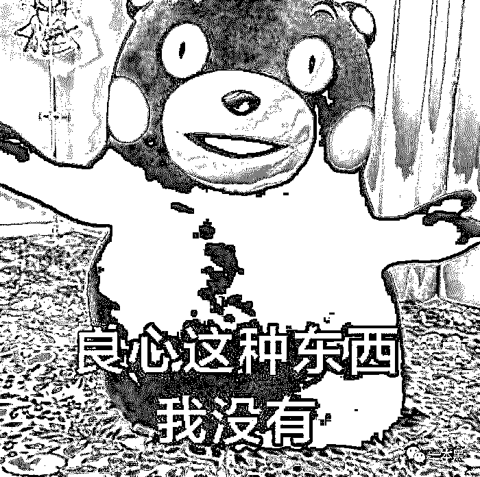
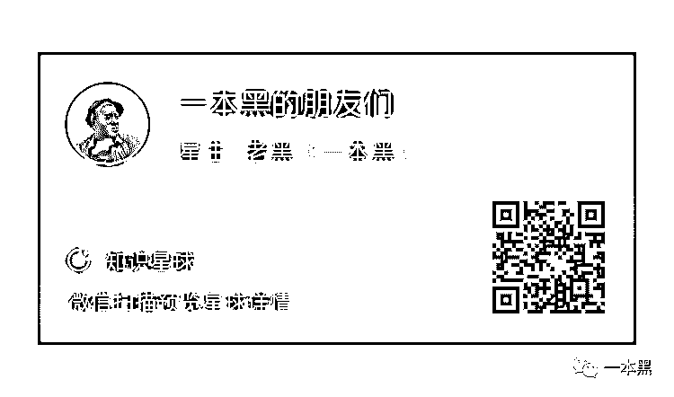

# 韭菜互割、你亏我赚，股票这一行能赚到钱的，万不足一

> 原文：[`mp.weixin.qq.com/s?__biz=MzU4ODAwNzUwMQ==&mid=2247486351&idx=1&sn=5bd33d96a03839f44b97e27adc406f1d&chksm=fde21aadca9593bbf6615baf32d561e816fdef5c55024ea16200b256bbc0d95b1f4998261df0&scene=27#wechat_redirect`](http://mp.weixin.qq.com/s?__biz=MzU4ODAwNzUwMQ==&mid=2247486351&idx=1&sn=5bd33d96a03839f44b97e27adc406f1d&chksm=fde21aadca9593bbf6615baf32d561e816fdef5c55024ea16200b256bbc0d95b1f4998261df0&scene=27#wechat_redirect)

【黑话连篇】

该栏目更多的是揭露事件或对事件的看法，以达到让人精神得到升华的目的。

* * *

****一位股民，究竟能催生多少条黑产，是大多数人想象不到的。**** ****很多从事股票相关工作的人，多少都会带着暴富的心理入场，在经历了股市的繁华与震荡之后，有人美梦破碎，选择出走；也有人转化角色，试图破局。********总之，这一行做得小的也许只有几个人，做得大的甚至可以做到上市公司的规模。********现在的股市早已不是当年那个股市，业内乱象丛生，民不聊生。********今天的文章特别硬，没有嬉笑怒骂，会从四个方向聊一聊这个行业里的一些玩法。**********一、  一家上市公司**********和任何行业都一样，只要做到龙头，你就是一台没有感情的赚钱机器。********股票这行也不例外，有做到上市公司的，其中我知道的就有一家，这家公司主营的是看盘软件，在行业里做了十几年，市场占有率特别高。在牛市的时候，他们的年利润能做到十亿级规模。********怎么运作呢！********如果论部门的话，首先技术部是必不可少的，无论是网页的制作，还是软件的制作都是必不可少的。********然后他们会去注册一家公司，经营的业务当然是正规的。或者规模小一点的连技术部都不需要，直接打着大公司的名号公然行骗。********接着就是广招销售，有了正规业务的掩护他们的特殊产品才好开始销售。****************经营成本方面非常低，最多就是场地，员工的开销。********在收入方面，几乎都是纯利，反正至少也是在 80%以上。一件产品，少则几千，多则几十万。宰一个，就够吃很久了。********通常这类公司都会不停招聘，招聘，再招聘。因为员工的淘汰率实在太高，很多员工干久了会觉得对不起自己的良心选择离开，但这只是其一，最重要的是超强的压力以及工作任务的繁重。********员工的主要工作就是打电话给股民，让股民购买公司的服务，也就是说，你想要推荐股票，高端指标，老师指导，OK，请购买我们的软件或者会员。********（服务是建立在软件，会员等基础产品上面的，想要享受服务，先购买软件，或者会员。至于服务有哪些？炒股的人还会关注哪些呢？无非就是，提供能赚钱的股票，提供能准确判断买卖点的指标等）********在明面上，销售软件和会员是没问题的。********其中会有很多流程，在推荐服务之前，他们通常都要了解到，这个人有多少钱，他炒股是赚钱的还是亏钱的，他的性格如何。通过这些，去判断出给这个人推荐什么价格的服务，以及如何去抓住他的需求。  ********他们会经常主动给你打电话，关心你的股票情况，帮你分析股票，给你推荐可以关注的板块，甚至个股，慢慢的取得你的信任。（骗人的绝对基础就是信任）****************他们会摸清你的消费能力，越有钱的，越想在股市赚钱的，消费能力就越高。产品的价格就会从几千到几十万不等。********别以为几十万很多，如果你有 100 万本金，做对一只股票，随随便涨个 20%都有 20 万的收入了。********所以，很多人是舍得在这方面花钱的。实在太穷的用户，就给你推荐几千块的，毕竟蚂蚁再小也有肉。********如果人傻钱多的，几十万的是最好的。什么？怎么个好法？客户觉得哪个好他就哪个好，产品特点都是嘴巴说出来的啊，客户不就是喜欢这些特点吗？   ********明面上卖着会员，软件等正规产品，背后存在着口头上的承诺。当然他们也不敢太过火，毕竟正规的公司都是有通话录音的。他们不会告诉你，买了我们这个产品就一定能赚钱，每个月能赚多少，他也不会给你保证。********他们只会说：“目前严格跟着我们操作的用户绝大部分都是赚钱的，有些不严格跟上操作的，他们也有亏钱的。********我们不是每个月都会赚钱，有时候行情不好，我们也会亏钱，那时候我们就选择不做，那样就亏不到了。”********反正就是以类似的方式明里暗里的告诉你，我们的东西很好，但是不保证一定能赚多少钱。********总之这帮人就是摸着你的脉门，对证下药，专们说你心动的东西，而且又是耳熟能详的大公司，你买不买啊？********买了之后呢，发现被骗了，要退钱；不好意思，不退。****************合同白纸黑字写着，会员给你，软件给你，信息资讯也给你，为啥要退？  ********推荐的股票不赚钱？证据，你拿出证据来，而且我们也没保证你一定赚钱啊，我们给你推销的时候不是说了吗，也有一部分人是亏钱的啊。****************通常大部分人因为不懂得保护自己，不知道该怎么解决这类问题，也不愿为这些事闹到官司上。当然，如果真闹到了那一步那就退钱给你好了。********挂羊皮卖狗肉，打擦边球，甚至成就了一些百亿市值的企业。不仅仅是一家这么做，这已经是行业的共识了。********无非就是换汤不换药的把戏，今天是软件，明天是会员，后天是 QQ 群。简单说就是，花钱买服务，带你炒股赚钱。********你也不想想，真赚钱能找你头上么？你那几十万算个啥？真正的游资，那几十万连他手续费都不够。********这年头，无事献殷勤，非奸即盗。**********二、  比股票更好的理财产品**********公司的运作和前面的差不多，几乎靠着几个销售，几部电话就能开展起来。他们通过各种渠道购买个人信息，有股民的，有币圈的，也有其他方面的。********信息拿到后，通过 qq、微信、电话等方式接触到用户，说有老师免费教学。等你真接触了他们，发现他们是真的不收钱啊。他们讲着一些你不知道的各种指标，各种理论，战法给你一种真实的感觉。********现在的难度大了，换在几年前，一个群里只要一两个助理就够了。**而现在，10 个人里面可能 8 个都是托。**********他们甚至会在一些不知名的直播软件上，在开市期间直播教你炒股，所讲的东西，大部分都是十几年前就弃用的知识。随便拿一个指标，就能给你吹上天，你一看，好像是这么回事啊。********等到客户产生一定的信任之后，开始有意无意告诉你，他们在炒币，炒期货，炒原油，炒股指等等。********他们会告诉你：“这个很简单，可以做多也可以做空，你今天买入了，发现不对，立刻就可以卖出。没有股票那么多的规矩，也没有庄家故意打压什么的。”****************听上面还蛮有道理的，但是，你炒股赚不到钱真的是因为上面的因素么？你压根就不知道什么股票会涨，什么股票会跌好么，你完全就是瞎蒙好么。********这么规则的市场你都亏成这样，在其他市场你还妄想赚到金钱？痴人说梦！********他们所告知你的这些产品都是有杠杆的，也就是说，一万块钱的本金，能够撬动十万甚至几十万上百万的产品。那么，在实际的交易当中，可能只需要极小的波动，你就足够爆仓了。****************在黑市上，你能找到很多这样的产品在招代理，成本大约几万到几十万不等。********如果你代理了这个平台后，通过你带入的客户，他们的每一笔交易所产生的手续费都会流到你的手上。********这大约有多少钱呢？我问过一个曾经做过这行的朋友，一个本金 10 万元的客户，如果保持高频交易，基本上两至三个月可以收到 10 万块的手续费。********很多人会质疑为什么手续费这么高，我举例说明一下他们的手续费算法。********如果说本金 10 万，参与了 30 倍杠杆的产品，那么你每次交易的商品价值实际上是 10*30=300 万。********他们收取的手续费是在 300 万的基础上收取的，比如说每次收取千分之一，那就是 300*0.001=0.3 万，这还是单边收取，如果买入卖出都收取的话那就是 0.6 万元的手续费。********如果你保持高频交易，一天买入卖出 3 次，那一天的手续费就是 1.8 万。上面的手续费只是举例子，实际手续费多少每个黑产收的都不一样。********当然，大部分人不会每次买卖都是全额交易，可能只会交易本金当中的一小部分，但架不住老师指导，你信任他，他告诉你这次肯定能赚，你买不买啊。次数多了，手续费也就出来了。********大部分人都活不过 2-3 个月，因为在这种高杠杆下，又是高频重仓交易，几乎没有人能活着出来，即便是索罗斯都不行；因为你一次都不能错，只要你重仓，不管你赚多少钱，错一次的结果就是必然爆仓。****************上面说到的是最广泛的的两种，在利益的驱使下还有很多的黑产在诞生。**********三、   配  资**********这种并不属于欺骗，但却也是黑产的一部分，羊毛出在羊身上嘛。********15 年以来，配资行业就在不断受到打压，加上行情不断走低，这行越来越难熬了。曾几何时，线上的配资公司，一天配出额度十个亿，刷新业内新高，而这不过只有 20 余人的团队而已。********这种团队人均月薪 10 万+，低于十万的都不好意思和同事吹牛逼。一些做配资公司的领导人，甚至可以在一波行情中直接实现财务自由。********14-15 年是场外配资的天堂，小牛市的行情是他们瓜分这个蛋糕的盛宴，15 年 6 月之后，这个行业开始进入寒冬，很多小型的企业开始转型，一部分在过去的行情中赚了大钱的人们开始移居海外。********现在在长三角珠三角还有不少的企业在熬着，等待下一轮盛宴，这个行业就是这样，一口就能吃成胖子。********他们在各种渠道上散播消息，网络上，QQ，微信，电话，股吧等等，他们很诚信，并不会欺骗你。****************你可以用 1 万元的本金压在他们那里，然后他们给到你一个 6-10 万元的账户，你自己交易股票，赚到的都归你，亏掉的，不能超过你的本金。********他们收取当中的手续费，就像小额短期贷款一样，不过他们贷给你的并不是钱，而是一个个可以交易的账户。********这里面的手续费是比较高昂的，与高利贷相当，他们不需要征信，也不需要你任何的个人资料，只要你把钱压过来，就可以拿着账户去交易，赚到的，扣除利息，剩下的都是你的。********为什么这样的企业能够做到日流水十亿级的规模呢？********在牛市当中，无论是谁都能赚到钱。人们的贪婪被无限放大，十万本金翻一倍是 20 万；那如果把本金增加到 100 万呢？********经常在股市中获得胜利会让人搞不清自己到底是什么水准，每个人都觉得自己是股神。 ****************虽然有正规的融资融券，但是门槛太高，需要投资者有 50 万以上的本金才允许开通，而且配额也只有 1：1。也就是说，50 万本金，最多只能做到 100 万规模。********在贪婪下，这点杠杆明显是不够的，而且这样的门槛，也不是谁都能进得去的。这就是配资公司主要的需求来源。********当然，还有相当一部分是来自于某个黑暗角落里，不希望暴露自己账户的人，从而选择配资账户。********15 年 6 月之后，市场暴跌，几乎所有的配资盘集体爆仓，然后被强平仓，这也是那时候为什么会有如此之多的跌停股票。********而且，恐慌是会蔓延的，恶性循环，那时候炒股跳 X 的人多了去了，赚到的暴利没有了，本金也没有了，甚至因为跌停的太快，配资方来不及平仓，导致杠杆账户跌破平仓线，你赚的非但没有了，你还倒欠资方巨额的高利贷。********美梦破灭了。**********四、  最迷惑人的大 V**********严格来说，迷惑大 V 的出现，彻底的让这个行业变得乱象丛生，民不聊生。********这些年，自媒体进入了大家的视野，而且比例在近年来越来越大，他们把各类人群区分开来，形成了各种各样的群体。********大 V 们在各种平台上发布自己的观点，有对市场行情分析的，有讲各种技术分析的，也有讲各种战法的，各成一派。********他们分享着自己看好的行业以及股票，各种推广活动展开，进入大家的视野。很多人选择符合自己口味的信息，然后关注他，验证他的观点和股票。********殊不知，在金融这个市场，很多东西都是无法验证的，很多看似正确的东西，你正推一遍，然后再反推一遍，你会觉得这根本推演不了。********由于是用户自主选择的，每个人关注的都是自己有兴趣并且信任的，正是人们的偏好，给了你无比的信任感。********每个投资者都犹如溺水的人，都希望抓住一根救命稻草。一部分人会选择学习游泳，一部分人会不断寻求能救他们的人。******** ********这些大 V，会被当成游泳教练，或者救生员，你拼尽全力的想要抓住他，想要跟他学会游泳，想要他带你走进长久盈利的天堂。********如你所愿，大 V 们开始发布收费信息，无非是收费授课，收费荐股。你会觉得这是千载难逢的机会。********随着进程，还出现更高层次的，通过大量的粉丝，建立公司，要知道，现在的互联网公司，用户数量是估值最重要的一环，用户越多，公司价值就越高，甭管这家公司到底是赚钱的还是赔钱的。********我曾经亲眼见到一个人，从一个新股民开始，在学了几招之后就开始授课，某平台粉丝数十万人，短短一年多的时间，他就财务自由了。********简单算一下，他发布一条收费信息（可能是股票观点，也可能是教程等等），只收取 200 元；那么 50 万粉丝，哪怕只有百分之一的人付费，那就是一百万。如果一个月发布两条收费信息，一年净收入 2400 万。********这还仅仅是保守的估算，实际上在牛市当中，用户群体以及消费能力远比这要大的多，收费手段也更多样化。********绝大部分的大 V，都是瞎忽悠。****************他们有一些股票基础，能说出大部分人不知道的东西，有一些分析方法，让你向往。正是这样的东西，会产生信服感，会让你愿意掏钱。********而实际上呢？我所见过的自媒体当中，只有四个是真正靠股市起了家的，大家叫他们游资。基本上资金体量都在亿级至十亿级之间。********他们做自媒体的主要原因是，太孤独了，这个市场是孤独者的游戏。****************他们更愿意和大伙沟通，吹吹牛，传授一点点的经验以获得认同感和满足感。而后还有一点点私心，想结交到一些志同道合又有才能的朋友。********他们个别也会有收费的项目，不过极少，而且价格我没见过超过几百块的。不知道那些收费几万块的课程和荐股是什么样的大神才会那样做，那得多缺钱啊。********在这个市场中，真正能赚到钱的人，绝对不会缺钱。大笔收钱的人，绝对不是这个市场中的大师。********他们缺你那点钱么？随随便便做对一只股的收益都是百万千万以上了，那仅仅需要两三天的时间而已。****

* * *

****这个行业就是这样，是由无数股民催生出来的产业。********很多人带着暴富心理入场，在经历了股市的繁华与震荡之后，有人美梦破碎，选择出走；也有人转化角色，试图破局。**********总之，玩的都是卖拐的游戏。******************一本黑新社群已开通，名字叫【一本黑的朋友们】，它没有一个具体的定位，里面会聊赚钱案例、想法、思路；它同时也是一个资源对接平台，帮助大家寻找可以合作的资源，但灰黑产严厉杜绝。********同时也会不定期邀请牛人嘉宾进来分享，听大佬的赚钱经历和想法，与牛人交流，是提升认知的捷径。********总之，这是一个全新的成长型、认知升级、资源对接社群，后续会在社群内公布各种有趣玩法，还不赶快上车？********      ********不当韭菜点在看 ↓****