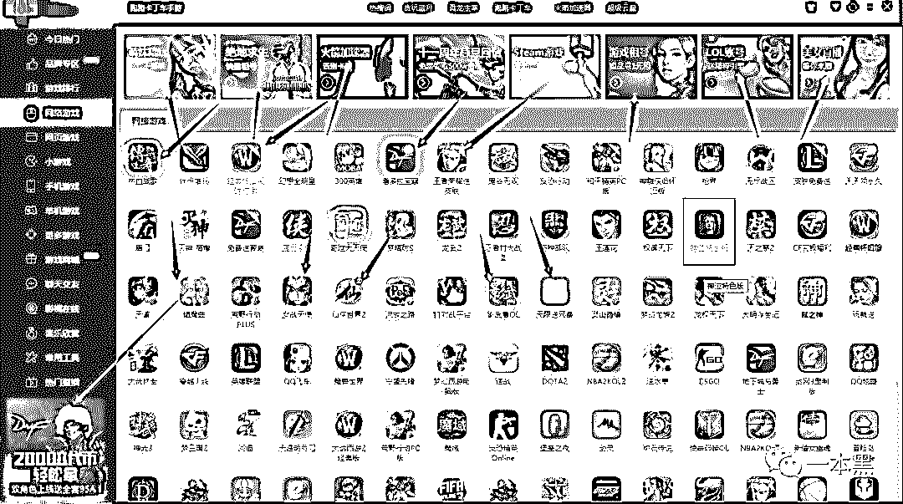

# 去网吧吃个鸡，结果走进了违法广告的天堂

> 原文：[`mp.weixin.qq.com/s?__biz=MzU4ODAwNzUwMQ==&mid=2247486325&idx=1&sn=179820477eba75909d6847b49651b0b9&chksm=fde21a57ca959341495228cf293d84e0826919d6931596ce8ee8ebbd2993fe6d2f48864d06e0&scene=27#wechat_redirect`](http://mp.weixin.qq.com/s?__biz=MzU4ODAwNzUwMQ==&mid=2247486325&idx=1&sn=179820477eba75909d6847b49651b0b9&chksm=fde21a57ca959341495228cf293d84e0826919d6931596ce8ee8ebbd2993fe6d2f48864d06e0&scene=27#wechat_redirect)

【黑话连篇】

该栏目更多的是揭露事件或对事件的看法，以达到让人精神得到升华的目的。

* * *

****自从网吧改命叫网咖之后，我就再也没去过了。没其他原因，就是因为穷吧。********加上网吧电脑里广告那么多，花那钱去网吧看广告实在不值，甚至还有可能会被骗，还有熏死人的二手烟和垃圾队友......********说到底其实还是穷，要非得再加个冠冕堂皇的理由，那就是我不愿意为网吧的广告买单。********我就是花钱去玩游戏的，凭啥还要看色情直播和菠菜广告？****

********

****有读者爆料说，自己去网吧玩游戏，差点被各种广告给逼疯。于是他就把出现的广告都截图发给了我们，结果发现这其中不止有租号的，卖外挂的，还有很多菠菜和色情直播的广告。********显然，这些广告不可能是游戏开发商嵌入的，因为在家玩游戏的时候是没有广告的，被植入的场景就只有网吧。********被搞得烦不胜烦的只好找网管，然而网管也满腔怒气，直喊冤枉，说他们这是正经网咖，要做长久生意，不可能搞这种事情的。********不是开发商植入的，也不是网吧做的手脚，那这些广告哪来的呢？**********从网吧到网咖**********喵叔/文********想当年上学那会，网咖还叫网吧，1 块钱一小时任玩。抽烟喝酒看片，想干嘛干嘛，上网还不要身份证。和老板熟了，还能经常蹭饮料。********对，我说的就是那种黑网吧，虽然环境差了点，但是机子都不错，网速也快，还没什么乱七八糟的广告。********后来，网吧就不让抽烟了，昏暗的灯光也变成了明亮的 LED 灯，网吧变成了网咖，上网费像坐了飞机一路飙升，从 1 块到 10 块，也就短短十几年时间。当然，实名是必须的了，想再悄咪咪看些有的没的，那不可能。********村口阿花换上白纱就成了白雪公主，网吧也是这么变网咖的。有点不同的是，网咖不止是换了装修，卖的东西也不一样了，果汁、盖饭、咖啡代替了泡面+冰红茶的经典搭配。********网管也不再是叼着烟顶着鸡窝头的小哥，一身整洁的衬衫西裤的工作人员带着标准的职业微笑，穿梭各个座位之间，不时询问你是否需要服务。****************唯一不变的是网吧里的广告，以前的广告很简单，小卡片为主，要不就是座椅上的贴画广告、角落里的展架广告。卖点卡什么的就不说了，一直都有。********以前的广告业务都是公开的，你一眼就能看到。但现在的广告变得更高级了，你看得到，但是关不掉。****

> *******桌标广告：****顾名思义就是桌面图标广告，一般都是些垃圾热血游戏，点开就能玩。换个外皮，一个游戏能有 10 个名字。************退弹广告：****用户退出游戏时，弹出的图片或是 flash 广告。**强制性观看，不看完还退出不了。************DSP 广告：****根据用户标签在游戏内植入的广告。**所谓的大数据和用户画像，在这里得到了极致体现，玩什么游戏推什么外挂，为每个用户量身定做。************主页广告：****搜索页和导航栏广告。**都是垃圾游戏和色情直播。************聚合广告：****开机、打开游戏界面弹出并自动消失的广告。**欣赏广告从摁下开机键那一刻开始。*****

****这一系列形式的嵌入式硬广，简直硬的让人手足无措。而这些个生意也有个了响当当的名字，叫网吧增值业务。********增值，说白了就是赚钱嘛。什么赚钱做什么，网吧除了卖东西和收网费，还能赚钱的就只剩下打广告了。********从网吧到网咖，就是提价、增速、加广告。但是吧，现在的游戏，配置和宽带跟不上，基本就是废的。所以唯一值得称赞的大概就只有服务和无孔不入的广告吧。********那些服务也还没跟上的网咖，唯一值得骄傲的大概就只剩下广告了。******************垃圾广告泛滥************这类广告，的确不是网吧老板自己承接的的，而是通过网吧联盟这种组织来的。开网吧当然也不是单兵作战的，尤其是现在经济不景气，上座率一天比一天低，不想死在网吧洗牌这波浪潮里，就得找点其他路子挣钱。************像网鱼那样拉投资？对个人网吧来说，感觉是在说笑。自己投钱，换机子搞装修？投入太大，成本还没收回来，可能店就先撑不住了。************************怎么办？************于是大家都会经常在各类网吧联盟的论坛里讨论，怎么通过其他业务增加收入。广告是首选，任何能和人产生关系的产品，都能通过广告赚钱，网吧自然也不例外。************加入联盟，注册成为会员，就可以领取广告任务，之后坐等收佣金。每家联盟给的价格不一样，但也差不了多少，一般以主页、退弹、桌标为主。比较高级的还会有 DSP，也就是游戏内嵌入。************       ************图中的加速器就是 DSP 广告，也是玩家最烦的广告，这个已经很文明的插入了。多的时候那些空白的角落里都能给你塞上广告。想忽视都不行的，还有的过分到不点广告不能继续玩游戏，简直无耻至极。************这类广告吧，扎眼的很，但是价格却都很便宜，DSP 1000 元/千台/月，其他类型的也都在 600-1000 元/千台/月。************一般没有哪个网吧会做全套增值广告，因为如果都是广告，玩家就玩不了游戏了。用户体验太差，店迟早会挂。************桌标和退弹的受欢迎率比较高，一般一个 200 台机子的网吧，单做桌标，一个月差不多能赚 1000。************************虽然钱不多，但是多少也能顶一点支出。于是他们甚至还在论坛讨论，什么时候有套餐业务，可以一键领取任务，装更多的广告进电脑。************网吧也只能选择接哪种广告形式，并不能决定广告内容。广告内容由联盟确定，而标准就是：没有标准。只要给钱，什么广告都能接。************于是就有了开头读者爆料中提到的色情直播和菠菜广告。租号、卖号、加速器、直播，和游戏有关无关的广告都来了。************          ************点开直播广告，哦豁，性感小姐姐，在线陪开黑，来一局？要不就是，澳门娱乐城，性感荷官在线发牌。************刺激，真刺激~~************实际上性感小姐姐是没有的，十级美颜之下，你怎么知道对方是乔碧萝，还是乔碧萝呢？但是掏钱是一定的，这些个套路从来都没变过。************当你登录 steam 账号时，会发现整个页面除了填资料的区域，都被广告包围了。好不容易登录之后，恭喜你进入了另一重广告，这次不是卖号、租号了，而是各种道具，皮肤，加速器啊。************      ************想在网吧玩吃鸡？算了吧，不被钓鱼就谢天谢地了，去网吧玩什么游戏，看广告就够了。************************不止吃鸡，DOTA、APEX、LOL、DNF 等热门游戏全都被广告侵占了，无一例外。在 DNF 吧，玩家们吐槽游戏里的广告已经变成主技能了，不点就不能过关。************要么买，要么滚，自己看着办。************************而侧边栏的充金币广告，不是比例太坑，就是点了被盗号。************太难了，这年头玩个游戏真的太难了。**************都是网吧的锅？****************不过出现这类问题，也并不总是网吧的错，有的时候他们也是受害者。比如一些真的是正经营生的网吧，他们没想过靠这类广告赚钱，但是广告还是莫名其妙进了电脑。****************又或者是明明显示的是正经游戏，但是点开一看却是澳门娱乐城开张。****************这些广告又是从哪来的呢？为什么网吧没引进这类广告，电脑里还会存在呢？****************广告的出现的原因，除了主动加入联盟，其余的情况无外乎以下几种。******************DNS 劫持：********************一些当地运营商会悄咪咪干些流量换金钱的勾当，比如你的电脑右下角莫名弹出来的广告。********************一些运营商会明确告知，选择这类带 DNS 劫持广告的宽带，网费能便宜点，不带就多点钱。但大部分运营商都没有这么磊落了，他们收完钱就悄咪咪往你电脑里放广告。只要网吧没发现，广告就会一直在。********************咋整？就俩字——投诉，据说一打一个准。******************************************系统自带：**********************网吧的收费管理系统也会携带大量的广告，而这些广告是系统本身就有的，网吧根本就没有权利去除这些广告。********************换个系统？哦，有时候没得选呢，一些地区的网吧装的是当地 XXX 指定的收费系统。没得替换，只能接受。其他免费或是收费的系统都是有广告的，毕竟人家也是要挣钱的。********************这种广告，你恨，但是却只能接受。**********

********************

************各类捆绑插件：**********************以及路由器、无盘系统、YY 各类电脑软件的捆绑插件，经常会在你游戏玩的正嗨的时候蹦个弹窗，让人烦不胜烦。********************这些插件吧，有些你能找到就能删掉。有些就，只能认命吧。这一次千辛万苦删掉了，下次登录，广告还是在。********************想要靠外部工具屏蔽广告？兼容性这个问题同样让人头疼，所以网吧广告越来越泛滥，却一直没有得到有效遏制。********************当然，那些使用 iMac 的高端连锁网吧，或许并没有这么多烦恼，但是鉴于大部分网游都是使用 Windows 平台，所以会存在一定稳定性的问题。********************于是以 Windows 为主流的网吧，都或主动或被动地被广告侵占了。********************或许很多人会觉得这个事很常见很普遍，甚至根本无法解决，那么就没有说的必要。****************************************那是因为你我都是有独立意志和行为能力的成年人，能够轻易判断出那些广告哪些是骗局哪些是真的。********************哦，不。也不一定，成年人被骗的同样很多。贴吧里吐槽的大部分都是成年人。一个连成年人都会迷失的地方，又如何确保那些仍在上学的孩子能够分得清呢？****************************************这类广告哪最多呢？肯定不是网鱼那类连锁店，而是学校周边以及乡镇的网吧，因为学生和小镇青年没那么介意环境和服务，价格便宜网速快就行了。广告不广告的再说，只要不影响玩游戏，忍忍也不是不可以。********************况且被植入游戏的贴片广告看起来就像是官方推出的业务，甚至还有些打着限时免费的标签。那，点一下也不是不可以。********************那点之后会发生什么就不知道了，可能会被盗号，可能看一场色情直播，可能进了一个在线赌博网站，也可能充了金币或者买了装备。********************不管点了哪个，最终结果都是要花钱的。至于花多少就要看你脑子有多清醒了。********************连看个直播都能被诱导着充钱的孩子，你能指望他们有多理智。********************互联网广告法的出台铲除很大一部分违法广告，但网吧广告，显然不受限制，至今仍在灰暗与违法的边缘疯狂试探。****************************************或许是因为没有重大事件的产生，所以也没能引起多大的关注。********************但即使是玩游戏，我们也应该有权利对这些灰黑产广告说 no。********************毕竟，谁花钱是去网吧看广告的呢。********************电竞作为一门专业学科都已经走进了校园，针对电竞行业的广告法，到底什么时候才能来？**********