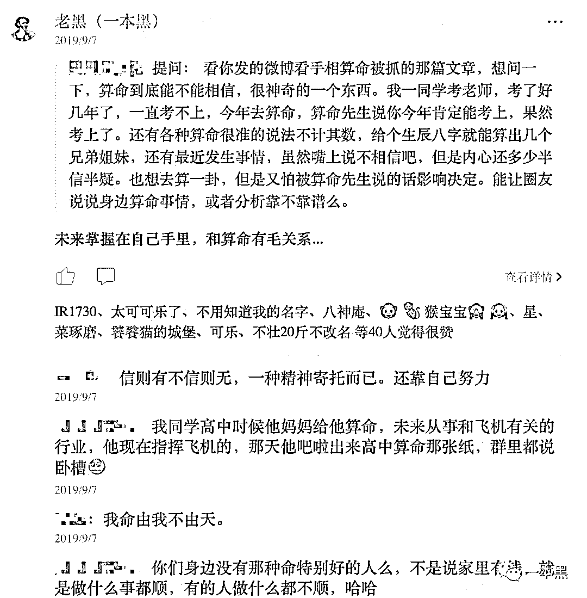
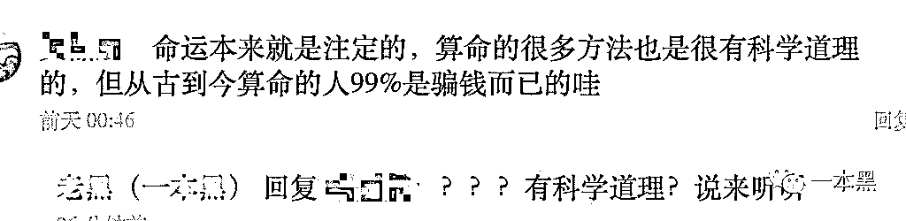
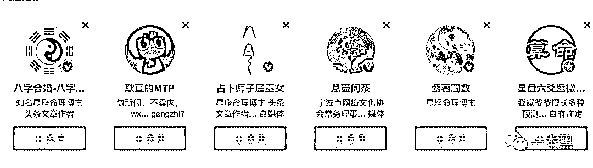
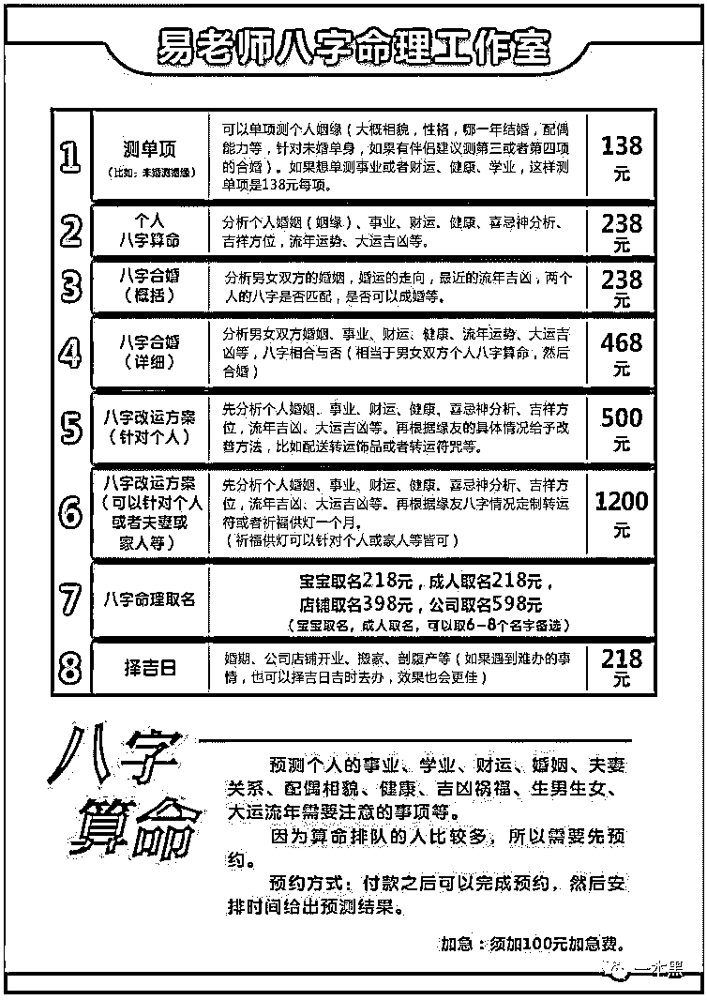
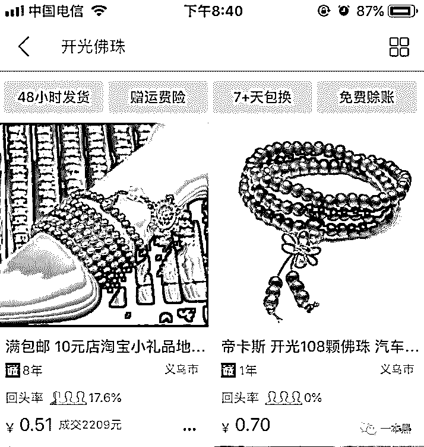
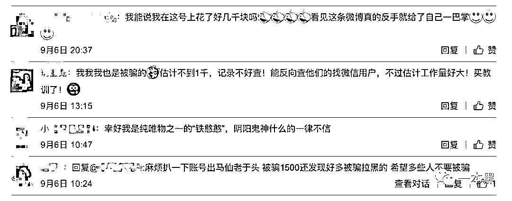
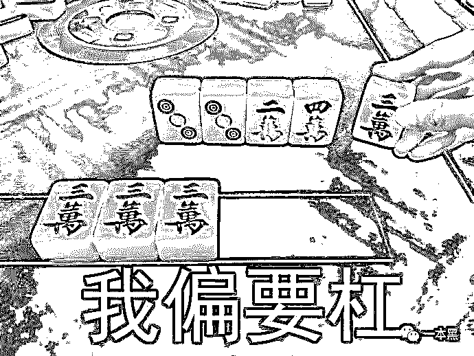

# o2o 算命？我看你脑子有问题！

> 原文：[`mp.weixin.qq.com/s?__biz=MzU4ODAwNzUwMQ==&mid=2247486310&idx=1&sn=7edbb162f9fe6206abeeba5dc0c5917f&chksm=fde21a44ca959352cdc20a9fab33838ee4fc75ef837ec10f857e79c1d53b35e5738c9975d114&scene=27#wechat_redirect`](http://mp.weixin.qq.com/s?__biz=MzU4ODAwNzUwMQ==&mid=2247486310&idx=1&sn=7edbb162f9fe6206abeeba5dc0c5917f&chksm=fde21a44ca959352cdc20a9fab33838ee4fc75ef837ec10f857e79c1d53b35e5738c9975d114&scene=27#wechat_redirect)

【黑话连篇】

该栏目更多的是揭露事件或对事件的看法，以达到让人精神得到升华的目的。

* * *

****自从在公众号写文章揭露互联网灰黑产开始，我才慢慢知道，原来人和人之间的差距不是谁比谁富有，而是彼此之间的思维和认知差距。********很多人的思维其实是固化的，只停留在他所看到或者接触过的事物层面，而这种思维和认知带来的往往是自以为是，固步自封。********也正是因为思维和认知有差距，这个世界上才会有那么多人掉入资金盘、杀猪盘陷阱里。********为什么要这么说呢？********起因是前段时间我开了个付费社群，在社群里，有个读者向我提问，他质疑算命这一玄学的东西到底靠不靠谱。********还举了个例子，讲的是一个同学考教师，考了好几年都没考上，然后去算命，算命先生说今年肯定能考上，然后今年果然就考上了。********神奇吧!********看完他的提问，我给他的回复是：**“未来掌握在自己手里，和算命有毛关系...."******

********

****底下也有很多人发表了关于自己对算命的看法，有人认为算命只是一种精神寄托，信则有不信则无。********有人认为算命其实就是对察言观色要求很高的一种职业，就得会来事，能够准确抓住痛点，讲究的是细水长流、八方为客。********热闹的评论里基本都是持反对意见的，但唯独有一哥们，坚信命运这东西是天注定的，算命的很多方法也是有科学道理的。********我一下就懵逼了，看来我这十几年的义务教育算是白上了，我的科学老师为什么不给我普及命运天注定这个知识点。********我感觉我的智商受到了侮辱。****************不过从评论里，还是可以看到很多人半信半疑的态度，比如说人到中年，自然就会信了。********但我觉得这和算命没有任何关系，只是人和人之间的认知差距罢了。********在评论里有个哥们的说法我比较认同，他说的是算命一开始不过是富人的消遣，穷人的寄托，但现在慢慢演变成了一种收割傻瓜的手法，只是简单运用了一下巴纳姆效应、皮格马利翁效应、以及幸存者偏差就把大众耍得团团转。********他还讲了个真实的例子。说自己之前在地产公司工作，一个公司投资部高层年薪过百万，因为每次地产开盘动工仪式都要请一个大师过来，久而久之，这哥们直接半路转行成为了一名算命风水大师。********工作就是跟各大领导老板喝茶，然后穿着西装在各种仪式上喊风水口号，年收入和之前相差无几，但只需要动动嘴皮子，喝喝茶就能搞定。********其实，说到算命这东西，很多人应该都经历过，包括现在很多地方都还存在算命相关的仪式，比如婚丧嫁娶、乔迁动土，虽然没多少人完全相信，但这仿佛已经是一种风俗或者仪式感了。********把这种行为看成是一种仪式或风俗我觉得还可以理解，但就怕有人真的像前面提到那哥们一样，认为命运是天注定的，命运是能被算出来的，那就可怕了。********至于什么信则有不信则无其实都是屁话，说难听点这就是个巨型黑产。**********二**********一本黑之前就写过关于算命的产业链，讲的是算命这帮人，哦不，应该说割韭菜这帮人，通过把自己包装成算命大师，微博大 V，进行各种坑蒙拐骗的骚操作。********要说这帮人也够有头脑的，以前算命的都只是在街头摆个摊卖时间赚点辛苦钱，但现在不一样了，人家有互联网思维啊！********什么 O2O 算命、什么自媒体大 V 算命，怎么赚钱怎么来。********这不前不久就有个关于算命的新闻吗！讲的是警方侦破了一起网络微博大 V 算命的诈骗事件。涉及大 V60 多个，粉丝量高达千万以上。********不过你还别说，我分析了一下，这帮所谓的算命大 V 的运作模式，其实和现在的电信诈骗团伙一个尿性。********都以团队作案，分工明确，算命大师也得经过岗前培训，也得掌握”话术“，有人运营微博，通过各种手法吸引粉丝，更时髦的是他们还会打广告，如果你经常刷微博，你一定会看到微博给你的推荐广告里就有算命。********除了运营微博吸粉外，还有人专门搞接待，也就是通过微博留下微信号码，让精准客户添加微信，然后实施算命服务。********这些算命大师微博一搜一大把，比如什么“八字算命大师”、“八字算命占卜”“知名星座命理博主”等等。********      ********他们基本都是坐拥几百到上千万粉丝，平时会通过蹭明星离异事件的方式分析社会热点，或者通过发布免费看手相、看运势等吸引粉丝跟帖回复。********一旦有人咨询，微博的运营人员就会把“大师”的联系推给他们，然后大师就开始对咨询者指点迷津了。********      ********看这业务还挺多，针对不同的服务价格也不同，不过这里的价格并不是大师想要赚钱乱定价，用大师的话来说就是：“这些泄露天机的报酬，要不然会折损算命人的福报”......********妙，真的是妙。********       ********在这堆服务里，除了常规的算命外，我看到还有一项服务是改运，简单来说就是改变自己的运势。********我突然心动，想起这段时间运气确实不好，每天起床照镜子总能被自己的脸帅晕过去，哎，我实在是太难了，看来必须找大师给我改改运。********结果大师告诉我，改运只能起到辅助作用，而且 1-3 个月才能生效。********      ********那岂不是这段时间我还要继续被这种烦恼所折磨？不行，继续问大师，我想要试一试。********大师说，针对我这种情况准备给我制定一套转运方案，会搭配一些转运饰品或者转运符之类的东西，我看了看价格，500 块，也不贵，最主要的是能解决我的烦恼。********      ********我继续追问，到底是什么转运饰品呢，大师告诉我，一般是佛珠或者法器，这些东西都是经过开光的，比较灵验。********巴拉巴拉，大师又是一顿吹。********我实在听不下去了，越听越感觉智商受到了暴击。********于是我打开了 1688，输入关键词“开光佛珠”，问大师：“大师，是这种佛珠吗？”********      ********大师肯定是忙着接待其他的客人，所以没有回复我，又过了一会，我发现大师把我删了。********可能大师觉得我是个穷逼，500 块都出不起，不过，我理解大师。********你看，你帮兔崽子多赚钱啊，网上几块钱批发来的东西，经过一顿忽悠就能以几十倍甚至百倍的价格卖出去。********互联网真是个好东西。********但从这帮孙子的微博粉丝量来看，就知道他们吃了多少钱，上当的人那真的可以说是数不胜数，等反应过来，只能恨自己交了智商税。********      ********其实现在算命和看风水的基本分为两种人，一种是富人，一种是穷人。********因为富人通常比穷人有更多的经历，事业上的成功他们会认识有运气的加持，所以越有钱就越想留住自己的运气，办个啥大事都会请一些风水师搞搞布局。********而穷人算命的原因也很简单，无非是对生活看不到希望，或者是遭遇了什么坎坷，希望通过算命进行预测或者改命。********对了，中国很多有名的企业家都信风水和算命这玩意，很多人看到就会说，人家大佬这么有钱都还信风水，肯定有道理，所以也就跟着相信。********但各位，风水和算命不是一个东西啊。********我不反对算命，你可以把他当成一种娱乐，但如果你觉得算命真的能预测未来，或者说你觉得命运真的是天注定的，那我就要骂你傻逼了。********这得是有脑残才会有这样的想法啊，难道十几年的书都白读了吗？********但有个现实就是，这个世界上的脑残真的比比皆是，光看那些算命大师几百上千万的粉丝就知道，任何行业都存在韭菜，大家相互割，还乐此不疲。********揭露互联网灰黑产这么久，我看到有人看清了世界，但也有人依然相信其中。********但就互联网算命这一行来说，真的是巨型黑产，它和现在的电信诈骗、杀猪盘、卖茶女的套路没什么区别，无非就是收割那些没有认知能力或者认知较差的人。********前几天社群里还有个哥们提问，自己每天一下班就回家躺着刷手机，觉得自己的圈子越来越小，整天就在探探、陌陌里来回聊骚，问我怎么办，怎么扩大自己的社交？********我说你一下班就回家睡觉圈子能不小吗？哪怕你经常出去跑个步也能认识一些同行人啊。整天陌陌探探的，心里想啥大家不知道吗？********多与现实中的人交流，多接触不一样的人，多开开眼界总比好过和网络背后的乔碧萝聊骚强。经常沉溺在这种虚拟网络中，早晚会陷入电信诈骗或者杀猪盘的套路中。********还有关于资金盘的问题，不管写多少资金盘骗局，每次都会有信徒有各种各样的理由来反对，次数多了我都习惯了。********总的来说，这个社会是存在阶层的，但我认为社会存在阶层不可怕，思维认知存在阶层才是真正的可怕。********就像今天写这篇关于算命的文章，一定会有人来和我杠，说算命的科学性和可靠性。一定会有人举一些现实中因为算命而发生的巧合事情来反驳。********来吧，让我看看有多少能杠的。********          ********不信算命的点在看****