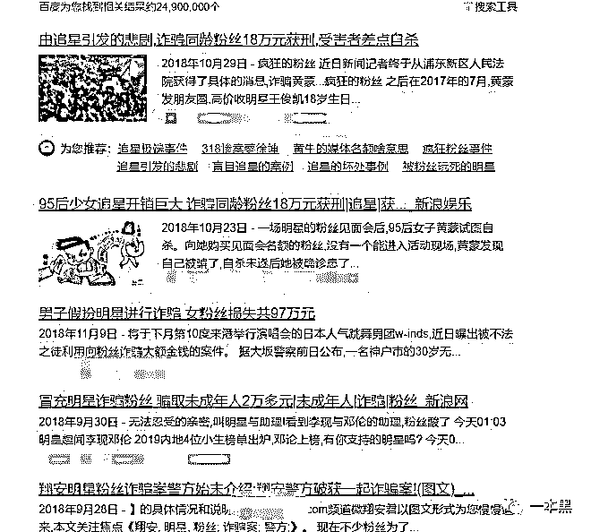

# 追星吗？当傻逼被骗钱的那种……

> 原文：[`mp.weixin.qq.com/s?__biz=MzU4ODAwNzUwMQ==&mid=2247486295&idx=1&sn=731aa87453b21a00255d86af8d4a394a&chksm=fde21a75ca95936311c9890ca4bf4bcdeb2bd83f9db8ce21d663e5ff265b30a34369d6a88069&scene=27#wechat_redirect`](http://mp.weixin.qq.com/s?__biz=MzU4ODAwNzUwMQ==&mid=2247486295&idx=1&sn=731aa87453b21a00255d86af8d4a394a&chksm=fde21a75ca95936311c9890ca4bf4bcdeb2bd83f9db8ce21d663e5ff265b30a34369d6a88069&scene=27#wechat_redirect)

【黑话连篇】

该栏目更多的是揭露事件或对事件的看法，以达到让人精神得到升华的目的。

* * *

****这事要从追星说起。我已经很久没有追过星了。不，这说法有点老土，应该是我很久没有粉过谁了。直到“燃烧你的卡路里”开始席卷大街小巷，我才正式认识了超越妹妹以及社会菊姐。********我知道她们来自一个叫做《创造 101》的节目，但也仅此而已。其余的成员我一个都不认识。但是这两天，我又认识了一个新成员，叫孟美岐，江湖人称山支大哥。********但这次并不是因为节目，当然也不是因为身材和外貌，而是一起诈骗案。********这场诈骗案和她本人并没有什么直接关系，充其量是爱豆和粉丝的关系。********一场追星之旅为什么会沦为一起涉及人数众多的诈骗案呢？**********从粉丝经济说起**********喵叔/文********在知乎关于“追星被卷入诈骗”的相关话题下，有用户这样写到：*********“当追星遇上诈骗，当诈骗变得合法化，当追星群体沦为诈骗安乐场……一切就变得可怕甚至恐怖起来。**”*********随着追星一族的低龄化，越来越多的中小学生开始加入追星的行列。和我们小时候追星不同的是，现在的孩子更愿意花钱，当然也是因为他们更有钱。********我们小时候追星，无非就是买点贴纸买张海报，有钱的买磁带买 CD。但现在的孩子们可不得了，能帮明星们冲榜刷流量、包场、买地，甚至还能买小行星呢。********       ********当明星不再叫明星，叫爱豆（idol），追星也有了一个新的名字叫应援，由粉丝撑起来的这一系列生意叫粉丝经济。********你知道的，所谓的用户下沉，不仅仅指把镰刀挥向三四线城市，同时也意味着去收割那些更加不理性的群体，比如老人和小孩。********俗话说“男人怕穷、女人怕老、老人怕死”，所有的生意只要能够宣称能解决这三个问题，就不愁没人上钩。所以，男人炒币，女人做微商，老人买保健品，成为了当今社会的三大支柱性产业。********男人、女人和老人的钱好赚，是因为他们有钱。从前并没有人想要做小孩的生意，因为小孩口袋里空落落。但现在不一样了，现在的小孩从小就有存款，存折上的余额可能比很多刚步入社会的年轻人一年的收入都多。******** ********于是，小孩的生意，也顺利成章的出现了。小孩玩游戏，于是充值装备和卖皮肤的生意好赚；小孩玩玩具，所以各类仿真娃娃能轻易卖到四位数；小孩还追星，于是乎.....********各路商家都在召唤：来吧，快来为你的爱豆打榜啊；爱豆的新电影要上映了，快筹钱包场呀；爱豆要生日了，快买几个小行星送他，让你爱豆的名字闪耀在整个宇宙.......********      ********TFBOYS 成员王俊凯 18 岁生日时，粉丝为他买下的 18 颗小行星，这些星星能连成“WJK”三个字母。买星星其实并不贵，有人特地去专门卖星星的网站试过了，7000 人民币左右就能买到 18 颗。****************贵的是望远镜，毕竟买再多，看不见也是白瞎。于是为了让爱豆能够看到这几颗星星，粉丝们又凑钱买了个价值 27 万的天文望远镜送给他，让他能够随时随地看星星。********会玩，现在的孩子真的是会玩。****************不仅如此，粉丝们还买了 18 台大疆无人机在小蛮腰进行了长达 30 分钟的表演，emmmm，据统计无人机表演大概花了 110 万。********此外，粉丝还助养了 18 种深海濒危动物。（追星做慈善，这个是好事，得夸。）********粉丝们之所以要给王俊凯买行星，是因为那年王俊凯还在魔幻 5D 城市重庆上高中，由于气候与地形原因，重庆常年雾蒙蒙见不到太阳，当然也见不到星星。于是王俊凯发了条微博，表示对无垠宇宙的向往和思考，同时默默抱怨了一下见不到星空的遗憾。********于是乎就有了买行星的事。无人机表演和认领深海动物也同样有深刻的原因。但归根结底就一个字，那大概就是，爱。********这只是粉丝经济的冰山一角，光是 TFBOYS 的三小只之一，一场生日献礼就花费过百万。更别说演唱会、电影以及其他活动打榜的花费了。********花这么多钱去搞这些个虚形式，在我看来是匪夷所思的一件事情。****************但在饭圈，这是件极其有价值的事情，是一种仪式感，同时也是一种纪念。纪念爱豆的辉煌，纪念自己的青春和热血。**********当追星沦为诈骗**********不管怎么说，粉爱豆，疯狂给他花钱就对了，这似乎正在成为年轻一代追星族的某种契约。********伴随着疯狂撒币而来的是更多潜在的危险，诸如诈骗、非法集资、YP（这个就不说了，加拿大 P 王专钓女粉丝，你懂得）等。********所谓的粉丝经济就是号召粉丝为爱豆花钱，原本这些分散在全国各地的粉丝们并没有这么大的消费冲动。当职业粉丝出现后，粉丝经济呈现爆炸式增长。各种后援会、数据组像草原土拨鼠一样迅速冒头。********2018 年夏天，一档叫做《创造 101》的综艺节目，挖掘了锦鲤妹妹—杨超越、社会菊姐—王菊，以及山支大哥—孟美岐等一系列新兴偶像。****************短暂的比赛结束后，这些女孩终于真正走进娱乐圈，发 EP，录节目，演电影，她们的每一次出场都会在微博引发热议。********我知道这个节目火，但我不知道会有这么火。直到后来 cxk 打了篮球，微博流量造假被扒，我们才知道任何一档看似火爆的节目背后都少不了水军的推波助澜。********而职业粉丝正是组织粉丝集资刷榜的始作俑者。********在知乎上有个话题叫【如何看待乐华娱乐旗下艺人孟美岐的粉丝会数据组涉嫌大金额多平台网络诈骗？】，有用户爆料，孟美岐（山支大哥）粉丝后援会——山支数据组涉嫌非法集资及大额诈骗。********在孟美岐出道的这一年多里，有数据统计该数据组共组织了近 200 次的集资活动，平均每两天一起。该组织要求粉丝入群每周上缴 50 元，要求 3000 名人均 1800 元。************************图片来自知乎********孟美岐的首张 EP ,销售额达到了 1000 万，这都归功于卖力的粉丝。各数据组和后援队团结起来让大家去买乐币给爱豆打榜，并且数据组还能提供团购渠道，但粉丝们在付款时，却发现数据组给的收款账户并非是腾讯官方，而是一些私人账户。********这几百万的金额，说是都用去打榜氪金了，但实际上这些钱的用处却没人说的清楚，账目一塌糊涂。没有明确证据表明组织者中饱私囊，拿回扣，但大家都这么认为。********总之，这事说不清楚了。********不仅如此，该数据组还利用蓝 V 身份，到处找娱乐大 V 投广告，说是可以给粉丝提供高薪兼职工作。******** ********大 V 收到了足够的广告费，还能给粉丝发福利，他们觉得这事不错。也没有人去细想这些广告可能会有什么风险，收了钱发了广告也就没管后续问题了。********后来，你知道的，这些所谓的高薪兼职都是假的嘛，说是刷单实际上就是诈骗，很多粉丝因为相信了大 V 的广告加入刷单大潮，结果连商品都没见着，就打了成千上万的钱去了对方账户。********对方称成完成一笔刷单就可以返现，但实际操作时，说好的一笔交易变成三笔，金额也从几百变成了几千。并且和我们之前曝光的一样，对方以钱被平台扣住为由拒绝退款。若要退款的话，得再交钱刷单，没钱就去借网贷。********所有的刷单诈骗，套路都是一样的骚，且无耻。****************目前该数据组的微博已经清空，相关人员也已经失联，而发广告的大 V 纷纷表示不知内情。600 多位粉丝陷入这场骗局，正在到处曝光，寻求帮助。这其中被骗的不止有学生，还有刷单主力军——宝妈。********从粉丝后援会到诈骗集团，中间只差了一个蓝 V。经调查发现该数据组背后还有 60 多个同类型的皮包公司，注册地址均在辽宁省大连市，公司经营范围从广告到医疗，从计算机到猪饲料，应有尽有。********      图片来自知乎-天眼查********至于这些皮包公司又伪装成了谁的后援会，正在干些什么勾当，暂时还未可知。****

******流量操控一切******

****这并不是个例。利用粉丝后援会的身份实施犯罪早已有之，除了骗钱还有人骗色。****************刷单这个是赤裸裸的骗局，但更多是的粉丝自发组织的一些造假行为，譬如：帮爱豆打榜，花钱买流量。********譬如，我国唱跳 Rap 俱佳，文体两开花的著名胯下篮球表演艺术家——蔡先生，此前就因为微博转发人数破亿，引发了有关部门的高度关注和一致骂评。********毕竟微博活跃粉丝才 4 亿多，平均每四个人就有一个转发了打篮球的的微博，这实在是不现实。于是，牛皮吹太大了，biu 的一下就炸了。这下不仅打了自己的脸，也顺带扯掉了其他同行们的流量面纱。****************所谓的流量明星不仅仅是指他们能带来流量，同时也意味着他们能够操控流量。想要在热搜榜的哪个位置，不需要靠话题热度和粉丝数量，买流量就好了。********流量带来名声，名声带来金钱，钱又能买流量。金钱流量，流量金钱，周而复始，反反复复。于是流量这门生意经久不衰。********为了保持明星的热度，一些职业粉丝故意挑起不同明星粉丝阵营的矛盾，引起两方的互骂和纠纷。********说到这，就不得不说一下微博热搜了。微博是广大吃瓜群众最大的集散地，任何一件事想要迅速发酵扩散，只要上了热搜榜就行了，同样，如果一件上了热搜榜的事情，想要撤下来。最常用的办法就是制造其他的热点，把之前的事件从榜上挤下来就行。****************这其中，只需要流量就行了。因为流量操控舆论。********为了平息舆论，职业粉丝和数据站（可能是皮包公司）会号召大家集资买流量控评，职粉们将控评等业务外包给皮包公司，由他们去统一购买流量，或是其他诸如乐币一类的产品，帮助明星打榜刷单上热搜。********这其中，出钱的是粉丝，赚钱的是职粉和皮包公司，赚流量的是明星。不仅如此，皮包公司还能顺便靠着累计的声誉做些更赚钱的勾当，就像上文的刷单骗局。********于是这门生意成功实现了多方共赢，粉丝解决矛盾，明星上热搜，职业粉丝拿回扣，皮包公司骗钱跑路。********起初，大家都美滋滋，后来大家都哭戚戚。明星说自己无辜，拒不承认买流量；职粉说自己也无辜，没动过大家的钱；粉丝最惨，在网上贡献了键盘，还被骗了钱。****************一切都是皮包公司的错。 **********理性追星，独立做人**********在这些被骗的人中，最惨的当属宝妈，但最无辜的恐怕就是那些学生了。很多粉丝尚未成年，并不知道社会险恶。轻易相信他人，省吃俭用存钱给爱豆打榜，结果还被骗了钱，给父母留下一堆债。********有热爱的人或者事物，有明确的奋斗目标是一件很好的事情，但凡事需要理性。究竟你是真的愿意为之付出，还是被裹挟向前，只有你自己知道。********说实话，我并不支持未成年粉丝花钱去帮明星打榜，当然造假这件事，成年人同样不可取。只是成年人有自己的经济来源，花自己赚的钱，别人无可指摘，只要这事合法。********但是未成年人不一样，没有经济收入，遇事不冷静，思想不成熟。就和我们小时候迷恋的偶像一样，等长大后才发现，“咦，原来是他呀，好像也很平凡嘛。”********甚至当回想起曾经的疯狂，一度缄口莫言。********你要是我问小时候追过哪个明星，我肯定不会告诉你是谁。****************毕竟这事隐私又难以启齿。********你要是问我，追星可以吗？********当然可以，谁没个喜欢的人呢。********毕竟老师傅一把年纪了还在粉苍老师呢……************

****一本黑新社群已开通，名字叫【一本黑的朋友们】，它没有一个具体的定位，里面会聊赚钱案例、想法、思路；它同时也是一个资源对接平台，帮助大家寻找可以合作的资源，但灰黑产严厉杜绝。**** 

****同时也会不定期邀请牛人嘉宾进来分享，听大佬的赚钱经历和想法，与牛人交流，是提升认知的捷径。****

****总之，这是一个全新的成长型、认知升级、资源对接社群，后续会在社群内公布各种有趣玩法，还不赶快上车？****

****       ****