# 谁的 niao 黄？来滋一滋现在玩区块链投资的韭零后们

> 原文：[`mp.weixin.qq.com/s?__biz=MzU4ODAwNzUwMQ==&mid=2247486169&idx=1&sn=08985972cf1ee933ada5c4e1ef38016d&chksm=fde21bfbca9592ed3b5768a4f5a524da916da629b98472c654fe4355d8eb2b164c6b1fe09cd2&scene=27#wechat_redirect`](http://mp.weixin.qq.com/s?__biz=MzU4ODAwNzUwMQ==&mid=2247486169&idx=1&sn=08985972cf1ee933ada5c4e1ef38016d&chksm=fde21bfbca9592ed3b5768a4f5a524da916da629b98472c654fe4355d8eb2b164c6b1fe09cd2&scene=27#wechat_redirect)

【黑客调查】该栏目主要讲述老师傅利用【计算机基础知识】，还原网络或现实中的各种骗局和真实面目，以达到让人警醒的目的。

* * *

前几天，我开了个新社群，名字叫做【一本黑的朋友们】，社群里有个哥们给我发了一段私信，大意是说他准备跟着几个朋友搞投资，问我靠不靠谱，投资项目叫以太付，号称结合了区块链与移动支付等时下最热概念。 投资方式为私募基金，从之前朋友的投资反馈来看，这个电子货币的收益高得诱人。首先说一点，当我看到这条私信的时候，我本来不想理他的，但想着万一这哥们被高收益冲昏头脑入坑了，我也会有一些忏愧，所以今天就来讲一讲这个所谓的投资项目——以太付。以前我和老师傅都是干过技术的人，总觉得做人得有点正义感，有点情怀，或者说作为技术人的信仰。这个信仰不是说空谈忠于技术，技术无罪，而是用技术去揭开一些大众看不到的世界，让圈外人也能无障碍的理解。老读者都知道，最开始我们用技术揭露了太多的不为人知，后面慢慢觉得这种方式欠妥，所以现在尽量去避免这种方式的大量传播，只考虑在社群里小范围分享。虽然很多案子不便公开分享，但我认为该做的事情迟早要去做，毕竟情怀依旧，初心不改。**一****也是闲来无聊，加上这哥们在社群里一个劲的问，说自己是 90 后，身边的同龄人前不久就靠这个项目赚了不少钱，收益老高了，早不入局可就要晚了。****我真想回他一句，你可垃圾把倒吧！难道你看我写这么久的文章都白看了？****哎，不得不说，这个年代的韭零后是真的多啊。********所以，出于本能，我决定搞一搞这个所谓的以太付，也算是作为曾经的技术人的一点分内事了。****本来对这种虚拟货币的投资，我就一直是一个保守的态度，不看好也不贬低，但现在实在是有太多包装华丽的垃圾项目到处骗钱了，这一点我着实是看不惯，所以这次必须得搞他一搞。****不过在搞之前，我想先隆重的介绍一下这个收益老高了的项目。查询得知，这个项目的发行方为 FVI，是一家荷兰的加密货币基金公司，早在 2016 年就成立了。****说是专注于区块链技术，加密货币以及相关领域资产的投资。****哎，文化人就是不一样，随便包装包装，就能跟随潮流吃肉，迎着风口起飞，炸一想这不就和前不久的乔碧罗事件有点类似吗？****游戏，都是游戏。****但重要的是，这帮文化人一边玩着风口起飞的游戏，一边还有可能在风口撒尿，而众多信徒不仅吃不肉，还有可能会被尿一脸。****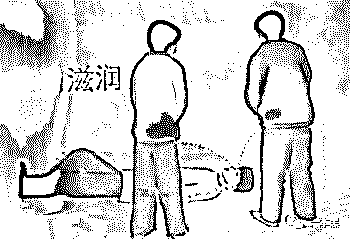****你说尴尬不尴尬。****这家叫 FVI 的公司，说自己在美国、澳大利亚、香港都有自己的办事处，最早的时候推过比特币合约和以太坊合约，这次发售的以太付是新推出的 ICO 合约。****搞半天我也有点懵逼，所以就去翻了翻他们的白皮书，这一翻不要紧，几十页的文档看下来，我眼睛都要瞎了，我是越看越懵逼，甚至有点上头。****我赶忙滴了点眼药水，突然想到之前区块链大火的时候，很多人想包装一个项目圈钱，但苦于白皮书搞不定，所以当时淘宝就出现了有白皮书代写的商家。****你看，只要你的想法骚，全世界都会给你弯腰，没毛病。****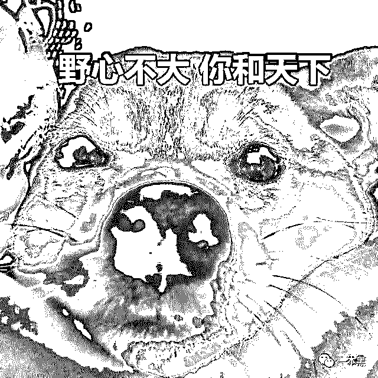****好在之前接触过不少区块链项目，也和不少干区块链的朋友聊过，知道那么一点小套路。****白皮书里面说，以太付是建立在以太坊区块链上的通用去中心化市场，简单点来说就是一个电子支付项目，可以用这个电子货币去在淘宝等电商平台上交易，支持跨国消费提现。****但这些其实对于普通老百姓来说都不重要，毕竟他们也看不懂，重要的什么，当时是收益，任何一个投资项目都是如此。****公开信息显示以太付私募计划发行 8 亿代币，起步价 1 美金，锁定后预计可以涨到 6 美金。****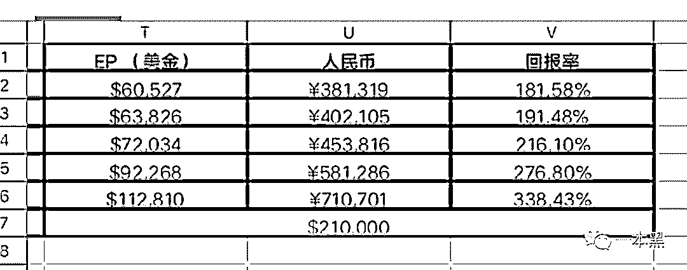****（投资回报表）****这么一看收益还挺高的哦，我突然都有点心动了。盘算着如果梭哈一把的话，是不是就能买房了。****对于这帮搞区块链的文化人，人家是有远大抱负的，实现网上支付和跨境支付，干掉传统互联网巨头，抢马云的饭碗。****所以能给这么高的收益，完全是在做慈善，你等 9 菜还不赶紧上车，再晚可就要发车了。********先不说这群区块链大佬的远大理想能不能实现，现阶段会不会跑路是最应该考虑的一件事，毕竟庞氏骗局这么多年，韭菜换了一波又一波。****以太付的代币名称为 EthePay，声称是在以太坊技术环境下实现的，所以我到以太坊官网上溜了一圈，想看看现在到底值多少钱。****结果上去一看我一脸蒙蔽，官网上显示 EthePay 的当前价值为 0，这个 0 的言外之意是不是就是说他是空气币？？？****其实，如果你对区块链骚微了解那么一点点，还是可以有一些判断的。****比如，本身虚拟电子货币是不被各国认可的，而此以太付宣称的网上支付和跨境支付明显就有点包装过头的感觉，为什么？因为他都不被承认，怎么可能实现得了。****再者说现在的网购和电子商务，人家都已经在互联网玩了十几年了，你这小角色上来就要实现网上支付和跨境，你这是想拔老虎牙啊。********其实，大多数包装精美的项目，都是利用了普通投资者的知识盲区，骗那些不懂区块链又想赶紧上车的人。****所以大家千万不要盲目，这种车可不是去幼儿园的车啊。****危险得很哦！******二********所谓的看不懂，高大上，其实都是别人包装出来迷惑韭菜的，你以为的高收益其实都是诱饵，入局早加上运气好，你可能还会喝到一点汤，但我真的不建议各位去冒险。********你要知道，这种玩法，只有操纵者才能吃到肉，而且是吃投资者的肉。********别到时候汤也没喝到，味也没闻到，那可就尴尬了，铁子。********很多人说好久没看到老师傅搞事情了，其实老师傅现在懒得一逼，每次给他递烟他还嫌我的烟太便宜了。********我只能说是我不够骚了，还是你老师傅漂了。作为一本黑的漏洞终结者，老师傅你可不能漂啊，毕竟技术人的信仰和初心丢不得。********所以老师傅在我的感化下，委屈的打开了电脑，上去先是扫描器轮一波，发现并没有什么漏洞。********只是解析出了以下信息：********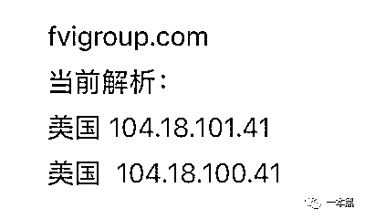********难道这是天意？难道这个站点命不该绝？********那是不可能的，紧接着老师傅用爱站工具进行了查询，得到如下信息，但这些信息基本没啥用。****

|      域名 | fvigroup.com |
| 注册商 | NameCheap, Inc. |
| 参照页 | - |
| 域名持有人/机构名称 | Mossie Admin 反查注册人 |
| 域名持有人/机构邮箱 | [图片] 反查邮箱 |
| 创建时间 | 2016-02-11 |
| 更新时间 | 2019-04-16 |
| 过期时间 | 2028-02-11 |
| 域名服务器 | whois.verisign-grs.com |
| 域名服务器 | whois.namecheap.com |
| DNS 服务器 | elma.ns.cloudflare.com - 173.245.58.154 |
| DNS 服务器 | terin.ns.cloudflare.com - 173.245.59.236 |
| 域名状态 | 运营商设置了禁止转移保护 https://icann.org/epp |

****无奈之下，老师傅从桌上的烟盒里掏出一根烟点上，吮吸两口后，在欲仙欲死的状态下，老师傅开始了手动寻找逻辑漏洞的苦逼旅程。********什么 SQL 注入、XSS、命令执行、报错、上来就是一顿梭哈。********一顿操作猛如虎，定睛一看原地杵，根本没什么卵用。********最后老师傅只能退出界面，在登录入口处瞎蒙几个弱密码，正好抽支烟打发打发时间。********结果竟然发现有个二货把密码设置成了 6 个 1。**********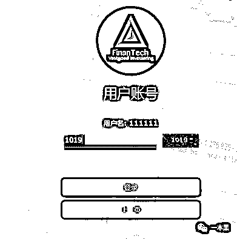**********随后老师傅顺利登录，并进入页面。随即弹出一个公告。********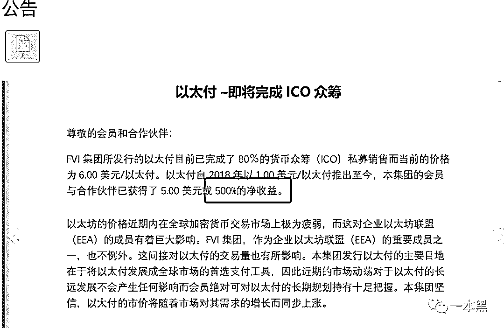********公告内容大体看下来，主要想传递的信息就是装逼，说自己自 2018 年推出至今，韭菜们已经实现了 500%的净收益。********我老泪众横，心想，我是不是错过了一个发财致富的好机会？********再看看首页，长这样。********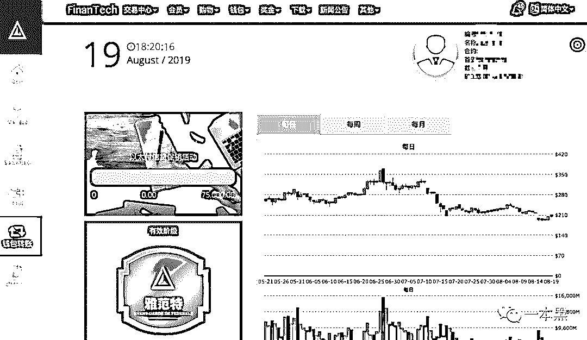********炸一看，这页面还真像那么回事，不过在老师傅的眼皮子底下，可不是那么能唬人的。********在仔细研究了这个网站后，老师傅决定对邀请注册和查看会员谱系图这两个功能进行测试。****************没错，上图的 QR 链接就是邀请注册选项，点击后进入出现一个二维码和邀请注册的地址。********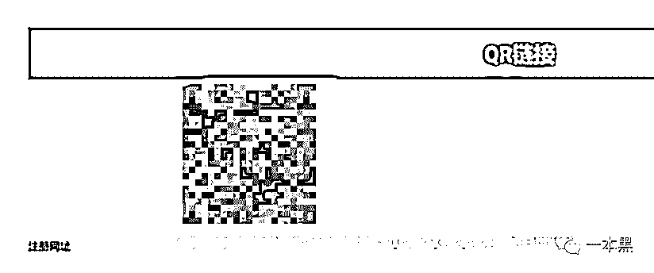********从邀请注册地址链接中，可以看出 Dr=111111，想必应该是邀请人的 id，********接下来转变一下功能项，查看会员谱系。********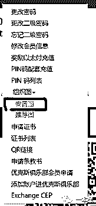********点击安置图，出现了如下界面。********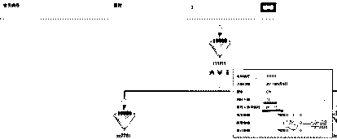********上图中的 77 人就是该账号发展的下线人员，推荐人会员编号，就是该 1111111 用户的上级账号。********（题外话：传销站点和传销团伙 会员体系都是采取类似金字塔结构的发展繁衍图谱。）********紧接着，老师傅继续使用计算机基础知识，通过替换参数，把 111111 替换成了 z**787，顺利进入会员注册界面。**************** 其中还经过一些比较复杂的过程，这里就不再解释，反正最终是进入了该账户的上级账户，********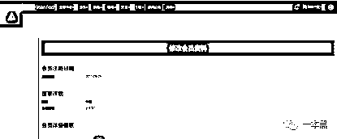********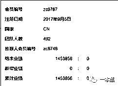********目前已经溯源到顶层发起者账号 C*M， 以及全部会员人数 ：共 459701 人参与。********其中这 45 万人，还是现在所拿到的保守数据，如果按每人投资一万块的话，总金额就是 45 亿.....********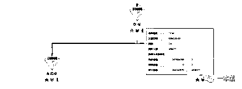********除此之外，老师傅还查到其中具备管理员嫌疑的涉案银行卡信息，开户行为深圳某支行。******** 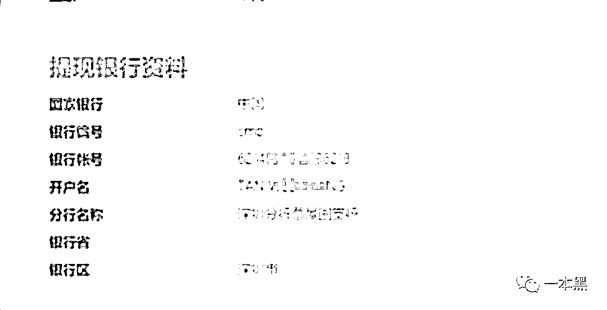********到这一步，老师傅没再继续下去，只是把信息同步给了相关部门，因为这事如果办起来的话，实在是太大了，凭老师傅一己之力根本搞不定。********以这种方式写出来，只是想让大家看清楚现在的某些区块链项目，别再被高收益蒙蔽了，你看上人家的高收益，人家盯上的可是你的本金。********这种国际传销模式的区块链项目，很容易对投资小白洗脑，而且返现特别慢，钱圈到一定地步很容易跑路。********你要知道，这些项目不是普通人能玩得起的，背后的人都是高端骗子玩家，你玩不过的。********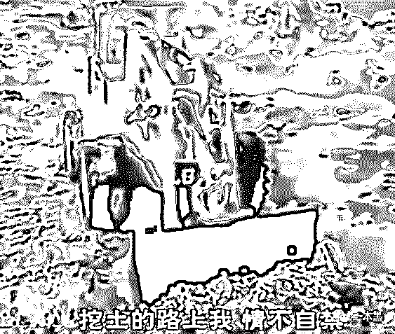********全世界都高举着区块链的大旗，说是最顶级的技术，能够改变整个互联网。但事实上，作为区块链最有名的代表——比特币，至今还未被主流金融机构认可。********要说这项技术如何如何先进，目前也没见到区块链改变我们的工作和生活。区块链至今为止最突出的贡献是给骗子和投机者多了一个行骗捞钱的借口。********但凡一个你从不了解，努力之后也依旧不了解的高科技项目，劝你不要轻易尝试，因为肯定会被割。********天上不会掉馅饼的，这类骗局归根结底就是一个骗子骗傻子的零和游戏。********认真你就输了，兄 dei～****************最后我想给各位介绍一位朋友，**stormzhang，**大家都叫他帅张，技术人的榜样，前码农/产品人，靠写公众号，实现年入百万，今年正式转型为自由职业者。********早年我写代码的时候，也看过很多帅张的文章，受益匪浅。**** ****值得一提的是，帅张不仅人长得帅，公众号写的文章，还同时得到过马化腾和张小龙的打赏，简直是让我羡慕。********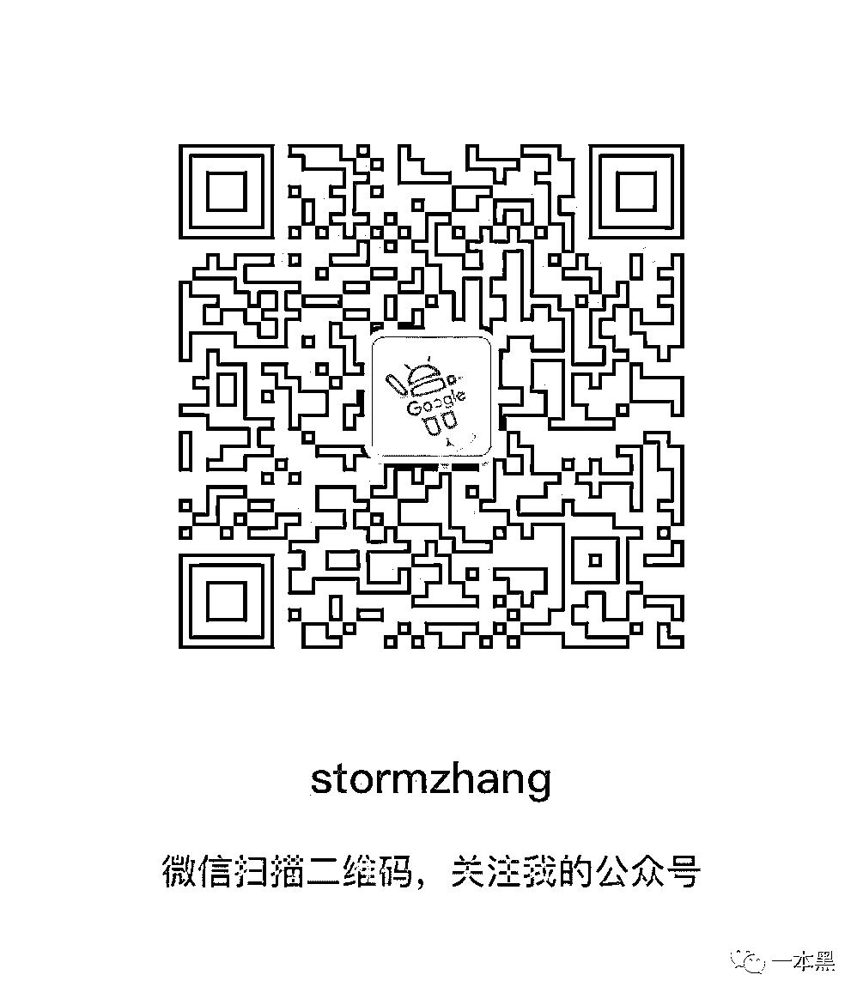********话不多说，不关注绝对是你的损失。****