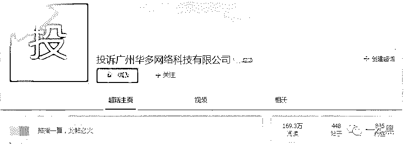
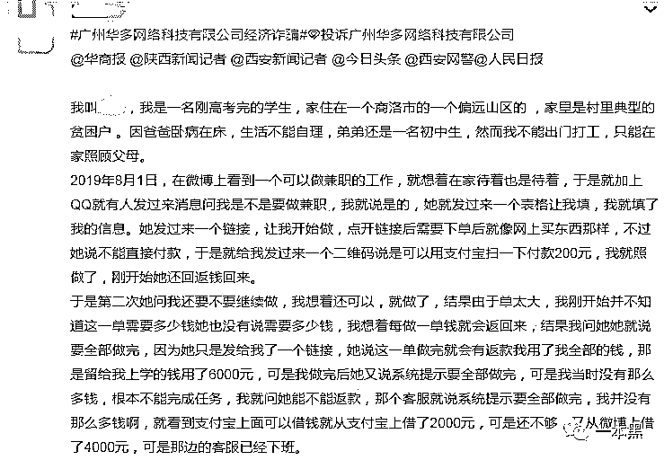
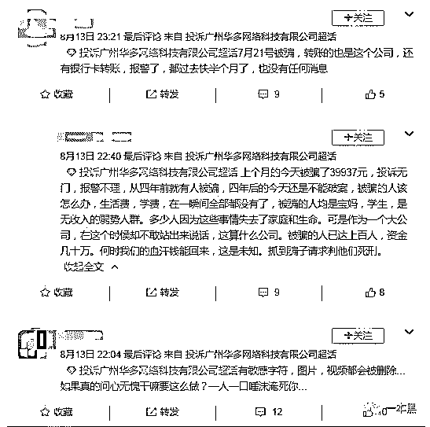
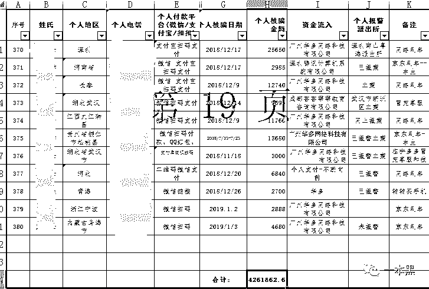
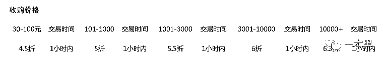
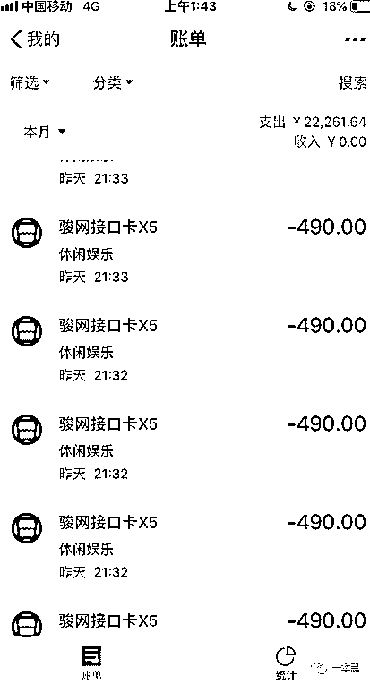
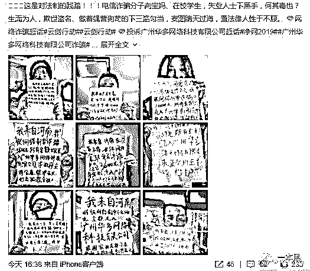
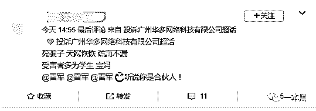
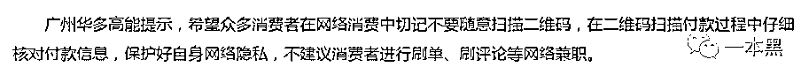

# 洗钱平台还是被迫背锅？数千人在 YY 被骗，平台有罪否？

> 原文：[`mp.weixin.qq.com/s?__biz=MzU4ODAwNzUwMQ==&mid=2247486156&idx=1&sn=b0852700165f21886ca3c9a1d243ba14&chksm=fde21beeca9592f83655dd3935cdddc4694a6d6be775c37800f79592c1c8aa425e5e06dacba7&scene=27#wechat_redirect`](http://mp.weixin.qq.com/s?__biz=MzU4ODAwNzUwMQ==&mid=2247486156&idx=1&sn=b0852700165f21886ca3c9a1d243ba14&chksm=fde21beeca9592f83655dd3935cdddc4694a6d6be775c37800f79592c1c8aa425e5e06dacba7&scene=27#wechat_redirect)

【黑话连篇】该栏目更多的是揭露事件或对事件的看法，以达到让人精神得到升华的目的。

* * *

 *****“广州华多网络科技有限公司是一家诈骗公司，专干洗钱、骗人的勾当.....”*

微博上，数百人正在对这家广州的公司进行口诛笔伐。他们都是诈骗的受害人，有的人被骗撸了网贷，有的人被骗走大学学费，还有的人被骗走了孩子的奶粉钱。

他们企图通过这种方式得到媒体的关注，以及司法的帮助，最好是能够追回那些被骗走的钱。

**YY-洗钱指定平台？**

喵叔/文

事情是这样的，有读者说前几天碰到了一个骗子，一个不怎么新颖的骗局，但前前后后骗走了他三万多块，而这些钱最终都流进了一个名叫广州华多网络科技有限公司的账户。

两天前，爆料人小李接到一通电话，对方声称自己是淘宝的“客服”，说小李购买的某品牌衣物存在甲醛超标的问题，根据公司规定需要按照售价给予小李一定金额的赔偿。

随后“客服”加了小李的 QQ，并发了一个二维码给小李，让他登录支付宝，填写身份信息和银行卡号码等资料，等系统核实身份后，就会把钱打到小李的支付宝账号。

但小李没等到钱到账，反倒是支付宝账户分四次被扣掉了近万元。小李当时特别慌，立马找“客服”核实，对方说小李输入验证码超时了，平台判定这是刷单行为，所以把钱暂时扣在平台了。

为了拿回被扣的钱，小李在“客服”的指导下，去美团、滴滴、花呗、小米金融等平台借了 22000 余元的贷款。

等回过神来的时候，小李发现这些钱已经分四十多次都进入这个名叫广州华多网络科技有限公司的账户，名目是充值 Y 币。

于是小李在网上搜索了一下才发现，对于这家公司，网上骂声一片，都是诈骗和洗钱。

在微博上，我搜到了“投诉广州华多网络科技有限公司”的超话，在这个话题下，许多人都在讲述自己因为各种原因被人了钱，而钱都去了华多。希望华多能给个说法并追回自己被骗的钱。

      

其中有贫困高考毕业生做兼职刷单，结果被骗去撸了一万多网贷，想不开要轻生的；有宝妈想给孩子赚奶粉钱欠下一屁股债的；还有在咸鱼买二手被骗的；以及和小李一样，被“客服”退款骗的。

      做兼职被骗的高中生

尽管被骗的理由各不相同，但对象都是学生和宝妈，或者是农村出来在外务工一类的低收入人群，而被骗的资金最终都以购买 Y 币等虚拟产品，最终进了华多的账户。

      

Y 币是 YY 旗下的虚拟货币，1 元人民币兑换 1Y 币，Y 币可以用来打赏主播、购买平台游戏或其它虚拟商品，可充值，但不能提现。

而他们多次提到的广州华多网络科技有限公司正是 YY 及虎牙直播的母公司，其中 YY 于 2012 年在纽交所上市，虎牙在 2018 年上市。

可以说华多是国内视频直播的奠基人，实力很强，口碑不错。

记得早年间，大家都说喝水吃饭上 YY，火爆程度和受欢迎程度可见一斑。最新数据显示，今年二季度，YY 的营收达到了 62.952 亿元。在经济下行期，YY 貌似成功实现了逆势增长。

但是狮子大了总有跳蚤，于是一些人把坏心思打到了这类直播平台身上。

从百度检索到最早的关于利用 YY 平台，以刷单为由实施诈骗的事件发生在 2014 年。也就是说利用 YY 实施诈骗，由来已久。

据某个“华多网络诈骗维权群”里的资料显示，仅 2018 年 5 月到 2019 年 1 月，可统计到的就有 380 人被骗，涉案总金额高达 420 万。

      

由于这种现象由来已久，且屡禁不止，愤怒的受害者们将 YY 称为“诈骗的保护伞”、“洗钱重灾区”。他们向各路媒体寻求曝光与帮助，联合起来去警局报案，甚至向一些民间追款人求助，希望有朝一日，YY 能够退还他们那些被骗的钱。

**Y 币套现与直播平台**

诈骗犯将骗来的钱通过充值 Y 币和购买虚拟产品的形式充值到 YY，再经过某些渠道，以低价卖出，换成人民币。

这类行为也被称作 Y 币套现。

在某游戏充值网站，有人以 4-6 折的价格大量收购 Y 币，收来的 Y 币可以通过打赏主播分成，又或者是和一些第三方充值平台合作，赚取差价。

      

令人不解的是，为什么诈骗犯会选择将骗来的钱拿去充值 Y 币，而不是直接转到自己的银行卡呢？多一道程序之后，到手的钱起码少了五成，为什么他们要这么做？

这就得说说虚拟财产这个概念了。

宪法规定 [ 公民的合法的私有财产不受侵犯 ] ，而其中私有财产的定义中并没有包含虚拟货币。只在民法第一百二七条写着，“法律对数据、网络虚拟财产的保护有规定的，依照其规定。”

也就是说法律没有明确规定虚拟货币的价值及属性，虚拟货币并不总是受到法律的保护。而诈骗犯正是知道这一点，所以才会以二维码的形式，让受害者主动扫描，充值 Y 币这一类虚拟货币，而不是转到自己的银行卡或是支付宝账户。

从法律层面来看，诈骗犯并没有直接骗取受害人的钱财，交易的都是 Y 币。从钱到 Y 币再到钱，经过多次流转之后，警方想要取证是一件极其麻烦的事情。

而从平台方来看，用户通过充值 Y 币打赏用户或是购买虚拟产品，同样是一种合理的行为。在直播行业，即使一个账户在短期内出现大幅的资金波动仍然是允许存在的。

毕竟直播行业本身就是充满戏剧性和起伏的，所以平台无法依靠账户的资金流动来判断用户的账户是否出现异常，进而冻结账户或是终止操作。

这些诈骗犯很聪明，利用了直播平台的特性来规避风险。这也是为什么这种现象存在五六年之久，但依旧事故频发的原因。因为平台根本就无法在短时间内判断这么多账号里面，哪一个正在进行非法的交易。

至于为何受骗的总是宝妈和学生一族，是因为在网上从事刷单的都是以宝妈和学生居多。骗子是无差别行骗的，不会看人下菜碟，最多看你的账户余额下套。

  

由于经历和年龄限制，学生和宝妈群体对于这个世界通常怀有美好的期待，容易相信他人，所以在被骗后，又相信了那些声称了所谓的“内部关系”和“职业追款人”。于是再一次落入被骗的圈套。

他们对这个世界满怀善意，但世界并不总是同样以善相待。

**YY 有罪否？**

在这场骗局中，承受最多骂声的除了骗子，当属 YY。

理由是，“虽然诈骗是个人行为，但是钱最终进了平台，平台能够抽成，所以平台是诈骗的保护伞；YY 的纵容导致诈骗屡禁不止。”

      雷军又躺枪了

但目前大部分诈骗的人采用的依旧是银行卡转账的方式，我们是否可以说银行等金融机构是洗钱的保护伞呢？是否需要银行赔偿受害者呢？

我想并不会，因为银行并没有这个义务和责任。

平台有监管的责任，但却并不是事故的主要责任方。除了 Y 币，还有 Q 币以及各类虚拟货币，同样深受诈骗犯的喜爱。

我并不是为 YY 以及各类平台洗白，因为我们不存在利益关系，如果有一天产生了联系，那可能是律师函的功劳。

技术无罪、平台中立是所有互联网企业最喜欢的口号，因为一旦平台出了点什么什么事，都可以用这个借口洗掉一部分骂名。

在中国互联网圈，技术无罪已然成为企业的一道护身符。

当初快播被封的时候，王欣高喊技术无罪，但这并不能改变快播公然传播淫秽视频的事实。

所以在喊出这句口号之前，平台方需要先想一想：别人用你的平台搞事时，你赚了钱吗？你有知情不报吗？你管了吗？

显然 YY 是赚钱了的，至于知情不报和放任不理，我想任何一个正规的直播平台都不会容忍诈骗行为的发生，因为纵容诈骗就是砸自己的招牌。于是 YY 在反诈体系中引入了 AI 技术，希望借此遏制欺诈事件的发生。

但受害者坚持认为，钱是在平台被骗的，那么系统肯定有 bug，况且充到 YY 的钱，平台多少也能赚一点。既然拿了钱又不修复漏洞，平台自然要给个说法。

然而作为一家商业公司，经营目标之一就是赚钱，在不知道钱的来路之前，任何一笔收入都可以当成是合理的收入。

但是，在知情之后，平台应该积极配合警方调查，主动提供资料，帮助受害人查清真相，而不是非要等到骂声一片的时候才开始行动。

记者采访时，华多负责人的回应

YY 太不主动了，这种被动回应的方式让受害者极其地不爽。所以他们在网络上谩骂，在 YY 总部拉横幅，希望 YY 能够重视他们的问题。

由于这类二维码诈骗事件频发，当记者采访时，华多也的确都会做出回应。但在最近的一篇报道中，华多发布了一条高能提示：

> **“用户不要随便扫描二维码，不要去从事刷单的工作。****”**

？？？看标题以为是个王者，结果却是个青铜。这种回应也太 TM 敷衍了。

就像快手宿华所说的“技术应当有价值”，在这场骗局之中，YY 的确不存在明显的过错。但是 YY 的态度不得不让人质疑，作为一家上市公司，你的价值观到底是什么？你是否真的有措施保障用户的权益？

你可以说技术无罪，平台中立，但前提是你得有立场和价值观呀。做企业，不能只想着赚钱，总得有点别的东西，譬如精神，譬如担当，这样才能活的长久。

诈骗与平台是永远对立的两方，用户和平台才是相依为命的关系。只要平台出现事故，用户就一定会责怪平台，这是一个解不开的结。

因为用户对平台有信任，平台对用户有责任。

如果不想承担骂名，那就承担起应有的责任。

一本黑新社群已开通，社群名字叫做**【一本黑的朋友们】**，我把它定位为一个成长型、资源对接，提升认知的社群。后续会在社群内公布各种各样的玩法，你上车了吗？（[私密社群，快上车](http://mp.weixin.qq.com/s?__biz=MzU4ODAwNzUwMQ==&mid=2247486144&idx=1&sn=e08c4c5b9bfd314a704d48e5e2e26115&chksm=fde21be2ca9592f4dce57c176022770d5bdace121618725bc3c164229a9ddfd1da08b735369c&scene=21#wechat_redirect)）****