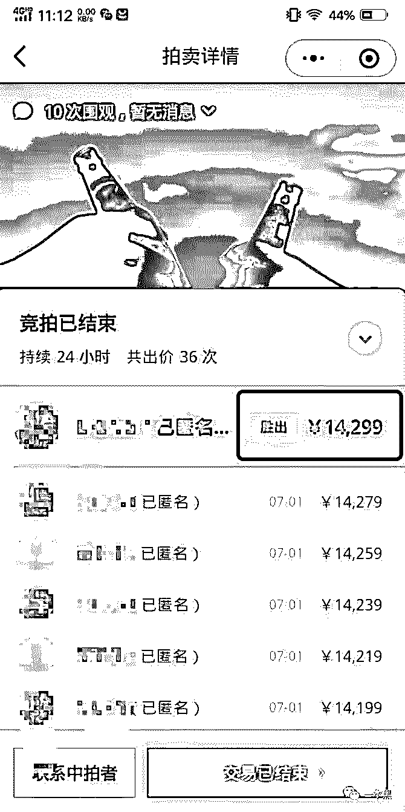
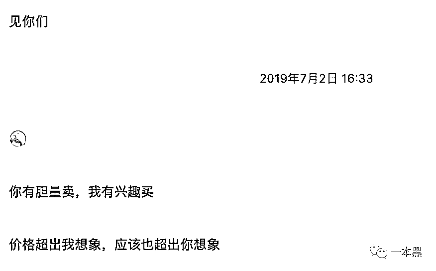
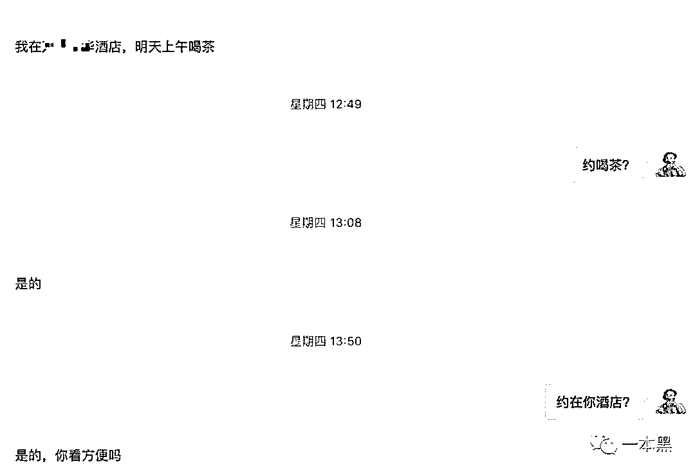
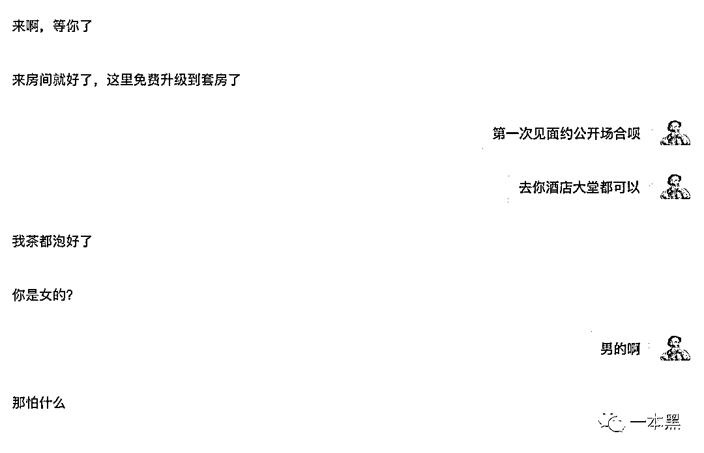
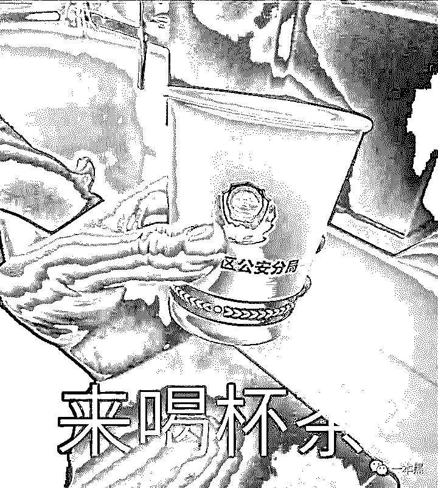
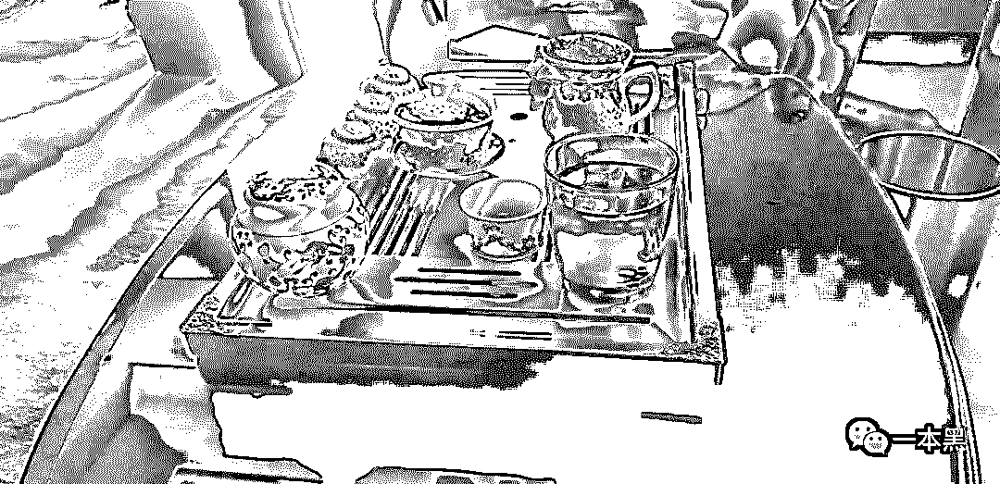

# 有个哥们花 14000 和我聊天，见面后他邀请我到酒店喝茶....

> 原文：[`mp.weixin.qq.com/s?__biz=MzU4ODAwNzUwMQ==&mid=2247486139&idx=1&sn=abc85a4346fba8bca5adcb6dafafadad&chksm=fde21b99ca95928fb11c8f9a3bd456526edc05f4fa326a7fe158786cb42a439634060e5d17ac&scene=27#wechat_redirect`](http://mp.weixin.qq.com/s?__biz=MzU4ODAwNzUwMQ==&mid=2247486139&idx=1&sn=abc85a4346fba8bca5adcb6dafafadad&chksm=fde21b99ca95928fb11c8f9a3bd456526edc05f4fa326a7fe158786cb42a439634060e5d17ac&scene=27#wechat_redirect)

 大家好，我是老黑。

7 月 1 日的时候，我在公众号上发了一篇文章——[和老师傅见面聊天](http://mp.weixin.qq.com/s?__biz=MzU4ODAwNzUwMQ==&mid=2247485837&idx=1&sn=63a35541a5103d3a5082881b1538c20e&chksm=fde218afca9591b92451ea1b30fa81be32a380c35650c2b7f47874bd6f420e115ccb271b8915&scene=21#wechat_redirect)

这篇文章是一场拍卖活动，拍卖什么呢！拍卖老师傅的见面机会。99 元起拍，加价幅度为每次 20 元。

之所以搞这次拍卖，起因是那会和一个读者聊天，聊完后我发现，很多读者看一本黑的文章都是看个热闹，满足猎奇心理。

但有一部人不是，这部分人每次都带着学习的目的去读内容，然后从中提炼出一些对自己有用的思路或者启示。

文章虽然是自己写的，但有时候内容中的一些细节，却是连我自己都没法捕捉出来，把他形成一个点子或者商业思路。

再加上冯大辉老师的拍卖小程序刚刚上线没多久，每天都在朋友圈拍一些小玩意，所以受到启发，准备也玩一玩，所以就有了那一次的拍卖活动。

拍卖持续了 24 小时，出价 36 次，最终成交价为 14299 元。

其实线下见面，说实话，我还是有点担心，你们懂的。

有时候会在想，这位花高价拍一个两小时聊天机会的人，会不会来者不善。

但本身一本黑干的一些事情就比较刺激，相比这个来说，其实也没什么的。所以拍卖结束后，我加上了这位得主的微信。

随后就产生了如下对话。

“你有胆量卖，我有兴趣买”，这句话看着怎么这么奇怪呢！

我一直好奇他想和我们聊什么，但他却一直闭口不谈，这种状态突然让我感觉有点问题。

随后，我查了一下这哥们的背景，发现一些他过去的从业经历，看样子还算正规，算是传统行业出身。

通过对比他的履历背景、以及一些其他细节，我并不认为他是我们曾经得罪过的利益方。

当时拍卖定的见面地点是北京，后来他告诉我，他在另外一个城市，时间等他确定后再联系我。

就这样过了一个月，直到上周，他联系我说已经飞过来了。

他告诉了我他的酒店位置，说第二天约在他酒店房间喝茶。

我说第一次见面，还是约在公开场合吧！

结果他说茶都泡好了，就等我上钩了！不是，就等我去喝茶了。

我突然拿烟的手开始颤抖，心想，是喝这种印有 logo 的茶吗？

思考再三，想着反正人来都来了，其实也没什么大不了的。谁让我爱干这种刺....刺激的事呢！

在出发之前，我和老师傅本来想着要不要带个干扰器啥的，最后想想觉得还是没啥必要。

因为离对方酒店比较近，我和老师傅步行过去大概只要五六分钟的时间，在路上我俩一直在猜测，这哥们到底有什么目的。

等到了酒店大堂后，我们找了个公共区域坐下，随后联系对方说我们到了。

过了一会，我们正式碰面，一个短发、体型健壮的男子出现在我们面前。见面后我说要不就在大厅聊吧！但他却一直坚持说去房间里，茶已经泡好了。

此时气氛开始变得紧张起来，在电梯里，我和老师傅都在想接下来几十秒里将要发生的事。

会不会一进门就被几个人高马大的人给按住了，这会不会是一场“鸿门宴”。（开个玩笑）

事实是我们想多了，进入房间后，严肃的气氛慢慢缓和开了，我们也一步步聊到了各自的行业。

至于聊天的具体内容，暂时不便公开，总之这次见面的是一个比我们年长一些的前辈，他认同我们所做的事情，也指出了一些他认为需要改进的地方。

整个过程下来，我们聊了价值观、聊了商业机会、聊了生活等等，同时也聊到了一些后续能合作的机会。

我想说，这种线下见面其实挺刺激，也挺好玩的。由一开始充满好奇、到怀疑、再到过程，最后结束。

它能给人带来一种期许，你不知道接下来将要发生什么，也不确定是否安全，但正是这种不确定性，才让我们一成不变的生活多了些色彩。

至于拍卖所产生的费用，我准备把它作为读者日的经费，或者日后的社群经费。

对了，原本要在上周五公布的社群，调整到下周一，也就是明天。

但不少有心人已经发现了隐藏入口。

总之，明天见。