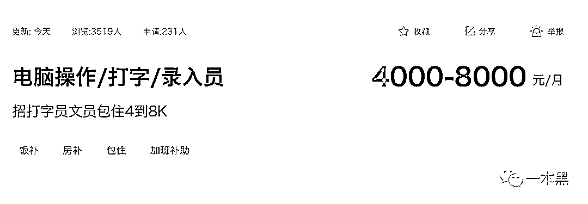
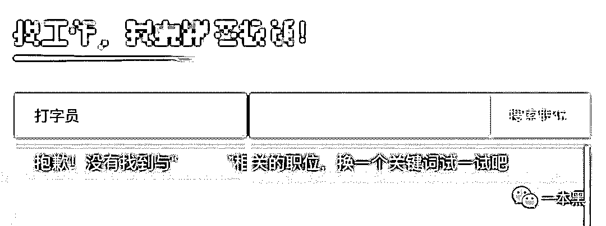
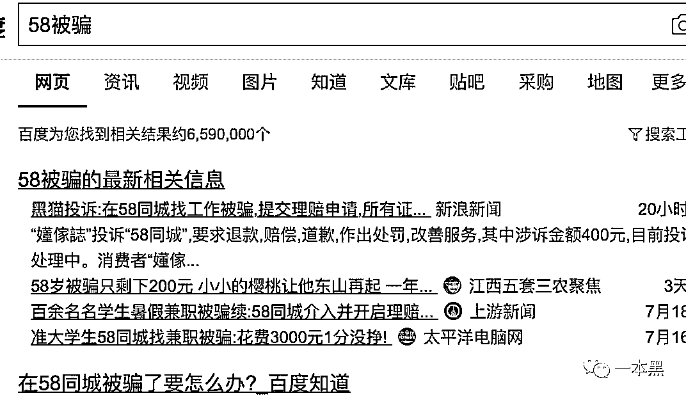
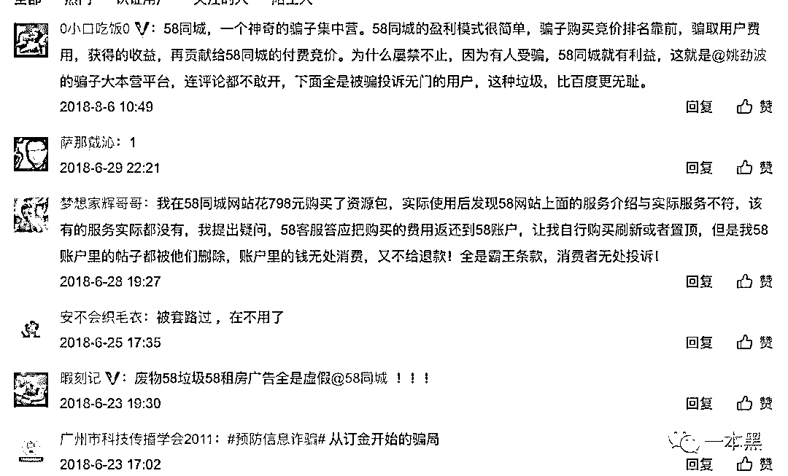
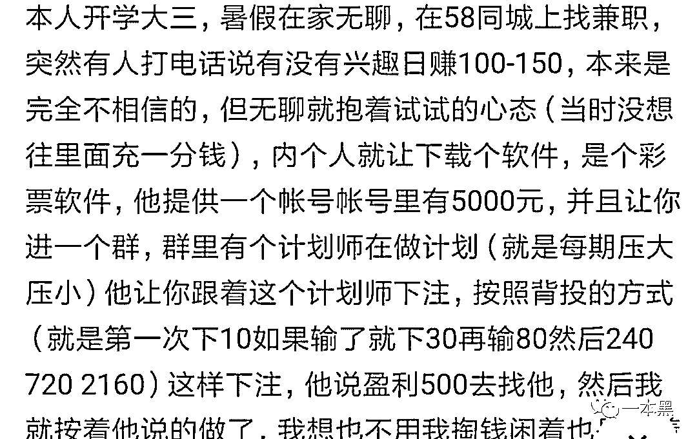

# 58 同城，一个神（垃）奇（圾）的骗子集中营？

> 原文：[`mp.weixin.qq.com/s?__biz=MzU4ODAwNzUwMQ==&mid=2247486101&idx=1&sn=f6970dbca4dfc322804de754a26e77aa&chksm=fde21bb7ca9592a1d15b6e5fd8d4de773c907cae0116810fb9e16847ab0d85011f7e8a2f15d8&scene=27#wechat_redirect`](http://mp.weixin.qq.com/s?__biz=MzU4ODAwNzUwMQ==&mid=2247486101&idx=1&sn=f6970dbca4dfc322804de754a26e77aa&chksm=fde21bb7ca9592a1d15b6e5fd8d4de773c907cae0116810fb9e16847ab0d85011f7e8a2f15d8&scene=27#wechat_redirect)

 【黑话连篇】 

**该栏目更多的是揭露事件或对事件的看法，以达到让人精神得到升华的目的。**

* * *

**大家好，我是老黑。**

** 一直以来，我总能在后台看到很多读者发来的求助信，有被骗进传销的，有被赌博输掉身家的，还有轻信各种投资平台被骗几十上百万的。**

**我有时候都有点怀疑人生了，为什么你们都这么有钱。几十上百万丢到一个黑平台里，跟玩似的。**

**哎，你们有钱人的生活真的是这么枯燥且乏味吗？反正我是体会不来。**

**其实说到受骗，这两年我也扒了很多平台，不说能帮大家把钱要回来，最起码也能让后来者多一些警醒。**

**别夸我，但行好事、莫问前程。**

****

**以上说到的赌博、诈骗，基本都是一些不知名小平台，先包装一个华丽的项目，然后开始疯狂圈钱，最后再找机会跑路。**

**这种大大小小的平台简直不能太多，受害者往往投诉无门，无法维权，只能自认倒霉。**

**20 年前，没多少人会想到，互联网在给人带来便捷生活的同时，也吞噬了一部分人的生活。**

**任何一款互联网产品的出现，起初都是为了解决某一群体的痛点，对于各种投资产品来说，高收益解决的是用户钱生钱的痛点，但与此同时，有多少人会想到它总有一天会跑路。**

**你看，这个痛点也确实是够痛的吧。**

**说到解决用户痛点，不得不提的一个老牌互联网企业，58 同城。**

**那我就得夸一夸它了，58 同城，至今成立 14 年，可以说早已成为中国最大的分类信息网站，它最大的特点就是本地化，解决同城需求，几乎涵盖了生活所需的各个领域。**

**但就是这样一个起初为了解决用户痛点的互联网产品，在历经了 14 年不断开辟疆土、攻城拔寨后。**

**它......它好像杀红了眼。**

****

**嗯，这股冲劲值得表扬，你们搞互联网的可都得学学，别一天要死不活的，看看人家，在一味向钱冲的时候，多专一。**

**完全不会被自己平台上出现的那些虚假信息所打扰。**

**不过说实在的，58 同城这种杀敌一千自损八百的玩法，完全忽视了自身该有的服务和对虚假信息的监管。**

**对于在 58 同城上踩过坑的受害者来说，它的口碑可以说已经烂到了极致。**

**已经变成了一个满分公关也拯救不了的、大众口中的“骗子”网站。**

****一****

****写这篇文章的原因，是一直以来看到很多读者反馈自己在 58 同城找工作被骗，并没有恶意抹黑的意思。****

****所以就事论事，简单谈一谈 58 同城存在的问题。58 的公关同学可不要来邀请我喝茶，我只是个臭写字的。****

********

****言归正传，58 同城从 2005 年成立至今，不仅没有死，反而日益壮大，用户量早已是上亿级别，放在今天，中国做得比较牛逼的企业里，58 同城绝对可以排得上号。****

****但正是因为林子大了什么鸟都有，所以上 58 同城的客户群日益增多，其自身好像开始出现了肾虚的症状，不是，我是说他们在内容审核上出现了心有余而力不足的状况，越来越多的虚假信息开始泛滥。****

****可不是咋地，找工作，上 58；换房子，上 58；买二手车，也他么上 58，你们咋这么喜欢上 58 呢！****  ****你说这病怎么治？总不能他好我也好吧！有时候药效这东西，真不能全信。

在找工作这块，我最服的就是 58 同城，奉管你是什么高端职业、低价岗位，58 同城全都能给你办了。而且薪资待遇完全不输任何一个平台。

同时，58 同城也是一个包容的平台，奉管你有文化没文化，你都能在这里找到一个满意的工作。

比如只要你会打字，你就能找到一份让你走上人生癫疯的工作。

打字没有任何门槛吧，在这个年代来说已经不算什么技能了吧！人人都会吧！

得嘞，月薪 4000-8000，朝九晚六，还包住宿。

不过打字员这行竞争也是挺大的，一个岗位 231 人申请，看来找工作也不容易啊。

再看看隔壁其他几个平台，有点恨铁不成钢的我就想批评两句，太没有包容性了，居然连打字员这种高端工作都没有，还敢叫招聘平台？

你说让这些只会打字的高端人才如何是好！

扯淡归扯淡，其实稍微有点生活经验的求职者都知道，现在哪还有什么打字员啊，而且一个月居然有 4000-8000 的薪资。难道不知道 58 上所谓的打字员、电脑录入员、很多都是骗子吗。

但这个世界就是这样，你所熟知的事情，往往还会有很多人不知道，而这个数字一般来说是 10 亿。

但用户不知道，58 不可能不知道，所以在这方面，你不能把责任推到求职者身上，说他们没有辨别能力，毕竟平台是你提供的，你得对用户负责。

可现实却是，求职者被骗投诉无门，58 做不出有效改变。

说白了就是还没出人命，要是哪天在 58 上发生了因求职威胁到用户的生命，这时候 58 可能会急疯吧。

另外，除了 58 同城对部分求职者的不管不顾，以及对垃圾求职信息的不恰当监管，还存在企业端的问题。

正规企业一般来说如果要在 58 上招聘，需要交钱才能查看更多简历，但是很多人反馈交钱后看到的无效简历太多，60%以上的简历呈现的状态要么都是已经找到了工作，要么就是匹配度很低。

其实稍微有点经验的求职者一般不会用 58 求职，再者说现在 58 上基本都是中低端岗位，很多互联网企业也基本都不会在 58 上进行招聘。

现在暑假期间，很多学生会在 58 上找兼职工作，所以提醒大家一定要擦亮眼睛，千万不要草率的根据工资高低就贸然入职。

多一些心眼，不要相信天上会掉馅饼这种事情。

**二**

**各位当年一定被 58 的广告洗过脑，效果完全不亚于“今年过年不收礼，收礼只收脑白金”。**

**在杨幂铺天盖地广告的狂轰乱炸之下，人人都知道在 58 上可以找工作、可以买卖二手物品、可以出租房子。**

****

**但事到如今，不知道 58 还记不记得自己的愿景：做一个人人信任的生活服务平台。**

**显而易见，这句话打脸了，越来越多的人对 58 失望，被 58 上的虚假信息骗钱骗感情。**

**58 的问题当然不止停留在招聘层面，在房屋出租领域，同样也有很多人在使用过 58 后离他而去。**

**在搜索引擎搜索关键词，可以看出关于 58 被骗的信息高达六百多万条。要么是找工作被骗、要么是投诉无门。**

****

**而 58 平台上的房屋出租信息，黑中介那就更不用说了，前段时间有位读者还给我说，他想在 58 上发布一条出租信息，平台提示需要交纳 200 元保证金，可是几个月过去了，房子非但没租出去，保证金还退不了。**

**搜索引擎里的案例铺天盖地，受害者哭诉自己的惨痛经历，就和当年 58 打广告一样，唯一不同的就是，广告人人都能看见，可这些受骗信息却鲜有人看。**

**为了找到更多真实的案例，我来到中国裁判文书网，对在 58 上被骗的案子进行了查询。在查询结果中，一共出现九千多个结果。**

****

**在一份关于 58 同城虚假二手车信息的诈骗案中，我看到了这样一个故事。**

**一名受害者崔某，在浏览 58 同城时，看到一条价格非常诱人的售车信息，一辆二手奥迪 A4，售价只要 13200 元。**

**他随即拨打了平台上留下的电话，可没想到却掉入对方设计好的一个连环骗局，从交押金开始，对方继续忽悠他交送车费、上牌费，把他骗了个遍。**

**而所谓的“卖家”并没有给受害者送车，而是躺在千里之外的出租房内运筹帷幄，用话术一步步诱导他打款。**

**诈骗者被抓后供述，所谓售价 13200 元的奥迪 A4 并不存在，一切都是虚构的话术，通过从 58 等网站发布虚假售车信息，让鱼儿主动上钩，然后实施诈骗。**

**比起已经侦破的案子，搜索引擎还有太多的案子得不到解决，受害者投诉无门，只能自认倒霉。**

**所以任何事情都不是无风不起浪的。在 58 同城 CEO 姚劲波的微博下，几乎每天都会有人留言指出 58 的问题，可能是怕舆论的声音太大，其甚至关闭了微博的评论功能。**

****

**这样的例子实在是太多，但在 58 上上当最多的还得属学生。**

**有学生在知乎发表自己被骗的经历，说自己暑假在 58 同城找兼职，最后被一个人骗去玩博彩，最终输掉 2500 元。**

****

**在看了这么多的案例之后，我点燃一根 19 块一包的黄鹤楼开始分析，为什么 58 同城作为一个十几年的老牌互联网企业，对这些虚假信息的甄别工作做得这么不到位。**

**按理说 58 这些年也赚了不少钱，对自己平台内容的审查应该加大力度才是，可还是会有人源源不断地在 58 上被骗。**

**其实 58 的赚钱逻辑并不复杂，和任何平台一样，有流量就有钱赚，58 的广告当然是其一部分收入，再者就是 58 扮演了一个中介的角色，商家想在 58 入驻就得交中介费，这也是一部分收入。**

**但是现在 58 这两块蛋糕上的奶油越来越少，一方面是自身口碑越来越差，另一方面也遭到了垂直同行的冲击。**

**58 同城就像当年的秦始皇一样，南征北战，确实开辟了不少疆土，但就现在来说，我认为 58 已经过时。**

**58 早已显示出自己的臃肿，看似面面俱到，实则单薄无力，不仅表现在招聘领域的监管缺失，还有房屋出租和二手车交易领域的鱼龙混杂。**

**58 老了，肥胖的身体早就遭到了来自各个层面的人的唾弃。**

****

**前有陈胜吴广揭竿而起，后有互联网产品垂直分化，越来越多的企业开始只关注垂直领域，而不是像 58 一样拥有雄厚野心，任何领域都想涉足。**

**所以后来出现的各种垂直平台，虽然在用户体量上还和 58 有所差距，但口碑上已经远远把 58 抛在身后。**

**相比臃肿的 58，招聘和租房领域出现了更加年轻的网站，这些年轻的网站在服务水准上会显得更高。**

**但活人总不能让那啥给那啥，正面刚不过咱就不硬钢，所以 58 早就想到了破局之路，那就是下沉到三四线城市去。**

**这里说一点，最近几年很多互联网企业都是往下沉走，本质上其实就是韭菜不够用，通过把自己产品服务给三四线城市的人群，以此进行新一轮的收割。**

****

**所以下沉到三四线城市确实对 58 来说是一件能破局的事，毕竟中国人口基数太大了，韭菜还可以再割几年。**

**对于 58 存在的问题，虚假信息导致的用户信任，是其自身的最大问题。**

**然而 58 挺鸡贼的，巧妙的运用了下沉市场的红利，但就是不知道 58 有没有考虑过一个问题，在把战车拉到三四线城市，准备攻城略地的时候，会不会重建新用户对自己的信任？**

**某种意义上来说，58 的下沉是无奈之举，虚假信息泛滥和平台的不作为让用户不再信任这个历史悠久的平台，转而投向各类新兴的垂直平台。**

**当三四线城市的崛起，小镇青年为 58 提供了新的机会。去开辟新的战场（农场），去割小城里的韭菜，用广告洗脑，重拾他们对平台的信任。**

**姚劲波说，将继续加大在创新和广告投入方面的力度，不论公司与行业的收入增幅达到多少，都会将投入通过广告的效果反哺给行业。**

**所以，即使 58 的口碑直线下降，他们依旧砸大把大把的钱投广告，而不是着力整治平台的不规范。**

**鸡贼的 58 想用转移市场的方式来掩盖平台的不足，只怕会让平台的病越发严重。**

****

**我突然觉得，中国互联网发展了二十几年，上亿网民竟然一直活在一个尔虞我诈的环境中。**

**各种平台有套路软文、有虚假信息、有造假数据，原来这个世界所谓的繁荣掺杂了这么多人性的东西。**

**而你我在其中难免会被迫充当牺牲者，用自己的牺牲造就平台的发展，平台又不断触及新的人群，循环往复。**

****难道中国互联网未来的发展，真的就这样陷入一个人与人之间相互利用的死循环吗？****

****这个世界会好吗？****

****

**还原事实｜专扒黑产**

**微信 ID：darkinsider**

****

**知乎 一本黑**

**微博 一本黑 007**

**投稿、爆料、招聘、转载**

**请联系微信：chenchen_19940612**

**约稿、内容合作、联系：yibenheiSW******