# “你在网上搜的救命良方，是我 4 毛钱一条编的”

> 原文：[`mp.weixin.qq.com/s?__biz=MzU4ODAwNzUwMQ==&mid=2247486060&idx=1&sn=755b5e3548a059e4af55d174284d39d3&chksm=fde21b4eca959258b7acaf52ca84f1f482567e5ee8774f3c79d6da03f646da748f43054a16c8&scene=27#wechat_redirect`](http://mp.weixin.qq.com/s?__biz=MzU4ODAwNzUwMQ==&mid=2247486060&idx=1&sn=755b5e3548a059e4af55d174284d39d3&chksm=fde21b4eca959258b7acaf52ca84f1f482567e5ee8774f3c79d6da03f646da748f43054a16c8&scene=27#wechat_redirect)

【黑话连篇】
**该栏目更多的是揭露事件或对事件的看法，以达到让人精神得到升华的目的。**

* * *

**对于我这种肥宅来说，只要条件允许就不会主动出门，吃饭点外卖；购物上淘宝；约朋友见面，就在家一起吃外卖。偶尔头疼脑热就百度一下，然后楼下药店买盒药吃了。****虽然我天天骂百度没良心，但是身体不舒服，第一件事又是上百度。虽然我搜“掉头发”，它告诉我可能是白血病；当我坐久了腰痛，它告诉我可能我肾虚，也有可能泌尿系统有毛病，要我多吃猪腰子。********但我仍然感谢百度，因为它让我知道在金钱面前，医疗也能玩笑。******4 毛钱一条，千条一结******喵叔/文****度娘上搜“头痛怎么办？”会出现很多“专业医生”的在线诊疗以及一些热心网友的亲身经历。****看起来比较靠谱的有 39 健康、快速问医生、好大夫在线等网站，这些都是专门的在线医疗问答网站。回答的医生也都是经过认证的专业医生，看起来好像可以信。****然而有天我在豆瓣看到一条招募医疗问答兼职的帖子，我感到有些不可思议。****帖子说该兼职简单好上手，答案只要在网上找就行，每天稳定收入 80+，甚至可以代理。****我的心有些凉，什么时候开始，严肃的医疗问题成为这么随意的网赚项目了？甚至连基本的专业要求都不要。****      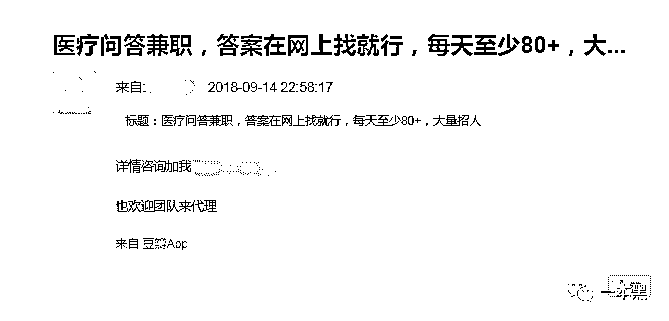****加了几个问答兼职群，发现每个群做的平台都不一样。但一般以专业的医疗网站为主，譬如号称“只专注于权威科普内容 ”的知了医生、“为医学插上有趣翅膀”的九松健康、“倡导优生优育”的三优亲子等，此外也有热门的付费问答网站，如“一款靠谱的问答社区”悟空问答。****当然也有一些是做百度知道、新浪爱问、360 搜索、39 健康之类的，不过那些平台就不局限于医疗，一般是做品牌露出为主。这里略过不表。****入群之后管理员会让先看群文件，了解各个平台的创作要求，完了有意向的就去找管理员领任务。****不同平台给的价格不一样，但一般一条问答的字数都在 200 左右，便宜的 4 毛钱一条，要求多的 1 块以上。****但所有的平台都要求有一定的原创度（10%以上），给钱越多原创度越高，但也不会超过 30%。也就是说一条两百字的回答，三成靠瞎掰，七成靠抄。**** 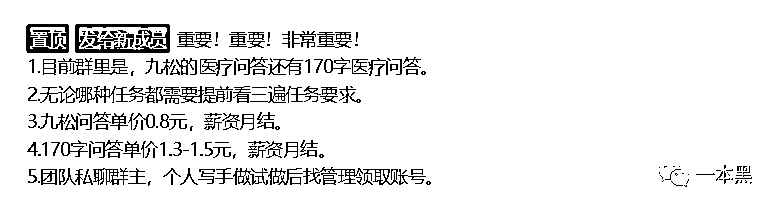 ****一般平台做任务都是这样的步骤：**

> ***1、做测试******2、从管理员那领取平台登录账户******3、选择你熟悉的科室（例如男生选男科，女生选妇科）******4、虚拟一个患者的提问******5、假装成一个医生解答问题******6、用专门的工具检测一下原创度******7、修改、发布***

**据说一个熟练的“创作者”，一分钟就能完成一个问答，比几十年经验的老医生看病还快。****厉害厉害。****尽管这不是一份严谨的工作，但是在“创作”规范里都明确禁止“创作者”在问答里开玩笑，要严肃对待医疗问题。并且要求“创作”者以医生的角度为患者考虑，给他们提供具有指导性的建议。****你 TM 逗我呢？做医疗类的问答兼职，并不需要任何专业及经验的要求？一个熟练的“创作者”可能连初中都没毕业，除了看病对医疗一无所知，你让他们给患者提供参考意见？****凭空捏造吗？还是粘贴复制？且不说每个患者的病况都不尽相同，即使是摘抄权威回答，不完整的内容也不具备参考意见。****更何况，权威如 39 健康的问答也未必都是权威医生的回答。******只要有的抄，你就是专家******在正式开始任务之前，必须先通过测试，也就是根据模板从网上摘抄合适的答案，只要通过审核就能做任务。****下图其中一个平台提供的测试题，尽管加群的时候写明只是简单的医美题，但实际操作中却远不止这一个类型，只要网上能找到答案，你就可以是任何一个科室的专家。****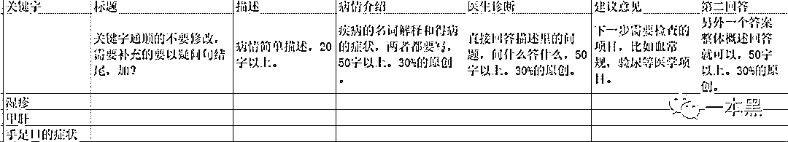****比如这个测试题就包含了湿疹、甲肝、手足口病，三个分属于不同科室的疾病，竟然只靠一个网友的键盘，就能轻松给出治病的良方，望闻问切的任何一步都不需要。****真是不可谓不优秀。****完成测试题之后发给管理员审核，通过后就可以拿到后台账户，领取任务。选择科室、关键字和文章类型，就可以开始自问自答了。****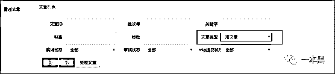****首先你要假装自己是个病患，得了某种疾病，需要在该平台求助，接着你就去度娘上搜索关键词，从 39 健康、快速求医问药等网站上摘取看起来靠谱的答案。之后酌情进行“创作”，也就是改编，删减。****“创作”完之后先用管理员提供的原创检测工具自行检查，如重复率达标即可提交，否则需要再次修改。提交之后等待后台系统审核，审核通过，这条问答就算完成。**

**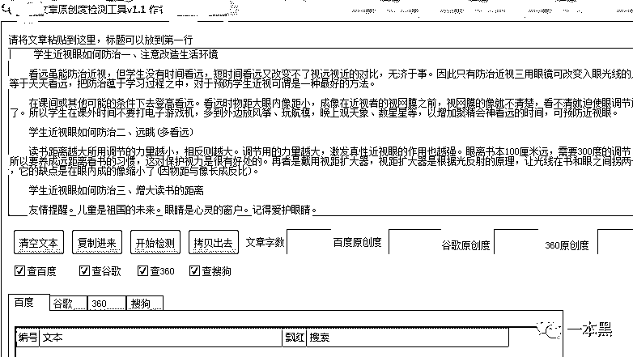**

**也有一些平台系统已经设定了多个问题，“创作者”们登录之后只需要直接领取问题，然后去网上搜答案，复制粘贴就行。****一般一个完整的问答包含：问题描述，患者信息，医生建议以及注意事项几个部分。每一个都能在网上找到现成的文字。**** 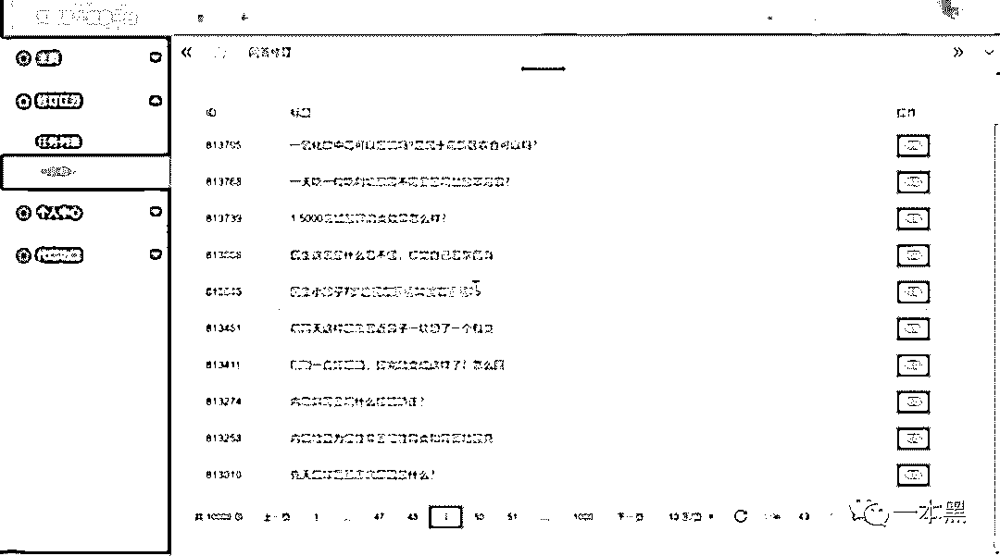****不同平台，每次可领取的任务量不同，但一般 20 条起，上不封顶，只要你的手速过快，你就能赚到足够的钱。****很显然这类医疗问答“创作者”的任务都来源于管理员，管理员在这中间相当于一个中介，从网站处领取大量的任务，然后再以更低的价格转给群里的各位写手，以此来赚取差价。****至于中介是以何种身份拿到题源的就不得而知了。****其中，知了医生自称是一个专业的 PGC 内容生产平台，但目前看来应该是一个巨大的 UGC 平台。****       *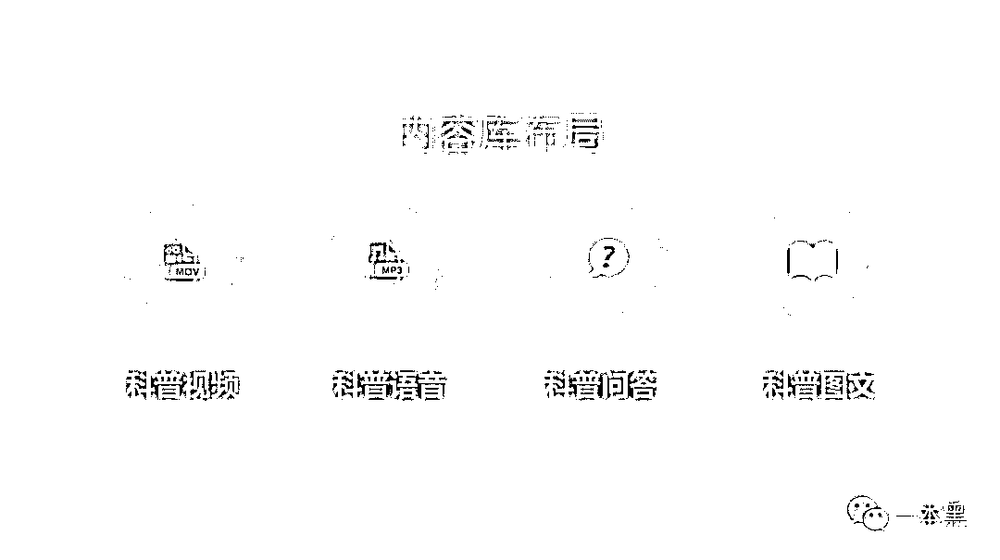知了医生内容版块*****在四个内容版块中，“创作者”们主要是负责问答版块的内容填充，视频版块需要真人出镜，审核相对较为严格。我尝试注册，发现需要实名认证并上传医生执照，看起来好像很正规的样子。****但如果注册审核真的如此严格，那么群里的那些“创作者”们又是在替哪个医生回答问题呢？****知了医生作为一个成立不到半年的健康平台，以抖音起家，想要迅速在健康领域立足，并以内容吸引用户，就必须充实内容库。但是光靠用户提问，医生解答，既做不到即问即答，也不可能在短期内就见到成效。****于是，这种复制粘贴式的医患问答成为充实网站内容最有效最直接的方式。当然，知了医生和九松健康等平台成立时间短，似乎还“情有可原”，一些老牌网站还这么做就说不过去了。****网站流量下降，可以用产品和服务或者广告来推动都行，但内容不能玩笑。****当然，这种事平台是不可能承认的，于是知了医生在 5 月份还发布一篇打假声明，但如果真的不知情，那后台那上万道问答题是给谁准备的呢？平台上的三甲主任医师吗？********如果真的不知情，那为什么九松健康给医生准备的后台，“创作者”们也可以随意登录呢？****更有趣的是，网站上常常出现深更半夜多位主任医生集体上线答题的场景，而且答题时间的间隔都不超过一分钟哦。****原来我平常排队都挂不到号的专家医生，都忙着去网站答题了吗？**********权威不权威，科普不靠谱******这些医疗网站都号称自己与上百家三甲医院合作，邀请了上千位三甲医生入驻，而主页所显示的问答也都是由实名认证的医生所回答。在一些问答里，医生甚至给患者推荐了处方药。****我在知了医生上复制了某位主任医生关于小孩腿疼的回答，然后去百度搜了一下。我想我大概还原了群里的小伙伴们当时创作的情景：****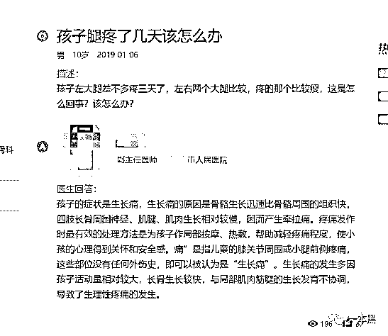****先在百度搜索关键词，然后选择靠谱的回答复制粘贴，就像下图一样： ****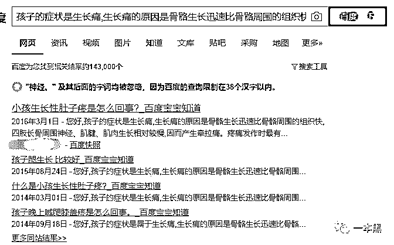****后来我又在西红柿健康、三优亲子等网站如法炮制，还是得到了同样的结果呢。****毕竟当我看到西红柿健康网上，一个三甲医院的整容医生推荐用户吃木瓜丰胸，还美其名曰含有大量的丰胸激素时，我就笑了。****这些让人发笑的回答，统统都标注着来自三甲医院的权威医生，但似乎这些权威医生的建议和百度知道的回答是一样的呢。****也不知道是这些医生平时就爱去百度匿名回答问题，还是？****而这些医疗健康网站，每个都宣称自己要做权威的医疗科普网站，要用靠谱的医学知识保护国人的健康。****事实上，这些回答既没有权威，也不靠谱。****倘若只是做科普也就算了，这些网站还都爱给病患在线诊疗，开方子。****     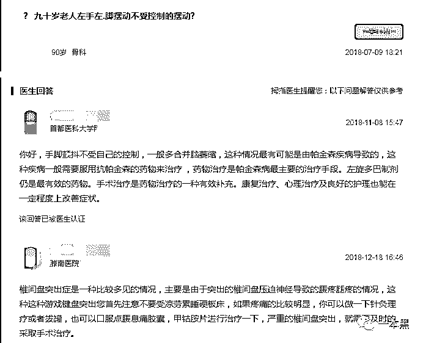       ****百度拇指医生对于一位 90 岁老人手脚发抖的诊断，一曰帕金森，一曰椎间盘突出，还都开了药。******医疗网站的问答之所以不靠谱，在于不准确。******在一些问答里，网友连自己的病症都没有描述清楚，医生竟也就根据这些模糊的症状妄下诊断，最终小病成大病。****小蔡工作忙，身体有些小病小痛习惯网络求医。因为有些咳嗽，便自己在某个医疗平台提问，希望能得到医生的帮助。平台的医生十分好心地给他进行了免费看诊，确定是气管炎后，给他开了一张药方——上面写着 5 种消炎药。****小蔡觉得有点疑惑，但医生又不在线，想着凡事遵医嘱，就去药店买了药。但是吃了一段时间之后，虽然不再咳嗽了，但经常胃痛，上医院检查后发现，是药物性肝功能受损。****因为医生给的开的处方上写着五种消炎药，需按经验使用。小蔡不知道什么是按经验使用，就一次吃了 5 种，于是就，悲催了。****小蔡的情况并不是个例，看病不准、沟通不及时、乱开药是目前医疗问答网站的通病，虽说互联网+医疗是未来的趋势。****但目前看来，还不值得信任。****早前有媒体也曾经曝光过这类兼职和医疗平台，但我百度这些平台时，却没发现几条负面信息。****刚开始我以为是新闻传播范围不够广，但是后来看到铺天盖地的招兼职的帖子，再加上我在某个群里看到的“消百度知道负面，删链接 500 一条，20 条打八折的消息时”。****我瞬间就懂了。********再后来我又去咸鱼转了一圈，果然一周逛两次咸鱼，每次都有新发现。****我找到一个很有意思的小软件叫【悟空问答全自动软件】，可全天在线自动答题，一台电脑可开 9 个账户，让你轻松实现躺赚。****在演示视频里，我不仅看到了医疗问答，甚至还看到了宠物医疗问答。****果然，人类为了赚钱，竟是连狗都没放过。****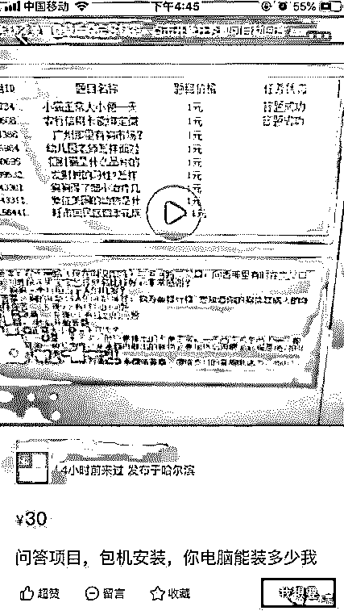** ******可以毫不夸张的说一句，没有一个问答平台是干净的。不论是贴吧、论坛、知乎还是悟空问答这类新兴的付费问答网站。** **哪里有钱赚，哪里就有混乱。有时候这混乱并不是由平台发起，但平台总归逃不了干系。****有些平台知道问题所在，但假装看不见，睁一只眼闭一只眼；****有的平台，明明看见了问题，但是利益当先，就默认它的存在；****有的平台，知道问题所在，选择壮士断腕，彻底整治，对不起这类平台暂时还没看见.....****所有平台在成立之初都有一个伟大的口号，一个感人的初衷，但时间一长口号就忘了，初衷也变了，毕竟什么都没有钱重要。****但咱挣点干净钱，别拿他人的身体健康、甚至性命开玩笑，成吗？****医疗网站不可信，互联网没有净土。**

****

**还原事实｜专扒黑产**

**微信 ID：darkinsider**

****

**知乎 一本黑**

**微博 一本黑 007**

**投稿、爆料、招聘、转载**

**请联系微信：chenchen_19940612**

**约稿、内容合作、联系：yibenheiSW**