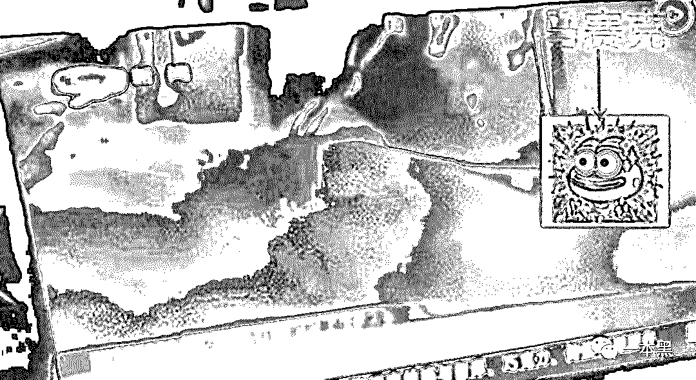
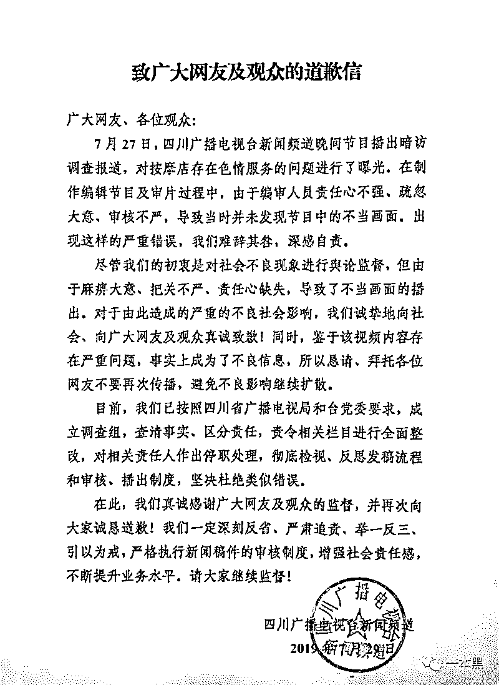
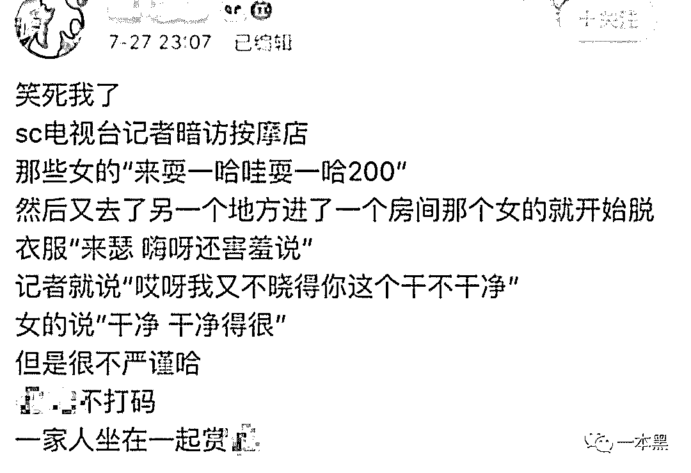
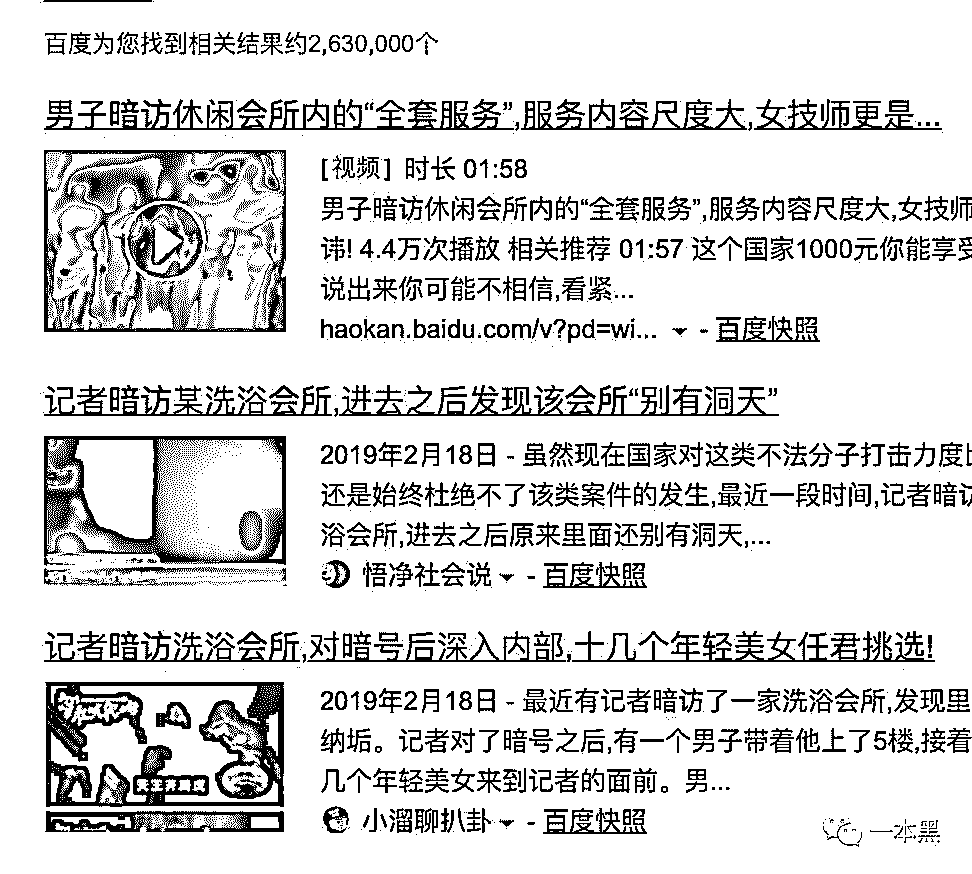
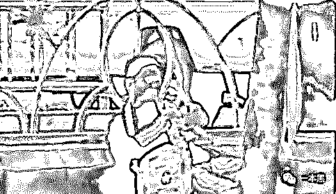

# 暗访会所、卧底洗浴中心的新闻，都是毫无新闻价值的垃圾

> 原文：[`mp.weixin.qq.com/s?__biz=MzU4ODAwNzUwMQ==&mid=2247486042&idx=1&sn=9901fcf6559c136a92ff33b30e0a40e6&chksm=fde21b78ca95926ef3105882c2aabff3d3086c2462ded47fe22e2238df272dc5399985ca2d02&scene=27#wechat_redirect`](http://mp.weixin.qq.com/s?__biz=MzU4ODAwNzUwMQ==&mid=2247486042&idx=1&sn=9901fcf6559c136a92ff33b30e0a40e6&chksm=fde21b78ca95926ef3105882c2aabff3d3086c2462ded47fe22e2238df272dc5399985ca2d02&scene=27#wechat_redirect)

【黑话连篇】
**该栏目更多的是揭露事件或对事件的看法，以达到让人精神得到升华的目的。**

* * *

**正如题目所说，所有打着暗访会所、卧底洗浴中心的新闻，都是毫无意义、毫无价值的垃圾。******无一例外。******为什么要说这样一句话，想必各位已经看过前几天关于四川电视台暗访的新闻了吧。****新闻里，一名记者以暗访的身份突袭某按摩店，随后站街女把记者带进一个暧昧的小房间，期间发生了如下对话：**

> ***站街女：“来耍一哈哇，耍一哈 200。”******站街女：“来涩，嗨呀还害羞说。”******记者：“我又不晓得你这个干不干净。”******站街女：“干净、干净得很。”******......***

**其实，在现在的电视媒体环境下，这种类似暗访按摩院、暗访会所的新闻早已是铺天盖地。****本身此类话题就比较能吸引大众眼球，但这次四川电视台不但不墨守成规，反而推陈出新，搞出了一些令人窒息的骚操作。****在节目中，记者的下体部位直接暴露在电视镜头上，关键是还没有打码。**** ****此事一出，立刻引起了网友的讨论。****很多观众立即发微博表示：“如果一家人恰好一起看电视，这个场面该多尴尬啊。”****可能是经不住舆论的压力，随后四川广播电视台官方微信公众号发布了道歉信，针对此事做出了回应。****   ****从道歉信中可以看出，四川电视台认为出现此事的根本原因是：**由于编审人员责任心不强、疏忽大意、审核不严，导致当时并未发现节目中的不当画面。********还说他们的初衷是对社会不良现象进行舆论监督，但由于麻痹大意、把关不严、责任心缺失，导致了不当画面流出。********看到这里我想说，你可拉倒吧！**********最初的电视媒体报道，确实是起到过监督的作用，但现在，我呸。**********要不是为了制造猎奇、吸引眼球，谁会去做这种报道。再者说，这种报道的意义何在？难道就凭你一次暗访，这世上就再也不会出现按摩院、不正当会所了吗？********难道就凭你一次暗访，这世界就会变得欣欣向荣，从此不再有卖淫嫖娼活动了？********不现实。********据我所知，这种涉及颜色的暗访报道，早在二十年前的各地新闻媒体就开始了吧！一直到纸媒没落，从未消停过。****************也没见有报道说，这二十多年间少了几家按摩院，拯救了几个失足少女吧！********倒是他们都有一个共同点，都会以记者身体不适为由离开某洗浴中心或者按摩院，来结束一场报道。********针对此事，有人说这是典型的播出事故，是节目组在剪辑方面的严重失职，因为在传统的新闻发布里，要经过记者调查、编辑、校对、审核、制片等步骤，没有打码是因为审核出现了问题。********但朋友们，这次已经不是审核不审核的问题了。********就算视频中没有出现不正当画面，我依然认为这种新闻是垃圾。********晃动、模糊不清的画面，暧昧勾引的对话，这他么是玩呢！这明明就是在向观众传达不良性暗示啊。********这和那些漏胸漏屁股的所谓颜值主播有什么区别？********从视频的表达方式来说，这类新闻到底是为了揭露现如今性交易泛滥的现状，还是为了吸引眼球，提高收视率呢？********我想，作为大老爷们，你不会抱着了解社会新闻、关心社会现状的心态去看这类视频吧！说白了，都是人性的利用。********你说作为一个有头有脸的官方媒体，你报道一点对社会有价值有意义的新闻不好吗？非要搞搞擦边、博博眼球，这就算了，但你好歹打个码呀，再不济也得考虑电视机前的小朋友啊！********一个省级电视台，不把镜头对准老百姓更关注的事件，却热衷报道一个小按摩店，用一把牛刀去切一只蚊子，然后还洋洋自得以为对社会做出多大贡献似的。********再说说那些每次被报道的站街女们，她们可以说是一群放弃尊严，在社会底层卑贱营生的人，为什么会出现如此之多的卑贱职业，这个宏大的社会问题怎么没见有人讨论，并作出相应的改变呢。********虽然传统电视节目在移动互联网的冲击下，越发艰难，但也不能为了收视率丢掉新闻人该有的坚持啊。********随便带个针孔摄像头去公费嫖娼，爽完顺便完成任务也叫暗访的话，那是不是混进大妈们的广场舞中也算是暗访？********现在搜索引擎上随便输入关键词，就有几百万条相关信息，但是仔细观看你会发现，这些内容基本都大同小异，到店、询问价格、服务项目、服务流程.....记者有事借故离开......****************虽然这些暗访视频都比较真实，完全遵循了新闻的几个要素，但其实这类新闻是没有任何社会价值的。**********如果非要说社会价值的话，那可能就是勾引广大男性的好奇心，成为未成年的性启蒙新闻，并不断地刺激和推动这个行业的发展......**********真是荒谬至极。********暗访一词，在我看来是严肃且极具挑战的，它是指暗中调查以寻求有效信息的一种调查手段。********十年前，有个名叫**慕容雪村**的人，卧底潜入江西上饶的一个传销团伙，并在其中生活了 23 天。********期间掌握了传销团伙的活动规律和大部分窝点的分布情况，并根据收集到的线索向公安机关报案，协作警方捣毁该传销团伙，共解救出 157 名传销人员。********后来他把这一经历写成一本书，叫**《中国，少了一味药》**。********他虽然不能帮助更多的人脱离苦难，但是他能让人认识一部分苦难，他不能帮人做梦，但是他愿意指出哪些是梦，哪些是现实。********2011 年 8 月 17 号。********一名叫**崔松旺**的记者，以 500 元的价格，把自己给卖了。********起因是当年的山西黑砖窑案，窑厂人贩子专挑心智不成熟的未成年人和智障人士下手，把他们拐卖到黑窑厂。********这些被拐卖的人每天只能吃馒头和水，如果不听话就会被往死里打，有人被打死直接就被拖到荒山就地埋掉。********崔松旺在看到这则新闻后，决定孤身卧底到黑窑厂进行记录。****************他连续两周不洗澡、不刷牙、不刮胡子，在火车站假扮智障人，最终”如愿“被卖到黑窑厂干活，卧底期间多次被打，后来协助警方控制 8 名黑窑厂老板，**解救智障奴工 30 名**。********在我看来，这才叫暗访，这才叫调查。它真真切切的体现出了暗访调查的价值，哪像**现在某些电视媒体，为了收视率，时不时就暗访按摩店、会所，搞得跟过节似的。**********但是，批评归批评，也不能因为一件事就对其下定义做最终判断，最起码在其他新闻的报道上，他们也曾做过贡献。********新闻是社会的眼睛，帮助我们去看见一些我们看不到也看不懂的真相；同时新闻也是社会的喉舌，帮助我们去发出一些我们不曾说也不能说的声音。********我们并不是要求每一则新闻都必须有社会意义，娱乐新闻同样有其价值所在。********我们在意的是作为媒体应该发出与自身位置相匹配的声音，省级卫视没事就卧底洗浴中心这种事显然是在用牛刀砍蚊子，平白浪费资源。********就让上帝的归上帝，恺撒的归恺撒。********不是每一则新闻都能像【穹顶之下】一样，让我们去看见。但即使是歌舞升平，国泰民安也比街头巷尾的按摩店的现实意义更大，起码那能给我们带来一些精神上的抚慰。********我记得白岩松老师说过一句话：**“媒体要当啄木鸟，通过叼出树干上的一个又一个害虫，维护整个森林的健康。****”**********这句话在某些方面来说，一点毛病都没有。**********但又有多少媒体人能做到呢！******************还原事实｜专扒黑产********微信 ID：darkinsider****************知乎 一本黑********微博 一本黑 007********投稿、爆料、招聘、转载********请联系微信：chenchen_19940612********约稿、内容合作、联系：yibenheiSW****